# 设置界面组件

<cite>
**本文档引用的文件**
- [Settings.tsx](file://src/components/Settings/Settings.tsx)
- [Config.tsx](file://src/components/Settings/Config.tsx)
- [Usage.tsx](file://src/components/Settings/Usage.tsx)
- [Status.tsx](file://src/components/Settings/Status.tsx)
- [settings.ts](file://src/utils/settings/settings.ts)
- [types.ts](file://src/utils/settings/types.ts)
- [config.ts](file://src/utils/config.ts)
</cite>

## 目录
1. [简介](#简介)
2. [项目结构](#项目结构)
3. [核心组件](#核心组件)
4. [架构概览](#架构概览)
5. [详细组件分析](#详细组件分析)
6. [依赖关系分析](#依赖关系分析)
7. [性能考虑](#性能考虑)
8. [故障排除指南](#故障排除指南)
9. [结论](#结论)

## 简介

设置界面组件是 Claude Code 应用程序中的核心配置管理系统，提供了完整的用户界面来管理应用程序的各种设置选项。该系统采用模块化架构设计，支持多种配置源的合并、验证和持久化存储。

本组件集成了现代化的 React 设计模式，包括 Suspense 异步加载、自定义 Hook 和状态管理。系统支持实时配置更新、搜索过滤、键盘快捷键导航和响应式布局。

## 项目结构

设置界面组件位于 `src/components/Settings/` 目录下，包含以下主要文件：

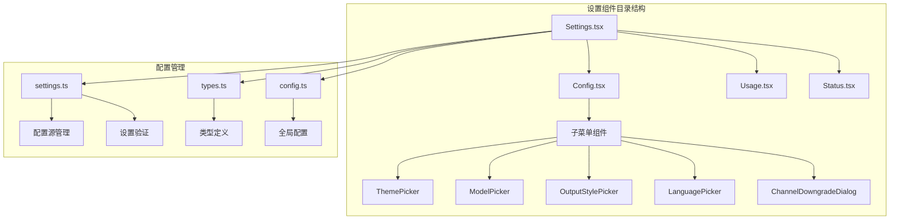

**图表来源**
- [Settings.tsx:1-137](file://src/components/Settings/Settings.tsx#L1-L137)
- [Config.tsx:1-1822](file://src/components/Settings/Config.tsx#L1-L1822)

**章节来源**
- [Settings.tsx:1-137](file://src/components/Settings/Settings.tsx#L1-L137)
- [Config.tsx:1-1822](file://src/components/Settings/Config.tsx#L1-L1822)

## 核心组件

### 主要组件架构

设置系统由四个核心组件构成，每个组件负责特定的功能领域：

1. **Settings 组件** - 主容器和导航控制
2. **Config 组件** - 配置项管理界面
3. **Usage 组件** - 使用统计和限额显示
4. **Status 组件** - 系统诊断信息展示

### 配置数据流

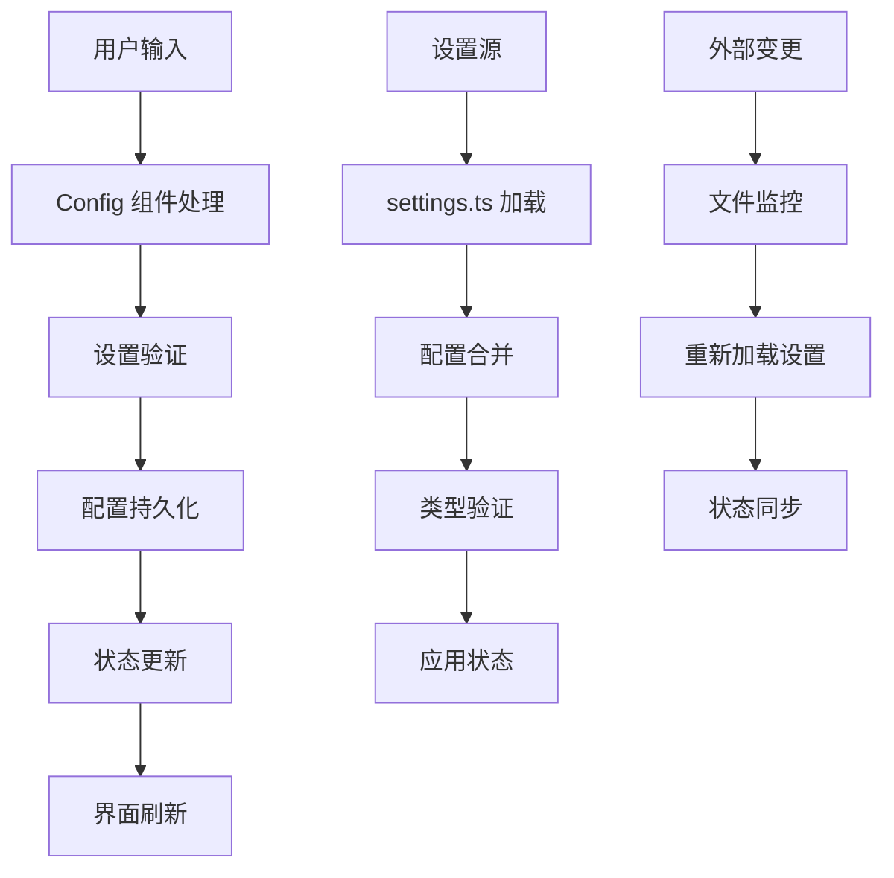

**图表来源**
- [Config.tsx:1360-1402](file://src/components/Settings/Config.tsx#L1360-L1402)
- [settings.ts:645-796](file://src/utils/settings/settings.ts#L645-L796)

**章节来源**
- [Config.tsx:1360-1402](file://src/components/Settings/Config.tsx#L1360-L1402)
- [settings.ts:645-796](file://src/utils/settings/settings.ts#L645-L796)

## 架构概览

设置系统采用分层架构设计，确保了良好的可维护性和扩展性：

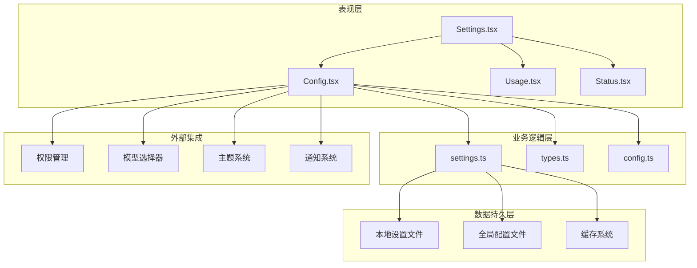

**图表来源**
- [Settings.tsx:1-137](file://src/components/Settings/Settings.tsx#L1-L137)
- [Config.tsx:1-1822](file://src/components/Settings/Config.tsx#L1-L1822)

### 数据模型设计

设置系统使用 Zod 模式验证确保配置数据的完整性和一致性：

```mermaid
erDiagram
SETTINGS {
string $schema
object permissions
string model
array enabledPlugins
object hooks
object sandbox
string outputStyle
string language
boolean verbose
object env
string apiKeyHelper
}
GLOBAL_CONFIG {
string theme
boolean verbose
boolean autoUpdates
string preferredNotifChannel
object customApiKeyResponses
boolean respectGitignore
boolean copyFullResponse
boolean fileCheckpointingEnabled
boolean terminalProgressBarEnabled
boolean showTurnDuration
boolean autoCompactEnabled
object projects
}
PERMISSIONS {
array allow
array deny
array ask
string defaultMode
boolean disableBypassPermissionsMode
array additionalDirectories
}
SETTINGS ||--|| GLOBAL_CONFIG : "使用"
SETTINGS ||--|| PERMISSIONS : "包含"
```

**图表来源**
- [types.ts:255-1073](file://src/utils/settings/types.ts#L255-L1073)
- [config.ts:183-578](file://src/utils/config.ts#L183-L578)

**章节来源**
- [types.ts:255-1073](file://src/utils/settings/types.ts#L255-L1073)
- [config.ts:183-578](file://src/utils/config.ts#L183-L578)

## 详细组件分析

### Settings 主容器组件

Settings 组件作为整个设置界面的主容器，负责管理标签页切换、键盘导航和布局控制：

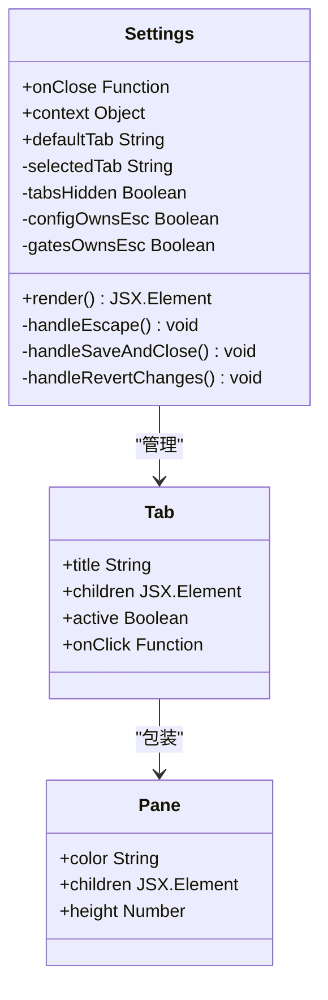

**图表来源**
- [Settings.tsx:15-21](file://src/components/Settings/Settings.tsx#L15-L21)
- [Settings.tsx:22-130](file://src/components/Settings/Settings.tsx#L22-L130)

#### 标签页导航逻辑

Settings 组件实现了智能的标签页导航系统，支持键盘快捷键和鼠标交互：

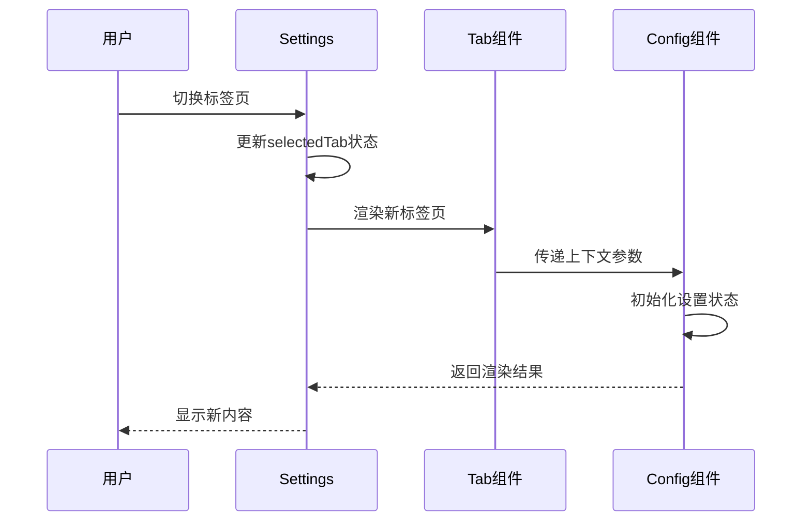

**图表来源**
- [Settings.tsx:114-129](file://src/components/Settings/Settings.tsx#L114-L129)

**章节来源**
- [Settings.tsx:15-130](file://src/components/Settings/Settings.tsx#L15-L130)

### Config 配置管理组件

Config 组件是设置系统的核心，提供了完整的配置项管理功能：

#### 配置项类型系统

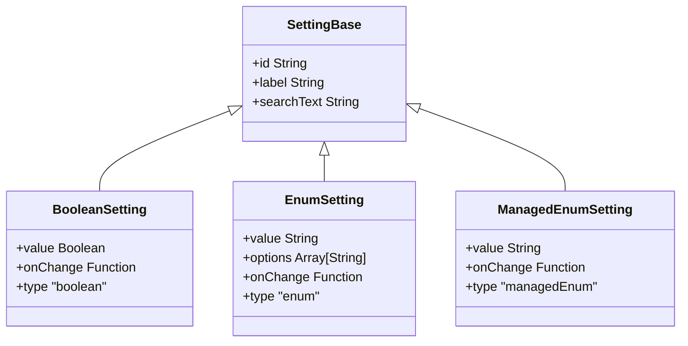

**图表来源**
- [Config.tsx:60-84](file://src/components/Settings/Config.tsx#L60-L84)

#### 配置项管理流程

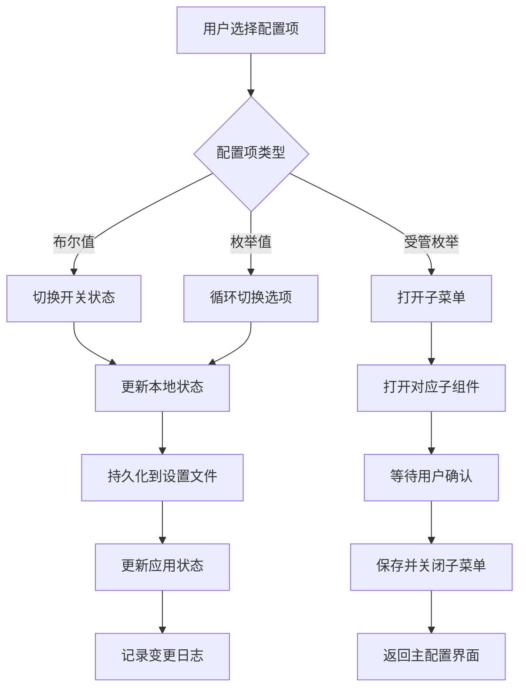

**图表来源**
- [Config.tsx:1281-1367](file://src/components/Settings/Config.tsx#L1281-L1367)

**章节来源**
- [Config.tsx:60-1822](file://src/components/Settings/Config.tsx#L60-L1822)

### Usage 使用统计组件

Usage 组件提供了详细的使用统计和限额信息：

#### 限额显示系统

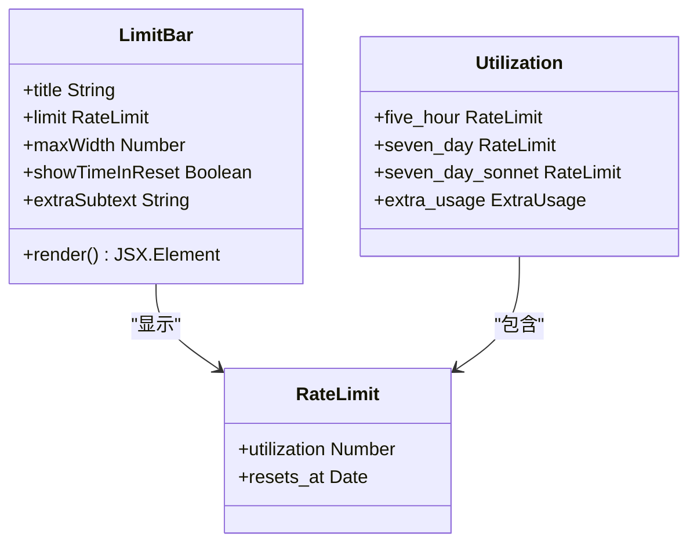

**图表来源**
- [Usage.tsx:18-24](file://src/components/Settings/Usage.tsx#L18-L24)
- [Usage.tsx:25-173](file://src/components/Settings/Usage.tsx#L25-L173)

**章节来源**
- [Usage.tsx:1-377](file://src/components/Settings/Usage.tsx#L1-L377)

### Status 系统诊断组件

Status 组件展示了系统健康状况和诊断信息：

#### 诊断信息收集流程

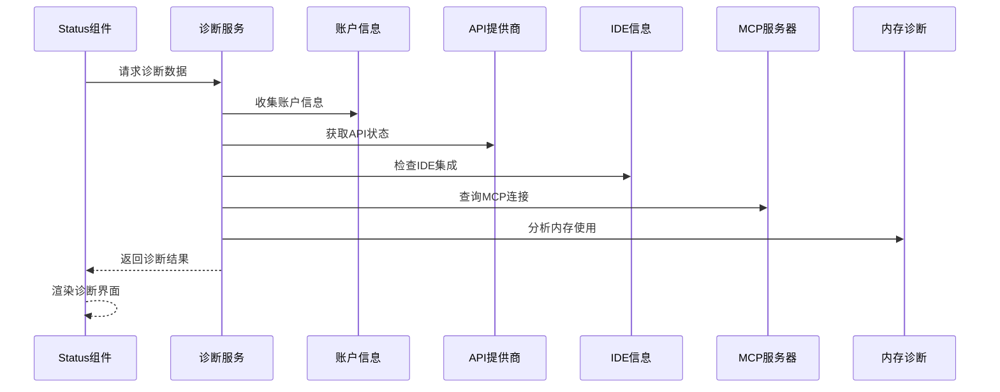

**图表来源**
- [Status.tsx:54-56](file://src/components/Settings/Status.tsx#L54-L56)

**章节来源**
- [Status.tsx:1-241](file://src/components/Settings/Status.tsx#L1-L241)

## 依赖关系分析

设置系统具有清晰的依赖层次结构，确保了模块间的松耦合：

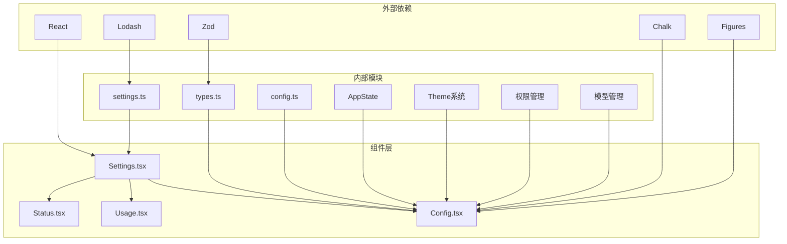

**图表来源**
- [Config.tsx:1-50](file://src/components/Settings/Config.tsx#L1-L50)
- [settings.ts:1-54](file://src/utils/settings/settings.ts#L1-L54)

### 关键依赖关系

1. **配置验证依赖** - 使用 Zod 进行类型安全验证
2. **状态管理依赖** - 通过 AppState 实现全局状态同步
3. **文件系统依赖** - 通过 fs 操作实现配置持久化
4. **主题系统依赖** - 集成主题选择器和样式管理

**章节来源**
- [Config.tsx:1-50](file://src/components/Settings/Config.tsx#L1-L50)
- [settings.ts:1-54](file://src/utils/settings/settings.ts#L1-L54)

## 性能考虑

设置系统在设计时充分考虑了性能优化：

### 缓存策略

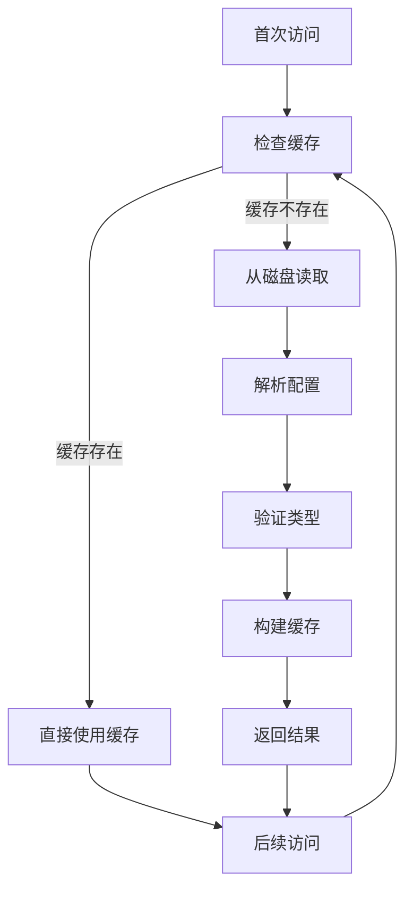

**图表来源**
- [settings.ts:856-868](file://src/utils/settings/settings.ts#L856-L868)

### 内存优化

- **懒加载** - 配置项按需加载，减少初始内存占用
- **状态快照** - 使用快照机制避免不必要的状态更新
- **事件委托** - 键盘事件统一处理，减少事件监听器数量

## 故障排除指南

### 常见问题及解决方案

#### 配置文件损坏

当配置文件格式不正确时，系统会自动降级到默认配置：

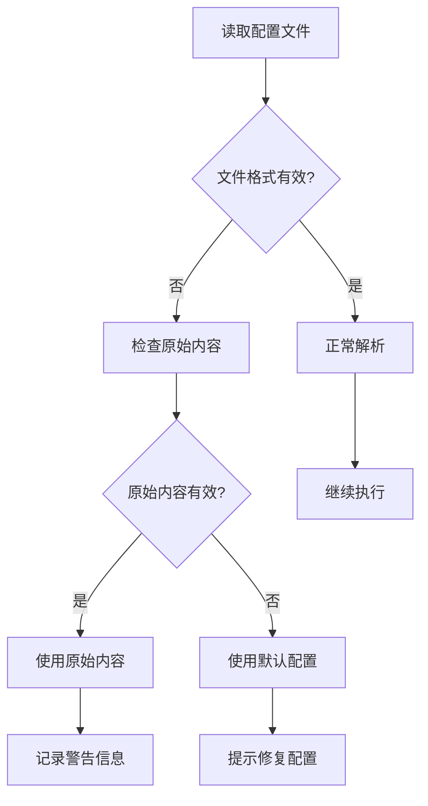

**图表来源**
- [settings.ts:442-471](file://src/utils/settings/settings.ts#L442-L471)

#### 权限验证失败

当设置验证失败时，系统会提供详细的错误信息：

**章节来源**
- [settings.ts:442-471](file://src/utils/settings/settings.ts#L442-L471)

### 调试工具

设置系统提供了丰富的调试功能：

1. **诊断模式** - 通过 `verbose` 设置启用详细日志
2. **错误报告** - 自动收集配置错误和异常信息
3. **状态监控** - 实时跟踪设置变更和应用状态

## 结论

设置界面组件展现了现代前端架构的最佳实践，通过模块化设计、类型安全验证和响应式更新机制，为用户提供了一个强大而易用的配置管理界面。

系统的主要优势包括：

- **类型安全** - 使用 Zod 进行完整的配置验证
- **性能优化** - 智能缓存和懒加载机制
- **用户体验** - 流畅的键盘导航和实时反馈
- **可扩展性** - 模块化的架构便于功能扩展
- **可靠性** - 完善的错误处理和恢复机制

该组件系统为 Claude Code 提供了坚实的基础，支持复杂的配置管理需求，同时保持了良好的性能和用户体验。