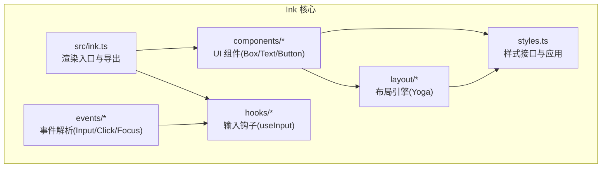
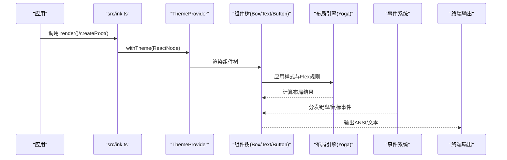
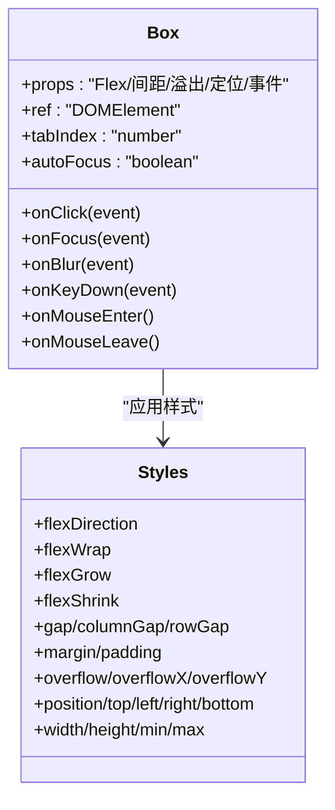
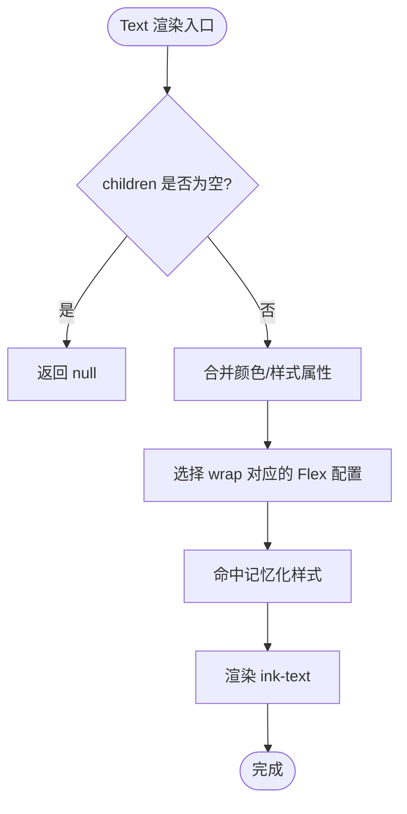
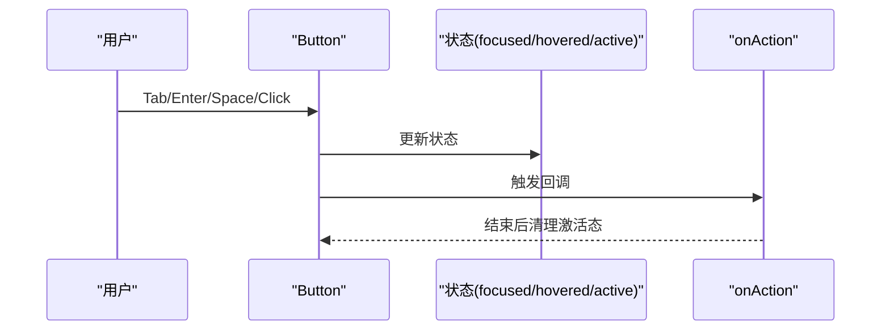
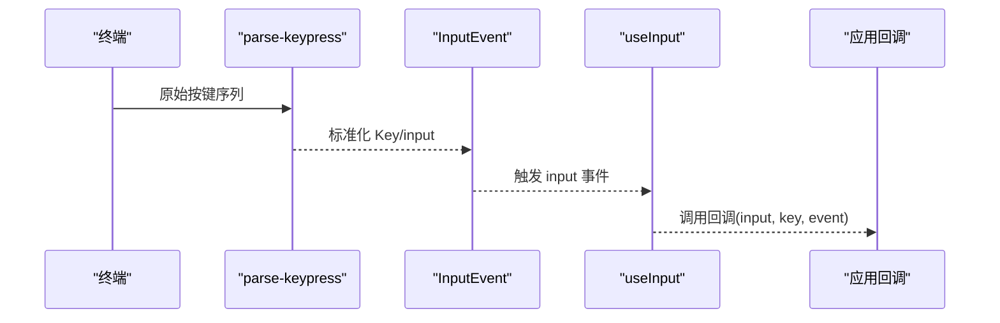
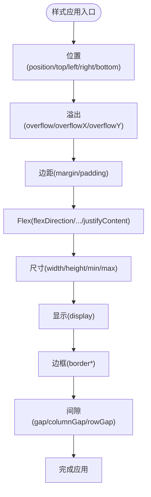
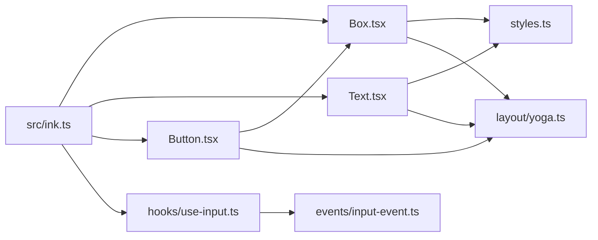

# 用户界面组件

<cite>
**本文引用的文件**
- [src/ink.ts](file://src/ink.ts)
- [src/ink/components/Box.tsx](file://src/ink/components/Box.tsx)
- [src/ink/components/Text.tsx](file://src/ink/components/Text.tsx)
- [src/ink/components/Button.tsx](file://src/ink/components/Button.tsx)
- [src/ink/events/input-event.ts](file://src/ink/events/input-event.ts)
- [src/ink/hooks/use-input.ts](file://src/ink/hooks/use-input.ts)
- [src/ink/styles.ts](file://src/ink/styles.ts)
- [src/ink/layout/engine.ts](file://src/ink/layout/engine.ts)
- [src/ink/layout/yoga.ts](file://src/ink/layout/yoga.ts)
</cite>

## 目录
1. [简介](#简介)
2. [项目结构](#项目结构)
3. [核心组件](#核心组件)
4. [架构总览](#架构总览)
5. [详细组件分析](#详细组件分析)
6. [依赖关系分析](#依赖关系分析)
7. [性能考量](#性能考量)
8. [故障排查指南](#故障排查指南)
9. [结论](#结论)
10. [附录](#附录)

## 简介
本文件面向 Claude Code 的用户界面组件系统，聚焦 Ink 组件架构、布局系统与事件处理机制。内容覆盖消息显示组件（如文本与容器）、输入处理组件（按钮与键盘输入钩子）以及设置界面的实现思路；同时提供组件定制指南、样式配置与主题支持说明，并展示组件组合模式、状态管理与性能优化策略，涵盖无障碍访问、响应式设计与跨平台兼容性建议。

## 项目结构
Ink 子系统位于 src/ink 下，采用“组件 + 布局 + 事件 + 样式”的分层组织方式：
- 组件层：Box、Text、Button 等基础 UI 元素
- 布局层：基于 Yoga 的布局引擎，提供 Flex 布局能力
- 事件层：键盘、鼠标、粘贴等输入事件解析与派发
- 样式层：统一的 Styles 接口，映射到布局与渲染节点
- 导出入口：src/ink.ts 汇总导出渲染器、主题、组件与钩子

图表来源
- [src/ink.ts:1-86](file://src/ink.ts#L1-L86)
- [src/ink/components/Box.tsx:1-213](file://src/ink/components/Box.tsx#L1-L213)
- [src/ink/components/Text.tsx:1-254](file://src/ink/components/Text.tsx#L1-L254)
- [src/ink/components/Button.tsx:1-192](file://src/ink/components/Button.tsx#L1-L192)
- [src/ink/layout/engine.ts:1-7](file://src/ink/layout/engine.ts#L1-L7)
- [src/ink/layout/yoga.ts:1-309](file://src/ink/layout/yoga.ts#L1-L309)
- [src/ink/styles.ts:1-772](file://src/ink/styles.ts#L1-L772)

章节来源
- [src/ink.ts:1-86](file://src/ink.ts#L1-L86)

## 核心组件
- 渲染入口与主题包装
  - render/createRoot 包裹 ThemeProvider，确保所有渲染均具备主题上下文
  - 导出常用组件与钩子：Box、Text、Button、useInput、useTerminalViewport 等
- 基础布局容器 Box
  - 支持 Flex 属性（方向、换行、伸缩、对齐、间距等）
  - 支持焦点、点击、键盘事件与鼠标进入/离开事件
  - 提供 tabIndex/autoFocus 控制可访问性与自动聚焦
- 文本组件 Text
  - 支持颜色、背景色、粗体/细体互斥、斜体、下划线、删除线、反色
  - 支持多种文本换行/截断策略（wrap、truncate-*）
- 交互组件 Button
  - 内置焦点/悬停/激活状态，暴露 onAction 回调
  - 支持 render prop 根据状态自定义样式
- 输入处理 useInput
  - 将 stdin 事件转换为字符串输入与按键键值对象
  - 可控制是否启用、raw 模式生命周期管理

章节来源
- [src/ink.ts:18-31](file://src/ink.ts#L18-L31)
- [src/ink/components/Box.tsx:10-45](file://src/ink/components/Box.tsx#L10-L45)
- [src/ink/components/Text.tsx:5-59](file://src/ink/components/Text.tsx#L5-L59)
- [src/ink/components/Button.tsx:10-38](file://src/ink/components/Button.tsx#L10-L38)
- [src/ink/hooks/use-input.ts:42-93](file://src/ink/hooks/use-input.ts#L42-L93)

## 架构总览
Ink 的渲染管线从顶层渲染函数开始，经过主题包装、组件树构建、布局计算、事件派发与输出刷新，最终在终端中呈现。

图表来源
- [src/ink.ts:18-31](file://src/ink.ts#L18-L31)
- [src/ink/components/Box.tsx:165-188](file://src/ink/components/Box.tsx#L165-L188)
- [src/ink/layout/yoga.ts:54-100](file://src/ink/layout/yoga.ts#L54-L100)
- [src/ink/events/input-event.ts:192-205](file://src/ink/events/input-event.ts#L192-L205)

## 详细组件分析

### Box 容器组件
- 功能特性
  - Flex 布局：flexDirection/flexWrap/flexGrow/flexShrink/flexBasis
  - 间距与边距：gap/columnGap/rowGap 与 margin/padding 的多维支持
  - 溢出控制：overflow/overflowX/overflowY，支持 scroll 与隐藏
  - 位置与尺寸：position/top/left/right/bottom、width/height/min/max
  - 事件：onClick/onFocus/onBlur/onKeyDown/onMouseEnter/onMouseLeave
  - 可访问性：tabIndex/-1 表示仅编程聚焦；autoFocus 首次挂载聚焦
- 性能与复杂度
  - 样式应用通过 Yoga 节点映射，布局复杂度 O(n)（n 为节点数）
  - 溢出 scroll 模式触发虚拟滚动相关逻辑（由样式层标记）
- 使用建议
  - 合理设置 overflow 以避免无界增长导致布局抖动
  - 使用 gap 统一网格间距，减少嵌套层级

图表来源
- [src/ink/components/Box.tsx:10-45](file://src/ink/components/Box.tsx#L10-L45)
- [src/ink/styles.ts:55-404](file://src/ink/styles.ts#L55-L404)

章节来源
- [src/ink/components/Box.tsx:10-45](file://src/ink/components/Box.tsx#L10-L45)
- [src/ink/styles.ts:55-404](file://src/ink/styles.ts#L55-L404)

### Text 文本组件
- 功能特性
  - 文本样式：color/background/dim/bold/italic/underline/strikethrough/inverse
  - 文本换行/截断：wrap、wrap-trim、end、middle、truncate-* 系列
- 实现要点
  - 互斥粗细：bold 与 dim 互斥，保证终端渲染一致性
  - 样式记忆化：按 wrap 类型缓存对应 Flex 配置，减少重复计算
- 使用建议
  - 对长文本优先使用 wrap 或 truncate-* 控制宽度
  - 使用 inverse 时注意对比度与可读性

图表来源
- [src/ink/components/Text.tsx:114-254](file://src/ink/components/Text.tsx#L114-L254)
- [src/ink/styles.ts:60-109](file://src/ink/styles.ts#L60-L109)

章节来源
- [src/ink/components/Text.tsx:114-254](file://src/ink/components/Text.tsx#L114-L254)
- [src/ink/styles.ts:60-109](file://src/ink/styles.ts#L60-L109)

### Button 交互组件
- 功能特性
  - 状态：focused/hovered/active，支持 render prop 自定义样式
  - 交互：Enter/Space 键与鼠标点击触发 onAction
  - 可访问性：tabIndex/-1；autoFocus；键盘按下短暂激活反馈
- 实现要点
  - 使用 useState 管理内部状态，useEffect 清理激活定时器
  - 将键盘事件与点击事件统一映射到 onAction
- 使用建议
  - 在 render prop 中根据状态切换前景/背景色或加粗
  - 为无障碍考虑，提供明确的标签与提示文案

图表来源
- [src/ink/components/Button.tsx:39-192](file://src/ink/components/Button.tsx#L39-L192)

章节来源
- [src/ink/components/Button.tsx:39-192](file://src/ink/components/Button.tsx#L39-L192)

### 输入处理与事件系统
- useInput 钩子
  - 在挂载阶段启用 raw 模式，卸载时恢复
  - 监听 stdin 的 input 事件，将字符与键值传递给回调
  - 支持 isActive 控制是否接收输入，避免重复处理
- InputEvent 解析
  - 将原始按键序列解析为标准化 Key 对象与 input 字符串
  - 处理 CSI u、application keypad、modifyOtherKeys 等特殊序列
  - 过滤非字母数字键（方向键、功能键等）对 input 的影响
- 事件派发与顺序
  - 事件系统负责将解析后的事件分发至组件树
  - 通过 stopImmediatePropagation 控制事件冒泡顺序

图表来源
- [src/ink/hooks/use-input.ts:42-93](file://src/ink/hooks/use-input.ts#L42-L93)
- [src/ink/events/input-event.ts:192-205](file://src/ink/events/input-event.ts#L192-L205)

章节来源
- [src/ink/hooks/use-input.ts:42-93](file://src/ink/hooks/use-input.ts#L42-L93)
- [src/ink/events/input-event.ts:27-190](file://src/ink/events/input-event.ts#L27-L190)

### 布局系统与样式应用
- 布局引擎
  - createLayoutNode -> YogaLayoutNode，封装 Yoga 节点操作
  - 支持插入/移除子节点、计算布局、设置测量函数、标记脏节点
- 样式应用流程
  - styles(node, style, resolvedStyle) 将 Styles 映射到 Yoga 节点
  - 位置/溢出/边距/内边距/Flex/尺寸/显示/边框/间隙等逐一应用
- 性能与复杂度
  - 布局计算复杂度 O(n)，受节点数量与约束条件影响
  - scroll 模式启用时，渲染阶段进行滚动偏移与裁剪

图表来源
- [src/ink/layout/engine.ts:4-6](file://src/ink/layout/engine.ts#L4-L6)
- [src/ink/layout/yoga.ts:54-297](file://src/ink/layout/yoga.ts#L54-L297)
- [src/ink/styles.ts:406-771](file://src/ink/styles.ts#L406-L771)

章节来源
- [src/ink/layout/engine.ts:4-6](file://src/ink/layout/engine.ts#L4-L6)
- [src/ink/layout/yoga.ts:54-297](file://src/ink/layout/yoga.ts#L54-L297)
- [src/ink/styles.ts:406-771](file://src/ink/styles.ts#L406-L771)

## 依赖关系分析
- 组件与样式
  - Box/Text/Button 依赖 styles.ts 的 Styles 接口，通过 Yoga 节点应用到布局
- 事件与输入
  - useInput 依赖 StdinContext 与 EventEmitter，InputEvent 负责按键解析
- 布局与渲染
  - layout/engine 与 layout/yoga 提供布局节点与适配器
- 主题与渲染入口
  - src/ink.ts 暴露 render/createRoot 并包裹 ThemeProvider

图表来源
- [src/ink/components/Box.tsx:1-213](file://src/ink/components/Box.tsx#L1-L213)
- [src/ink/components/Text.tsx:1-254](file://src/ink/components/Text.tsx#L1-L254)
- [src/ink/components/Button.tsx:1-192](file://src/ink/components/Button.tsx#L1-L192)
- [src/ink/styles.ts:1-772](file://src/ink/styles.ts#L1-L772)
- [src/ink/layout/yoga.ts:1-309](file://src/ink/layout/yoga.ts#L1-L309)
- [src/ink/hooks/use-input.ts:1-93](file://src/ink/hooks/use-input.ts#L1-L93)
- [src/ink/events/input-event.ts:1-206](file://src/ink/events/input-event.ts#L1-L206)
- [src/ink.ts:1-86](file://src/ink.ts#L1-L86)

章节来源
- [src/ink.ts:1-86](file://src/ink.ts#L1-L86)
- [src/ink/hooks/use-input.ts:1-93](file://src/ink/hooks/use-input.ts#L1-L93)
- [src/ink/events/input-event.ts:1-206](file://src/ink/events/input-event.ts#L1-L206)
- [src/ink/styles.ts:1-772](file://src/ink/styles.ts#L1-L772)
- [src/ink/layout/yoga.ts:1-309](file://src/ink/layout/yoga.ts#L1-L309)

## 性能考量
- 布局优化
  - 合理使用 overflow 与 scroll，避免无界增长导致布局反复计算
  - 使用 gap 统一网格间距，减少嵌套层级与重排
- 渲染优化
  - Text 的 wrap 配置记忆化，减少重复样式计算
  - Button 的状态更新使用短定时器清理，避免持续重绘
- 输入处理
  - useInput 在卸载时及时关闭 raw 模式，避免资源泄漏
  - isActive 可用于多监听场景，避免重复处理同一输入流
- 主题与输出
  - render/createRoot 统一封装 ThemeProvider，减少重复包裹开销

## 故障排查指南
- 输入无效或未响应
  - 检查 useInput 的 isActive 设置与 raw 模式是否正确开启/关闭
  - 确认事件监听是否在组件挂载后注册
- 文本样式异常
  - 确认粗细样式互斥（bold/dim），避免同时设置
  - 检查 wrap/truncate 策略是否符合预期
- 布局错位或溢出
  - 检查 overflow/overflowX/overflowY 设置与 scroll 模式
  - 确认尺寸单位（绝对数值 vs 百分比）与 min/max 限制
- 可访问性问题
  - 确保交互元素具备 tabIndex，必要时使用 autoFocus
  - 为按钮提供明确的标签与状态提示

章节来源
- [src/ink/hooks/use-input.ts:42-93](file://src/ink/hooks/use-input.ts#L42-L93)
- [src/ink/components/Text.tsx:49-59](file://src/ink/components/Text.tsx#L49-L59)
- [src/ink/styles.ts:374-390](file://src/ink/styles.ts#L374-L390)
- [src/ink/components/Button.tsx:10-38](file://src/ink/components/Button.tsx#L10-L38)

## 结论
Ink 组件系统以 Box/Text/Button 为基础，结合 Yoga 布局引擎与事件解析体系，提供了终端友好的 UI 能力。通过统一的 Styles 接口与 ThemeProvider 包装，开发者可以快速构建可访问、可定制且高性能的命令行界面。建议在实际项目中遵循样式与布局的最佳实践，合理使用输入钩子与事件系统，并关注可访问性与跨平台兼容性。

## 附录
- 组件定制指南
  - 使用 Box 的 Flex 与间距属性构建复杂布局
  - 利用 Text 的样式与换行策略提升可读性
  - 通过 Button 的 render prop 与状态实现丰富的交互反馈
- 样式配置与主题支持
  - 所有渲染均通过 ThemeProvider 包裹，无需在每个调用处重复挂载
  - 颜色支持 rgb/hex/ansi256/ansi 等多种格式
- 无障碍访问与响应式设计
  - 通过 tabIndex/autoFocus 与键盘事件实现可访问性
  - 使用百分比尺寸与溢出控制实现响应式布局
- 跨平台兼容性
  - 事件解析已覆盖 CSI u、application keypad、modifyOtherKeys 等序列
  - 建议在不同终端环境下测试输入行为与渲染效果