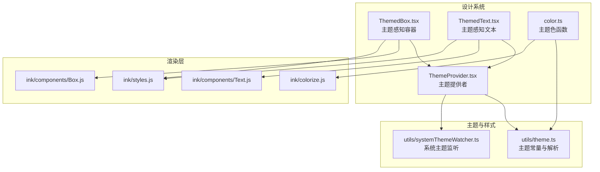
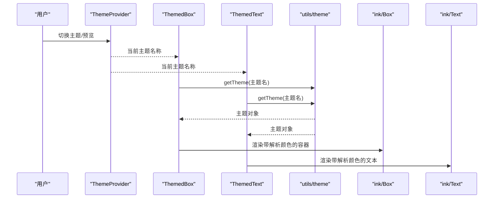
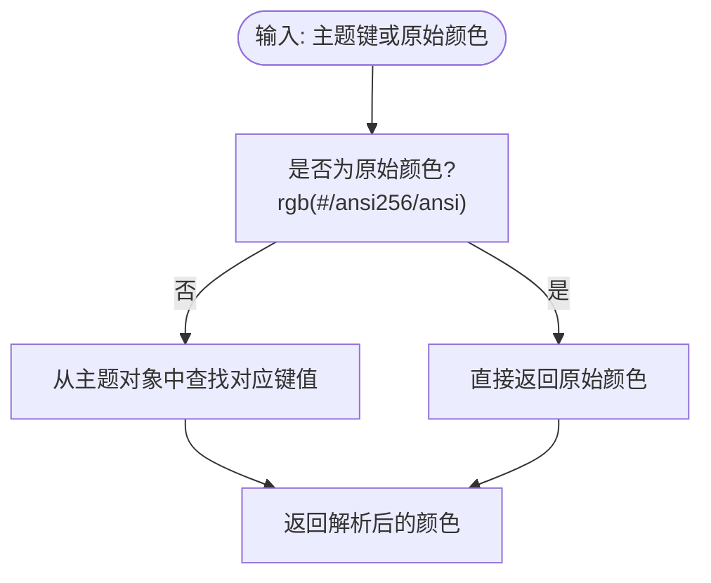
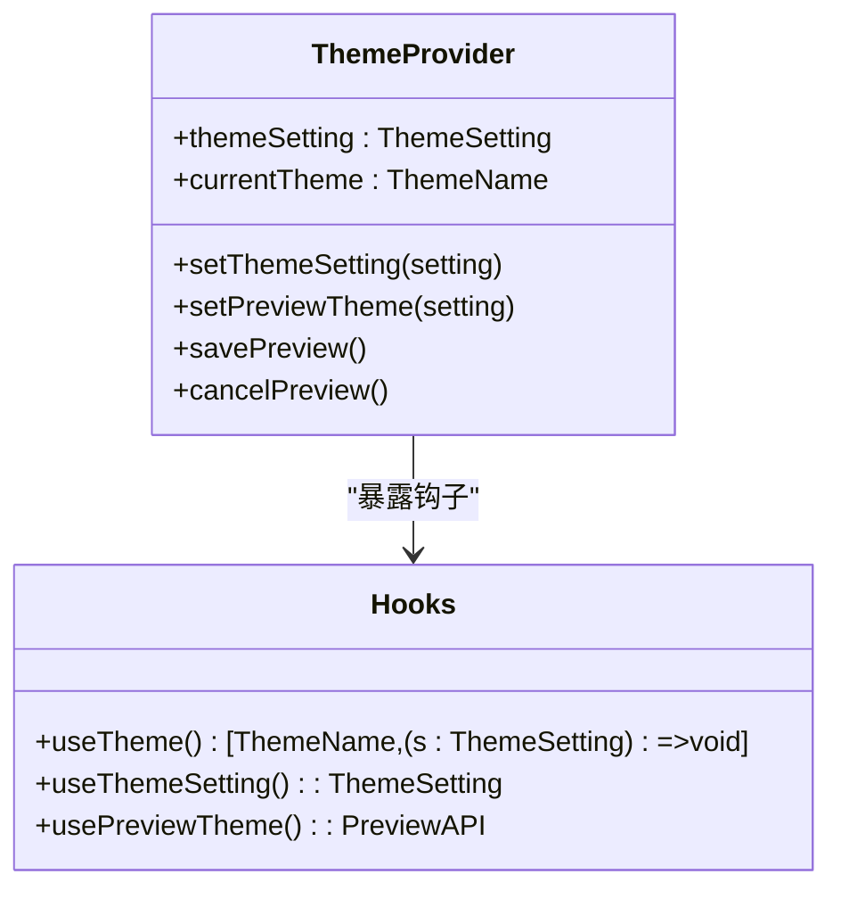
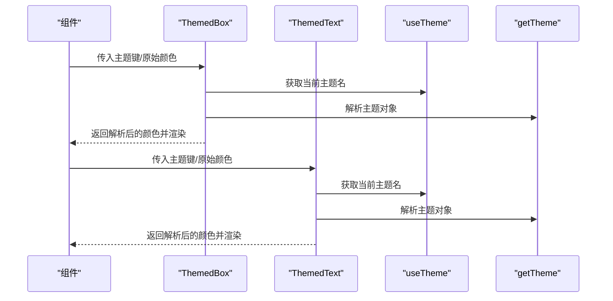
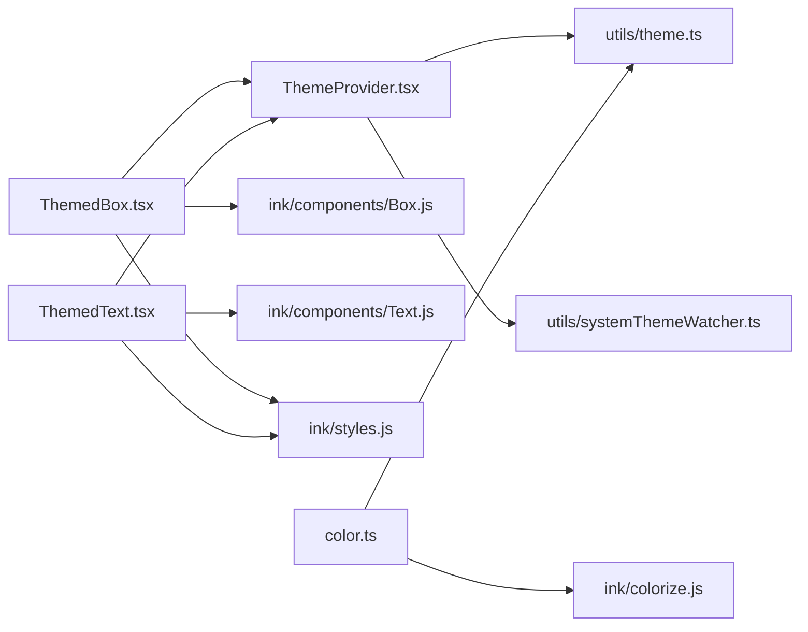

# 组件定制与扩展

<cite>
**本文引用的文件**
- [src/components/design-system/ThemeProvider.tsx](file://src/components/design-system/ThemeProvider.tsx)
- [src/components/design-system/ThemedBox.tsx](file://src/components/design-system/ThemedBox.tsx)
- [src/components/design-system/ThemedText.tsx](file://src/components/design-system/ThemedText.tsx)
- [src/components/design-system/color.ts](file://src/components/design-system/color.ts)
- [src/utils/theme.ts](file://src/utils/theme.ts)
- [src/utils/systemThemeWatcher.ts](file://src/utils/systemThemeWatcher.ts)
- [src/utils/intl.ts](file://src/utils/intl.ts)
- [src/hooks/useVoice.ts](file://src/hooks/useVoice.ts)
- [src/ink/components/Box.js](file://src/ink/components/Box.js)
- [src/ink/components/Text.js](file://src/ink/components/Text.js)
- [src/ink/styles.js](file://src/ink/styles.js)
- [src/ink/colorize.js](file://src/ink/colorize.js)
- [src/components/InvalidConfigDialog.tsx](file://src/components/InvalidConfigDialog.tsx)
- [src/components/SentryErrorBoundary.ts](file://src/components/SentryErrorBoundary.ts)
</cite>

## 目录
1. [简介](#简介)
2. [项目结构](#项目结构)
3. [核心组件](#核心组件)
4. [架构总览](#架构总览)
5. [详细组件分析](#详细组件分析)
6. [依赖关系分析](#依赖关系分析)
7. [性能考量](#性能考量)
8. [故障排查指南](#故障排查指南)
9. [结论](#结论)
10. [附录](#附录)

## 简介
本指南面向需要在终端交互界面中进行组件定制与扩展的开发者，围绕设计系统主题机制、颜色方案与样式变量、组件样式定制（含 CSS-in-JS 思路）、响应式设计支持、组件使用规范与扩展模式、自定义组件与高阶组件实践、样式覆盖与隔离策略、国际化与无障碍支持、浏览器兼容性、测试策略、性能优化与开发工具使用等方面进行全面阐述。

## 项目结构
设计系统位于 src/components/design-system 目录，围绕 ThemeProvider 提供主题上下文，ThemedBox 与 ThemedText 将主题键解析为具体颜色值，color 工具函数提供基于主题的颜色化能力；主题定义集中在 src/utils/theme.ts，并通过 Ink 的 Box/Text 组件渲染到终端。

**图表来源**
- [src/components/design-system/ThemeProvider.tsx:1-170](file://src/components/design-system/ThemeProvider.tsx#L1-L170)
- [src/components/design-system/ThemedBox.tsx:1-156](file://src/components/design-system/ThemedBox.tsx#L1-L156)
- [src/components/design-system/ThemedText.tsx:1-124](file://src/components/design-system/ThemedText.tsx#L1-L124)
- [src/components/design-system/color.ts:1-31](file://src/components/design-system/color.ts#L1-L31)
- [src/utils/theme.ts:1-640](file://src/utils/theme.ts#L1-L640)
- [src/utils/systemThemeWatcher.ts:1-3](file://src/utils/systemThemeWatcher.ts#L1-L3)
- [src/ink/components/Box.js](file://src/ink/components/Box.js)
- [src/ink/components/Text.js](file://src/ink/components/Text.js)
- [src/ink/styles.js](file://src/ink/styles.js)
- [src/ink/colorize.js](file://src/ink/colorize.js)

**章节来源**
- [src/components/design-system/ThemeProvider.tsx:1-170](file://src/components/design-system/ThemeProvider.tsx#L1-L170)
- [src/utils/theme.ts:1-640](file://src/utils/theme.ts#L1-L640)

## 核心组件
- 主题提供者 ThemeProvider：管理用户主题设置、预览状态、系统主题联动与持久化保存，暴露 useTheme/useThemeSetting/usePreviewTheme 钩子。
- 主题感知容器 ThemedBox：将主题键映射为具体颜色，透传至 Ink Box 渲染。
- 主题感知文本 ThemedText：将主题键映射为前景/背景色，支持粗体、斜体、下划线、删除线、反显等样式。
- 颜色工具 color：对字符串进行主题键解析后交由 Ink 的 colorize 渲染。

这些组件共同构成“主题键 → 具体颜色”的解析链路，确保组件样式与主题解耦，便于扩展与定制。

**章节来源**
- [src/components/design-system/ThemeProvider.tsx:1-170](file://src/components/design-system/ThemeProvider.tsx#L1-L170)
- [src/components/design-system/ThemedBox.tsx:1-156](file://src/components/design-system/ThemedBox.tsx#L1-L156)
- [src/components/design-system/ThemedText.tsx:1-124](file://src/components/design-system/ThemedText.tsx#L1-L124)
- [src/components/design-system/color.ts:1-31](file://src/components/design-system/color.ts#L1-L31)

## 架构总览
主题系统采用“上下文 + 解析器 + 渲染层”的分层架构：
- 上下文层：ThemeProvider 暴露当前主题与设置，支持自动跟随系统主题。
- 解析层：ThemedBox/ThemedText 使用 getTheme 获取主题对象，将主题键解析为具体颜色。
- 渲染层：I/O 终端渲染（非浏览器），通过 Ink 的 Box/Text 输出。

**图表来源**
- [src/components/design-system/ThemeProvider.tsx:82-116](file://src/components/design-system/ThemeProvider.tsx#L82-L116)
- [src/components/design-system/ThemedBox.tsx:100-136](file://src/components/design-system/ThemedBox.tsx#L100-L136)
- [src/components/design-system/ThemedText.tsx:101-122](file://src/components/design-system/ThemedText.tsx#L101-L122)
- [src/utils/theme.ts:598-613](file://src/utils/theme.ts#L598-L613)
- [src/ink/components/Box.js](file://src/ink/components/Box.js)
- [src/ink/components/Text.js](file://src/ink/components/Text.js)

## 详细组件分析

### 主题系统与颜色方案
- 主题类型与名称：Theme、ThemeName、ThemeSetting 定义了主题键、可选主题集合与存储设置。
- 内置主题：light、dark、light-ansi、dark-ansi、light-daltonized、dark-daltonized 等，每种主题提供一组语义化颜色键（如 text、background、success、error、diffAdded 等）。
- 颜色解析：ThemedBox/ThemedText 在渲染时调用 getTheme 获取主题对象，再将主题键解析为具体颜色值（支持 rgb/#/ansi256/ansi 原始值直通）。
- 颜色工具：color 函数接收主题键或原始颜色，最终委托 Ink 的 colorize 进行终端着色。

**图表来源**
- [src/components/design-system/ThemedBox.tsx:42-50](file://src/components/design-system/ThemedBox.tsx#L42-L50)
- [src/components/design-system/ThemedText.tsx:66-74](file://src/components/design-system/ThemedText.tsx#L66-L74)
- [src/components/design-system/color.ts:9-30](file://src/components/design-system/color.ts#L9-L30)
- [src/utils/theme.ts:598-613](file://src/utils/theme.ts#L598-L613)

**章节来源**
- [src/utils/theme.ts:4-89](file://src/utils/theme.ts#L4-L89)
- [src/utils/theme.ts:115-515](file://src/utils/theme.ts#L115-L515)
- [src/components/design-system/ThemedBox.tsx:42-50](file://src/components/design-system/ThemedBox.tsx#L42-L50)
- [src/components/design-system/ThemedText.tsx:66-74](file://src/components/design-system/ThemedText.tsx#L66-L74)
- [src/components/design-system/color.ts:9-30](file://src/components/design-system/color.ts#L9-L30)

### 主题提供者与上下文
- 主题设置：支持 'auto' 自动跟随系统主题，以及具体的主题名称集合。
- 预览与保存：提供预览主题、保存预览、取消预览的能力，避免频繁写入配置。
- 系统主题联动：当启用 'auto' 且具备查询器时，通过系统主题监听器动态更新当前主题。
- 默认回退：无 Provider 的场景下，默认使用深色主题，保证测试与工具链可用。

**图表来源**
- [src/components/design-system/ThemeProvider.tsx:8-17](file://src/components/design-system/ThemeProvider.tsx#L8-L17)
- [src/components/design-system/ThemeProvider.tsx:122-169](file://src/components/design-system/ThemeProvider.tsx#L122-L169)

**章节来源**
- [src/components/design-system/ThemeProvider.tsx:43-116](file://src/components/design-system/ThemeProvider.tsx#L43-L116)
- [src/utils/systemThemeWatcher.ts:1-3](file://src/utils/systemThemeWatcher.ts#L1-L3)

### 主题感知容器与文本组件
- ThemedBox：解析边框与背景颜色，透传其余样式属性给 Ink Box。
- ThemedText：解析前景/背景色，支持多种文本样式修饰。
- 文本悬停颜色上下文：允许在子树中统一设置悬停态颜色，优先级高于显式 color。

**图表来源**
- [src/components/design-system/ThemedBox.tsx:100-136](file://src/components/design-system/ThemedBox.tsx#L100-L136)
- [src/components/design-system/ThemedText.tsx:101-122](file://src/components/design-system/ThemedText.tsx#L101-L122)
- [src/components/design-system/ThemeProvider.tsx:122-138](file://src/components/design-system/ThemeProvider.tsx#L122-L138)

**章节来源**
- [src/components/design-system/ThemedBox.tsx:1-156](file://src/components/design-system/ThemedBox.tsx#L1-L156)
- [src/components/design-system/ThemedText.tsx:1-124](file://src/components/design-system/ThemedText.tsx#L1-L124)

### 组件样式定制与 CSS-in-JS 思路
- 设计系统采用“主题键 + 解析器”的 CSS-in-JS 思想：以语义化键名替代硬编码颜色，实现样式与主题解耦。
- 扩展建议：
  - 新增语义化颜色键：在主题对象中添加新键，保持命名一致性。
  - 包装器组件：基于 ThemedBox/ThemedText 创建业务组件，内部仅消费主题键，避免直接引用颜色值。
  - 高阶组件：对现有组件进行二次封装，注入主题解析逻辑或默认样式。

**章节来源**
- [src/utils/theme.ts:4-89](file://src/utils/theme.ts#L4-L89)
- [src/components/design-system/ThemedBox.tsx:12-37](file://src/components/design-system/ThemedBox.tsx#L12-L37)
- [src/components/design-system/ThemedText.tsx:12-61](file://src/components/design-system/ThemedText.tsx#L12-L61)

### 响应式设计支持
- 终端环境限制：不支持传统 CSS 媒体查询与断点，需通过运行时检测终端特性（如颜色深度）与用户偏好（主题）来适配显示效果。
- 可用策略：
  - 颜色深度降级：在真彩不可用时选择 ANSI 主题（light-ansi/dark-ansi）。
  - 无障碍友好：提供色觉友好主题（light-daltonized/dark-daltonized）。
  - 动态主题：在 'auto' 模式下监听系统主题变化，实时切换。

**章节来源**
- [src/utils/theme.ts:197-353](file://src/utils/theme.ts#L197-L353)
- [src/components/design-system/ThemeProvider.tsx:64-80](file://src/components/design-system/ThemeProvider.tsx#L64-L80)

### 设计系统组件使用规范与扩展模式
- 使用规范：
  - 优先使用主题键而非硬编码颜色。
  - 文本组件支持多类样式修饰，按需组合。
  - 容器组件用于布局与边框/背景色，避免在容器内重复设置颜色。
- 扩展模式：
  - 继承：基于 ThemedBox/ThemedText 创建业务组件，复用主题解析能力。
  - 组合：通过组合多个主题感知组件构建复杂 UI。
  - 包装：对外暴露语义化 props，内部统一解析为主题键。

**章节来源**
- [src/components/design-system/ThemedText.tsx:12-61](file://src/components/design-system/ThemedText.tsx#L12-L61)
- [src/components/design-system/ThemedBox.tsx:12-37](file://src/components/design-system/ThemedBox.tsx#L12-L37)

### 自定义组件、包装器与高阶组件
- 自定义组件：以 ThemedBox/ThemedText 为基础，封装业务语义（如按钮、卡片、对话框等）。
- 包装器：对现有组件进行轻量包装，注入主题解析与默认样式。
- 高阶组件：在渲染前后注入主题上下文或处理主题键转换逻辑。

**章节来源**
- [src/components/design-system/ThemedBox.tsx:56-156](file://src/components/design-system/ThemedBox.tsx#L56-L156)
- [src/components/design-system/ThemedText.tsx:80-124](file://src/components/design-system/ThemedText.tsx#L80-L124)

### 样式覆盖策略、类名管理与样式隔离
- 终端渲染特点：无 CSS 类名体系，样式通过 Ink 组件的 props 传递，不存在类名冲突。
- 覆盖策略：
  - 局部覆盖：在具体组件中直接传入原始颜色值覆盖主题键。
  - 全局覆盖：通过修改主题键值影响全局（谨慎使用）。
- 样式隔离：组件间通过上下文与 props 传递样式，避免全局污染。

**章节来源**
- [src/components/design-system/ThemedBox.tsx:42-50](file://src/components/design-system/ThemedBox.tsx#L42-L50)
- [src/components/design-system/ThemedText.tsx:66-74](file://src/components/design-system/ThemedText.tsx#L66-L74)

### 国际化支持与无障碍特性
- 国际化：通过 Intl 工具缓存 Segmenter/RelativeTimeFormat 实例，减少初始化开销，提升渲染性能。
- 无障碍：提供色觉友好主题，确保不同色觉需求用户均可清晰识别信息。

**章节来源**
- [src/utils/intl.ts:1-94](file://src/utils/intl.ts#L1-L94)
- [src/utils/theme.ts:359-434](file://src/utils/theme.ts#L359-L434)
- [src/utils/theme.ts:521-596](file://src/utils/theme.ts#L521-L596)

### 浏览器兼容性
- 终端渲染：非浏览器环境，不涉及浏览器兼容性问题；但需考虑不同终端对颜色与字体的支持差异。
- 颜色深度：根据终端能力选择真彩或 ANSI 主题。

**章节来源**
- [src/utils/theme.ts:197-353](file://src/utils/theme.ts#L197-L353)

### 组件测试策略
- 单元测试：针对主题键解析与颜色工具函数进行断言，验证不同主题下的输出。
- 集成测试：在 ThemeProvider 包裹下渲染 ThemedBox/ThemedText，验证主题切换与预览功能。
- 错误边界：使用错误边界组件捕获异常，避免应用崩溃。

**章节来源**
- [src/components/SentryErrorBoundary.ts:1-28](file://src/components/SentryErrorBoundary.ts#L1-L28)

## 依赖关系分析
- 组件依赖：ThemedBox/ThemedText 依赖 ThemeProvider 提供的主题上下文与 utils/theme 的主题解析。
- 渲染依赖：I/O 终端渲染，依赖 Ink 的 Box/Text 与 styles/colorize。
- 系统主题：在启用 'auto' 时依赖系统主题监听器。

**图表来源**
- [src/components/design-system/ThemeProvider.tsx:1-170](file://src/components/design-system/ThemeProvider.tsx#L1-L170)
- [src/components/design-system/ThemedBox.tsx:1-156](file://src/components/design-system/ThemedBox.tsx#L1-L156)
- [src/components/design-system/ThemedText.tsx:1-124](file://src/components/design-system/ThemedText.tsx#L1-L124)
- [src/components/design-system/color.ts:1-31](file://src/components/design-system/color.ts#L1-L31)
- [src/utils/theme.ts:1-640](file://src/utils/theme.ts#L1-L640)
- [src/utils/systemThemeWatcher.ts:1-3](file://src/utils/systemThemeWatcher.ts#L1-L3)
- [src/ink/components/Box.js](file://src/ink/components/Box.js)
- [src/ink/components/Text.js](file://src/ink/components/Text.js)
- [src/ink/styles.js](file://src/ink/styles.js)
- [src/ink/colorize.js](file://src/ink/colorize.js)

**章节来源**
- [src/components/design-system/ThemeProvider.tsx:1-170](file://src/components/design-system/ThemeProvider.tsx#L1-L170)
- [src/utils/theme.ts:1-640](file://src/utils/theme.ts#L1-L640)

## 性能考量
- 主题解析缓存：主题对象按名称解析一次，后续复用，避免重复计算。
- 渲染优化：ThemedBox/ThemedText 内部使用记忆化逻辑，仅在关键 prop 变更时重新渲染。
- 终端渲染：I/O 渲染路径短，性能主要受终端渲染吞吐限制。
- 国际化实例缓存：Segmenter/RelativeTimeFormat 实例缓存，减少初始化成本。

**章节来源**
- [src/components/design-system/ThemedBox.tsx:56-156](file://src/components/design-system/ThemedBox.tsx#L56-L156)
- [src/components/design-system/ThemedText.tsx:80-124](file://src/components/design-system/ThemedText.tsx#L80-L124)
- [src/utils/intl.ts:1-94](file://src/utils/intl.ts#L1-L94)

## 故障排查指南
- 主题未生效：
  - 检查 ThemeProvider 是否正确包裹根组件。
  - 确认主题设置是否为 'auto' 且系统主题监听已启用。
- 颜色异常：
  - 确认传入的是主题键还是原始颜色值；若为原始颜色，确保格式正确。
  - 检查终端颜色深度与主题匹配情况（真彩 vs ANSI）。
- 国际化显示问题：
  - 确认系统区域设置与语言环境；必要时降级到默认语言。
- 错误处理：
  - 使用错误边界组件捕获并抑制异常渲染，避免影响整体体验。

**章节来源**
- [src/components/design-system/ThemeProvider.tsx:64-80](file://src/components/design-system/ThemeProvider.tsx#L64-L80)
- [src/components/design-system/ThemedBox.tsx:42-50](file://src/components/design-system/ThemedBox.tsx#L42-L50)
- [src/components/design-system/ThemedText.tsx:66-74](file://src/components/design-system/ThemedText.tsx#L66-L74)
- [src/utils/intl.ts:72-94](file://src/utils/intl.ts#L72-L94)
- [src/components/SentryErrorBoundary.ts:1-28](file://src/components/SentryErrorBoundary.ts#L1-L28)

## 结论
该设计系统通过“主题键 + 解析器 + 渲染层”的架构实现了主题与样式的解耦，既满足了终端环境的渲染特性，又提供了良好的可扩展性。开发者可通过语义化主题键、主题感知组件与上下文钩子快速构建一致、可维护的 UI，并在需要时进行局部覆盖或全局主题调整。

## 附录
- 术语说明：
  - 主题键：主题对象中的语义化颜色标识符。
  - 原始颜色：直接指定的 rgb/#/ansi256/ansi 颜色值。
  - ANSI 主题：仅使用标准 16 色的兼容主题，适用于真彩不可用的终端。
  - 色觉友好主题：针对色觉障碍用户的颜色调整版本。