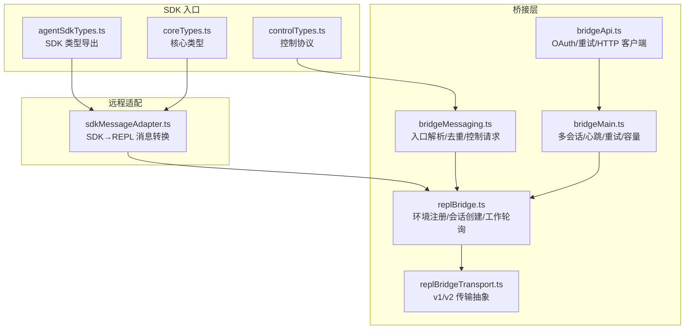
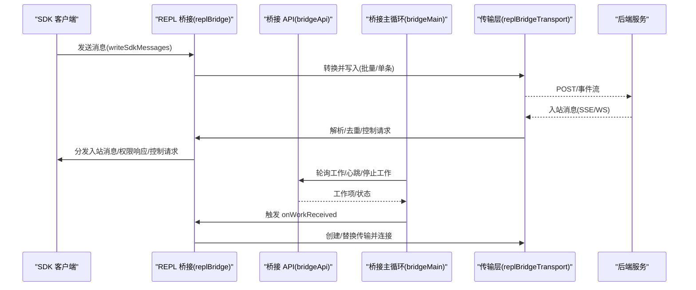
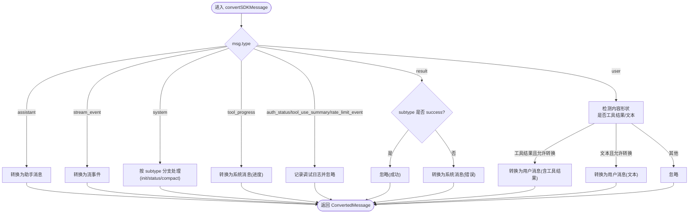
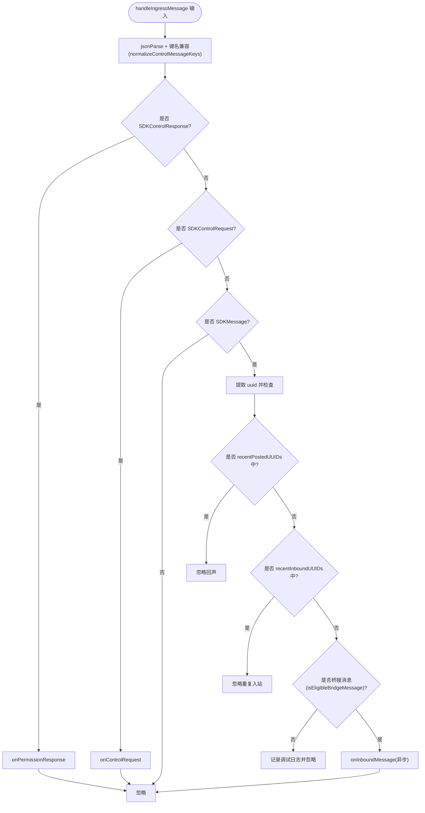
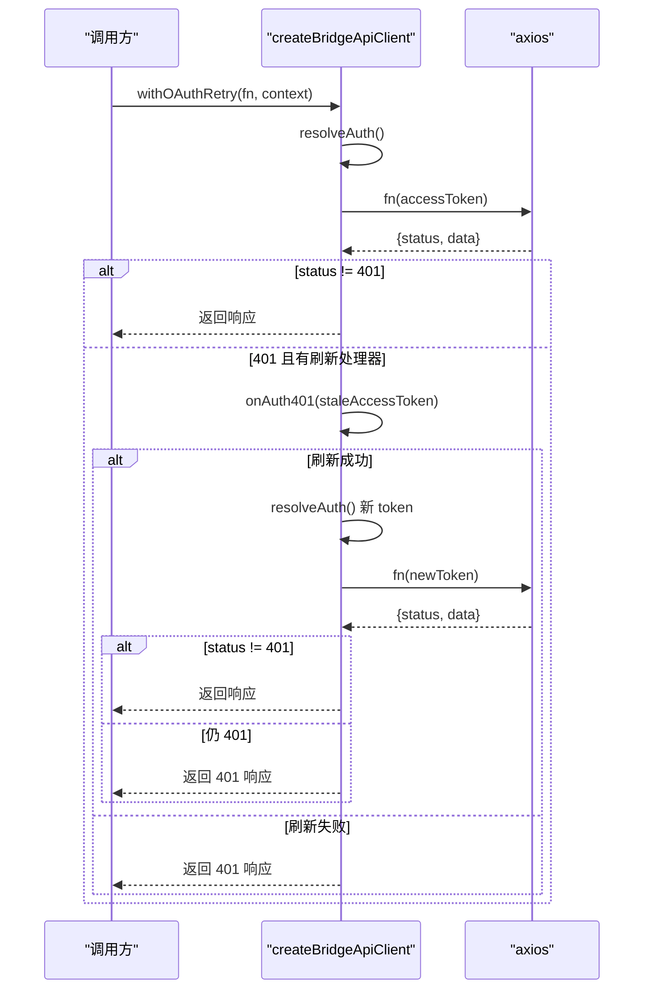
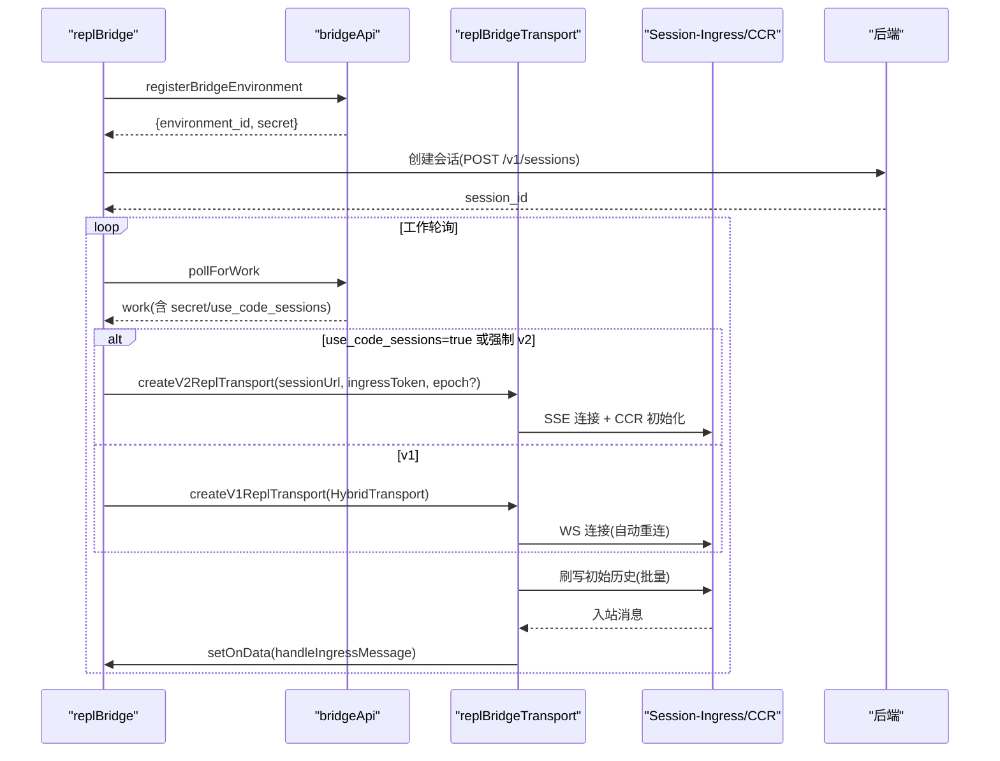
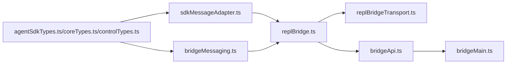

# SDK 通信

<cite>
**本文引用的文件**
- [sdkMessageAdapter.ts](file://src/remote/sdkMessageAdapter.ts)
- [bridgeMessaging.ts](file://src/bridge/bridgeMessaging.ts)
- [bridgeMain.ts](file://src/bridge/bridgeMain.ts)
- [replBridge.ts](file://src/bridge/replBridge.ts)
- [replBridgeTransport.ts](file://src/bridge/replBridgeTransport.ts)
- [agentSdkTypes.ts](file://src/entrypoints/agentSdkTypes.ts)
- [coreTypes.ts](file://src/entrypoints/sdk/coreTypes.ts)
- [controlTypes.ts](file://src/entrypoints/sdk/controlTypes.ts)
- [bridgeApi.ts](file://src/bridge/bridgeApi.ts)
</cite>

## 目录
1. [简介](#简介)
2. [项目结构](#项目结构)
3. [核心组件](#核心组件)
4. [架构总览](#架构总览)
5. [详细组件分析](#详细组件分析)
6. [依赖关系分析](#依赖关系分析)
7. [性能考量](#性能考量)
8. [故障排除指南](#故障排除指南)
9. [结论](#结论)
10. [附录](#附录)

## 简介
本文件面向 SDK 通信模块，系统化阐述消息适配器的架构设计与协议转换机制，解析桥接通信的实现原理（含消息序列化/反序列化）、API 封装、错误处理与重试策略，并给出集成指南、客户端实现要点、测试方法、消息路由与负载均衡策略、性能优化建议以及调试与排障实践。内容覆盖从 SDK 类型定义到桥接层传输、工作轮询、控制协议、心跳与重连、以及会话归档等全链路。

## 项目结构
SDK 通信相关代码主要分布在以下模块：
- 远程会话消息适配：将后端 SDK 消息转换为 REPL 内部消息类型
- 桥接消息处理：统一入口解析、去重、控制请求响应
- 桥接主循环：多会话/单会话模式、心跳、重连、容量唤醒、退避重试
- REPL 桥接：环境注册、会话创建、工作轮询、传输选择（v1/v2）
- 传输抽象：SSE/WS 与 CCR 客户端写入路径
- SDK 类型：消息、控制协议、运行时接口
- 桥接 API：OAuth/信任设备令牌、带重试的 HTTP 客户端

图表来源
- [agentSdkTypes.ts:1-446](file://src/entrypoints/agentSdkTypes.ts#L1-L446)
- [coreTypes.ts:1-63](file://src/entrypoints/sdk/coreTypes.ts#L1-L63)
- [controlTypes.ts:1-17](file://src/entrypoints/sdk/controlTypes.ts#L1-L17)
- [sdkMessageAdapter.ts:1-307](file://src/remote/sdkMessageAdapter.ts#L1-L307)
- [bridgeMessaging.ts:1-463](file://src/bridge/bridgeMessaging.ts#L1-L463)
- [bridgeApi.ts:1-540](file://src/bridge/bridgeApi.ts#L1-L540)
- [bridgeMain.ts:1-1599](file://src/bridge/bridgeMain.ts#L1-L1599)
- [replBridge.ts:1-1599](file://src/bridge/replBridge.ts#L1-L1599)
- [replBridgeTransport.ts:1-371](file://src/bridge/replBridgeTransport.ts#L1-L371)

章节来源
- [agentSdkTypes.ts:1-446](file://src/entrypoints/agentSdkTypes.ts#L1-L446)
- [coreTypes.ts:1-63](file://src/entrypoints/sdk/coreTypes.ts#L1-L63)
- [controlTypes.ts:1-17](file://src/entrypoints/sdk/controlTypes.ts#L1-L17)
- [sdkMessageAdapter.ts:1-307](file://src/remote/sdkMessageAdapter.ts#L1-L307)
- [bridgeMessaging.ts:1-463](file://src/bridge/bridgeMessaging.ts#L1-L463)
- [bridgeApi.ts:1-540](file://src/bridge/bridgeApi.ts#L1-L540)
- [bridgeMain.ts:1-1599](file://src/bridge/bridgeMain.ts#L1-L1599)
- [replBridge.ts:1-1599](file://src/bridge/replBridge.ts#L1-L1599)
- [replBridgeTransport.ts:1-371](file://src/bridge/replBridgeTransport.ts#L1-L371)

## 核心组件
- SDK 消息适配器：负责将 SDKMessage（来自后端）转换为 REPL 内部消息类型或流事件；过滤不显示的消息；提取结果文本、判断会话结束等
- 桥接消息处理：统一入口解析字符串消息，类型守卫校验，回声/重复消息去重，桥接消息筛选，控制请求/响应分发
- 桥接 API 客户端：封装 OAuth/信任设备令牌头，统一错误处理与 401 刷新重试，提供环境注册、工作轮询、心跳、停止工作、归档、重连等接口
- 桥接主循环：多会话/单会话模式、容量管理、睡眠检测、指数退避、心跳模式、会话超时、清理流程
- REPL 桥接：环境注册、会话创建、工作轮询回调、v1/v2 传输选择、初始历史刷写、标题派生、断线重连策略
- 传输抽象：SSE 读 + CCR 写（v2），HybridTransport（v1），统一写批处理、连接状态、序列号承载、交付确认
- SDK 类型：SDK 消息、控制协议、运行时接口、工具类型、钩子事件、退出原因等

章节来源
- [sdkMessageAdapter.ts:1-307](file://src/remote/sdkMessageAdapter.ts#L1-L307)
- [bridgeMessaging.ts:1-463](file://src/bridge/bridgeMessaging.ts#L1-L463)
- [bridgeApi.ts:1-540](file://src/bridge/bridgeApi.ts#L1-L540)
- [bridgeMain.ts:1-1599](file://src/bridge/bridgeMain.ts#L1-L1599)
- [replBridge.ts:1-1599](file://src/bridge/replBridge.ts#L1-L1599)
- [replBridgeTransport.ts:1-371](file://src/bridge/replBridgeTransport.ts#L1-L371)
- [agentSdkTypes.ts:1-446](file://src/entrypoints/agentSdkTypes.ts#L1-L446)
- [coreTypes.ts:1-63](file://src/entrypoints/sdk/coreTypes.ts#L1-L63)
- [controlTypes.ts:1-17](file://src/entrypoints/sdk/controlTypes.ts#L1-L17)

## 架构总览
SDK 通信采用“桥接层 + 传输层”的双层架构：
- 桥接层负责业务编排：环境注册、会话创建、工作轮询、断线重连、心跳、容量与退避、会话归档与注销
- 传输层负责数据通道：v1（HybridTransport，WS 读 + Session-Ingress POST 写）与 v2（SSE 读 + CCRClient 写），支持 outbound-only、序列号承载、交付确认、epoch 不一致处理

图表来源
- [replBridge.ts:1077-1501](file://src/bridge/replBridge.ts#L1077-L1501)
- [bridgeApi.ts:199-451](file://src/bridge/bridgeApi.ts#L199-L451)
- [bridgeMain.ts:141-1599](file://src/bridge/bridgeMain.ts#L141-L1599)
- [replBridgeTransport.ts:119-371](file://src/bridge/replBridgeTransport.ts#L119-L371)

## 详细组件分析

### 组件一：SDK 消息适配器
职责
- 将 SDKMessage（后端推送）转换为 REPL 内部消息类型（用户/助手/系统等）
- 处理流式事件（partial assistant）
- 处理结果/状态/工具进度/压缩边界等消息
- 提供会话结束判断、成功结果提取、忽略类型日志

关键点
- 用户消息转换支持工具结果块与文本消息两种路径，按选项决定是否渲染本地工具结果
- 系统消息按 subtype 分支处理，部分子类型直接忽略（如 auth_status、tool_use_summary、rate_limit_event）
- 结果消息仅在失败时转为系统消息，成功结果用于 UI 状态提示但不渲染

图表来源
- [sdkMessageAdapter.ts:169-282](file://src/remote/sdkMessageAdapter.ts#L169-L282)

章节来源
- [sdkMessageAdapter.ts:1-307](file://src/remote/sdkMessageAdapter.ts#L1-L307)

### 组件二：桥接消息处理（入口解析/去重/控制请求）
职责
- 统一解析入站字符串消息，类型守卫校验 SDKMessage
- 回声过滤与重复入站消息去重（基于 UUID 的环形集合）
- 仅转发桥接需要的消息（用户/助手/本地命令），忽略内部 REPL 聊天
- 控制请求/响应分发：对 server-initiated control_request 做快速响应，避免超时

关键点
- isSDKMessage/isSDKControlResponse/isSDKControlRequest 类型守卫确保安全解析
- BoundedUUIDSet 作为固定容量环形集合，O(1) 查找与插入，内存稳定
- 对 outbound-only 模式拒绝可变控制请求，返回明确错误

图表来源
- [bridgeMessaging.ts:132-208](file://src/bridge/bridgeMessaging.ts#L132-L208)

章节来源
- [bridgeMessaging.ts:1-463](file://src/bridge/bridgeMessaging.ts#L1-L463)

### 组件三：桥接 API 客户端（HTTP + OAuth 重试）
职责
- 统一构造请求头（Authorization/OAuth、anthropic-version、beta、runner 版本、信任设备令牌）
- 401 自动刷新重试（可选），失败抛出 BridgeFatalError
- 提供环境注册、工作轮询、心跳、停止工作、归档、重连、发送权限响应事件等

关键点
- withOAuthRetry 在 401 时尝试刷新并重试一次
- validateBridgeId 校验路径参数安全
- 错误映射：401/403/404/410 映射为致命错误；429 限流；其他非 2xx 抛错

图表来源
- [bridgeApi.ts:106-139](file://src/bridge/bridgeApi.ts#L106-L139)

章节来源
- [bridgeApi.ts:1-540](file://src/bridge/bridgeApi.ts#L1-L540)

### 组件四：桥接主循环（多会话/心跳/重试/容量）
职责
- 环境注册、工作轮询、ACK、心跳、停止工作、归档、注销
- 容量管理：at-capacity 快速轮询/心跳组合、容量唤醒
- 睡眠检测：通过最大退避阈值检测系统休眠，重置错误预算
- 退避策略：连接错误与一般错误分别跟踪，指数退避上限与放弃时间
- 会话超时：定时器 watchdog，超时标记为 failed 并清理
- 会话复用：持久化指针、崩溃恢复、标题派生

关键点
- heartbeatActiveWorkItems 批量心跳，区分 auth_failed/fatal/ok
- stopWorkWithRetry 带指数退避的停止工作
- at-capacity 模式下心跳优先，必要时短睡眠等待容量释放
- 会话超时、工作树清理、调试日志、诊断日志、分析事件上报

章节来源
- [bridgeMain.ts:141-1599](file://src/bridge/bridgeMain.ts#L141-L1599)

### 组件五：REPL 桥接（环境注册/会话创建/工作轮询/传输）
职责
- 注册桥接环境、创建会话、持久化崩溃恢复指针
- 工作轮询回调 onWorkReceived：根据工作 secret 决定 v1/v2 传输
- v1：HybridTransport（WS 读 + Session-Ingress POST 写），自动重连、OAuth 刷新头
- v2：SSETransport（读）+ CCRClient（写），epoch 不一致关闭、立即报告 delivery processed
- 初始历史刷写：限制数量、去重、flushGate 保证顺序
- 断线重连：策略 1（原环境复活 + 原会话）、策略 2（新会话）

图表来源
- [replBridge.ts:1077-1501](file://src/bridge/replBridge.ts#L1077-L1501)
- [replBridgeTransport.ts:119-371](file://src/bridge/replBridgeTransport.ts#L119-L371)
- [bridgeApi.ts:199-451](file://src/bridge/bridgeApi.ts#L199-L451)

章节来源
- [replBridge.ts:1-1599](file://src/bridge/replBridge.ts#L1-L1599)
- [replBridgeTransport.ts:1-371](file://src/bridge/replBridgeTransport.ts#L1-L371)
- [bridgeApi.ts:1-540](file://src/bridge/bridgeApi.ts#L1-L540)

### 组件六：传输抽象（v1/v2）
职责
- v1：HybridTransport（WebSocket 读 + Session-Ingress POST 写），支持最大连续失败丢弃告警
- v2：SSETransport（读）+ CCRClient（写），epoch 不一致抛错并关闭，立即报告 processed，支持 outbound-only
- 统一写接口：write/writeBatch/close/isConnected/getStateLabel
- 序列号承载：lastTransportSequenceNum 用于 SSE 重连续传，避免全量重放

章节来源
- [replBridgeTransport.ts:1-371](file://src/bridge/replBridgeTransport.ts#L1-L371)

### 组件七：SDK 类型与协议
职责
- SDK 消息类型、控制协议、运行时接口、工具类型、钩子事件、退出原因等
- 控制协议类型占位（stub），供桥接/传输层使用

章节来源
- [agentSdkTypes.ts:1-446](file://src/entrypoints/agentSdkTypes.ts#L1-L446)
- [coreTypes.ts:1-63](file://src/entrypoints/sdk/coreTypes.ts#L1-L63)
- [controlTypes.ts:1-17](file://src/entrypoints/sdk/controlTypes.ts#L1-L17)

## 依赖关系分析
- 模块耦合
  - sdkMessageAdapter 依赖 SDK 类型与消息工具，输出 REPL 内部消息
  - bridgeMessaging 依赖 SDK 类型、消息与控制协议，输出桥接消息与控制请求
  - replBridge 依赖 bridgeMessaging、replBridgeTransport、bridgeApi、agentSdkTypes
  - bridgeMain 依赖 bridgeApi、replBridge（通过工作轮询回调）、日志与诊断
  - replBridgeTransport 依赖 SSETransport 与 CCRClient，抽象 v1/v2 差异
- 外部依赖
  - axios 用于 HTTP 请求
  - crypto/randomUUID 用于唯一标识
  - 运行时依赖：OAuth 令牌、信任设备令牌、环境变量

图表来源
- [agentSdkTypes.ts:1-446](file://src/entrypoints/agentSdkTypes.ts#L1-L446)
- [coreTypes.ts:1-63](file://src/entrypoints/sdk/coreTypes.ts#L1-L63)
- [controlTypes.ts:1-17](file://src/entrypoints/sdk/controlTypes.ts#L1-L17)
- [sdkMessageAdapter.ts:1-307](file://src/remote/sdkMessageAdapter.ts#L1-L307)
- [bridgeMessaging.ts:1-463](file://src/bridge/bridgeMessaging.ts#L1-L463)
- [replBridge.ts:1-1599](file://src/bridge/replBridge.ts#L1-L1599)
- [replBridgeTransport.ts:1-371](file://src/bridge/replBridgeTransport.ts#L1-L371)
- [bridgeApi.ts:1-540](file://src/bridge/bridgeApi.ts#L1-L540)
- [bridgeMain.ts:1-1599](file://src/bridge/bridgeMain.ts#L1-L1599)

章节来源
- [agentSdkTypes.ts:1-446](file://src/entrypoints/agentSdkTypes.ts#L1-L446)
- [coreTypes.ts:1-63](file://src/entrypoints/sdk/coreTypes.ts#L1-L63)
- [controlTypes.ts:1-17](file://src/entrypoints/sdk/controlTypes.ts#L1-L17)
- [sdkMessageAdapter.ts:1-307](file://src/remote/sdkMessageAdapter.ts#L1-L307)
- [bridgeMessaging.ts:1-463](file://src/bridge/bridgeMessaging.ts#L1-L463)
- [replBridge.ts:1-1599](file://src/bridge/replBridge.ts#L1-L1599)
- [replBridgeTransport.ts:1-371](file://src/bridge/replBridgeTransport.ts#L1-L371)
- [bridgeApi.ts:1-540](file://src/bridge/bridgeApi.ts#L1-L540)
- [bridgeMain.ts:1-1599](file://src/bridge/bridgeMain.ts#L1-L1599)

## 性能考量
- 消息去重
  - BoundedUUIDSet 固定容量环形集合，O(1) 插入/查询，避免内存无限增长
- 初始历史刷写
  - 可配置历史上限，避免大规模历史写入导致持久化压力与 Firestore 压力
- 传输层
  - v2 写路径使用 CCRClient 批量上传，减少网络往返；丢弃检测与告警
  - v1 POST 写入设置最大连续失败次数，防止无限阻塞
- 心跳与退避
  - at-capacity 模式下心跳优先，降低轮询频率；连接/一般错误分别退避，上限与放弃时间可控
- 序列号承载
  - SSE 重连携带 lastTransportSequenceNum，避免全量重放，显著降低重连成本

章节来源
- [bridgeMessaging.ts:420-462](file://src/bridge/bridgeMessaging.ts#L420-L462)
- [replBridge.ts:1241-1329](file://src/bridge/replBridge.ts#L1241-L1329)
- [replBridgeTransport.ts:140-371](file://src/bridge/replBridgeTransport.ts#L140-L371)
- [bridgeMain.ts:640-745](file://src/bridge/bridgeMain.ts#L640-L745)

## 故障排除指南
常见问题与定位
- 认证失败（401/403）
  - 检查 OAuth 令牌是否有效，必要时触发刷新重试
  - 403 可能为会话过期或权限不足，区分抑制型 403
- 会话过期/环境不存在（404/410）
  - 触发 reconnectEnvironmentWithSession，策略 1（复活原环境+原会话）或策略 2（新会话）
- 传输断开
  - v2：epoch 不一致会主动关闭并由轮询恢复；检查 CCRClient 初始化与 SSE 连接
  - v1：HybridTransport 自动重连，关注最大连续失败告警
- 初始历史未到达/重复消息
  - 检查 previouslyFlushedUUIDs 与 initialHistoryCap 设置
  - 确认 flushGate 正常启动与 drain
- 服务器无工作（空轮询）
  - 观察 consecutiveEmptyPolls 日志，确认轮询间隔与 at-capacity 心跳配置
- 限流（429）
  - 降低轮询频率或增加退避上限

章节来源
- [bridgeApi.ts:454-500](file://src/bridge/bridgeApi.ts#L454-L500)
- [replBridge.ts:605-836](file://src/bridge/replBridge.ts#L605-L836)
- [replBridgeTransport.ts:209-232](file://src/bridge/replBridgeTransport.ts#L209-L232)
- [bridgeMain.ts:1270-1399](file://src/bridge/bridgeMain.ts#L1270-L1399)

## 结论
SDK 通信模块通过“消息适配器 + 桥接层 + 传输层”的清晰分层，实现了从后端 SDK 消息到 REPL 渲染的可靠转换，以及从桥接到远端服务的高可用桥接。其特性包括：
- 强类型 SDK 消息与控制协议，严格的类型守卫与日志
- 稳健的去重与回声过滤，确保消息一致性
- v1/v2 双栈传输抽象，平滑迁移与性能优化
- 完整的心跳、重试、容量与睡眠检测机制
- 丰富的诊断与分析事件，便于排障与监控

## 附录

### SDK 集成指南
- 引入 SDK 类型
  - 从入口导出导入 SDK 类型与运行时接口
  - 使用 SDKMessage、SDKControlRequest/Response、工具类型等
- 实现消息适配
  - 使用 convertSDKMessage 将 SDK 消息转换为 REPL 内部消息
  - 根据场景启用 convertToolResults/convertUserTextMessages 选项
- 桥接接入
  - 通过 replBridge 初始化桥接，提供必要的回调（onInboundMessage、onPermissionResponse、onControlRequest 等）
  - 选择 v1 或 v2 传输，依据工作 secret 与环境变量
- 错误处理与重试
  - 使用 createBridgeApiClient 获取带 OAuth 重试的 API 客户端
  - 针对 401/403/404/410 做相应处理，结合 fatalExit 与 give-up 逻辑

章节来源
- [agentSdkTypes.ts:1-446](file://src/entrypoints/agentSdkTypes.ts#L1-L446)
- [sdkMessageAdapter.ts:169-282](file://src/remote/sdkMessageAdapter.ts#L169-L282)
- [replBridge.ts:260-599](file://src/bridge/replBridge.ts#L260-L599)
- [bridgeApi.ts:68-451](file://src/bridge/bridgeApi.ts#L68-L451)

### 客户端实现要点
- 消息序列化/反序列化
  - 入站：字符串消息经 jsonParse + normalizeControlMessageKeys 后按类型守卫解析
  - 出站：SDKMessage 批量转换为传输层事件，v2 使用 CCRClient 写入
- 消息路由
  - 仅转发用户/助手/本地命令消息，其余内部消息忽略
  - 控制请求/响应独立通道，快速响应避免超时
- 负载均衡与容错
  - at-capacity 模式下心跳优先，必要时短睡眠等待
  - 退避策略区分连接错误与一般错误，上限与放弃时间可配置
- 性能优化
  - 初始历史刷写上限与去重
  - v2 写路径批量上传与丢弃检测
  - 序列号承载避免全量重放

章节来源
- [bridgeMessaging.ts:132-208](file://src/bridge/bridgeMessaging.ts#L132-L208)
- [replBridgeTransport.ts:270-371](file://src/bridge/replBridgeTransport.ts#L270-L371)
- [bridgeMain.ts:640-745](file://src/bridge/bridgeMain.ts#L640-L745)

### 测试方法
- 单元测试
  - 类型守卫与消息转换：验证 convertSDKMessage 对不同 subtype 的行为
  - 去重与回声：构造相同 UUID 的消息，验证 BoundedUUIDSet 行为
  - 控制请求：模拟 server-initiated control_request，验证快速响应
- 集成测试
  - REPL 桥接：模拟环境注册、会话创建、工作轮询、传输切换
  - v1/v2：对比 HybridTransport 与 CCRClient 的行为差异
  - 重连与心跳：模拟断线、epoch 不一致、会话过期等场景
- 性能测试
  - 大量历史消息刷写、批量写入、序列号承载效果评估
  - at-capacity 心跳与退避对延迟的影响

章节来源
- [sdkMessageAdapter.ts:169-307](file://src/remote/sdkMessageAdapter.ts#L169-L307)
- [bridgeMessaging.ts:132-208](file://src/bridge/bridgeMessaging.ts#L132-L208)
- [replBridge.ts:1077-1501](file://src/bridge/replBridge.ts#L1077-L1501)
- [replBridgeTransport.ts:119-371](file://src/bridge/replBridgeTransport.ts#L119-L371)
- [bridgeMain.ts:141-1599](file://src/bridge/bridgeMain.ts#L141-L1599)

### 调试工具与排障
- 调试开关
  - USER_TYPE=ant 时启用注入故障、强制重连、关闭事件等调试能力
- 日志与诊断
  - debug 日志、诊断日志、分析事件上报
  - 会话标题派生、崩溃恢复指针、序列号承载
- 常见排查步骤
  - 检查 OAuth 令牌与信任设备令牌
  - 观察 at-capacity 心跳与退避日志
  - 确认 v2 epoch 一致性与 SSE 序列号承载

章节来源
- [replBridge.ts:982-1006](file://src/bridge/replBridge.ts#L982-L1006)
- [bridgeApi.ts:454-500](file://src/bridge/bridgeApi.ts#L454-L500)
- [bridgeMain.ts:1270-1399](file://src/bridge/bridgeMain.ts#L1270-L1399)