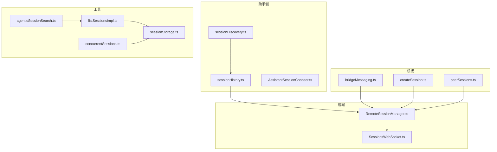
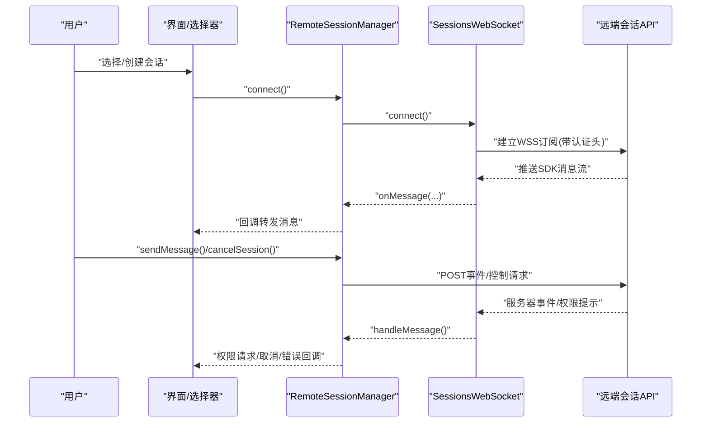
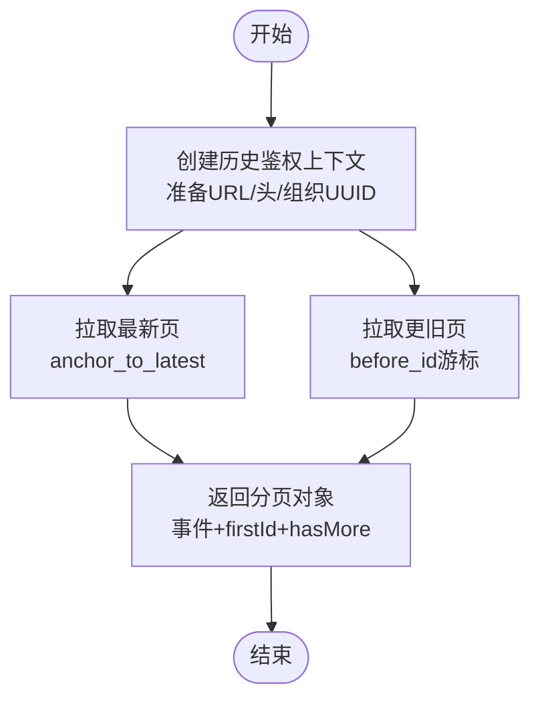
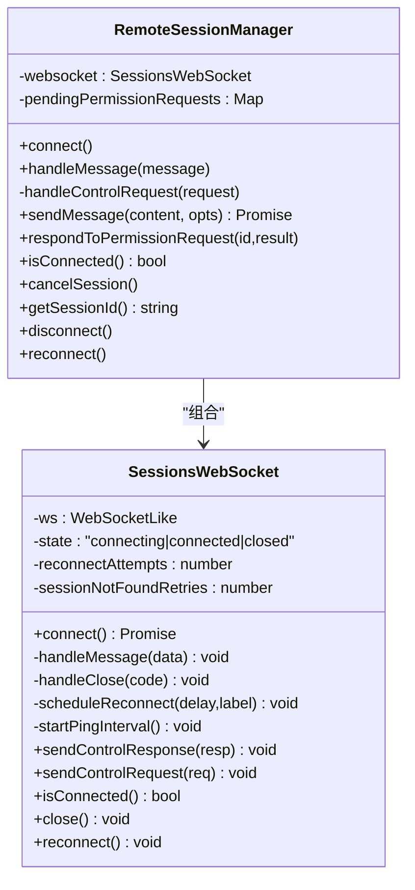
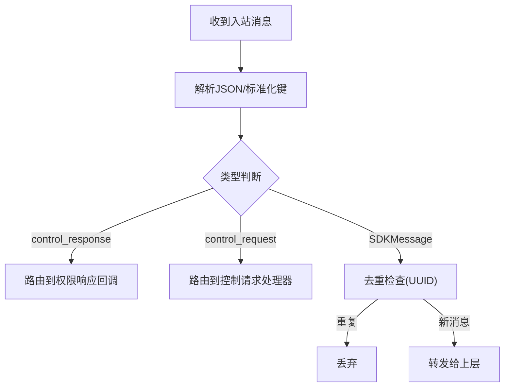
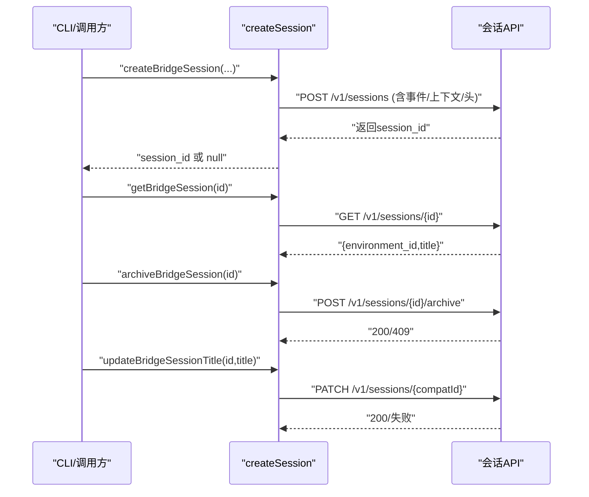
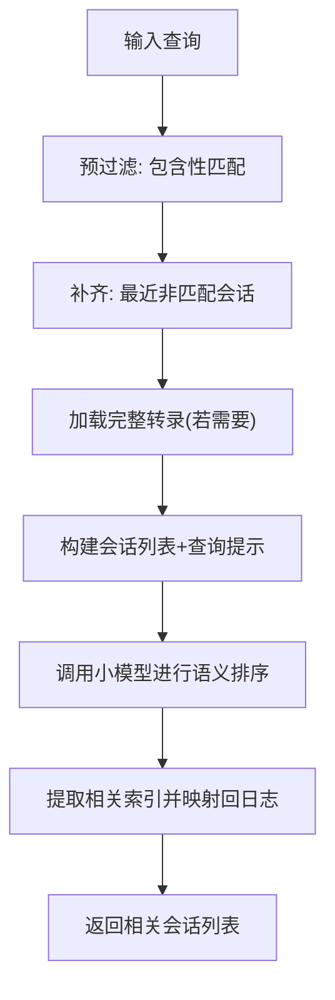
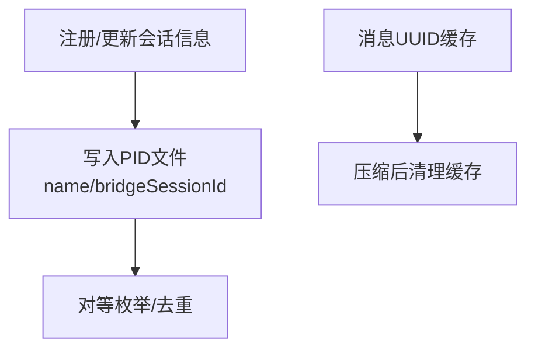
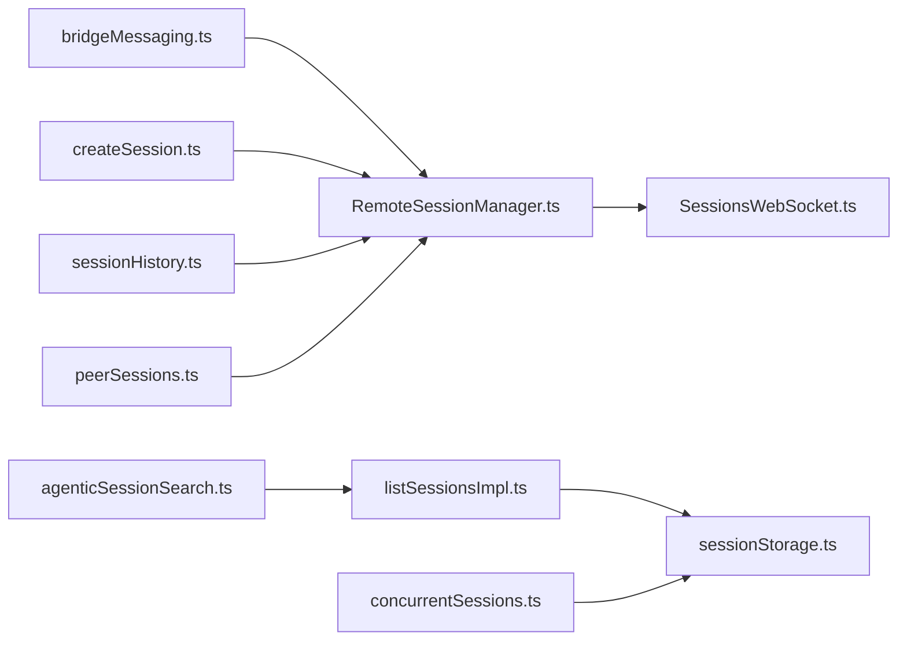

# 代理发现与会话管理

<cite>
**本文引用的文件**
- [sessionDiscovery.ts](file://src/assistant/sessionDiscovery.ts)
- [sessionHistory.ts](file://src/assistant/sessionHistory.ts)
- [AssistantSessionChooser.ts](file://src/assistant/AssistantSessionChooser.ts)
- [RemoteSessionManager.ts](file://src/remote/RemoteSessionManager.ts)
- [SessionsWebSocket.ts](file://src/remote/SessionsWebSocket.ts)
- [bridgeMessaging.ts](file://src/bridge/bridgeMessaging.ts)
- [createSession.ts](file://src/bridge/createSession.ts)
- [agenticSessionSearch.ts](file://src/utils/agenticSessionSearch.ts)
- [listSessionsImpl.ts](file://src/utils/listSessionsImpl.ts)
- [concurrentSessions.ts](file://src/utils/concurrentSessions.ts)
- [sessionStorage.ts](file://src/utils/sessionStorage.ts)
- [peerSessions.ts](file://src/bridge/peerSessions.ts)
</cite>

## 目录
1. [引言](#引言)
2. [项目结构](#项目结构)
3. [核心组件](#核心组件)
4. [架构总览](#架构总览)
5. [详细组件分析](#详细组件分析)
6. [依赖关系分析](#依赖关系分析)
7. [性能考量](#性能考量)
8. [故障排查指南](#故障排查指南)
9. [结论](#结论)
10. [附录](#附录)

## 引言
本文件聚焦于“代理发现与会话管理”主题，系统化阐述以下能力：
- 代理发现机制：如何在多环境（本地桥接、远程控制、跨进程）中识别与定位可用代理/会话。
- 会话发现与检索：基于元数据与语义的会话搜索、排序与推荐。
- 历史记录管理：会话事件分页拉取、游标推进与一致性保障。
- 会话选择器：在多候选中进行筛选、排序与推荐。
- 代理间通信协议：WebSocket 控制消息、权限请求/响应、中断与重连策略。
- 会话同步与状态共享：标题同步、权限模式、模型设置等跨端一致性。
- 扩展性与容错：大规模部署下的连接退避、会话未找到的短暂重试、持久化与去重。

## 项目结构
围绕会话与代理的关键模块分布如下：
- assistant：会话发现与选择器的占位实现（待填充）
- remote：远端会话管理与 WebSocket 通信
- bridge：桥接层消息处理、会话创建/归档/标题更新
- utils：会话列表、检索、并发会话注册、存储与缓存

图表来源
- [sessionDiscovery.ts:1-4](file://src/assistant/sessionDiscovery.ts#L1-L4)
- [sessionHistory.ts:1-88](file://src/assistant/sessionHistory.ts#L1-L88)
- [AssistantSessionChooser.ts:1-4](file://src/assistant/AssistantSessionChooser.ts#L1-L4)
- [RemoteSessionManager.ts:1-345](file://src/remote/RemoteSessionManager.ts#L1-L345)
- [SessionsWebSocket.ts:1-405](file://src/remote/SessionsWebSocket.ts#L1-L405)
- [bridgeMessaging.ts:1-463](file://src/bridge/bridgeMessaging.ts#L1-L463)
- [createSession.ts:1-385](file://src/bridge/createSession.ts#L1-L385)
- [agenticSessionSearch.ts:1-308](file://src/utils/agenticSessionSearch.ts#L1-L308)
- [listSessionsImpl.ts:1-455](file://src/utils/listSessionsImpl.ts#L1-L455)
- [concurrentSessions.ts:111-148](file://src/utils/concurrentSessions.ts#L111-L148)
- [sessionStorage.ts:3839-3868](file://src/utils/sessionStorage.ts#L3839-L3868)
- [peerSessions.ts:1-4](file://src/bridge/peerSessions.ts#L1-L4)

章节来源
- [sessionDiscovery.ts:1-4](file://src/assistant/sessionDiscovery.ts#L1-L4)
- [sessionHistory.ts:1-88](file://src/assistant/sessionHistory.ts#L1-L88)
- [AssistantSessionChooser.ts:1-4](file://src/assistant/AssistantSessionChooser.ts#L1-L4)
- [RemoteSessionManager.ts:1-345](file://src/remote/RemoteSessionManager.ts#L1-L345)
- [SessionsWebSocket.ts:1-405](file://src/remote/SessionsWebSocket.ts#L1-L405)
- [bridgeMessaging.ts:1-463](file://src/bridge/bridgeMessaging.ts#L1-L463)
- [createSession.ts:1-385](file://src/bridge/createSession.ts#L1-L385)
- [agenticSessionSearch.ts:1-308](file://src/utils/agenticSessionSearch.ts#L1-L308)
- [listSessionsImpl.ts:1-455](file://src/utils/listSessionsImpl.ts#L1-L455)
- [concurrentSessions.ts:111-148](file://src/utils/concurrentSessions.ts#L111-L148)
- [sessionStorage.ts:3839-3868](file://src/utils/sessionStorage.ts#L3839-L3868)
- [peerSessions.ts:1-4](file://src/bridge/peerSessions.ts#L1-L4)

## 核心组件
- 会话发现与历史
  - 发现接口占位：提供会话类型与发现函数占位，实际实现需替换。
  - 历史分页：按最新/更旧游标分页拉取事件，带超时与错误日志。
- 远端会话管理
  - 管理器封装 WebSocket 订阅、HTTP 发送消息、权限请求/响应、中断与断线重连。
- 桥接消息与控制
  - 统一解析入站消息、去重回声与重复推送、路由控制请求/响应。
  - 支持初始化、模型设置、最大思考令牌、权限模式与中断等控制命令。
- 会话创建/归档/标题同步
  - 通过 HTTP 接口创建/查询/归档会话，并保持标题与组织上下文一致。
- 会话检索与排序
  - 基于标签、标题、分支、摘要与转录的预过滤与语义检索；支持分页与稳定排序。
- 并发会话与存储
  - 注册当前会话名称与桥接 ID，避免本地/远程重复；消息集合缓存与失效。

章节来源
- [sessionDiscovery.ts:1-4](file://src/assistant/sessionDiscovery.ts#L1-L4)
- [sessionHistory.ts:1-88](file://src/assistant/sessionHistory.ts#L1-L88)
- [RemoteSessionManager.ts:1-345](file://src/remote/RemoteSessionManager.ts#L1-L345)
- [SessionsWebSocket.ts:1-405](file://src/remote/SessionsWebSocket.ts#L1-L405)
- [bridgeMessaging.ts:1-463](file://src/bridge/bridgeMessaging.ts#L1-L463)
- [createSession.ts:1-385](file://src/bridge/createSession.ts#L1-L385)
- [agenticSessionSearch.ts:1-308](file://src/utils/agenticSessionSearch.ts#L1-L308)
- [listSessionsImpl.ts:1-455](file://src/utils/listSessionsImpl.ts#L1-L455)
- [concurrentSessions.ts:111-148](file://src/utils/concurrentSessions.ts#L111-L148)
- [sessionStorage.ts:3839-3868](file://src/utils/sessionStorage.ts#L3839-L3868)

## 架构总览
下图展示了从用户输入到远端会话订阅、消息往返与桥接控制的整体流程。

图表来源
- [RemoteSessionManager.ts:95-325](file://src/remote/RemoteSessionManager.ts#L95-L325)
- [SessionsWebSocket.ts:82-205](file://src/remote/SessionsWebSocket.ts#L82-L205)
- [bridgeMessaging.ts:132-208](file://src/bridge/bridgeMessaging.ts#L132-L208)

## 详细组件分析

### 会话发现与历史
- 会话发现
  - 当前提供类型与占位函数，实际应实现跨环境（本地/远程/桥接）的会话枚举与过滤。
- 历史分页
  - 最新页：以锚点拉取最近 N 条事件。
  - 更旧页：使用前一个事件 ID 游标继续拉取。
  - 统一鉴权上下文：一次性准备基础 URL、头部与组织 UUID，复用至后续分页。

图表来源
- [sessionHistory.ts:31-87](file://src/assistant/sessionHistory.ts#L31-L87)

章节来源
- [sessionDiscovery.ts:1-4](file://src/assistant/sessionDiscovery.ts#L1-L4)
- [sessionHistory.ts:1-88](file://src/assistant/sessionHistory.ts#L1-L88)

### 远端会话管理与通信协议
- 管理器职责
  - 建立/维护 WebSocket 订阅，接收消息并区分 SDK 消息与控制消息。
  - 处理权限请求（工具使用授权）、取消与响应；发送中断信号。
  - 提供连接状态检查、主动断开与强制重连。
- WebSocket 协议要点
  - 认证：通过请求头携带访问令牌与版本信息。
  - 控制消息：支持初始化、设置模型、设置最大思考令牌、设置权限模式、中断等。
  - 心跳：周期性 ping 保活。
  - 重连：指数/有限次重连；对特定关闭码（如 4001）做短暂重试窗口处理。

图表来源
- [RemoteSessionManager.ts:95-325](file://src/remote/RemoteSessionManager.ts#L95-L325)
- [SessionsWebSocket.ts:82-404](file://src/remote/SessionsWebSocket.ts#L82-L404)

章节来源
- [RemoteSessionManager.ts:1-345](file://src/remote/RemoteSessionManager.ts#L1-L345)
- [SessionsWebSocket.ts:1-405](file://src/remote/SessionsWebSocket.ts#L1-L405)

### 桥接消息与控制
- 入站消息处理
  - 解析并校验消息类型，区分 control_response 与 control_request。
  - 去重：对已发出或已接收的 UUID 进行回声与重放过滤。
  - 路由：将 SDK 消息转发给上层回调。
- 控制请求处理
  - 初始化、设置模型、设置最大思考令牌、设置权限模式、中断等。
  - 对不可变请求在“仅出站”模式下返回错误，避免误导。
- 结果消息
  - 在会话终止时生成最小结果事件，确保服务端可触发归档。

图表来源
- [bridgeMessaging.ts:132-208](file://src/bridge/bridgeMessaging.ts#L132-L208)
- [bridgeMessaging.ts:243-392](file://src/bridge/bridgeMessaging.ts#L243-L392)

章节来源
- [bridgeMessaging.ts:1-463](file://src/bridge/bridgeMessaging.ts#L1-L463)

### 会话创建/归档/标题同步
- 创建会话
  - 组装事件与上下文（模型、来源、权限模式），使用组织级头与 beta 标记调用会话创建接口。
- 查询/归档/标题更新
  - 查询会话元信息（环境 ID、标题）。
  - 归档会话（显式动作，幂等处理 409）。
  - 标题同步（兼容网关 ID 规范化）。

图表来源
- [createSession.ts:34-180](file://src/bridge/createSession.ts#L34-L180)
- [createSession.ts:190-244](file://src/bridge/createSession.ts#L190-L244)
- [createSession.ts:263-317](file://src/bridge/createSession.ts#L263-L317)
- [createSession.ts:327-384](file://src/bridge/createSession.ts#L327-L384)

章节来源
- [createSession.ts:1-385](file://src/bridge/createSession.ts#L1-L385)

### 会话检索、排序与推荐
- 预过滤
  - 基于标题、自定义标题、标签、分支、摘要与转录进行包含性匹配。
- 语义检索
  - 使用小型快速模型对会话元数据与转录进行语义打分，返回相关索引列表。
- 列表与排序
  - 优先使用 stat+mtime 排序，再批量读取内容提取字段，支持 limit/offset 分页。
  - 工作树感知扫描，避免重复与路径误判。

图表来源
- [agenticSessionSearch.ts:146-307](file://src/utils/agenticSessionSearch.ts#L146-L307)
- [listSessionsImpl.ts:439-454](file://src/utils/listSessionsImpl.ts#L439-L454)

章节来源
- [agenticSessionSearch.ts:1-308](file://src/utils/agenticSessionSearch.ts#L1-L308)
- [listSessionsImpl.ts:1-455](file://src/utils/listSessionsImpl.ts#L1-L455)

### 并发会话与状态共享
- 名称与桥接 ID 注册
  - 将当前会话名称与桥接会话 ID 写入 PID 文件，用于对等枚举去重与显示。
- 存储与缓存
  - 会话消息 UUID 集合缓存，支持清理以配合压缩后的一致性。

图表来源
- [concurrentSessions.ts:111-148](file://src/utils/concurrentSessions.ts#L111-L148)
- [sessionStorage.ts:3839-3868](file://src/utils/sessionStorage.ts#L3839-L3868)

章节来源
- [concurrentSessions.ts:111-148](file://src/utils/concurrentSessions.ts#L111-L148)
- [sessionStorage.ts:3839-3868](file://src/utils/sessionStorage.ts#L3839-L3868)

### 代理间通信与会话选择器
- 代理间消息
  - 提供跨代理消息发送接口占位，便于在多实例或多进程间传递指令。
- 会话选择器
  - 提供会话选择器组件占位，用于 UI 层的候选展示与交互。

章节来源
- [peerSessions.ts:1-4](file://src/bridge/peerSessions.ts#L1-L4)
- [AssistantSessionChooser.ts:1-4](file://src/assistant/AssistantSessionChooser.ts#L1-L4)

## 依赖关系分析
- 组件耦合
  - RemoteSessionManager 与 SessionsWebSocket 强耦合，前者负责业务编排，后者负责传输细节。
  - bridgeMessaging 作为纯函数层，被 REPL 桥接与远端会话共同复用。
  - createSession 依赖认证与组织上下文，贯穿创建/查询/归档/标题更新。
- 外部依赖
  - HTTP 客户端（axios）用于会话与历史接口调用。
  - WebSocket 客户端（浏览器原生或 ws 库）用于订阅与控制。
- 可能的循环依赖
  - 当前模块以纯函数与类为主，未见明显循环导入。

图表来源
- [bridgeMessaging.ts:1-463](file://src/bridge/bridgeMessaging.ts#L1-L463)
- [RemoteSessionManager.ts:1-345](file://src/remote/RemoteSessionManager.ts#L1-L345)
- [SessionsWebSocket.ts:1-405](file://src/remote/SessionsWebSocket.ts#L1-L405)
- [createSession.ts:1-385](file://src/bridge/createSession.ts#L1-L385)
- [sessionHistory.ts:1-88](file://src/assistant/sessionHistory.ts#L1-L88)
- [agenticSessionSearch.ts:1-308](file://src/utils/agenticSessionSearch.ts#L1-L308)
- [listSessionsImpl.ts:1-455](file://src/utils/listSessionsImpl.ts#L1-L455)
- [sessionStorage.ts:3839-3868](file://src/utils/sessionStorage.ts#L3839-L3868)
- [concurrentSessions.ts:111-148](file://src/utils/concurrentSessions.ts#L111-L148)
- [peerSessions.ts:1-4](file://src/bridge/peerSessions.ts#L1-L4)

章节来源
- [bridgeMessaging.ts:1-463](file://src/bridge/bridgeMessaging.ts#L1-L463)
- [RemoteSessionManager.ts:1-345](file://src/remote/RemoteSessionManager.ts#L1-L345)
- [SessionsWebSocket.ts:1-405](file://src/remote/SessionsWebSocket.ts#L1-L405)
- [createSession.ts:1-385](file://src/bridge/createSession.ts#L1-L385)
- [sessionHistory.ts:1-88](file://src/assistant/sessionHistory.ts#L1-L88)
- [agenticSessionSearch.ts:1-308](file://src/utils/agenticSessionSearch.ts#L1-L308)
- [listSessionsImpl.ts:1-455](file://src/utils/listSessionsImpl.ts#L1-L455)
- [sessionStorage.ts:3839-3868](file://src/utils/sessionStorage.ts#L3839-L3868)
- [concurrentSessions.ts:111-148](file://src/utils/concurrentSessions.ts#L111-L148)
- [peerSessions.ts:1-4](file://src/bridge/peerSessions.ts#L1-L4)

## 性能考量
- I/O 优化
  - 列表接口先进行 stat-only 排序，再批量读取内容，避免全量解析带来的高成本。
  - 会话消息 UUID 缓存减少重复读取，压缩后及时清理。
- 网络与连接
  - WebSocket 心跳保活与有限次数重连，针对 4001（会话未找到）设置短暂重试预算，避免永久放弃。
  - 控制请求/响应严格时限内响应，防止服务端挂起。
- 检索效率
  - 预过滤降低语义检索规模，限制最大搜索会话数量，兼顾准确性与延迟。
- 并发与稳定性
  - BoundedUUIDSet 固定容量环形缓冲，常数空间去重，避免内存膨胀。

章节来源
- [listSessionsImpl.ts:223-271](file://src/utils/listSessionsImpl.ts#L223-L271)
- [SessionsWebSocket.ts:17-36](file://src/remote/SessionsWebSocket.ts#L17-L36)
- [bridgeMessaging.ts:430-462](file://src/bridge/bridgeMessaging.ts#L430-L462)
- [agenticSessionSearch.ts:10-17](file://src/utils/agenticSessionSearch.ts#L10-L17)

## 故障排查指南
- 连接问题
  - 关闭码 4003（未授权）直接判定为永久关闭，不再重连。
  - 4001（会话未找到）在预算内重试，超过预算则停止。
  - 断线重连遵循指数退避与最大尝试次数。
- 权限与控制
  - 未知控制子类型将返回错误响应，避免服务端挂起。
  - 仅出站模式下拒绝可变控制请求，返回明确错误信息。
- 历史拉取
  - HTTP 请求失败或状态非 200 将记录调试日志并返回空结果。
- 消息去重
  - 对 echo 与重复推送进行双重去重，确保 UI 不重复渲染。

章节来源
- [SessionsWebSocket.ts:246-287](file://src/remote/SessionsWebSocket.ts#L246-L287)
- [bridgeMessaging.ts:243-392](file://src/bridge/bridgeMessaging.ts#L243-L392)
- [sessionHistory.ts:45-67](file://src/assistant/sessionHistory.ts#L45-L67)

## 结论
该体系通过“远端会话管理 + 桥接消息处理 + 会话检索与排序”的协同，实现了跨环境的代理发现与会话管理闭环。其关键优势包括：
- 明确的控制协议与严格的响应时限，保障交互可靠性。
- 基于元数据与语义的检索策略，提升会话发现的准确性与效率。
- I/O 与网络层面的多项优化，满足大规模部署的性能与稳定性要求。
- 完整的去重、缓存与重连策略，增强数据一致性与容错能力。

## 附录
- 最佳实践
  - 会话创建时统一注入组织 UUID 与 beta 标记，确保跨端一致性。
  - 使用固定容量的 UUID 去重集合，避免内存泄漏。
  - 在仅出站场景明确拒绝可变控制请求，避免误导用户。
- 扩展性建议
  - 将会话发现接口替换为真实实现，支持本地/远程/桥接多源聚合。
  - 引入会话标签与分类体系，结合检索策略实现更细粒度的推荐。
- 数据一致性
  - 标题同步与归档均采用幂等设计，配合缓存清理与重试策略，确保最终一致。