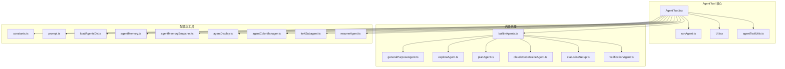
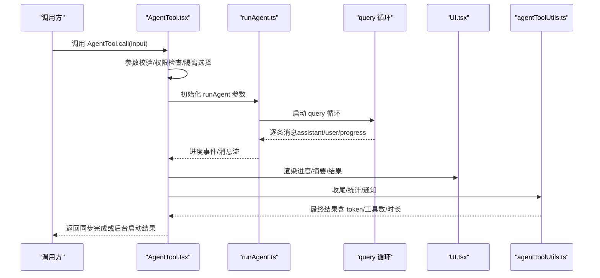
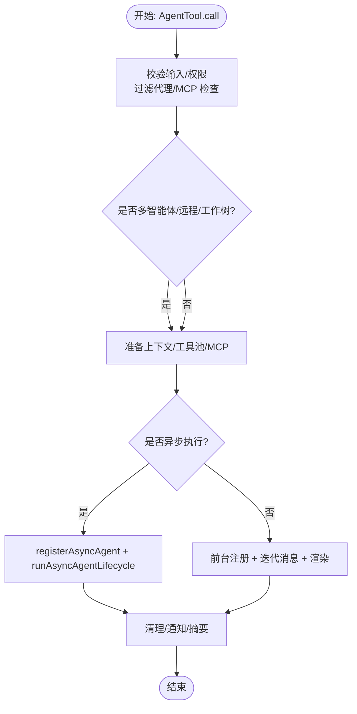
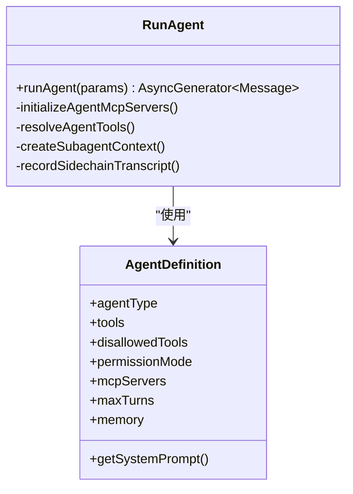
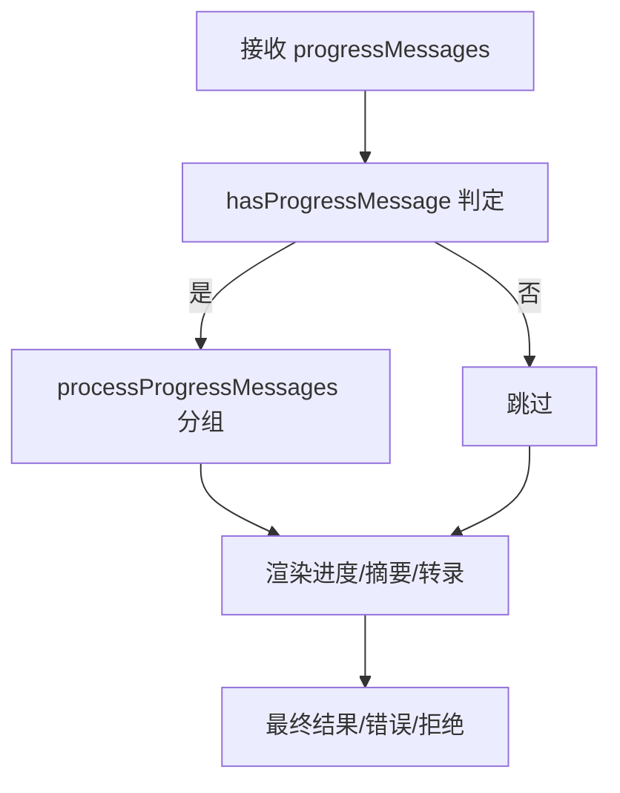
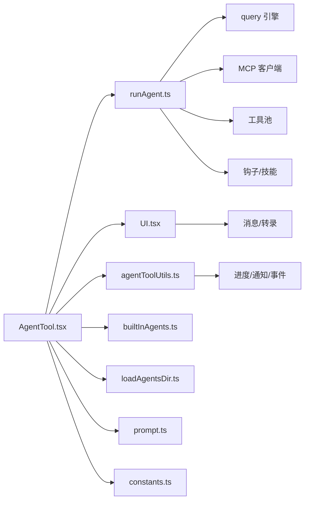

# 代理工具核心

<cite>
**本文引用的文件**
- [AgentTool.tsx](file://src/tools/AgentTool/AgentTool.tsx)
- [UI.tsx](file://src/tools/AgentTool/UI.tsx)
- [runAgent.ts](file://src/tools/AgentTool/runAgent.ts)
- [agentToolUtils.ts](file://src/tools/AgentTool/agentToolUtils.ts)
- [builtInAgents.ts](file://src/tools/AgentTool/builtInAgents.ts)
- [constants.ts](file://src/tools/AgentTool/constants.ts)
- [prompt.ts](file://src/tools/AgentTool/prompt.ts)
- [loadAgentsDir.ts](file://src/tools/AgentTool/loadAgentsDir.ts)
- [agentMemory.ts](file://src/tools/AgentTool/agentMemory.ts)
- [agentMemorySnapshot.ts](file://src/tools/AgentTool/agentMemorySnapshot.ts)
- [agentDisplay.ts](file://src/tools/AgentTool/agentDisplay.ts)
- [agentColorManager.ts](file://src/tools/AgentTool/agentColorManager.ts)
- [forkSubagent.ts](file://src/tools/AgentTool/forkSubagent.ts)
- [resumeAgent.ts](file://src/tools/AgentTool/resumeAgent.ts)
- [built-in/claudeCodeGuideAgent.ts](file://src/tools/AgentTool/built-in/claudeCodeGuideAgent.ts)
- [built-in/exploreAgent.ts](file://src/tools/AgentTool/built-in/exploreAgent.ts)
- [built-in/generalPurposeAgent.ts](file://src/tools/AgentTool/built-in/generalPurposeAgent.ts)
- [built-in/planAgent.ts](file://src/tools/AgentTool/built-in/planAgent.ts)
- [built-in/statuslineSetup.ts](file://src/tools/AgentTool/built-in/statuslineSetup.ts)
- [built-in/verificationAgent.ts](file://src/tools/AgentTool/built-in/verificationAgent.ts)
</cite>

## 目录
1. [简介](#简介)
2. [项目结构](#项目结构)
3. [核心组件](#核心组件)
4. [架构总览](#架构总览)
5. [详细组件分析](#详细组件分析)
6. [依赖关系分析](#依赖关系分析)
7. [性能考量](#性能考量)
8. [故障排查指南](#故障排查指南)
9. [结论](#结论)
10. [附录：使用示例与最佳实践](#附录使用示例与最佳实践)

## 简介
本文件系统性阐述代理工具（AgentTool）的核心架构与实现细节，覆盖初始化流程、生命周期管理、状态控制、UI 组件与交互、权限与配置、调试与性能优化，以及与系统其他模块的集成方式。AgentTool 是一个可扩展的子代理编排器，支持同步/异步执行、工作树隔离、远程运行、MCP 服务器集成、多智能体团队协作等能力，并通过统一的 UI 层对进度、结果与错误进行可视化呈现。

## 项目结构
AgentTool 所在目录位于 src/tools/AgentTool，主要由以下层次构成：
- 工具定义与调用入口：AgentTool.tsx
- 子代理执行引擎：runAgent.ts
- UI 渲染与交互：UI.tsx
- 工具解析与结果收尾：agentToolUtils.ts
- 内置代理与特性开关：builtInAgents.ts、built-in/*.ts
- 配置与提示词：constants.ts、prompt.ts、loadAgentsDir.ts
- 辅助能力：agentMemory*.ts、agentDisplay.ts、agentColorManager.ts、forkSubagent.ts、resumeAgent.ts

图示来源
- [AgentTool.tsx:196-1387](file://src/tools/AgentTool/AgentTool.tsx#L196-L1387)
- [runAgent.ts:248-974](file://src/tools/AgentTool/runAgent.ts#L248-L974)
- [UI.tsx:1-872](file://src/tools/AgentTool/UI.tsx#L1-L872)
- [agentToolUtils.ts:1-688](file://src/tools/AgentTool/agentToolUtils.ts#L1-L688)
- [builtInAgents.ts:22-72](file://src/tools/AgentTool/builtInAgents.ts#L22-L72)
- [built-in/generalPurposeAgent.ts](file://src/tools/AgentTool/built-in/generalPurposeAgent.ts)
- [built-in/exploreAgent.ts](file://src/tools/AgentTool/built-in/exploreAgent.ts)
- [built-in/planAgent.ts](file://src/tools/AgentTool/built-in/planAgent.ts)
- [built-in/claudeCodeGuideAgent.ts](file://src/tools/AgentTool/built-in/claudeCodeGuideAgent.ts)
- [built-in/statuslineSetup.ts](file://src/tools/AgentTool/built-in/statuslineSetup.ts)
- [built-in/verificationAgent.ts](file://src/tools/AgentTool/built-in/verificationAgent.ts)
- [constants.ts:1-13](file://src/tools/AgentTool/constants.ts#L1-L13)
- [prompt.ts:1-46](file://src/tools/AgentTool/prompt.ts#L1-L46)
- [loadAgentsDir.ts:474-507](file://src/tools/AgentTool/loadAgentsDir.ts#L474-L507)
- [agentMemory.ts](file://src/tools/AgentTool/agentMemory.ts)
- [agentMemorySnapshot.ts](file://src/tools/AgentTool/agentMemorySnapshot.ts)
- [agentDisplay.ts](file://src/tools/AgentTool/agentDisplay.ts)
- [agentColorManager.ts](file://src/tools/AgentTool/agentColorManager.ts)
- [forkSubagent.ts](file://src/tools/AgentTool/forkSubagent.ts)
- [resumeAgent.ts](file://src/tools/AgentTool/resumeAgent.ts)

章节来源
- [AgentTool.tsx:1-1398](file://src/tools/AgentTool/AgentTool.tsx#L1-L1398)
- [runAgent.ts:1-974](file://src/tools/AgentTool/runAgent.ts#L1-L974)
- [UI.tsx:1-872](file://src/tools/AgentTool/UI.tsx#L1-L872)
- [agentToolUtils.ts:1-688](file://src/tools/AgentTool/agentToolUtils.ts#L1-L688)
- [builtInAgents.ts:1-73](file://src/tools/AgentTool/builtInAgents.ts#L1-L73)
- [constants.ts:1-13](file://src/tools/AgentTool/constants.ts#L1-L13)
- [prompt.ts:1-46](file://src/tools/AgentTool/prompt.ts#L1-L46)
- [loadAgentsDir.ts:474-507](file://src/tools/AgentTool/loadAgentsDir.ts#L474-L507)

## 核心组件
- 工具定义与调用：AgentTool.tsx 中通过 buildTool 定义输入/输出模式、权限检查、UI 渲染与结果映射，负责任务分发、隔离与生命周期管理。
- 子代理执行器：runAgent.ts 负责构建系统提示词、工具池、MCP 客户端、会话上下文，驱动 query 循环并产出消息流。
- UI 与交互：UI.tsx 提供进度、摘要、错误与拒绝消息的渲染，支持转录模式、快捷键提示、搜索/读取操作汇总等。
- 工具解析与结果收尾：agentToolUtils.ts 实现工具筛选与解析、最终结果聚合、进度上报、手递手分类器集成、部分结果提取等。
- 内置代理与特性：builtInAgents.ts 按环境与特性开关动态加载内置代理；built-in/*.ts 定义具体代理的行为与提示词。
- 配置与提示词：constants.ts 定义工具名常量；prompt.ts 生成代理列表与工具描述；loadAgentsDir.ts 解析自定义代理定义与内存提示词。

章节来源
- [AgentTool.tsx:196-1387](file://src/tools/AgentTool/AgentTool.tsx#L196-L1387)
- [runAgent.ts:248-974](file://src/tools/AgentTool/runAgent.ts#L248-L974)
- [UI.tsx:1-872](file://src/tools/AgentTool/UI.tsx#L1-L872)
- [agentToolUtils.ts:1-688](file://src/tools/AgentTool/agentToolUtils.ts#L1-L688)
- [builtInAgents.ts:22-72](file://src/tools/AgentTool/builtInAgents.ts#L22-L72)
- [constants.ts:1-13](file://src/tools/AgentTool/constants.ts#L1-L13)
- [prompt.ts:1-46](file://src/tools/AgentTool/prompt.ts#L1-L46)
- [loadAgentsDir.ts:474-507](file://src/tools/AgentTool/loadAgentsDir.ts#L474-L507)

## 架构总览
AgentTool 的整体数据流与控制流如下：

图示来源
- [AgentTool.tsx:239-1262](file://src/tools/AgentTool/AgentTool.tsx#L239-L1262)
- [runAgent.ts:748-807](file://src/tools/AgentTool/runAgent.ts#L748-L807)
- [UI.tsx:445-570](file://src/tools/AgentTool/UI.tsx#L445-L570)
- [agentToolUtils.ts:277-358](file://src/tools/AgentTool/agentToolUtils.ts#L277-L358)

## 详细组件分析

### 组件一：AgentTool.tsx（工具定义与生命周期）
- 输入/输出模式：基于 Zod 的延迟求值模式，按特性开关与环境变量动态裁剪字段（如 cwd、run_in_background），确保类型安全与最小暴露面。
- 权限与路由：支持多智能体团队协作（spawnTeammate）、fork 子代理实验路径、远程隔离（teleport）、MCP 服务器可用性检查与等待。
- 生命周期：
  - 同步：注册前台任务、显示后台提示、迭代消息、更新进度、清理资源、发出 SDK 事件。
  - 异步：注册后台任务、启动 runAsyncAgentLifecycle、后台续跑、通知与摘要。
- 隔离与工作树：根据 isolation 选择 worktree 或 remote；完成后检测变更并清理或保留。
- UI 映射：mapToolResultToToolResultBlockParam 将内部状态映射为 UI 友好的文本块，包含 agentId、usage、worktree 信息等。

图示来源
- [AgentTool.tsx:239-1262](file://src/tools/AgentTool/AgentTool.tsx#L239-L1262)
- [agentToolUtils.ts:509-688](file://src/tools/AgentTool/agentToolUtils.ts#L509-L688)

章节来源
- [AgentTool.tsx:196-1387](file://src/tools/AgentTool/AgentTool.tsx#L196-L1387)

### 组件二：runAgent.ts（子代理执行引擎）
- 系统提示词与上下文：从 agentDefinition、工具池、MCP 客户端、附加工作目录等构建有效系统提示词。
- MCP 服务器：支持在代理定义中声明 MCP 服务器，连接后合并工具，支持清理与隔离。
- 工具解析：resolveAgentTools 基于 agent 的 tools/disallowedTools/source/permissionMode 过滤可用工具，支持通配符与规则解析。
- 会话与钩子：注册 SubagentStart 钩子、预加载技能、记录侧链转录、写入元数据。
- 查询循环：yield attachment/progress/recordable 消息，转发 API 指标，支持最大轮次限制。
- 上下文隔离：createSubagentContext 为同步/异步子代理创建独立上下文，避免父级影响。

图示来源
- [runAgent.ts:248-974](file://src/tools/AgentTool/runAgent.ts#L248-L974)
- [loadAgentsDir.ts:474-507](file://src/tools/AgentTool/loadAgentsDir.ts#L474-L507)

章节来源
- [runAgent.ts:1-974](file://src/tools/AgentTool/runAgent.ts#L1-L974)
- [agentToolUtils.ts:122-225](file://src/tools/AgentTool/agentToolUtils.ts#L122-L225)

### 组件三：UI.tsx（UI 渲染与交互）
- 进度处理：hasProgressMessage 判定、processProgressMessages 分组搜索/读取/REPL 操作、condensed 模式适配终端尺寸。
- 结果渲染：renderToolResultMessage、renderToolUseProgressMessage、renderToolUseRejectedMessage、renderToolUseErrorMessage。
- 多代理聚合：renderGroupedAgentToolUse 聚合多个子代理的统计与状态，支持动画与快捷键提示。
- 标签与名称：userFacingName/userFacingNameBackgroundColor 控制显示名称与颜色。

图示来源
- [UI.tsx:35-180](file://src/tools/AgentTool/UI.tsx#L35-L180)
- [UI.tsx:445-570](file://src/tools/AgentTool/UI.tsx#L445-L570)
- [UI.tsx:627-759](file://src/tools/AgentTool/UI.tsx#L627-L759)

章节来源
- [UI.tsx:1-872](file://src/tools/AgentTool/UI.tsx#L1-L872)

### 组件四：agentToolUtils.ts（工具解析与结果收尾）
- 工具筛选：filterToolsForAgent 按内置/自定义/异步/计划模式等规则过滤工具集合。
- 工具解析：resolveAgentTools 支持通配符、规则解析、允许的 Agent 类型元数据。
- 结果收尾：finalizeAgentTool 计算 token/工具数/时长，记录事件，返回标准化结果。
- 进度上报：emitTaskProgress 将进度事件发送给 SDK。
- 手递手分类器：classifyHandoffIfNeeded 在自动模式下对子代理输出进行安全审查。
- 异步生命周期：runAsyncAgentLifecycle 统一后台执行、进度更新、通知与清理。

章节来源
- [agentToolUtils.ts:70-225](file://src/tools/AgentTool/agentToolUtils.ts#L70-L225)
- [agentToolUtils.ts:277-358](file://src/tools/AgentTool/agentToolUtils.ts#L277-L358)
- [agentToolUtils.ts:390-482](file://src/tools/AgentTool/agentToolUtils.ts#L390-L482)
- [agentToolUtils.ts:509-688](file://src/tools/AgentTool/agentToolUtils.ts#L509-L688)

### 组件五：内置代理与特性开关（builtInAgents.ts 与 built-in/*.ts）
- 动态加载：按特性开关与环境变量决定启用哪些内置代理（通用、探索、规划、状态栏、验证、代码向导）。
- 协调者模式：在协调者模式下可替换为协调者代理集。
- 一次性代理：对 Explore/Plan 等一次性代理省略 agentId/SendMessage/usage 尾部以节省 token。

章节来源
- [builtInAgents.ts:13-72](file://src/tools/AgentTool/builtInAgents.ts#L13-L72)
- [built-in/generalPurposeAgent.ts](file://src/tools/AgentTool/built-in/generalPurposeAgent.ts)
- [built-in/exploreAgent.ts](file://src/tools/AgentTool/built-in/exploreAgent.ts)
- [built-in/planAgent.ts](file://src/tools/AgentTool/built-in/planAgent.ts)
- [built-in/claudeCodeGuideAgent.ts](file://src/tools/AgentTool/built-in/claudeCodeGuideAgent.ts)
- [built-in/statuslineSetup.ts](file://src/tools/AgentTool/built-in/statuslineSetup.ts)
- [built-in/verificationAgent.ts](file://src/tools/AgentTool/built-in/verificationAgent.ts)

### 组件六：配置与提示词（constants.ts、prompt.ts、loadAgentsDir.ts）
- 常量：工具名、一次性代理类型集合。
- 提示词：formatAgentLine 与 getToolsDescription 用于生成代理列表与工具描述。
- 自定义代理：loadAgentsDir 解析 frontmatter 定义，注入 memory、model、effort、permissionMode、mcpServers、hooks、maxTurns、skills、initialPrompt、background、isolation 等。

章节来源
- [constants.ts:1-13](file://src/tools/AgentTool/constants.ts#L1-L13)
- [prompt.ts:20-46](file://src/tools/AgentTool/prompt.ts#L20-L46)
- [loadAgentsDir.ts:474-507](file://src/tools/AgentTool/loadAgentsDir.ts#L474-L507)

### 组件七：辅助能力（agentMemory*.ts、agentDisplay.ts、agentColorManager.ts、forkSubagent.ts、resumeAgent.ts）
- 内存：agentMemory 与 agentMemorySnapshot 提供代理记忆的加载与快照。
- 显示：agentDisplay 提供代理显示相关逻辑。
- 颜色：agentColorManager 为代理类型分配与管理颜色。
- Fork：forkSubagent 提供 fork 子代理的上下文与消息克隆。
- 恢复：resumeAgent 提供后台任务恢复与续跑。

章节来源
- [agentMemory.ts](file://src/tools/AgentTool/agentMemory.ts)
- [agentMemorySnapshot.ts](file://src/tools/AgentTool/agentMemorySnapshot.ts)
- [agentDisplay.ts](file://src/tools/AgentTool/agentDisplay.ts)
- [agentColorManager.ts](file://src/tools/AgentTool/agentColorManager.ts)
- [forkSubagent.ts](file://src/tools/AgentTool/forkSubagent.ts)
- [resumeAgent.ts](file://src/tools/AgentTool/resumeAgent.ts)

## 依赖关系分析
- AgentTool.tsx 依赖 runAgent.ts、UI.tsx、agentToolUtils.ts、builtInAgents.ts、loadAgentsDir.ts、prompt.ts、constants.ts、agentMemory*.ts、agentColorManager.ts、forkSubagent.ts、resumeAgent.ts。
- runAgent.ts 依赖 query 引擎、MCP 客户端、工具池装配、钩子与技能加载、转录记录与元数据写入。
- UI.tsx 依赖工具与消息处理、主题与键盘提示、转录与摘要工具。
- agentToolUtils.ts 依赖任务进度跟踪、通知队列、SDK 事件、分类器与工具匹配。

图示来源
- [AgentTool.tsx:1-1398](file://src/tools/AgentTool/AgentTool.tsx#L1-L1398)
- [runAgent.ts:1-974](file://src/tools/AgentTool/runAgent.ts#L1-L974)
- [UI.tsx:1-872](file://src/tools/AgentTool/UI.tsx#L1-L872)
- [agentToolUtils.ts:1-688](file://src/tools/AgentTool/agentToolUtils.ts#L1-L688)

章节来源
- [AgentTool.tsx:1-1398](file://src/tools/AgentTool/AgentTool.tsx#L1-L1398)
- [runAgent.ts:1-974](file://src/tools/AgentTool/runAgent.ts#L1-L974)
- [UI.tsx:1-872](file://src/tools/AgentTool/UI.tsx#L1-L872)
- [agentToolUtils.ts:1-688](file://src/tools/AgentTool/agentToolUtils.ts#L1-L688)

## 性能考量
- prompt 缓存一致性：fork 子代理路径通过 useExactTools 与继承 thinkingConfig 保持 API 请求前缀一致，提升缓存命中率。
- 工具池隔离：子代理独立组装工具池，避免父级工具限制影响，减少不必要的工具序列化差异。
- 读写上下文裁剪：针对只读代理（Explore/Plan）与特定场景移除冗余上下文，降低 token 消耗。
- 终端尺寸自适应：UI 在小终端采用 condense 模式，减少闪烁与渲染开销。
- 后台摘要：在启用时对后台任务进行周期性摘要，平衡可观测性与性能。
- 工作树变更检测：仅在有变更时保留工作树，避免无谓的磁盘占用与清理成本。

## 故障排查指南
- 权限与 MCP：若提示“未找到代理类型”或“MCP 服务器缺失”，检查 permission 规则、Agent 定义的 tools/disallowedTools、requiredMcpServers 与服务器连接状态。
- 后台任务异常：查看任务状态与通知，确认是否被用户中断（AbortError）或因外部因素失败；必要时使用输出文件进行进度检查。
- UI 不显示进度：确认 onProgress 回调是否正确传递，检查终端尺寸与 condensed 模式阈值。
- fork 递归：若报错“禁止在 fork 中再次 fork”，请直接使用工具完成任务而非再次调用 AgentTool。
- 远程运行：远程隔离需满足前置条件，检查远程环境可用性与打包失败提示。

章节来源
- [AgentTool.tsx:370-410](file://src/tools/AgentTool/AgentTool.tsx#L370-L410)
- [AgentTool.tsx:332-334](file://src/tools/AgentTool/AgentTool.tsx#L332-L334)
- [AgentTool.tsx:435-452](file://src/tools/AgentTool/AgentTool.tsx#L435-L452)
- [UI.tsx:490-503](file://src/tools/AgentTool/UI.tsx#L490-L503)
- [agentToolUtils.ts:641-682](file://src/tools/AgentTool/agentToolUtils.ts#L641-L682)

## 结论
AgentTool 通过清晰的职责划分与模块化设计，实现了从工具定义、子代理执行、UI 渲染到生命周期管理的全链路能力。其特性开关、MCP 集成、工作树隔离与远程运行等机制，使其在复杂工程场景中具备高度可扩展性与可控性。配合完善的进度追踪、通知与调试工具，能够稳定支撑大规模子代理编排与团队协作。

## 附录：使用示例与最佳实践
- 使用示例
  - 同步子代理：传入 description 与 prompt，不设置 run_in_background，等待即时结果。
  - 异步子代理：设置 run_in_background=true 或 agent.background=true，稍后通过输出文件或通知查看结果。
  - 多智能体团队：设置 team_name 与 name，触发 spawnTeammate；注意 in-process teammates 不支持后台运行。
  - 工作树隔离：设置 isolation=worktree，在子代理中进行无侵入式开发与测试。
  - 远程隔离：设置 isolation=remote，委托至远程 CCR 环境运行。
- 最佳实践
  - 明确权限模式：根据任务需求选择 acceptEdits/bubble/plan/auto，避免不必要的权限弹窗。
  - 合理设置模型与 effort：在 Agent 定义中指定模型与 effort，平衡速度与质量。
  - 使用工具白名单：通过 agent.tools 与 disallowedTools 精准控制工具集，减少副作用。
  - 监控与调试：开启转录模式与 SDK 事件，结合输出文件定位问题；利用 UI 的快捷键提示快速展开详情。
  - 性能优化：优先使用 fork 子代理路径以提升缓存命中；在只读代理场景移除冗余上下文；小终端启用 condensed 模式。