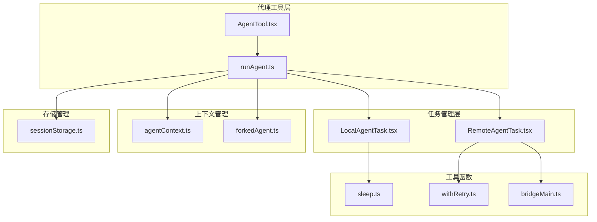
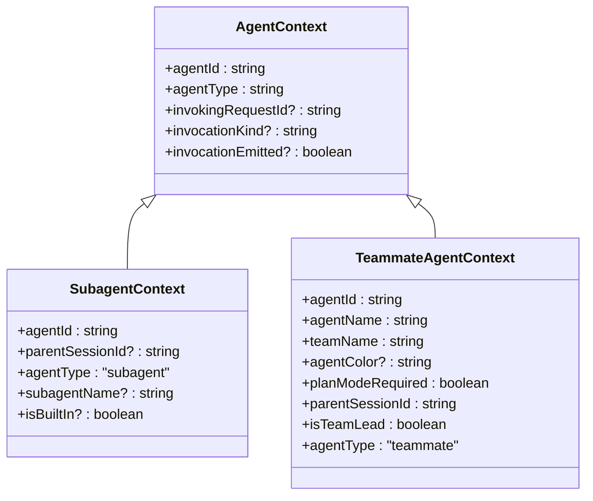
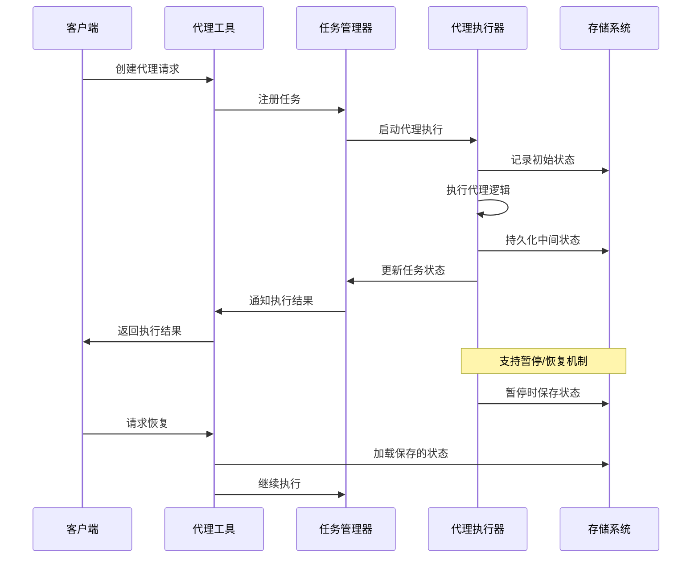
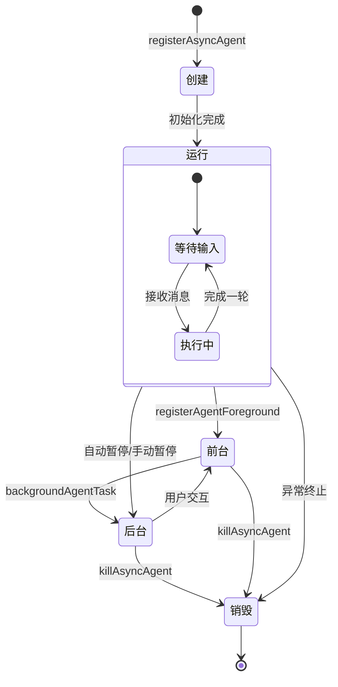
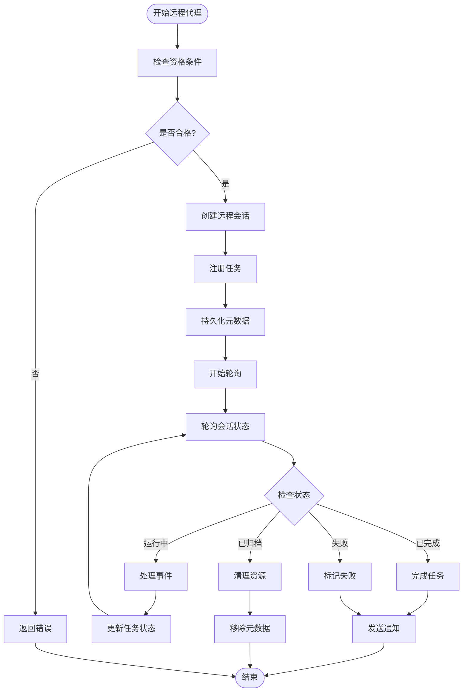
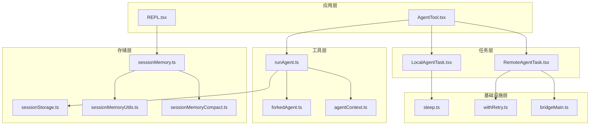

# 代理生命周期管理

<cite>
**本文档引用的文件**
- [LocalAgentTask.tsx](file://src/tasks/LocalAgentTask/LocalAgentTask.tsx)
- [RemoteAgentTask.tsx](file://src/tasks/RemoteAgentTask/RemoteAgentTask.tsx)
- [AgentTool.tsx](file://src/tools/AgentTool/AgentTool.tsx)
- [runAgent.ts](file://src/tools/AgentTool/runAgent.ts)
- [agentContext.ts](file://src/utils/agentContext.ts)
- [forkedAgent.ts](file://src/utils/forkedAgent.ts)
- [sessionStorage.ts](file://src/utils/sessionStorage.ts)
- [sleep.ts](file://src/utils/sleep.ts)
- [withRetry.ts](file://src/services/api/withRetry.ts)
- [bridgeMain.ts](file://src/bridge/bridgeMain.ts)
- [REPL.tsx](file://src/screens/REPL.tsx)
- [sessionMemory.ts](file://src/services/SessionMemory/sessionMemory.ts)
- [sessionMemoryUtils.ts](file://src/services/SessionMemory/sessionMemoryUtils.ts)
- [sessionMemoryCompact.ts](file://src/services/compact/sessionMemoryCompact.ts)
- [policyLimits.ts](file://src/services/policyLimits/index.ts)
</cite>

## 目录
1. [引言](#引言)
2. [项目结构](#项目结构)
3. [核心组件](#核心组件)
4. [架构概览](#架构概览)
5. [详细组件分析](#详细组件分析)
6. [依赖关系分析](#依赖关系分析)
7. [性能考虑](#性能考虑)
8. [故障排除指南](#故障排除指南)
9. [结论](#结论)

## 引言

本文档深入解析了Claude Code代码库中的代理生命周期管理系统。该系统支持本地代理和远程代理两种执行模式，提供了完整的代理创建、启动、运行、暂停、恢复和销毁流程管理。

代理生命周期管理是整个系统的基础设施，它确保了代理能够在不同的执行环境中可靠地运行，并提供了一致的状态管理和错误恢复机制。系统支持多种代理类型，包括通用代理、专用代理（如探索代理、代码审查代理等）以及团队代理（swarm代理）。

## 项目结构

代理生命周期管理系统主要分布在以下模块中：



**图表来源**
- [AgentTool.tsx:196-800](file://src/tools/AgentTool/AgentTool.tsx#L196-L800)
- [LocalAgentTask.tsx:271-684](file://src/tasks/LocalAgentTask/LocalAgentTask.tsx#L271-L684)
- [RemoteAgentTask.tsx:393-800](file://src/tasks/RemoteAgentTask/RemoteAgentTask.tsx#L393-L800)

**章节来源**
- [AgentTool.tsx:196-800](file://src/tools/AgentTool/AgentTool.tsx#L196-L800)
- [LocalAgentTask.tsx:1-684](file://src/tasks/LocalAgentTask/LocalAgentTask.tsx#L1-L684)
- [RemoteAgentTask.tsx:1-800](file://src/tasks/RemoteAgentTask/RemoteAgentTask.tsx#L1-L800)

## 核心组件

### 代理任务类型

系统定义了两种主要的代理任务类型：

1. **本地代理任务 (LocalAgentTask)**：在本地进程中运行的代理，支持后台执行和前台交互
2. **远程代理任务 (RemoteAgentTask)**：在云端环境（CCR）中运行的代理，通过会话管理器进行协调

### 代理上下文管理

代理上下文使用AsyncLocalStorage确保并发代理间的隔离：



**图表来源**
- [agentContext.ts:28-85](file://src/utils/agentContext.ts#L28-L85)

**章节来源**
- [agentContext.ts:1-179](file://src/utils/agentContext.ts#L1-L179)

## 架构概览

代理生命周期管理采用分层架构设计，确保了系统的可扩展性和可靠性：



**图表来源**
- [AgentTool.tsx:686-765](file://src/tools/AgentTool/AgentTool.tsx#L686-L765)
- [runAgent.ts:748-806](file://src/tools/AgentTool/runAgent.ts#L748-L806)

## 详细组件分析

### 本地代理生命周期

本地代理的生命周期管理是最复杂的部分，因为它需要处理前台/后台切换、自动暂停、内存清理等多个方面：



**图表来源**
- [LocalAgentTask.tsx:467-684](file://src/tasks/LocalAgentTask/LocalAgentTask.tsx#L467-L684)

#### 内存管理机制

本地代理实现了多层次的内存管理策略：

1. **文件状态缓存管理**：使用克隆的文件状态缓存，避免父进程状态污染
2. **内容替换状态管理**：支持从恢复的侧链记录重建内容替换状态
3. **MCP服务器清理**：代理完成后自动清理临时创建的MCP服务器连接

#### 状态持久化

代理状态持久化通过以下机制实现：

- **侧链转录记录**：使用`recordSidechainTranscript`记录代理执行过程
- **元数据文件**：使用`.meta.json`文件存储代理类型、工作树路径等信息
- **输出文件管理**：通过符号链接管理代理输出文件

**章节来源**
- [LocalAgentTask.tsx:271-684](file://src/tasks/LocalAgentTask/LocalAgentTask.tsx#L271-L684)
- [runAgent.ts:732-860](file://src/tools/AgentTool/runAgent.ts#L732-L860)

### 远程代理生命周期

远程代理生命周期管理专注于云端环境的协调和状态同步：



**图表来源**
- [RemoteAgentTask.tsx:393-800](file://src/tasks/RemoteAgentTask/RemoteAgentTask.tsx#L393-L800)

#### 会话恢复机制

远程代理支持完整的会话恢复功能：

1. **元数据扫描**：启动时扫描`remote-agents/`目录中的元数据文件
2. **状态同步**：通过CCR API获取最新会话状态
3. **任务重建**：根据元数据重建任务状态并重新开始轮询
4. **资源清理**：清理已归档或不存在的会话元数据

**章节来源**
- [RemoteAgentTask.tsx:475-539](file://src/tasks/RemoteAgentTask/RemoteAgentTask.tsx#L475-L539)

### 分叉代理管理

分叉代理是系统的核心创新，它允许代理在保持提示缓存命中率的同时进行并行执行：

```mermaid
classDiagram
class ForkedAgent {
+promptMessages : Message[]
+cacheSafeParams : CacheSafeParams
+canUseTool : CanUseToolFn
+querySource : QuerySource
+forkLabel : string
+overrides? : SubagentContextOverrides
+maxOutputTokens? : number
+maxTurns? : number
+onMessage? : Function
+skipTranscript? : boolean
+skipCacheWrite? : boolean
}
class CacheSafeParams {
+systemPrompt : SystemPrompt
+userContext : { [k : string] : string }
+systemContext : { [k : string] : string }
+toolUseContext : ToolUseContext
+forkContextMessages : Message[]
}
class SubagentContextOverrides {
+options? : ToolUseContext['options']
+agentId? : AgentId
+agentType? : string
+messages? : Message[]
+readFileState? : ToolUseContext['readFileState']
+abortController? : AbortController
+getAppState? : ToolUseContext['getAppState']
+shareSetAppState? : boolean
+shareSetResponseLength? : boolean
+shareAbortController? : boolean
+criticalSystemReminder_EXPERIMENTAL? : string
+requireCanUseTool? : boolean
+contentReplacementState? : ContentReplacementState
}
ForkedAgent --> CacheSafeParams
ForkedAgent --> SubagentContextOverrides
```

**图表来源**
- [forkedAgent.ts:47-113](file://src/utils/forkedAgent.ts#L47-L113)

**章节来源**
- [forkedAgent.ts:489-626](file://src/utils/forkedAgent.ts#L489-L626)

### 资源控制和超时处理

系统实现了多层资源控制和超时处理机制：

#### 本地代理资源控制

- **内存限制**：通过文件状态缓存大小限制防止内存泄漏
- **并发控制**：使用队列管理代理任务的创建和销毁
- **超时处理**：支持可配置的自动暂停和超时机制

#### 远程代理资源控制

- **网络超时**：轮询间隔和超时时间可配置
- **资源配额**：通过政策限制服务的使用
- **重试机制**：智能重试策略处理临时性错误

**章节来源**
- [sleep.ts:1-38](file://src/utils/sleep.ts#L1-L38)
- [withRetry.ts:353-382](file://src/services/api/withRetry.ts#L353-L382)
- [policyLimits.ts:50-84](file://src/services/policyLimits/index.ts#L50-L84)

## 依赖关系分析

代理生命周期管理系统具有清晰的依赖层次结构：



**图表来源**
- [AgentTool.tsx:1-800](file://src/tools/AgentTool/AgentTool.tsx#L1-L800)
- [LocalAgentTask.tsx:1-684](file://src/tasks/LocalAgentTask/LocalAgentTask.tsx#L1-L684)
- [RemoteAgentTask.tsx:1-800](file://src/tasks/RemoteAgentTask/RemoteAgentTask.tsx#L1-L800)

**章节来源**
- [AgentTool.tsx:1-800](file://src/tools/AgentTool/AgentTool.tsx#L1-L800)
- [sessionStorage.ts:1-800](file://src/utils/sessionStorage.ts#L1-L800)

## 性能考虑

### 提示缓存优化

系统通过分叉代理机制实现了高效的提示缓存共享：

- **缓存安全参数**：确保分叉代理与父代理使用相同的缓存键
- **前缀匹配**：通过完全相同的API请求前缀保证缓存命中
- **成本控制**：禁用思考模式减少输出令牌成本

### 内存管理优化

- **惰性初始化**：代理只在需要时才加载相关资源
- **缓存复用**：文件状态缓存和工具池在代理间共享
- **及时清理**：代理完成后立即释放所有占用的资源

### 并发处理优化

- **异步执行**：所有代理操作都是异步的，不会阻塞主线程
- **资源池化**：MCP服务器连接和工具实例使用池化管理
- **背压处理**：通过队列机制处理高并发场景

## 故障排除指南

### 常见问题诊断

#### 代理无法启动

1. **检查权限**：确认代理定义的权限要求是否满足
2. **验证MCP服务器**：检查必需的MCP服务器是否可用且已认证
3. **检查工作树隔离**：如果使用工作树隔离，确认Git仓库状态正常

#### 代理执行异常

1. **查看日志**：检查代理输出文件中的错误信息
2. **验证工具权限**：确认代理使用的工具是否被允许
3. **检查资源限制**：确认没有超过API使用限制

#### 代理恢复失败

1. **检查元数据**：确认`.meta.json`文件完整且有效
2. **验证会话状态**：检查远程会话是否仍然存在
3. **清理残留状态**：删除损坏的元数据文件后重新尝试

**章节来源**
- [RemoteAgentTask.tsx:484-539](file://src/tasks/RemoteAgentTask/RemoteAgentTask.tsx#L484-L539)
- [sessionStorage.ts:283-303](file://src/utils/sessionStorage.ts#L283-L303)

## 结论

代理生命周期管理系统展现了现代AI代理平台的复杂性和精密性。通过精心设计的架构，系统实现了：

1. **统一的生命周期管理**：无论是本地还是远程代理，都遵循一致的生命周期模式
2. **强大的状态管理**：支持复杂的暂停/恢复机制和状态持久化
3. **高效的资源利用**：通过缓存共享和资源池化最大化系统效率
4. **可靠的错误处理**：完善的异常恢复和资源清理机制

该系统为AI代理的生产级部署提供了坚实的基础，支持从简单任务到复杂协作的各种应用场景。通过持续的优化和改进，系统将继续提升性能和可靠性，为用户提供更好的代理体验。