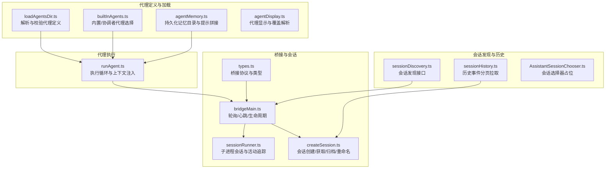
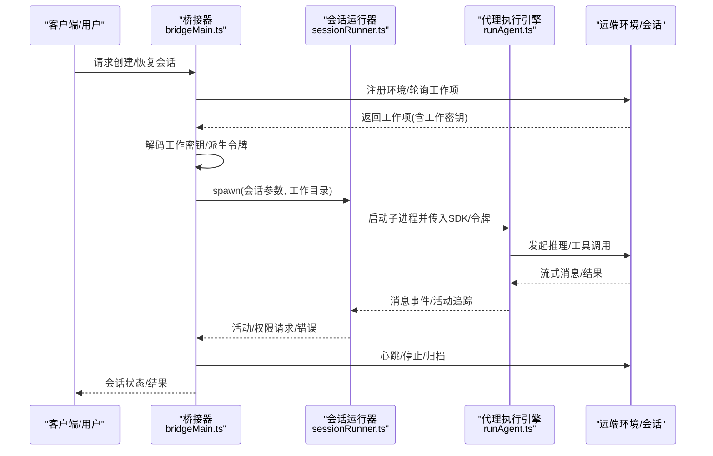
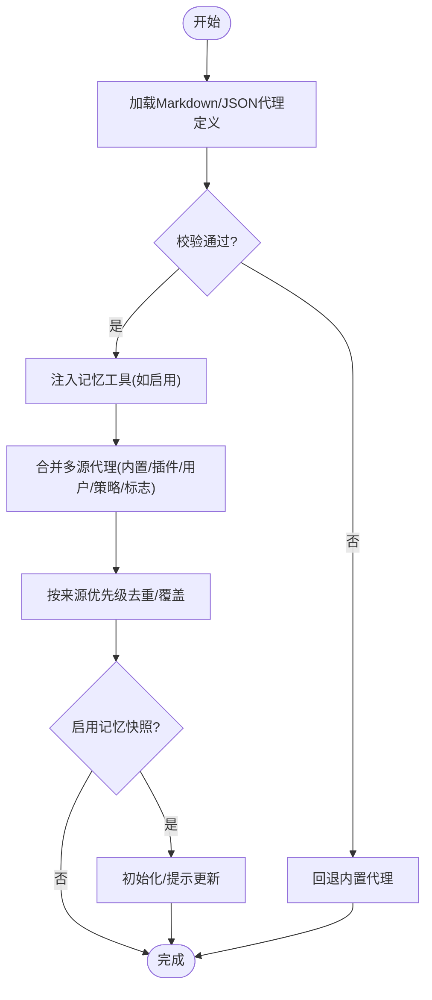
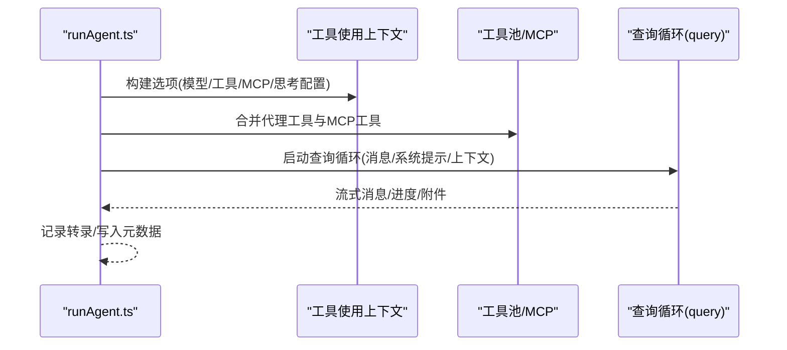
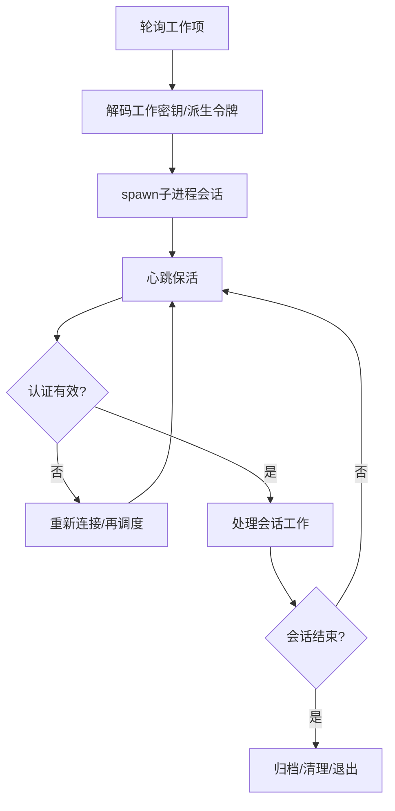
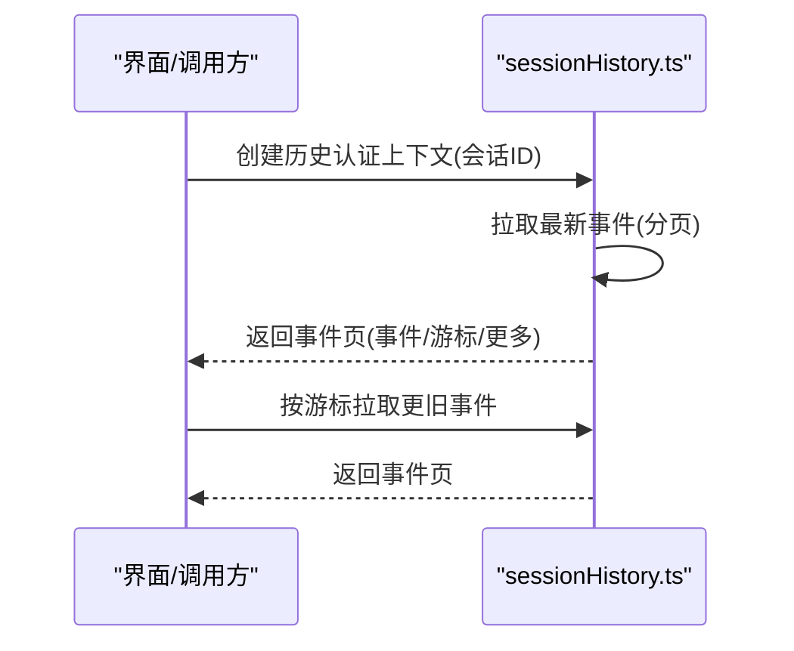
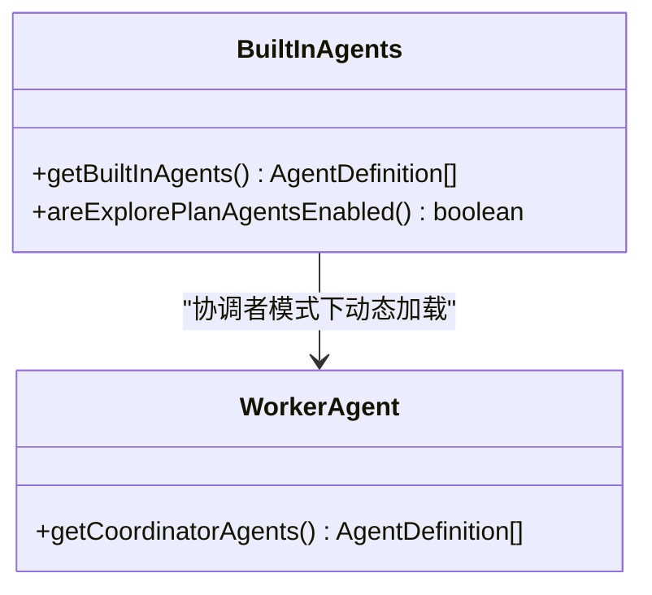
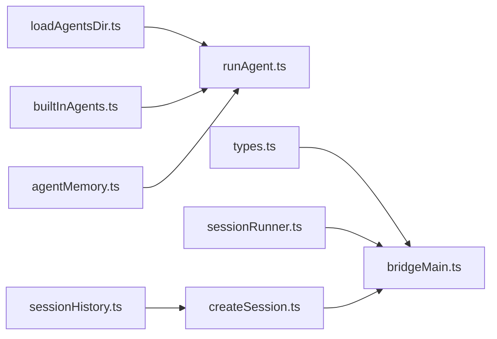

# 代理系统

<cite>
**本文引用的文件**
- [src/assistant/sessionDiscovery.ts](file://src/assistant/sessionDiscovery.ts)
- [src/assistant/sessionHistory.ts](file://src/assistant/sessionHistory.ts)
- [src/assistant/AssistantSessionChooser.ts](file://src/assistant/AssistantSessionChooser.ts)
- [src/bridge/bridgeMain.ts](file://src/bridge/bridgeMain.ts)
- [src/bridge/types.ts](file://src/bridge/types.ts)
- [src/bridge/sessionRunner.ts](file://src/bridge/sessionRunner.ts)
- [src/bridge/createSession.ts](file://src/bridge/createSession.ts)
- [src/tools/AgentTool/loadAgentsDir.ts](file://src/tools/AgentTool/loadAgentsDir.ts)
- [src/tools/AgentTool/runAgent.ts](file://src/tools/AgentTool/runAgent.ts)
- [src/tools/AgentTool/builtInAgents.ts](file://src/tools/AgentTool/builtInAgents.ts)
- [src/tools/AgentTool/agentMemory.ts](file://src/tools/AgentTool/agentMemory.ts)
- [src/tools/AgentTool/agentDisplay.ts](file://src/tools/AgentTool/agentDisplay.ts)
- [src/coordinator/workerAgent.ts](file://src/coordinator/workerAgent.ts)
</cite>

## 目录
1. [简介](#简介)
2. [项目结构](#项目结构)
3. [核心组件](#核心组件)
4. [架构总览](#架构总览)
5. [详细组件分析](#详细组件分析)
6. [依赖关系分析](#依赖关系分析)
7. [性能考量](#性能考量)
8. [故障排除指南](#故障排除指南)
9. [结论](#结论)
10. [附录](#附录)

## 简介
本文件面向“代理系统”的使用者与维护者，系统性阐述代理（Agent）的架构设计、生命周期管理、代理发现与会话发现、历史记录、代理间通信与协作、配置与行为定制、部署与运维策略，以及能力扩展与性能优化实践。文档以仓库中的实现为依据，结合代码级图示与流程图，帮助读者快速理解并高效使用代理系统。

## 项目结构
代理系统主要由以下模块构成：
- 代理定义与加载：解析用户/插件/内置代理定义，构建可用代理池，并支持内存快照初始化。
- 代理执行：在统一的查询循环中运行代理，注入工具、上下文、权限与MCP服务器，产出消息流。
- 桥接与会话：桥接器负责与远端环境交互、轮询工作项、启动子进程会话、心跳与清理。
- 会话发现与历史：提供会话发现接口与历史事件分页拉取能力。
- 协调者与子代理：在协调者模式下，按需加载协调者/工人代理集合。

**图表来源**
- [src/tools/AgentTool/loadAgentsDir.ts:1-756](file://src/tools/AgentTool/loadAgentsDir.ts#L1-L756)
- [src/tools/AgentTool/runAgent.ts:1-974](file://src/tools/AgentTool/runAgent.ts#L1-L974)
- [src/tools/AgentTool/builtInAgents.ts:1-73](file://src/tools/AgentTool/builtInAgents.ts#L1-L73)
- [src/tools/AgentTool/agentMemory.ts:1-178](file://src/tools/AgentTool/agentMemory.ts#L1-L178)
- [src/tools/AgentTool/agentDisplay.ts:1-105](file://src/tools/AgentTool/agentDisplay.ts#L1-L105)
- [src/bridge/bridgeMain.ts:1-3000](file://src/bridge/bridgeMain.ts#L1-L3000)
- [src/bridge/sessionRunner.ts:1-551](file://src/bridge/sessionRunner.ts#L1-L551)
- [src/bridge/createSession.ts:1-385](file://src/bridge/createSession.ts#L1-L385)
- [src/bridge/types.ts:1-263](file://src/bridge/types.ts#L1-L263)
- [src/assistant/sessionDiscovery.ts:1-4](file://src/assistant/sessionDiscovery.ts#L1-L4)
- [src/assistant/sessionHistory.ts:1-88](file://src/assistant/sessionHistory.ts#L1-L88)
- [src/assistant/AssistantSessionChooser.ts:1-4](file://src/assistant/AssistantSessionChooser.ts#L1-L4)

**章节来源**
- [src/tools/AgentTool/loadAgentsDir.ts:1-756](file://src/tools/AgentTool/loadAgentsDir.ts#L1-L756)
- [src/tools/AgentTool/runAgent.ts:1-974](file://src/tools/AgentTool/runAgent.ts#L1-L974)
- [src/bridge/bridgeMain.ts:1-3000](file://src/bridge/bridgeMain.ts#L1-L3000)
- [src/bridge/sessionRunner.ts:1-551](file://src/bridge/sessionRunner.ts#L1-L551)
- [src/bridge/createSession.ts:1-385](file://src/bridge/createSession.ts#L1-L385)
- [src/assistant/sessionDiscovery.ts:1-4](file://src/assistant/sessionDiscovery.ts#L1-L4)
- [src/assistant/sessionHistory.ts:1-88](file://src/assistant/sessionHistory.ts#L1-L88)

## 核心组件
- 代理定义与解析
  - 支持从 Markdown/JSON 前言字段解析代理定义，含工具白/黑名单、权限模式、努力度、MCP 服务器、钩子、最大回合数、初始提示、记忆范围、隔离模式等。
  - 提供“活跃代理”去重与覆盖规则，确保同名代理按优先级来源生效。
- 代理执行引擎
  - 在统一查询循环中运行，注入系统提示、用户/系统上下文、工具池、命令、MCP 客户端、思考配置等。
  - 支持异步/同步两种执行模式，权限提示策略可按代理或父级控制。
- 桥接与会话管理
  - 轮询远端工作项，解码工作密钥，派生会话访问令牌与 SDK 地址，创建子进程会话。
  - 维护会话活动轨迹、错误日志、心跳保活、超时与中断处理、归档与清理。
- 会话发现与历史
  - 提供会话发现接口与历史事件分页拉取，支持最新与更旧事件翻页。
- 协调者与子代理
  - 在协调者模式下，动态加载协调者/工人代理集合；否则返回通用内置代理集。

**章节来源**
- [src/tools/AgentTool/loadAgentsDir.ts:70-191](file://src/tools/AgentTool/loadAgentsDir.ts#L70-L191)
- [src/tools/AgentTool/runAgent.ts:248-800](file://src/tools/AgentTool/runAgent.ts#L248-L800)
- [src/bridge/bridgeMain.ts:141-900](file://src/bridge/bridgeMain.ts#L141-L900)
- [src/bridge/sessionRunner.ts:248-551](file://src/bridge/sessionRunner.ts#L248-L551)
- [src/assistant/sessionDiscovery.ts:1-4](file://src/assistant/sessionDiscovery.ts#L1-L4)
- [src/assistant/sessionHistory.ts:7-88](file://src/assistant/sessionHistory.ts#L7-L88)
- [src/coordinator/workerAgent.ts:1-5](file://src/coordinator/workerAgent.ts#L1-L5)

## 架构总览
代理系统采用“定义-执行-桥接-会话-历史”的分层架构：
- 定义层：多源代理定义（内置/插件/用户/策略/标志），经解析与校验后形成统一的代理定义模型。
- 执行层：代理执行引擎在统一的查询循环中运行，按代理配置注入上下文与工具，产出消息流。
- 桥接层：桥接器负责与远端环境交互，轮询工作项，派发会话，维护会话生命周期。
- 会话层：子进程承载具体会话，桥接器追踪活动、错误与权限请求，必要时进行权限决策。
- 历史层：提供会话历史事件的分页拉取，便于回溯与审计。

**图表来源**
- [src/bridge/bridgeMain.ts:141-900](file://src/bridge/bridgeMain.ts#L141-L900)
- [src/bridge/sessionRunner.ts:248-551](file://src/bridge/sessionRunner.ts#L248-L551)
- [src/tools/AgentTool/runAgent.ts:248-800](file://src/tools/AgentTool/runAgent.ts#L248-L800)

**章节来源**
- [src/bridge/bridgeMain.ts:141-900](file://src/bridge/bridgeMain.ts#L141-L900)
- [src/bridge/sessionRunner.ts:248-551](file://src/bridge/sessionRunner.ts#L248-L551)
- [src/tools/AgentTool/runAgent.ts:248-800](file://src/tools/AgentTool/runAgent.ts#L248-L800)

## 详细组件分析

### 代理定义与加载（AgentTool）
- 代理定义模型
  - 支持描述、工具列表、禁用工具、系统提示、模型别名、努力度、权限模式、MCP 服务器、钩子、最大回合数、技能、初始提示、记忆范围、后台运行、隔离模式等字段。
  - 内置/自定义/插件三类代理定义，统一为代理定义模型。
- 解析与校验
  - 使用 Zod Schema 对 JSON/前言字段进行严格校验，失败时记录错误并回退到内置代理。
  - 支持从 Markdown 文件解析，自动注入读写编辑工具以支持记忆访问。
- 活跃代理与覆盖
  - 多源聚合后按优先级去重，高优先级来源覆盖低优先级同名代理。
- 记忆与快照
  - 支持用户/项目/本地三种记忆范围，生成记忆目录与提示；对用户记忆支持快照初始化与更新提示。

**图表来源**
- [src/tools/AgentTool/loadAgentsDir.ts:296-398](file://src/tools/AgentTool/loadAgentsDir.ts#L296-L398)
- [src/tools/AgentTool/agentMemory.ts:138-178](file://src/tools/AgentTool/agentMemory.ts#L138-L178)

**章节来源**
- [src/tools/AgentTool/loadAgentsDir.ts:70-191](file://src/tools/AgentTool/loadAgentsDir.ts#L70-L191)
- [src/tools/AgentTool/loadAgentsDir.ts:296-398](file://src/tools/AgentTool/loadAgentsDir.ts#L296-L398)
- [src/tools/AgentTool/agentMemory.ts:138-178](file://src/tools/AgentTool/agentMemory.ts#L138-L178)

### 代理执行引擎（runAgent）
- 上下文与工具
  - 动态解析代理工具，合并 MCP 工具，注入系统提示、用户/系统上下文、命令、MCP 客户端、思考配置等。
- 权限与提示
  - 可按代理覆盖权限模式，异步代理默认避免权限提示，必要时等待自动化检查。
- 子代理与钩子
  - 支持子代理启动钩子，前置技能预加载，增强上下文。
- 会话元数据与转录
  - 记录初始消息、写入代理元数据（类型/工作树路径/描述），用于恢复与可视化。

**图表来源**
- [src/tools/AgentTool/runAgent.ts:500-730](file://src/tools/AgentTool/runAgent.ts#L500-L730)

**章节来源**
- [src/tools/AgentTool/runAgent.ts:248-800](file://src/tools/AgentTool/runAgent.ts#L248-L800)

### 桥接与会话管理（bridgeMain + sessionRunner）
- 轮询与心跳
  - 轮询远端工作项，解码工作密钥，派生会话令牌与 SDK URL，心跳保活，处理认证失败与致命错误。
- 会话生命周期
  - spawn 子进程，追踪活动与错误，处理 SIGTERM/SIGKILL，令牌刷新，超时与中断处理，完成后归档与清理。
- 日志与诊断
  - 提供详细调试日志、转录文件、状态行更新、错误摘要与诊断输出。

**图表来源**
- [src/bridge/bridgeMain.ts:202-270](file://src/bridge/bridgeMain.ts#L202-L270)
- [src/bridge/bridgeMain.ts:442-591](file://src/bridge/bridgeMain.ts#L442-L591)
- [src/bridge/sessionRunner.ts:248-551](file://src/bridge/sessionRunner.ts#L248-L551)

**章节来源**
- [src/bridge/bridgeMain.ts:141-900](file://src/bridge/bridgeMain.ts#L141-L900)
- [src/bridge/sessionRunner.ts:248-551](file://src/bridge/sessionRunner.ts#L248-L551)

### 会话发现与历史（sessionDiscovery + sessionHistory）
- 会话发现
  - 提供会话发现接口与类型定义，当前为占位实现，后续可接入具体发现逻辑。
- 历史记录
  - 创建历史认证上下文，分页拉取最新与更旧事件，支持分页游标与大小控制，便于回放与审计。

**图表来源**
- [src/assistant/sessionHistory.ts:31-88](file://src/assistant/sessionHistory.ts#L31-L88)
- [src/assistant/sessionDiscovery.ts:1-4](file://src/assistant/sessionDiscovery.ts#L1-L4)

**章节来源**
- [src/assistant/sessionHistory.ts:1-88](file://src/assistant/sessionHistory.ts#L1-L88)
- [src/assistant/sessionDiscovery.ts:1-4](file://src/assistant/sessionDiscovery.ts#L1-L4)

### 协调者与子代理（builtInAgents + workerAgent）
- 内置代理选择
  - 根据特性开关与入口点决定是否启用探索/规划/验证等内置代理；在协调者模式下可加载协调者/工人代理集合。
- 协调者代理
  - 当启用协调者模式且满足条件时，动态加载协调者代理；否则返回通用内置代理集。

**图表来源**
- [src/tools/AgentTool/builtInAgents.ts:22-73](file://src/tools/AgentTool/builtInAgents.ts#L22-L73)
- [src/coordinator/workerAgent.ts:1-5](file://src/coordinator/workerAgent.ts#L1-L5)

**章节来源**
- [src/tools/AgentTool/builtInAgents.ts:1-73](file://src/tools/AgentTool/builtInAgents.ts#L1-L73)
- [src/coordinator/workerAgent.ts:1-5](file://src/coordinator/workerAgent.ts#L1-L5)

## 依赖关系分析
- 代理定义依赖
  - 代理定义解析依赖前端内容与工具解析、权限模式、MCP 配置、钩子与记忆路径。
- 执行依赖
  - 代理执行依赖查询循环、工具池、MCP 客户端、上下文、权限与模型配置。
- 桥接依赖
  - 桥接器依赖远端 API、会话运行器、类型定义、日志与诊断工具。
- 历史依赖
  - 历史拉取依赖 OAuth 配置、头部与组织 UUID、HTTP 客户端。

**图表来源**
- [src/tools/AgentTool/loadAgentsDir.ts:1-756](file://src/tools/AgentTool/loadAgentsDir.ts#L1-L756)
- [src/tools/AgentTool/runAgent.ts:1-974](file://src/tools/AgentTool/runAgent.ts#L1-L974)
- [src/tools/AgentTool/builtInAgents.ts:1-73](file://src/tools/AgentTool/builtInAgents.ts#L1-L73)
- [src/tools/AgentTool/agentMemory.ts:1-178](file://src/tools/AgentTool/agentMemory.ts#L1-L178)
- [src/bridge/types.ts:1-263](file://src/bridge/types.ts#L1-L263)
- [src/bridge/bridgeMain.ts:1-3000](file://src/bridge/bridgeMain.ts#L1-L3000)
- [src/bridge/sessionRunner.ts:1-551](file://src/bridge/sessionRunner.ts#L1-L551)
- [src/bridge/createSession.ts:1-385](file://src/bridge/createSession.ts#L1-L385)
- [src/assistant/sessionHistory.ts:1-88](file://src/assistant/sessionHistory.ts#L1-L88)

**章节来源**
- [src/tools/AgentTool/loadAgentsDir.ts:1-756](file://src/tools/AgentTool/loadAgentsDir.ts#L1-L756)
- [src/tools/AgentTool/runAgent.ts:1-974](file://src/tools/AgentTool/runAgent.ts#L1-L974)
- [src/bridge/bridgeMain.ts:1-3000](file://src/bridge/bridgeMain.ts#L1-L3000)
- [src/assistant/sessionHistory.ts:1-88](file://src/assistant/sessionHistory.ts#L1-L88)

## 性能考量
- 代理工具解析与缓存
  - 使用记忆化缓存代理定义解析结果，减少重复解析开销。
- 会话活动与错误缓冲
  - 限制活动与错误缓冲大小，避免内存膨胀；按需写入转录文件，降低 I/O 压力。
- 心跳与轮询策略
  - 根据容量与配置调整心跳间隔与轮询节流，避免空闲轮询风暴。
- 记忆与快照
  - 记忆目录按作用域隔离，快照初始化仅在需要时触发，避免频繁 I/O。

[本节为通用指导，无需特定文件引用]

## 故障排除指南
- 会话创建失败
  - 检查访问令牌与组织 UUID 是否存在；确认请求头与 Beta 标记正确；查看失败响应详情。
- 会话归档异常
  - 归档为尽力而为操作，若网络/服务端错误需重试；注意幂等性（已归档返回 409）。
- 权限提示未出现
  - 异步代理默认避免权限提示；若需弹窗，请显式允许或切换权限模式。
- 代理解析失败
  - 查看解析错误日志，确认前言字段完整性与格式；回退至内置代理以定位问题。
- 会话历史拉取为空
  - 检查分页游标与限制；确认会话 ID 与认证上下文；关注网络超时与状态码。

**章节来源**
- [src/bridge/createSession.ts:150-180](file://src/bridge/createSession.ts#L150-L180)
- [src/bridge/createSession.ts:263-317](file://src/bridge/createSession.ts#L263-L317)
- [src/tools/AgentTool/runAgent.ts:414-463](file://src/tools/AgentTool/runAgent.ts#L414-L463)
- [src/tools/AgentTool/loadAgentsDir.ts:379-391](file://src/tools/AgentTool/loadAgentsDir.ts#L379-L391)
- [src/assistant/sessionHistory.ts:45-67](file://src/assistant/sessionHistory.ts#L45-L67)

## 结论
代理系统通过清晰的定义-执行-桥接-会话-历史分层，实现了可配置、可扩展、可观测的代理生命周期管理。借助多源代理定义、灵活的权限与工具注入、完善的会话与历史能力，系统既适合个人使用也适用于团队协作与大规模部署。建议在生产环境中结合日志与诊断工具，持续优化轮询与心跳策略、权限提示与工具解析性能，并利用记忆与快照提升代理的上下文连续性。

[本节为总结，无需特定文件引用]

## 附录

### 代理配置与行为定制要点
- 代理定义字段
  - 描述、工具/禁用工具、系统提示、模型别名、努力度、权限模式、MCP 服务器、钩子、最大回合数、技能、初始提示、记忆范围、后台运行、隔离模式。
- 权限与提示
  - 可按代理覆盖权限模式；异步代理默认避免权限提示，必要时等待自动化检查。
- 记忆与快照
  - 用户/项目/本地三种记忆范围；支持快照初始化与更新提示。

**章节来源**
- [src/tools/AgentTool/loadAgentsDir.ts:70-191](file://src/tools/AgentTool/loadAgentsDir.ts#L70-L191)
- [src/tools/AgentTool/agentMemory.ts:138-178](file://src/tools/AgentTool/agentMemory.ts#L138-L178)
- [src/tools/AgentTool/runAgent.ts:414-463](file://src/tools/AgentTool/runAgent.ts#L414-L463)

### 代理部署与运维策略
- 桥接器运行
  - 启动桥接器，注册环境并进入轮询循环；根据配置调整最大会话数与 spawn 模式。
- 会话生命周期
  - 监控会话活动与错误，处理超时与中断；完成后归档并清理资源。
- 诊断与日志
  - 开启调试文件与转录记录；利用状态行与诊断日志定位问题。

**章节来源**
- [src/bridge/bridgeMain.ts:141-900](file://src/bridge/bridgeMain.ts#L141-L900)
- [src/bridge/sessionRunner.ts:248-551](file://src/bridge/sessionRunner.ts#L248-L551)

### 代理能力扩展与插件集成
- MCP 服务器
  - 代理可声明 MCP 服务器（引用或内联），运行时连接并注入工具；仅清理内联新建的客户端。
- 钩子与技能
  - 支持子代理启动钩子与技能预加载，增强上下文与行为。

**章节来源**
- [src/tools/AgentTool/runAgent.ts:95-218](file://src/tools/AgentTool/runAgent.ts#L95-L218)
- [src/tools/AgentTool/runAgent.ts:577-646](file://src/tools/AgentTool/runAgent.ts#L577-L646)

### 实际使用示例与调试技巧
- 使用步骤
  - 定义代理（Markdown/JSON），启动桥接器，创建会话，观察状态行与调试日志。
- 调试技巧
  - 开启详细日志与转录文件；利用历史事件分页回放；检查权限模式与工具解析结果。

**章节来源**
- [src/bridge/bridgeMain.ts:141-900](file://src/bridge/bridgeMain.ts#L141-L900)
- [src/assistant/sessionHistory.ts:73-88](file://src/assistant/sessionHistory.ts#L73-L88)