# 代理通信与协作

<cite>
**本文引用的文件**
- [bridgeMessaging.ts](file://src/bridge/bridgeMessaging.ts)
- [remoteBridgeCore.ts](file://src/bridge/remoteBridgeCore.ts)
- [replBridgeTransport.ts](file://src/bridge/replBridgeTransport.ts)
- [inboundMessages.ts](file://src/bridge/inboundMessages.ts)
- [createSession.ts](file://src/bridge/createSession.ts)
- [sessionRunner.ts](file://src/bridge/sessionRunner.ts)
- [flushGate.ts](file://src/bridge/flushGate.ts)
- [bridgePermissionCallbacks.ts](file://src/bridge/bridgePermissionCallbacks.ts)
- [coordinatorMode.ts](file://src/coordinator/coordinatorMode.ts)
- [coordinatorAndSwarm.mdx](file://docs/agent/coordinator-and-swarm.mdx)
- [task-management.mdx](file://docs/tools/task-management.mdx)
</cite>

## 目录
1. [引言](#引言)
2. [项目结构](#项目结构)
3. [核心组件](#核心组件)
4. [架构总览](#架构总览)
5. [详细组件分析](#详细组件分析)
6. [依赖分析](#依赖分析)
7. [性能考虑](#性能考虑)
8. [故障排查指南](#故障排查指南)
9. [结论](#结论)
10. [附录](#附录)

## 引言
本文件聚焦于“代理通信与协作”的系统化说明，围绕以下目标展开：
- 代理间通信协议、消息传递与事件同步机制
- 代理协作模式、任务分配与资源共享策略
- 代理门禁控制、权限管理与访问限制机制
- 代理网络拓扑、负载均衡与容错处理
- 代理协作最佳实践、性能调优与监控方案
- 复杂代理场景下的协调机制、冲突解决与状态一致性保证

通过对桥接层、传输层、权限控制、任务系统与协调器模式的深入剖析，帮助读者建立从底层协议到高层协作的整体认知。

## 项目结构
本项目在“桥接层”和“代理协作层”两个维度提供了完整的通信与协作能力：
- 桥接层：负责本地 REPL/CLI 与远端会话服务之间的消息编解码、传输与控制请求处理，支持环境无关的 v2 协议与回退的 v1 协议。
- 代理协作层：提供协调器模式与蜂群模式两种协作范式，结合任务系统实现任务认领、依赖管理与跨代理消息传递。

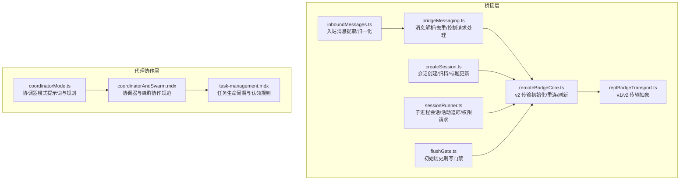

图示来源
- [bridgeMessaging.ts:1-463](file://src/bridge/bridgeMessaging.ts#L1-L463)
- [remoteBridgeCore.ts:1-1009](file://src/bridge/remoteBridgeCore.ts#L1-L1009)
- [replBridgeTransport.ts:1-371](file://src/bridge/replBridgeTransport.ts#L1-L371)
- [inboundMessages.ts:1-81](file://src/bridge/inboundMessages.ts#L1-L81)
- [createSession.ts:1-385](file://src/bridge/createSession.ts#L1-L385)
- [sessionRunner.ts:1-551](file://src/bridge/sessionRunner.ts#L1-L551)
- [flushGate.ts:1-72](file://src/bridge/flushGate.ts#L1-L72)
- [coordinatorMode.ts:1-370](file://src/coordinator/coordinatorMode.ts#L1-L370)
- [coordinatorAndSwarm.mdx:77-196](file://docs/agent/coordinator-and-swarm.mdx#L77-L196)
- [task-management.mdx:149-187](file://docs/tools/task-management.mdx#L149-L187)

章节来源
- [bridgeMessaging.ts:1-463](file://src/bridge/bridgeMessaging.ts#L1-L463)
- [remoteBridgeCore.ts:1-1009](file://src/bridge/remoteBridgeCore.ts#L1-L1009)
- [replBridgeTransport.ts:1-371](file://src/bridge/replBridgeTransport.ts#L1-L371)
- [inboundMessages.ts:1-81](file://src/bridge/inboundMessages.ts#L1-L81)
- [createSession.ts:1-385](file://src/bridge/createSession.ts#L1-L385)
- [sessionRunner.ts:1-551](file://src/bridge/sessionRunner.ts#L1-L551)
- [flushGate.ts:1-72](file://src/bridge/flushGate.ts#L1-L72)
- [coordinatorMode.ts:1-370](file://src/coordinator/coordinatorMode.ts#L1-L370)
- [coordinatorAndSwarm.mdx:77-196](file://docs/agent/coordinator-and-swarm.mdx#L77-L196)
- [task-management.mdx:149-187](file://docs/tools/task-management.mdx#L149-L187)

## 核心组件
- 消息与控制处理：统一的消息类型守卫、入站消息解析、去重与控制请求响应，确保桥接层对不同来源消息的一致处理。
- 传输抽象：v1（混合传输）与 v2（SSE + CCR 客户端）双栈，支持按需切换、心跳与状态上报、交付确认与刷新。
- 权限与门禁：权限模式回调、控制请求中的工具使用许可、权限响应与拒绝路径，以及在桥接层的策略执行。
- 会话与生命周期：会话创建/归档/标题更新，子进程会话运行与活动追踪，权限请求透传。
- 初始历史刷写：FlushGate 在初始历史刷写期间阻塞后续消息，保证顺序一致性。
- 协调器与蜂群：协调器集中合成与分派，蜂群基于任务系统进行竞争认领与依赖管理，支持跨代理消息传递。

章节来源
- [bridgeMessaging.ts:36-208](file://src/bridge/bridgeMessaging.ts#L36-L208)
- [remoteBridgeCore.ts:133-800](file://src/bridge/remoteBridgeCore.ts#L133-L800)
- [replBridgeTransport.ts:23-70](file://src/bridge/replBridgeTransport.ts#L23-L70)
- [bridgePermissionCallbacks.ts:10-44](file://src/bridge/bridgePermissionCallbacks.ts#L10-L44)
- [createSession.ts:34-180](file://src/bridge/createSession.ts#L34-L180)
- [sessionRunner.ts:28-200](file://src/bridge/sessionRunner.ts#L28-L200)
- [flushGate.ts:16-72](file://src/bridge/flushGate.ts#L16-L72)
- [coordinatorMode.ts:111-370](file://src/coordinator/coordinatorMode.ts#L111-L370)
- [coordinatorAndSwarm.mdx:116-196](file://docs/agent/coordinator-and-swarm.mdx#L116-L196)
- [task-management.mdx:149-187](file://docs/tools/task-management.mdx#L149-L187)

## 架构总览
下图展示了从本地 REPL 到远端会话服务的完整链路，包括消息编解码、传输、权限控制与会话生命周期管理。

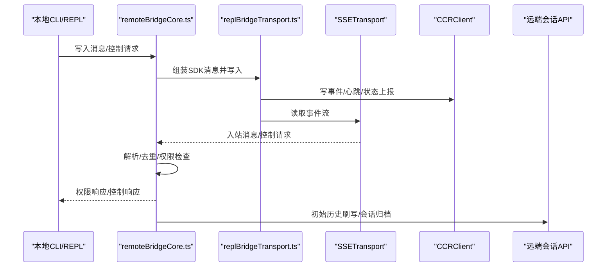

图示来源
- [remoteBridgeCore.ts:380-527](file://src/bridge/remoteBridgeCore.ts#L380-L527)
- [replBridgeTransport.ts:270-371](file://src/bridge/replBridgeTransport.ts#L270-L371)
- [bridgeMessaging.ts:132-208](file://src/bridge/bridgeMessaging.ts#L132-L208)

## 详细组件分析

### 组件A：消息与控制处理（bridgeMessaging.ts）
- 类型守卫与路由：对 SDKMessage、control_request、control_response 进行类型判断，确保后续处理分支正确。
- 入站消息过滤：仅转发对桥接有意义的消息类型，避免内部 REPL 事件干扰。
- 去重与回环检测：通过 BoundedUUIDSet 实现发送/接收 UUID 的环形缓冲去重，防止回环与重复处理。
- 控制请求处理：对服务器发起的控制请求（初始化、模型设置、最大思考令牌、权限模式、中断等）进行快速响应，否则服务器会超时断开连接。

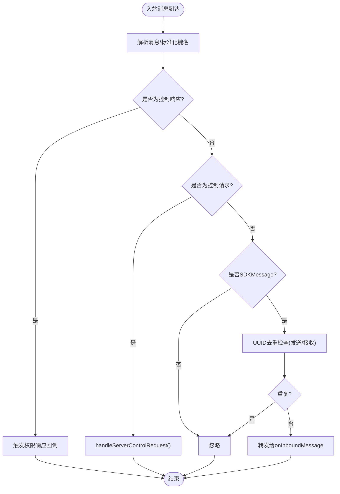

图示来源
- [bridgeMessaging.ts:132-208](file://src/bridge/bridgeMessaging.ts#L132-L208)
- [bridgeMessaging.ts:243-392](file://src/bridge/bridgeMessaging.ts#L243-L392)
- [bridgeMessaging.ts:430-462](file://src/bridge/bridgeMessaging.ts#L430-L462)

章节来源
- [bridgeMessaging.ts:36-208](file://src/bridge/bridgeMessaging.ts#L36-L208)
- [bridgeMessaging.ts:243-392](file://src/bridge/bridgeMessaging.ts#L243-L392)
- [bridgeMessaging.ts:430-462](file://src/bridge/bridgeMessaging.ts#L430-L462)

### 组件B：传输抽象与重连（replBridgeTransport.ts）
- v1 适配：HybridTransport 封装 WebSocket 读写与状态标签，统一桥接层调用接口。
- v2 适配：SSETransport + CCRClient 组合，提供事件流读取、批量事件上传、心跳、状态上报、交付确认与刷新。
- epoch 不匹配处理：当 worker epoch 过期时，关闭资源并抛出错误，驱动上层重连与重建。
- 出站仅模式：支持仅写不读的场景（如镜像附件转发）。

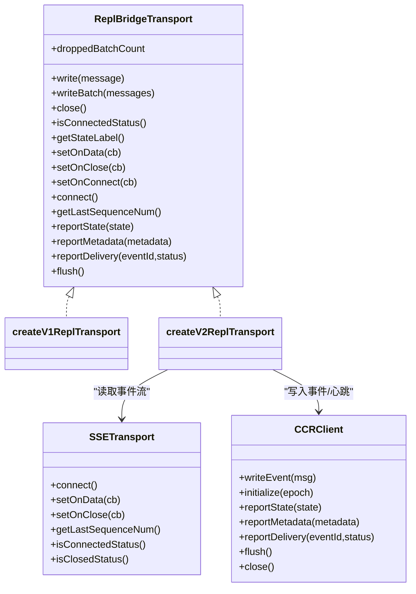

图示来源
- [replBridgeTransport.ts:23-70](file://src/bridge/replBridgeTransport.ts#L23-L70)
- [replBridgeTransport.ts:119-371](file://src/bridge/replBridgeTransport.ts#L119-L371)

章节来源
- [replBridgeTransport.ts:119-371](file://src/bridge/replBridgeTransport.ts#L119-L371)

### 组件C：远程桥接核心与重连恢复（remoteBridgeCore.ts）
- 初始化流程：创建会话、获取桥接凭据、构建 v2 传输、设置回调、启动 JWT 刷新调度。
- 初始历史刷写：通过 FlushGate 在历史刷写期间阻塞后续消息，确保服务器端顺序一致。
- 重连与恢复：401 与 epoch 不匹配的自动恢复，proactive 刷新与 auth 恢复的互斥保护。
- 关闭与归档：优雅关闭前写入结果事件，调用归档接口，并在必要时二次刷新令牌重试。

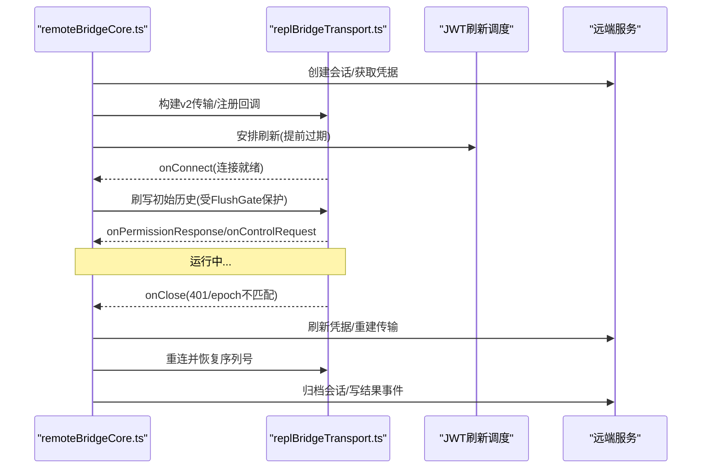

图示来源
- [remoteBridgeCore.ts:140-256](file://src/bridge/remoteBridgeCore.ts#L140-L256)
- [remoteBridgeCore.ts:317-377](file://src/bridge/remoteBridgeCore.ts#L317-L377)
- [remoteBridgeCore.ts:477-527](file://src/bridge/remoteBridgeCore.ts#L477-L527)
- [remoteBridgeCore.ts:530-590](file://src/bridge/remoteBridgeCore.ts#L530-L590)
- [remoteBridgeCore.ts:664-745](file://src/bridge/remoteBridgeCore.ts#L664-L745)

章节来源
- [remoteBridgeCore.ts:140-256](file://src/bridge/remoteBridgeCore.ts#L140-L256)
- [remoteBridgeCore.ts:317-377](file://src/bridge/remoteBridgeCore.ts#L317-L377)
- [remoteBridgeCore.ts:477-527](file://src/bridge/remoteBridgeCore.ts#L477-L527)
- [remoteBridgeCore.ts:530-590](file://src/bridge/remoteBridgeCore.ts#L530-L590)
- [remoteBridgeCore.ts:664-745](file://src/bridge/remoteBridgeCore.ts#L664-L745)

### 组件D：入站消息提取与图像内容归一化（inboundMessages.ts）
- 入站字段提取：从 SDKMessage 中提取内容与 UUID，支持字符串与富文本块数组。
- 图像块归一化：对客户端发送的媒体类型字段进行大小写兼容处理，避免 API 层错误。

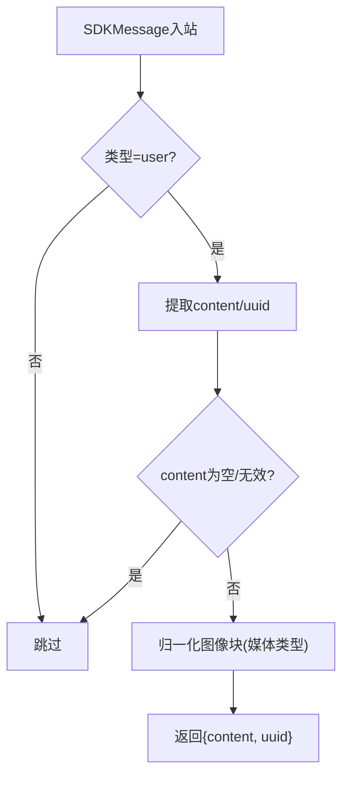

图示来源
- [inboundMessages.ts:21-40](file://src/bridge/inboundMessages.ts#L21-L40)
- [inboundMessages.ts:52-81](file://src/bridge/inboundMessages.ts#L52-L81)

章节来源
- [inboundMessages.ts:21-81](file://src/bridge/inboundMessages.ts#L21-L81)

### 组件E：权限回调与控制请求（bridgePermissionCallbacks.ts）
- 权限请求/响应：定义请求结构、响应结构与取消请求能力，支持行为允许/拒绝与建议更新。
- 类型校验：对控制响应进行行为判别，避免不安全的类型转换。

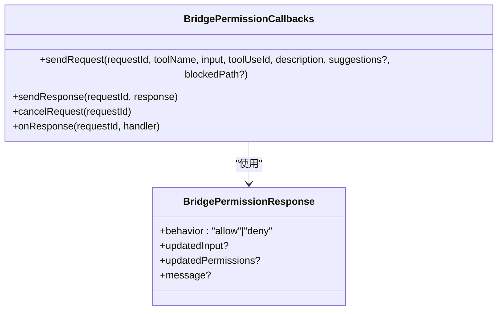

图示来源
- [bridgePermissionCallbacks.ts:10-44](file://src/bridge/bridgePermissionCallbacks.ts#L10-L44)

章节来源
- [bridgePermissionCallbacks.ts:10-44](file://src/bridge/bridgePermissionCallbacks.ts#L10-L44)

### 组件F：会话生命周期与子进程运行（createSession.ts、sessionRunner.ts）
- 会话生命周期：创建、获取、归档、标题更新均通过组织级头信息与特定 Beta 头进行鉴权与上下文传递。
- 子进程运行：封装子进程参数、环境变量、标准流捕获与活动追踪，支持权限请求透传与首次用户消息检测。

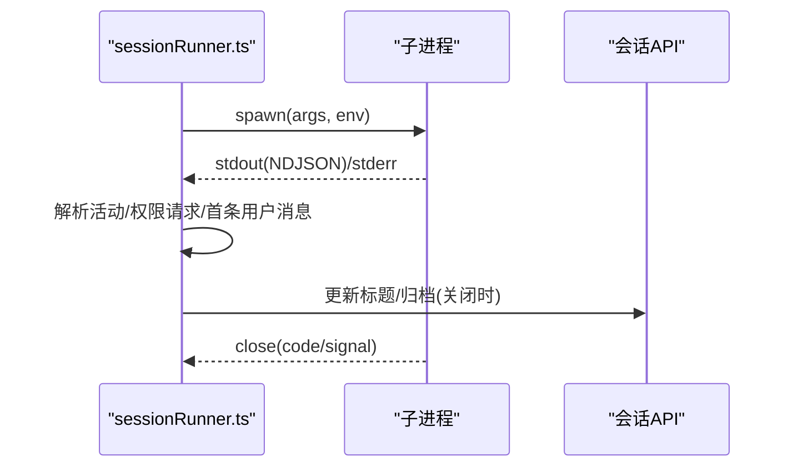

图示来源
- [sessionRunner.ts:248-548](file://src/bridge/sessionRunner.ts#L248-L548)
- [createSession.ts:34-180](file://src/bridge/createSession.ts#L34-L180)
- [createSession.ts:263-317](file://src/bridge/createSession.ts#L263-L317)
- [createSession.ts:327-384](file://src/bridge/createSession.ts#L327-L384)

章节来源
- [sessionRunner.ts:248-548](file://src/bridge/sessionRunner.ts#L248-L548)
- [createSession.ts:34-180](file://src/bridge/createSession.ts#L34-L180)
- [createSession.ts:263-317](file://src/bridge/createSession.ts#L263-L317)
- [createSession.ts:327-384](file://src/bridge/createSession.ts#L327-L384)

### 组件G：初始历史刷写门禁（flushGate.ts）
- 状态机：start/enqueue/end/drop/deactivate，确保初始历史刷写期间的消息排队与顺序。
- 与传输配合：在 v2 传输初始化阶段开启门禁，在连接后一次性放行队列。

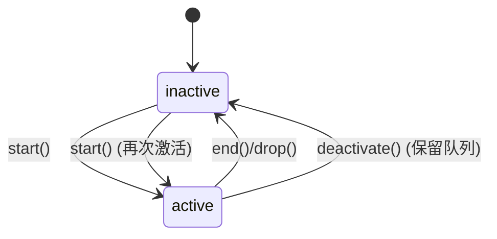

图示来源
- [flushGate.ts:16-72](file://src/bridge/flushGate.ts#L16-L72)
- [remoteBridgeCore.ts:607-656](file://src/bridge/remoteBridgeCore.ts#L607-L656)

章节来源
- [flushGate.ts:16-72](file://src/bridge/flushGate.ts#L16-L72)
- [remoteBridgeCore.ts:607-656](file://src/bridge/remoteBridgeCore.ts#L607-L656)

### 组件H：协调器与蜂群协作（coordinatorMode.ts、coordinatorAndSwarm.mdx、task-management.mdx）
- 协调器模式：强调“先理解再分派”，通过专用系统提示词与工具集合，实现跨代理的合成与分派。
- 蜂群模式：基于任务系统 V2 的“共享任务列表 + 竞争认领”，通过文件锁与高水位标记保证原子性。
- 任务生命周期：创建、依赖设置、认领、完成与异常回收，支持跨代理消息传递与通知格式。

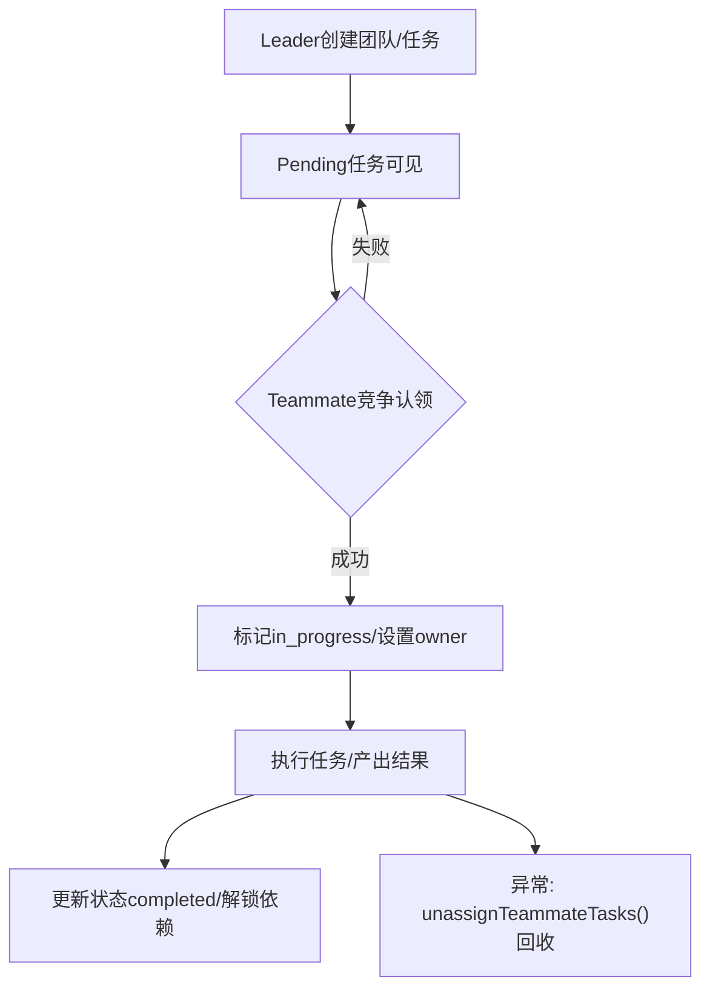

图示来源
- [coordinatorMode.ts:111-370](file://src/coordinator/coordinatorMode.ts#L111-L370)
- [coordinatorAndSwarm.mdx:116-196](file://docs/agent/coordinator-and-swarm.mdx#L116-L196)
- [task-management.mdx:149-187](file://docs/tools/task-management.mdx#L149-L187)

章节来源
- [coordinatorMode.ts:111-370](file://src/coordinator/coordinatorMode.ts#L111-L370)
- [coordinatorAndSwarm.mdx:116-196](file://docs/agent/coordinator-and-swarm.mdx#L116-L196)
- [task-management.mdx:149-187](file://docs/tools/task-management.mdx#L149-L187)

## 依赖分析
- 组件耦合与内聚
  - bridgeMessaging.ts 与 remoteBridgeCore.ts 通过回调与类型守卫紧密耦合，确保消息解析与控制请求处理的内聚性。
  - replBridgeTransport.ts 对外暴露统一接口，屏蔽 v1/v2 差异，提升内聚度。
  - sessionRunner.ts 与 remoteBridgeCore.ts 通过权限请求回调与活动追踪形成弱耦合。
- 外部依赖与集成点
  - Axios 用于会话 API 请求；SSETransport/CCRClient 作为传输层外部组件。
  - 权限模式与策略通过回调注入，避免硬编码。
- 循环依赖风险
  - 权限相关模块通过回调注入避免直接导入导致的循环依赖。

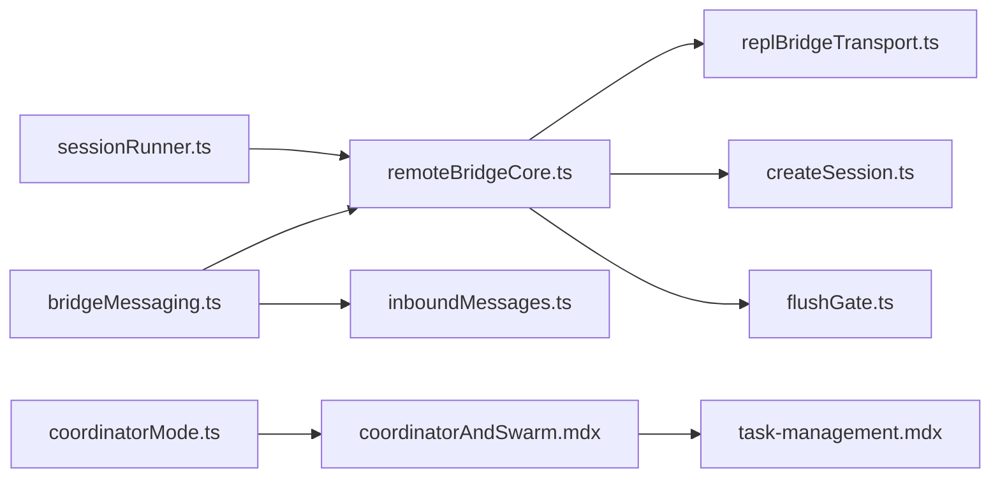

图示来源
- [bridgeMessaging.ts:1-463](file://src/bridge/bridgeMessaging.ts#L1-L463)
- [remoteBridgeCore.ts:1-1009](file://src/bridge/remoteBridgeCore.ts#L1-L1009)
- [replBridgeTransport.ts:1-371](file://src/bridge/replBridgeTransport.ts#L1-L371)
- [inboundMessages.ts:1-81](file://src/bridge/inboundMessages.ts#L1-L81)
- [createSession.ts:1-385](file://src/bridge/createSession.ts#L1-L385)
- [sessionRunner.ts:1-551](file://src/bridge/sessionRunner.ts#L1-L551)
- [flushGate.ts:1-72](file://src/bridge/flushGate.ts#L1-L72)
- [coordinatorMode.ts:1-370](file://src/coordinator/coordinatorMode.ts#L1-L370)
- [coordinatorAndSwarm.mdx:77-196](file://docs/agent/coordinator-and-swarm.mdx#L77-L196)
- [task-management.mdx:149-187](file://docs/tools/task-management.mdx#L149-L187)

章节来源
- [bridgeMessaging.ts:1-463](file://src/bridge/bridgeMessaging.ts#L1-L463)
- [remoteBridgeCore.ts:1-1009](file://src/bridge/remoteBridgeCore.ts#L1-L1009)
- [replBridgeTransport.ts:1-371](file://src/bridge/replBridgeTransport.ts#L1-L371)
- [inboundMessages.ts:1-81](file://src/bridge/inboundMessages.ts#L1-L81)
- [createSession.ts:1-385](file://src/bridge/createSession.ts#L1-L385)
- [sessionRunner.ts:1-551](file://src/bridge/sessionRunner.ts#L1-L551)
- [flushGate.ts:1-72](file://src/bridge/flushGate.ts#L1-L72)
- [coordinatorMode.ts:1-370](file://src/coordinator/coordinatorMode.ts#L1-L370)
- [coordinatorAndSwarm.mdx:77-196](file://docs/agent/coordinator-and-swarm.mdx#L77-L196)
- [task-management.mdx:149-187](file://docs/tools/task-management.mdx#L149-L187)

## 性能考虑
- 传输层优化
  - v2 使用批处理上传与心跳，减少网络往返；SSE 高水位序列号携带避免全量重放。
  - BoundedUUIDSet 采用环形缓冲，常数空间去重，降低内存占用。
- 初始历史刷写
  - FlushGate 在历史刷写期间阻塞新消息，避免乱序与重复；cap 限制历史长度，平衡一致性与吞吐。
- 权限与安全
  - 权限请求通过回调注入，避免在桥接层硬编码策略；控制请求快速响应，降低服务器等待时间。
- 可观测性
  - 丰富的日志与遥测事件，便于定位连接超时、刷新失败、归档状态等问题。

## 故障排查指南
- 连接超时
  - 现象：onConnect 超时事件触发。
  - 排查：检查 connect_deadline、connectCause 与网络状况；确认 v2 传输初始化与心跳配置。
- 401 与 epoch 不匹配
  - 现象：onClose 触发 401 或 4090/4091。
  - 排查：触发 recoverFromAuthFailure 或 rebuildTransport；确保刷新调度与互斥标志正确。
- 权限拒绝
  - 现象：权限响应为拒绝或错误。
  - 排查：检查 onSetPermissionMode 回调返回值；确认策略更新与建议。
- 初始历史丢失
  - 现象：重启后历史顺序错乱或缺失。
  - 排查：确认 FlushGate 的 start/end 生命周期；检查 initialHistoryCap 与 isEligibleBridgeMessage 过滤。
- 会话归档失败
  - 现象：归档返回 4xx/5xx 或超时。
  - 排查：检查组织 UUID、OAuth 令牌与超时配置；必要时二次刷新令牌重试。

章节来源
- [remoteBridgeCore.ts:301-310](file://src/bridge/remoteBridgeCore.ts#L301-L310)
- [remoteBridgeCore.ts:450-466](file://src/bridge/remoteBridgeCore.ts#L450-L466)
- [remoteBridgeCore.ts:530-590](file://src/bridge/remoteBridgeCore.ts#L530-L590)
- [remoteBridgeCore.ts:664-745](file://src/bridge/remoteBridgeCore.ts#L664-L745)
- [bridgeMessaging.ts:243-392](file://src/bridge/bridgeMessaging.ts#L243-L392)
- [flushGate.ts:16-72](file://src/bridge/flushGate.ts#L16-L72)
- [createSession.ts:263-317](file://src/bridge/createSession.ts#L263-L317)

## 结论
本系统通过桥接层与传输层的清晰分离、严格的去重与顺序保障、完善的权限与门禁控制，以及任务系统与协调器/蜂群协作模式，实现了稳定、可观测且可扩展的代理通信与协作框架。在复杂场景下，可通过 FlushGate、权限回调与 v2 传输的 epoch 管理确保状态一致性与容错恢复；通过任务系统的竞争认领与依赖管理实现高效的资源共享与任务分配。

## 附录
- 最佳实践
  - 使用 v2 传输以获得更好的稳定性与可观测性；在需要时启用 outboundOnly 以减少资源消耗。
  - 在初始化阶段使用 FlushGate 保证历史顺序；合理设置 initialHistoryCap。
  - 通过权限回调注入策略，避免在桥接层硬编码；对权限请求快速响应。
- 性能调优
  - 调整心跳间隔与抖动，平衡延迟与带宽；优化批处理大小与序列号携带。
- 监控方案
  - 关注连接事件、刷新事件、归档状态与错误计数；对超时与 401/409 场景建立告警。