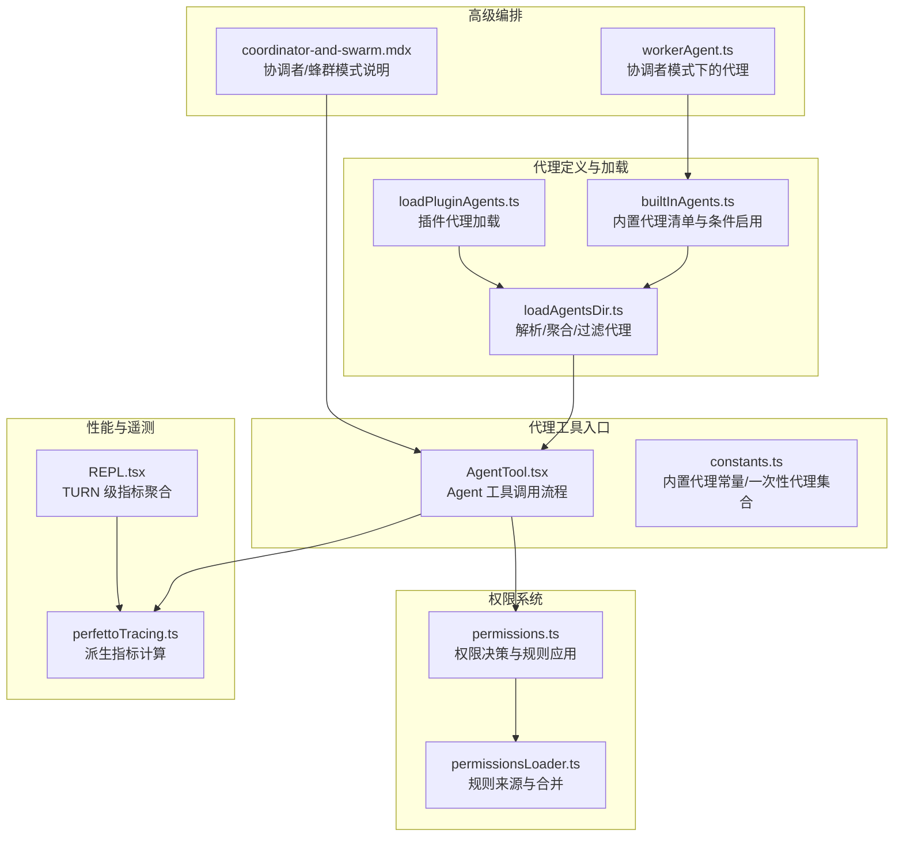
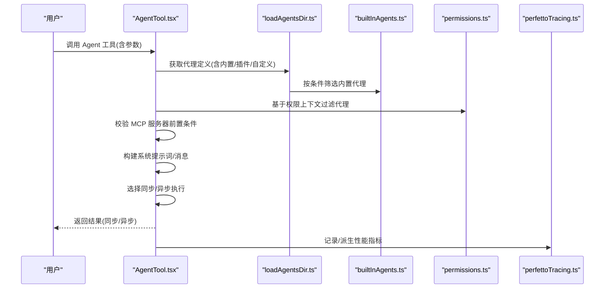
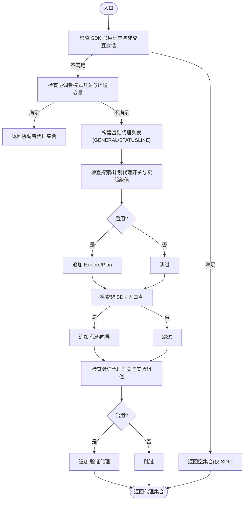
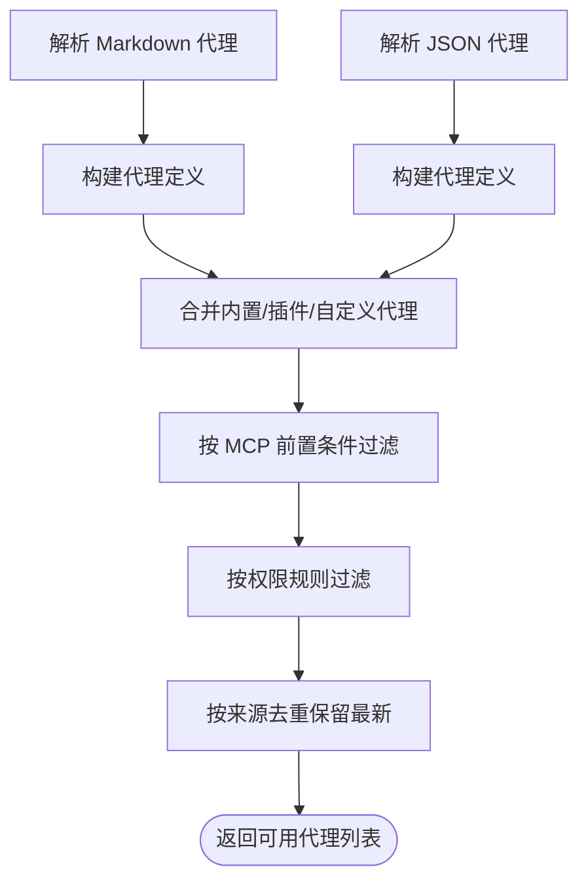
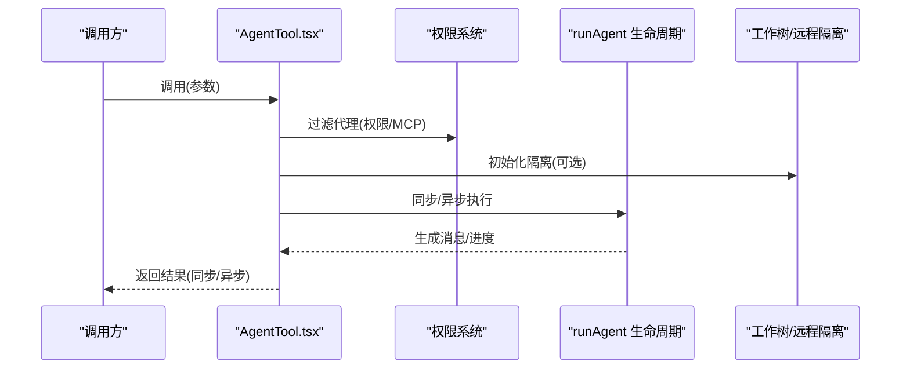
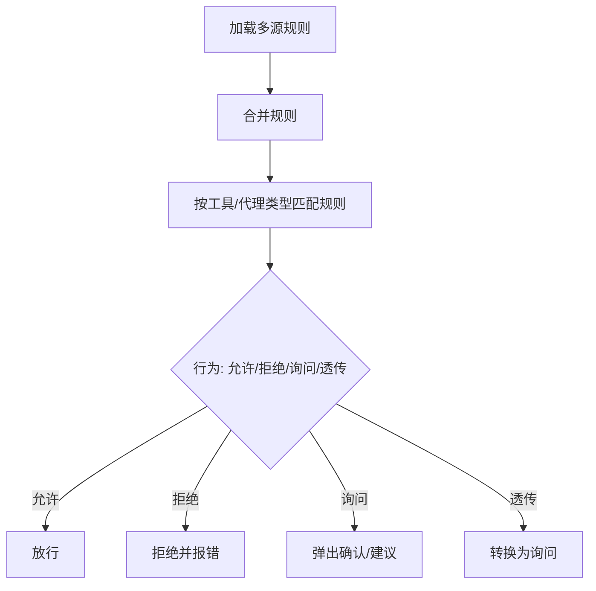
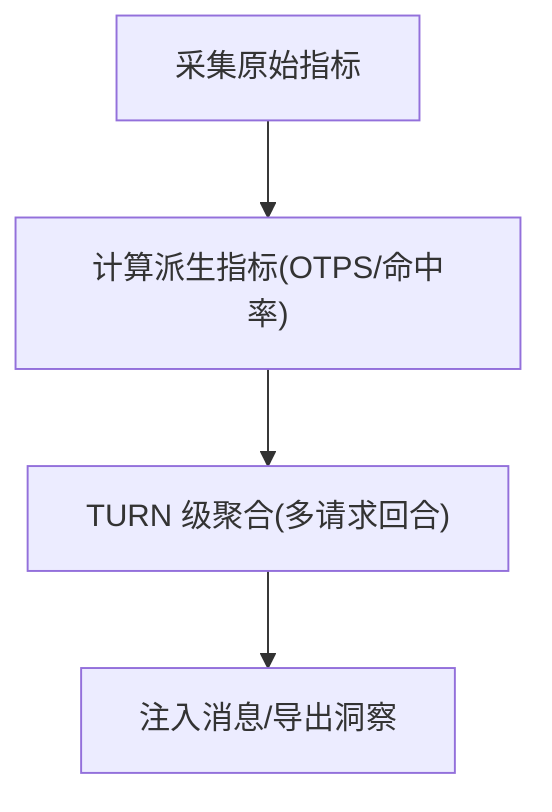
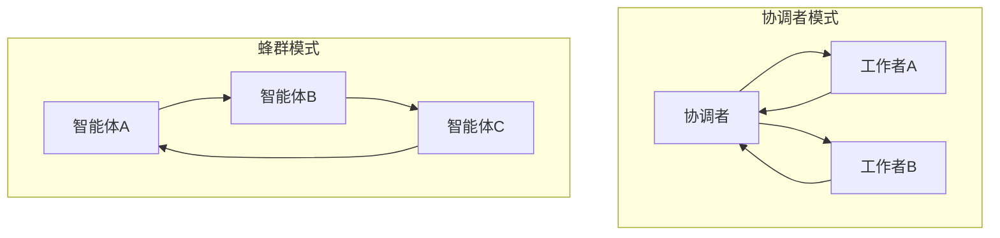
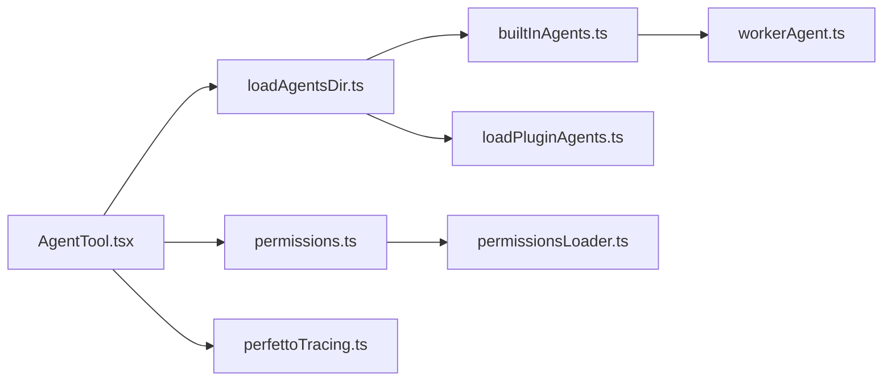

# 内置代理

<cite>
**本文引用的文件**
- [builtInAgents.ts](file://src/tools/AgentTool/builtInAgents.ts)
- [loadAgentsDir.ts](file://src/tools/AgentTool/loadAgentsDir.ts)
- [AgentTool.tsx](file://src/tools/AgentTool/AgentTool.tsx)
- [constants.ts](file://src/tools/AgentTool/constants.ts)
- [permissions.ts](file://src/utils/permissions/permissions.ts)
- [permissionsLoader.ts](file://src/utils/permissions/permissionsLoader.ts)
- [perfettoTracing.ts](file://src/utils/telemetry/perfettoTracing.ts)
- [REPL.tsx](file://src/screens/REPL.tsx)
- [coordinator-and-swarm.mdx](file://docs/agent/coordinator-and-swarm.mdx)
- [loadPluginAgents.ts](file://src/utils/plugins/loadPluginAgents.ts)
- [workerAgent.ts](file://src/coordinator/workerAgent.ts)
- [insights.ts](file://src/commands/insights.ts)
</cite>

## 目录
1. [引言](#引言)
2. [项目结构](#项目结构)
3. [核心组件](#核心组件)
4. [架构总览](#架构总览)
5. [详细组件分析](#详细组件分析)
6. [依赖关系分析](#依赖关系分析)
7. [性能考量](#性能考量)
8. [故障排除指南](#故障排除指南)
9. [结论](#结论)
10. [附录](#附录)

## 引言
本文件系统化梳理并深入解读 Claude Code 中的“内置代理”体系，涵盖设计理念、行为模式、工具集配置、权限控制、执行策略、参数调优、性能监控与效果评估，并提供实际使用案例、最佳实践与故障排除建议。内置代理包括通用代理、探索代理、验证代理等预设类型，它们通过统一的 Agent 工具接口被选择、启动与管理；同时支持在协调者模式与蜂群模式下的差异化协作。

## 项目结构
内置代理的实现围绕以下关键模块展开：
- 代理定义与加载：负责解析与聚合内置、插件与自定义代理，过滤可用代理并注入内存与 MCP 服务器等能力。
- 代理工具入口：封装 Agent 工具的输入输出、权限校验、隔离执行、异步生命周期与进度反馈。
- 权限系统：按代理类型与工具维度进行许可判定与规则合并。
- 性能与遥测：提供 TTFT/TTLT/OTPS/CACHE_HIT_RATE 等指标采集与展示。
- 协调者与蜂群：在高级编排场景下，内置代理的可用性与行为会受模式开关影响。

**图表来源**
- [builtInAgents.ts:22-72](file://src/tools/AgentTool/builtInAgents.ts#L22-L72)
- [loadAgentsDir.ts:296-393](file://src/tools/AgentTool/loadAgentsDir.ts#L296-L393)
- [AgentTool.tsx:196-577](file://src/tools/AgentTool/AgentTool.tsx#L196-L577)
- [permissions.ts:361-1347](file://src/utils/permissions/permissions.ts#L361-L1347)
- [permissionsLoader.ts:129-177](file://src/utils/permissions/permissionsLoader.ts#L129-L177)
- [perfettoTracing.ts:508-545](file://src/utils/telemetry/perfettoTracing.ts#L508-L545)
- [REPL.tsx:2816-2839](file://src/screens/REPL.tsx#L2816-L2839)
- [coordinator-and-swarm.mdx:1-196](file://docs/agent/coordinator-and-swarm.mdx#L1-L196)
- [workerAgent.ts:1-4](file://src/coordinator/workerAgent.ts#L1-L4)

**章节来源**
- [builtInAgents.ts:22-72](file://src/tools/AgentTool/builtInAgents.ts#L22-L72)
- [loadAgentsDir.ts:296-393](file://src/tools/AgentTool/loadAgentsDir.ts#L296-L393)
- [AgentTool.tsx:196-577](file://src/tools/AgentTool/AgentTool.tsx#L196-L577)

## 核心组件
- 内置代理清单与启用条件
  - 通过特性开关与环境变量控制是否启用探索/计划/验证等代理。
  - 在协调者模式开启且满足环境变量时，返回协调者侧的代理集合。
  - 非 SDK 入口点默认附加“代码向导”代理。
- 代理定义解析与聚合
  - 解析 Markdown/JSON 前言字段，构建统一的代理定义对象，支持工具集、权限模式、最大轮次、记忆范围、隔离模式、初始提示等。
  - 过滤掉不满足 MCP 服务器前置条件的代理。
  - 合并内置、插件与自定义代理，去重保留最新来源。
- 代理工具调用
  - 输入参数包括任务描述、提示词、代理类型、模型覆盖、后台运行、隔离模式、工作目录等。
  - 输出分为同步完成与异步启动两类；异步时提供 agentId 与输出文件路径以便轮询进度。
  - 支持多智能体（蜂群）场景：命名子代理、团队名、权限模式等。
- 权限与许可
  - 基于工具权限上下文与规则来源（用户/项目/策略/标志）进行许可判定。
  - 支持“询问/允许/拒绝/透传”等行为与建议项。
- 性能与效果评估
  - 采集 TTFT/TTLT、输出令牌速率、缓存命中率等派生指标。
  - TURN 级聚合与可视化，支持多请求回合的统计。

**章节来源**
- [builtInAgents.ts:13-72](file://src/tools/AgentTool/builtInAgents.ts#L13-L72)
- [loadAgentsDir.ts:70-133](file://src/tools/AgentTool/loadAgentsDir.ts#L70-L133)
- [loadAgentsDir.ts:296-393](file://src/tools/AgentTool/loadAgentsDir.ts#L296-L393)
- [AgentTool.tsx:81-125](file://src/tools/AgentTool/AgentTool.tsx#L81-L125)
- [AgentTool.tsx:140-195](file://src/tools/AgentTool/AgentTool.tsx#L140-L195)
- [AgentTool.tsx:239-577](file://src/tools/AgentTool/AgentTool.tsx#L239-L577)
- [permissions.ts:361-1347](file://src/utils/permissions/permissions.ts#L361-L1347)
- [permissionsLoader.ts:129-177](file://src/utils/permissions/permissionsLoader.ts#L129-L177)
- [perfettoTracing.ts:508-545](file://src/utils/telemetry/perfettoTracing.ts#L508-L545)
- [REPL.tsx:2816-2839](file://src/screens/REPL.tsx#L2816-L2839)

## 架构总览
内置代理的调用链路从 Agent 工具入口开始，经过权限与 MCP 服务器校验、代理选择与系统提示词构建，最终进入同步或异步执行生命周期。在协调者模式或蜂群模式下，代理的可用性与交互方式会相应调整。

**图表来源**
- [AgentTool.tsx:239-577](file://src/tools/AgentTool/AgentTool.tsx#L239-L577)
- [loadAgentsDir.ts:296-393](file://src/tools/AgentTool/loadAgentsDir.ts#L296-L393)
- [builtInAgents.ts:22-72](file://src/tools/AgentTool/builtInAgents.ts#L22-L72)
- [permissions.ts:361-1347](file://src/utils/permissions/permissions.ts#L361-L1347)
- [perfettoTracing.ts:508-545](file://src/utils/telemetry/perfettoTracing.ts#L508-L545)

## 详细组件分析

### 内置代理清单与启用策略
- 探索/计划/验证代理的启用由特性开关与实验组值共同决定，支持在非交互会话中通过环境变量禁用内置代理（SDK 场景）。
- 协调者模式开启且满足环境变量时，内置代理集合会被协调者侧的代理集合替代。
- 非 SDK 入口点默认附加“代码向导”代理，便于引导与教学。

**图表来源**
- [builtInAgents.ts:13-72](file://src/tools/AgentTool/builtInAgents.ts#L13-L72)

**章节来源**
- [builtInAgents.ts:13-72](file://src/tools/AgentTool/builtInAgents.ts#L13-L72)

### 代理定义解析与聚合
- 解析规则
  - 支持从 Markdown 与 JSON 两种来源解析代理定义，统一为代理定义对象。
  - 关键字段：描述、工具集、禁止工具、系统提示词、模型、努力度、权限模式、MCP 服务器、钩子、最大轮次、技能、初始提示、记忆范围、后台运行、隔离模式、省略 CLAUDE.md 等。
- 过滤逻辑
  - 先按 MCP 服务器前置条件过滤，再按权限规则过滤。
  - 合并内置、插件与自定义代理，按来源去重，保留最新版本。
- 记忆与隔离
  - 当启用自动记忆时，自动注入写/编辑/读工具以支持记忆访问。
  - 支持工作树隔离与远程隔离（Ant 专属）。

**图表来源**
- [loadAgentsDir.ts:70-133](file://src/tools/AgentTool/loadAgentsDir.ts#L70-L133)
- [loadAgentsDir.ts:296-393](file://src/tools/AgentTool/loadAgentsDir.ts#L296-L393)
- [loadPluginAgents.ts:242-348](file://src/utils/plugins/loadPluginAgents.ts#L242-L348)

**章节来源**
- [loadAgentsDir.ts:70-133](file://src/tools/AgentTool/loadAgentsDir.ts#L70-L133)
- [loadAgentsDir.ts:296-393](file://src/tools/AgentTool/loadAgentsDir.ts#L296-L393)
- [loadPluginAgents.ts:242-348](file://src/utils/plugins/loadPluginAgents.ts#L242-L348)

### 代理工具调用流程
- 输入参数
  - 任务描述、提示词、代理类型、模型覆盖、后台运行、隔离模式、工作目录、多智能体参数（名称、团队名、权限模式）。
- 输出结果
  - 同步：直接返回完成状态与提示词。
  - 异步：返回 agentId、描述、提示词、输出文件路径与可读取能力标识。
- 执行策略
  - 根据后台运行标志、代理定义的后台标记、协调者模式、实验开关与主动模式等综合判断是否异步执行。
  - 异步时注册后台任务、建立名称到 agentId 的路由表、清理工作树等。
- 隔离与工作树
  - 支持工作树隔离与远程隔离（Ant 专属），并在完成后根据变更情况清理或保留。

**图表来源**
- [AgentTool.tsx:239-577](file://src/tools/AgentTool/AgentTool.tsx#L239-L577)

**章节来源**
- [AgentTool.tsx:81-125](file://src/tools/AgentTool/AgentTool.tsx#L81-L125)
- [AgentTool.tsx:140-195](file://src/tools/AgentTool/AgentTool.tsx#L140-L195)
- [AgentTool.tsx:239-577](file://src/tools/AgentTool/AgentTool.tsx#L239-L577)

### 权限设置与执行策略
- 规则来源与合并
  - 来自用户设置、项目设置、本地设置、策略设置、标志设置等多源规则，按启用顺序合并。
  - 支持删除可编辑来源中的规则。
- 决策流程
  - 根据工具名称与行为（允许/拒绝/询问/透传）生成决策，必要时附带建议项。
  - 对代理类型与工具名称组合进行规则匹配与裁剪。
- 执行策略
  - 代理的权限模式可覆盖父进程权限模式，确保子代理工具池独立装配。
  - 多智能体场景下，支持计划模式（需计划审批）等。

**图表来源**
- [permissionsLoader.ts:129-177](file://src/utils/permissions/permissionsLoader.ts#L129-L177)
- [permissions.ts:361-1347](file://src/utils/permissions/permissions.ts#L361-L1347)

**章节来源**
- [permissionsLoader.ts:129-177](file://src/utils/permissions/permissionsLoader.ts#L129-L177)
- [permissions.ts:361-1347](file://src/utils/permissions/permissions.ts#L361-L1347)
- [AgentTool.tsx:573-577](file://src/tools/AgentTool/AgentTool.tsx#L573-L577)

### 性能监控与效果评估
- 指标采集
  - TTFT/TTLT、提示词/输出令牌数、缓存读取/创建令牌数、请求耗时、请求准备耗时等。
  - 派生指标：每秒输出令牌数（OTPS）、缓存命中率百分比。
- TURN 级聚合
  - 多请求回合场景下，对 TTFT 与 OTPS 进行中位数聚合，结合工具/钩子/分类器耗时统计。
- 可视化与导出
  - REPL 中将指标注入消息，供前端展示；命令行提供洞察汇总。

**图表来源**
- [perfettoTracing.ts:508-545](file://src/utils/telemetry/perfettoTracing.ts#L508-L545)
- [REPL.tsx:2816-2839](file://src/screens/REPL.tsx#L2816-L2839)
- [insights.ts:2687-2719](file://src/commands/insights.ts#L2687-L2719)

**章节来源**
- [perfettoTracing.ts:508-545](file://src/utils/telemetry/perfettoTracing.ts#L508-L545)
- [REPL.tsx:2816-2839](file://src/screens/REPL.tsx#L2816-L2839)
- [insights.ts:2687-2719](file://src/commands/insights.ts#L2687-L2719)

### 协调者与蜂群模式下的内置代理
- 协调者模式
  - 星型拓扑：协调者居中，工作者外围；通过定向通信与任务通知实现编排。
  - 协调者必须先理解再分配，避免将“理解责任”委派给工作者。
- 蜂群模式
  - 网状拓扑：对等智能体共享任务列表，自主认领任务；基于文件锁与高水位标记保证原子性。
  - 支持团队初始化、任务认领与竞争、生命周期管理等。

**图表来源**
- [coordinator-and-swarm.mdx:1-196](file://docs/agent/coordinator-and-swarm.mdx#L1-L196)
- [workerAgent.ts:1-4](file://src/coordinator/workerAgent.ts#L1-L4)

**章节来源**
- [coordinator-and-swarm.mdx:1-196](file://docs/agent/coordinator-and-swarm.mdx#L1-L196)
- [workerAgent.ts:1-4](file://src/coordinator/workerAgent.ts#L1-L4)

## 依赖关系分析
- 组件耦合
  - AgentTool 依赖权限系统与代理定义加载模块；代理定义加载模块依赖插件加载与权限规则来源。
  - 协调者模式通过 workerAgent 动态替换内置代理集合。
- 外部依赖
  - MCP 服务器工具可用性与认证状态影响代理可用性。
  - 特性开关与实验组值影响代理启用与行为。

**图表来源**
- [AgentTool.tsx:239-577](file://src/tools/AgentTool/AgentTool.tsx#L239-L577)
- [loadAgentsDir.ts:296-393](file://src/tools/AgentTool/loadAgentsDir.ts#L296-L393)
- [builtInAgents.ts:22-72](file://src/tools/AgentTool/builtInAgents.ts#L22-L72)
- [loadPluginAgents.ts:242-348](file://src/utils/plugins/loadPluginAgents.ts#L242-L348)
- [permissions.ts:361-1347](file://src/utils/permissions/permissions.ts#L361-L1347)
- [permissionsLoader.ts:129-177](file://src/utils/permissions/permissionsLoader.ts#L129-L177)
- [perfettoTracing.ts:508-545](file://src/utils/telemetry/perfettoTracing.ts#L508-L545)
- [workerAgent.ts:1-4](file://src/coordinator/workerAgent.ts#L1-L4)

**章节来源**
- [AgentTool.tsx:239-577](file://src/tools/AgentTool/AgentTool.tsx#L239-L577)
- [loadAgentsDir.ts:296-393](file://src/tools/AgentTool/loadAgentsDir.ts#L296-L393)
- [builtInAgents.ts:22-72](file://src/tools/AgentTool/builtInAgents.ts#L22-L72)
- [loadPluginAgents.ts:242-348](file://src/utils/plugins/loadPluginAgents.ts#L242-L348)
- [permissions.ts:361-1347](file://src/utils/permissions/permissions.ts#L361-L1347)
- [permissionsLoader.ts:129-177](file://src/utils/permissions/permissionsLoader.ts#L129-L177)
- [perfettoTracing.ts:508-545](file://src/utils/telemetry/perfettoTracing.ts#L508-L545)
- [workerAgent.ts:1-4](file://src/coordinator/workerAgent.ts#L1-L4)

## 性能考量
- 指标维度
  - 请求延迟（TTFT/TTLT）、吞吐（OTPS）、缓存效率（命中率）、TURN 耗时与钩子/工具/分类器开销。
- 优化建议
  - 合理设置最大轮次与努力度，避免过度生成。
  - 使用工作树隔离减少冲突与回滚成本，远程隔离适用于 Ant 专属场景。
  - 在多请求回合场景下采用中位数聚合指标，降低异常值影响。
- 监控与评估
  - 通过 REPL 注入的消息与命令行洞察报告进行可视化与趋势分析。

**章节来源**
- [perfettoTracing.ts:508-545](file://src/utils/telemetry/perfettoTracing.ts#L508-L545)
- [REPL.tsx:2816-2839](file://src/screens/REPL.tsx#L2816-L2839)
- [insights.ts:2687-2719](file://src/commands/insights.ts#L2687-L2719)

## 故障排除指南
- 代理不可用
  - 检查 MCP 服务器是否连接并已认证；若缺失所需服务器，将抛出错误提示。
  - 确认权限规则未拒绝该代理类型；查看拒绝规则来源。
- 协调者/蜂群模式问题
  - 协调者模式下，确保环境变量与特性开关正确；注意任务通知格式与定向通信。
  - 蜂群模式下，确认团队初始化与任务列表共享正常，避免重复命名导致的路由冲突。
- 异步执行异常
  - 检查后台任务注册与输出文件路径；确认工作树清理策略与变更检测。
- 性能异常
  - 关注缓存命中率与 OTPS，排查提示词长度与工具使用频率；必要时调整最大轮次与努力度。

**章节来源**
- [AgentTool.tsx:370-410](file://src/tools/AgentTool/AgentTool.tsx#L370-L410)
- [permissions.ts:1300-1318](file://src/utils/permissions/permissions.ts#L1300-L1318)
- [coordinator-and-swarm.mdx:77-158](file://docs/agent/coordinator-and-swarm.mdx#L77-L158)

## 结论
内置代理通过统一的定义、加载与调用框架，实现了灵活的工具集配置、严格的权限控制与高效的执行策略。配合性能监控与高级编排模式，能够满足从单智能体到多智能体协作的多样化需求。建议在生产环境中结合实验组与特性开关进行渐进式启用，并持续关注性能指标与用户体验反馈。

## 附录
- 实际使用案例
  - 通用代理：日常开发任务的默认选择，适合大多数常规场景。
  - 探索代理：大规模检索与信息收集，适合初步调研与知识整理。
  - 验证代理：质量与合规检查，适合代码审查与安全扫描。
- 最佳实践
  - 明确任务边界与权限范围，合理设置最大轮次与努力度。
  - 在需要隔离的场景使用工作树或远程隔离，避免相互干扰。
  - 利用异步执行与进度轮询，提升交互流畅度。
- 自定义扩展
  - 通过 Markdown/JSON 定义自定义代理，或在插件中提供代理资源。
  - 使用钩子与技能增强代理能力，结合记忆范围实现上下文持久化。