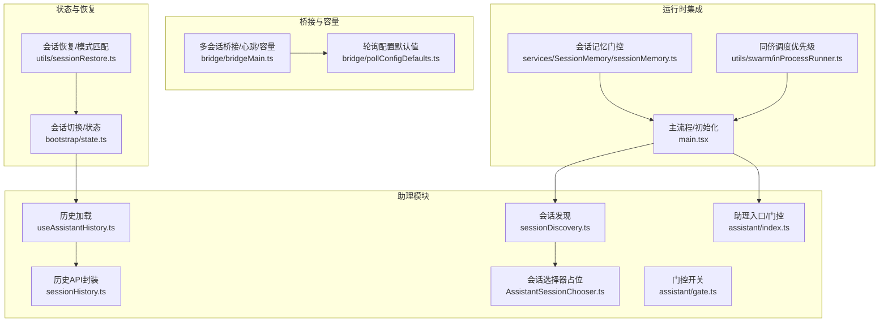
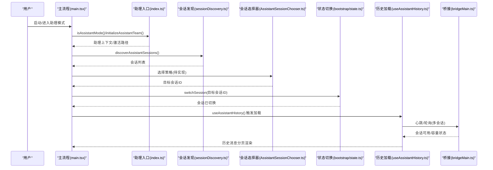
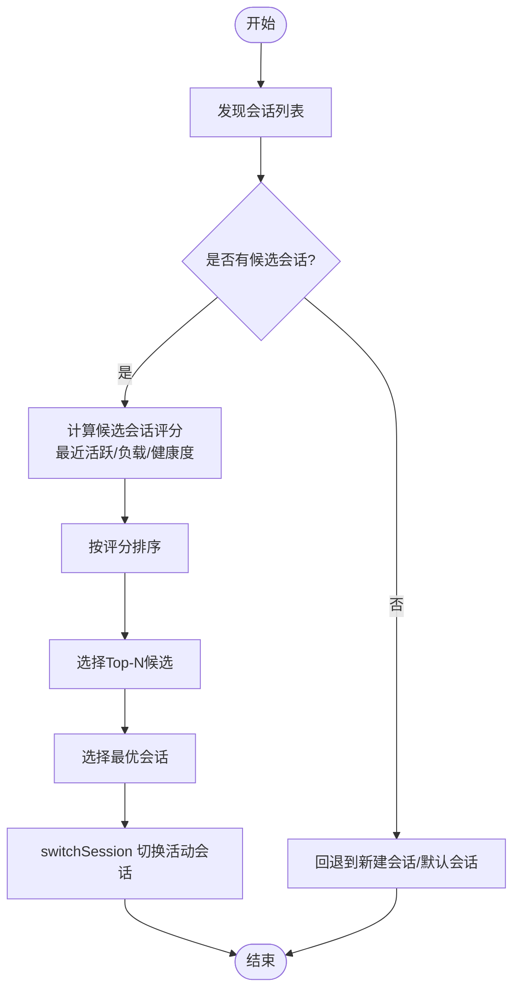
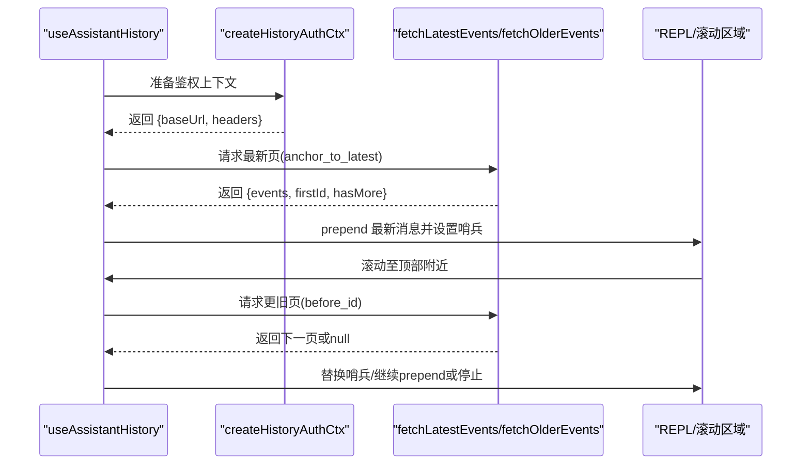
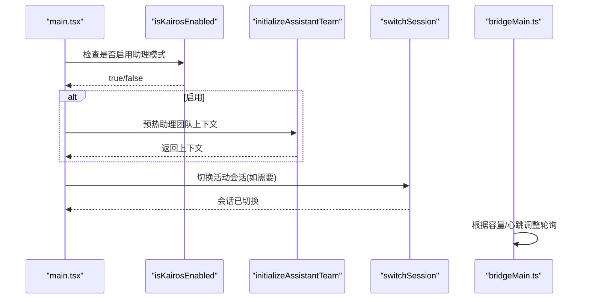
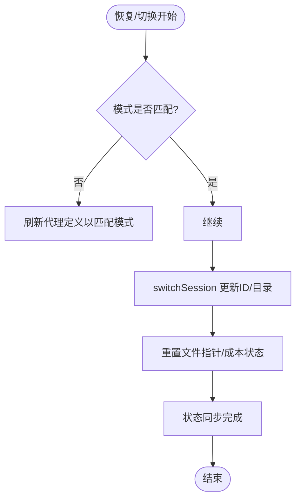
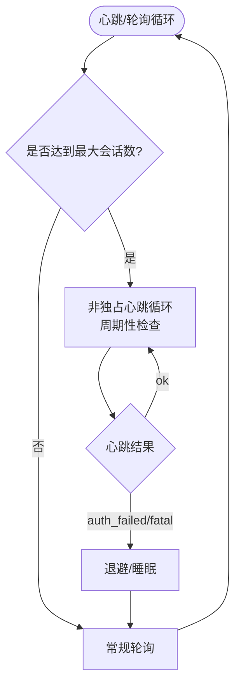
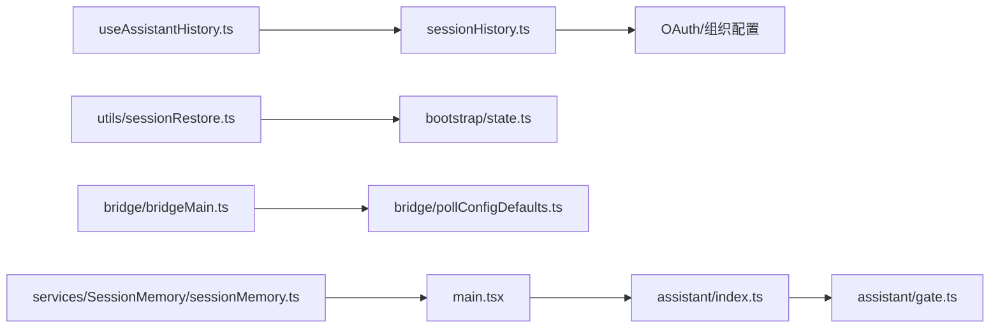

# 助理系统

<cite>
**本文引用的文件**
- [src/assistant/AssistantSessionChooser.ts](file://src/assistant/AssistantSessionChooser.ts)
- [src/assistant/sessionDiscovery.ts](file://src/assistant/sessionDiscovery.ts)
- [src/assistant/sessionHistory.ts](file://src/assistant/sessionHistory.ts)
- [src/assistant/index.ts](file://src/assistant/index.ts)
- [src/assistant/gate.ts](file://src/assistant/gate.ts)
- [src/bootstrap/state.ts](file://src/bootstrap/state.ts)
- [src/hooks/useAssistantHistory.ts](file://src/hooks/useAssistantHistory.ts)
- [src/main.tsx](file://src/main.tsx)
- [src/bridge/bridgeMain.ts](file://src/bridge/bridgeMain.ts)
- [src/bridge/pollConfigDefaults.ts](file://src/bridge/pollConfigDefaults.ts)
- [src/utils/sessionRestore.ts](file://src/utils/sessionRestore.ts)
- [src/services/SessionMemory/sessionMemory.ts](file://src/services/SessionMemory/sessionMemory.ts)
- [src/utils/swarm/inProcessRunner.ts](file://src/utils/swarm/inProcessRunner.ts)
</cite>

## 目录
1. [简介](#简介)
2. [项目结构](#项目结构)
3. [核心组件](#核心组件)
4. [架构总览](#架构总览)
5. [详细组件分析](#详细组件分析)
6. [依赖关系分析](#依赖关系分析)
7. [性能考量](#性能考量)
8. [故障排查指南](#故障排查指南)
9. [结论](#结论)
10. [附录](#附录)

## 简介
本文件面向“助理系统”的设计与实现，聚焦于助理会话选择器（会话发现、历史记录管理、状态维护）以及初始化流程、配置选项与运行时行为。文档同时覆盖会话优先级排序、负载均衡与故障转移机制，并提供会话切换、状态同步与错误处理策略，辅以实际代码路径与调试建议。

## 项目结构
助理系统相关代码主要位于 src/assistant 下，配合状态管理、历史加载、桥接层与恢复逻辑协同工作：
- 会话发现与选择：sessionDiscovery.ts、AssistantSessionChooser.ts
- 历史记录管理：sessionHistory.ts、useAssistantHistory.ts
- 初始化与门控：assistant/index.ts、assistant/gate.ts、main.tsx
- 会话切换与状态：bootstrap/state.ts
- 多会话桥接与容量控制：bridge/bridgeMain.ts、bridge/pollConfigDefaults.ts
- 会话恢复与模式匹配：utils/sessionRestore.ts
- 会话记忆门控：services/SessionMemory/sessionMemory.ts
- 协调者/同侪调度优先级：utils/swarm/inProcessRunner.ts

图表来源
- [src/assistant/sessionDiscovery.ts:1-4](file://src/assistant/sessionDiscovery.ts#L1-L4)
- [src/assistant/AssistantSessionChooser.ts:1-4](file://src/assistant/AssistantSessionChooser.ts#L1-L4)
- [src/assistant/sessionHistory.ts:1-88](file://src/assistant/sessionHistory.ts#L1-L88)
- [src/hooks/useAssistantHistory.ts:1-251](file://src/hooks/useAssistantHistory.ts#L1-L251)
- [src/bootstrap/state.ts:467-489](file://src/bootstrap/state.ts#L467-L489)
- [src/utils/sessionRestore.ts:430-552](file://src/utils/sessionRestore.ts#L430-L552)
- [src/bridge/bridgeMain.ts:59-746](file://src/bridge/bridgeMain.ts#L59-L746)
- [src/bridge/pollConfigDefaults.ts:32-53](file://src/bridge/pollConfigDefaults.ts#L32-L53)
- [src/main.tsx:1048-1110](file://src/main.tsx#L1048-L1110)
- [src/services/SessionMemory/sessionMemory.ts:64-93](file://src/services/SessionMemory/sessionMemory.ts#L64-L93)
- [src/utils/swarm/inProcessRunner.ts:785-824](file://src/utils/swarm/inProcessRunner.ts#L785-L824)

章节来源
- [src/assistant/sessionDiscovery.ts:1-4](file://src/assistant/sessionDiscovery.ts#L1-L4)
- [src/assistant/AssistantSessionChooser.ts:1-4](file://src/assistant/AssistantSessionChooser.ts#L1-L4)
- [src/assistant/sessionHistory.ts:1-88](file://src/assistant/sessionHistory.ts#L1-L88)
- [src/hooks/useAssistantHistory.ts:1-251](file://src/hooks/useAssistantHistory.ts#L1-L251)
- [src/bootstrap/state.ts:467-489](file://src/bootstrap/state.ts#L467-L489)
- [src/utils/sessionRestore.ts:430-552](file://src/utils/sessionRestore.ts#L430-L552)
- [src/bridge/bridgeMain.ts:59-746](file://src/bridge/bridgeMain.ts#L59-L746)
- [src/bridge/pollConfigDefaults.ts:32-53](file://src/bridge/pollConfigDefaults.ts#L32-L53)
- [src/main.tsx:1048-1110](file://src/main.tsx#L1048-L1110)
- [src/services/SessionMemory/sessionMemory.ts:64-93](file://src/services/SessionMemory/sessionMemory.ts#L64-L93)
- [src/utils/swarm/inProcessRunner.ts:785-824](file://src/utils/swarm/inProcessRunner.ts#L785-L824)

## 核心组件
- 会话发现与选择
  - 发现接口：discoverAssistantSessions 返回会话列表，当前为占位实现。
  - 选择器：AssistantSessionChooser 当前为占位实现，后续需实现具体选择策略。
- 历史记录管理
  - 创建鉴权上下文：createHistoryAuthCtx 统一准备基础URL与请求头。
  - 分页加载：fetchLatestEvents 获取最新事件页；fetchOlderEvents 按游标加载更旧页。
  - 前端Hook：useAssistantHistory 实现滚动触顶加载、填充视口、哨兵消息与滚动锚定。
- 初始化与门控
  - isAssistantMode/initializeAssistantTeam/markAssistantForced/getAssistantSystemPromptAddendum/getAssistantActivationPath 提供助理模式开关与初始化能力。
  - isKairosEnabled 用于门控是否启用助理模式。
- 会话切换与状态
  - switchSession 切换活动会话ID与项目目录；onSessionSwitch 订阅切换事件。
- 多会话桥接与容量
  - 轮询与心跳：根据配置在不同容量状态下调整轮询间隔与心跳周期。
  - 容量唤醒：会话结束时唤醒等待队列，尽快接受新任务。
- 会话恢复与模式匹配
  - 恢复会话时调用 switchSession 并重置文件指针、成本状态等；必要时匹配协调者/普通模式。
- 会话记忆门控
  - 使用缓存门控与动态配置，快速判断功能开启与参数。

章节来源
- [src/assistant/sessionDiscovery.ts:1-4](file://src/assistant/sessionDiscovery.ts#L1-L4)
- [src/assistant/AssistantSessionChooser.ts:1-4](file://src/assistant/AssistantSessionChooser.ts#L1-L4)
- [src/assistant/sessionHistory.ts:30-87](file://src/assistant/sessionHistory.ts#L30-L87)
- [src/hooks/useAssistantHistory.ts:72-250](file://src/hooks/useAssistantHistory.ts#L72-L250)
- [src/assistant/index.ts:1-9](file://src/assistant/index.ts#L1-L9)
- [src/assistant/gate.ts:1-4](file://src/assistant/gate.ts#L1-L4)
- [src/bootstrap/state.ts:467-489](file://src/bootstrap/state.ts#L467-L489)
- [src/bridge/bridgeMain.ts:59-746](file://src/bridge/bridgeMain.ts#L59-L746)
- [src/utils/sessionRestore.ts:430-552](file://src/utils/sessionRestore.ts#L430-L552)
- [src/services/SessionMemory/sessionMemory.ts:64-93](file://src/services/SessionMemory/sessionMemory.ts#L64-L93)

## 架构总览
助理系统围绕“会话”为中心，通过发现与选择确定目标会话，借助历史API进行回溯与展示，结合状态机完成会话切换与恢复，并在桥接层实现多会话并发、容量控制与故障转移。

图表来源
- [src/main.tsx:1048-1110](file://src/main.tsx#L1048-L1110)
- [src/assistant/index.ts:1-9](file://src/assistant/index.ts#L1-L9)
- [src/assistant/sessionDiscovery.ts:1-4](file://src/assistant/sessionDiscovery.ts#L1-L4)
- [src/assistant/AssistantSessionChooser.ts:1-4](file://src/assistant/AssistantSessionChooser.ts#L1-L4)
- [src/bootstrap/state.ts:467-489](file://src/bootstrap/state.ts#L467-L489)
- [src/hooks/useAssistantHistory.ts:72-250](file://src/hooks/useAssistantHistory.ts#L72-L250)
- [src/bridge/bridgeMain.ts:59-746](file://src/bridge/bridgeMain.ts#L59-L746)

## 详细组件分析

### 会话发现与选择
- 设计要点
  - discoverAssistantSessions 当前返回空列表，需扩展为从远端或本地索引检索会话。
  - AssistantSessionChooser 作为占位，后续应实现基于“最近活跃/优先级/负载/健康度”等指标的选择策略。
- 选择策略建议
  - 优先级维度：最近交互时间、会话状态（活跃/空闲）、资源占用、地理位置/环境一致性。
  - 负载均衡：按会话数量/平均响应时间分配请求。
  - 故障转移：对不可用会话进行降级与重试，避免单点阻塞。
- 与状态联动
  - 选择完成后调用 switchSession 更新活动会话ID与项目目录，触发订阅回调。

图表来源
- [src/assistant/sessionDiscovery.ts:1-4](file://src/assistant/sessionDiscovery.ts#L1-L4)
- [src/assistant/AssistantSessionChooser.ts:1-4](file://src/assistant/AssistantSessionChooser.ts#L1-L4)
- [src/bootstrap/state.ts:467-489](file://src/bootstrap/state.ts#L467-L489)

章节来源
- [src/assistant/sessionDiscovery.ts:1-4](file://src/assistant/sessionDiscovery.ts#L1-L4)
- [src/assistant/AssistantSessionChooser.ts:1-4](file://src/assistant/AssistantSessionChooser.ts#L1-L4)
- [src/bootstrap/state.ts:467-489](file://src/bootstrap/state.ts#L467-L489)

### 历史记录管理
- 鉴权与分页
  - createHistoryAuthCtx 统一准备基础URL与头部（含组织标识、Beta头），减少重复请求开销。
  - fetchLatestEvents 以 anchor_to_latest 获取最新事件页；fetchOlderEvents 以 before_id 游标拉取更旧页。
- 前端加载策略
  - useAssistantHistory 在挂载时拉取最新页并填充视口；滚动至顶部附近自动触发加载更旧页。
  - 采用哨兵消息提示加载中/失败；通过滚动锚定补偿 prepend 带来的高度变化。
- 错误处理
  - 请求失败时记录调试日志并显示可重试提示；游标保持不变以便重试。

图表来源
- [src/hooks/useAssistantHistory.ts:72-250](file://src/hooks/useAssistantHistory.ts#L72-L250)
- [src/assistant/sessionHistory.ts:30-87](file://src/assistant/sessionHistory.ts#L30-L87)

章节来源
- [src/assistant/sessionHistory.ts:1-88](file://src/assistant/sessionHistory.ts#L1-L88)
- [src/hooks/useAssistantHistory.ts:1-251](file://src/hooks/useAssistantHistory.ts#L1-L251)

### 初始化流程、配置选项与运行时行为
- 初始化入口
  - 主流程在启动时检查 isAssistantMode/isKairosEnabled，若满足条件则预热助理团队上下文并调用 initializeAssistantTeam。
- 配置项与行为
  - 支持 sessionId、工具集合、权限模式、模型与思考配置等参数注入。
  - 运行时行为包括：预填充输入、计算团队上下文、设置会话持久化与来源等。
- 与桥接层协作
  - 多会话桥接根据容量与心跳配置调整轮询间隔，确保高吞吐与低延迟。

图表来源
- [src/main.tsx:1048-1110](file://src/main.tsx#L1048-L1110)
- [src/assistant/gate.ts:1-4](file://src/assistant/gate.ts#L1-L4)
- [src/assistant/index.ts:1-9](file://src/assistant/index.ts#L1-L9)
- [src/bootstrap/state.ts:467-489](file://src/bootstrap/state.ts#L467-L489)
- [src/bridge/bridgeMain.ts:59-746](file://src/bridge/bridgeMain.ts#L59-L746)

章节来源
- [src/main.tsx:1048-1110](file://src/main.tsx#L1048-L1110)
- [src/assistant/gate.ts:1-4](file://src/assistant/gate.ts#L1-L4)
- [src/assistant/index.ts:1-9](file://src/assistant/index.ts#L1-L9)
- [src/bootstrap/state.ts:467-489](file://src/bootstrap/state.ts#L467-L489)
- [src/bridge/bridgeMain.ts:59-746](file://src/bridge/bridgeMain.ts#L59-L746)

### 会话切换、状态同步与错误处理
- 会话切换
  - switchSession 更新活动会话ID与项目目录，并发出切换信号；订阅方（如并发会话管理）可同步PID文件等状态。
- 恢复与模式匹配
  - 恢复会话时调用 switchSession 并重置文件指针、成本状态；若存在模式不一致，刷新代理定义以匹配当前模式。
- 错误处理
  - 历史加载失败时显示可重试提示；桥接层在容量饱和或心跳异常时进行退避与重试。

图表来源
- [src/utils/sessionRestore.ts:430-552](file://src/utils/sessionRestore.ts#L430-L552)
- [src/bootstrap/state.ts:467-489](file://src/bootstrap/state.ts#L467-L489)

章节来源
- [src/utils/sessionRestore.ts:430-552](file://src/utils/sessionRestore.ts#L430-L552)
- [src/bootstrap/state.ts:467-489](file://src/bootstrap/state.ts#L467-L489)

### 负载均衡与故障转移机制
- 多会话桥接
  - 根据当前活跃会话数与最大容量，动态调整轮询间隔与心跳周期；容量饱和时进入非独占心跳循环，避免紧耦合。
  - 会话结束后通过唤醒机制让桥接立即感知容量释放，提高吞吐。
- 轮询配置
  - 不同容量状态（未满/部分/已满）分别配置轮询间隔，保证在不同负载下的稳定性。
- 同侪调度优先级
  - 在同侪消息中优先处理“团队领导”未读消息，避免关键指令被同侪噪声阻塞。

图表来源
- [src/bridge/bridgeMain.ts:657-746](file://src/bridge/bridgeMain.ts#L657-L746)
- [src/bridge/pollConfigDefaults.ts:32-53](file://src/bridge/pollConfigDefaults.ts#L32-L53)
- [src/utils/swarm/inProcessRunner.ts:785-824](file://src/utils/swarm/inProcessRunner.ts#L785-L824)

章节来源
- [src/bridge/bridgeMain.ts:59-746](file://src/bridge/bridgeMain.ts#L59-L746)
- [src/bridge/pollConfigDefaults.ts:32-53](file://src/bridge/pollConfigDefaults.ts#L32-L53)
- [src/utils/swarm/inProcessRunner.ts:785-824](file://src/utils/swarm/inProcessRunner.ts#L785-L824)

## 依赖关系分析
- 组件耦合
  - useAssistantHistory 依赖 sessionHistory 的鉴权与分页函数；二者通过 HistoryAuthCtx 解耦。
  - bootstrap/state 的 switchSession 为全局状态中心，被恢复、历史加载与桥接层广泛依赖。
  - bridgeMain 与 pollConfigDefaults 共同决定多会话的运行节奏。
- 外部依赖
  - 历史API依赖 OAuth 配置与组织标识；网络请求带超时与失败兜底。
  - 会话记忆门控依赖远程配置缓存，避免阻塞初始化。

图表来源
- [src/hooks/useAssistantHistory.ts:1-251](file://src/hooks/useAssistantHistory.ts#L1-L251)
- [src/assistant/sessionHistory.ts:1-88](file://src/assistant/sessionHistory.ts#L1-L88)
- [src/utils/sessionRestore.ts:430-552](file://src/utils/sessionRestore.ts#L430-L552)
- [src/bootstrap/state.ts:467-489](file://src/bootstrap/state.ts#L467-L489)
- [src/bridge/bridgeMain.ts:59-746](file://src/bridge/bridgeMain.ts#L59-L746)
- [src/bridge/pollConfigDefaults.ts:32-53](file://src/bridge/pollConfigDefaults.ts#L32-L53)
- [src/main.tsx:1048-1110](file://src/main.tsx#L1048-L1110)
- [src/assistant/index.ts:1-9](file://src/assistant/index.ts#L1-L9)
- [src/assistant/gate.ts:1-4](file://src/assistant/gate.ts#L1-L4)
- [src/services/SessionMemory/sessionMemory.ts:64-93](file://src/services/SessionMemory/sessionMemory.ts#L64-L93)

章节来源
- [src/hooks/useAssistantHistory.ts:1-251](file://src/hooks/useAssistantHistory.ts#L1-L251)
- [src/assistant/sessionHistory.ts:1-88](file://src/assistant/sessionHistory.ts#L1-L88)
- [src/utils/sessionRestore.ts:430-552](file://src/utils/sessionRestore.ts#L430-L552)
- [src/bootstrap/state.ts:467-489](file://src/bootstrap/state.ts#L467-L489)
- [src/bridge/bridgeMain.ts:59-746](file://src/bridge/bridgeMain.ts#L59-L746)
- [src/bridge/pollConfigDefaults.ts:32-53](file://src/bridge/pollConfigDefaults.ts#L32-L53)
- [src/main.tsx:1048-1110](file://src/main.tsx#L1048-L1110)
- [src/assistant/index.ts:1-9](file://src/assistant/index.ts#L1-L9)
- [src/assistant/gate.ts:1-4](file://src/assistant/gate.ts#L1-L4)
- [src/services/SessionMemory/sessionMemory.ts:64-93](file://src/services/SessionMemory/sessionMemory.ts#L64-L93)

## 性能考量
- 分页与填充
  - 历史加载采用分页与视口填充策略，限制初始链路长度，避免一次性拉取过多数据。
- 轮询与心跳
  - 多会话桥接根据容量动态调整轮询间隔，降低空转开销；心跳仅在必要时执行，减少网络压力。
- 缓存与门控
  - 会话记忆门控与远程配置缓存避免阻塞初始化；历史API请求带超时与失败兜底，提升鲁棒性。

## 故障排查指南
- 历史加载失败
  - 现象：滚动至顶部无更多历史，提示加载失败。
  - 排查：确认鉴权上下文是否正确创建；检查网络请求状态码与超时；重试或手动触顶加载。
  - 参考路径：[src/hooks/useAssistantHistory.ts:163-192](file://src/hooks/useAssistantHistory.ts#L163-L192)，[src/assistant/sessionHistory.ts:45-67](file://src/assistant/sessionHistory.ts#L45-L67)
- 会话切换无效
  - 现象：切换后仍显示旧会话内容。
  - 排查：确认 switchSession 是否被调用且项目目录设置正确；检查订阅方是否同步更新。
  - 参考路径：[src/bootstrap/state.ts:467-489](file://src/bootstrap/state.ts#L467-L489)，[src/utils/sessionRestore.ts:430-463](file://src/utils/sessionRestore.ts#L430-L463)
- 多会话桥接卡顿
  - 现象：高并发下轮询过于频繁导致延迟。
  - 排查：检查容量阈值与心跳配置；确认会话结束后的唤醒是否生效。
  - 参考路径：[src/bridge/bridgeMain.ts:657-746](file://src/bridge/bridgeMain.ts#L657-L746)，[src/bridge/pollConfigDefaults.ts:32-53](file://src/bridge/pollConfigDefaults.ts#L32-L53)
- 会话记忆功能未生效
  - 现象：会话记忆未按预期开启或参数不生效。
  - 排查：确认门控缓存值与远程配置；检查动态配置键名与类型。
  - 参考路径：[src/services/SessionMemory/sessionMemory.ts:64-93](file://src/services/SessionMemory/sessionMemory.ts#L64-L93)

章节来源
- [src/hooks/useAssistantHistory.ts:163-192](file://src/hooks/useAssistantHistory.ts#L163-L192)
- [src/assistant/sessionHistory.ts:45-67](file://src/assistant/sessionHistory.ts#L45-L67)
- [src/bootstrap/state.ts:467-489](file://src/bootstrap/state.ts#L467-L489)
- [src/utils/sessionRestore.ts:430-463](file://src/utils/sessionRestore.ts#L430-L463)
- [src/bridge/bridgeMain.ts:657-746](file://src/bridge/bridgeMain.ts#L657-L746)
- [src/bridge/pollConfigDefaults.ts:32-53](file://src/bridge/pollConfigDefaults.ts#L32-L53)
- [src/services/SessionMemory/sessionMemory.ts:64-93](file://src/services/SessionMemory/sessionMemory.ts#L64-L93)

## 结论
助理系统以“会话”为核心，通过发现与选择、历史管理、状态切换与桥接层的协同，实现了可扩展、可观测与可恢复的会话体验。当前部分组件仍为占位实现，后续可在会话选择策略、历史加载优化与门控配置方面持续增强，以满足复杂场景下的性能与可靠性需求。

## 附录
- 配置示例与使用场景
  - 会话发现：在 discoverAssistantSessions 中接入远端会话索引或本地缓存，支持过滤与排序。
  - 历史加载：在 useAssistantHistory 中调整填充预算与预取阈值，适配不同终端性能。
  - 多会话桥接：根据业务峰值调优轮询间隔与心跳周期，确保容量与延迟平衡。
- 最佳实践
  - 将鉴权上下文集中准备并复用，减少重复请求。
  - 在会话切换前后统一重置指针与成本状态，避免脏数据。
  - 对关键路径（如团队领导消息）实施优先级调度，保障指令及时性。
- 调试建议
  - 使用调试日志定位历史加载失败原因；在桥接层观察心跳与唤醒行为；在状态层验证 switchSession 的一致性。