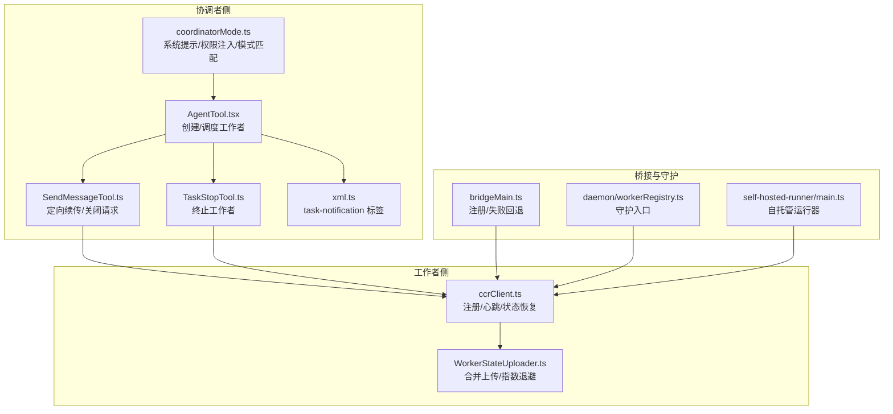
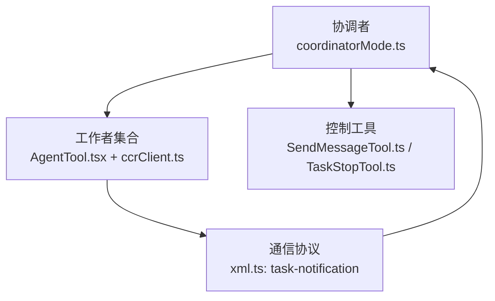
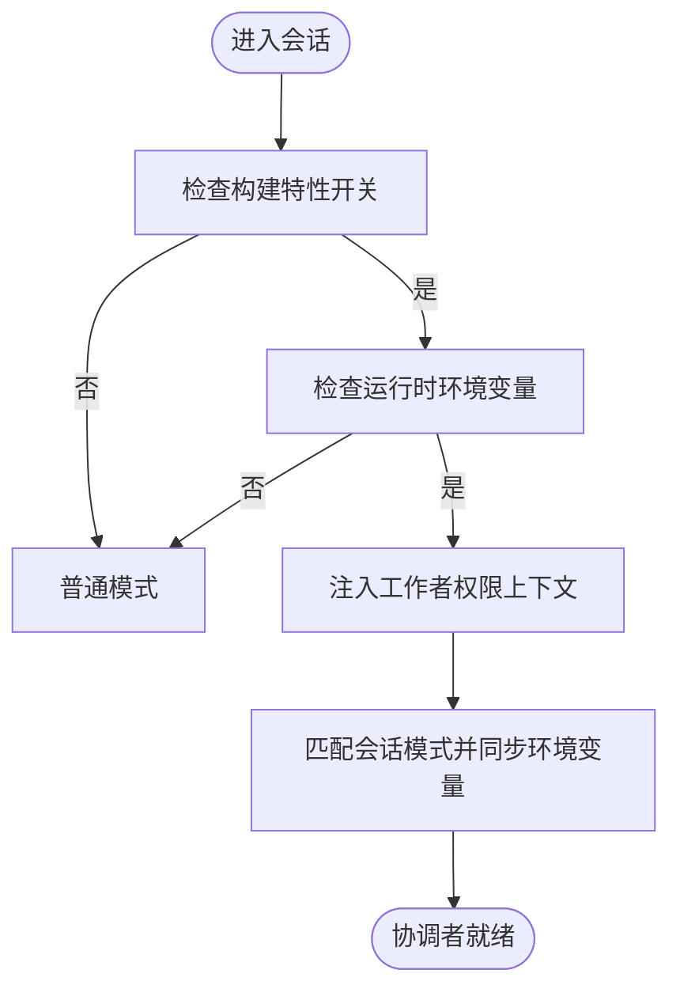
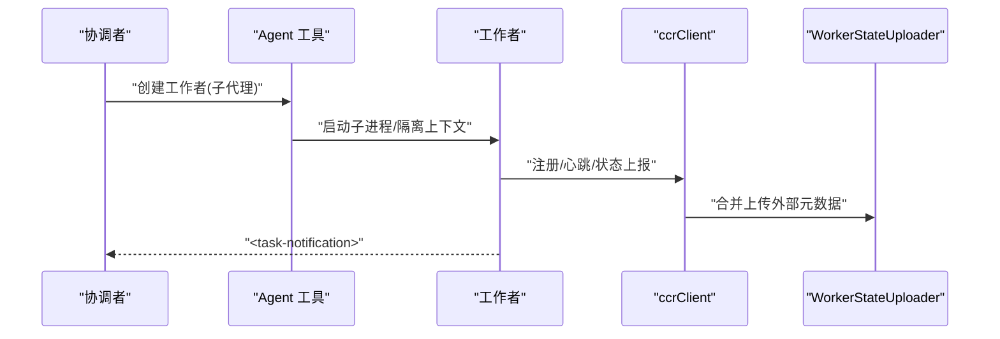
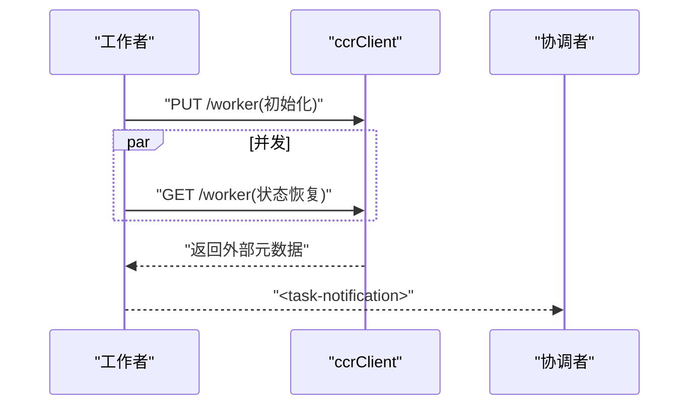
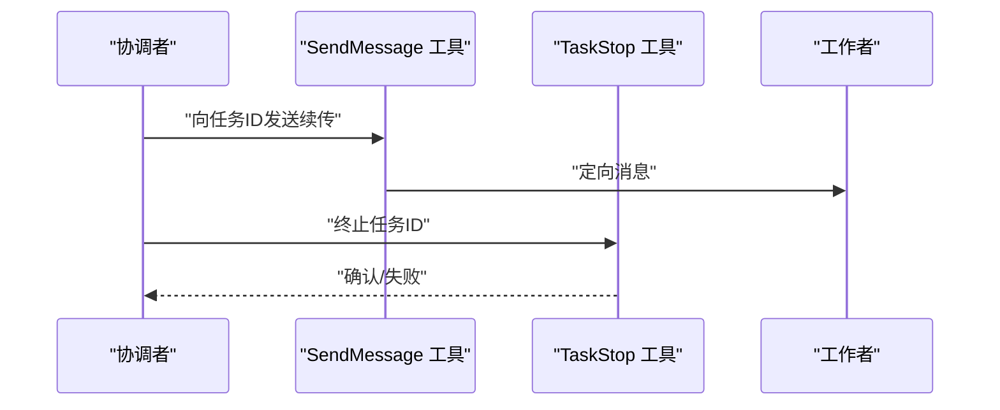
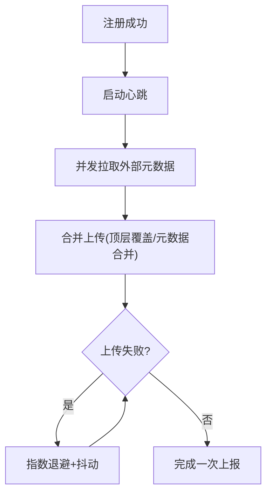
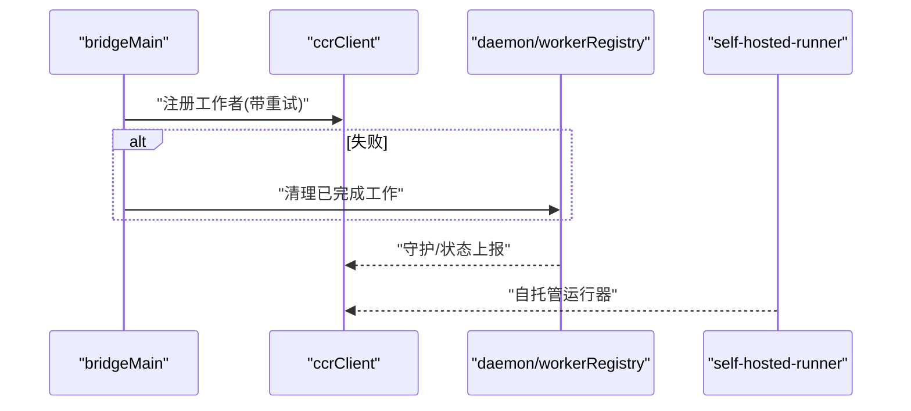
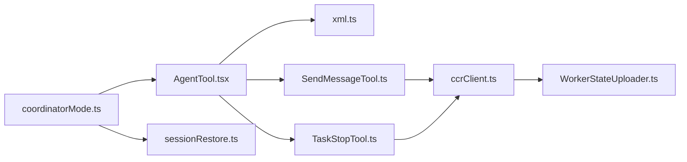

# 协调者模式

<cite>
**本文引用的文件**
- [coordinatorMode.ts](file://src/coordinator/coordinatorMode.ts)
- [workerAgent.ts](file://src/coordinator/workerAgent.ts)
- [coordinator-and-swarm.mdx](file://docs/agent/coordinator-and-swarm.mdx)
- [AgentTool.tsx](file://src/tools/AgentTool/AgentTool.tsx)
- [constants.ts](file://src/tools/AgentTool/constants.ts)
- [SendMessageTool.ts](file://src/tools/SendMessageTool/SendMessageTool.ts)
- [TaskStopTool.ts](file://src/tools/TaskStopTool/prompt.ts)
- [xml.ts](file://src/constants/xml.ts)
- [ccrClient.ts](file://src/cli/transports/ccrClient.ts)
- [WorkerStateUploader.ts](file://src/cli/transports/WorkerStateUploader.ts)
- [bridgeMain.ts](file://src/bridge/bridgeMain.ts)
- [workerRegistry.ts](file://src/daemon/workerRegistry.ts)
- [main.ts](file://src/daemon/main.ts)
- [main.ts](file://src/self-hosted-runner/main.ts)
- [sessionRestore.ts](file://src/utils/sessionRestore.ts)
</cite>

## 目录
1. [引言](#引言)
2. [项目结构](#项目结构)
3. [核心组件](#核心组件)
4. [架构总览](#架构总览)
5. [详细组件分析](#详细组件分析)
6. [依赖关系分析](#依赖关系分析)
7. [性能考量](#性能考量)
8. [故障排查指南](#故障排查指南)
9. [结论](#结论)
10. [附录](#附录)

## 引言
本文件系统性阐述“协调者模式”的设计理念、架构原理与工程实现，聚焦于：
- 协调者与工作者的职责边界与交互协议
- 工作者代理的创建、管理与调度机制
- 任务分配、状态同步与通信通道
- 协调者配置参数、工作流程与执行策略
- 部署、监控与故障恢复实践
- 多工作者并行处理、资源管理与负载均衡
- 实际协调场景、性能优化与问题排查方法

## 项目结构
围绕协调者模式的关键代码分布在以下模块：
- 协调者定义与系统提示：coordinatorMode.ts
- 协调者与工作者的工具与权限：AgentTool、SendMessageTool、TaskStopTool
- 通信协议与标签：xml.ts
- 工作者生命周期与状态上报：ccrClient.ts、WorkerStateUploader.ts
- 桥接与注册：bridgeMain.ts
- 守护进程与自托管运行器：daemon、self-hosted-runner
- 会话恢复与模式切换：sessionRestore.ts

图示来源
- [coordinatorMode.ts:111-369](file://src/coordinator/coordinatorMode.ts#L111-L369)
- [AgentTool.tsx:239-577](file://src/tools/AgentTool/AgentTool.tsx#L239-L577)
- [SendMessageTool.ts:268-315](file://src/tools/SendMessageTool/SendMessageTool.ts#L268-L315)
- [TaskStopTool.ts:1-8](file://src/tools/TaskStopTool/prompt.ts#L1-L8)
- [xml.ts:27-38](file://src/constants/xml.ts#L27-L38)
- [ccrClient.ts:473-548](file://src/cli/transports/ccrClient.ts#L473-L548)
- [WorkerStateUploader.ts:19-96](file://src/cli/transports/WorkerStateUploader.ts#L19-L96)
- [bridgeMain.ts:925-961](file://src/bridge/bridgeMain.ts#L925-L961)
- [workerRegistry.ts:1-4](file://src/daemon/workerRegistry.ts#L1-L4)
- [main.ts:1-3](file://src/self-hosted-runner/main.ts#L1-L3)

章节来源
- [coordinator-and-swarm.mdx:1-197](file://docs/agent/coordinator-and-swarm.mdx#L1-L197)
- [coordinatorMode.ts:1-370](file://src/coordinator/coordinatorMode.ts#L1-L370)
- [AgentTool.tsx:221-577](file://src/tools/AgentTool/AgentTool.tsx#L221-L577)
- [xml.ts:25-56](file://src/constants/xml.ts#L25-L56)
- [ccrClient.ts:473-548](file://src/cli/transports/ccrClient.ts#L473-L548)
- [WorkerStateUploader.ts:1-131](file://src/cli/transports/WorkerStateUploader.ts#L1-L131)
- [bridgeMain.ts:925-961](file://src/bridge/bridgeMain.ts#L925-L961)
- [workerRegistry.ts:1-4](file://src/daemon/workerRegistry.ts#L1-L4)
- [main.ts:1-3](file://src/self-hosted-runner/main.ts#L1-L3)
- [sessionRestore.ts:251-271](file://src/utils/sessionRestore.ts#L251-L271)

## 核心组件
- 协调者系统提示与权限注入：负责生成系统提示、注入工作者可用工具清单、控制 Scratchpad 权限与 MCP 工具可见性，并在会话恢复时匹配模式状态。
- 工作者创建与调度：通过 Agent 工具创建工作者代理，支持强制异步、后台运行、隔离目录与工作区等参数，统一产出 <task-notification>。
- 通信协议：<task-notification> 作为工作者完成态的标准化汇报载体，携带任务 ID、状态、摘要与用量信息。
- 定向续传与终止：SendMessage 工具按任务 ID 定向续传；TaskStop 工具按任务 ID 终止工作者。
- 工作者生命周期与状态上报：注册、心跳、状态恢复与合并上传，具备指数退避与合并策略。

章节来源
- [coordinatorMode.ts:80-109](file://src/coordinator/coordinatorMode.ts#L80-L109)
- [AgentTool.tsx:239-577](file://src/tools/AgentTool/AgentTool.tsx#L239-L577)
- [xml.ts:27-38](file://src/constants/xml.ts#L27-L38)
- [SendMessageTool.ts:268-315](file://src/tools/SendMessageTool/SendMessageTool.ts#L268-L315)
- [TaskStopTool.ts:1-8](file://src/tools/TaskStopTool/prompt.ts#L1-L8)
- [ccrClient.ts:473-548](file://src/cli/transports/ccrClient.ts#L473-L548)
- [WorkerStateUploader.ts:19-96](file://src/cli/transports/WorkerStateUploader.ts#L19-L96)

## 架构总览
协调者模式采用“星型”架构：协调者集中编排，工作者异步执行并以 <task-notification> 汇报结果；在 Swarm 模式下，工作者之间通过共享任务列表与竞争认领实现去中心化协作。两者并非互斥，协调者可在 Swarm 之上扮演领导者角色。

图示来源
- [coordinatorMode.ts:111-369](file://src/coordinator/coordinatorMode.ts#L111-L369)
- [AgentTool.tsx:239-577](file://src/tools/AgentTool/AgentTool.tsx#L239-L577)
- [xml.ts:27-38](file://src/constants/xml.ts#L27-L38)
- [SendMessageTool.ts:268-315](file://src/tools/SendMessageTool/SendMessageTool.ts#L268-L315)
- [TaskStopTool.ts:1-8](file://src/tools/TaskStopTool/prompt.ts#L1-L8)

## 详细组件分析

### 协调者系统提示与权限注入
- 激活条件：构建时特性开关与运行时环境变量共同决定是否启用协调者模式。
- 权限注入：根据是否简化模式，动态生成工作者可用工具清单，并注入 MCP 服务器可见性与 Scratchpad 权限说明。
- 模式匹配：在会话恢复时，若存储的模式与当前不一致，自动翻转环境变量并记录诊断事件。

图示来源
- [coordinatorMode.ts:36-78](file://src/coordinator/coordinatorMode.ts#L36-L78)
- [coordinatorMode.ts:80-109](file://src/coordinator/coordinatorMode.ts#L80-L109)
- [sessionRestore.ts:251-271](file://src/utils/sessionRestore.ts#L251-L271)

章节来源
- [coordinatorMode.ts:36-78](file://src/coordinator/coordinatorMode.ts#L36-L78)
- [coordinatorMode.ts:80-109](file://src/coordinator/coordinatorMode.ts#L80-L109)
- [sessionRestore.ts:251-271](file://src/utils/sessionRestore.ts#L251-L271)

### 工作者创建、管理与调度
- 创建入口：Agent 工具支持 subagent_type=worker，强制异步、后台运行、隔离工作区与模型参数透传策略。
- 工具池：工作者拥有独立的工具池，不受父进程工具限制，避免权限耦合。
- 统一输出：<task-notification> 作为完成态汇报载体，便于协调者聚合与续传。

图示来源
- [AgentTool.tsx:239-577](file://src/tools/AgentTool/AgentTool.tsx#L239-L577)
- [ccrClient.ts:473-548](file://src/cli/transports/ccrClient.ts#L473-L548)
- [WorkerStateUploader.ts:19-96](file://src/cli/transports/WorkerStateUploader.ts#L19-L96)
- [xml.ts:27-38](file://src/constants/xml.ts#L27-L38)

章节来源
- [AgentTool.tsx:239-577](file://src/tools/AgentTool/AgentTool.tsx#L239-L577)
- [constants.ts:1-13](file://src/tools/AgentTool/constants.ts#L1-L13)

### 通信协议与状态同步
- 协议格式：<task-notification> 包含任务 ID、状态、摘要与可选结果与用量。
- 解析与识别：协调者通过标签区分工作者汇报与用户消息，使用任务 ID 实现定向续传。
- 状态恢复：工作者在注册前并发拉取历史外部元数据，成功后再记录诊断日志，避免误判。

图示来源
- [ccrClient.ts:473-548](file://src/cli/transports/ccrClient.ts#L473-L548)
- [xml.ts:27-38](file://src/constants/xml.ts#L27-L38)

章节来源
- [xml.ts:27-38](file://src/constants/xml.ts#L27-L38)
- [ccrClient.ts:473-548](file://src/cli/transports/ccrClient.ts#L473-L548)

### 定向续传与终止
- 续传：SendMessage 工具按任务 ID 向指定工作者发送后续指令，保持上下文连续性。
- 关闭：TaskStop 工具按任务 ID 终止工作者，支持错误纠正与路径切换。

图示来源
- [SendMessageTool.ts:268-315](file://src/tools/SendMessageTool/SendMessageTool.ts#L268-L315)
- [TaskStopTool.ts:1-8](file://src/tools/TaskStopTool/prompt.ts#L1-L8)

章节来源
- [SendMessageTool.ts:268-315](file://src/tools/SendMessageTool/SendMessageTool.ts#L268-L315)
- [TaskStopTool.ts:1-8](file://src/tools/TaskStopTool/prompt.ts#L1-L8)

### 工作者生命周期与状态上报
- 注册与心跳：工作者注册成功后启动心跳，保持会话活性；并发获取历史状态，避免过期租约导致的误判。
- 状态合并上传：采用“顶层键覆盖 + 元数据 RFC 7396 合并”的策略，保证幂等与一致性。
- 指数退避与抖动：失败时指数退避并加入随机抖动，上限受控，直至成功或关闭。

图示来源
- [ccrClient.ts:473-548](file://src/cli/transports/ccrClient.ts#L473-L548)
- [WorkerStateUploader.ts:19-96](file://src/cli/transports/WorkerStateUploader.ts#L19-L96)

章节来源
- [ccrClient.ts:473-548](file://src/cli/transports/ccrClient.ts#L473-L548)
- [WorkerStateUploader.ts:19-96](file://src/cli/transports/WorkerStateUploader.ts#L19-L96)

### 桥接与注册、守护进程与自托管运行器
- 桥接注册：在桥接层进行 CCR v2 注册，失败时重试并清理已完成工作，保障会话一致性。
- 守护进程：提供守护入口与运行器接口，配合工作者状态上报与会话恢复。
- 自托管运行器：提供自托管运行器入口，便于在本地或私有环境中部署。

图示来源
- [bridgeMain.ts:925-961](file://src/bridge/bridgeMain.ts#L925-L961)
- [workerRegistry.ts:1-4](file://src/daemon/workerRegistry.ts#L1-L4)
- [main.ts:1-3](file://src/self-hosted-runner/main.ts#L1-L3)

章节来源
- [bridgeMain.ts:925-961](file://src/bridge/bridgeMain.ts#L925-L961)
- [workerRegistry.ts:1-4](file://src/daemon/workerRegistry.ts#L1-L4)
- [main.ts:1-3](file://src/self-hosted-runner/main.ts#L1-L3)

## 依赖关系分析
- 协调者与工作者：通过 Agent 工具解耦创建与执行，通过 <task-notification> 解耦汇报与对话。
- 控制工具：SendMessage/TaskStop 与工作者生命周期强关联，确保可控的并发与回滚。
- 状态与通信：ccrClient 与 WorkerStateUploader 负责状态持久化与一致性，xml.ts 规范通信格式。
- 模式与会话：coordinatorMode 与 sessionRestore 共同保证模式切换与会话恢复的一致性。

图示来源
- [coordinatorMode.ts:111-369](file://src/coordinator/coordinatorMode.ts#L111-L369)
- [AgentTool.tsx:239-577](file://src/tools/AgentTool/AgentTool.tsx#L239-L577)
- [xml.ts:27-38](file://src/constants/xml.ts#L27-L38)
- [SendMessageTool.ts:268-315](file://src/tools/SendMessageTool/SendMessageTool.ts#L268-L315)
- [TaskStopTool.ts:1-8](file://src/tools/TaskStopTool/prompt.ts#L1-L8)
- [ccrClient.ts:473-548](file://src/cli/transports/ccrClient.ts#L473-L548)
- [WorkerStateUploader.ts:19-96](file://src/cli/transports/WorkerStateUploader.ts#L19-L96)
- [sessionRestore.ts:251-271](file://src/utils/sessionRestore.ts#L251-L271)

章节来源
- [coordinatorMode.ts:111-369](file://src/coordinator/coordinatorMode.ts#L111-L369)
- [AgentTool.tsx:239-577](file://src/tools/AgentTool/AgentTool.tsx#L239-L577)
- [xml.ts:27-38](file://src/constants/xml.ts#L27-L38)
- [SendMessageTool.ts:268-315](file://src/tools/SendMessageTool/SendMessageTool.ts#L268-L315)
- [TaskStopTool.ts:1-8](file://src/tools/TaskStopTool/prompt.ts#L1-L8)
- [ccrClient.ts:473-548](file://src/cli/transports/ccrClient.ts#L473-L548)
- [WorkerStateUploader.ts:19-96](file://src/cli/transports/WorkerStateUploader.ts#L19-L96)
- [sessionRestore.ts:251-271](file://src/utils/sessionRestore.ts#L251-L271)

## 性能考量
- 并发策略：研究阶段并行推进，实现与验证阶段按文件域串行，避免冲突；验证可与不同文件区域并行。
- 工具选择：简化模式下仅 Bash/Read/Edit，降低工具装配与权限检查开销；复杂模式下启用技能与 MCP 工具，提升一次性解决问题的能力。
- 状态上报：合并上传减少网络往返，指数退避避免雪崩；心跳维持租约，避免长时间阻塞。
- 模式切换：会话恢复时自动匹配模式，避免重复初始化与权限重算。

## 故障排查指南
- 注册失败与重试：桥接层对注册失败进行有限次重试，必要时清理已完成工作并记录错误。
- 状态恢复：注册成功后再进行状态恢复，避免“先恢复后注册”的时序问题导致误判。
- 通信异常：<task-notification> 解析失败或格式不符时，检查标签完整性与编码一致性。
- 工具权限：确认工作者工具池与 MCP 服务器连接状态，避免因权限不足导致任务停滞。
- 日志定位：利用诊断日志与错误日志收集器，定位注册、心跳与状态上报的关键节点。

章节来源
- [bridgeMain.ts:925-961](file://src/bridge/bridgeMain.ts#L925-L961)
- [ccrClient.ts:473-548](file://src/cli/transports/ccrClient.ts#L473-L548)
- [WorkerStateUploader.ts:88-96](file://src/cli/transports/WorkerStateUploader.ts#L88-L96)
- [xml.ts:27-38](file://src/constants/xml.ts#L27-L38)

## 结论
协调者模式通过“集中编排 + 异步执行 + 标准化汇报”的组合，实现了复杂任务的高效协同。其关键在于：
- 明确的职责边界与工具权限注入
- 统一的通信协议与状态同步
- 可靠的注册、心跳与指数退避机制
- 与 Swarm 模式的互补与融合

## 附录
- 配置参数建议
  - 激活方式：构建特性开关 + 运行时环境变量
  - 简化模式：适用于低权限或快速验证场景
  - 复杂模式：启用技能与 MCP 工具，适合端到端自动化
- 部署建议
  - 使用桥接层进行注册与重试，结合守护进程与自托管运行器
  - 合理设置心跳周期与状态上报合并策略
- 监控要点
  - 注册成功率、心跳间隔、状态恢复耗时、<task-notification> 到达率
- 故障恢复
  - 注册失败时清理已完成工作并重试
  - 会话恢复时匹配模式，避免权限与工具不一致