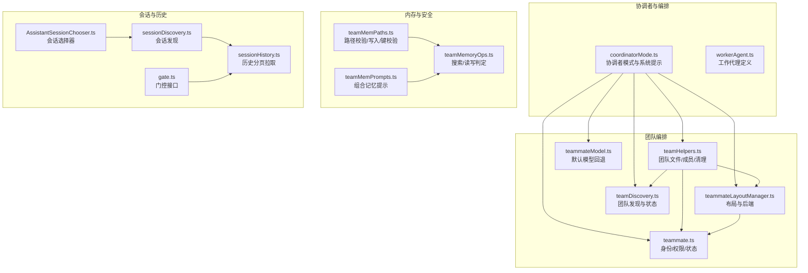
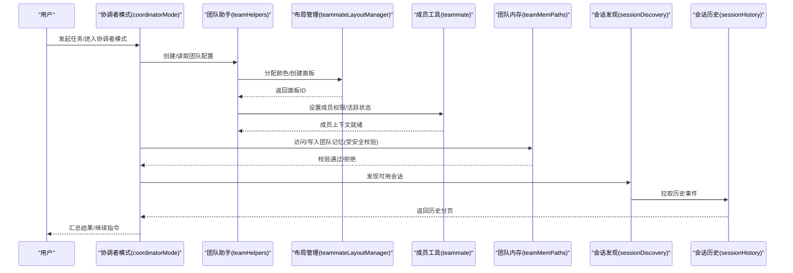
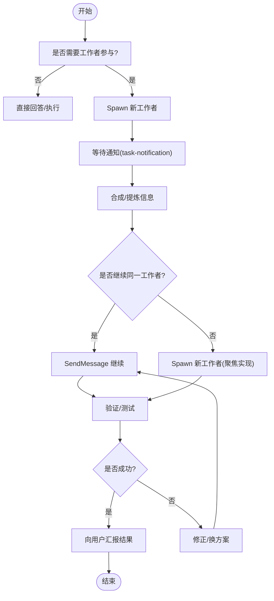
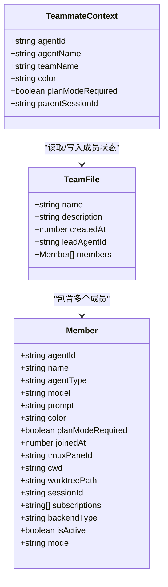
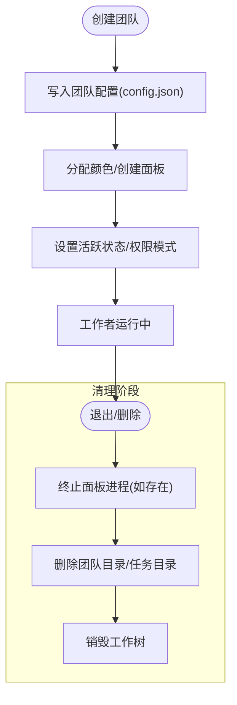
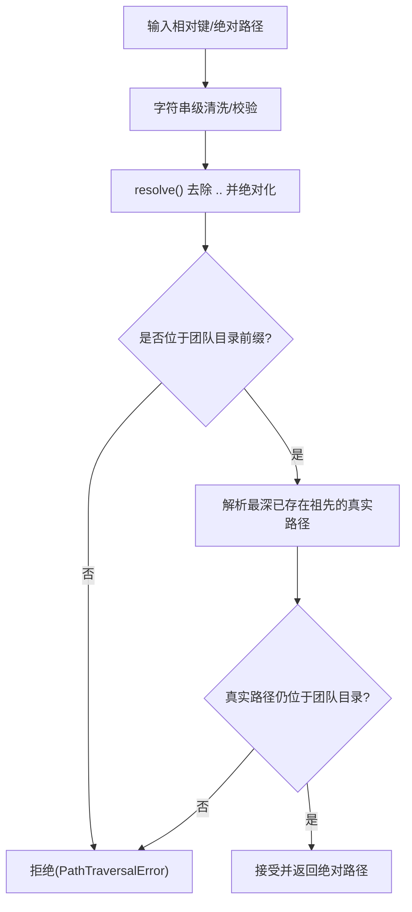
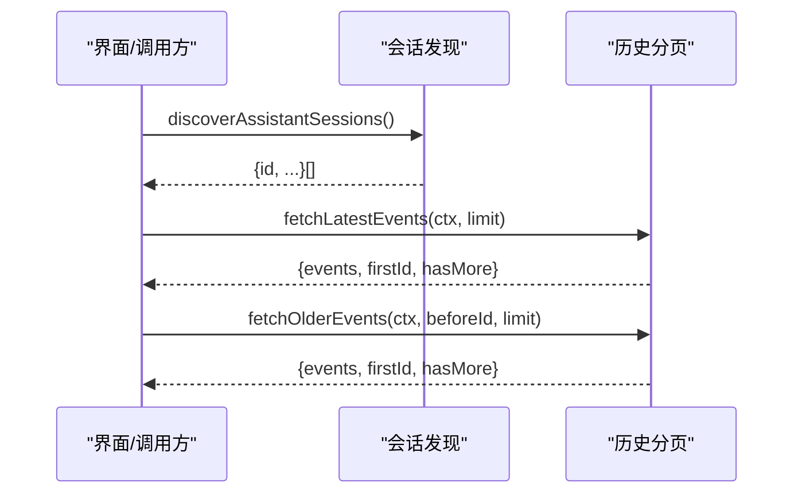
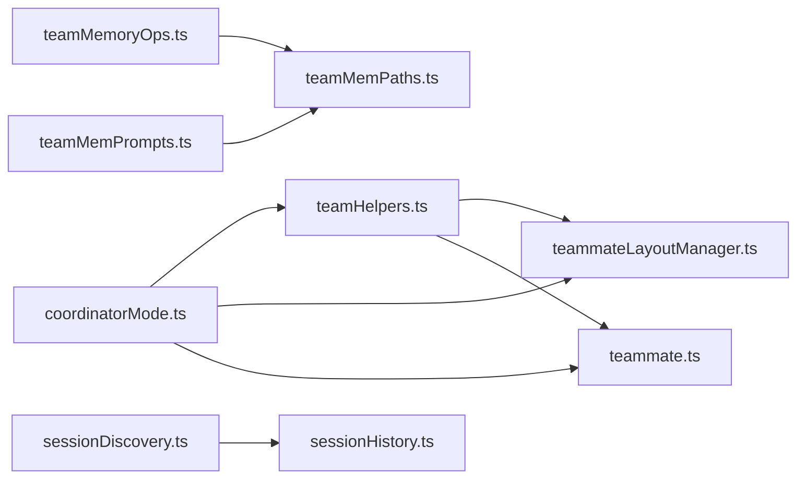

# 团队协作

<cite>
**本文引用的文件**
- [coordinatorMode.ts](file://src/coordinator/coordinatorMode.ts)
- [workerAgent.ts](file://src/coordinator/workerAgent.ts)
- [teamHelpers.ts](file://src/utils/swarm/teamHelpers.ts)
- [teammateLayoutManager.ts](file://src/utils/swarm/teammateLayoutManager.ts)
- [teammate.ts](file://src/utils/teammate.ts)
- [teamDiscovery.ts](file://src/utils/teamDiscovery.ts)
- [teamMemPaths.ts](file://src/memdir/teamMemPaths.ts)
- [teamMemPrompts.ts](file://src/memdir/teamMemPrompts.ts)
- [teamMemoryOps.ts](file://src/utils/teamMemoryOps.ts)
- [teammateModel.ts](file://src/utils/swarm/teammateModel.ts)
- [AssistantSessionChooser.ts](file://src/assistant/AssistantSessionChooser.ts)
- [gate.ts](file://src/assistant/gate.ts)
- [sessionDiscovery.ts](file://src/assistant/sessionDiscovery.ts)
- [sessionHistory.ts](file://src/assistant/sessionHistory.ts)
- [TEAM_CREATE_TOOL_NAME 常量](file://src/tools/TeamCreateTool/constants.ts)
- [TEAM_DELETE_TOOL_NAME 常量](file://src/tools/TeamDeleteTool/constants.ts)
</cite>

## 目录
1. [简介](#简介)
2. [项目结构](#项目结构)
3. [核心组件](#核心组件)
4. [架构总览](#架构总览)
5. [详细组件分析](#详细组件分析)
6. [依赖关系分析](#依赖关系分析)
7. [性能考量](#性能考量)
8. [故障排除指南](#故障排除指南)
9. [结论](#结论)
10. [附录](#附录)

## 简介
本文件面向团队协作功能，系统性阐述助理系统的设计架构与会话选择机制，深入解析协调者模式（Coordinator Mode）的工作原理与团队成员管理，解释权限门控系统、访问控制与安全策略，并给出团队配置、角色分配与职责划分的最佳实践。文档同时覆盖协作流程、沟通机制、决策制定过程，以及团队状态同步、冲突解决与一致性保证，最后提供可操作的团队协作场景、最佳实践与故障排除指南。

## 项目结构
团队协作能力由“协调者模式”“团队编排工具”“团队成员管理”“内存与路径安全”“会话发现与历史”等模块协同实现。下图概览了关键模块之间的关系：

**图表来源**
- [coordinatorMode.ts:1-370](file://src/coordinator/coordinatorMode.ts#L1-L370)
- [workerAgent.ts:1-5](file://src/coordinator/workerAgent.ts#L1-L5)
- [teamHelpers.ts:1-684](file://src/utils/swarm/teamHelpers.ts#L1-L684)
- [teammateLayoutManager.ts:1-108](file://src/utils/swarm/teammateLayoutManager.ts#L1-L108)
- [teammate.ts:1-293](file://src/utils/teammate.ts#L1-L293)
- [teamDiscovery.ts:1-82](file://src/utils/teamDiscovery.ts#L1-L82)
- [teamMemPaths.ts:1-293](file://src/memdir/teamMemPaths.ts#L1-L293)
- [teamMemPrompts.ts:1-101](file://src/memdir/teamMemPrompts.ts#L1-L101)
- [teamMemoryOps.ts:1-89](file://src/utils/teamMemoryOps.ts#L1-L89)
- [teammateModel.ts:1-11](file://src/utils/swarm/teammateModel.ts#L1-L11)
- [AssistantSessionChooser.ts:1-4](file://src/assistant/AssistantSessionChooser.ts#L1-L4)
- [gate.ts:1-4](file://src/assistant/gate.ts#L1-L4)
- [sessionDiscovery.ts:1-4](file://src/assistant/sessionDiscovery.ts#L1-L4)
- [sessionHistory.ts:1-88](file://src/assistant/sessionHistory.ts#L1-L88)

**章节来源**
- [coordinatorMode.ts:1-370](file://src/coordinator/coordinatorMode.ts#L1-L370)
- [teamHelpers.ts:1-684](file://src/utils/swarm/teamHelpers.ts#L1-L684)
- [teammateLayoutManager.ts:1-108](file://src/utils/swarm/teammateLayoutManager.ts#L1-L108)
- [teammate.ts:1-293](file://src/utils/teammate.ts#L1-L293)
- [teamDiscovery.ts:1-82](file://src/utils/teamDiscovery.ts#L1-L82)
- [teamMemPaths.ts:1-293](file://src/memdir/teamMemPaths.ts#L1-L293)
- [teamMemPrompts.ts:1-101](file://src/memdir/teamMemPrompts.ts#L1-L101)
- [teamMemoryOps.ts:1-89](file://src/utils/teamMemoryOps.ts#L1-L89)
- [teammateModel.ts:1-11](file://src/utils/swarm/teammateModel.ts#L1-L11)
- [AssistantSessionChooser.ts:1-4](file://src/assistant/AssistantSessionChooser.ts#L1-L4)
- [gate.ts:1-4](file://src/assistant/gate.ts#L1-L4)
- [sessionDiscovery.ts:1-4](file://src/assistant/sessionDiscovery.ts#L1-L4)
- [sessionHistory.ts:1-88](file://src/assistant/sessionHistory.ts#L1-L88)

## 核心组件
- 协调者模式与系统提示：定义协调者角色、可用工具、任务流程、并发策略与提示规范，确保多工作者并行与有序推进。
- 团队编排工具：提供团队创建/删除、成员管理、权限模式切换、工作树清理、会话清理等能力。
- 团队成员管理：统一识别团队成员身份、颜色分配、后端布局、活跃状态与权限模式，支持在进程内与外部终端两种运行形态。
- 内存与安全：团队共享记忆目录的安全路径校验、写入验证与键校验，防止路径穿越与符号链接逃逸；提供组合记忆提示与读写统计汇总。
- 会话发现与历史：提供会话发现、历史分页拉取与认证上下文准备，支撑跨会话协作与审计。

**章节来源**
- [coordinatorMode.ts:111-370](file://src/coordinator/coordinatorMode.ts#L111-L370)
- [teamHelpers.ts:44-95](file://src/utils/swarm/teamHelpers.ts#L44-L95)
- [teammateLayoutManager.ts:18-51](file://src/utils/swarm/teammateLayoutManager.ts#L18-L51)
- [teammate.ts:87-156](file://src/utils/teammate.ts#L87-L156)
- [teamMemPaths.ts:228-284](file://src/memdir/teamMemPaths.ts#L228-L284)
- [teamMemPrompts.ts:22-99](file://src/memdir/teamMemPrompts.ts#L22-L99)
- [sessionHistory.ts:31-87](file://src/assistant/sessionHistory.ts#L31-L87)

## 架构总览
下图展示了从用户发起到协调者调度、再到团队成员执行与状态同步的整体流程：

**图表来源**
- [coordinatorMode.ts:111-370](file://src/coordinator/coordinatorMode.ts#L111-L370)
- [teamHelpers.ts:115-182](file://src/utils/swarm/teamHelpers.ts#L115-L182)
- [teammateLayoutManager.ts:76-82](file://src/utils/swarm/teammateLayoutManager.ts#L76-L82)
- [teammate.ts:34-102](file://src/utils/teammate.ts#L34-L102)
- [teamMemPaths.ts:228-284](file://src/memdir/teamMemPaths.ts#L228-L284)
- [sessionDiscovery.ts:1-4](file://src/assistant/sessionDiscovery.ts#L1-L4)
- [sessionHistory.ts:73-87](file://src/assistant/sessionHistory.ts#L73-L87)

## 详细组件分析

### 协调者模式与系统提示
- 角色与职责：协调者负责目标对齐、工作者研究/实现/验证、结果合成与用户沟通；避免向工作者委派可直接处理的任务。
- 工具集：Spawn 新工作者、继续既有工作者、停止工作者、订阅/取消订阅 PR 活动等。
- 并发与任务流：研究阶段并行、实现阶段串行或按文件区域并行、验证独立进行；失败时继续同一工作者以复用上下文。
- 提示规范：要求工作者自包含完整上下文；明确“完成态”；针对实现/验证给出具体步骤与期望输出。

**图表来源**
- [coordinatorMode.ts:116-370](file://src/coordinator/coordinatorMode.ts#L116-L370)

**章节来源**
- [coordinatorMode.ts:111-370](file://src/coordinator/coordinatorMode.ts#L111-L370)

### 团队成员管理与布局
- 身份与上下文：支持在进程内与外部终端两种形态；动态上下文优先于环境变量；提供父会话 ID、颜色、计划模式需求等。
- 权限与活跃度：成员权限模式可单个或批量更新；活跃状态用于 UI 与退出时机判断；隐藏面板列表支持视图管理。
- 面板布局：自动检测 tmux 或 iTerm2 后端，分配颜色、创建面板、启用边框标题、发送命令至指定面板。
- 默认模型回退：根据 API 提供商返回合适的默认模型 ID，确保新成员具备一致体验。

**图表来源**
- [teammate.ts:34-156](file://src/utils/teammate.ts#L34-L156)
- [teamHelpers.ts:64-90](file://src/utils/swarm/teamHelpers.ts#L64-L90)

**章节来源**
- [teammate.ts:87-156](file://src/utils/teammate.ts#L87-L156)
- [teammateLayoutManager.ts:18-51](file://src/utils/swarm/teammateLayoutManager.ts#L18-L51)
- [teamHelpers.ts:357-445](file://src/utils/swarm/teamHelpers.ts#L357-L445)
- [teammateModel.ts:8-11](file://src/utils/swarm/teammateModel.ts#L8-L11)

### 团队编排工具与清理
- 团队生命周期：创建团队（生成配置文件）、清理会话内孤儿团队、删除团队（含工作树与任务目录）。
- 安全清理：先终止面板进程，再删除目录，避免孤儿进程；工作树通过 git worktree remove 或回退 rm -rf。
- 会话清理：记录会话内创建的团队，优雅/非优雅退出时统一清理。

**图表来源**
- [teamHelpers.ts:576-684](file://src/utils/swarm/teamHelpers.ts#L576-L684)

**章节来源**
- [teamHelpers.ts:576-684](file://src/utils/swarm/teamHelpers.ts#L576-L684)

### 内存与安全：团队共享记忆
- 能力边界：当自动记忆开启时，团队记忆才生效；团队记忆位于自动记忆目录下的子目录，入口文件为固定命名。
- 路径安全：字符串级去 ../ 与前缀校验；深度解析真实路径并检查符号链接逃逸；键校验拒绝注入与转义。
- 使用建议：保存记忆需遵循前端元数据格式；索引文件仅存放指针；避免保存敏感信息。

**图表来源**
- [teamMemPaths.ts:228-284](file://src/memdir/teamMemPaths.ts#L228-L284)

**章节来源**
- [teamMemPaths.ts:73-78](file://src/memdir/teamMemPaths.ts#L73-L78)
- [teamMemPaths.ts:214-220](file://src/memdir/teamMemPaths.ts#L214-L220)
- [teamMemPaths.ts:228-284](file://src/memdir/teamMemPaths.ts#L228-L284)
- [teamMemPrompts.ts:22-99](file://src/memdir/teamMemPrompts.ts#L22-L99)
- [teamMemoryOps.ts:10-36](file://src/utils/teamMemoryOps.ts#L10-L36)

### 会话选择与历史
- 会话选择器：占位实现，后续替换为真实逻辑。
- 会话发现：返回可用会话列表，便于跨会话协作。
- 历史分页：基于锚点最新/旧页游标分页拉取，带超时与错误兜底，支持调试日志。

**图表来源**
- [sessionDiscovery.ts:1-4](file://src/assistant/sessionDiscovery.ts#L1-L4)
- [sessionHistory.ts:73-87](file://src/assistant/sessionHistory.ts#L73-L87)

**章节来源**
- [AssistantSessionChooser.ts:1-4](file://src/assistant/AssistantSessionChooser.ts#L1-L4)
- [sessionDiscovery.ts:1-4](file://src/assistant/sessionDiscovery.ts#L1-L4)
- [sessionHistory.ts:31-87](file://src/assistant/sessionHistory.ts#L31-L87)

### 权限门控与访问控制
- 门控接口：提供异步门控查询能力，用于控制特性开关与能力启用。
- 访问控制：团队成员权限模式可动态调整；计划模式需求可强制在实现前进入规划态。
- 安全策略：路径校验与符号链接检测，拒绝潜在逃逸；写入前二次校验真实路径。

**章节来源**
- [gate.ts:1-4](file://src/assistant/gate.ts#L1-L4)
- [teammate.ts:149-156](file://src/utils/teammate.ts#L149-L156)
- [teamMemPaths.ts:109-171](file://src/memdir/teamMemPaths.ts#L109-L171)

## 依赖关系分析
- 协调者模式依赖团队助手与布局管理，以驱动面板创建与成员状态；同时依赖成员工具以解析身份与权限。
- 团队助手依赖布局管理以创建面板；依赖成员工具以设置权限与活跃度；依赖清理工具以回收资源。
- 内存路径模块被团队助手与工具层共同使用，保障写入安全。
- 会话发现与历史为上层协作提供跨会话可见性与审计能力。

**图表来源**
- [coordinatorMode.ts:1-370](file://src/coordinator/coordinatorMode.ts#L1-L370)
- [teamHelpers.ts:1-684](file://src/utils/swarm/teamHelpers.ts#L1-L684)
- [teammateLayoutManager.ts:1-108](file://src/utils/swarm/teammateLayoutManager.ts#L1-L108)
- [teammate.ts:1-293](file://src/utils/teammate.ts#L1-L293)
- [teamMemoryOps.ts:1-89](file://src/utils/teamMemoryOps.ts#L1-L89)
- [teamMemPaths.ts:1-293](file://src/memdir/teamMemPaths.ts#L1-L293)
- [teamMemPrompts.ts:1-101](file://src/memdir/teamMemPrompts.ts#L1-L101)
- [sessionDiscovery.ts:1-4](file://src/assistant/sessionDiscovery.ts#L1-L4)
- [sessionHistory.ts:1-88](file://src/assistant/sessionHistory.ts#L1-L88)

**章节来源**
- [coordinatorMode.ts:1-370](file://src/coordinator/coordinatorMode.ts#L1-L370)
- [teamHelpers.ts:1-684](file://src/utils/swarm/teamHelpers.ts#L1-L684)
- [teammateLayoutManager.ts:1-108](file://src/utils/swarm/teammateLayoutManager.ts#L1-L108)
- [teammate.ts:1-293](file://src/utils/teammate.ts#L1-L293)
- [teamMemoryOps.ts:1-89](file://src/utils/teamMemoryOps.ts#L1-L89)
- [teamMemPaths.ts:1-293](file://src/memdir/teamMemPaths.ts#L1-L293)
- [teamMemPrompts.ts:1-101](file://src/memdir/teamMemPrompts.ts#L1-L101)
- [sessionDiscovery.ts:1-4](file://src/assistant/sessionDiscovery.ts#L1-L4)
- [sessionHistory.ts:1-88](file://src/assistant/sessionHistory.ts#L1-L88)

## 性能考量
- 并发策略：研究阶段并行、实现阶段按文件区域串行或并行、验证独立进行，减少重复计算与上下文切换。
- 清理效率：先终止面板进程再删除目录，避免孤儿进程与磁盘占用；批量清理使用 Promise.allSettled。
- 历史拉取：分页与超时控制，避免阻塞；失败时快速返回空结果并记录调试日志。
- 路径校验：字符串级快速拒绝与真实路径二次校验，降低恶意路径带来的系统开销。

[本节为通用指导，无需特定文件来源]

## 故障排除指南
- 协调者模式不生效
  - 检查特性开关与环境变量；确认会话模式匹配（进入/退出协调者模式时会切换环境变量）。
  - 参考：[coordinatorMode.ts:36-78](file://src/coordinator/coordinatorMode.ts#L36-L78)
- 面板无法创建/布局异常
  - 确认运行环境（tmux/iTerm2），检查后端检测与面板创建返回值；必要时启用边框状态。
  - 参考：[teammateLayoutManager.ts:76-94](file://src/utils/swarm/teammateLayoutManager.ts#L76-L94)
- 成员权限未更新
  - 使用单个或批量更新接口；确认成员名与模式映射正确；检查配置文件写入日志。
  - 参考：[teamHelpers.ts:415-445](file://src/utils/swarm/teamHelpers.ts#L415-L445)
- 写入团队记忆失败
  - 检查路径是否包含非法字符/绝对路径/反斜杠；确认键经清洗并通过真实路径校验。
  - 参考：[teamMemPaths.ts:228-284](file://src/memdir/teamMemPaths.ts#L228-L284)
- 会话历史为空
  - 检查认证上下文与网络状态；确认分页参数与 before_id 游标；查看调试日志。
  - 参考：[sessionHistory.ts:45-67](file://src/assistant/sessionHistory.ts#L45-L67)

**章节来源**
- [coordinatorMode.ts:36-78](file://src/coordinator/coordinatorMode.ts#L36-L78)
- [teammateLayoutManager.ts:76-94](file://src/utils/swarm/teammateLayoutManager.ts#L76-L94)
- [teamHelpers.ts:415-445](file://src/utils/swarm/teamHelpers.ts#L415-L445)
- [teamMemPaths.ts:228-284](file://src/memdir/teamMemPaths.ts#L228-L284)
- [sessionHistory.ts:45-67](file://src/assistant/sessionHistory.ts#L45-L67)

## 结论
团队协作系统以协调者模式为核心，结合团队编排工具、成员管理与安全路径校验，构建了高并发、可扩展且安全的多工作者协作框架。通过严格的权限门控与访问控制、完善的团队状态同步与清理机制，以及清晰的协作流程与提示规范，系统能够在复杂工程任务中保持一致性与可审计性。建议在实际使用中遵循提示规范、合理规划并发与权限模式，并定期清理会话资源，以获得稳定高效的协作体验。

[本节为总结，无需特定文件来源]

## 附录
- 团队配置与角色分配
  - 团队名称与描述：创建时设定；成员包含代理 ID、类型、模型、提示、颜色、工作树路径、会话 ID、订阅列表、后端类型、活跃状态与权限模式。
  - 角色与职责：协调者负责目标与流程把控；工作者负责研究/实现/验证；团队成员通过权限模式与活跃状态协同。
  - 参考：[teamHelpers.ts:64-90](file://src/utils/swarm/teamHelpers.ts#L64-L90)
- 协作流程与沟通机制
  - 任务分解：研究（并行）→ 合成（协调者）→ 实施（工作者）→ 验证（工作者）。
  - 沟通：工作者结果以通知形式回传；协调者汇总并向用户汇报。
  - 参考：[coordinatorMode.ts:198-370](file://src/coordinator/coordinatorMode.ts#L198-L370)
- 决策制定与一致性保证
  - 决策：合成阶段必须明确“完成态”与具体变更；实现/验证遵循精确步骤。
  - 一致性：权限模式与活跃状态写入配置文件；清理阶段统一回收资源。
  - 参考：[teamHelpers.ts:357-445](file://src/utils/swarm/teamHelpers.ts#L357-L445)
- 实际场景与最佳实践
  - 场景一：并行研究多个问题，随后合成并继续同一工作者以修复根因。
  - 场景二：验证阶段失败时，继续同一工作者以复用上下文与错误信息。
  - 最佳实践：提示自包含、明确完成态、精确 git 操作、针对边缘与错误路径测试。
  - 参考：[coordinatorMode.ts:251-336](file://src/coordinator/coordinatorMode.ts#L251-L336)

**章节来源**
- [teamHelpers.ts:64-90](file://src/utils/swarm/teamHelpers.ts#L64-L90)
- [coordinatorMode.ts:198-336](file://src/coordinator/coordinatorMode.ts#L198-L336)