# 权限门控

<cite>
**本文引用的文件**
- [gate.ts](file://src/assistant/gate.ts)
- [gates.ts](file://src/utils/computerUse/gates.ts)
- [bridgePermissionCallbacks.ts](file://src/bridge/bridgePermissionCallbacks.ts)
- [channelPermissions.ts](file://src/services/mcp/channelPermissions.ts)
- [permissions.ts](file://src/utils/permissions/permissions.ts)
- [PermissionUpdate.ts](file://src/utils/permissions/PermissionUpdate.ts)
- [PermissionRule.ts](file://src/utils/permissions/PermissionRule.ts)
- [permissionSetup.ts](file://src/utils/permissions/permissionSetup.ts)
- [denialTracking.ts](file://src/utils/permissions/denialTracking.ts)
- [three-tier-gating.mdx](file://docs/internals/three-tier-gating.mdx)
- [policyLimits/index.ts](file://src/services/policyLimits/index.ts)
- [memoize.ts](file://src/utils/memoize.ts)
- [structuredIO.ts](file://src/cli/structuredIO.ts)
- [toolExecution.ts](file://src/services/tools/toolExecution.ts)
</cite>

## 目录
1. [引言](#引言)
2. [项目结构](#项目结构)
3. [核心组件](#核心组件)
4. [架构总览](#架构总览)
5. [详细组件分析](#详细组件分析)
6. [依赖关系分析](#依赖关系分析)
7. [性能考量](#性能考量)
8. [故障排除指南](#故障排除指南)
9. [结论](#结论)
10. [附录](#附录)

## 引言
本文件系统化阐述 Claude Code 的权限门控体系，覆盖三层门禁设计、权限验证流程、访问控制与授权决策、状态管理与缓存、实时更新、配置与策略定制、集成与监控审计、继承与动态授权、安全最佳实践与合规等。目标是帮助开发者与运维人员全面理解并正确使用权限门控系统。

## 项目结构
权限门控相关代码主要分布在以下模块：
- 工具权限与规则引擎：src/utils/permissions
- 渠道权限（跨通道授权）：src/services/mcp/channelPermissions.ts
- 桥接权限回调（桥接端授权）：src/bridge/bridgePermissionCallbacks.ts
- 计算机使用子门控（UI/行为开关）：src/utils/computerUse/gates.ts
- 策略限制与合规门控：src/services/policyLimits/index.ts
- 三层门禁文档：docs/internals/three-tier-gating.mdx

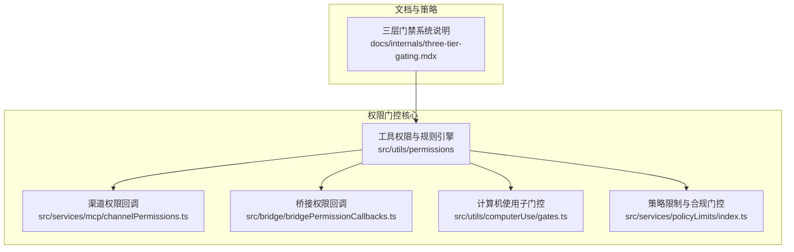

**图表来源**
- [permissions.ts:1-1487](file://src/utils/permissions/permissions.ts#L1-L1487)
- [channelPermissions.ts:1-241](file://src/services/mcp/channelPermissions.ts#L1-L241)
- [bridgePermissionCallbacks.ts:1-44](file://src/bridge/bridgePermissionCallbacks.ts#L1-L44)
- [gates.ts:1-73](file://src/utils/computerUse/gates.ts#L1-L73)
- [policyLimits/index.ts:497-549](file://src/services/policyLimits/index.ts#L497-L549)
- [three-tier-gating.mdx:1-29](file://docs/internals/three-tier-gating.mdx#L1-L29)

**章节来源**
- [permissions.ts:1-1487](file://src/utils/permissions/permissions.ts#L1-L1487)
- [channelPermissions.ts:1-241](file://src/services/mcp/channelPermissions.ts#L1-L241)
- [bridgePermissionCallbacks.ts:1-44](file://src/bridge/bridgePermissionCallbacks.ts#L1-L44)
- [gates.ts:1-73](file://src/utils/computerUse/gates.ts#L1-L73)
- [policyLimits/index.ts:497-549](file://src/services/policyLimits/index.ts#L497-L549)
- [three-tier-gating.mdx:1-29](file://docs/internals/three-tier-gating.mdx#L1-L29)

## 核心组件
- 工具权限与规则引擎：负责规则解析、匹配、决策、自动模式分类器、拒绝追踪、提示生成与持久化。
- 渠道权限：支持通过 Telegram/iMessage/Discord 等渠道进行授权回传，统一事件模型与短请求 ID。
- 桥接权限：桥接端发起/响应授权请求，支持取消、订阅响应。
- 计算机使用子门控：基于运行时配置与订阅等级的 UI/行为开关。
- 策略限制：面向合规场景的策略缓存与“缺省开/关”策略。

**章节来源**
- [permissions.ts:1-1487](file://src/utils/permissions/permissions.ts#L1-L1487)
- [PermissionUpdate.ts:1-390](file://src/utils/permissions/PermissionUpdate.ts#L1-L390)
- [PermissionRule.ts:1-41](file://src/utils/permissions/PermissionRule.ts#L1-L41)
- [channelPermissions.ts:1-241](file://src/services/mcp/channelPermissions.ts#L1-L241)
- [bridgePermissionCallbacks.ts:1-44](file://src/bridge/bridgePermissionCallbacks.ts#L1-L44)
- [gates.ts:1-73](file://src/utils/computerUse/gates.ts#L1-L73)
- [policyLimits/index.ts:497-549](file://src/services/policyLimits/index.ts#L497-L549)

## 架构总览
权限门控由“规则引擎 + 多通道授权 + 子门控 + 策略限制”构成，贯穿工具调用前的权限判定与授权回传，同时支持自动模式下的 AI 分类器辅助决策。

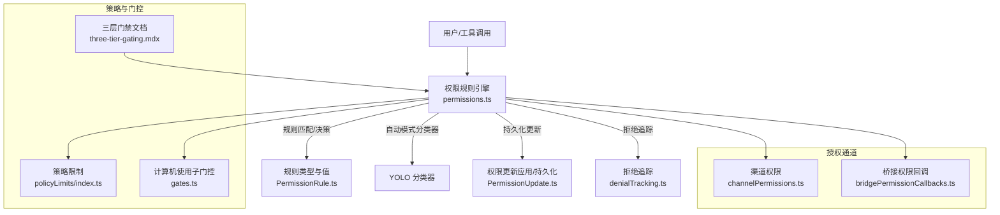

**图表来源**
- [permissions.ts:1-1487](file://src/utils/permissions/permissions.ts#L1-L1487)
- [PermissionRule.ts:1-41](file://src/utils/permissions/PermissionRule.ts#L1-L41)
- [PermissionUpdate.ts:1-390](file://src/utils/permissions/PermissionUpdate.ts#L1-L390)
- [denialTracking.ts:1-45](file://src/utils/permissions/denialTracking.ts#L1-L45)
- [channelPermissions.ts:1-241](file://src/services/mcp/channelPermissions.ts#L1-L241)
- [bridgePermissionCallbacks.ts:1-44](file://src/bridge/bridgePermissionCallbacks.ts#L1-L44)
- [policyLimits/index.ts:497-549](file://src/services/policyLimits/index.ts#L497-L549)
- [gates.ts:1-73](file://src/utils/computerUse/gates.ts#L1-L73)
- [three-tier-gating.mdx:1-29](file://docs/internals/three-tier-gating.mdx#L1-L29)

## 详细组件分析

### 规则引擎与授权决策
- 规则来源与优先级：支持多源规则（设置、命令行、会话等），按预设顺序合并与匹配。
- 规则类型：allow/deny/ask；工具级与内容级规则（如 Bash(prefix:*)）。
- 决策流程：先匹配允许/禁止规则，再处理“询问”规则；在特定模式下转换为拒绝或跳过提示。
- 自动模式：在满足条件时使用分类器快速决策，并记录拒绝次数以触发回退提示。
- 钩子与回退：异步代理/无界面场景可通过钩子提前决定，否则按“自动拒绝”处理。

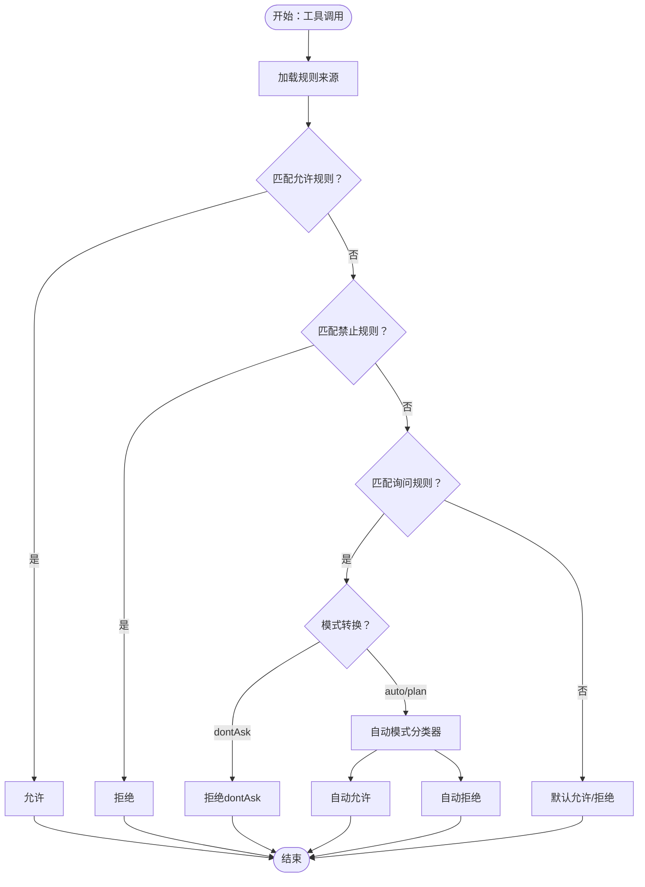

**图表来源**
- [permissions.ts:473-800](file://src/utils/permissions/permissions.ts#L473-L800)
- [permissions.ts:1-1487](file://src/utils/permissions/permissions.ts#L1-L1487)

**章节来源**
- [permissions.ts:1-1487](file://src/utils/permissions/permissions.ts#L1-L1487)

### 渠道权限（跨通道授权）
- 通道授权回传：服务器解析用户“yes tbxkq”回复并发出结构化事件，客户端据此解析并响应。
- 请求 ID 生成：基于工具 use ID 的稳定短 ID，避免敏感词与冲突。
- 客户端回调：维护挂起请求映射，首次到达即完成决议；支持订阅/取消订阅响应处理器。
- 条件筛选：仅对声明了相应能力的已连接客户端开放授权回传。

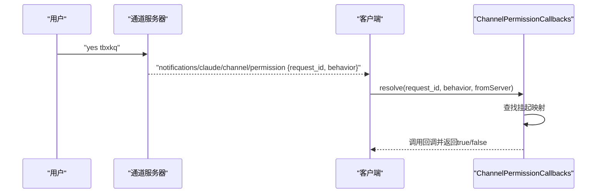

**图表来源**
- [channelPermissions.ts:1-241](file://src/services/mcp/channelPermissions.ts#L1-L241)

**章节来源**
- [channelPermissions.ts:1-241](file://src/services/mcp/channelPermissions.ts#L1-L241)

### 桥接权限回调
- 授权请求：sendRequest 发起请求，携带工具名、输入、描述、建议与阻断路径。
- 授权响应：sendResponse 返回 allow/deny，可附带更新后的输入与权限建议。
- 取消与订阅：cancelRequest 取消未决请求；onResponse 订阅响应并返回取消函数。

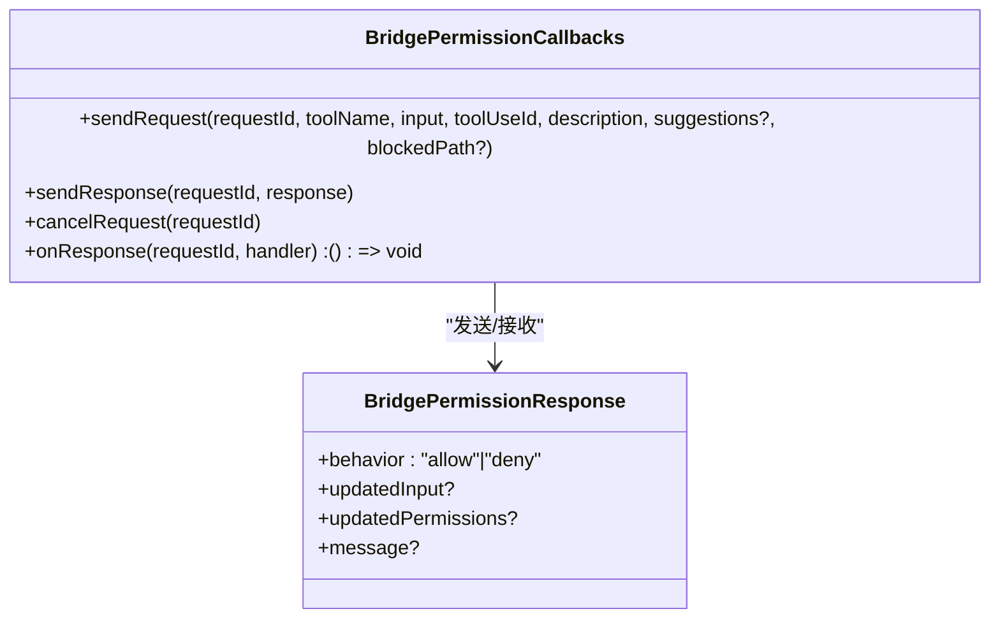

**图表来源**
- [bridgePermissionCallbacks.ts:1-44](file://src/bridge/bridgePermissionCallbacks.ts#L1-L44)

**章节来源**
- [bridgePermissionCallbacks.ts:1-44](file://src/bridge/bridgePermissionCallbacks.ts#L1-L44)

### 计算机使用子门控
- 配置来源：运行时动态配置与订阅等级组合，决定功能启用与子开关。
- 行为开关：像素校验、剪贴板粘贴、鼠标动画、隐藏动作前画面、自动目标显示、坐标模式冻结等。
- 访问控制：Ant 用户在特定开发环境下的豁免策略，避免误用。

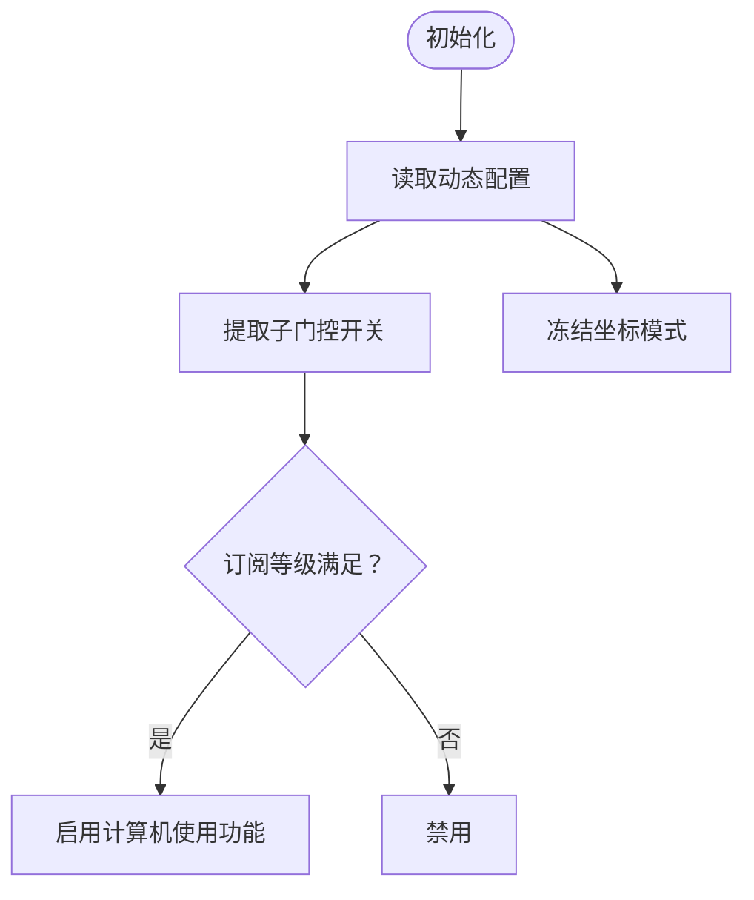

**图表来源**
- [gates.ts:1-73](file://src/utils/computerUse/gates.ts#L1-L73)

**章节来源**
- [gates.ts:1-73](file://src/utils/computerUse/gates.ts#L1-L73)

### 策略限制与合规门控
- 缺省策略：缓存不可用时对关键策略采用“缺省开/关”，确保合规场景下的安全边界。
- 会话缓存与文件缓存：优先会话缓存，其次磁盘缓存，最后回退到缺省策略。
- Essential traffic 仅模式：在特定模式下对关键策略在缓存缺失时强制拒绝。

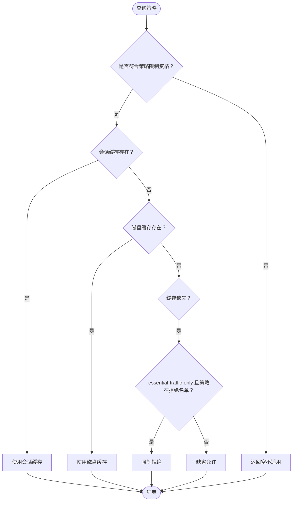

**图表来源**
- [policyLimits/index.ts:497-549](file://src/services/policyLimits/index.ts#L497-L549)

**章节来源**
- [policyLimits/index.ts:497-549](file://src/services/policyLimits/index.ts#L497-L549)

### 权限更新与持久化
- 更新类型：设置模式、添加/替换/移除规则、添加/移除工作目录。
- 应用与持久化：即时应用到上下文，可选择持久化到用户/项目/本地设置。
- 规则建议：针对目录生成只读规则建议，避免过度授权。

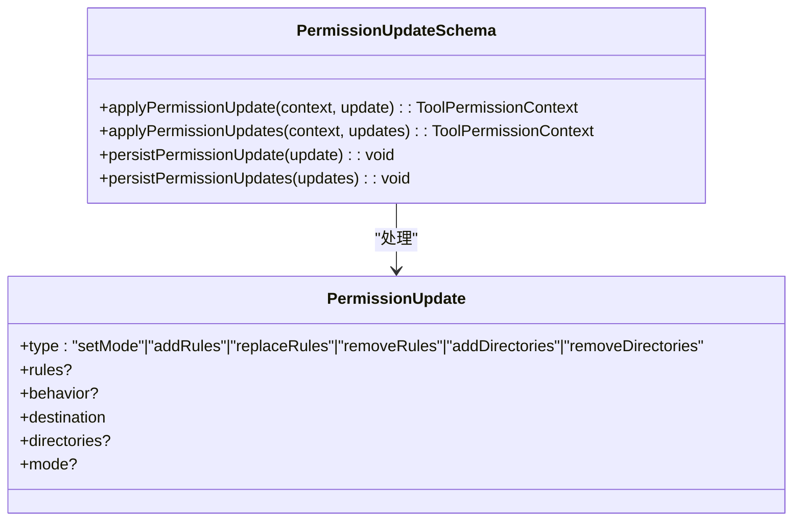

**图表来源**
- [PermissionUpdate.ts:1-390](file://src/utils/permissions/PermissionUpdate.ts#L1-L390)

**章节来源**
- [PermissionUpdate.ts:1-390](file://src/utils/permissions/PermissionUpdate.ts#L1-L390)

### 拒绝追踪与回退提示
- 连续拒绝与总拒绝计数：超过阈值后触发回退到“提示用户确认”。
- 成功重置：允许操作成功后清零连续拒绝计数。

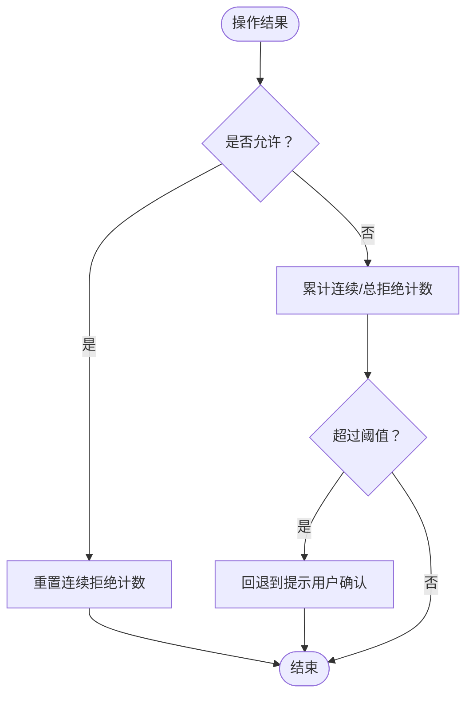

**图表来源**
- [denialTracking.ts:1-45](file://src/utils/permissions/denialTracking.ts#L1-L45)

**章节来源**
- [denialTracking.ts:1-45](file://src/utils/permissions/denialTracking.ts#L1-L45)

### 三层门禁系统
- 构建时 feature()：打包时宏展开，功能全有或全无。
- 运行时 GrowthBook：远程求值，按用户/设备/组织定向。
- 身份 USER_TYPE：构建时常量折叠，区分 ant 与 external。
- 决策流程：依次经过三层门禁，任一层拒绝即阻止。

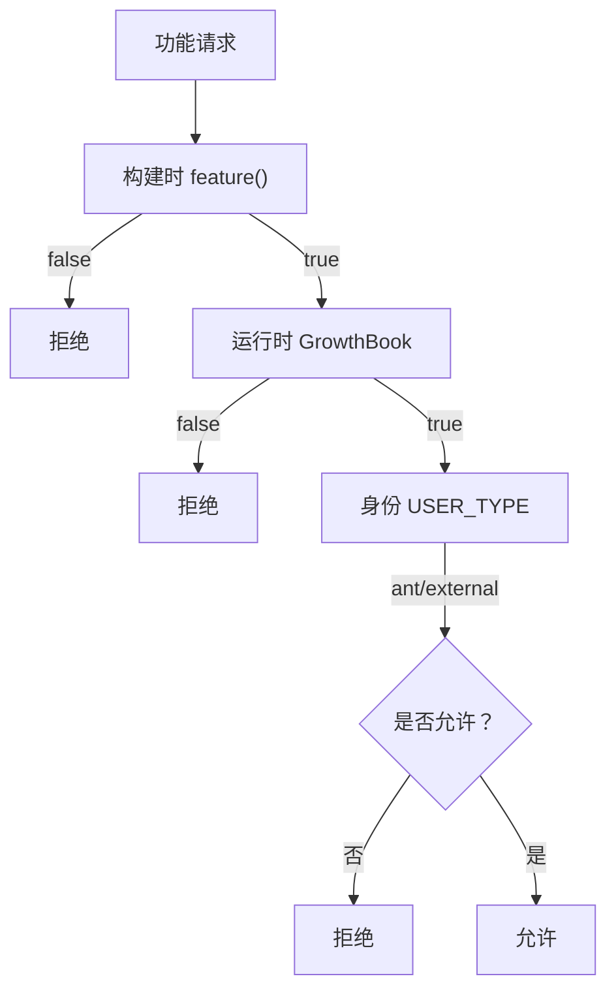

**图表来源**
- [three-tier-gating.mdx:1-29](file://docs/internals/three-tier-gating.mdx#L1-L29)

**章节来源**
- [three-tier-gating.mdx:1-29](file://docs/internals/three-tier-gating.mdx#L1-L29)

## 依赖关系分析
- 规则引擎依赖：动态配置、订阅信息、设置源、分类器模块、拒绝追踪、消息模板。
- 渠道与桥接：依赖统一的请求 ID 生成、事件解析与回调注册。
- 策略限制：依赖会话/文件缓存、合规模式判断。
- 性能缓存：通用 memoize 提供并发去重与刷新控制。

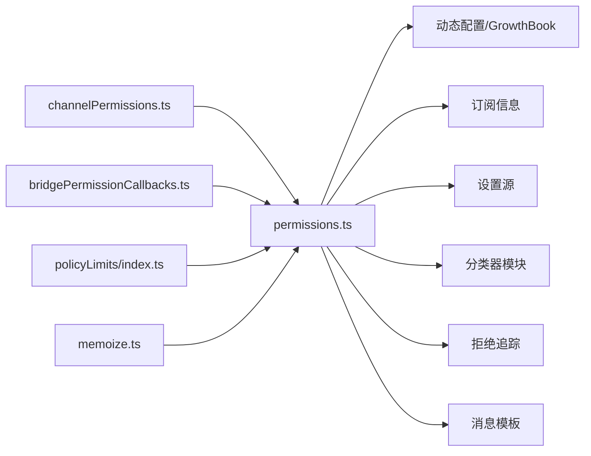

**图表来源**
- [permissions.ts:1-1487](file://src/utils/permissions/permissions.ts#L1-L1487)
- [channelPermissions.ts:1-241](file://src/services/mcp/channelPermissions.ts#L1-L241)
- [bridgePermissionCallbacks.ts:1-44](file://src/bridge/bridgePermissionCallbacks.ts#L1-L44)
- [policyLimits/index.ts:497-549](file://src/services/policyLimits/index.ts#L497-L549)
- [memoize.ts:134-172](file://src/utils/memoize.ts#L134-L172)

**章节来源**
- [permissions.ts:1-1487](file://src/utils/permissions/permissions.ts#L1-L1487)
- [channelPermissions.ts:1-241](file://src/services/mcp/channelPermissions.ts#L1-L241)
- [bridgePermissionCallbacks.ts:1-44](file://src/bridge/bridgePermissionCallbacks.ts#L1-L44)
- [policyLimits/index.ts:497-549](file://src/services/policyLimits/index.ts#L497-L549)
- [memoize.ts:134-172](file://src/utils/memoize.ts#L134-L172)

## 性能考量
- 并发去重与刷新：memoize 对重复参数共享缓存，避免重复计算；缓存过期时仅允许一次刷新。
- 自动模式优化：acceptEdits 快路径与安全工具白名单减少分类器调用；分类器成本纳入指标。
- 渠道授权：短 ID 生成与块名单避免冲突；事件解析在服务端完成，客户端仅做匹配。

**章节来源**
- [memoize.ts:134-172](file://src/utils/memoize.ts#L134-L172)
- [permissions.ts:600-800](file://src/utils/permissions/permissions.ts#L600-L800)
- [channelPermissions.ts:112-152](file://src/services/mcp/channelPermissions.ts#L112-L152)

## 故障排除指南
- 自动模式无法进入：检查分类器门禁与电路断路器状态；确认订阅等级与动态配置。
- 渠道授权无效：确认服务器已声明相应能力；检查请求 ID 是否正确、事件是否到达。
- 桥接授权未响应：检查回调订阅是否正确、请求是否被取消；查看响应类型断言。
- 持久化失败：确认目标设置源可写；检查规则字符串规范化与去重逻辑。
- 拒绝风暴：观察连续拒绝计数，必要时切换到“不要询问”模式或手动调整规则。

**章节来源**
- [permissions.ts:500-800](file://src/utils/permissions/permissions.ts#L500-L800)
- [channelPermissions.ts:209-241](file://src/services/mcp/channelPermissions.ts#L209-L241)
- [bridgePermissionCallbacks.ts:29-43](file://src/bridge/bridgePermissionCallbacks.ts#L29-L43)
- [PermissionUpdate.ts:222-353](file://src/utils/permissions/PermissionUpdate.ts#L222-L353)
- [denialTracking.ts:1-45](file://src/utils/permissions/denialTracking.ts#L1-L45)

## 结论
该权限门控系统通过“规则引擎 + 多通道授权 + 子门控 + 策略限制”的分层设计，在保证安全性的同时提供了灵活的策略与可观测性。自动模式与分类器结合提升了用户体验，而拒绝追踪与回退机制有效防止滥用。建议在生产中结合合规策略与监控指标持续优化。

## 附录

### 权限配置选项与规则定义
- 规则来源：用户设置、项目设置、本地设置、会话、命令行、命令。
- 规则类型：allow/deny/ask；支持工具级与内容级（如 Bash(prefix:*)）。
- 模式：default/dontAsk/auto/plan/bypassPermissions；bypassPermissions 受组织策略与设置限制。
- 目录权限：可为特定目录生成只读规则建议，避免过度授权。

**章节来源**
- [permissions.ts:109-121](file://src/utils/permissions/permissions.ts#L109-L121)
- [PermissionRule.ts:1-41](file://src/utils/permissions/PermissionRule.ts#L1-L41)
- [PermissionUpdate.ts:361-390](file://src/utils/permissions/PermissionUpdate.ts#L361-L390)
- [permissionSetup.ts:689-800](file://src/utils/permissions/permissionSetup.ts#L689-L800)

### 授权决策日志与审计
- 决策来源映射：会话临时授予、本地/用户永久授予、用户拒绝、配置等。
- 指标采集：分类器决策、令牌用量、延迟、成本估算、阶段化指标。

**章节来源**
- [toolExecution.ts:173-194](file://src/services/tools/toolExecution.ts#L173-L194)
- [permissions.ts:725-800](file://src/utils/permissions/permissions.ts#L725-L800)

### 实际配置示例（步骤说明）
- 设置默认模式：通过设置或命令行指定模式，系统按优先级选择。
- 添加规则：使用权限更新将规则添加到用户/项目/本地设置，支持批量替换与去重。
- 渠道授权：在支持的通道上启用授权回传，等待服务器事件到达并解析。
- 桥接授权：通过桥接回调发起请求，等待响应或取消。

**章节来源**
- [permissionSetup.ts:689-800](file://src/utils/permissions/permissionSetup.ts#L689-L800)
- [PermissionUpdate.ts:222-353](file://src/utils/permissions/PermissionUpdate.ts#L222-L353)
- [channelPermissions.ts:36-75](file://src/services/mcp/channelPermissions.ts#L36-L75)
- [bridgePermissionCallbacks.ts:10-27](file://src/bridge/bridgePermissionCallbacks.ts#L10-L27)