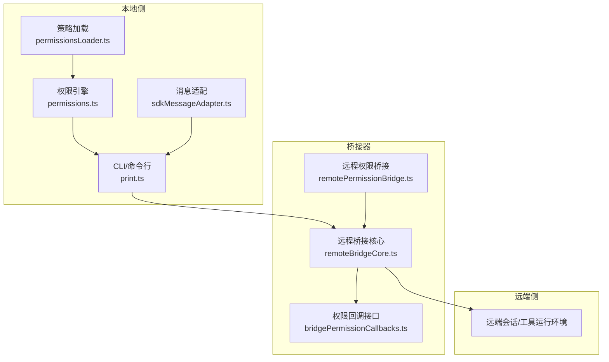
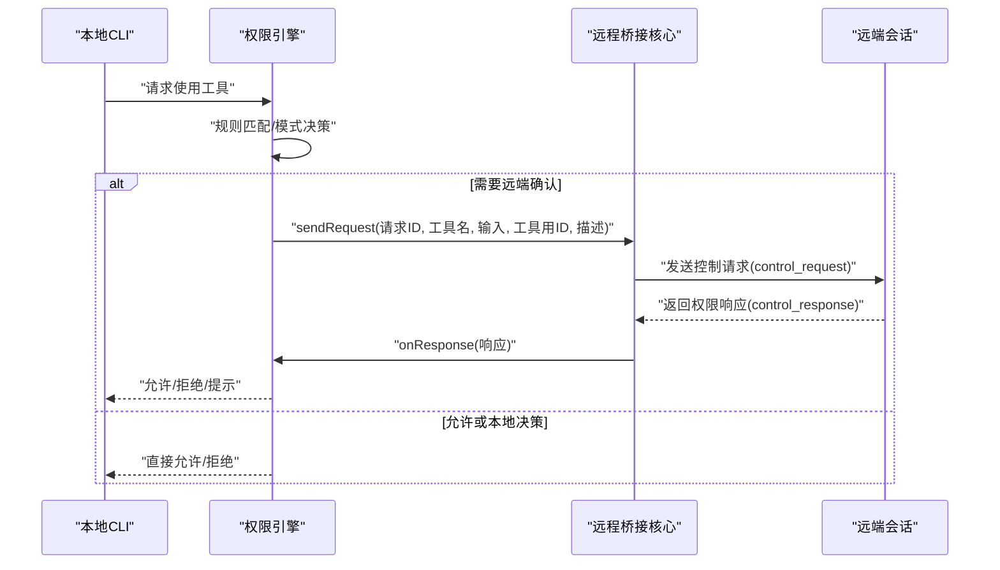
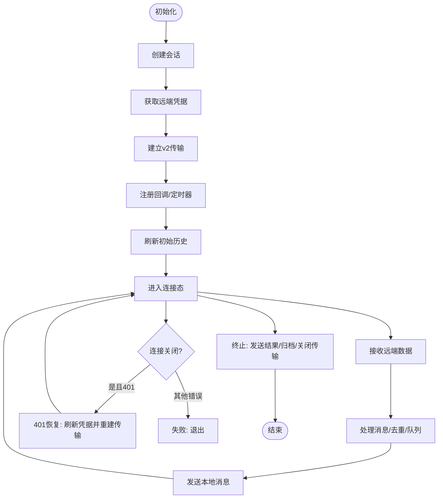
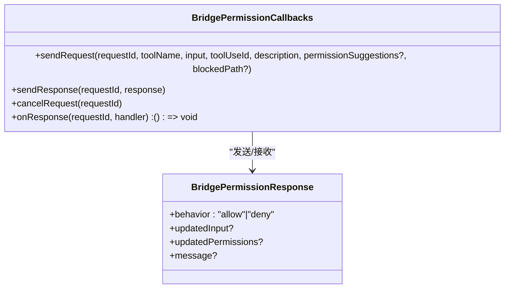
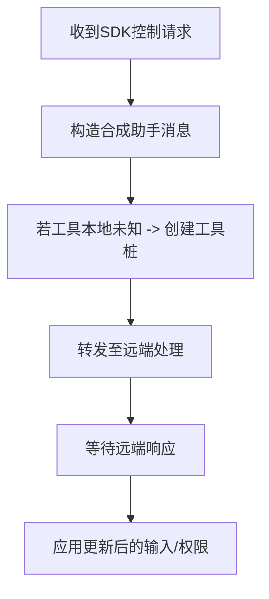
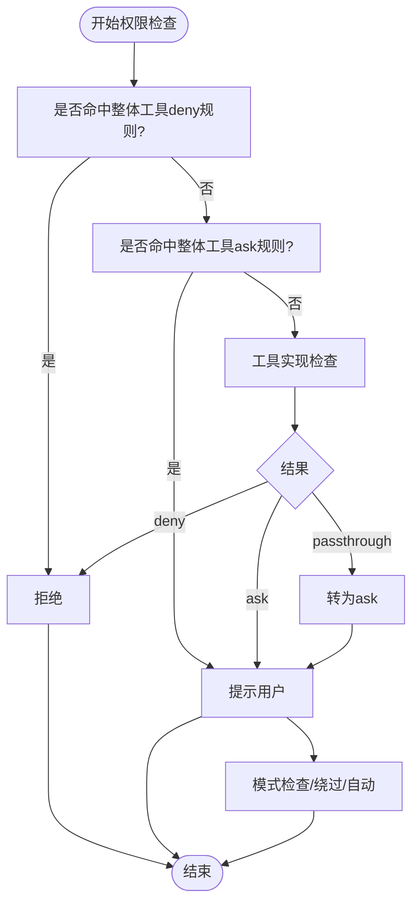
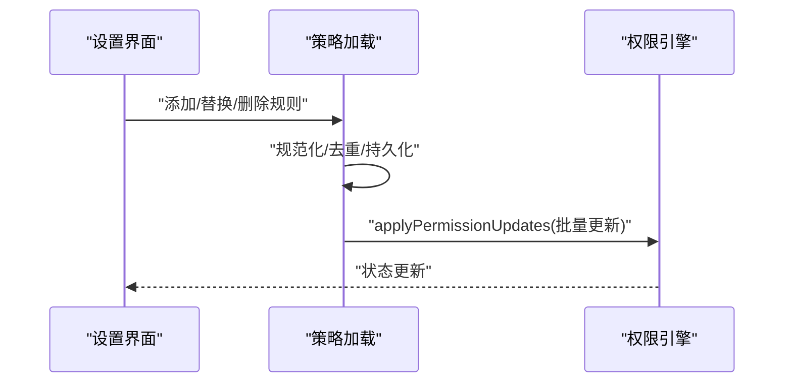
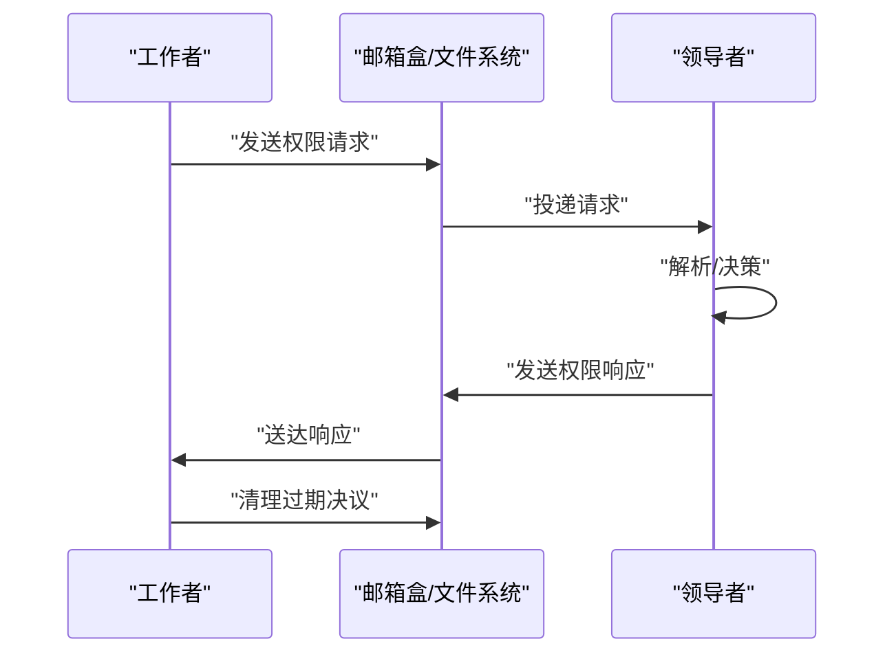
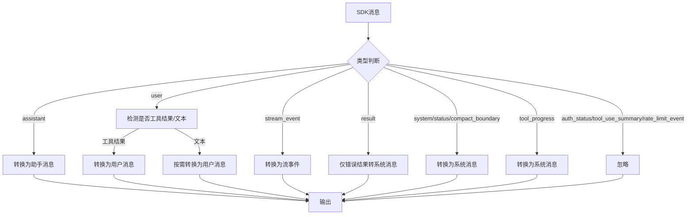
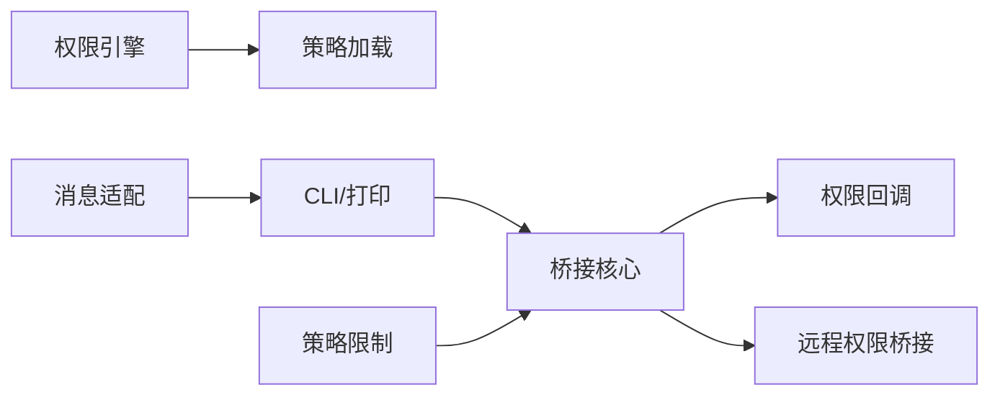

# 权限共享

<cite>
**本文引用的文件**
- [remotePermissionBridge.ts](file://src/remote/remotePermissionBridge.ts)
- [remoteBridgeCore.ts](file://src/bridge/remoteBridgeCore.ts)
- [bridgePermissionCallbacks.ts](file://src/bridge/bridgePermissionCallbacks.ts)
- [permissions.ts](file://src/utils/permissions/permissions.ts)
- [permissions.ts（类型）](file://src/types/permissions.ts)
- [permissionsLoader.ts](file://src/utils/permissions/permissionsLoader.ts)
- [permissionSync.ts](file://src/utils/swarm/permissionSync.ts)
- [sdkMessageAdapter.ts](file://src/remote/sdkMessageAdapter.ts)
- [index.ts（策略限制）](file://src/services/policyLimits/index.ts)
- [print.ts](file://src/cli/print.ts)
- [bridge.tsx](file://src/commands/bridge/bridge.tsx)
</cite>

## 目录
1. [简介](#简介)
2. [项目结构](#项目结构)
3. [核心组件](#核心组件)
4. [架构总览](#架构总览)
5. [详细组件分析](#详细组件分析)
6. [依赖关系分析](#依赖关系分析)
7. [性能考量](#性能考量)
8. [故障排查指南](#故障排查指南)
9. [结论](#结论)
10. [附录](#附录)

## 简介
本文件系统化阐述“权限共享”能力，聚焦于远程权限桥接器的设计原理与权限传递机制，覆盖权限验证、授权决策、访问控制策略、权限继承与角色映射、策略配置与动态更新、审计与合规、跨会话同步与一致性保障，并提供可操作的权限管理示例、安全最佳实践与风险控制建议。

## 项目结构
围绕权限共享的关键模块包括：
- 远程权限桥接：负责在本地与远端会话之间转发与协调权限请求与响应。
- 权限引擎：负责规则匹配、模式决策、分类器自动审批、钩子与工作目录等策略执行。
- 策略加载与同步：从多源设置加载规则，支持动态替换与增量更新；团队内权限请求通过邮箱盒或文件系统进行跨成员同步。
- 消息适配层：将 SDK 消息转换为本地消息格式，确保权限提示与状态正确渲染。
- 策略限制：组织级策略开关，如远程控制启用与否，影响桥接器可用性与行为。

图表来源
- [remoteBridgeCore.ts:140-256](file://src/bridge/remoteBridgeCore.ts#L140-L256)
- [bridgePermissionCallbacks.ts:10-27](file://src/bridge/bridgePermissionCallbacks.ts#L10-L27)
- [remotePermissionBridge.ts:1-79](file://src/remote/remotePermissionBridge.ts#L1-L79)
- [permissions.ts:473-1319](file://src/utils/permissions/permissions.ts#L473-L1319)
- [permissionsLoader.ts:120-133](file://src/utils/permissions/permissionsLoader.ts#L120-L133)
- [sdkMessageAdapter.ts:169-282](file://src/remote/sdkMessageAdapter.ts#L169-L282)

章节来源
- [remoteBridgeCore.ts:140-256](file://src/bridge/remoteBridgeCore.ts#L140-L256)
- [bridgePermissionCallbacks.ts:10-27](file://src/bridge/bridgePermissionCallbacks.ts#L10-L27)
- [remotePermissionBridge.ts:1-79](file://src/remote/remotePermissionBridge.ts#L1-L79)
- [permissions.ts:473-1319](file://src/utils/permissions/permissions.ts#L473-L1319)
- [permissionsLoader.ts:120-133](file://src/utils/permissions/permissionsLoader.ts#L120-L133)
- [sdkMessageAdapter.ts:169-282](file://src/remote/sdkMessageAdapter.ts#L169-L282)

## 核心组件
- 远程桥接核心（EnvLessBridge）：直接连接远端会话，建立 v2 传输通道，处理初始历史刷新、写入队列、认证恢复与重建、断连重连与超时诊断。
- 权限回调接口：定义权限请求/响应的发送、取消与监听契约，确保本地与远端对齐。
- 远程权限桥接：构造远端所需的合成消息与工具桩，屏蔽本地缺失工具带来的差异。
- 权限引擎：规则匹配、模式决策（默认/不询问/计划/绕过/自动）、分类器自动审批、钩子决策、工作目录与沙箱策略。
- 策略加载与同步：从多源设置加载规则，支持替换/追加/删除；团队内权限请求通过邮箱盒或文件系统同步。
- 消息适配：将 SDK 消息转换为本地消息，确保权限提示与状态正确渲染。
- 策略限制：组织级策略开关，如远程控制是否允许，影响桥接器初始化与后续行为。

章节来源
- [remoteBridgeCore.ts:140-256](file://src/bridge/remoteBridgeCore.ts#L140-L256)
- [bridgePermissionCallbacks.ts:10-27](file://src/bridge/bridgePermissionCallbacks.ts#L10-L27)
- [remotePermissionBridge.ts:1-79](file://src/remote/remotePermissionBridge.ts#L1-L79)
- [permissions.ts:473-1319](file://src/utils/permissions/permissions.ts#L473-L1319)
- [permissionsLoader.ts:120-133](file://src/utils/permissions/permissionsLoader.ts#L120-L133)
- [sdkMessageAdapter.ts:169-282](file://src/remote/sdkMessageAdapter.ts#L169-L282)
- [index.ts（策略限制）:510-526](file://src/services/policyLimits/index.ts#L510-L526)

## 架构总览
远程权限桥接器以“本地-桥接器-远端会话”三层协作实现权限共享：
- 本地侧：CLI/命令行触发工具调用，权限引擎根据规则与模式生成决策；必要时通过桥接器向远端发起权限请求。
- 桥接器：封装与远端的通信，负责消息去重、初始历史刷新、写入队列、认证恢复与重建、状态上报与诊断。
- 远端侧：执行工具调用，按需返回权限提示或结果，与本地保持一致的状态与上下文。

图表来源
- [remoteBridgeCore.ts:832-881](file://src/bridge/remoteBridgeCore.ts#L832-L881)
- [bridgePermissionCallbacks.ts:10-27](file://src/bridge/bridgePermissionCallbacks.ts#L10-L27)
- [permissions.ts:473-1319](file://src/utils/permissions/permissions.ts#L473-L1319)

章节来源
- [remoteBridgeCore.ts:832-881](file://src/bridge/remoteBridgeCore.ts#L832-L881)
- [bridgePermissionCallbacks.ts:10-27](file://src/bridge/bridgePermissionCallbacks.ts#L10-L27)
- [permissions.ts:473-1319](file://src/utils/permissions/permissions.ts#L473-L1319)

## 详细组件分析

### 组件A：远程桥接核心（EnvLessBridge）
- 设计要点
  - 去环境层设计：跳过环境 API 层，直接通过会话入口与远端建立连接，减少中间环节。
  - v2 传输：基于 SSE + CCR 客户端，支持心跳、序列号与断线重连；epoch 变更用于防止旧传输继续写入导致 409。
  - 初始历史刷新：在握手阶段批量刷新历史事件，保证远端上下文一致。
  - 写入队列：在刷新期间排队写入，避免消息丢失与顺序错乱。
  - 认证恢复：支持主动刷新与 401 自动恢复，重建传输并保持序列号连续。
- 关键流程
  - 初始化：创建会话、获取远端凭据、建立传输、注册回调、启动刷新与定时器。
  - 数据流：接收远端消息，解析为本地消息；发送本地消息，带去重与队列控制。
  - 终止：发送结果消息、归档会话、关闭传输、清理资源。
- 错误与恢复
  - 401：刷新 OAuth 后重建传输，避免 epoch 不一致。
  - 连接超时：记录诊断事件，便于定位网络问题。
  - 传输重建：保持序列号与写入队列，确保一致性。

图表来源
- [remoteBridgeCore.ts:140-256](file://src/bridge/remoteBridgeCore.ts#L140-L256)
- [remoteBridgeCore.ts:380-527](file://src/bridge/remoteBridgeCore.ts#L380-L527)
- [remoteBridgeCore.ts:664-745](file://src/bridge/remoteBridgeCore.ts#L664-L745)

章节来源
- [remoteBridgeCore.ts:140-256](file://src/bridge/remoteBridgeCore.ts#L140-L256)
- [remoteBridgeCore.ts:380-527](file://src/bridge/remoteBridgeCore.ts#L380-L527)
- [remoteBridgeCore.ts:664-745](file://src/bridge/remoteBridgeCore.ts#L664-L745)

### 组件B：权限回调接口（BridgePermissionCallbacks）
- 职责
  - 发送权限请求到远端，携带工具名、输入、工具用 ID、描述、建议与阻断路径。
  - 接收远端响应（允许/拒绝），支持取消未决请求。
  - 类型守卫校验响应结构，避免不安全类型转换。
- 交互
  - 本地权限引擎在需要远端确认时调用 sendRequest。
  - 远端完成决策后通过 sendResponse 返回，本地回调处理并继续流程。

图表来源
- [bridgePermissionCallbacks.ts:10-27](file://src/bridge/bridgePermissionCallbacks.ts#L10-L27)
- [bridgePermissionCallbacks.ts:32-40](file://src/bridge/bridgePermissionCallbacks.ts#L32-L40)

章节来源
- [bridgePermissionCallbacks.ts:10-27](file://src/bridge/bridgePermissionCallbacks.ts#L10-L27)
- [bridgePermissionCallbacks.ts:32-40](file://src/bridge/bridgePermissionCallbacks.ts#L32-L40)

### 组件C：远程权限桥接（remotePermissionBridge）
- 合成消息：为远端权限请求构造合成的助手消息，使远端能识别工具使用场景。
- 工具桩：当远端存在本地未知工具时，创建最小工具桩，路由到回退权限请求，避免阻塞。

图表来源
- [remotePermissionBridge.ts:12-46](file://src/remote/remotePermissionBridge.ts#L12-L46)
- [remotePermissionBridge.ts:53-78](file://src/remote/remotePermissionBridge.ts#L53-L78)

章节来源
- [remotePermissionBridge.ts:12-46](file://src/remote/remotePermissionBridge.ts#L12-L46)
- [remotePermissionBridge.ts:53-78](file://src/remote/remotePermissionBridge.ts#L53-L78)

### 组件D：权限引擎（规则/模式/分类器）
- 规则匹配：按来源（用户/项目/本地/标志/策略/命令/会话）聚合 allow/deny/ask 规则，支持工具级与内容级匹配。
- 模式决策：默认、不询问、计划、绕过、自动/泡泡模式等，自动模式结合分类器进行非阻塞审批。
- 分类器：YOLO 分类器对动作进行快速评估，支持失败闭合/开路策略与限额触发回退提示。
- 钩子与工作目录：支持异步代理场景的权限请求钩子，以及额外工作目录范围控制。
- 动态更新：支持添加/替换/删除规则，持久化到对应设置源，实时生效。

图表来源
- [permissions.ts:1071-1156](file://src/utils/permissions/permissions.ts#L1071-L1156)
- [permissions.ts:1158-1319](file://src/utils/permissions/permissions.ts#L1158-L1319)
- [permissions.ts（类型）:44-80](file://src/types/permissions.ts#L44-L80)

章节来源
- [permissions.ts:1071-1156](file://src/utils/permissions/permissions.ts#L1071-L1156)
- [permissions.ts:1158-1319](file://src/utils/permissions/permissions.ts#L1158-L1319)
- [permissions.ts（类型）:44-80](file://src/types/permissions.ts#L44-L80)

### 组件E：策略加载与动态更新
- 多源加载：支持策略设置仅受管理设置约束，或从用户/项目/本地/标志/命令/会话等多源加载。
- 替换/追加/删除：提供统一的更新接口，确保规则变更原子性与幂等性。
- 同步策略：在规则变更时清理旧规则集合，再应用新规则，避免残留。

图表来源
- [permissionsLoader.ts:120-133](file://src/utils/permissions/permissionsLoader.ts#L120-L133)
- [permissionsLoader.ts:229-296](file://src/utils/permissions/permissionsLoader.ts#L229-L296)
- [permissions.ts:1408-1471](file://src/utils/permissions/permissions.ts#L1408-L1471)

章节来源
- [permissionsLoader.ts:120-133](file://src/utils/permissions/permissionsLoader.ts#L120-L133)
- [permissionsLoader.ts:229-296](file://src/utils/permissions/permissionsLoader.ts#L229-L296)
- [permissions.ts:1408-1471](file://src/utils/permissions/permissions.ts#L1408-L1471)

### 组件F：跨会话权限同步与冲突解决
- 请求/响应模型：通过邮箱盒或文件系统在团队成员间传递权限请求与决议，支持锁文件与清理策略。
- 冲突解决：采用唯一请求 ID 与锁定机制，确保同一请求只被一个领导者处理；清理过期决议，避免堆积。
- 一致性保障：请求/决议文件命名规范，读取/写入严格校验，失败重试与错误日志记录。

图表来源
- [permissionSync.ts:360-443](file://src/utils/swarm/permissionSync.ts#L360-L443)
- [permissionSync.ts:734-783](file://src/utils/swarm/permissionSync.ts#L734-L783)

章节来源
- [permissionSync.ts:360-443](file://src/utils/swarm/permissionSync.ts#L360-L443)
- [permissionSync.ts:734-783](file://src/utils/swarm/permissionSync.ts#L734-L783)

### 组件G：消息适配与渲染
- SDK 消息到本地消息的转换：处理助手消息、流事件、结果消息、系统消息、工具进度与压缩边界等。
- 用户消息处理：区分工具结果与文本消息，按需转换为本地用户消息，确保渲染一致性。
- 忽略与诊断：忽略不支持或 SDK 专用的消息类型，并记录调试日志。

图表来源
- [sdkMessageAdapter.ts:169-282](file://src/remote/sdkMessageAdapter.ts#L169-L282)

章节来源
- [sdkMessageAdapter.ts:169-282](file://src/remote/sdkMessageAdapter.ts#L169-L282)

## 依赖关系分析
- 组件耦合
  - 权限引擎依赖策略加载模块以获取规则上下文；桥接器依赖权限回调接口与远程权限桥接。
  - 消息适配层独立于权限引擎，但与桥接器共同决定 UI 渲染与提示显示。
- 外部依赖
  - 组织策略限制模块影响桥接器初始化前置条件（如远程控制开关）。
  - CLI 打印模块负责将桥接器事件转发给 SDK 控制请求/响应，维持本地与远端的一致性。

图表来源
- [permissions.ts:473-1319](file://src/utils/permissions/permissions.ts#L473-L1319)
- [permissionsLoader.ts:120-133](file://src/utils/permissions/permissionsLoader.ts#L120-L133)
- [remoteBridgeCore.ts:140-256](file://src/bridge/remoteBridgeCore.ts#L140-L256)
- [bridgePermissionCallbacks.ts:10-27](file://src/bridge/bridgePermissionCallbacks.ts#L10-L27)
- [remotePermissionBridge.ts:1-79](file://src/remote/remotePermissionBridge.ts#L1-L79)
- [sdkMessageAdapter.ts:169-282](file://src/remote/sdkMessageAdapter.ts#L169-L282)
- [print.ts:3983-3990](file://src/cli/print.ts#L3983-L3990)
- [index.ts（策略限制）:510-526](file://src/services/policyLimits/index.ts#L510-L526)

章节来源
- [permissions.ts:473-1319](file://src/utils/permissions/permissions.ts#L473-L1319)
- [permissionsLoader.ts:120-133](file://src/utils/permissions/permissionsLoader.ts#L120-L133)
- [remoteBridgeCore.ts:140-256](file://src/bridge/remoteBridgeCore.ts#L140-L256)
- [bridgePermissionCallbacks.ts:10-27](file://src/bridge/bridgePermissionCallbacks.ts#L10-L27)
- [remotePermissionBridge.ts:1-79](file://src/remote/remotePermissionBridge.ts#L1-L79)
- [sdkMessageAdapter.ts:169-282](file://src/remote/sdkMessageAdapter.ts#L169-L282)
- [print.ts:3983-3990](file://src/cli/print.ts#L3983-L3990)
- [index.ts（策略限制）:510-526](file://src/services/policyLimits/index.ts#L510-L526)

## 性能考量
- 写入队列与历史刷新：在握手阶段批量刷新历史，避免后续写入竞争与重复传输，提升吞吐与一致性。
- 主动刷新与 401 恢复：提前刷新凭据，降低 401 风险；401 时快速重建传输，减少停顿。
- 分类器成本控制：自动模式下优先使用快速路径（如 acceptEdits 允许、安全工具白名单），避免不必要的分类器调用。
- 诊断与可观测：连接超时、重建、归档状态均有事件记录，便于定位性能瓶颈与异常。

## 故障排查指南
- 远程控制不可用
  - 检查组织策略限制是否允许远程控制；若禁用，桥接器初始化会失败。
- 401/凭据过期
  - 观察桥接器是否自动恢复；若失败，检查 OAuth 刷新逻辑与凭据有效性。
- 传输重建与消息丢失
  - 确认写入队列是否开启；重建期间应保持序列号连续，避免旧传输继续写入。
- 权限提示未出现
  - 检查 CLI 是否正确转发控制请求/取消；确认权限引擎是否处于“提示”分支。
- 团队权限同步异常
  - 检查邮箱盒/文件系统权限、锁文件是否存在、过期决议清理任务是否运行。

章节来源
- [bridge.tsx:467-480](file://src/commands/bridge/bridge.tsx#L467-L480)
- [remoteBridgeCore.ts:530-590](file://src/bridge/remoteBridgeCore.ts#L530-L590)
- [remoteBridgeCore.ts:477-527](file://src/bridge/remoteBridgeCore.ts#L477-L527)
- [print.ts:3983-3990](file://src/cli/print.ts#L3983-L3990)
- [permissionSync.ts:452-475](file://src/utils/swarm/permissionSync.ts#L452-L475)

## 结论
权限共享通过“远程桥接器 + 权限引擎 + 策略加载 + 跨会话同步”的协同，实现了本地与远端在权限决策上的无缝衔接。其设计强调一致性、可观测与可恢复性，既满足企业合规与安全要求，又兼顾用户体验与自动化效率。建议在生产环境中结合策略限制、审计日志与定期清理机制，持续优化权限策略与同步流程。

## 附录
- 权限模式与行为
  - 模式：默认、不询问、计划、绕过、自动、泡泡。
  - 行为：允许、拒绝、提示、透传。
- 规则来源
  - 用户设置、项目设置、本地设置、标志设置、策略设置、命令行参数、会话。
- 示例场景
  - 自动模式下对安全工具快速放行；敏感路径触发分类器评估；团队成员通过邮箱盒协商权限。

章节来源
- [permissions.ts（类型）:16-38](file://src/types/permissions.ts#L16-L38)
- [permissions.ts（类型）:44-80](file://src/types/permissions.ts#L44-L80)
- [permissions.ts（类型）:54-63](file://src/types/permissions.ts#L54-L63)