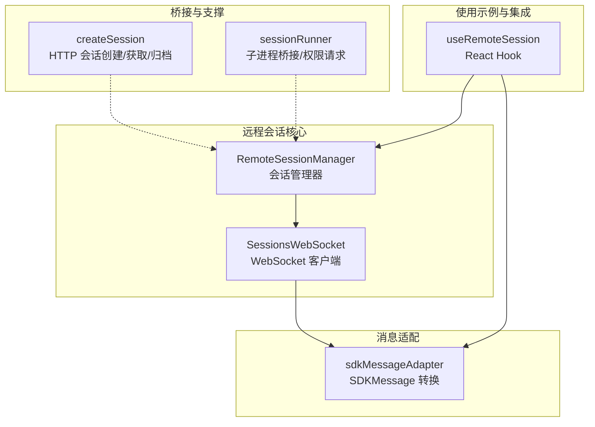
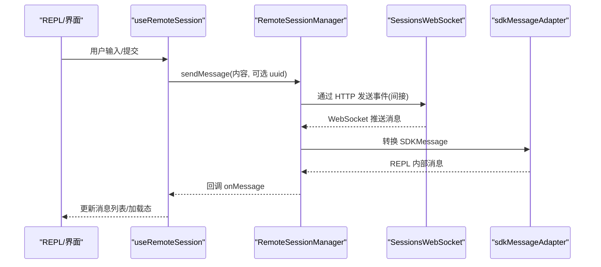
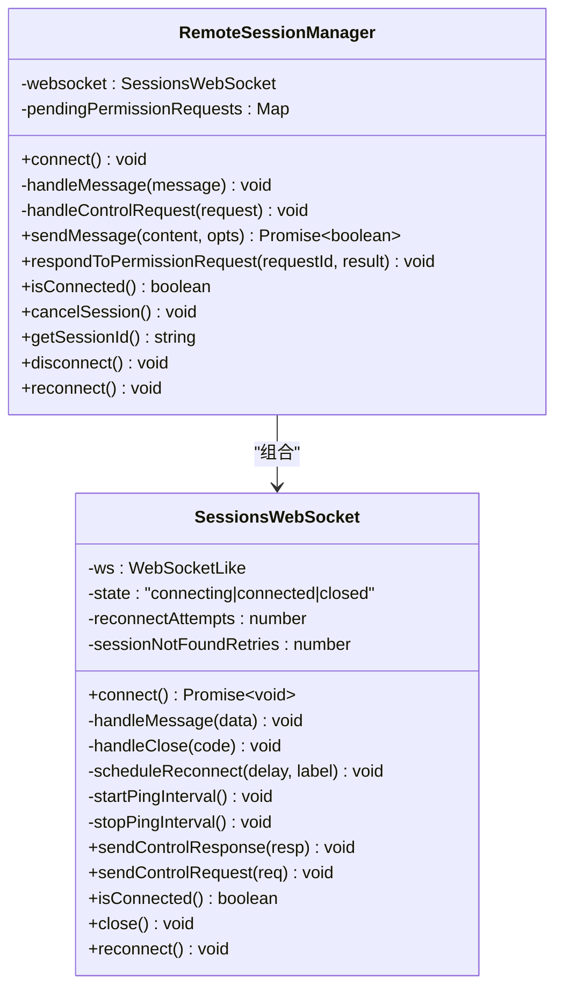
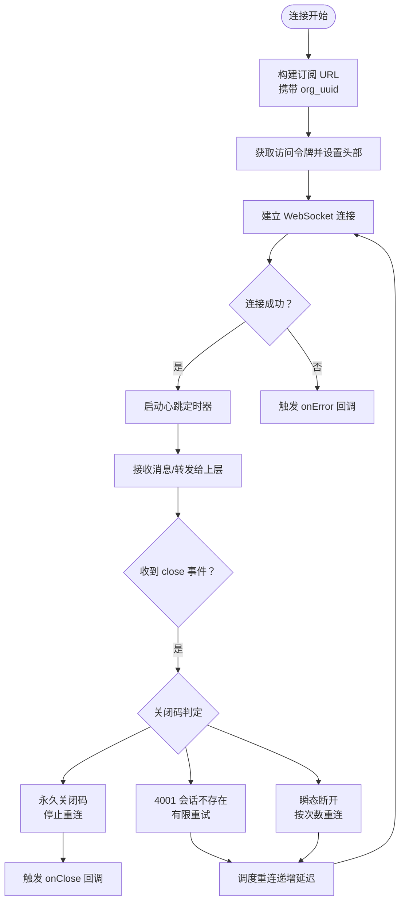
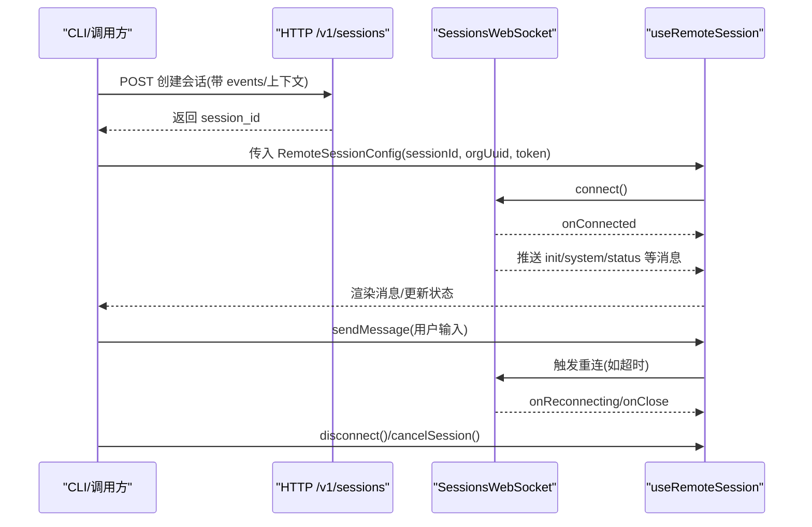
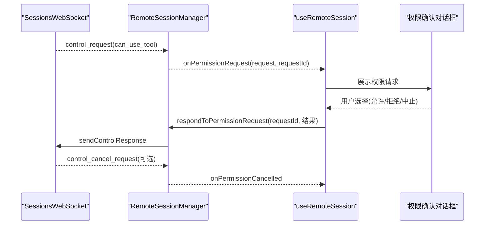
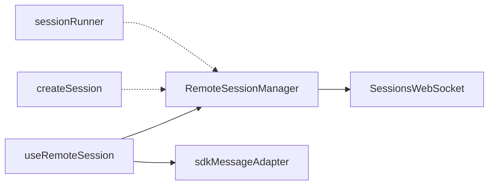

# 远程会话管理

<cite>
**本文引用的文件**
- [RemoteSessionManager.ts](file://src/remote/RemoteSessionManager.ts)
- [SessionsWebSocket.ts](file://src/remote/SessionsWebSocket.ts)
- [sdkMessageAdapter.ts](file://src/remote/sdkMessageAdapter.ts)
- [useRemoteSession.ts](file://src/hooks/useRemoteSession.ts)
- [createSession.ts](file://src/bridge/createSession.ts)
- [sessionRunner.ts](file://src/bridge/sessionRunner.ts)
</cite>

## 目录
1. [简介](#简介)
2. [项目结构](#项目结构)
3. [核心组件](#核心组件)
4. [架构总览](#架构总览)
5. [详细组件分析](#详细组件分析)
6. [依赖关系分析](#依赖关系分析)
7. [性能与资源管理](#性能与资源管理)
8. [故障排查指南](#故障排查指南)
9. [结论](#结论)
10. [附录：会话生命周期与操作流程](#附录会话生命周期与操作流程)

## 简介
本文件系统性阐述远程会话管理系统的设计与实现，重点覆盖以下方面：
- RemoteSessionManager 的架构设计与会话生命周期管理
- SessionsWebSocket 的实时通信机制、连接建立与维护策略
- 会话状态同步、心跳检测与断线重连机制
- 会话创建、加入、退出的完整流程
- 会话配置选项、超时设置与资源管理
- 多会话并发处理、内存优化与性能监控
- 实际的会话管理示例与常见问题解决方案

## 项目结构
远程会话管理相关代码主要分布在以下模块：
- 远程会话核心：RemoteSessionManager、SessionsWebSocket
- 消息适配层：sdkMessageAdapter（将 SDKMessage 转换为 REPL 内部消息）
- 使用示例与集成：useRemoteSession（React Hook，封装远程会话交互）
- 桥接与会话生命周期支撑：createSession（HTTP 创建/获取/归档）、sessionRunner（子进程桥接与权限请求）

**图表来源**
- [RemoteSessionManager.ts:95-325](file://src/remote/RemoteSessionManager.ts#L95-L325)
- [SessionsWebSocket.ts:82-404](file://src/remote/SessionsWebSocket.ts#L82-L404)
- [sdkMessageAdapter.ts:169-282](file://src/remote/sdkMessageAdapter.ts#L169-L282)
- [useRemoteSession.ts:86-607](file://src/hooks/useRemoteSession.ts#L86-L607)
- [createSession.ts:34-180](file://src/bridge/createSession.ts#L34-L180)
- [sessionRunner.ts:248-547](file://src/bridge/sessionRunner.ts#L248-L547)

**章节来源**
- [RemoteSessionManager.ts:1-345](file://src/remote/RemoteSessionManager.ts#L1-L345)
- [SessionsWebSocket.ts:1-405](file://src/remote/SessionsWebSocket.ts#L1-L405)
- [sdkMessageAdapter.ts:1-307](file://src/remote/sdkMessageAdapter.ts#L1-L307)
- [useRemoteSession.ts:1-608](file://src/hooks/useRemoteSession.ts#L1-L608)
- [createSession.ts:1-385](file://src/bridge/createSession.ts#L1-L385)
- [sessionRunner.ts:1-551](file://src/bridge/sessionRunner.ts#L1-L551)

## 核心组件
- RemoteSessionManager
  - 职责：协调 WebSocket 订阅、HTTP 发送用户消息、权限请求/响应流
  - 关键能力：连接/断开、发送消息、权限决策、中断请求、强制重连
- SessionsWebSocket
  - 职责：建立/维护 WebSocket 连接、心跳、解析消息、断线重连策略
  - 关键能力：认证头、ping 心跳、错误/关闭事件处理、重连调度
- sdkMessageAdapter
  - 职责：将 SDKMessage 转换为 REPL 内部消息类型，过滤/忽略不支持的消息
- useRemoteSession
  - 职责：在 React 中封装远程会话交互，包括消息转换、权限队列、超时检测、断线重连
- createSession / sessionRunner
  - 职责：通过 HTTP 创建/获取/归档会话；桥接子进程，处理权限请求与活动日志

**章节来源**
- [RemoteSessionManager.ts:95-325](file://src/remote/RemoteSessionManager.ts#L95-L325)
- [SessionsWebSocket.ts:82-404](file://src/remote/SessionsWebSocket.ts#L82-L404)
- [sdkMessageAdapter.ts:169-282](file://src/remote/sdkMessageAdapter.ts#L169-L282)
- [useRemoteSession.ts:86-607](file://src/hooks/useRemoteSession.ts#L86-L607)
- [createSession.ts:34-180](file://src/bridge/createSession.ts#L34-L180)
- [sessionRunner.ts:248-547](file://src/bridge/sessionRunner.ts#L248-L547)

## 架构总览
远程会话管理采用“管理器 + 传输层 + 适配层”的分层设计：
- RemoteSessionManager 作为高层协调者，负责权限流、消息转发与生命周期控制
- SessionsWebSocket 提供稳定的底层传输，内置心跳与断线重连
- sdkMessageAdapter 将后端 SDKMessage 映射为 UI 可渲染的消息
- useRemoteSession 将上述能力整合到 React 应用中，提供统一的会话体验

**图表来源**
- [useRemoteSession.ts:474-568](file://src/hooks/useRemoteSession.ts#L474-L568)
- [RemoteSessionManager.ts:220-243](file://src/remote/RemoteSessionManager.ts#L220-L243)
- [sdkMessageAdapter.ts:169-282](file://src/remote/sdkMessageAdapter.ts#L169-L282)

## 详细组件分析

### RemoteSessionManager 分析
- 设计要点
  - 以回调接口解耦 UI 与传输细节，便于扩展与测试
  - 对 SDKMessage 与控制消息进行类型守卫，确保安全转发
  - 权限请求采用 request_id 管理，支持取消与响应
- 生命周期
  - connect：初始化 SessionsWebSocket 并发起连接
  - handleMessage：分发控制/权限/SDK 消息
  - sendMessage：通过 HTTP 发送用户消息（事件包装）
  - respondToPermissionRequest：构造并发送控制响应
  - cancelSession：发送中断请求
  - reconnect/disconnect：强制重连或断开连接
- 错误与可观测性
  - onConnected/onDisconnected/onReconnecting/onError 回调用于状态反馈
  - 日志记录关键事件，便于调试

**图表来源**
- [RemoteSessionManager.ts:95-325](file://src/remote/RemoteSessionManager.ts#L95-L325)
- [SessionsWebSocket.ts:82-404](file://src/remote/SessionsWebSocket.ts#L82-L404)

**章节来源**
- [RemoteSessionManager.ts:95-325](file://src/remote/RemoteSessionManager.ts#L95-L325)

### SessionsWebSocket 分析
- 连接与认证
  - 基于组织维度的订阅 URL，使用 Bearer Token 与固定版本头进行认证
  - 支持浏览器原生 WebSocket 与 Node 的 ws 包，统一事件模型
- 心跳与保活
  - 定期 ping，异常时由关闭处理器接管重连
- 断线重连策略
  - 针对不同关闭码采取不同策略：永久关闭直接终止；4001（会话不存在）有限重试窗口；其他连接态断开按指数退避尝试
  - onReconnecting 在瞬态断开时触发，onClose 仅在最终失败时触发
- 控制消息
  - sendControlRequest/sendControlResponse 支持中断与权限响应等控制流

**图表来源**
- [SessionsWebSocket.ts:100-205](file://src/remote/SessionsWebSocket.ts#L100-L205)
- [SessionsWebSocket.ts:234-288](file://src/remote/SessionsWebSocket.ts#L234-L288)
- [SessionsWebSocket.ts:290-299](file://src/remote/SessionsWebSocket.ts#L290-L299)

**章节来源**
- [SessionsWebSocket.ts:82-404](file://src/remote/SessionsWebSocket.ts#L82-L404)

### 会话状态同步、心跳与断线重连
- 状态同步
  - 通过 onMessage 回调将 SDKMessage 转换为内部消息，驱动 UI 更新
  - echo 过滤：使用 BoundedUUIDSet 记录本地发送的 uuid，避免重复显示
- 心跳检测
  - WebSocket 层：定期 ping，异常由关闭处理器接管
  - 应用层：响应超时检测（普通会话 60 秒，压缩期间 180 秒），超时自动触发重连
- 断线重连
  - SessionsWebSocket：按策略重连，onReconnecting 通知 UI
  - useRemoteSession：超时触发 manager.reconnect()

**章节来源**
- [useRemoteSession.ts:177-191](file://src/hooks/useRemoteSession.ts#L177-L191)
- [useRemoteSession.ts:544-562](file://src/hooks/useRemoteSession.ts#L544-L562)
- [SessionsWebSocket.ts:301-313](file://src/remote/SessionsWebSocket.ts#L301-L313)

### 会话创建、加入、退出流程
- 创建会话（HTTP）
  - 通过 createBridgeSession 向 /v1/sessions 发起 POST，返回 session_id
  - 可选注入 git 源与 outcomes 上下文、权限模式等
- 加入会话（WebSocket）
  - useRemoteSession 初始化 RemoteSessionManager，connect 建立订阅
  - 接收 init/system/status 等消息，提取可用命令、任务状态等
- 退出会话
  - sendMessage 结束后，可调用 cancelSession 或 disconnect
  - 归档：通过 createBridgeSession 的 archive 接口进行归档（最佳努力）

**图表来源**
- [createSession.ts:34-180](file://src/bridge/createSession.ts#L34-L180)
- [useRemoteSession.ts:146-471](file://src/hooks/useRemoteSession.ts#L146-L471)
- [SessionsWebSocket.ts:100-205](file://src/remote/SessionsWebSocket.ts#L100-L205)

**章节来源**
- [createSession.ts:34-180](file://src/bridge/createSession.ts#L34-L180)
- [useRemoteSession.ts:146-471](file://src/hooks/useRemoteSession.ts#L146-L471)

### 权限请求与响应
- RemoteSessionManager
  - 接收 control_request（can_use_tool），缓存 request_id，回调 UI 显示确认
  - 支持 onPermissionCancelled（服务器取消）与 respondToPermissionRequest（允许/拒绝）
- useRemoteSession
  - 将权限请求转换为 UI 队列项，支持允许、拒绝、中止
  - 允许时将更新后的输入回传给 RemoteSessionManager

**图表来源**
- [RemoteSessionManager.ts:189-215](file://src/remote/RemoteSessionManager.ts#L189-L215)
- [RemoteSessionManager.ts:248-283](file://src/remote/RemoteSessionManager.ts#L248-L283)
- [useRemoteSession.ts:332-408](file://src/hooks/useRemoteSession.ts#L332-L408)

**章节来源**
- [RemoteSessionManager.ts:189-283](file://src/remote/RemoteSessionManager.ts#L189-L283)
- [useRemoteSession.ts:332-408](file://src/hooks/useRemoteSession.ts#L332-L408)

## 依赖关系分析
- RemoteSessionManager 依赖 SessionsWebSocket 与消息适配层
- useRemoteSession 依赖 RemoteSessionManager 与 sdkMessageAdapter
- createSession 与 sessionRunner 为会话创建/运行提供支撑，与 RemoteSessionManager 解耦

**图表来源**
- [useRemoteSession.ts:86-607](file://src/hooks/useRemoteSession.ts#L86-L607)
- [RemoteSessionManager.ts:95-325](file://src/remote/RemoteSessionManager.ts#L95-L325)
- [SessionsWebSocket.ts:82-404](file://src/remote/SessionsWebSocket.ts#L82-L404)
- [sdkMessageAdapter.ts:169-282](file://src/remote/sdkMessageAdapter.ts#L169-L282)
- [createSession.ts:34-180](file://src/bridge/createSession.ts#L34-L180)
- [sessionRunner.ts:248-547](file://src/bridge/sessionRunner.ts#L248-L547)

**章节来源**
- [useRemoteSession.ts:86-607](file://src/hooks/useRemoteSession.ts#L86-L607)
- [RemoteSessionManager.ts:95-325](file://src/remote/RemoteSessionManager.ts#L95-L325)
- [SessionsWebSocket.ts:82-404](file://src/remote/SessionsWebSocket.ts#L82-L404)
- [sdkMessageAdapter.ts:169-282](file://src/remote/sdkMessageAdapter.ts#L169-L282)
- [createSession.ts:34-180](file://src/bridge/createSession.ts#L34-L180)
- [sessionRunner.ts:248-547](file://src/bridge/sessionRunner.ts#L248-L547)

## 性能与资源管理
- 心跳与重连
  - WebSocket 层每 30 秒 ping，降低空闲连接失效风险
  - 断线重连采用有限次数与递增延迟，避免风暴式重试
- 超时与去抖
  - 应用层 60 秒响应超时（压缩期间 180 秒），超时触发重连并提示
  - echo 过滤使用有界集合，避免重复消息导致的 UI 抖动与内存增长
- 内存优化
  - 权限请求仅缓存当前待决请求，及时清理
  - 工具使用 ID 集合在结果到达后删除，防止无限增长
- 并发与稳定性
  - 多会话场景建议按需实例化 RemoteSessionManager，避免共享状态
  - 通过 onReconnecting/onDisconnected/onError 精细化 UI 反馈，减少用户等待焦虑

**章节来源**
- [SessionsWebSocket.ts:17-36](file://src/remote/SessionsWebSocket.ts#L17-L36)
- [useRemoteSession.ts:114-119](file://src/hooks/useRemoteSession.ts#L114-L119)
- [useRemoteSession.ts:137-137](file://src/hooks/useRemoteSession.ts#L137-L137)
- [useRemoteSession.ts:245-268](file://src/hooks/useRemoteSession.ts#L245-L268)

## 故障排查指南
- WebSocket 无法连接
  - 检查访问令牌是否有效、组织 UUID 是否正确
  - 查看 onError 回调与日志，确认网络代理/TLS 配置
- 频繁断线
  - 关注 onReconnecting 回调频率；若频繁出现 4001，检查服务端会话状态与压缩周期
  - 确认 ping 是否正常，必要时手动调用 reconnect()
- 权限请求卡住
  - 确认 UI 是否正确弹出权限对话框；检查 onPermissionRequest 回调是否被消费
  - 若服务器取消，onPermissionCancelled 会被触发，需清理 UI 队列
- 消息重复/延迟
  - 检查 echo 过滤逻辑是否生效（sentUUIDsRef 是否正确记录）
  - 压缩期间 status='compacting' 会阻塞消息，属于预期行为
- 超时误报
  - 在压缩或冷启动阶段适当延长等待时间；确认 isCompactingRef 的状态变化

**章节来源**
- [SessionsWebSocket.ts:234-288](file://src/remote/SessionsWebSocket.ts#L234-L288)
- [useRemoteSession.ts:423-441](file://src/hooks/useRemoteSession.ts#L423-L441)
- [useRemoteSession.ts:544-562](file://src/hooks/useRemoteSession.ts#L544-L562)

## 结论
远程会话管理系统通过清晰的分层设计实现了稳定可靠的远程交互体验：
- RemoteSessionManager 与 SessionsWebSocket 提供了健壮的传输与生命周期管理
- sdkMessageAdapter 保证了消息格式的一致性与 UI 的可渲染性
- useRemoteSession 将上述能力无缝集成到 React 应用中，具备完善的超时、重连与权限处理机制
- 结合 createSession 与 sessionRunner，形成从创建到运行的完整闭环

## 附录：会话生命周期与操作流程

### 会话配置选项
- RemoteSessionConfig
  - sessionId：会话标识
  - getAccessToken：获取访问令牌的函数
  - orgUuid：组织 UUID
  - hasInitialPrompt：是否已包含初始提示
  - viewerOnly：仅观看模式（禁用中断、标题更新等）

**章节来源**
- [RemoteSessionManager.ts:50-62](file://src/remote/RemoteSessionManager.ts#L50-L62)
- [useRemoteSession.ts:43-55](file://src/hooks/useRemoteSession.ts#L43-L55)

### 会话创建（HTTP）
- createBridgeSession
  - 输入：environmentId、events、git 信息、权限模式等
  - 输出：session_id 或 null
- getBridgeSession / archiveBridgeSession
  - 获取会话元信息与归档操作

**章节来源**
- [createSession.ts:34-180](file://src/bridge/createSession.ts#L34-L180)
- [createSession.ts:190-244](file://src/bridge/createSession.ts#L190-L244)
- [createSession.ts:263-317](file://src/bridge/createSession.ts#L263-L317)

### 会话加入（WebSocket）
- useRemoteSession 初始化 RemoteSessionManager 并 connect
- 接收 init/system/status 等消息，提取可用命令与任务状态

**章节来源**
- [useRemoteSession.ts:146-203](file://src/hooks/useRemoteSession.ts#L146-L203)

### 会话退出
- sendMessage 结束后，调用 cancelSession 或 disconnect
- 归档：archiveBridgeSession（最佳努力）

**章节来源**
- [RemoteSessionManager.ts:295-315](file://src/remote/RemoteSessionManager.ts#L295-L315)
- [createSession.ts:263-317](file://src/bridge/createSession.ts#L263-L317)