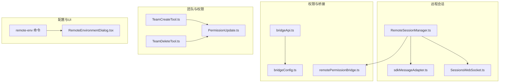
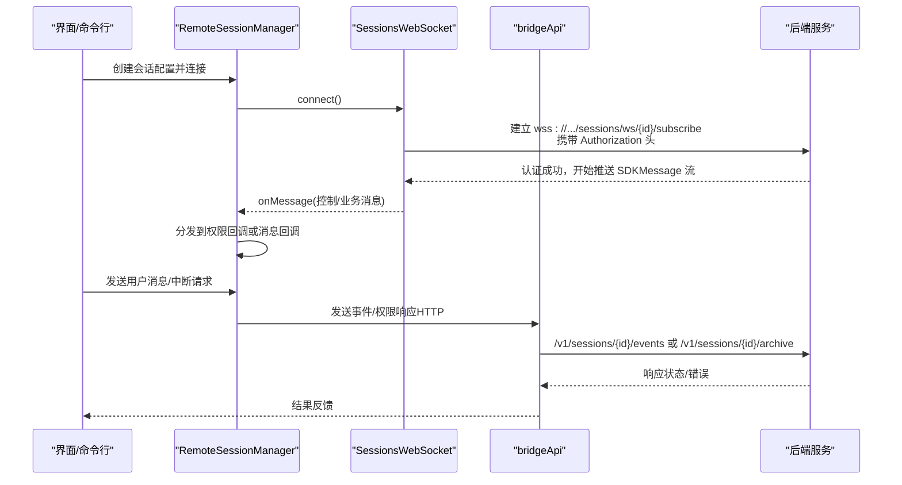
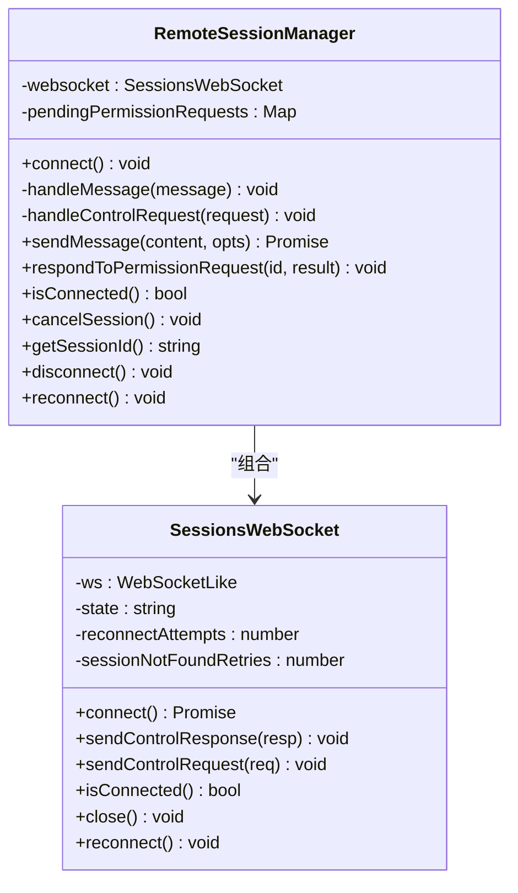
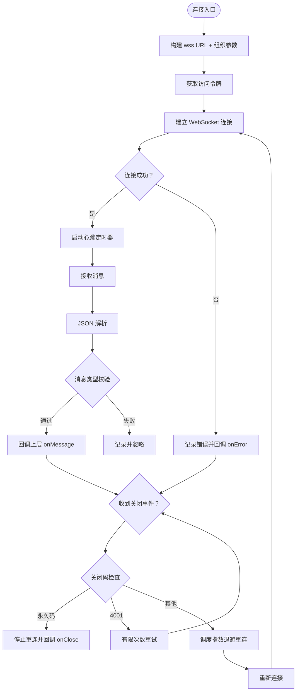
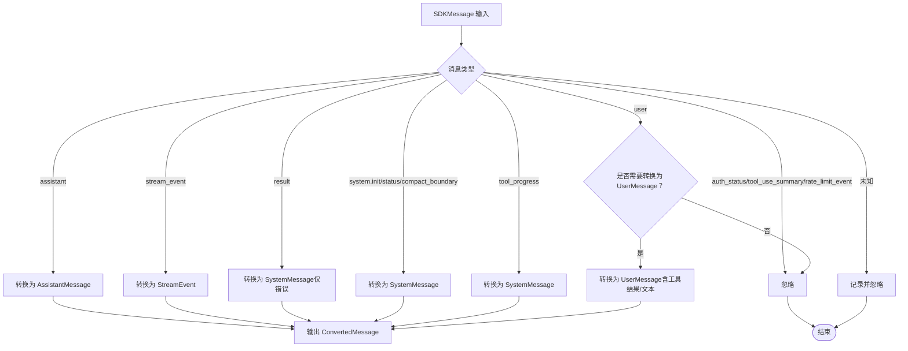
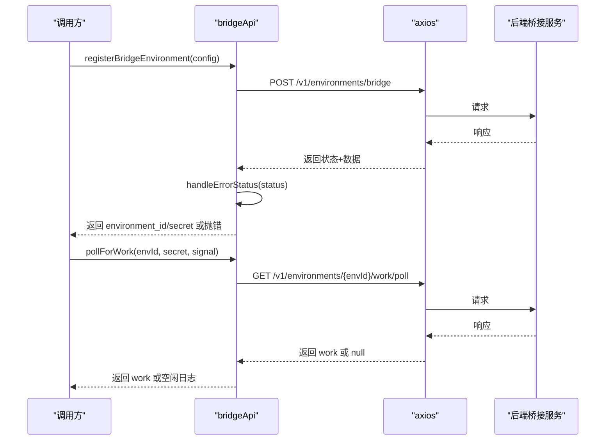
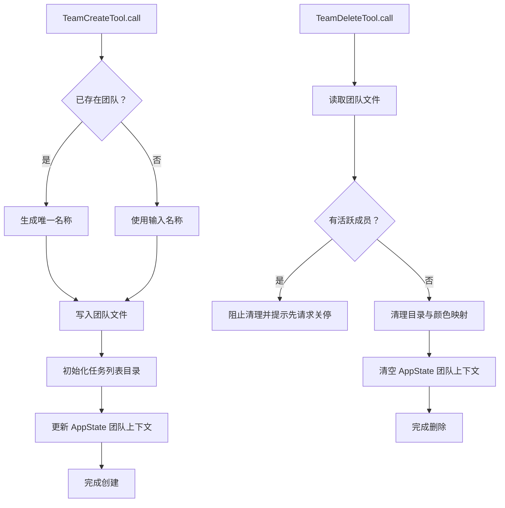
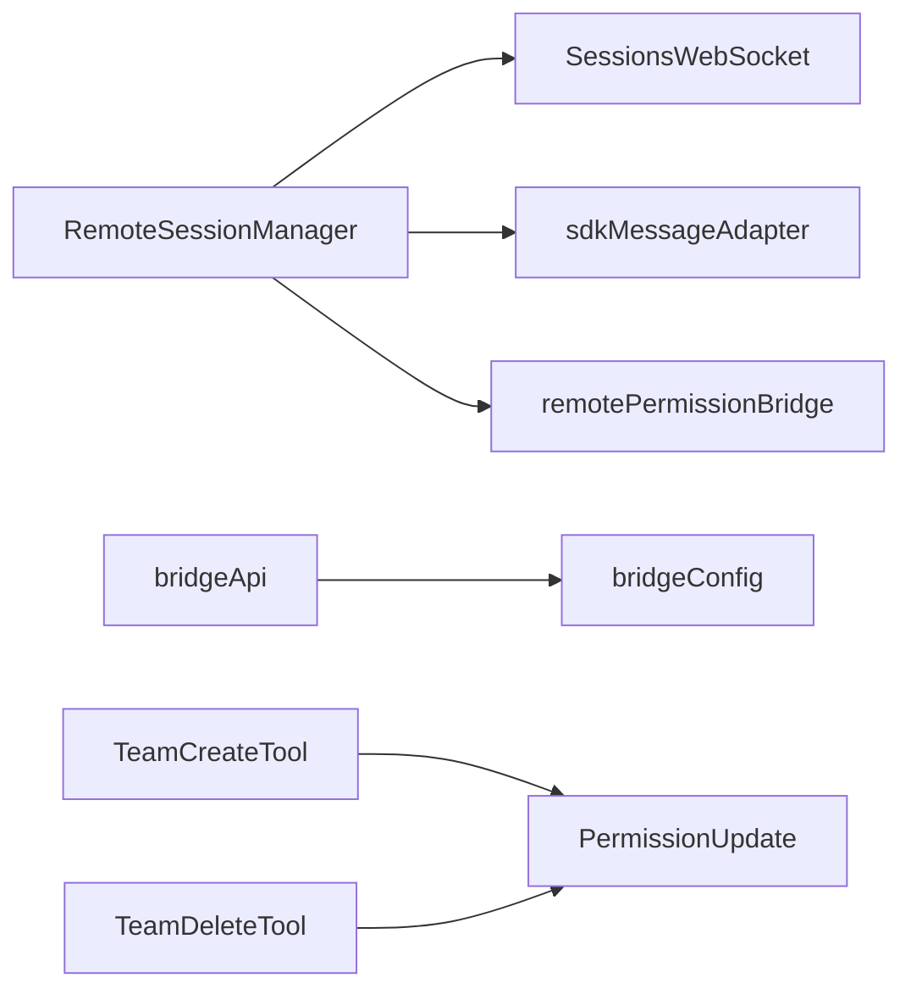
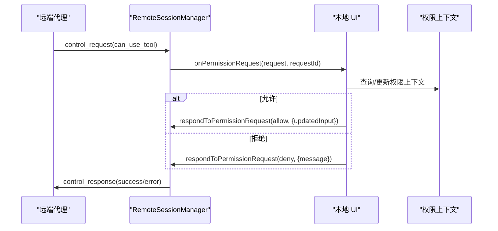

# 远程协作功能

<cite>
**本文引用的文件**
- [RemoteSessionManager.ts](file://src/remote/RemoteSessionManager.ts)
- [SessionsWebSocket.ts](file://src/remote/SessionsWebSocket.ts)
- [remotePermissionBridge.ts](file://src/remote/remotePermissionBridge.ts)
- [sdkMessageAdapter.ts](file://src/remote/sdkMessageAdapter.ts)
- [bridgeApi.ts](file://src/bridge/bridgeApi.ts)
- [bridgeConfig.ts](file://src/bridge/bridgeConfig.ts)
- [TeamCreateTool.ts](file://src/tools/TeamCreateTool/TeamCreateTool.ts)
- [TeamDeleteTool.ts](file://src/tools/TeamDeleteTool/TeamDeleteTool.ts)
- [PermissionUpdate.ts](file://src/utils/permissions/PermissionUpdate.ts)
- [remote-env 命令](file://src/commands/remote-env/index.ts)
- [RemoteEnvironmentDialog.tsx](file://src/components/RemoteEnvironmentDialog.tsx)
</cite>

## 目录
1. [简介](#简介)
2. [项目结构](#项目结构)
3. [核心组件](#核心组件)
4. [架构总览](#架构总览)
5. [详细组件分析](#详细组件分析)
6. [依赖关系分析](#依赖关系分析)
7. [性能与并发特性](#性能与并发特性)
8. [协作与权限管理](#协作与权限管理)
9. [远程环境与网络通信](#远程环境与网络通信)
10. [故障排除指南](#故障排除指南)
11. [结论](#结论)
12. [附录：使用示例与最佳实践](#附录使用示例与最佳实践)

## 简介
本文件系统性阐述 Claude Code 的远程协作能力，覆盖远程会话管理、权限共享与状态同步机制；团队管理（多智能体编队）、代理系统与任务分配；会话同步策略、并发控制与冲突解决；协作工具的使用方法、配置选项与最佳实践；远程环境配置、网络通信与安全考虑；以及多用户支持、权限管理与审计日志等主题。文档以代码级分析为基础，辅以图示帮助不同背景读者理解。

## 项目结构
围绕“远程协作”的关键模块包括：
- 远程会话层：RemoteSessionManager、SessionsWebSocket 负责 WebSocket 订阅、消息收发、控制请求/响应与重连策略
- 消息适配层：sdkMessageAdapter 将 SDK 消息转换为 REPL 内部消息类型
- 权限桥接层：remotePermissionBridge 提供远程权限请求的合成消息与工具桩
- 桥接 API 层：bridgeApi/bridgeConfig 提供与后端桥接服务的 HTTP 交互与认证
- 团队与权限工具：TeamCreateTool/TeamDeleteTool、PermissionUpdate 实现团队生命周期与权限规则持久化
- 配置与 UI：remote-env 命令与 RemoteEnvironmentDialog 提供默认远程环境选择

**图表来源**
- [RemoteSessionManager.ts:95-325](file://src/remote/RemoteSessionManager.ts#L95-L325)
- [SessionsWebSocket.ts:82-404](file://src/remote/SessionsWebSocket.ts#L82-L404)
- [sdkMessageAdapter.ts:28-307](file://src/remote/sdkMessageAdapter.ts#L28-L307)
- [remotePermissionBridge.ts:1-79](file://src/remote/remotePermissionBridge.ts#L1-L79)
- [bridgeApi.ts:68-451](file://src/bridge/bridgeApi.ts#L68-L451)
- [bridgeConfig.ts:14-48](file://src/bridge/bridgeConfig.ts#L14-L48)
- [TeamCreateTool.ts:74-241](file://src/tools/TeamCreateTool/TeamCreateTool.ts#L74-L241)
- [TeamDeleteTool.ts:32-140](file://src/tools/TeamDeleteTool/TeamDeleteTool.ts#L32-L140)
- [PermissionUpdate.ts:55-206](file://src/utils/permissions/PermissionUpdate.ts#L55-L206)
- [remote-env 命令:5-15](file://src/commands/remote-env/index.ts#L5-L15)
- [RemoteEnvironmentDialog.tsx:26-30](file://src/components/RemoteEnvironmentDialog.tsx#L26-L30)

**章节来源**
- [RemoteSessionManager.ts:95-325](file://src/remote/RemoteSessionManager.ts#L95-L325)
- [SessionsWebSocket.ts:82-404](file://src/remote/SessionsWebSocket.ts#L82-L404)
- [sdkMessageAdapter.ts:28-307](file://src/remote/sdkMessageAdapter.ts#L28-L307)
- [remotePermissionBridge.ts:1-79](file://src/remote/remotePermissionBridge.ts#L1-L79)
- [bridgeApi.ts:68-451](file://src/bridge/bridgeApi.ts#L68-L451)
- [bridgeConfig.ts:14-48](file://src/bridge/bridgeConfig.ts#L14-L48)
- [TeamCreateTool.ts:74-241](file://src/tools/TeamCreateTool/TeamCreateTool.ts#L74-L241)
- [TeamDeleteTool.ts:32-140](file://src/tools/TeamDeleteTool/TeamDeleteTool.ts#L32-L140)
- [PermissionUpdate.ts:55-206](file://src/utils/permissions/PermissionUpdate.ts#L55-L206)
- [remote-env 命令:5-15](file://src/commands/remote-env/index.ts#L5-L15)
- [RemoteEnvironmentDialog.tsx:26-30](file://src/components/RemoteEnvironmentDialog.tsx#L26-L30)

## 核心组件
- RemoteSessionManager：负责连接/断开 WebSocket、处理 SDK 控制消息（权限请求/取消/确认）、转发 SDK 消息、发送用户消息、中断请求与重连
- SessionsWebSocket：封装 WebSocket 连接、鉴权、心跳、错误与重连逻辑，支持 4001 特例重试与永久关闭码处理
- sdkMessageAdapter：将 SDKMessage 转换为 REPL 内部消息类型，过滤/忽略不显示的消息类型
- remotePermissionBridge：为远程权限请求构造合成消息与工具桩，便于本地 UI/流程处理
- bridgeApi/bridgeConfig：统一桥接 API 的认证、URL 解析、请求重试与错误处理
- TeamCreateTool/TeamDeleteTool：团队生命周期管理，写入团队文件、清理目录与颜色映射
- PermissionUpdate：权限上下文更新、规则增删改与持久化

**章节来源**
- [RemoteSessionManager.ts:95-325](file://src/remote/RemoteSessionManager.ts#L95-L325)
- [SessionsWebSocket.ts:82-404](file://src/remote/SessionsWebSocket.ts#L82-L404)
- [sdkMessageAdapter.ts:28-307](file://src/remote/sdkMessageAdapter.ts#L28-L307)
- [remotePermissionBridge.ts:1-79](file://src/remote/remotePermissionBridge.ts#L1-L79)
- [bridgeApi.ts:68-451](file://src/bridge/bridgeApi.ts#L68-L451)
- [bridgeConfig.ts:14-48](file://src/bridge/bridgeConfig.ts#L14-L48)
- [TeamCreateTool.ts:74-241](file://src/tools/TeamCreateTool/TeamCreateTool.ts#L74-L241)
- [TeamDeleteTool.ts:32-140](file://src/tools/TeamDeleteTool/TeamDeleteTool.ts#L32-L140)
- [PermissionUpdate.ts:55-206](file://src/utils/permissions/PermissionUpdate.ts#L55-L206)

## 架构总览
远程协作由“会话订阅 + 权限桥接 + 消息适配 + 团队与权限”四层构成，通过桥接 API 与后端服务交互，确保多用户、多代理协同下的状态一致与安全可控。

**图表来源**
- [RemoteSessionManager.ts:108-141](file://src/remote/RemoteSessionManager.ts#L108-L141)
- [SessionsWebSocket.ts:100-205](file://src/remote/SessionsWebSocket.ts#L100-L205)
- [bridgeApi.ts:142-451](file://src/bridge/bridgeApi.ts#L142-L451)

## 详细组件分析

### 远程会话管理器（RemoteSessionManager）
- 角色与职责
  - 维护 WebSocket 连接与状态
  - 分发 SDK 控制消息（权限请求/取消/确认）与业务消息
  - 对外暴露发送用户消息、中断、重连、断开等接口
- 关键行为
  - 控制请求处理：记录待处理权限请求，触发上层回调
  - 控制取消/响应：清理待处理集合，回调取消事件
  - SDK 消息转发：类型守卫确保仅转发非控制类消息
  - 权限响应：构造控制响应并通过 WebSocket 发送
  - 中断请求：向远端发送控制请求（如中断）
  - 连接状态查询与断开清理

**图表来源**
- [RemoteSessionManager.ts:95-325](file://src/remote/RemoteSessionManager.ts#L95-L325)
- [SessionsWebSocket.ts:82-404](file://src/remote/SessionsWebSocket.ts#L82-L404)

**章节来源**
- [RemoteSessionManager.ts:95-325](file://src/remote/RemoteSessionManager.ts#L95-L325)

### 会话 WebSocket 客户端（SessionsWebSocket）
- 角色与职责
  - 建立与维护 wss:// 通道，携带 OAuth 令牌进行鉴权
  - 心跳保活与断线重连，区分永久关闭码与临时断开
  - 4001（会话未找到）有限次重试，避免短暂压缩导致的误判
- 关键行为
  - 连接建立：根据运行时选择原生 WebSocket 或 ws 包，设置代理与 TLS
  - 消息解析：JSON 反序列化，类型校验后分发
  - 关闭处理：按关闭码分类处理，必要时调度重连
  - 控制消息：封装并发送控制请求/响应

**图表来源**
- [SessionsWebSocket.ts:100-288](file://src/remote/SessionsWebSocket.ts#L100-L288)

**章节来源**
- [SessionsWebSocket.ts:82-404](file://src/remote/SessionsWebSocket.ts#L82-L404)

### SDK 消息适配器（sdkMessageAdapter）
- 角色与职责
  - 将后端 SDKMessage 转换为 REPL 内部消息类型，用于渲染与历史回放
  - 过滤掉无需显示的消息类型（如 auth_status、tool_use_summary、rate_limit_event）
- 关键行为
  - 六种主要消息类型的转换：助手、流事件、结果、系统初始化/状态/压缩边界、工具进度
  - 用户消息转换开关：在直连模式下将工具结果/文本消息转为用户消息
  - 会话结束判断与结果文本提取

**图表来源**
- [sdkMessageAdapter.ts:169-282](file://src/remote/sdkMessageAdapter.ts#L169-L282)

**章节来源**
- [sdkMessageAdapter.ts:28-307](file://src/remote/sdkMessageAdapter.ts#L28-L307)

### 权限桥接（remotePermissionBridge）
- 角色与职责
  - 为远程权限请求构造合成的 AssistantMessage，以便本地 UI/流程处理
  - 为本地缺失的远程工具创建工具桩，路由到通用权限请求处理
- 关键行为
  - 合成消息：生成带工具 use 的消息结构，便于权限对话框渲染
  - 工具桩：最小化工具接口，标记为需要权限

**章节来源**
- [remotePermissionBridge.ts:1-79](file://src/remote/remotePermissionBridge.ts#L1-L79)

### 桥接 API 与配置（bridgeApi/bridgeConfig）
- 角色与职责
  - bridgeApi：封装桥接服务的注册、轮询、确认、停止、归档、重连、心跳、权限事件上报等 HTTP 接口，并统一处理 401/403/404/410/429 等错误
  - bridgeConfig：集中解析桥接服务的访问令牌与基础 URL，支持开发态覆盖
- 关键行为
  - withOAuthRetry：对 401 自动尝试刷新并重试一次
  - validateBridgeId：路径段 ID 白名单校验，防止注入
  - 错误类型识别：区分过期、权限不足、不存在等场景
  - 注册/轮询/确认/停止/归档/重连/心跳/权限事件上报

**图表来源**
- [bridgeApi.ts:142-247](file://src/bridge/bridgeApi.ts#L142-L247)
- [bridgeConfig.ts:38-48](file://src/bridge/bridgeConfig.ts#L38-L48)

**章节来源**
- [bridgeApi.ts:68-451](file://src/bridge/bridgeApi.ts#L68-L451)
- [bridgeConfig.ts:14-48](file://src/bridge/bridgeConfig.ts#L14-L48)

### 团队管理与任务分配
- TeamCreateTool：创建团队、生成唯一名称、写入团队文件、初始化任务列表、更新应用状态
- TeamDeleteTool：清理团队目录与颜色映射、注销会话清理、清空团队上下文
- 二者配合实现团队生命周期管理，支撑多代理编队与任务分配

**图表来源**
- [TeamCreateTool.ts:128-212](file://src/tools/TeamCreateTool/TeamCreateTool.ts#L128-L212)
- [TeamDeleteTool.ts:71-124](file://src/tools/TeamDeleteTool/TeamDeleteTool.ts#L71-L124)

**章节来源**
- [TeamCreateTool.ts:74-241](file://src/tools/TeamCreateTool/TeamCreateTool.ts#L74-L241)
- [TeamDeleteTool.ts:32-140](file://src/tools/TeamDeleteTool/TeamDeleteTool.ts#L32-L140)

### 权限上下文与规则持久化（PermissionUpdate）
- 角色与职责
  - 应用单条或多条权限更新，支持设置模式、增删改规则、增删工作目录
  - 将可持久化的更新写入本地/用户/项目设置，实现跨会话一致性
- 关键行为
  - applyPermissionUpdate：按类型更新上下文
  - persistPermissionUpdate：将规则/目录/模式写入对应设置源
  - createReadRuleSuggestion：为目录生成读取规则建议

**章节来源**
- [PermissionUpdate.ts:55-206](file://src/utils/permissions/PermissionUpdate.ts#L55-L206)
- [PermissionUpdate.ts:222-342](file://src/utils/permissions/PermissionUpdate.ts#L222-L342)
- [PermissionUpdate.ts:361-390](file://src/utils/permissions/PermissionUpdate.ts#L361-L390)

## 依赖关系分析
- RemoteSessionManager 依赖 SessionsWebSocket 与 sdkMessageAdapter，负责高层编排与回调分发
- remotePermissionBridge 为权限请求提供本地合成消息与工具桩
- bridgeApi/bridgeConfig 为桥接层提供统一的认证、URL 与错误处理
- TeamCreateTool/TeamDeleteTool 与 PermissionUpdate 协作，实现团队与权限的联动

**图表来源**
- [RemoteSessionManager.ts:95-325](file://src/remote/RemoteSessionManager.ts#L95-L325)
- [SessionsWebSocket.ts:82-404](file://src/remote/SessionsWebSocket.ts#L82-L404)
- [sdkMessageAdapter.ts:28-307](file://src/remote/sdkMessageAdapter.ts#L28-L307)
- [remotePermissionBridge.ts:1-79](file://src/remote/remotePermissionBridge.ts#L1-L79)
- [bridgeApi.ts:68-451](file://src/bridge/bridgeApi.ts#L68-L451)
- [bridgeConfig.ts:14-48](file://src/bridge/bridgeConfig.ts#L14-L48)
- [TeamCreateTool.ts:74-241](file://src/tools/TeamCreateTool/TeamCreateTool.ts#L74-L241)
- [TeamDeleteTool.ts:32-140](file://src/tools/TeamDeleteTool/TeamDeleteTool.ts#L32-L140)
- [PermissionUpdate.ts:55-206](file://src/utils/permissions/PermissionUpdate.ts#L55-L206)

**章节来源**
- [RemoteSessionManager.ts:95-325](file://src/remote/RemoteSessionManager.ts#L95-L325)
- [SessionsWebSocket.ts:82-404](file://src/remote/SessionsWebSocket.ts#L82-L404)
- [sdkMessageAdapter.ts:28-307](file://src/remote/sdkMessageAdapter.ts#L28-L307)
- [remotePermissionBridge.ts:1-79](file://src/remote/remotePermissionBridge.ts#L1-L79)
- [bridgeApi.ts:68-451](file://src/bridge/bridgeApi.ts#L68-L451)
- [bridgeConfig.ts:14-48](file://src/bridge/bridgeConfig.ts#L14-L48)
- [TeamCreateTool.ts:74-241](file://src/tools/TeamCreateTool/TeamCreateTool.ts#L74-L241)
- [TeamDeleteTool.ts:32-140](file://src/tools/TeamDeleteTool/TeamDeleteTool.ts#L32-L140)
- [PermissionUpdate.ts:55-206](file://src/utils/permissions/PermissionUpdate.ts#L55-L206)

## 性能与并发特性
- 心跳保活：每 30 秒一次 ping，降低网络空闲导致的连接异常断开
- 断线重连：指数退避 + 最大尝试次数限制，避免风暴式重连
- 4001 特例：在会话压缩期间短暂不可用时，进行有限次重试，提升鲁棒性
- 并发控制：RemoteSessionManager 使用 Map 维护待处理权限请求，避免并发竞态
- 消息过滤：sdkMessageAdapter 忽略不需显示的消息类型，减少渲染与存储压力

**章节来源**
- [SessionsWebSocket.ts:17-26](file://src/remote/SessionsWebSocket.ts#L17-L26)
- [SessionsWebSocket.ts:301-313](file://src/remote/SessionsWebSocket.ts#L301-L313)
- [SessionsWebSocket.ts:274-288](file://src/remote/SessionsWebSocket.ts#L274-L288)
- [RemoteSessionManager.ts:97-98](file://src/remote/RemoteSessionManager.ts#L97-L98)
- [sdkMessageAdapter.ts:272-281](file://src/remote/sdkMessageAdapter.ts#L272-L281)

## 协作与权限管理
- 权限请求链路
  - 远端触发工具使用前，发送控制请求（can_use_tool），RemoteSessionManager 记录并回调上层
  - 上层根据策略（全局/项目/本地设置）决定允许/拒绝/始终询问
  - RemoteSessionManager 构造控制响应并通过 WebSocket 发送
- 权限上下文
  - 支持设置模式（默认/始终允许/始终拒绝/总是询问）
  - 规则增删改与工作目录扩展，支持持久化到设置源
- 团队协作
  - TeamCreateTool 初始化团队上下文与任务列表
  - TeamDeleteTool 清理资源并释放颜色映射，避免后续冲突

**图表来源**
- [RemoteSessionManager.ts:189-215](file://src/remote/RemoteSessionManager.ts#L189-L215)
- [RemoteSessionManager.ts:248-283](file://src/remote/RemoteSessionManager.ts#L248-L283)
- [PermissionUpdate.ts:55-206](file://src/utils/permissions/PermissionUpdate.ts#L55-L206)

**章节来源**
- [RemoteSessionManager.ts:189-215](file://src/remote/RemoteSessionManager.ts#L189-L215)
- [RemoteSessionManager.ts:248-283](file://src/remote/RemoteSessionManager.ts#L248-L283)
- [PermissionUpdate.ts:55-206](file://src/utils/permissions/PermissionUpdate.ts#L55-L206)

## 远程环境与网络通信
- 默认远程环境配置
  - remote-env 命令用于设置默认远程环境，受订阅状态与策略限制
  - RemoteEnvironmentDialog 提供交互式选择与配置提示
- 网络与安全
  - SessionsWebSocket 使用 wss 与 OAuth 令牌鉴权
  - 支持代理与 TLS 配置
  - 桥接 API 统一处理 401/403/404/410/429，区分过期与权限问题
- 会话生命周期
  - 通过 bridgeApi 的 archive/reconnect/heartbeat 等接口管理会话状态

**章节来源**
- [remote-env 命令:5-15](file://src/commands/remote-env/index.ts#L5-L15)
- [RemoteEnvironmentDialog.tsx:26-30](file://src/components/RemoteEnvironmentDialog.tsx#L26-L30)
- [SessionsWebSocket.ts:108-128](file://src/remote/SessionsWebSocket.ts#L108-L128)
- [bridgeApi.ts:454-500](file://src/bridge/bridgeApi.ts#L454-L500)
- [bridgeApi.ts:358-385](file://src/bridge/bridgeApi.ts#L358-L385)

## 故障排除指南
- WebSocket 连接失败
  - 检查网络代理与 TLS 设置
  - 确认 OAuth 令牌有效且未过期
  - 关注 4001 重试上限，必要时等待会话稳定
- 权限请求无响应
  - 确认上层 UI 是否正确回调 respondToPermissionRequest
  - 检查 pendingPermissionRequests 是否被意外清理
- 会话结束或中断
  - 使用 cancelSession 发送中断请求
  - 使用 reconnect 强制重建订阅
- 权限规则不生效
  - 确认规则已持久化到正确的设置源
  - 检查目标工具名与规则内容是否匹配
- 团队清理失败
  - 确保所有成员已处于非活跃状态后再执行删除
  - 手动清理残留目录或等待会话结束自动清理

**章节来源**
- [SessionsWebSocket.ts:234-288](file://src/remote/SessionsWebSocket.ts#L234-L288)
- [RemoteSessionManager.ts:153-184](file://src/remote/RemoteSessionManager.ts#L153-L184)
- [RemoteSessionManager.ts:295-298](file://src/remote/RemoteSessionManager.ts#L295-L298)
- [RemoteSessionManager.ts:321-324](file://src/remote/RemoteSessionManager.ts#L321-L324)
- [PermissionUpdate.ts:222-342](file://src/utils/permissions/PermissionUpdate.ts#L222-L342)
- [TeamDeleteTool.ts:89-98](file://src/tools/TeamDeleteTool/TeamDeleteTool.ts#L89-L98)

## 结论
Claude Code 的远程协作以“会话订阅 + 权限桥接 + 消息适配 + 团队与权限”为核心，结合桥接 API 的统一认证与错误处理，实现了多用户、多代理协同下的稳定会话管理与权限控制。通过有限重试、心跳保活与规则持久化等机制，系统在复杂网络环境下仍能保持高可用与一致性。团队生命周期工具与权限上下文更新进一步完善了编队协作与任务分配能力。

## 附录：使用示例与最佳实践
- 使用默认远程环境
  - 通过 remote-env 命令设置默认环境，或在 RemoteEnvironmentDialog 中选择
  - 确保订阅状态与策略允许远程会话
- 创建团队并分配任务
  - 使用 TeamCreateTool 创建团队，初始化任务列表
  - 在权限上下文中设置合适的模式与规则，必要时持久化
- 协作流程
  - 先创建团队，再发起会话；会话中根据权限请求进行授权
  - 使用 cancelSession 中断当前请求，使用 reconnect 强制刷新订阅
- 最佳实践
  - 为敏感目录生成读取规则建议并持久化
  - 在团队删除前确保所有成员非活跃，避免资源泄漏
  - 定期检查桥接 API 错误类型，区分过期与权限不足场景

**章节来源**
- [remote-env 命令:5-15](file://src/commands/remote-env/index.ts#L5-L15)
- [RemoteEnvironmentDialog.tsx:26-30](file://src/components/RemoteEnvironmentDialog.tsx#L26-L30)
- [TeamCreateTool.ts:128-212](file://src/tools/TeamCreateTool/TeamCreateTool.ts#L128-L212)
- [TeamDeleteTool.ts:71-124](file://src/tools/TeamDeleteTool/TeamDeleteTool.ts#L71-L124)
- [PermissionUpdate.ts:361-390](file://src/utils/permissions/PermissionUpdate.ts#L361-L390)
- [RemoteSessionManager.ts:295-298](file://src/remote/RemoteSessionManager.ts#L295-L298)
- [RemoteSessionManager.ts:321-324](file://src/remote/RemoteSessionManager.ts#L321-L324)