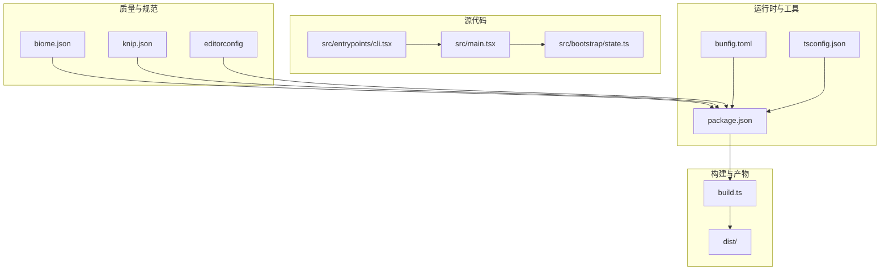
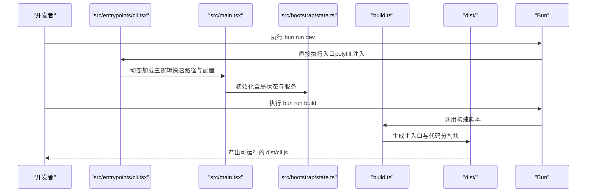
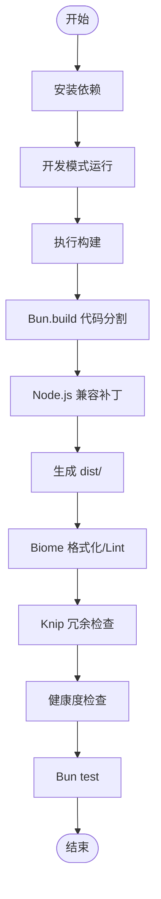
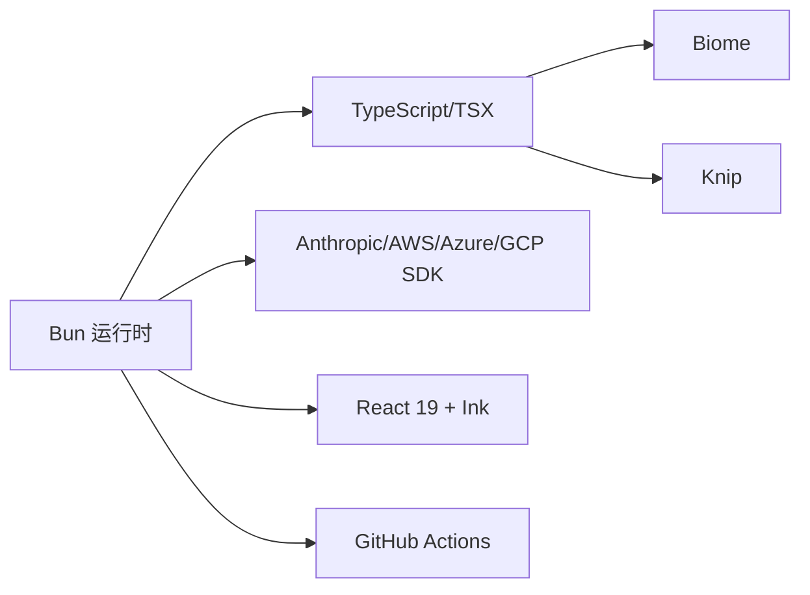

# 开发环境搭建

<cite>
**本文引用的文件**
- [README.md](file://README.md)
- [CLAUDE.md](file://CLAUDE.md)
- [package.json](file://package.json)
- [bunfig.toml](file://bunfig.toml)
- [tsconfig.json](file://tsconfig.json)
- [biome.json](file://biome.json)
- [build.ts](file://build.ts)
- [.github/workflows/ci.yml](file://.github/workflows/ci.yml)
- [scripts/health-check.ts](file://scripts/health-check.ts)
- [knip.json](file://knip.json)
- [.editorconfig](file://.editorconfig)
- [src/entrypoints/cli.tsx](file://src/entrypoints/cli.tsx)
- [src/main.tsx](file://src/main.tsx)
- [src/bootstrap/state.ts](file://src/bootstrap/state.ts)
</cite>

## 目录
1. [简介](#简介)
2. [项目结构](#项目结构)
3. [核心组件](#核心组件)
4. [架构总览](#架构总览)
5. [详细组件分析](#详细组件分析)
6. [依赖分析](#依赖分析)
7. [性能考虑](#性能考虑)
8. [故障排查指南](#故障排查指南)
9. [结论](#结论)
10. [附录](#附录)

## 简介
本指南面向希望参与 Claude Code Best（CCB）项目的开发者，提供从零到一的开发环境搭建与日常开发流程说明。内容覆盖系统要求与前置条件、安装步骤、构建与打包、代码质量与规范、调试与性能分析、常见问题与优化建议等，帮助你在最短时间内建立稳定高效的开发环境并开始贡献。

## 项目结构
- 仓库采用 Bun workspaces 管理 monorepo，核心代码位于 src/，构建产物 dist/，内部 NAPI/Stub 包位于 packages/ 与 packages/@ant/。
- CLI 入口为 src/entrypoints/cli.tsx，主逻辑在 src/main.tsx 中初始化并启动 REPL 或管道模式。
- 构建系统基于 Bun.build，支持代码分割与 Node.js 兼容后处理；代码质量通过 Biome 与 Knip 提供格式化、静态检查与冗余依赖检测；CI 使用 GitHub Actions 与 oven-sh/setup-bun。

图表来源
- [src/entrypoints/cli.tsx:1-200](file://src/entrypoints/cli.tsx#L1-L200)
- [src/main.tsx:1-200](file://src/main.tsx#L1-L200)
- [src/bootstrap/state.ts:1-800](file://src/bootstrap/state.ts#L1-L800)
- [build.ts:1-48](file://build.ts#L1-L48)
- [package.json:1-166](file://package.json#L1-L166)
- [biome.json:1-115](file://biome.json#L1-L115)
- [knip.json:1-23](file://knip.json#L1-L23)
- [bunfig.toml:1-4](file://bunfig.toml#L1-L4)
- [tsconfig.json:1-21](file://tsconfig.json#L1-L21)

章节来源
- [README.md: 第30-58行:30-58](file://README.md#L30-L58)
- [CLAUDE.md: 第28-90行:28-90](file://CLAUDE.md#L28-L90)

## 核心组件
- 运行时与构建
  - 运行时：Bun（不兼容 Node.js）。所有导入、构建与执行均使用 Bun API。
  - 构建：Bun.build，入口为 src/entrypoints/cli.tsx，输出 dist/，包含主入口与约数百个代码分割块。
  - 模块系统：ESM，TSX 与 react-jsx 转换。
  - 工作区：Bun workspaces，内部包通过 workspace:* 解析。
- 入口与引导
  - src/entrypoints/cli.tsx：注入运行时 polyfill（feature 与 BUILD_* 常量），提供快速路径（版本查询、系统提示导出等）。
  - src/main.tsx：Commander 定义 CLI 参数，初始化服务（认证、分析、策略），启动 REPL 或管道模式。
  - src/bootstrap/state.ts：集中式全局状态（会话、计数器、遥测、通道、计划缓存等）。
- 质量与规范
  - Biome：格式化（单引号、可选分号、尾逗号）、Linter（推荐规则集，部分规则关闭以适配反编译代码）。
  - Knip：检测未使用文件/导出/依赖，忽略特定包与二进制。
  - editorconfig：统一缩进、换行、字符集等基础规范。
  - 测试：Bun test，根目录配置与超时时间。

章节来源
- [CLAUDE.md: 第30-90行:30-90](file://CLAUDE.md#L30-L90)
- [package.json: 第24-26, 37-49行:24-26](file://package.json#L24-L26)
- [build.ts: 第10-24行:10-24](file://build.ts#L10-L24)
- [biome.json: 第11-114行:11-114](file://biome.json#L11-L114)
- [knip.json: 第1-23行:1-23](file://knip.json#L1-L23)
- [bunfig.toml: 第1-4行:1-4](file://bunfig.toml#L1-L4)
- [src/entrypoints/cli.tsx: 第1-53行:1-53](file://src/entrypoints/cli.tsx#L1-L53)
- [src/main.tsx: 第1-L200:1-200](file://src/main.tsx#L1-L200)
- [src/bootstrap/state.ts: 第1-L800:1-800](file://src/bootstrap/state.ts#L1-L800)

## 架构总览
下图展示从入口到构建产物的关键路径与职责分工：

图表来源
- [src/entrypoints/cli.tsx: 第1-L200:1-200](file://src/entrypoints/cli.tsx#L1-L200)
- [src/main.tsx: 第1-L200:1-200](file://src/main.tsx#L1-L200)
- [src/bootstrap/state.ts: 第1-L800:1-800](file://src/bootstrap/state.ts#L1-L800)
- [build.ts: 第1-L48:1-48](file://build.ts#L1-L48)

## 详细组件分析

### 系统要求与前置条件
- 运行时与版本
  - 必须使用 Bun，版本要求见 engines 与 README。
  - 构建与运行均基于 Bun API，不兼容 Node.js。
- 操作系统
  - 仓库未限定操作系统；CI 使用 ubuntu-latest，可在 macOS/Linux 环境中正常开发。
- 依赖工具
  - Git（用于仓库克隆与提交钩子）
  - 可选：VS Code（配合 Biome、TypeScript 插件）

章节来源
- [package.json: 第24-26行:24-26](file://package.json#L24-L26)
- [README.md: 第32-37行:32-37](file://README.md#L32-L37)
- [.github/workflows/ci.yml: 第16-18行:16-18](file://.github/workflows/ci.yml#L16-L18)

### 安装步骤
- 克隆仓库
  - 使用 Git 克隆项目至本地。
- 安装依赖
  - 在项目根目录执行依赖安装（使用 Bun）。
- 配置开发工具
  - 安装 VS Code 扩展（Biome、ESLint、Prettier、TypeScript）。
  - 配置 editorconfig 与提交钩子（prepare 脚本会设置 Git hooks 路径）。
- 设置 IDE 环境
  - 使用 VS Code 打开项目，确保 TypeScript 与 Biome 插件生效。
  - 在 VS Code 设置中启用 Biome 格式化与 Lint（或使用命令面板触发）。

章节来源
- [README.md: 第39-53行:39-53](file://README.md#L39-L53)
- [package.json: 第44行](file://package.json#L44)
- [package.json: 第44行](file://package.json#L44)

### 构建系统与开发流程
- 开发模式
  - 直接运行入口文件进行开发与调试（无需打包）。
- 构建流程
  - 使用 Bun.build 生成 dist/cli.js 与多个代码分割块。
  - 构建脚本对 import.meta.require 做 Node.js 兼容替换，保证产物可在 Node 环境运行。
- 代码质量与规范
  - 格式化：Biome 格式化（单引号、可选分号、尾逗号）。
  - Lint：Biome Linter（推荐规则集，部分规则关闭以适配反编译代码）。
  - 冗余检查：Knip（检测未使用文件/导出/依赖）。
  - 健康检查：scripts/health-check.ts 汇总代码规模、Lint、测试、冗余与构建状态。
- 测试
  - 使用 Bun test，根目录配置与超时时间在 bunfig.toml 中设置。

图表来源
- [build.ts: 第10-48行:10-48](file://build.ts#L10-L48)
- [scripts/health-check.ts: 第1-L164:1-164](file://scripts/health-check.ts#L1-L164)
- [biome.json: 第11-114行:11-114](file://biome.json#L11-L114)
- [knip.json: 第1-23行:1-23](file://knip.json#L1-L23)
- [bunfig.toml: 第1-4行:1-4](file://bunfig.toml#L1-L4)

章节来源
- [build.ts: 第1-L48:1-48](file://build.ts#L1-L48)
- [scripts/health-check.ts: 第1-L164:1-164](file://scripts/health-check.ts#L1-L164)
- [biome.json: 第11-114行:11-114](file://biome.json#L11-L114)
- [knip.json: 第1-23行:1-23](file://knip.json#L1-L23)
- [bunfig.toml: 第1-4行:1-4](file://bunfig.toml#L1-L4)

### 调试方法与开发工具
- 热重载与直接执行
  - 使用 bun run dev 直接执行入口文件，适合快速迭代与调试。
- 断点调试
  - 在 VS Code 中为入口文件设置断点，使用调试配置启动。
- 性能分析
  - 使用内置启动性能探针（profileCheckpoint）定位启动阶段耗时。
  - 使用状态模块中的计时与统计字段评估工具调用与回合耗时。
- 日志与诊断
  - 使用 Doctor 命令与健康度检查脚本汇总问题线索。
  - 在 CI 中使用 GitHub Actions 与 oven-sh/setup-bun 确保一致的运行环境。

章节来源
- [README.md: 第45-53行:45-53](file://README.md#L45-L53)
- [src/entrypoints/cli.tsx: 第74-L116:74-116](file://src/entrypoints/cli.tsx#L74-L116)
- [src/bootstrap/state.ts: 第543-L781:543-781](file://src/bootstrap/state.ts#L543-L781)
- [.github/workflows/ci.yml: 第16-31行:16-31](file://.github/workflows/ci.yml#L16-L31)

### 代码规范与最佳实践
- 命名约定
  - 组件与工具采用 PascalCase；常量与配置使用 UPPER_SNAKE_CASE；文件与目录使用 kebab-case。
- 注释标准
  - 重要模块与复杂逻辑添加注释，解释设计权衡与边界条件。
- 测试要求
  - 使用 Bun test，建议按功能拆分测试文件，覆盖关键路径与异常场景。
- 提交规范
  - 使用 editorconfig 统一缩进与换行；遵循 Biome 格式化与 Lint 规则；提交前运行健康度检查。

章节来源
- [.editorconfig: 第1-17行:1-17](file://.editorconfig#L1-L17)
- [biome.json: 第11-114行:11-114](file://biome.json#L11-L114)
- [scripts/health-check.ts: 第1-L164:1-164](file://scripts/health-check.ts#L1-L164)

### 常见问题与优化建议
- 环境版本不匹配
  - 确保使用满足 engines 的 Bun 版本；若版本过低可能导致构建或运行异常。
- Node.js 兼容性
  - 构建产物已做 Node.js 兼容补丁；如仍出现 import.meta.require 相关问题，请确认构建是否成功。
- Lint 与格式化冲突
  - Biome 部分规则已关闭以适配反编译代码；建议在 IDE 中启用 Biome 插件并定期格式化。
- 冗余依赖与导出
  - 使用 Knip 检测未使用项，及时清理减少包体积与潜在风险。
- CI 一致性
  - CI 使用 ubuntu-latest 与 oven-sh/setup-bun，确保本地与 CI 环境一致。

章节来源
- [package.json: 第24-26行:24-26](file://package.json#L24-L26)
- [build.ts: 第26-L43:26-43](file://build.ts#L26-L43)
- [biome.json: 第11-114行:11-114](file://biome.json#L11-L114)
- [knip.json: 第1-23行:1-23](file://knip.json#L1-L23)
- [.github/workflows/ci.yml: 第16-31行:16-31](file://.github/workflows/ci.yml#L16-L31)

## 依赖分析
- 运行时与构建
  - Bun（>=1.2.0，推荐最新版本）
  - TypeScript（6.x），TSX 与 react-jsx
  - Biome（格式化与 Lint）
  - Knip（未使用检测）
- 业务依赖
  - Anthropic SDK、AWS/Azure/GCP SDK、OpenTelemetry 生态、React 19、Ink 终端渲染框架等。
- 工程化能力
  - 提交钩子、测试配置、CI 流水线。

图表来源
- [package.json: 第51-163行:51-163](file://package.json#L51-L163)
- [biome.json: 第11-114行:11-114](file://biome.json#L11-L114)
- [knip.json: 第1-23行:1-23](file://knip.json#L1-L23)
- [.github/workflows/ci.yml: 第16-31行:16-31](file://.github/workflows/ci.yml#L16-L31)

章节来源
- [package.json: 第51-163行:51-163](file://package.json#L51-L163)
- [biome.json: 第11-114行:11-114](file://biome.json#L11-L114)
- [knip.json: 第1-23行:1-23](file://knip.json#L1-L23)
- [.github/workflows/ci.yml: 第16-31行:16-31](file://.github/workflows/ci.yml#L16-L31)

## 性能考虑
- 启动性能
  - 入口文件提供快速路径（版本查询、系统提示导出），避免不必要的模块加载。
  - 使用 profileCheckpoint 标记关键节点，便于定位启动瓶颈。
- 运行时性能
  - 使用代码分割（Bun.build splitting），减小首包体积与冷启动时间。
  - 全局状态模块集中管理计时与统计，便于观测工具调用与回合耗时。
- 构建性能
  - 构建脚本在生成产物后进行 Node.js 兼容补丁处理，确保产物在 Node 环境可用。

章节来源
- [src/entrypoints/cli.tsx: 第64-L116:64-116](file://src/entrypoints/cli.tsx#L64-L116)
- [src/bootstrap/state.ts: 第543-L781:543-781](file://src/bootstrap/state.ts#L543-L781)
- [build.ts: 第10-L48:10-48](file://build.ts#L10-L48)

## 故障排查指南
- 构建失败
  - 检查 Bun 版本是否满足 engines 要求；查看构建日志中的失败原因。
- Node.js 兼容性问题
  - 确认构建脚本已对 import.meta.require 做兼容替换；检查 dist/ 产物是否生成。
- Lint 与格式化冲突
  - 使用 Biome 格式化与 Lint；必要时调整规则集以适配项目现状。
- 冗余依赖与导出
  - 使用 Knip 检测未使用项；清理后重新构建与测试。
- 健康度检查
  - 使用 scripts/health-check.ts 汇总代码规模、Lint、测试、冗余与构建状态，定位问题。

章节来源
- [build.ts: 第18-L24:18-24](file://build.ts#L18-L24)
- [build.ts: 第26-L43:26-43](file://build.ts#L26-L43)
- [scripts/health-check.ts: 第58-L125:58-125](file://scripts/health-check.ts#L58-L125)
- [biome.json: 第11-114行:11-114](file://biome.json#L11-L114)
- [knip.json: 第1-23行:1-23](file://knip.json#L1-L23)

## 结论
通过遵循本指南，你可以快速搭建与维护 Claude Code Best 的开发环境，掌握从安装、构建、质量检查到调试与性能分析的全流程。建议在本地与 CI 中保持一致的工具链与规则，持续使用健康度检查与质量工具，确保代码可维护性与稳定性。

## 附录
- 快速命令参考
  - 安装依赖：bun install
  - 开发模式：bun run dev
  - 构建：bun run build
  - Lint：bun run lint
  - Lint 修复：bun run lint:fix
  - 格式化：bun run format
  - 测试：bun test
  - 未使用检测：bun run check:unused
  - 健康度检查：bun run health
  - 文档开发：bun run docs:dev

章节来源
- [package.json: 第37-49行:37-49](file://package.json#L37-L49)
- [README.md: 第45-53行:45-53](file://README.md#L45-L53)