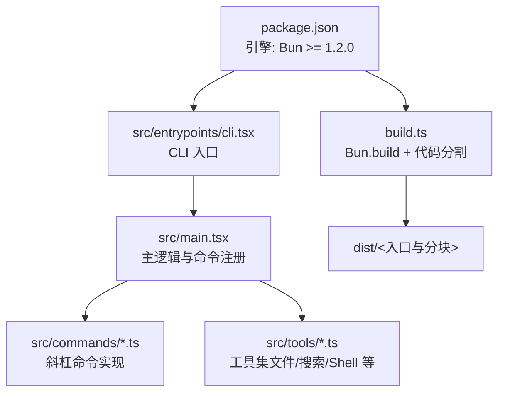
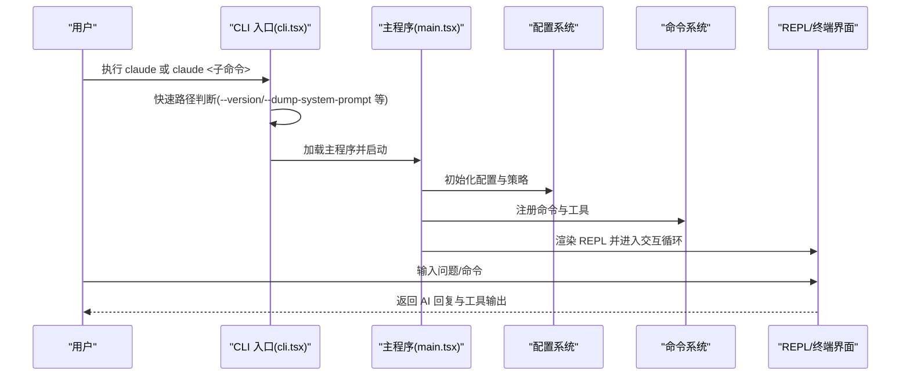
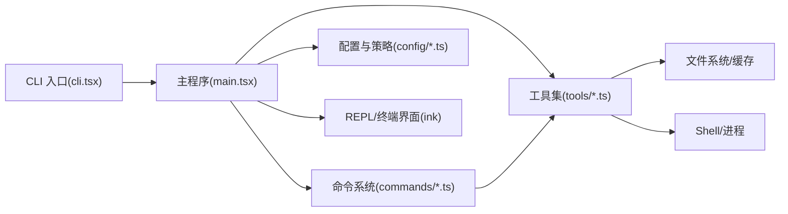

# 快速开始指南

<cite>
**本文档引用的文件**
- [package.json](file://package.json)
- [README.md](file://README.md)
- [src/entrypoints/cli.tsx](file://src/entrypoints/cli.tsx)
- [src/main.tsx](file://src/main.tsx)
- [build.ts](file://build.ts)
- [docs/tools/file-operations.mdx](file://docs/tools/file-operations.mdx)
- [docs/tools/search-and-navigation.mdx](file://docs/tools/search-and-navigation.mdx)
- [docs/tools/shell-execution.mdx](file://docs/tools/shell-execution.mdx)
- [src/commands/init.ts](file://src/commands/init.ts)
- [src/commands/config/index.ts](file://src/commands/config/index.ts)
- [src/commands/login/index.ts](file://src/commands/login/index.ts)
</cite>

## 目录
1. [简介](#简介)
2. [项目结构](#项目结构)
3. [核心组件](#核心组件)
4. [架构总览](#架构总览)
5. [详细组件分析](#详细组件分析)
6. [依赖关系分析](#依赖关系分析)
7. [性能注意事项](#性能注意事项)
8. [故障排除指南](#故障排除指南)
9. [结论](#结论)
10. [附录](#附录)

## 简介
本指南面向首次接触 Claude Code 的用户，帮助你在 5 分钟内完成安装、基础配置与首次使用体验。内容涵盖：
- 系统要求与安装步骤
- 环境变量与 API 密钥配置
- 基本命令与常用操作
- 文件操作、代码搜索与 Shell 执行
- 故障排除与常见问题

## 项目结构
Claude Code 采用 Bun 工作区组织，核心入口为 CLI，主要功能通过命令与工具模块实现，构建产物输出至 dist/。

图表来源
- [package.json:24-26](file://package.json#L24-L26)
- [src/entrypoints/cli.tsx:1-321](file://src/entrypoints/cli.tsx#L1-L321)
- [src/main.tsx:1-800](file://src/main.tsx#L1-L800)
- [build.ts:1-48](file://build.ts#L1-L48)

章节来源
- [package.json:1-166](file://package.json#L1-L166)
- [README.md:326-353](file://README.md#L326-L353)
- [build.ts:1-48](file://build.ts#L1-L48)

## 核心组件
- CLI 入口与启动流程
  - CLI 入口文件负责快速路径判断（版本查询、系统提示、桥接模式等），随后加载主逻辑并启动 REPL。
- 主程序与命令系统
  - 主程序初始化配置、策略限制、遥测与插件，并注册各类命令（/init、/config、/login 等）。
- 工具集
  - 文件操作（读取/编辑/写入）、代码搜索（Glob/Grep）、Shell 执行（BashTool）等，均以工具形式提供权限控制与安全防护。

章节来源
- [src/entrypoints/cli.tsx:60-321](file://src/entrypoints/cli.tsx#L60-L321)
- [src/main.tsx:585-800](file://src/main.tsx#L585-L800)
- [src/commands/init.ts:226-257](file://src/commands/init.ts#L226-L257)
- [src/commands/config/index.ts:3-12](file://src/commands/config/index.ts#L3-L12)
- [src/commands/login/index.ts:5-15](file://src/commands/login/index.ts#L5-L15)

## 架构总览
下面的序列图展示了从启动到进入交互界面的关键流程。

图表来源
- [src/entrypoints/cli.tsx:60-321](file://src/entrypoints/cli.tsx#L60-L321)
- [src/main.tsx:585-800](file://src/main.tsx#L585-L800)

## 详细组件分析

### 安装与系统要求
- 系统要求
  - 运行时：Bun >= 1.2.0（推荐 >= 1.3.11）
  - 项目采用 Bun 工作区，支持构建与开发模式
- 安装步骤
  - 安装依赖：bun install
  - 开发模式：bun run dev
  - 构建产物：bun run build（输出至 dist/）
- 验证方法
  - 查看版本：claude -v 或 claude --version
  - 构建产物可在 Bun 与 Node 环境运行

章节来源
- [package.json:24-26](file://package.json#L24-L26)
- [README.md:32-60](file://README.md#L32-L60)
- [build.ts:10-24](file://build.ts#L10-L24)

### 配置与认证
- API 密钥与登录
  - 使用 /login 命令进行登录或切换账户；支持多种认证方式（API Key/OAuth）
- 环境变量
  - 常见变量：NODE_OPTIONS（容器内存限制）、COREPACK_ENABLE_AUTO_PIN（禁用 corepack 自动 pin）
  - 远程运行时：CLAUDE_CODE_REMOTE 控制最大堆大小
- 配置面板
  - 使用 /config（别名 /settings）打开配置面板进行可视化设置

章节来源
- [src/commands/login/index.ts:5-15](file://src/commands/login/index.ts#L5-L15)
- [src/commands/config/index.ts:3-12](file://src/commands/config/index.ts#L3-L12)
- [src/entrypoints/cli.tsx:20-33](file://src/entrypoints/cli.tsx#L20-L33)

### 第一个使用示例
- 启动
  - 开发模式：bun run dev
  - 生产模式：claude
- 发送问题
  - 在 REPL 中输入你的第一个问题（例如“解释这个文件的作用”）
- 查看回复
  - AI 会给出回答，并可能调用工具（如读取文件、执行命令）以增强回答

章节来源
- [README.md:45-58](file://README.md#L45-L58)
- [src/main.tsx:585-800](file://src/main.tsx#L585-L800)

### 常用命令与快捷操作
- 斜杠命令
  - /init：初始化 CLAUDE.md 与技能/钩子
  - /config：打开配置面板
  - /login / /logout：登录与登出
  - /doctor：健康检查
  - /help：帮助
- 快捷键
  - 使用 /keybindings 查看与管理快捷键

章节来源
- [src/commands/init.ts:226-257](file://src/commands/init.ts#L226-L257)
- [src/commands/config/index.ts:3-12](file://src/commands/config/index.ts#L3-L12)
- [src/commands/login/index.ts:5-15](file://src/commands/login/index.ts#L5-L15)

### 文件操作
- 工具职责与权限
  - Read：只读读取，免审批；支持多格式（文本/图片/PDF/Notebook）
  - Edit：字符串替换式编辑，具备原子性与历史快照
  - Write：全量写入/创建，返回创建/更新类型
- 关键特性
  - 去重缓存、安全校验（设备文件屏蔽、二进制拒绝、UNC 路径跳过）
  - 文件历史快照与 LSP 通知链路
  - 行尾处理（Write 使用 LF）

章节来源
- [docs/tools/file-operations.mdx:9-221](file://docs/tools/file-operations.mdx#L9-L221)

### 代码搜索与导航
- 搜索维度
  - 按名称：Glob + ripgrep 文件枚举
  - 按内容：Grep + ripgrep 正则搜索
- 性能与安全
  - 三级降级策略（系统 rg → 内嵌 → vendor）
  - head_limit 控制返回数量，避免上下文膨胀
  - 按修改时间排序，优先最近活跃文件
  - 错误处理（EAGAIN、超时、缓冲区溢出、SIGTERM/SIGKILL）

章节来源
- [docs/tools/search-and-navigation.mdx:7-156](file://docs/tools/search-and-navigation.mdx#L7-L156)

### Shell 执行
- 只读命令判定
  - 基于四类命令集合（搜索/读取/列表/语义中性），复合命令需逐段满足
- AST 安全解析
  - 使用 tree-sitter bash 解析，失败时采用 fail-safe 策略
- 超时与后台化
  - 默认上限 2 分钟，最大上限 10 分钟；超过阻塞预算自动后台化
- 输出截断与进度流式推送
  - 工具级与进度回调双层截断；流式输出便于 UI 实时展示

章节来源
- [docs/tools/shell-execution.mdx:9-169](file://docs/tools/shell-execution.mdx#L9-L169)

## 依赖关系分析

图表来源
- [src/entrypoints/cli.tsx:60-321](file://src/entrypoints/cli.tsx#L60-L321)
- [src/main.tsx:585-800](file://src/main.tsx#L585-L800)

章节来源
- [src/entrypoints/cli.tsx:60-321](file://src/entrypoints/cli.tsx#L60-L321)
- [src/main.tsx:585-800](file://src/main.tsx#L585-L800)

## 性能注意事项
- 启动性能
  - CLI 入口包含多条快速路径（版本查询、系统提示、桥接模式等），减少不必要的模块加载
- 搜索性能
  - ripgrep 优先使用系统安装版本，若不可用则回退至内嵌或 vendor 二进制
  - head_limit 与 token 预算控制，避免上下文窗口过度填充
- Shell 执行
  - 自动后台化避免长时间阻塞 agentic loop
  - 流式输出与进度回调降低 UI 响应延迟

## 故障排除指南
- 版本与环境
  - 确认 Bun 版本满足要求（>= 1.2.0，推荐 >= 1.3.11）
  - 如出现构建失败，检查 Bun.build 输出日志并修复
- 认证与登录
  - 使用 /login 命令进行登录；若已存在 API Key，可直接切换账户
- 远程运行
  - 在容器环境中，CLAUDE_CODE_REMOTE=true 时会设置 NODE_OPTIONS 的最大堆大小
- 常见问题
  - 无法找到 ripgrep：确保系统安装或允许使用内嵌二进制
  - 输出过大导致上下文不足：适当减少搜索返回数量或使用更精确的查询
  - Shell 命令卡住：检查超时设置与后台化策略

章节来源
- [README.md:32-60](file://README.md#L32-L60)
- [src/entrypoints/cli.tsx:24-33](file://src/entrypoints/cli.tsx#L24-L33)
- [docs/tools/search-and-navigation.mdx:82-96](file://docs/tools/search-and-navigation.mdx#L82-L96)
- [docs/tools/shell-execution.mdx:85-126](file://docs/tools/shell-execution.mdx#L85-L126)

## 结论
通过本指南，你可以在 5 分钟内完成 Claude Code 的安装、配置与首次使用。建议从 /init 初始化项目知识库，结合 /config 与 /login 完成个性化配置，再尝试文件操作、搜索与 Shell 执行等核心能力。遇到问题时，可借助 /doctor 与日志排查，逐步优化你的工作流。

## 附录
- 快速命令清单
  - claude -v：查看版本
  - claude /init：初始化 CLAUDE.md 与技能/钩子
  - claude /config：打开配置面板
  - claude /login：登录/切换账户
  - claude /doctor：健康检查
  - claude /help：帮助

章节来源
- [README.md:45-58](file://README.md#L45-L58)
- [src/commands/init.ts:226-257](file://src/commands/init.ts#L226-L257)
- [src/commands/config/index.ts:3-12](file://src/commands/config/index.ts#L3-L12)
- [src/commands/login/index.ts:5-15](file://src/commands/login/index.ts#L5-L15)