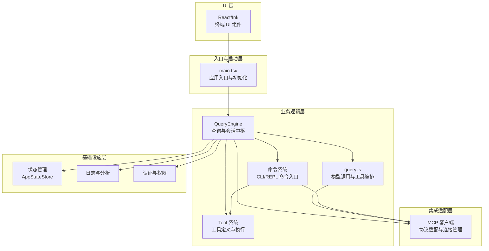
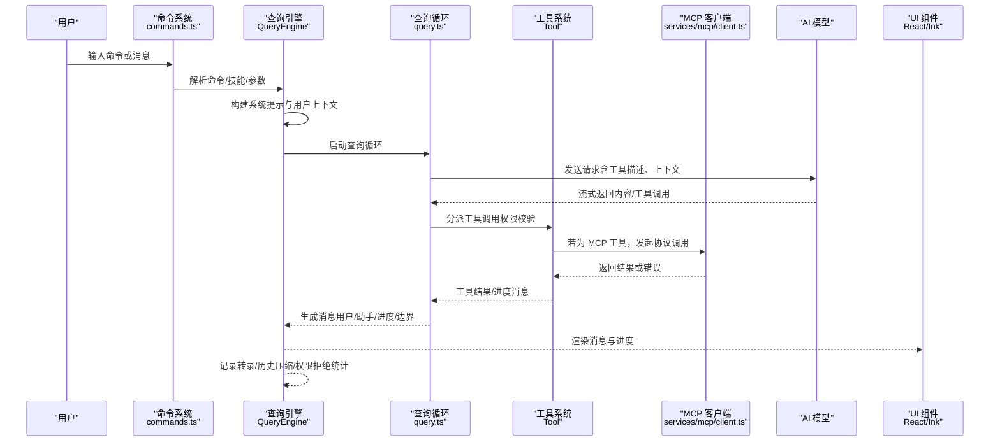
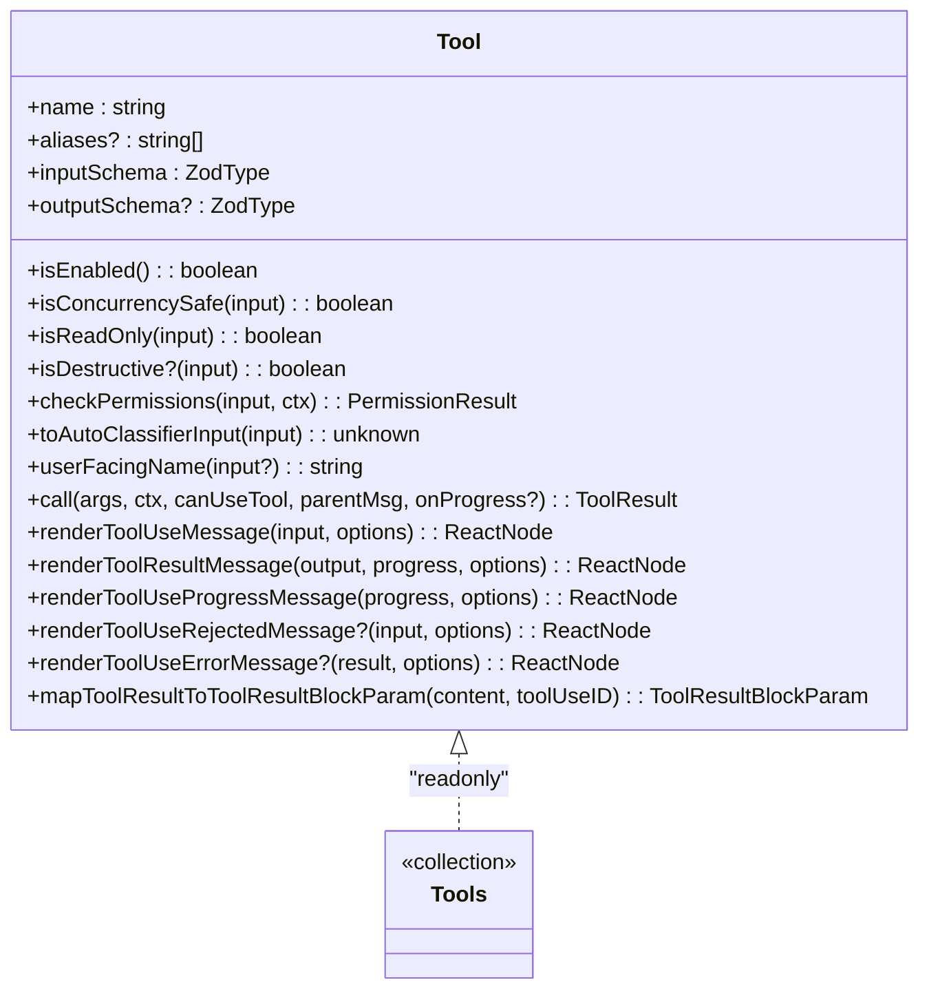
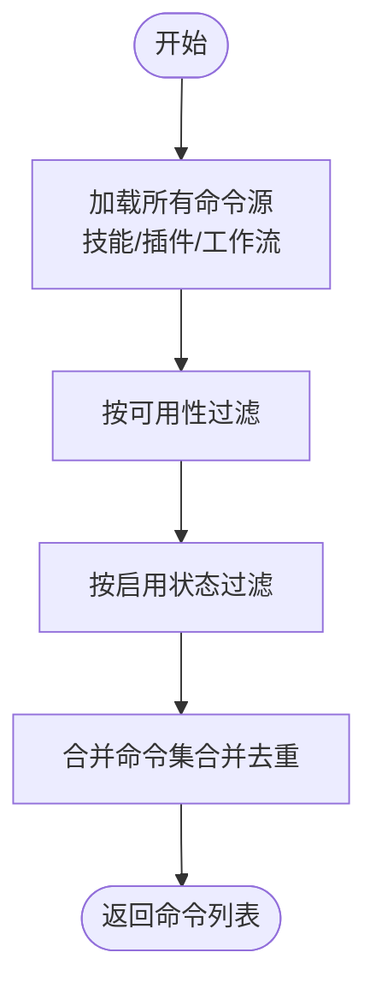
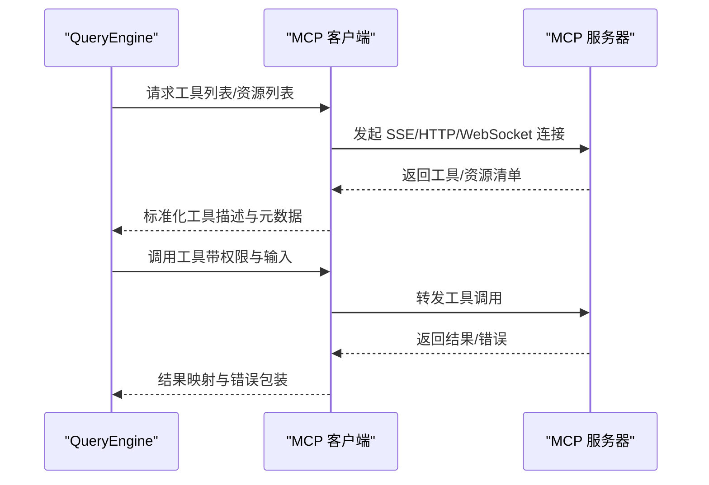
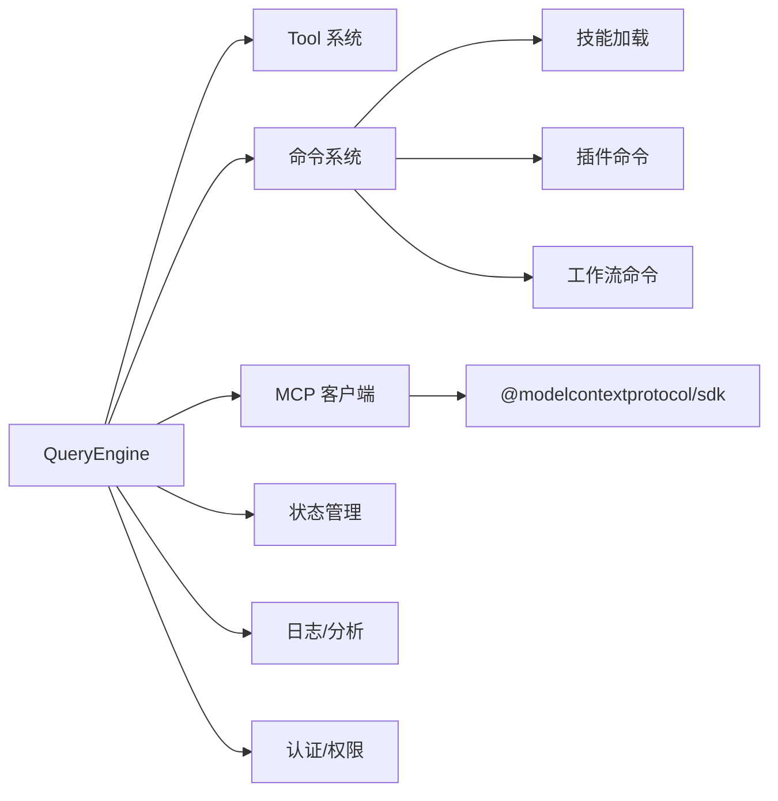

# 技术架构概览

<cite>
**本文档引用的文件**
- [src/main.tsx](file://src/main.tsx)
- [src/QueryEngine.ts](file://src/QueryEngine.ts)
- [src/Tool.ts](file://src/Tool.ts)
- [src/commands.ts](file://src/commands.ts)
- [src/query.ts](file://src/query.ts)
- [src/services/mcp/client.ts](file://src/services/mcp/client.ts)
- [src/tools.ts](file://src/tools.ts)
- [package.json](file://package.json)
</cite>

## 目录
1. [引言](#引言)
2. [项目结构](#项目结构)
3. [核心组件](#核心组件)
4. [架构总览](#架构总览)
5. [详细组件分析](#详细组件分析)
6. [依赖关系分析](#依赖关系分析)
7. [性能考量](#性能考量)
8. [故障排除指南](#故障排除指南)
9. [结论](#结论)

## 引言

本文件为 Claude Code 的技术架构概览文档，面向开发者与架构师，系统阐述项目的整体架构设计、分层与模块化组织、插件化扩展机制，以及核心组件之间的交互关系。重点围绕以下四个维度展开：

- 查询处理中心：QueryEngine 作为对话与工具调用的中枢
- 功能扩展点：Tool 系统承载内置与 MCP 工具的能力边界
- 用户交互入口：命令系统提供 CLI 与 REPL 的统一入口
- 外部集成接口：MCP 服务实现与第三方能力的协议化对接

同时，文档解释从用户输入到 AI 模型交互再到输出生成的完整数据流与控制流，并对关键技术选型（如 Bun 运行时、React/Ink UI 框架、TypeScript）进行说明与权衡分析，最后给出可扩展性设计建议与未来发展方向。

## 项目结构

Claude Code 采用多层架构与高度模块化的组织方式，主要分为以下层次：

- 入口与启动层：负责初始化、配置加载、环境准备与入口路由
- 业务逻辑层：包含查询引擎、工具系统、命令系统与会话管理
- 集成适配层：MCP 客户端、外部服务桥接与传输适配
- UI 层：基于 React/Ink 的终端交互界面
- 基础设施层：日志、分析、缓存、权限与安全策略



**图表来源**
- [src/main.tsx:585-800](file://src/main.tsx#L585-L800)
- [src/QueryEngine.ts:186-210](file://src/QueryEngine.ts#L186-L210)
- [src/query.ts:219-240](file://src/query.ts#L219-L240)
- [src/services/mcp/client.ts:596-608](file://src/services/mcp/client.ts#L596-L608)

**章节来源**
- [src/main.tsx:1-120](file://src/main.tsx#L1-L120)
- [package.json:1-166](file://package.json#L1-L166)

## 核心组件

本节聚焦四大核心组件及其职责边界与协作关系。

- QueryEngine（查询引擎）
  - 负责一次会话内的消息生命周期管理、系统提示构建、工具与命令的上下文注入、权限拦截与拒绝记录、历史压缩与转录持久化等
  - 提供 submitMessage 接口，支持异步生成器模式，逐步产出 SDK/REPL 所需的消息与状态

- Tool（工具系统）
  - 定义统一的工具抽象，包含工具元信息、输入/输出模式、并发安全、权限校验、渲染与进度展示等
  - 支持内置工具与 MCP 工具的统一装配与去重，保证提示缓存稳定性

- 命令系统（Commands）
  - 提供 CLI 与 REPL 的命令集合，支持动态技能、插件技能与工作流命令的聚合
  - 提供可用性过滤、远程模式安全命令白名单与桥接安全命令判定

- MCP 客户端（Model Context Protocol）
  - 实现 SSE/HTTP/WebSocket 等多种传输协议，负责服务器发现、认证、工具同步、资源读取与错误处理
  - 提供连接缓存、批量连接、超时与代理支持，保障跨网络与跨平台的稳定接入

**章节来源**
- [src/QueryEngine.ts:132-175](file://src/QueryEngine.ts#L132-L175)
- [src/Tool.ts:362-473](file://src/Tool.ts#L362-L473)
- [src/commands.ts:258-346](file://src/commands.ts#L258-L346)
- [src/services/mcp/client.ts:596-608](file://src/services/mcp/client.ts#L596-L608)

## 架构总览

下图展示了从用户输入到模型响应再到输出生成的完整数据流与控制流，涵盖权限检查、工具调用、MCP 协议交互与 UI 渲染的关键节点。



**图表来源**
- [src/commands.ts:476-517](file://src/commands.ts#L476-L517)
- [src/QueryEngine.ts:211-238](file://src/QueryEngine.ts#L211-L238)
- [src/query.ts:241-251](file://src/query.ts#L241-L251)
- [src/services/mcp/client.ts:596-608](file://src/services/mcp/client.ts#L596-L608)

## 详细组件分析

### QueryEngine（查询引擎）

- 角色定位
  - 会话级状态持有者与查询生命周期管理者
  - 将 ask() 中的核心逻辑抽取为独立类，支撑 SDK 与 REPL 的复用
- 关键职责
  - 系统提示构建与上下文拼装
  - 权限拦截与拒绝记录（用于 SDK 报告）
  - 历史压缩（紧凑/快照）、转录持久化与文件历史快照
  - 结果归一化与消息类型标准化
- 数据结构与复杂度
  - 维护 mutableMessages 列表，按轮次增长；紧凑/压缩操作在内存中进行，时间复杂度与消息数量线性相关
  - 权限拒绝列表用于 SDK 上报，空间开销与调用次数线性相关
- 错误处理与可观测性
  - 对孤儿权限进行一次性处理
  - 使用 headlessProfilerCheckpoint 进行关键路径计时
  - 结合成本追踪与用量统计，便于成本控制与诊断

```mermaid
classDiagram
class QueryEngine {
-config : QueryEngineConfig
-mutableMessages : Message[]
-abortController : AbortController
-permissionDenials : SDKPermissionDenial[]
-totalUsage : NonNullableUsage
+submitMessage(prompt, options) AsyncGenerator
}
class QueryEngineConfig {
+cwd : string
+tools : Tools
+commands : Command[]
+mcpClients : MCPServerConnection[]
+agents : AgentDefinition[]
+canUseTool : CanUseToolFn
+getAppState() : AppState
+setAppState(f) : void
+initialMessages? : Message[]
+readFileCache : FileStateCache
+customSystemPrompt? : string
+appendSystemPrompt? : string
+userSpecifiedModel? : string
+fallbackModel? : string
+thinkingConfig? : ThinkingConfig
+maxTurns? : number
+maxBudgetUsd? : number
+taskBudget? : { total : number }
+jsonSchema? : Record
+verbose? : boolean
+replayUserMessages? : boolean
+includePartialMessages? : boolean
+setSDKStatus? : (status) => void
+abortController? : AbortController
+orphanedPermission? : OrphanedPermission
+snipReplay? : (msg, store) => Result
}
QueryEngine --> QueryEngineConfig : "使用"
```

**图表来源**
- [src/QueryEngine.ts:132-175](file://src/QueryEngine.ts#L132-L175)
- [src/QueryEngine.ts:186-210](file://src/QueryEngine.ts#L186-L210)

**章节来源**
- [src/QueryEngine.ts:177-210](file://src/QueryEngine.ts#L177-L210)

### Tool（工具系统）

- 角色定位
  - 统一的工具抽象与执行框架，支持内置工具与 MCP 工具的无缝融合
- 关键职责
  - 工具定义与默认行为（启用、并发安全、只读/破坏性、权限校验、自动分类器输入）
  - 输入/输出模式约束（Zod 或 JSON Schema），工具结果映射与渲染
  - 进度回调、错误/拒绝 UI、群组渲染与摘要生成
- 设计要点
  - 通过 buildTool 提供默认实现，避免重复样板代码
  - 支持工具别名、搜索提示、延迟加载与始终加载策略
  - 与权限系统深度集成，提供匹配器与观察者输入回填



**图表来源**
- [src/Tool.ts:362-473](file://src/Tool.ts#L362-L473)
- [src/Tool.ts:697-701](file://src/Tool.ts#L697-L701)

**章节来源**
- [src/Tool.ts:150-175](file://src/Tool.ts#L150-L175)
- [src/Tool.ts:348-353](file://src/Tool.ts#L348-L353)

### 命令系统（Commands）

- 角色定位
  - CLI 与 REPL 的统一命令入口，聚合技能、插件与工作流命令
- 关键职责
  - 动态加载技能目录、插件技能与工作流命令，构建命令池
  - 可用性过滤（订阅/提供商要求）、启用状态检查与远程模式安全命令白名单
  - 命令查找、别名解析与描述格式化
- 设计要点
  - 使用 memoize 缓存昂贵的磁盘 I/O 与动态导入
  - 支持内置命令、技能命令、插件命令与工作流命令的统一索引与排序



**图表来源**
- [src/commands.ts:449-469](file://src/commands.ts#L449-L469)
- [src/commands.ts:476-517](file://src/commands.ts#L476-L517)

**章节来源**
- [src/commands.ts:258-346](file://src/commands.ts#L258-L346)
- [src/commands.ts:449-517](file://src/commands.ts#L449-L517)

### MCP 客户端（Model Context Protocol）

- 角色定位
  - 外部能力接入的协议适配器，支持 SSE/HTTP/WebSocket 传输
- 关键职责
  - 服务器发现、认证与授权（OAuth、会话令牌、代理与 mTLS）
  - 工具与资源同步、工具调用与结果处理、错误与超时管理
  - 连接缓存、批量连接与连接超时控制
- 设计要点
  - 传输层封装与超时信号管理，避免单次 AbortSignal 超时导致后续请求失败
  - 对 MCP Streamable HTTP 规范的 Accept 头强制规范化，确保严格服务器兼容性



**图表来源**
- [src/services/mcp/client.ts:596-608](file://src/services/mcp/client.ts#L596-L608)
- [src/services/mcp/client.ts:620-784](file://src/services/mcp/client.ts#L620-L784)

**章节来源**
- [src/services/mcp/client.ts:1-120](file://src/services/mcp/client.ts#L1-L120)
- [src/services/mcp/client.ts:493-551](file://src/services/mcp/client.ts#L493-L551)

## 依赖关系分析

- 组件耦合与内聚
  - QueryEngine 与工具系统、命令系统、MCP 客户端之间通过接口解耦，消息与上下文通过 ToolUseContext 注入
  - 工具系统与权限系统强耦合，以确保安全可控的工具调用
- 直接与间接依赖
  - QueryEngine 间接依赖状态管理（AppStateStore）、日志与分析、认证与权限模块
  - 命令系统依赖技能加载、插件命令与工作流命令的动态聚合
- 循环依赖规避
  - 通过懒加载与模块拆分避免 main.tsx 与状态管理之间的循环依赖
- 外部依赖与集成点
  - MCP 协议客户端依赖 @modelcontextprotocol/sdk，支持多种传输与认证
  - React/Ink 作为 UI 框架，与查询引擎通过消息流驱动渲染



**图表来源**
- [src/QueryEngine.ts:1-120](file://src/QueryEngine.ts#L1-L120)
- [src/commands.ts:353-398](file://src/commands.ts#L353-L398)
- [src/services/mcp/client.ts:1-40](file://src/services/mcp/client.ts#L1-L40)

**章节来源**
- [src/QueryEngine.ts:1-120](file://src/QueryEngine.ts#L1-L120)
- [src/commands.ts:353-398](file://src/commands.ts#L353-L398)
- [src/services/mcp/client.ts:1-40](file://src/services/mcp/client.ts#L1-L40)

## 性能考量

- 启动与预取
  - main.tsx 在关键路径前进行预取与并行初始化，减少首帧阻塞
  - deferred prefetches 在首次渲染后异步执行，避免抢占事件循环
- 查询循环优化
  - 自动紧凑与上下文折叠在查询前执行，降低上下文长度与 token 消耗
  - 流式工具执行器与工具结果预算控制，避免过长输出与内存膨胀
- 连接与传输
  - MCP 客户端对超时与连接进行细粒度控制，避免单次信号失效导致的持续失败
  - 批量连接与连接缓存提升多服务器场景下的吞吐与稳定性

[本节提供通用指导，无需特定文件分析]

## 故障排除指南

- 常见问题与定位
  - 权限拒绝：QueryEngine 会收集权限拒绝并上报，可通过 SDK 状态查看
  - MCP 认证失败：客户端会记录 needs-auth 并写入缓存，需重新授权
  - 工具调用错误：MCPToolCallError 包含 _meta 透传，便于 SDK 消费者保留元数据
- 诊断手段
  - 使用 headlessProfilerCheckpoint 与日志事件进行关键路径计时与问题定位
  - 通过转录持久化与文件历史快照恢复与调试

**章节来源**
- [src/QueryEngine.ts:263-274](file://src/QueryEngine.ts#L263-L274)
- [src/services/mcp/client.ts:341-362](file://src/services/mcp/client.ts#L341-L362)
- [src/services/mcp/client.ts:178-187](file://src/services/mcp/client.ts#L178-L187)

## 结论

Claude Code 采用清晰的分层架构与模块化设计，QueryEngine 作为查询处理中心，Tool 系统提供强大的功能扩展点，命令系统统一用户交互入口，MCP 服务实现外部能力的协议化集成。通过权限系统、紧凑/折叠机制与流式工具执行器，系统在安全性、性能与可扩展性之间取得良好平衡。未来发展方向可围绕：

- 更丰富的插件生态与动态加载机制
- 增强的会话记忆与上下文压缩算法
- 多模型与混合推理的编排能力
- 更完善的遥测与可观测性体系

[本节为总结性内容，无需特定文件分析]