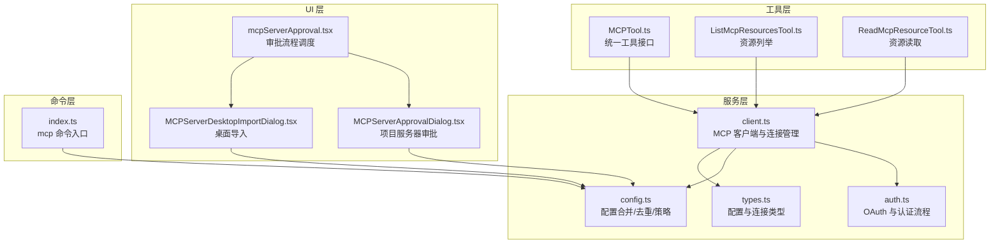
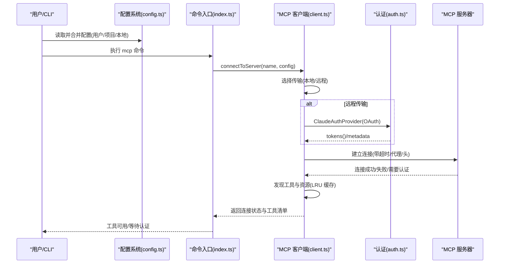
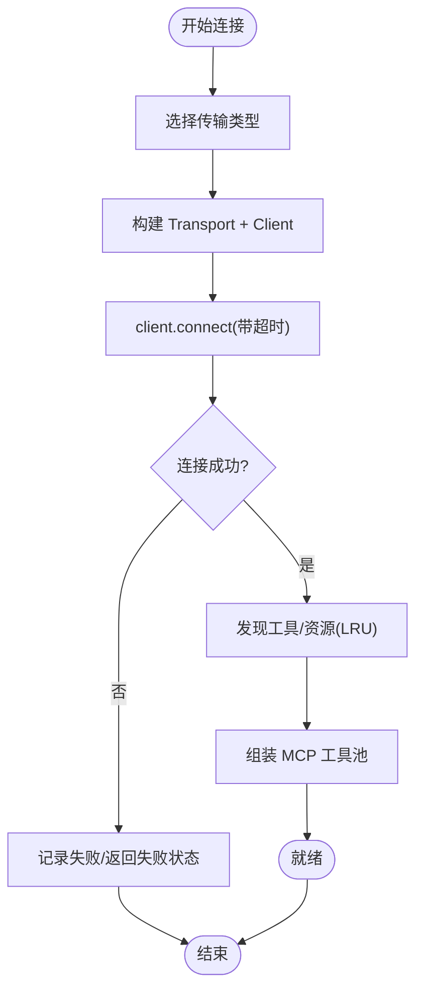
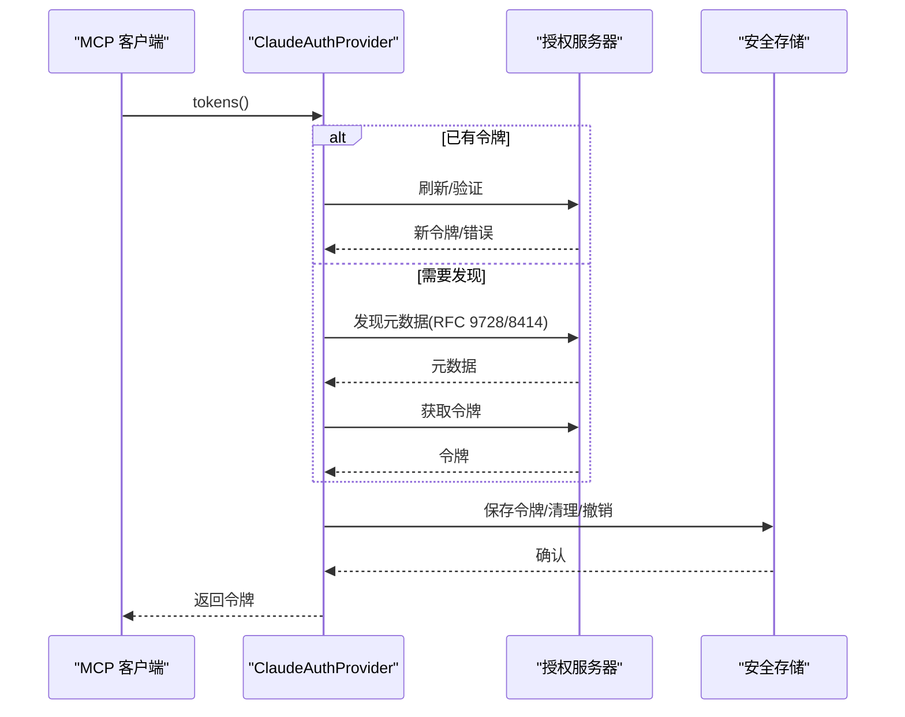
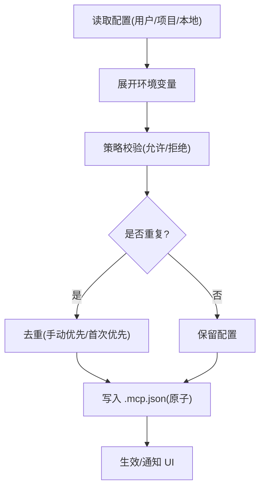
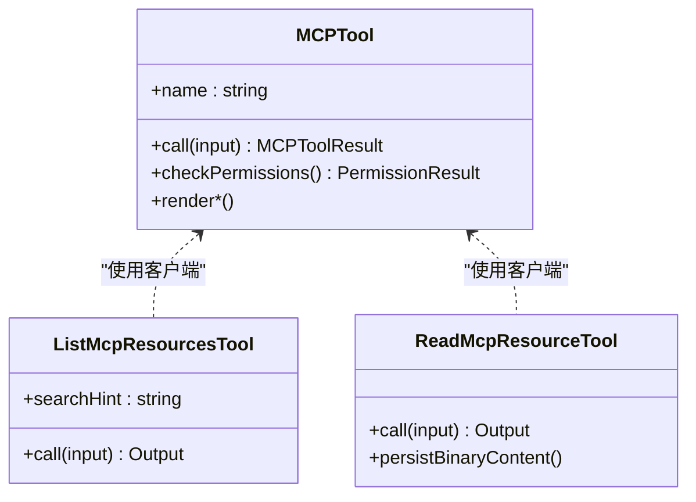
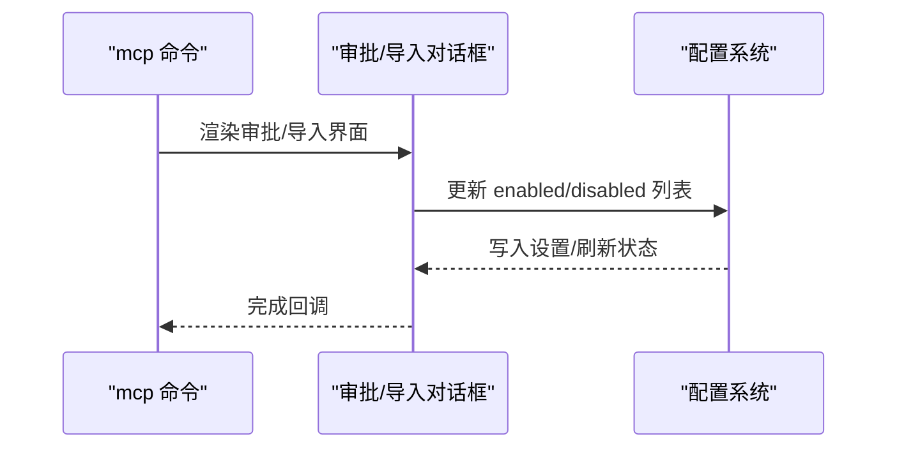
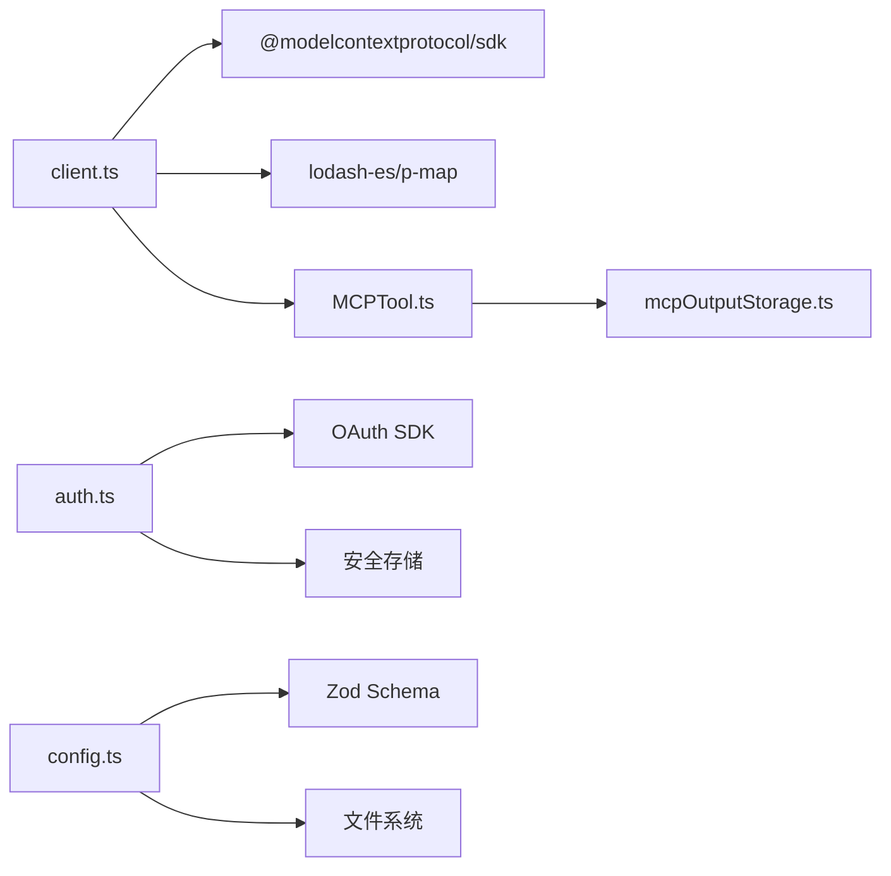

# MCP 协议支持

<cite>
**本文引用的文件**
- [mcp-protocol.mdx](file://docs/extensibility/mcp-protocol.mdx)
- [client.ts](file://src/services/mcp/client.ts)
- [auth.ts](file://src/services/mcp/auth.ts)
- [config.ts](file://src/services/mcp/config.ts)
- [types.ts](file://src/services/mcp/types.ts)
- [MCPTool.ts](file://src/tools/MCPTool/MCPTool.ts)
- [ListMcpResourcesTool.ts](file://src/tools/ListMcpResourcesTool/ListMcpResourcesTool.ts)
- [ReadMcpResourceTool.ts](file://src/tools/ReadMcpResourceTool/ReadMcpResourceTool.ts)
- [MCPServerApprovalDialog.tsx](file://src/components/MCPServerApprovalDialog.tsx)
- [MCPServerDesktopImportDialog.tsx](file://src/components/MCPServerDesktopImportDialog.tsx)
- [mcpServerApproval.tsx](file://src/services/mcpServerApproval.tsx)
- [index.ts](file://src/commands/mcp/index.ts)
</cite>

## 目录
1. [简介](#简介)
2. [项目结构](#项目结构)
3. [核心组件](#核心组件)
4. [架构总览](#架构总览)
5. [详细组件分析](#详细组件分析)
6. [依赖关系分析](#依赖关系分析)
7. [性能考量](#性能考量)
8. [故障排除指南](#故障排除指南)
9. [结论](#结论)
10. [附录](#附录)

## 简介
本文件系统性阐述 Claude Code 的 MCP（Model Context Protocol）协议支持，覆盖协议工作原理、客户端实现、服务器管理、资源管理、权限控制与安全机制、以及服务器开发与集成实践。文档以仓库源码为依据，结合架构图与流程图，帮助开发者快速理解并高效集成 MCP 生态。

## 项目结构
围绕 MCP 的代码主要分布在以下模块：
- 服务层：MCP 客户端、认证、配置合并与去重、类型定义
- 工具层：MCP 工具封装、资源列举与读取工具
- UI 层：服务器审批与导入对话框、命令入口
- 文档：协议与集成说明

图表来源
- [client.ts](file://src/services/mcp/client.ts)
- [auth.ts](file://src/services/mcp/auth.ts)
- [config.ts](file://src/services/mcp/config.ts)
- [types.ts](file://src/services/mcp/types.ts)
- [MCPTool.ts](file://src/tools/MCPTool/MCPTool.ts)
- [ListMcpResourcesTool.ts](file://src/tools/ListMcpResourcesTool/ListMcpResourcesTool.ts)
- [ReadMcpResourceTool.ts](file://src/tools/ReadMcpResourceTool/ReadMcpResourceTool.ts)
- [MCPServerApprovalDialog.tsx](file://src/components/MCPServerApprovalDialog.tsx)
- [MCPServerDesktopImportDialog.tsx](file://src/components/MCPServerDesktopImportDialog.tsx)
- [mcpServerApproval.tsx](file://src/services/mcpServerApproval.tsx)
- [index.ts](file://src/commands/mcp/index.ts)

章节来源
- [mcp-protocol.mdx](file://docs/extensibility/mcp-protocol.mdx)

## 核心组件
- MCP 客户端与连接管理：负责连接建立、传输选择、超时与重连、缓存与失效、会话过期处理、工具与资源发现、权限检查与执行链路。
- 认证与授权：基于 OAuth 的发现、刷新、撤销与跨应用访问（XAA）；远程传输的 401 处理与“需要认证”状态缓存。
- 配置与策略：多源配置合并（用户/项目/本地）、企业策略（允许/拒绝列表）、去重与签名、环境变量展开。
- 工具与资源：统一的 MCP 工具接口、资源列举与读取工具、内容截断与二进制持久化。
- UI 与命令：服务器审批与导入对话框、命令入口与批量审批流程。

章节来源
- [client.ts](file://src/services/mcp/client.ts)
- [auth.ts](file://src/services/mcp/auth.ts)
- [config.ts](file://src/services/mcp/config.ts)
- [types.ts](file://src/services/mcp/types.ts)
- [MCPTool.ts](file://src/tools/MCPTool/MCPTool.ts)
- [ListMcpResourcesTool.ts](file://src/tools/ListMcpResourcesTool/ListMcpResourcesTool.ts)
- [ReadMcpResourceTool.ts](file://src/tools/ReadMcpResourceTool/ReadMcpResourceTool.ts)
- [MCPServerApprovalDialog.tsx](file://src/components/MCPServerApprovalDialog.tsx)
- [MCPServerDesktopImportDialog.tsx](file://src/components/MCPServerDesktopImportDialog.tsx)
- [mcpServerApproval.tsx](file://src/services/mcpServerApproval.tsx)
- [index.ts](file://src/commands/mcp/index.ts)

## 架构总览
下图展示从配置到可用工具的端到端流程，涵盖连接、认证、工具发现与执行。

图表来源
- [client.ts](file://src/services/mcp/client.ts)
- [auth.ts](file://src/services/mcp/auth.ts)
- [config.ts](file://src/services/mcp/config.ts)
- [index.ts](file://src/commands/mcp/index.ts)

## 详细组件分析

### MCP 客户端与连接管理
- 传输层实现：支持 stdio、SSE、HTTP、WS、IDE 特殊传输与 claude.ai 代理，按配置分发。
- 连接缓存：使用 memoize 缓存连接对象，键由名称与序列化配置组成；连接关闭时清理工具/资源/命令缓存。
- 超时与重连：请求级超时（独立 AbortController + setTimeout），连接降级检测（连续错误计数）与自动重连；HTTP 传输检测会话过期并自动重试一次。
- 并发控制：本地服务器默认并发 3，远程服务器默认并发 20。
- 工具与资源发现：LRU 缓存（上限 20），工具描述长度限制，能力标注映射，权限检查强制走“透传”流程。
- 执行链路：确保连接有效、带 Elicitation 重试、处理图片结果与内容截断、会话过期自动重试一次。

图表来源
- [client.ts](file://src/services/mcp/client.ts)

章节来源
- [client.ts](file://src/services/mcp/client.ts)

### 认证与授权
- OAuth 发现与刷新：支持 RFC 9728 → RFC 8414 发现链，标准化非标准错误码，规范化响应体。
- 令牌撤销：优先撤销刷新令牌，再撤销访问令牌；支持 RFC 7009 兼容与回退方案。
- 远程认证失败处理：记录事件、写入 15 分钟 TTL 的“需要认证”缓存文件，避免重复弹窗。
- XAA（跨应用访问）：一次性 IdP 登录复用，RFC 8693+jwt-bearer 交换，严格错误归因与阶段标记。
- 令牌存储与清理：基于服务器键（名称+配置哈希）隔离凭据，支持保留“提升授权”状态或完全清理。

图表来源
- [auth.ts](file://src/services/mcp/auth.ts)

章节来源
- [auth.ts](file://src/services/mcp/auth.ts)

### 配置与策略
- 配置合并：用户、项目、本地三层配置合并，支持环境变量展开与签名去重。
- 企业策略：允许/拒绝列表支持名称、命令（stdio）与 URL（远程）三类条目，通配符模式匹配。
- 去重逻辑：插件与手动配置去重，手动优先；同一插件内先加载者优先；基于签名（命令/URL）判定重复。
- 写入策略：.mcp.json 原子写入（临时文件+rename），保留权限；支持动态添加/移除服务器。
- 策略过滤：对用户直接输入的配置入口进行策略校验，SDK 类型服务器豁免。

图表来源
- [config.ts](file://src/services/mcp/config.ts)
- [types.ts](file://src/services/mcp/types.ts)

章节来源
- [config.ts](file://src/services/mcp/config.ts)
- [types.ts](file://src/services/mcp/types.ts)

### 工具与资源
- 统一工具接口：MCPTool 包装 MCP 工具调用，强制权限检查（passthrough），支持 UI 渲染与结果映射。
- 资源管理：ListMcpResourcesTool 支持按服务器过滤列举；ReadMcpResourceTool 支持资源读取，拦截二进制内容持久化并替换为文件路径。
- 内容处理：大输出截断、图片缩放与持久化、结果大小限制与终端截断检测。

图表来源
- [MCPTool.ts](file://src/tools/MCPTool/MCPTool.ts)
- [ListMcpResourcesTool.ts](file://src/tools/ListMcpResourcesTool/ListMcpResourcesTool.ts)
- [ReadMcpResourceTool.ts](file://src/tools/ReadMcpResourceTool/ReadMcpResourceTool.ts)

章节来源
- [MCPTool.ts](file://src/tools/MCPTool/MCPTool.ts)
- [ListMcpResourcesTool.ts](file://src/tools/ListMcpResourcesTool/ListMcpResourcesTool.ts)
- [ReadMcpResourceTool.ts](file://src/tools/ReadMcpResourceTool/ReadMcpResourceTool.ts)

### UI 与命令
- 服务器审批：项目级 .mcp.json 发现的新服务器弹窗，支持“全部启用/仅此一次/不使用”，并写入设置。
- 桌面导入：从 Claude Desktop 导入服务器配置，处理重名冲突与批量导入。
- 批量审批：启动时扫描待审批服务器，单个或批量弹窗，完成后继续初始化。
- 命令入口：mcp 子命令用于管理 MCP 服务器，参数提示与延迟加载。

图表来源
- [MCPServerApprovalDialog.tsx](file://src/components/MCPServerApprovalDialog.tsx)
- [MCPServerDesktopImportDialog.tsx](file://src/components/MCPServerDesktopImportDialog.tsx)
- [mcpServerApproval.tsx](file://src/services/mcpServerApproval.tsx)
- [index.ts](file://src/commands/mcp/index.ts)

章节来源
- [MCPServerApprovalDialog.tsx](file://src/components/MCPServerApprovalDialog.tsx)
- [MCPServerDesktopImportDialog.tsx](file://src/components/MCPServerDesktopImportDialog.tsx)
- [mcpServerApproval.tsx](file://src/services/mcpServerApproval.tsx)
- [index.ts](file://src/commands/mcp/index.ts)

## 依赖关系分析
- 客户端依赖：@modelcontextprotocol/sdk（Client/Transport/类型），lodash-es（memoize/LRU），p-map（并发），内部工具与存储模块。
- 认证依赖：OAuth SDK（发现/刷新/错误），安全存储（凭据持久化），浏览器打开与端口分配。
- 配置依赖：Zod（Schema 校验），文件系统（.mcp.json 原子写入），策略设置（允许/拒绝列表）。
- 工具依赖：统一工具接口与渲染管线，二进制持久化与内容截断工具。

图表来源
- [client.ts](file://src/services/mcp/client.ts)
- [auth.ts](file://src/services/mcp/auth.ts)
- [config.ts](file://src/services/mcp/config.ts)
- [MCPTool.ts](file://src/tools/MCPTool/MCPTool.ts)

章节来源
- [client.ts](file://src/services/mcp/client.ts)
- [auth.ts](file://src/services/mcp/auth.ts)
- [config.ts](file://src/services/mcp/config.ts)
- [MCPTool.ts](file://src/tools/MCPTool/MCPTool.ts)

## 性能考量
- 连接缓存与批量去重：减少重复连接与发现开销，降低 UI 响应延迟。
- 请求级超时：避免单次 AbortSignal 超时导致的 GC 延迟问题，提升高并发下的稳定性。
- 并发控制：本地服务器限制并发，远程服务器放宽并发，平衡资源占用与吞吐。
- LRU 缓存：工具与资源发现缓存上限 20，避免频繁网络请求。
- 内容截断与二进制持久化：控制上下文大小，避免大体积输出影响模型性能。

## 故障排除指南
- 连接失败
  - 检查超时与代理设置，确认网络可达与端口开放。
  - 查看连接降级计数与错误日志，必要时手动重连。
- 401 未授权
  - 远程传输触发“需要认证”状态，检查 OAuth 配置与令牌有效性；查看 15 分钟缓存文件避免重复弹窗。
  - 对 claude.ai 代理，确认 OAuth 令牌刷新与重试逻辑。
- 会话过期
  - HTTP 传输可能返回“会话未找到”错误，触发自动重试一次；确保连接缓存被正确清理并重建。
- 工具/资源异常
  - 工具描述过长会被截断，检查 MCP 服务器描述生成；资源读取二进制内容会持久化到磁盘，注意磁盘空间。
- 权限与策略
  - 企业策略可能导致服务器被拒绝，检查允许/拒绝列表与签名匹配；手动配置优先于插件与连接器。

章节来源
- [client.ts](file://src/services/mcp/client.ts)
- [auth.ts](file://src/services/mcp/auth.ts)
- [config.ts](file://src/services/mcp/config.ts)

## 结论
Claude Code 的 MCP 支持在架构上实现了“统一客户端 + 多传输 + 企业策略 + 安全认证”的闭环：既保证了与 MCP 生态的兼容性，又兼顾了企业级安全与性能需求。通过连接缓存、LRU 发现、并发控制与内容截断等机制，系统在复杂场景下仍能保持稳定与高效。建议在集成时遵循配置策略、最小权限原则与安全最佳实践，充分利用 UI 审批与命令入口提升用户体验。

## 附录

### MCP 协议与集成要点
- 传输层：stdio（本地子进程）、SSE/HTTP（远程流式）、WS（WebSocket）、IDE 特殊传输、claude.ai 代理。
- 连接与认证：按需发现 OAuth 元数据，支持刷新与撤销；远程 401 进入“需要认证”状态并缓存。
- 工具与资源：统一工具接口，工具描述长度限制，资源读取二进制持久化；权限检查强制 passthrough。
- 企业策略：允许/拒绝列表支持名称/命令/URL 三类条目，通配符匹配；去重与签名保障一致性。

章节来源
- [mcp-protocol.mdx](file://docs/extensibility/mcp-protocol.mdx)