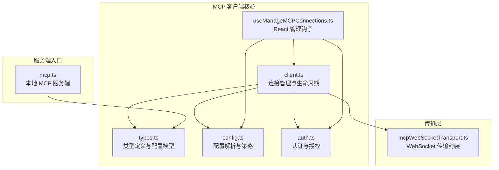
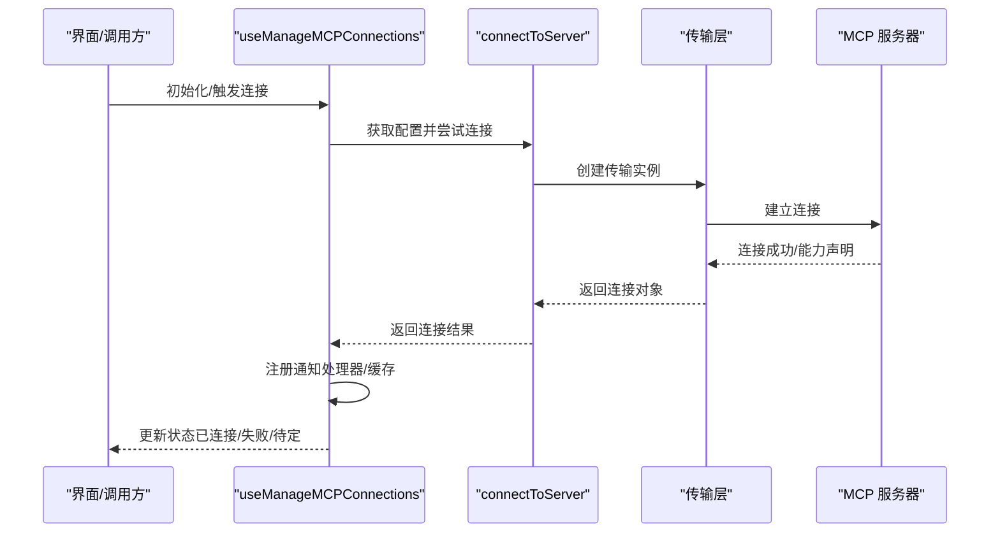
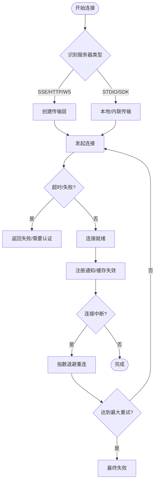
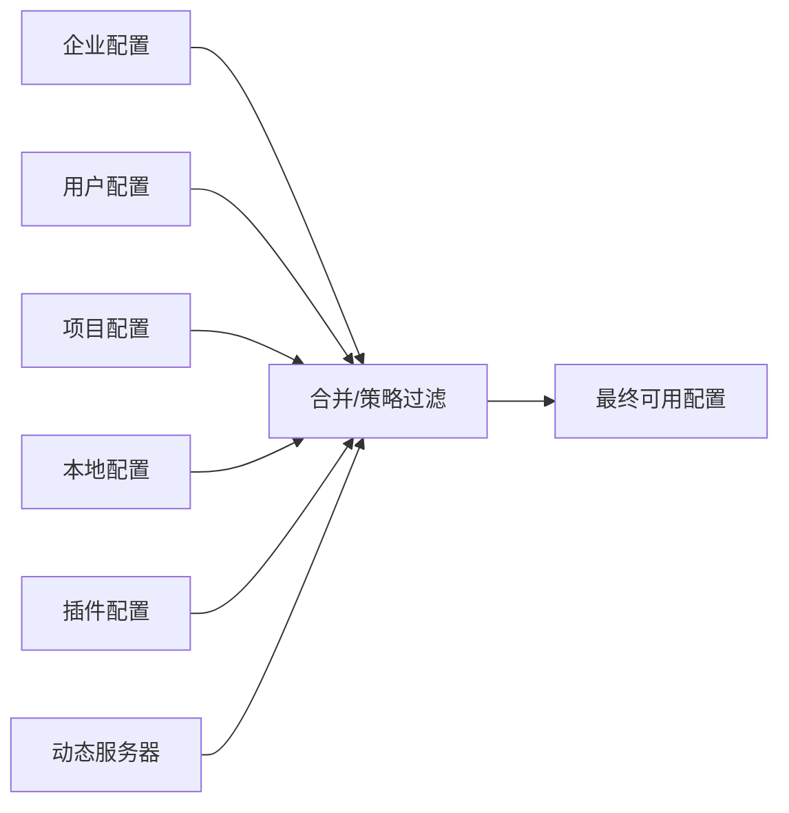
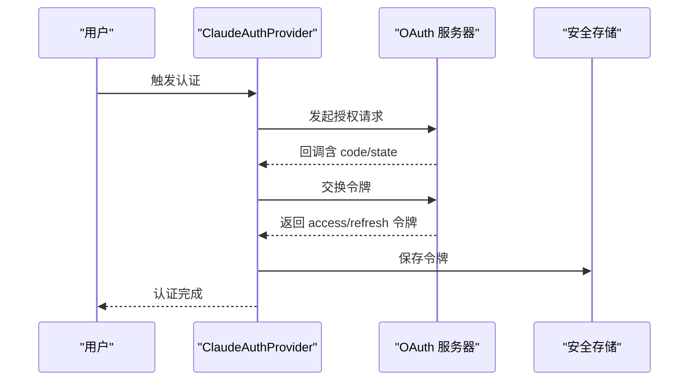
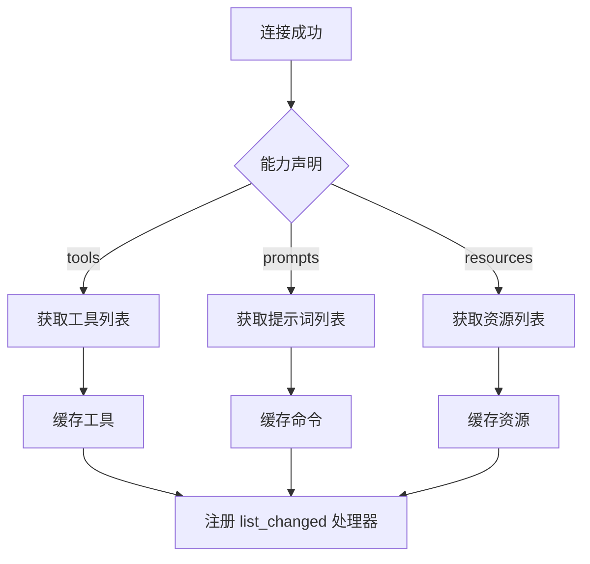
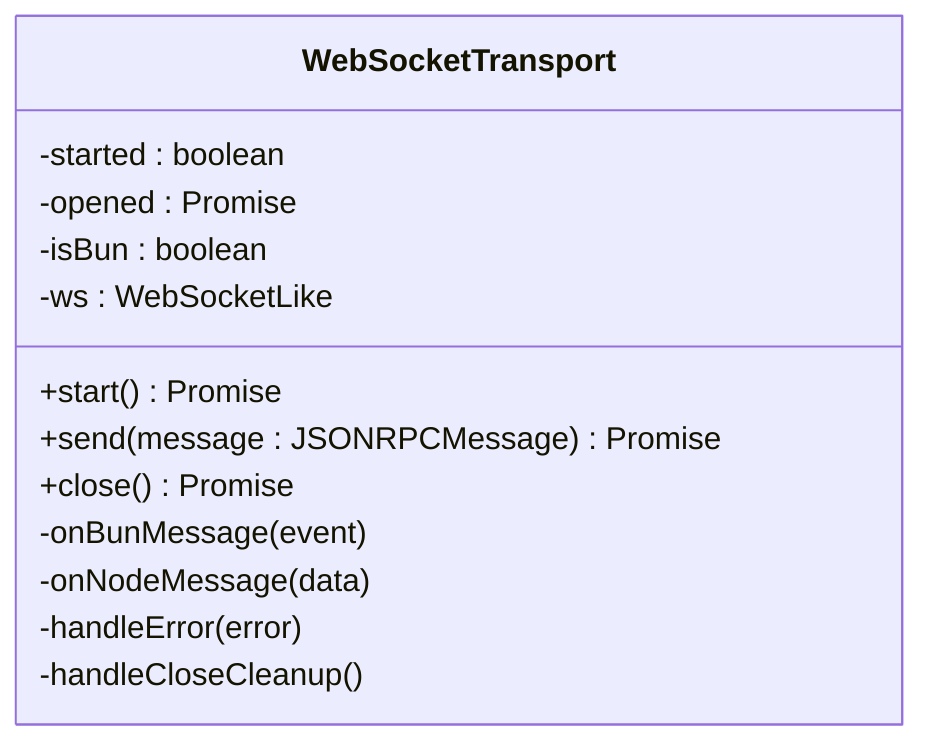
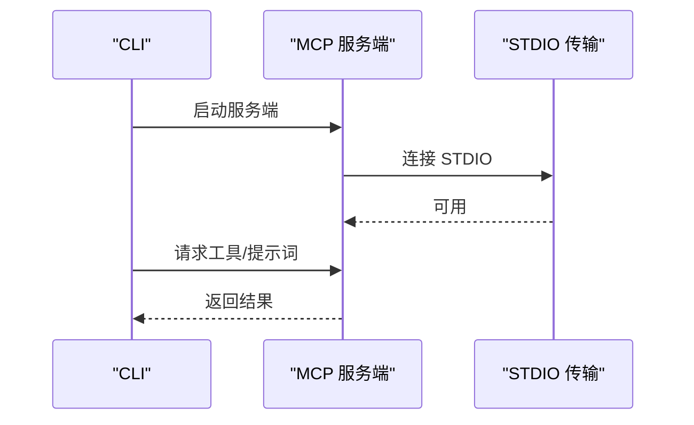
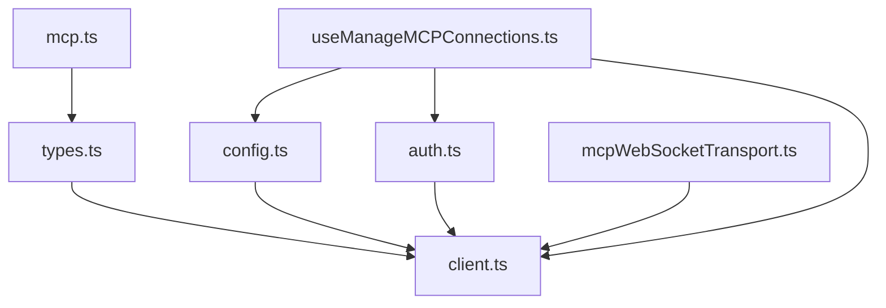

# MCP 客户端架构

<cite>
**本文档引用的文件**
- [client.ts](file://src/services/mcp/client.ts)
- [types.ts](file://src/services/mcp/types.ts)
- [config.ts](file://src/services/mcp/config.ts)
- [auth.ts](file://src/services/mcp/auth.ts)
- [useManageMCPConnections.ts](file://src/services/mcp/useManageMCPConnections.ts)
- [mcpWebSocketTransport.ts](file://src/utils/mcpWebSocketTransport.ts)
- [mcp.ts](file://src/entrypoints/mcp.ts)
</cite>

## 目录
1. [引言](#引言)
2. [项目结构](#项目结构)
3. [核心组件](#核心组件)
4. [架构总览](#架构总览)
5. [详细组件分析](#详细组件分析)
6. [依赖关系分析](#依赖关系分析)
7. [性能考虑](#性能考虑)
8. [故障排除指南](#故障排除指南)
9. [结论](#结论)

## 引言

本文档深入解析 MCP（Model Context Protocol）客户端架构，涵盖连接管理器设计模式、客户端生命周期管理、连接池实现、初始化流程、连接建立过程、断线重连机制、超时处理、通信协议、状态管理、配置选项与最佳实践等内容。通过代码级分析与可视化图示，帮助开发者理解并高效使用 MCP 客户端。

## 项目结构

MCP 客户端相关代码主要位于 `src/services/mcp` 目录下，包含连接管理、配置解析、认证授权、工具与资源发现、通知处理等功能模块；同时在 `src/utils` 下提供传输层封装（如 WebSocket 传输），在 `src/entrypoints` 下提供 MCP 服务端入口。

**图表来源**
- [client.ts](file://src/services/mcp/client.ts)
- [types.ts](file://src/services/mcp/types.ts)
- [config.ts](file://src/services/mcp/config.ts)
- [auth.ts](file://src/services/mcp/auth.ts)
- [useManageMCPConnections.ts](file://src/services/mcp/useManageMCPConnections.ts)
- [mcpWebSocketTransport.ts](file://src/utils/mcpWebSocketTransport.ts)
- [mcp.ts](file://src/entrypoints/mcp.ts)

**章节来源**
- [client.ts](file://src/services/mcp/client.ts)
- [types.ts](file://src/services/mcp/types.ts)
- [config.ts](file://src/services/mcp/config.ts)
- [auth.ts](file://src/services/mcp/auth.ts)
- [useManageMCPConnections.ts](file://src/services/mcp/useManageMCPConnections.ts)
- [mcpWebSocketTransport.ts](file://src/utils/mcpWebSocketTransport.ts)
- [mcp.ts](file://src/entrypoints/mcp.ts)

## 核心组件

- 连接管理器：负责服务器连接、缓存、错误处理与自动重连。
- 配置系统：解析与合并多源配置，支持企业策略与插件注入。
- 认证授权：OAuth 流程、令牌刷新、跨应用访问（XAA）。
- 工具与资源发现：从服务器获取工具、提示词与资源列表，并进行缓存与变更通知。
- 传输层：统一 WebSocket、HTTP、SSE、STDIO 等传输抽象。
- React 管理钩子：批量更新状态、处理通知、权限与通道控制。

**章节来源**
- [client.ts](file://src/services/mcp/client.ts)
- [config.ts](file://src/services/mcp/config.ts)
- [auth.ts](file://src/services/mcp/auth.ts)
- [useManageMCPConnections.ts](file://src/services/mcp/useManageMCPConnections.ts)
- [mcpWebSocketTransport.ts](file://src/utils/mcpWebSocketTransport.ts)

## 架构总览

MCP 客户端采用“连接管理器 + 多传输适配 + 状态管理”的分层架构。连接管理器基于 @modelcontextprotocol/sdk 的 Client 抽象，按服务器类型选择合适的传输层（WebSocket、HTTP、SSE、STDIO），并在连接成功后注册通知处理器与缓存失效逻辑。React 管理钩子负责批量更新应用状态、处理断线重连与通知事件。

**图表来源**
- [useManageMCPConnections.ts](file://src/services/mcp/useManageMCPConnections.ts)
- [client.ts](file://src/services/mcp/client.ts)
- [mcpWebSocketTransport.ts](file://src/utils/mcpWebSocketTransport.ts)

**章节来源**
- [useManageMCPConnections.ts](file://src/services/mcp/useManageMCPConnections.ts)
- [client.ts](file://src/services/mcp/client.ts)

## 详细组件分析

### 连接管理器与生命周期

连接管理器负责：
- 服务器类型识别与传输选择（SSE、WS、HTTP、STDIO、SDK、IDE 类型）。
- 连接超时控制与错误分类（Unauthorized、网络异常、会话过期）。
- 断线检测与自动重连（指数退避，最大重试次数）。
- 缓存清理与重新获取工具/资源（确保会话切换或缓存失效后数据一致）。
- 生命周期钩子（onerror/onclose）与清理逻辑（进程信号、资源释放）。

**图表来源**
- [client.ts](file://src/services/mcp/client.ts)
- [useManageMCPConnections.ts](file://src/services/mcp/useManageMCPConnections.ts)

**章节来源**
- [client.ts](file://src/services/mcp/client.ts)
- [useManageMCPConnections.ts](file://src/services/mcp/useManageMCPConnections.ts)

### 配置系统与策略

配置系统支持多源合并与策略过滤：
- 多源配置：企业配置、用户配置、项目配置、本地配置、插件配置。
- 策略过滤：允许/拒绝列表、名称/命令/URL 匹配、插件仅模式。
- 签名去重：避免重复连接相同服务器（命令/URL 签名）。
- 动态服务器：运行时动态注入的服务器（scope: dynamic）。

**图表来源**
- [config.ts](file://src/services/mcp/config.ts)

**章节来源**
- [config.ts](file://src/services/mcp/config.ts)

### 认证与授权

认证流程覆盖标准 OAuth 与跨应用访问（XAA）：
- OAuth：发现元数据、生成 state、启动回调服务器、交换令牌、保存令牌。
- 步进提升（Step-up）：检测 insufficient_scope 并触发重新授权。
- XAA：共享 IdP 令牌，静默交换获取访问令牌。
- 令牌刷新与撤销：支持刷新与服务端撤销，清理本地存储。

**图表来源**
- [auth.ts](file://src/services/mcp/auth.ts)

**章节来源**
- [auth.ts](file://src/services/mcp/auth.ts)

### 工具与资源发现

连接成功后，客户端会根据服务器能力：
- 获取工具列表并转换为内部 Tool 结构。
- 获取提示词列表并转换为命令。
- 获取资源列表并附加服务器标识。
- 注册 list_changed 通知处理器，自动刷新缓存。

**图表来源**
- [client.ts](file://src/services/mcp/client.ts)

**章节来源**
- [client.ts](file://src/services/mcp/client.ts)

### 传输层抽象

传输层对 WebSocket 提供统一接口，屏蔽平台差异（Bun 原生 vs ws 包），并处理消息解析、错误与关闭事件。

**图表来源**
- [mcpWebSocketTransport.ts](file://src/utils/mcpWebSocketTransport.ts)

**章节来源**
- [mcpWebSocketTransport.ts](file://src/utils/mcpWebSocketTransport.ts)

### 服务端入口（本地 MCP）

本地 MCP 服务端通过 STDIO 传输暴露工具与提示词，便于在本地开发环境中测试 MCP 客户端。

**图表来源**
- [mcp.ts](file://src/entrypoints/mcp.ts)

**章节来源**
- [mcp.ts](file://src/entrypoints/mcp.ts)

## 依赖关系分析

MCP 客户端各模块之间的依赖关系如下：

**图表来源**
- [client.ts](file://src/services/mcp/client.ts)
- [types.ts](file://src/services/mcp/types.ts)
- [config.ts](file://src/services/mcp/config.ts)
- [auth.ts](file://src/services/mcp/auth.ts)
- [mcpWebSocketTransport.ts](file://src/utils/mcpWebSocketTransport.ts)
- [useManageMCPConnections.ts](file://src/services/mcp/useManageMCPConnections.ts)
- [mcp.ts](file://src/entrypoints/mcp.ts)

**章节来源**
- [client.ts](file://src/services/mcp/client.ts)
- [types.ts](file://src/services/mcp/types.ts)
- [config.ts](file://src/services/mcp/config.ts)
- [auth.ts](file://src/services/mcp/auth.ts)
- [mcpWebSocketTransport.ts](file://src/utils/mcpWebSocketTransport.ts)
- [useManageMCPConnections.ts](file://src/services/mcp/useManageMCPConnections.ts)
- [mcp.ts](file://src/entrypoints/mcp.ts)

## 性能考虑

- 连接缓存：使用 memoize 缓存连接与工具/资源获取，避免重复连接与网络请求。
- 批量并发：按服务器类型分组并发连接（本地与远程分别限流），提升启动速度。
- 超时控制：独立的请求超时与连接超时，防止长时间阻塞。
- 传输优化：WebSocket 传输统一事件处理与关闭清理，减少内存泄漏风险。
- 缓存失效：针对 list_changed 通知精确失效缓存，避免全量刷新。

[本节为通用指导，无需特定文件引用]

## 故障排除指南

常见问题与排查要点：
- 连接超时：检查网络代理、目标地址可达性、环境变量 MCP_TIMEOUT。
- 401 未授权：确认 OAuth 配置、令牌是否过期或被撤销；查看 needs-auth 状态与缓存。
- 会话过期：HTTP 服务器返回 404 + JSON-RPC -32001 时，客户端会主动清理缓存并触发重连。
- 断线重连：观察指数退避日志，确认服务器是否支持自动重连（非 STDIO/SDK）。
- WebSocket 错误：检查 readyState、错误事件与关闭事件，确保传输层正确清理监听器。
- 插件冲突：启用企业配置或插件仅模式时，检查签名去重与策略过滤结果。

**章节来源**
- [client.ts](file://src/services/mcp/client.ts)
- [useManageMCPConnections.ts](file://src/services/mcp/useManageMCPConnections.ts)
- [mcpWebSocketTransport.ts](file://src/utils/mcpWebSocketTransport.ts)

## 结论

MCP 客户端架构通过清晰的模块划分与传输抽象，实现了对多种服务器类型的统一接入与高效管理。其连接管理器、配置系统、认证授权与状态管理共同构成了稳定可靠的客户端框架。遵循本文档的最佳实践与故障排除建议，可显著提升 MCP 客户端的稳定性与性能表现。