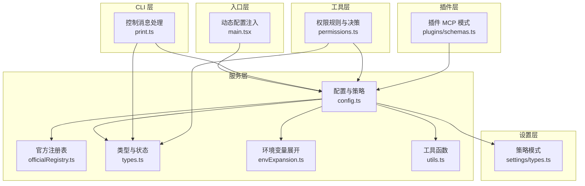
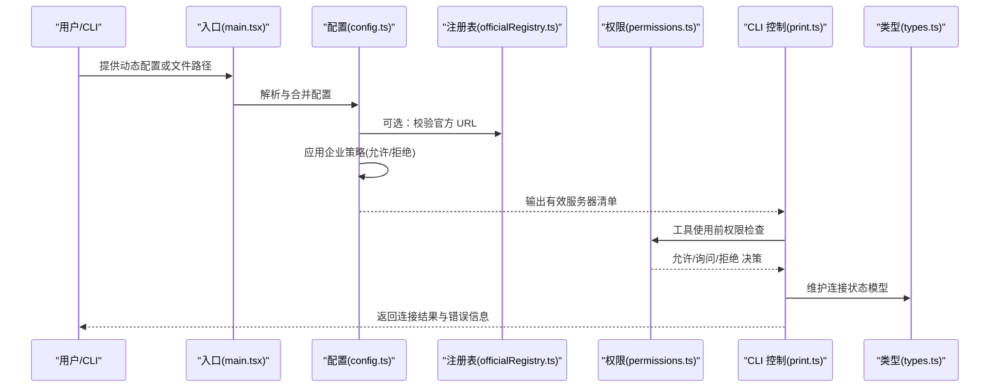
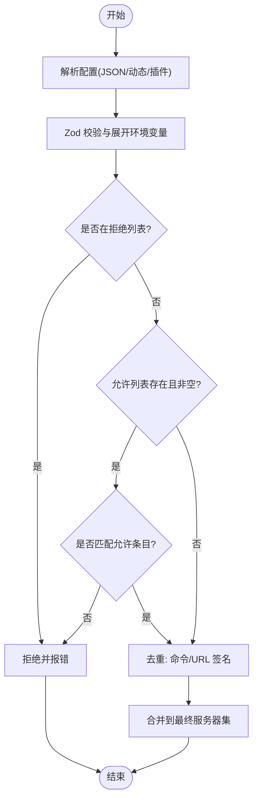
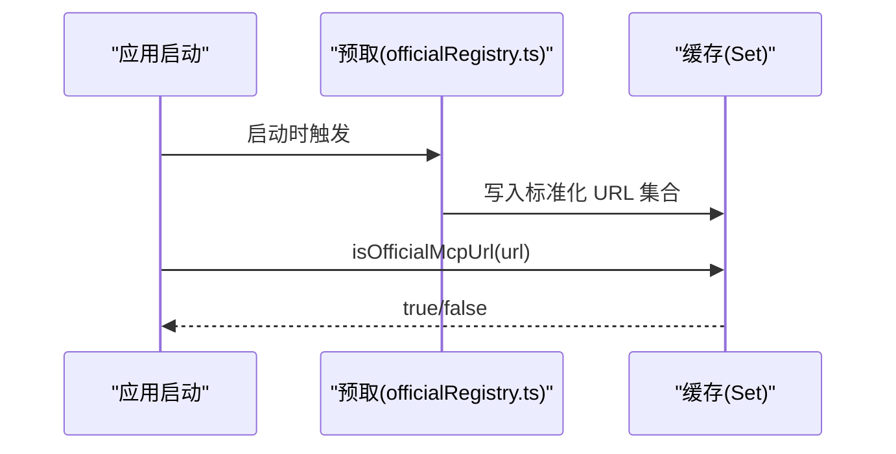
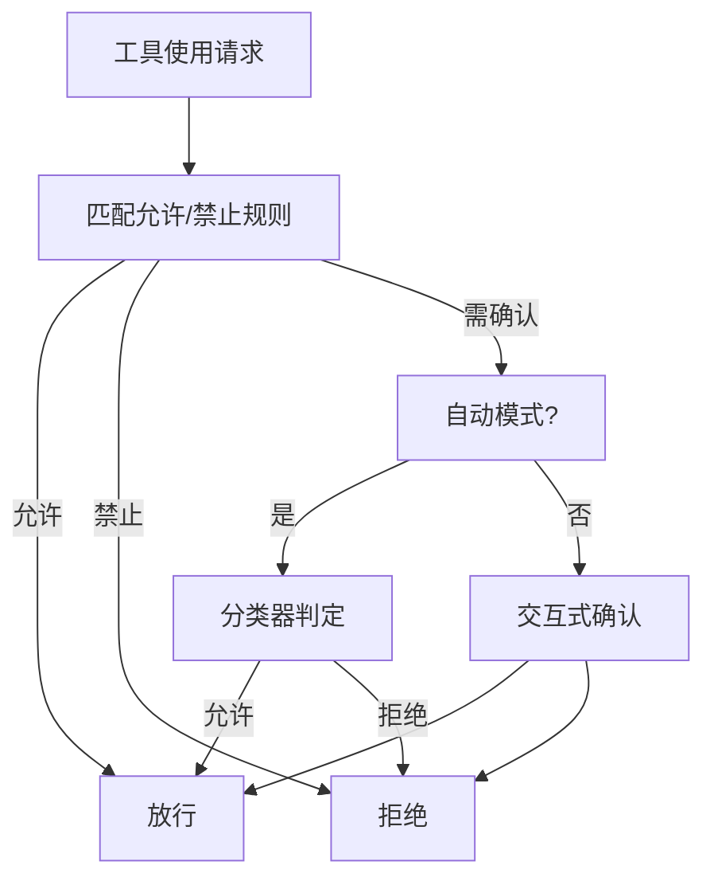
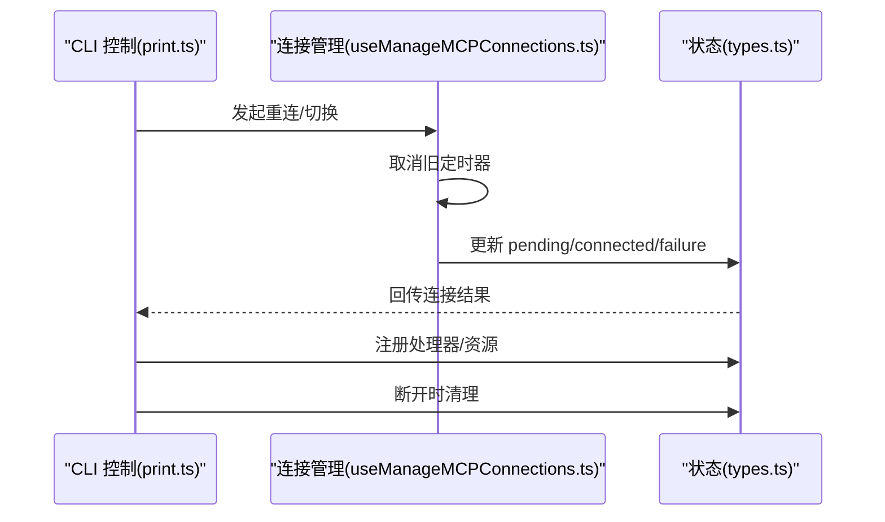
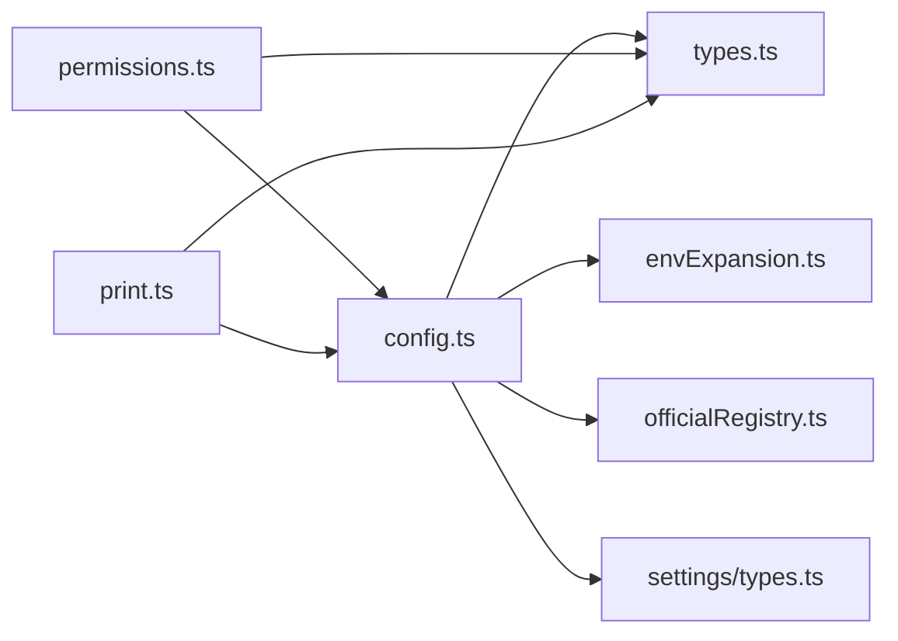

# MCP 服务器管理

<cite>
**本文引用的文件**
- [config.ts](file://src/services/mcp/config.ts)
- [officialRegistry.ts](file://src/services/mcp/officialRegistry.ts)
- [types.ts](file://src/services/mcp/types.ts)
- [envExpansion.ts](file://src/services/mcp/envExpansion.ts)
- [utils.ts](file://src/services/mcp/utils.ts)
- [permissions.ts](file://src/utils/permissions/permissions.ts)
- [print.ts](file://src/cli/print.ts)
- [useManageMCPConnections.ts](file://src/services/mcp/useManageMCPConnections.ts)
- [main.tsx](file://src/main.tsx)
- [schemas.ts](file://src/utils/plugins/schemas.ts)
- [types.ts](file://src/utils/settings/types.ts)
</cite>

## 目录
1. [简介](#简介)
2. [项目结构](#项目结构)
3. [核心组件](#核心组件)
4. [架构总览](#架构总览)
5. [详细组件分析](#详细组件分析)
6. [依赖关系分析](#依赖关系分析)
7. [性能考量](#性能考量)
8. [故障排除指南](#故障排除指南)
9. [结论](#结论)
10. [附录](#附录)

## 简介
本文件系统性阐述 MCP（Model Context Protocol）服务器在本项目的管理机制，覆盖以下主题：
- 服务器配置文件格式、配置项说明与默认值
- 官方服务器注册表的实现与信任校验
- 企业级通道白名单与黑名单策略
- 通道权限管理与工具级权限控制
- 服务器连接生命周期：建立、维护与清理
- 实用示例、权限设置指南与常见问题排查

## 项目结构
围绕 MCP 的关键模块分布于服务层与工具层：
- 服务层（src/services/mcp）：配置解析与合并、策略过滤、环境变量展开、连接状态模型、URL 规范化与去重
- 工具层（src/utils/permissions）：工具使用权限规则、MCP 工具匹配与决策流
- CLI 层（src/cli/print.ts）：通道启用、认证、状态同步等控制消息处理
- 入口层（src/main.tsx）：动态配置注入与初始解析
- 插件层（src/utils/plugins/schemas.ts）：插件提供的 MCP 服务器配置来源
- 设置层（src/utils/settings/types.ts）：允许/拒绝列表的企业策略

图表来源
- [config.ts:1-1580](file://src/services/mcp/config.ts#L1-L1580)
- [officialRegistry.ts:1-73](file://src/services/mcp/officialRegistry.ts#L1-L73)
- [types.ts:1-259](file://src/services/mcp/types.ts#L1-L259)
- [envExpansion.ts:1-39](file://src/services/mcp/envExpansion.ts#L1-L39)
- [utils.ts:1-576](file://src/services/mcp/utils.ts#L1-L576)
- [permissions.ts:1-1487](file://src/utils/permissions/permissions.ts#L1-L1487)
- [print.ts:3277-3310](file://src/cli/print.ts#L3277-L3310)
- [main.tsx:1413-1422](file://src/main.tsx#L1413-L1422)
- [schemas.ts:537-572](file://src/utils/plugins/schemas.ts#L537-L572)
- [types.ts:111-158](file://src/utils/settings/types.ts#L111-L158)

章节来源
- [config.ts:1-1580](file://src/services/mcp/config.ts#L1-L1580)
- [types.ts:1-259](file://src/services/mcp/types.ts#L1-L259)

## 核心组件
- 配置解析与策略过滤：负责解析 .mcp.json、动态参数与插件来源，执行企业策略（允许/拒绝列表），并生成最终可用的服务器集合
- 官方注册表：拉取并缓存官方 MCP 服务器 URL，用于信任校验与去重
- 权限系统：对工具使用进行规则匹配与自动/交互式决策，支持 MCP 工具级别的细粒度控制
- 连接状态模型：统一描述连接中、失败、待认证、待连接、禁用等状态，并提供清理回调
- 环境变量展开：在配置加载阶段展开 ${VAR} 与 ${VAR:-default} 语法，报告缺失变量
- 工具函数：命令/资源/提示过滤、哈希去重、URL 规范化、作用域描述等

章节来源
- [config.ts:618-761](file://src/services/mcp/config.ts#L618-L761)
- [officialRegistry.ts:33-68](file://src/services/mcp/officialRegistry.ts#L33-L68)
- [permissions.ts:233-302](file://src/utils/permissions/permissions.ts#L233-L302)
- [types.ts:180-227](file://src/services/mcp/types.ts#L180-L227)
- [envExpansion.ts:10-38](file://src/services/mcp/envExpansion.ts#L10-L38)
- [utils.ts:151-224](file://src/services/mcp/utils.ts#L151-L224)

## 架构总览
下图展示 MCP 服务器从“配置输入”到“连接与权限”的整体流程。

图表来源
- [main.tsx:1413-1422](file://src/main.tsx#L1413-L1422)
- [config.ts:618-761](file://src/services/mcp/config.ts#L618-L761)
- [officialRegistry.ts:33-68](file://src/services/mcp/officialRegistry.ts#L33-L68)
- [permissions.ts:473-501](file://src/utils/permissions/permissions.ts#L473-L501)
- [print.ts:3277-3310](file://src/cli/print.ts#L3277-L3310)
- [types.ts:180-227](file://src/services/mcp/types.ts#L180-L227)

## 详细组件分析

### 配置管理与策略过滤
- 配置来源与合并
  - 支持 .mcp.json、用户/项目/本地/动态/企业/claude.ai 等多源配置
  - 插件可提供内联或外部 MCPB 文件形式的服务器配置
  - 动态配置通过命令行注入，经解析后与其它来源合并
- 策略过滤
  - 企业策略包含“允许列表”和“拒绝列表”，支持按名称、命令数组、URL 模式匹配
  - 当 allowManagedMcpServersOnly 开启时，仅受托管策略控制
  - SDK 类型服务器不受 URL/命令策略影响，但会参与去重与名称匹配
- 去重与签名
  - 基于命令数组或规范化 URL 计算签名，避免重复连接同一底层进程/地址
  - 手动配置优先于插件与 claude.ai 连接器
- 环境变量展开
  - 在配置解析阶段展开 ${VAR} 与 ${VAR:-default}，记录缺失变量以便诊断
- 错误处理
  - 对无效配置、文件读取失败、策略拒绝等情况抛出明确错误

图表来源
- [config.ts:618-761](file://src/services/mcp/config.ts#L618-L761)
- [config.ts:364-508](file://src/services/mcp/config.ts#L364-L508)
- [config.ts:223-266](file://src/services/mcp/config.ts#L223-L266)
- [envExpansion.ts:10-38](file://src/services/mcp/envExpansion.ts#L10-L38)

章节来源
- [config.ts:618-761](file://src/services/mcp/config.ts#L618-L761)
- [config.ts:364-508](file://src/services/mcp/config.ts#L364-L508)
- [config.ts:223-266](file://src/services/mcp/config.ts#L223-L266)
- [envExpansion.ts:10-38](file://src/services/mcp/envExpansion.ts#L10-L38)
- [schemas.ts:537-572](file://src/utils/plugins/schemas.ts#L537-L572)
- [main.tsx:1413-1422](file://src/main.tsx#L1413-L1422)

### 官方服务器注册表与信任校验
- 注册表拉取
  - 异步获取官方 MCP 服务器列表，提取每个服务器的远程 URL 并标准化（去除查询串与尾部斜杠）
  - 使用 Set 存储以 O(1) 查找
- 信任判断
  - isOfficialMcpUrl 接收已标准化 URL，返回布尔值；未加载完成时采用 fail-closed 策略
- 与策略结合
  - 可用于 URL 模式匹配的“允许/拒绝”条目，或作为 UI/日志中的信任标识

图表来源
- [officialRegistry.ts:33-68](file://src/services/mcp/officialRegistry.ts#L33-L68)

章节来源
- [officialRegistry.ts:33-68](file://src/services/mcp/officialRegistry.ts#L33-L68)

### 通道白名单与黑名单策略
- 允许/拒绝列表
  - 支持三种匹配维度：serverName、serverCommand（stdio）、serverUrl（远程）
  - 三者互斥，单条目必须且仅能指定其一
- 策略优先级
  - 拒绝列表优先于允许列表
  - 允许列表为空表示“默认拒绝”
- 与企业策略联动
  - allowManagedMcpServersOnly 开启时，仅使用托管策略来源
  - 拒绝列表始终合并所有来源

章节来源
- [types.ts:111-158](file://src/utils/settings/types.ts#L111-L158)
- [config.ts:341-355](file://src/services/mcp/config.ts#L341-L355)
- [config.ts:417-508](file://src/services/mcp/config.ts#L417-L508)

### 通道权限管理与工具级控制
- MCP 工具命名空间
  - 工具名格式为 mcp__server__tool 或 server:skill（提示与技能区分）
  - 规则匹配支持通配符，如 mcp__server1__*
- 规则来源与行为
  - 允许/禁止/询问 三类规则，按来源聚合（用户设置、项目设置、策略等）
  - 自动模式下可由分类器替代人工确认，部分高风险工具（如 PowerShell）有特殊保护
- 决策流程
  - 早停：命中允许/禁止规则直接返回
  - 分类器：在自动模式下对“询问”场景进行 AI 判定
  - Hook：异步代理/无头场景可通过 Hook 提前决定
  - 模式转换：dontAsk 模式将“询问”转为“拒绝”

图表来源
- [permissions.ts:233-302](file://src/utils/permissions/permissions.ts#L233-L302)
- [permissions.ts:473-501](file://src/utils/permissions/permissions.ts#L473-L501)
- [permissions.ts:518-548](file://src/utils/permissions/permissions.ts#L518-L548)

章节来源
- [permissions.ts:233-302](file://src/utils/permissions/permissions.ts#L233-L302)
- [permissions.ts:473-501](file://src/utils/permissions/permissions.ts#L473-L501)
- [permissions.ts:518-548](file://src/utils/permissions/permissions.ts#L518-L548)

### 服务器连接生命周期
- 连接状态模型
  - connected：已连接，具备能力集与可选 serverInfo/instructions
  - failed：连接失败，携带错误信息
  - needs-auth：需要认证
  - pending：正在连接，支持重连计数
  - disabled：被禁用
- 连接建立与维护
  - CLI 控制消息处理：channel_enable、mcp_authenticate 等
  - 重新连接：取消已有定时器，发起新尝试，更新 UI 状态
  - 资源与处理器：连接成功后注册回调与处理器，断开时清理
- 清理与去重
  - 基于配置哈希检测变更，移除过期客户端及其工具/命令/资源
  - 去重：相同命令/URL 的重复服务器仅保留一个

图表来源
- [print.ts:3277-3310](file://src/cli/print.ts#L3277-L3310)
- [useManageMCPConnections.ts:1043-1083](file://src/services/mcp/useManageMCPConnections.ts#L1043-L1083)
- [types.ts:180-227](file://src/services/mcp/types.ts#L180-L227)

章节来源
- [print.ts:3277-3310](file://src/cli/print.ts#L3277-L3310)
- [useManageMCPConnections.ts:1043-1083](file://src/services/mcp/useManageMCPConnections.ts#L1043-L1083)
- [types.ts:180-227](file://src/services/mcp/types.ts#L180-L227)
- [utils.ts:185-224](file://src/services/mcp/utils.ts#L185-L224)

## 依赖关系分析
- 配置层依赖
  - config.ts 依赖 types.ts（类型与状态）、envExpansion.ts（变量展开）、officialRegistry.ts（信任校验）、settings/types.ts（策略）
- 权限层依赖
  - permissions.ts 依赖 mcpStringUtils（MCP 工具名解析）、settings（策略来源）、classifier（自动模式）
- CLI 层依赖
  - print.ts 依赖 config.ts（策略）、types.ts（状态模型）

图表来源
- [config.ts:1-1580](file://src/services/mcp/config.ts#L1-L1580)
- [types.ts:1-259](file://src/services/mcp/types.ts#L1-L259)
- [envExpansion.ts:1-39](file://src/services/mcp/envExpansion.ts#L1-L39)
- [officialRegistry.ts:1-73](file://src/services/mcp/officialRegistry.ts#L1-L73)
- [types.ts:111-158](file://src/utils/settings/types.ts#L111-L158)
- [permissions.ts:1-1487](file://src/utils/permissions/permissions.ts#L1-L1487)
- [print.ts:3277-3310](file://src/cli/print.ts#L3277-L3310)

章节来源
- [config.ts:1-1580](file://src/services/mcp/config.ts#L1-L1580)
- [permissions.ts:1-1487](file://src/utils/permissions/permissions.ts#L1-L1487)
- [print.ts:3277-3310](file://src/cli/print.ts#L3277-L3310)

## 性能考量
- 配置解析与策略
  - 使用 Zod 快速校验，避免运行时反复解析
  - 拒绝列表优先短路，减少允许列表遍历成本
- 去重与哈希
  - 基于稳定 JSON 序列化与 SHA256 截断哈希，快速检测配置变化
- 注册表缓存
  - Set 结构 O(1) 查找，避免频繁网络请求
- 权限决策
  - 分类器仅在必要时调用，acceptEdits 快路径与安全白名单可跳过分类器

## 故障排除指南
- 配置无效
  - 症状：添加/修改 .mcp.json 后报“配置无效”
  - 处理：检查字段类型与必填项；查看展开后的环境变量是否缺失
  - 参考
    - [config.ts:657-664](file://src/services/mcp/config.ts#L657-L664)
    - [envExpansion.ts:10-38](file://src/services/mcp/envExpansion.ts#L10-L38)
- 企业策略拒绝
  - 症状：无法添加/启用某服务器
  - 处理：核对允许/拒绝列表条目；确认是否为 SDK 类型；检查 allowManagedMcpServersOnly
  - 参考
    - [config.ts:667-679](file://src/services/mcp/config.ts#L667-L679)
    - [types.ts:111-158](file://src/utils/settings/types.ts#L111-L158)
- 连接失败
  - 症状：状态为 failed，附带错误信息
  - 处理：检查 URL/端口/鉴权；查看 CLI 控制响应；必要时重连
  - 参考
    - [print.ts:3285-3291](file://src/cli/print.ts#L3285-L3291)
    - [types.ts:194-199](file://src/services/mcp/types.ts#L194-L199)
- 重复连接
  - 症状：多个同源服务器被同时启用
  - 处理：确认签名去重逻辑；检查命令数组/URL 是否一致
  - 参考
    - [config.ts:223-266](file://src/services/mcp/config.ts#L223-L266)
    - [utils.ts:151-169](file://src/services/mcp/utils.ts#L151-L169)
- 权限被阻断
  - 症状：工具使用被要求确认或拒绝
  - 处理：调整策略规则；在自动模式下优化分类器；必要时使用 dontAsk 模式
  - 参考
    - [permissions.ts:518-548](file://src/utils/permissions/permissions.ts#L518-L548)

章节来源
- [config.ts:657-679](file://src/services/mcp/config.ts#L657-L679)
- [envExpansion.ts:10-38](file://src/services/mcp/envExpansion.ts#L10-L38)
- [types.ts:111-158](file://src/utils/settings/types.ts#L111-L158)
- [print.ts:3285-3291](file://src/cli/print.ts#L3285-L3291)
- [types.ts:194-199](file://src/services/mcp/types.ts#L194-L199)
- [config.ts:223-266](file://src/services/mcp/config.ts#L223-L266)
- [utils.ts:151-169](file://src/services/mcp/utils.ts#L151-L169)
- [permissions.ts:518-548](file://src/utils/permissions/permissions.ts#L518-L548)

## 结论
本项目对 MCP 服务器管理提供了完整的“配置—策略—连接—权限”闭环：
- 配置层支持多源合并与严格校验，并内置企业策略与去重机制
- 官方注册表提供信任校验与 URL 规范化
- 权限系统覆盖工具级与服务器级规则，兼顾自动化与交互式决策
- 连接层提供清晰的状态模型与生命周期管理
建议在生产环境中：
- 明确企业策略边界，合理使用允许/拒绝列表
- 通过环境变量集中管理敏感配置
- 启用自动模式时配合分类器与白名单，降低误判

## 附录

### 配置文件格式与默认值
- .mcp.json
  - 结构：mcpServers: { [serverName]: McpServerConfig }
  - 默认值：args 默认为空数组；headers 默认不存在
- McpServerConfig 支持的传输类型
  - stdio：command 必填，args 可选
  - http/sse/ws：url 必填，headers 可选
  - sdk：占位类型，不实际建立连接
- 环境变量展开
  - 支持 ${VAR} 与 ${VAR:-default} 语法；缺失变量会被记录

章节来源
- [types.ts:28-175](file://src/services/mcp/types.ts#L28-L175)
- [envExpansion.ts:10-38](file://src/services/mcp/envExpansion.ts#L10-L38)

### 服务器配置示例（说明性）
- 本地 stdio 服务器
  - 类型：stdio
  - 字段：command、args（数组）、env（可选）
- 远程 http 服务器
  - 类型：http
  - 字段：url、headers（可选）
- SDK 占位
  - 类型：sdk
  - 字段：name（占位用途）

章节来源
- [types.ts:28-175](file://src/services/mcp/types.ts#L28-L175)

### 权限设置指南
- 工具级规则
  - 允许/禁止/询问：支持 mcp__server__tool 与 mcp__server__* 通配
- 服务器级规则
  - 通过 mcp__server 匹配服务器下的全部工具
- 自动模式
  - 适用于低风险工具；高风险工具（如 PowerShell）可能强制交互

章节来源
- [permissions.ts:233-302](file://src/utils/permissions/permissions.ts#L233-L302)
- [permissions.ts:518-548](file://src/utils/permissions/permissions.ts#L518-L548)

### 服务器连接管理流程
- 建立
  - CLI 控制消息触发连接；状态进入 pending
- 维护
  - 成功后注册处理器与资源；失败记录错误
- 清理
  - 断开时清理处理器与资源；根据哈希移除过期客户端

章节来源
- [print.ts:3277-3310](file://src/cli/print.ts#L3277-L3310)
- [types.ts:180-227](file://src/services/mcp/types.ts#L180-L227)
- [utils.ts:185-224](file://src/services/mcp/utils.ts#L185-L224)