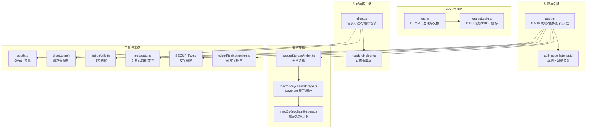
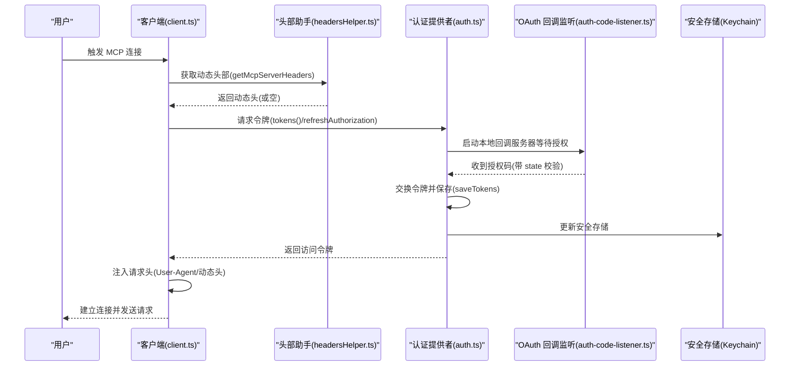
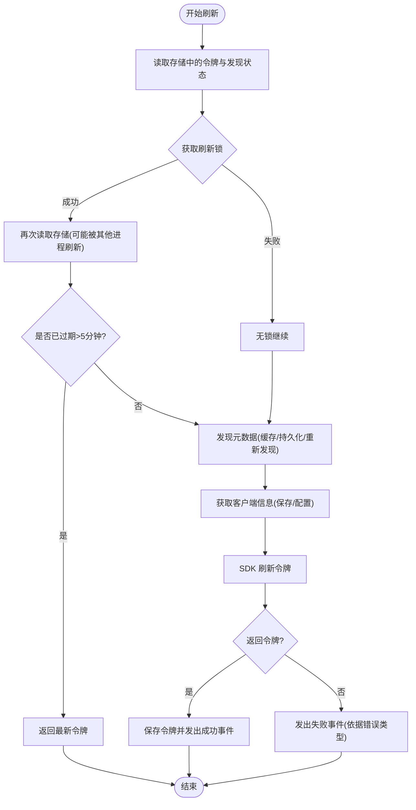
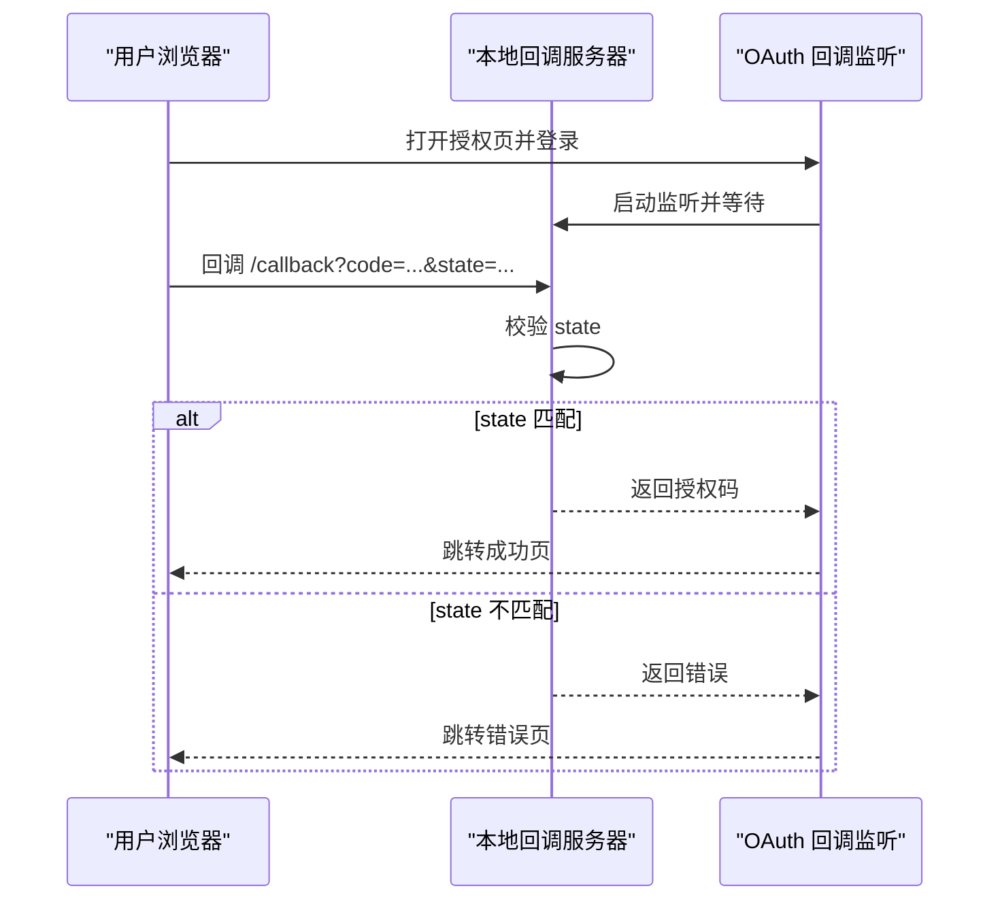
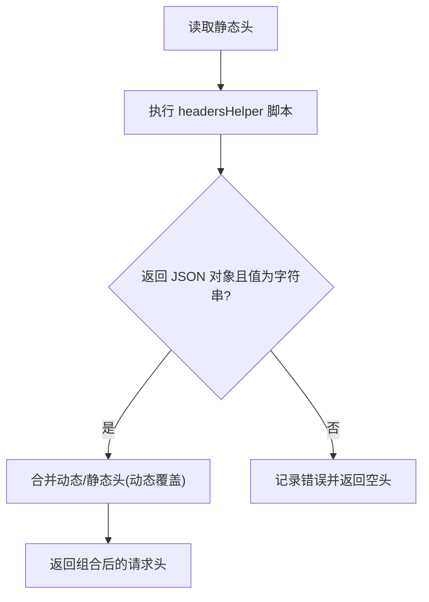
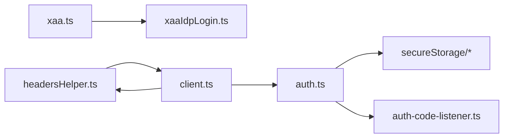

# MCP 认证与安全

<cite>
**本文引用的文件**
- [auth.ts](file://src/services/mcp/auth.ts)
- [xaa.ts](file://src/services/mcp/xaa.ts)
- [headersHelper.ts](file://src/services/mcp/headersHelper.ts)
- [auth-code-listener.ts](file://src/services/oauth/auth-code-listener.ts)
- [xaaIdpLogin.ts](file://src/services/mcp/xaaIdpLogin.ts)
- [index.ts](file://src/utils/secureStorage/index.ts)
- [macOsKeychainStorage.ts](file://src/utils/secureStorage/macOsKeychainStorage.ts)
- [macOsKeychainHelpers.ts](file://src/utils/secureStorage/macOsKeychainHelpers.ts)
- [client.ts](file://src/services/mcp/client.ts)
- [oauth.ts](file://src/constants/oauth.ts)
- [client.ts](file://src/services/api/client.ts)
- [debugUtils.ts](file://src/bridge/debugUtils.ts)
- [metadata.ts](file://src/services/analytics/metadata.ts)
- [cyberRiskInstruction.ts](file://src/constants/cyberRiskInstruction.ts)
- [why-safety-matters.mdx](file://docs/safety/why-safety-matters.mdx)
- [SECURITY.md](file://SECURITY.md)
</cite>

## 目录
1. [简介](#简介)
2. [项目结构](#项目结构)
3. [核心组件](#核心组件)
4. [架构总览](#架构总览)
5. [详细组件分析](#详细组件分析)
6. [依赖关系分析](#依赖关系分析)
7. [性能考量](#性能考量)
8. [故障排查指南](#故障排查指南)
9. [结论](#结论)
10. [附录](#附录)

## 简介
本文件面向 MCP（Model Context Protocol）认证与安全，系统性阐述以下主题：
- MCP 协议的认证机制：授权流程、令牌管理、会话维护、刷新与失效控制
- OAuth 集成实现：授权码流程、回调处理、令牌刷新、错误归因与重试
- 请求/响应头处理：动态头生成、静态头合并、安全校验与信任前置
- XAA（跨账户认证）集成：IdP 登录复用、RFC 8693 + RFC 7523 交换、静默认证与缓存
- 安全最佳实践：密钥管理、传输加密、访问控制、日志脱敏与审计
- 安全配置指南、漏洞防护与安全审计方法

## 项目结构
围绕 MCP 认证与安全的关键模块分布如下：
- 认证与令牌管理：auth.ts（OAuth 发现、令牌保存/刷新/失效、回调服务器）
- XAA 实现：xaa.ts（PRM/AS 发现、IdP 交换、JWT Bearer、静默认证）
- 头部处理：headersHelper.ts（动态脚本执行、静态头合并、信任前置）
- OAuth 回调监听：auth-code-listener.ts（本地回调服务器、CSRF 校验、成功/错误跳转）
- XAA IdP 登录：xaaIdpLogin.ts（OIDC 发现、PKCE 授权、回调捕获、缓存与超时）
- 安全存储：secureStorage（macOS Keychain 封装、缓存与更新）
- 客户端集成：mcp/client.ts（请求头注入、超时包装、步骤提升检测）
- 常量与工具：oauth.ts、client.ts（通用请求头）、debugUtils.ts（日志脱敏）、metadata.ts（分析元数据）
- 安全文档与策略：SECURITY.md、安全设计文档、CYBER_RISK_INSTRUCTION



**图表来源**
- [auth.ts](file://src/services/mcp/auth.ts)
- [auth-code-listener.ts](file://src/services/oauth/auth-code-listener.ts)
- [xaa.ts](file://src/services/mcp/xaa.ts)
- [xaaIdpLogin.ts](file://src/services/mcp/xaaIdpLogin.ts)
- [headersHelper.ts](file://src/services/mcp/headersHelper.ts)
- [client.ts](file://src/services/mcp/client.ts)
- [index.ts](file://src/utils/secureStorage/index.ts)
- [macOsKeychainStorage.ts](file://src/utils/secureStorage/macOsKeychainStorage.ts)
- [macOsKeychainHelpers.ts](file://src/utils/secureStorage/macOsKeychainHelpers.ts)
- [oauth.ts](file://src/constants/oauth.ts)
- [client.ts](file://src/services/api/client.ts)
- [debugUtils.ts](file://src/bridge/debugUtils.ts)
- [metadata.ts](file://src/services/analytics/metadata.ts)
- [SECURITY.md](file://SECURITY.md)
- [cyberRiskInstruction.ts](file://src/constants/cyberRiskInstruction.ts)

**章节来源**
- [auth.ts](file://src/services/mcp/auth.ts)
- [auth-code-listener.ts](file://src/services/oauth/auth-code-listener.ts)
- [xaa.ts](file://src/services/mcp/xaa.ts)
- [xaaIdpLogin.ts](file://src/services/mcp/xaaIdpLogin.ts)
- [headersHelper.ts](file://src/services/mcp/headersHelper.ts)
- [client.ts](file://src/services/mcp/client.ts)
- [index.ts](file://src/utils/secureStorage/index.ts)
- [macOsKeychainStorage.ts](file://src/utils/secureStorage/macOsKeychainStorage.ts)
- [macOsKeychainHelpers.ts](file://src/utils/secureStorage/macOsKeychainHelpers.ts)
- [oauth.ts](file://src/constants/oauth.ts)
- [client.ts](file://src/services/api/client.ts)
- [debugUtils.ts](file://src/bridge/debugUtils.ts)
- [metadata.ts](file://src/services/analytics/metadata.ts)
- [SECURITY.md](file://SECURITY.md)
- [cyberRiskInstruction.ts](file://src/constants/cyberRiskInstruction.ts)

## 核心组件
- OAuth 认证提供者与令牌生命周期管理：发现元数据、保存/读取令牌、刷新与失效、撤销、安全存储
- OAuth 回调监听器：本地回调服务器、CSRF 校验、成功/错误页面跳转
- XAA 与 IdP 登录：PRM/AS 发现、IdP OIDC 授权与 PKCE、RFC 8693 与 RFC 7523 交换、静默认证与缓存
- 动态头部助手：执行外部脚本获取动态头、静态头合并、项目/本地设置信任前置
- 客户端集成：请求头注入、超时包装、步骤提升检测、User-Agent 构造
- 安全存储：macOS Keychain 封装、缓存与预取、更新时失效缓存
- 日志与分析：敏感字段脱敏、分析元数据类型标注、调试截断

**章节来源**
- [auth.ts](file://src/services/mcp/auth.ts)
- [auth-code-listener.ts](file://src/services/oauth/auth-code-listener.ts)
- [xaa.ts](file://src/services/mcp/xaa.ts)
- [xaaIdpLogin.ts](file://src/services/mcp/xaaIdpLogin.ts)
- [headersHelper.ts](file://src/services/mcp/headersHelper.ts)
- [client.ts](file://src/services/mcp/client.ts)
- [index.ts](file://src/utils/secureStorage/index.ts)
- [macOsKeychainStorage.ts](file://src/utils/secureStorage/macOsKeychainStorage.ts)
- [macOsKeychainHelpers.ts](file://src/utils/secureStorage/macOsKeychainHelpers.ts)
- [debugUtils.ts](file://src/bridge/debugUtils.ts)
- [metadata.ts](file://src/services/analytics/metadata.ts)

## 架构总览
MCP 认证与安全采用“多层纵深防御”与“最小权限”的设计原则：
- 传输层：HTTPS/TLS 强制（OAuth 元数据发现、XAA 交换均要求 HTTPS）
- 认证层：OAuth 2.0/OIDC 授权码/PKCE；XAA 使用 IdP id_token 与 AS 令牌交换
- 会话层：令牌持久化于安全存储（macOS Keychain），支持刷新、撤销与失效
- 头部层：动态脚本生成 + 静态头合并，结合信任前置与安全校验
- 客户端层：统一注入请求头、超时与步骤提升检测，避免重复请求与 CSRF
- 审计层：分析事件、日志脱敏、调试截断，避免敏感信息泄露



**图表来源**
- [client.ts](file://src/services/mcp/client.ts)
- [headersHelper.ts](file://src/services/mcp/headersHelper.ts)
- [auth.ts](file://src/services/mcp/auth.ts)
- [auth-code-listener.ts](file://src/services/oauth/auth-code-listener.ts)
- [macOsKeychainStorage.ts](file://src/utils/secureStorage/macOsKeychainStorage.ts)

## 详细组件分析

### OAuth 认证与令牌管理
- 发现与元数据：支持配置式元数据 URL（强制 HTTPS）与 RFC 9728/RFC 8414 发现链路，保留路径感知兼容旧服务器
- 客户端信息：优先读取已保存的客户端凭据，否则回退到配置中的预置客户端 ID
- 令牌保存与读取：统一通过安全存储保存 access_token/refresh_token/expires_at/discoveryState
- 刷新与失效：带锁并发控制、重试与瞬时错误退避、无效授权时清理令牌并发出分析事件
- 撤销：先尝试 RFC 7009 客户端认证方式，必要时回退 Bearer 认证，确保尽力撤销
- 回调与错误：标准化非标准错误体、统一错误归因（如 invalid_grant、metadata_discovery_failed）



**图表来源**
- [auth.ts](file://src/services/mcp/auth.ts)

**章节来源**
- [auth.ts](file://src/services/mcp/auth.ts)

### OAuth 回调处理与 CSRF 防护
- 本地回调服务器：监听 localhost:port，仅处理指定回调路径
- CSRF 校验：严格比对 state 参数，不匹配直接拒绝并记录
- 成功/错误页面：根据授权范围选择不同成功页，错误时同样完成浏览器跳转
- 错误处理：端口占用、超时、异常均以错误页收尾，避免挂起



**图表来源**
- [auth-code-listener.ts](file://src/services/oauth/auth-code-listener.ts)

**章节来源**
- [auth-code-listener.ts](file://src/services/oauth/auth-code-listener.ts)

### 头部信息处理与安全校验
- 动态头：执行 headersHelper 脚本，传入服务器上下文环境变量，返回 JSON 对象
- 静态头：来自配置对象，动态头可覆盖同名静态头
- 信任前置：项目/本地设置来源的服务器在非交互模式下需先建立信任，否则拒绝执行
- 安全校验：对返回值进行类型校验（键值均为字符串），异常时记录错误并返回空头



**图表来源**
- [headersHelper.ts](file://src/services/mcp/headersHelper.ts)

**章节来源**
- [headersHelper.ts](file://src/services/mcp/headersHelper.ts)

### XAA（跨账户认证）与 IdP 集成
- XAA 流程：PRM 发现 → AS 元数据发现 → IdP RFC 8693 交换 → AS RFC 7523 JWT Bearer → 获得 access_token
- IdP 登录：OIDC 发现、PKCE 授权、回调捕获、缓存 id_token（考虑过期缓冲）
- 静默认证：同一 IdP 下多次 MCP 服务器认证无需重复浏览器弹窗
- 失败阶段归因：idp_login/discovery/token_exchange/jwt_bearer，便于诊断与用户指引

```mermaid
sequenceDiagram
participant U as "用户"
participant X as "XAA Orchestrator(xaa.ts)"
participant P as "IdP(OIDC)"
participant A as "AS(OAuth)"
U->>X : 触发 XAA 认证
X->>P : RFC 8693 交换(subject_token=id_token)
P-->>X : 返回 ID-JAG
X->>A : RFC 7523 JWT Bearer(assertion=ID-JAG)
A-->>X : 返回 access_token
X-->>U : 认证完成(令牌保存至安全存储)
```



**图表来源**
- [xaa.ts](file://src/services/mcp/xaa.ts)
- [xaaIdpLogin.ts](file://src/services/mcp/xaaIdpLogin.ts)

**章节来源**
- [xaa.ts](file://src/services/mcp/xaa.ts)
- [xaaIdpLogin.ts](file://src/services/mcp/xaaIdpLogin.ts)

### 安全存储与密钥管理
- 平台适配：macOS 使用 Keychain，其他平台回退明文存储
- 缓存与预取：读写分离缓存，更新/读取前清空缓存，避免脏读
- 写入安全：优先 stdin 注入避免命令行参数泄露；超限回退 argv
- 读取与解析：支持预取结果合并，失败时提供“陈旧而可用”的缓存

```mermaid
classDiagram
class SecureStorage {
+read() SecureStorageData
+readAsync() Promise~SecureStorageData~
+update(data) {success, warning?}
+delete() boolean
}
class MacOsKeychainStorage {
+read() SecureStorageData
+readAsync() Promise~SecureStorageData~
+update(data) {success, warning?}
+delete() boolean
}
class MacOsKeychainHelpers {
+clearKeychainCache()
+primeKeychainCacheFromPrefetch(stdout)
}
SecureStorage <|.. MacOsKeychainStorage
MacOsKeychainStorage --> MacOsKeychainHelpers : "缓存失效/预取"
```

**图表来源**
- [index.ts](file://src/utils/secureStorage/index.ts)
- [macOsKeychainStorage.ts](file://src/utils/secureStorage/macOsKeychainStorage.ts)
- [macOsKeychainHelpers.ts](file://src/utils/secureStorage/macOsKeychainHelpers.ts)

**章节来源**
- [index.ts](file://src/utils/secureStorage/index.ts)
- [macOsKeychainStorage.ts](file://src/utils/secureStorage/macOsKeychainStorage.ts)
- [macOsKeychainHelpers.ts](file://src/utils/secureStorage/macOsKeychainHelpers.ts)

### 客户端集成与请求头注入
- 请求头注入：User-Agent、动态头、静态头合并
- 超时与步骤提升：每次请求使用独立超时信号，步骤提升检测在最外层包装，确保 403 前触发 auth() → tokens()
- Fetch 包装：组合 AbortSignal，避免过期信号干扰

**章节来源**
- [client.ts](file://src/services/mcp/client.ts)

### 日志与分析中的安全
- 敏感字段脱敏：针对 session_ingress_token、environment_secret、access_token、secret、token 等字段进行脱敏
- 分析元数据类型：通过标记类型确保分析事件不携带敏感字符串
- 调试截断：对长消息进行截断与换行折叠，避免日志膨胀

**章节来源**
- [debugUtils.ts](file://src/bridge/debugUtils.ts)
- [metadata.ts](file://src/services/analytics/metadata.ts)

## 依赖关系分析
- 认证提供者依赖安全存储进行令牌持久化，依赖 OAuth 回调监听器完成授权码交换
- XAA 依赖 IdP 登录模块完成 OIDC 发现与 PKCE 授权，再与 AS 交换令牌
- 头部助手依赖外部脚本执行，返回 JSON 对象并与静态头合并
- 客户端集成依赖头部助手与认证提供者，统一注入请求头并包装 fetch



**图表来源**
- [auth.ts](file://src/services/mcp/auth.ts)
- [auth-code-listener.ts](file://src/services/oauth/auth-code-listener.ts)
- [xaa.ts](file://src/services/mcp/xaa.ts)
- [xaaIdpLogin.ts](file://src/services/mcp/xaaIdpLogin.ts)
- [headersHelper.ts](file://src/services/mcp/headersHelper.ts)
- [client.ts](file://src/services/mcp/client.ts)

**章节来源**
- [auth.ts](file://src/services/mcp/auth.ts)
- [auth-code-listener.ts](file://src/services/oauth/auth-code-listener.ts)
- [xaa.ts](file://src/services/mcp/xaa.ts)
- [xaaIdpLogin.ts](file://src/services/mcp/xaaIdpLogin.ts)
- [headersHelper.ts](file://src/services/mcp/headersHelper.ts)
- [client.ts](file://src/services/mcp/client.ts)

## 性能考量
- 令牌刷新并发控制：使用锁文件避免重复刷新，减少网络与 Keychain 压力
- Keychain 缓存：读写分离缓存与预取，避免频繁 subprocess 调用
- 请求超时：每次请求独立超时信号，避免全局超时导致的误判
- 头部脚本：限制执行时间与返回格式，防止阻塞连接建立

[本节为通用指导，无需特定文件引用]

## 故障排查指南
- OAuth 回调失败
  - 检查 state 是否匹配，确认本地回调服务器端口未被占用
  - 查看回调错误页与日志，定位授权码缺失或状态不匹配
- 令牌刷新失败
  - 关注分析事件中的失败原因（metadata_discovery_failed/no_client_info/no_tokens_returned/invalid_grant/transient_retries_exhausted/request_failed）
  - 若出现 invalid_grant，系统会清理存储令牌并发出事件
- XAA 认证失败
  - 归因阶段：idp_login/discovery/token_exchange/jwt_bearer，分别对应 IdP 登录、PRM/AS 发现、IdP 交换、AS JWT Bearer
  - 若 IdP 返回 4xx，会清除缓存 id_token；5xx 则保留以避免二次登录
- 头部助手异常
  - 确认脚本返回 JSON 对象且值为字符串；项目/本地设置需先建立信任
- 安全存储写入失败
  - macOS Keychain 写入失败时会回退明文存储；检查 Keychain 权限与安全策略

**章节来源**
- [auth.ts](file://src/services/mcp/auth.ts)
- [auth-code-listener.ts](file://src/services/oauth/auth-code-listener.ts)
- [xaa.ts](file://src/services/mcp/xaa.ts)
- [xaaIdpLogin.ts](file://src/services/mcp/xaaIdpLogin.ts)
- [headersHelper.ts](file://src/services/mcp/headersHelper.ts)

## 结论
本方案通过严格的传输加密、最小权限的令牌管理、可信的动态头部与 IdP 缓存、以及多层纵深防御的安全设计，为 MCP 认证与安全提供了稳健的实现。建议在生产环境中：
- 强制使用 HTTPS 与受信元数据源
- 严格管理客户端凭据与 Keychain 权限
- 启用并监控分析事件与日志脱敏
- 对项目/本地设置来源的服务器启用信任前置
- 定期审查与演练 OAuth/XAA 流程与回调处理

[本节为总结，无需特定文件引用]

## 附录

### 安全最佳实践清单
- 密钥管理
  - 使用安全存储（macOS Keychain）保存令牌与客户端密钥
  - 严格区分 IdP 客户端密钥与 AS 客户端密钥（不同信任域）
- 传输加密
  - OAuth 元数据与 XAA 交换均要求 HTTPS
  - 回调端口仅监听 localhost，避免公网暴露
- 访问控制
  - 项目/本地设置来源的服务器需先建立信任
  - 动态头部脚本返回值必须为字符串键值对
- 日志与审计
  - 对敏感字段进行脱敏与截断
  - 分析事件使用标记类型确保不携带敏感字符串
- 漏洞防护
  - CSRF 校验与状态参数一致性检查
  - 令牌刷新并发控制与瞬时错误退避
  - 撤销令牌时优先 RFC 7009 方案，必要时回退 Bearer 认证

**章节来源**
- [auth.ts](file://src/services/mcp/auth.ts)
- [auth-code-listener.ts](file://src/services/oauth/auth-code-listener.ts)
- [headersHelper.ts](file://src/services/mcp/headersHelper.ts)
- [debugUtils.ts](file://src/bridge/debugUtils.ts)
- [metadata.ts](file://src/services/analytics/metadata.ts)
- [SECURITY.md](file://SECURITY.md)
- [cyberRiskInstruction.ts](file://src/constants/cyberRiskInstruction.ts)
- [why-safety-matters.mdx](file://docs/safety/why-safety-matters.mdx)