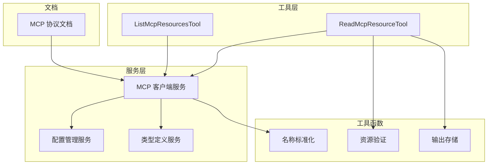
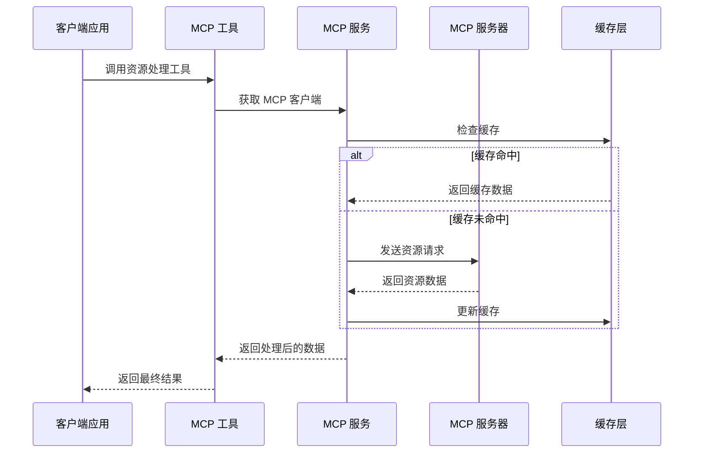
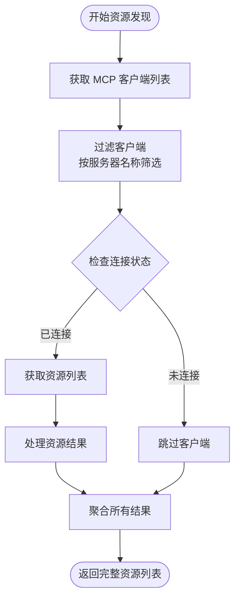
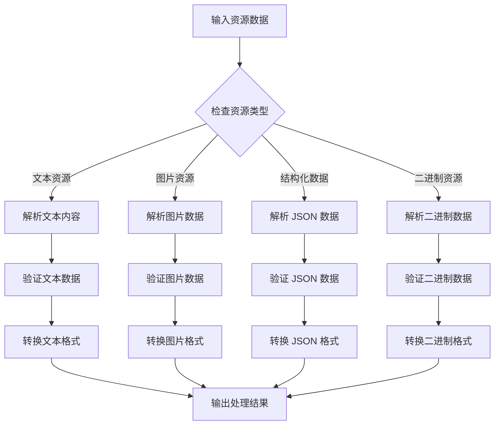

# MCP 资源处理

<cite>
**本文档引用的文件**
- [ListMcpResourcesTool.ts](file://src/tools/ListMcpResourcesTool/ListMcpResourcesTool.ts)
- [ReadMcpResourceTool.ts](file://src/tools/ReadMcpResourceTool/ReadMcpResourceTool.ts)
- [client.ts](file://src/services/mcp/client.ts)
- [config.ts](file://src/services/mcp/config.ts)
- [types.ts](file://src/services/mcp/types.ts)
- [mcpValidation.ts](file://src/utils/mcpValidation.ts)
- [mcpOutputStorage.ts](file://src/utils/mcpOutputStorage.ts)
- [mcp-protocol.mdx](file://docs/extensibility/mcp-protocol.mdx)
- [normalization.ts](file://src/services/mcp/normalization.ts)
</cite>

## 目录
1. [简介](#简介)
2. [项目结构](#项目结构)
3. [核心组件](#核心组件)
4. [架构概览](#架构概览)
5. [详细组件分析](#详细组件分析)
6. [依赖关系分析](#依赖关系分析)
7. [性能考虑](#性能考虑)
8. [故障排除指南](#故障排除指南)
9. [结论](#结论)

## 简介

本文档深入解析 Claude Code 中的 MCP（Model Context Protocol）资源处理机制。MCP 是一个开放协议，允许 AI 应用程序与各种外部资源和服务进行交互。在 Claude Code 中，MCP 资源处理涵盖了资源发现、枚举、标准化、数据处理、权限控制、缓存同步等多个方面。

该系统支持多种传输层（stdio、SSE、HTTP、WebSocket 等），提供了完整的资源管理功能，包括资源列表获取、单个资源读取、资源元数据提取、格式转换等。系统还实现了智能缓存机制、权限验证、安全检查等功能，确保资源处理的安全性和效率。

## 项目结构

MCP 资源处理功能主要分布在以下目录结构中：



**图表来源**
- [ListMcpResourcesTool.ts:1-124](file://src/tools/ListMcpResourcesTool/ListMcpResourcesTool.ts#L1-L124)
- [ReadMcpResourceTool.ts:1-159](file://src/tools/ReadMcpResourceTool/ReadMcpResourceTool.ts#L1-L159)
- [client.ts:1-800](file://src/services/mcp/client.ts#L1-L800)

**章节来源**
- [ListMcpResourcesTool.ts:1-124](file://src/tools/ListMcpResourcesTool/ListMcpResourcesTool.ts#L1-L124)
- [ReadMcpResourceTool.ts:1-159](file://src/tools/ReadMcpResourceTool/ReadMcpResourceTool.ts#L1-L159)
- [client.ts:1-800](file://src/services/mcp/client.ts#L1-L800)

## 核心组件

### 资源发现与枚举工具

系统提供了两个核心工具来处理 MCP 资源：

1. **ListMcpResourcesTool**: 用于列出所有 MCP 服务器提供的资源
2. **ReadMcpResourceTool**: 用于读取指定的 MCP 资源

这两个工具都继承自统一的工具接口，具有相同的基本属性和行为特征。

**章节来源**
- [ListMcpResourcesTool.ts:40-124](file://src/tools/ListMcpResourcesTool/ListMcpResourcesTool.ts#L40-L124)
- [ReadMcpResourceTool.ts:49-159](file://src/tools/ReadMcpResourceTool/ReadMcpResourceTool.ts#L49-L159)

### MCP 客户端服务

MCP 客户端服务是整个资源处理系统的核心，负责：

- 连接管理：支持多种传输层协议
- 资源缓存：实现 LRU 缓存机制
- 权限验证：集成企业策略检查
- 错误处理：提供完善的错误恢复机制

**章节来源**
- [client.ts:596-1643](file://src/services/mcp/client.ts#L596-L1643)
- [config.ts:625-761](file://src/services/mcp/config.ts#L625-L761)

## 架构概览

MCP 资源处理系统采用分层架构设计，确保了模块间的清晰分离和高内聚低耦合：



**图表来源**
- [client.ts:1376-1404](file://src/services/mcp/client.ts#L1376-L1404)
- [ListMcpResourcesTool.ts:79-101](file://src/tools/ListMcpResourcesTool/ListMcpResourcesTool.ts#L79-L101)

系统架构的关键特点：

1. **多传输层支持**：支持 stdio、SSE、HTTP、WebSocket 等多种传输协议
2. **智能缓存机制**：实现 LRU 缓存，支持缓存失效和自动重连
3. **权限控制**：集成企业策略检查和用户权限验证
4. **错误恢复**：提供完整的错误检测和恢复机制

## 详细组件分析

### 资源发现机制

资源发现过程通过 `ListMcpResourcesTool` 实现，该工具具有以下特性：

#### 资源类型识别
系统能够自动识别不同类型的 MCP 资源，包括：
- 文本资源（text/* MIME 类型）
- 图片资源（image/* MIME 类型）
- 结构化数据（application/json、text/csv 等）
- 其他二进制资源

#### 资源元数据提取
每个资源都会提取以下元数据：
- URI：资源的唯一标识符
- 名称：资源的显示名称
- MIME 类型：资源的内容类型
- 描述：资源的简要描述
- 提供服务器：提供该资源的 MCP 服务器名称

#### 资源列表生成
系统通过以下步骤生成资源列表：



**图表来源**
- [ListMcpResourcesTool.ts:66-101](file://src/tools/ListMcpResourcesTool/ListMcpResourcesTool.ts#L66-L101)

**章节来源**
- [ListMcpResourcesTool.ts:15-38](file://src/tools/ListMcpResourcesTool/ListMcpResourcesTool.ts#L15-L38)
- [ListMcpResourcesTool.ts:66-101](file://src/tools/ListMcpResourcesTool/ListMcpResourcesTool.ts#L66-L101)

### 资源标准化处理

系统实现了全面的资源标准化处理机制：

#### 名称规范化
服务器名称会经过规范化处理，确保符合 API 模式要求：
- 移除无效字符（替换为下划线）
- 特殊处理 claude.ai 服务器名称
- 避免与 MCP 工具名称分隔符冲突

#### 路径标准化
资源 URI 会进行标准化处理：
- 统一路径分隔符
- 处理相对路径和绝对路径
- 确保 URI 格式正确

#### 格式转换
系统支持多种格式转换：
- 文本编码转换
- 图片格式转换和压缩
- 结构化数据格式化

**章节来源**
- [normalization.ts:17-23](file://src/services/mcp/normalization.ts#L17-L23)

### 数据处理流程

资源数据处理遵循严格的数据处理流程：

#### 数据解析
系统对不同类型的资源进行相应的解析：



**图表来源**
- [ReadMcpResourceTool.ts:106-139](file://src/tools/ReadMcpResourceTool/ReadMcpResourceTool.ts#L106-L139)

#### 数据验证
系统实施多层次的数据验证：

1. **格式验证**：检查数据格式是否符合预期
2. **完整性验证**：确保数据字段完整
3. **一致性验证**：验证数据间的一致性关系

#### 数据转换
根据需要进行数据转换：
- 编码转换（UTF-8、Base64 等）
- 格式转换（JSON、CSV、XML 等）
- 压缩和解压缩

**章节来源**
- [ReadMcpResourceTool.ts:106-139](file://src/tools/ReadMcpResourceTool/ReadMcpResourceTool.ts#L106-L139)

### 权限控制机制

系统实现了多层次的权限控制机制：

#### 访问控制
- **服务器级别**：基于服务器名称的访问控制
- **资源级别**：基于资源 URI 的细粒度控制
- **操作级别**：基于具体操作类型的权限控制

#### 权限验证
系统集成企业策略检查：
- 允许列表验证
- 拒绝列表验证
- 环境变量扩展支持

#### 安全检查
- **OAuth 令牌验证**：确保访问令牌的有效性
- **会话状态检查**：验证会话的活跃状态
- **安全头检查**：验证请求头的安全性

**章节来源**
- [config.ts:417-508](file://src/services/mcp/config.ts#L417-L508)
- [client.ts:341-362](file://src/services/mcp/client.ts#L341-L362)

### 缓存和同步策略

系统实现了智能的缓存和同步机制：

#### 缓存机制
- **LRU 缓存**：实现最近最少使用算法
- **多级缓存**：支持工具、资源、命令等多级缓存
- **缓存键管理**：基于服务器名称和配置生成缓存键

#### 同步算法
- **自动失效**：基于时间戳的自动缓存失效
- **事件驱动更新**：监听资源变化事件
- **手动刷新**：支持用户手动刷新缓存

#### 冲突解决
- **版本控制**：跟踪资源版本信息
- **合并策略**：处理并发更新冲突
- **回滚机制**：支持错误状态下的回滚

**章节来源**
- [client.ts:1376-1404](file://src/services/mcp/client.ts#L1376-L1404)
- [client.ts:582-587](file://src/services/mcp/client.ts#L582-L587)

## 依赖关系分析

MCP 资源处理系统的依赖关系如下：

```mermaid
graph TB
subgraph "外部依赖"
A[@modelcontextprotocol/sdk]
B[zod]
C[lodash-es]
D[p-map]
end
subgraph "内部模块"
E[ListMcpResourcesTool]
F[ReadMcpResourceTool]
G[MCP 客户端服务]
H[配置管理]
I[工具函数]
end
subgraph "工具函数"
J[mcpValidation]
K[mcpOutputStorage]
L[normalization]
end
A --> G
B --> E
B --> F
C --> G
D --> G
E --> G
F --> G
G --> H
G --> I
F --> J
F --> K
G --> L
```

**图表来源**
- [client.ts:1-50](file://src/services/mcp/client.ts#L1-L50)
- [ListMcpResourcesTool.ts:1-14](file://src/tools/ListMcpResourcesTool/ListMcpResourcesTool.ts#L1-L14)
- [ReadMcpResourceTool.ts:1-20](file://src/tools/ReadMcpResourceTool/ReadMcpResourceTool.ts#L1-L20)

**章节来源**
- [client.ts:1-50](file://src/services/mcp/client.ts#L1-L50)
- [types.ts:1-259](file://src/services/mcp/types.ts#L1-L259)

## 性能考虑

### 缓存优化
- **LRU 缓存大小**：默认缓存大小为 20，平衡内存使用和性能
- **缓存失效策略**：基于连接状态和资源变化的智能失效
- **预加载机制**：启动时预加载常用资源，减少首次访问延迟

### 并发控制
- **连接批处理**：本地服务器默认 3 个并发，远程服务器默认 20 个并发
- **请求超时管理**：每个请求使用独立的超时控制，避免信号泄漏
- **错误重试机制**：智能重试策略，避免无限重试

### 内存管理
- **流式处理**：大文件采用流式处理，避免内存溢出
- **垃圾回收**：及时清理不再使用的资源和缓存
- **监控机制**：实时监控内存使用情况

## 故障排除指南

### 常见问题及解决方案

#### 连接问题
- **症状**：无法连接到 MCP 服务器
- **原因**：网络问题、认证失败、服务器不可用
- **解决方案**：检查网络连接、验证认证信息、查看服务器状态

#### 缓存问题
- **症状**：资源显示过期或不一致
- **原因**：缓存未正确失效或同步
- **解决方案**：手动刷新缓存、检查缓存配置、重启应用

#### 权限问题
- **症状**：访问被拒绝或权限不足
- **原因**：企业策略限制、用户权限不足
- **解决方案**：检查企业策略配置、申请必要权限、联系管理员

#### 性能问题
- **症状**：响应缓慢或内存占用过高
- **原因**：缓存配置不当、并发过多、资源过大
- **解决方案**：调整缓存设置、限制并发数量、优化资源处理

**章节来源**
- [client.ts:1268-1373](file://src/services/mcp/client.ts#L1268-L1373)
- [mcpValidation.ts:151-209](file://src/utils/mcpValidation.ts#L151-L209)

## 结论

MCP 资源处理系统是一个功能完整、架构清晰的现代化资源管理系统。它通过以下关键特性确保了高效、安全、可靠的资源处理：

1. **全面的资源支持**：支持多种资源类型和传输协议
2. **智能缓存机制**：提供高性能的缓存和同步策略
3. **严格的权限控制**：集成企业策略检查和安全验证
4. **灵活的配置管理**：支持多种配置来源和动态更新
5. **完善的错误处理**：提供全面的错误检测和恢复机制

该系统为 Claude Code 提供了强大的 MCP 资源处理能力，为未来的功能扩展和性能优化奠定了坚实的基础。通过持续的改进和优化，该系统将继续为用户提供更好的资源处理体验。