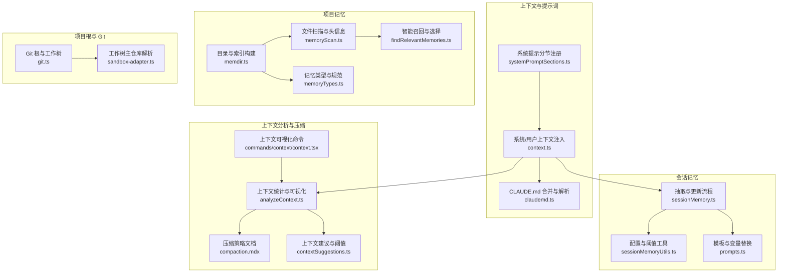
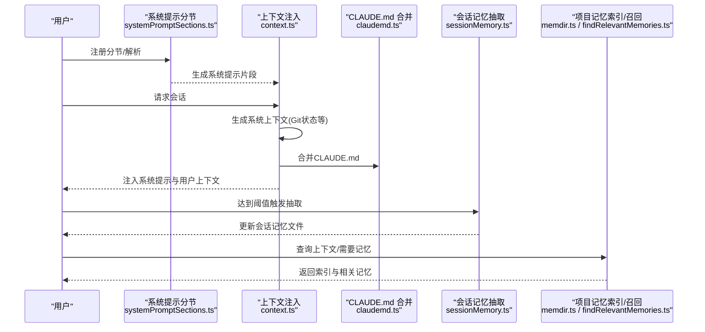
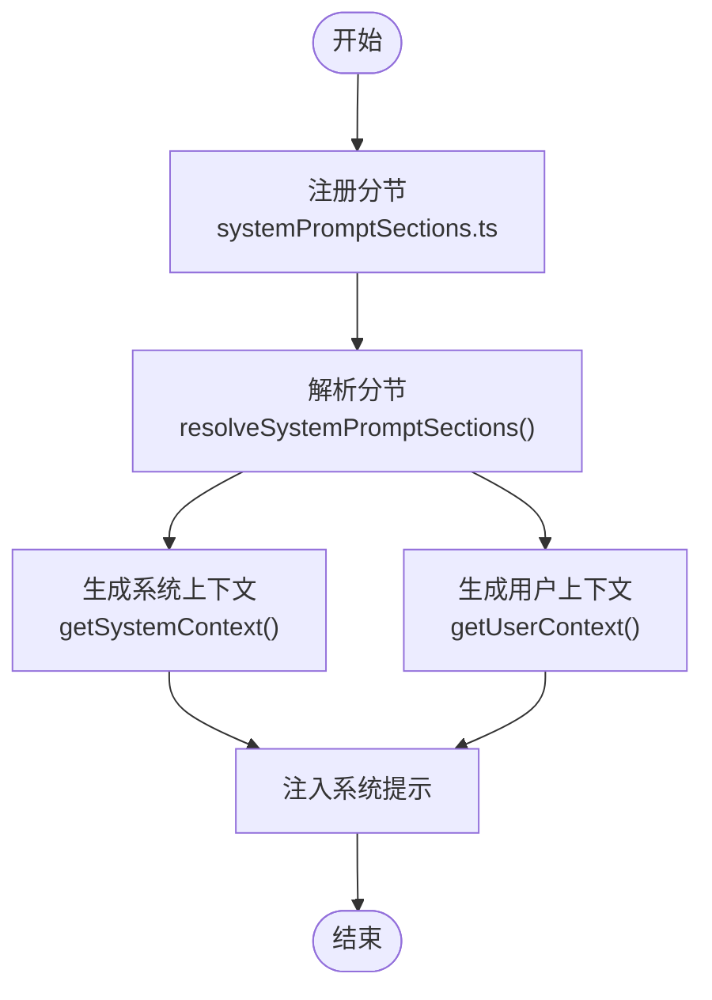
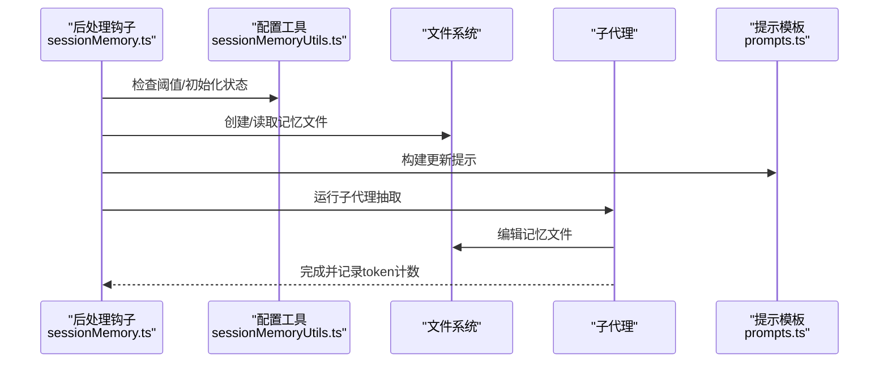
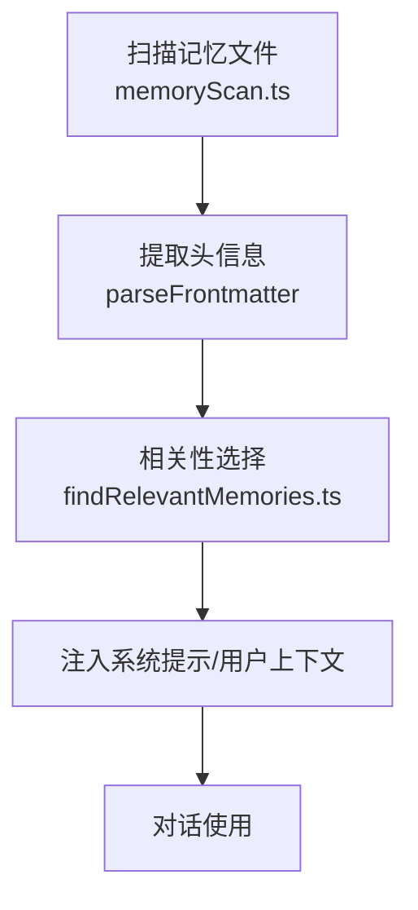
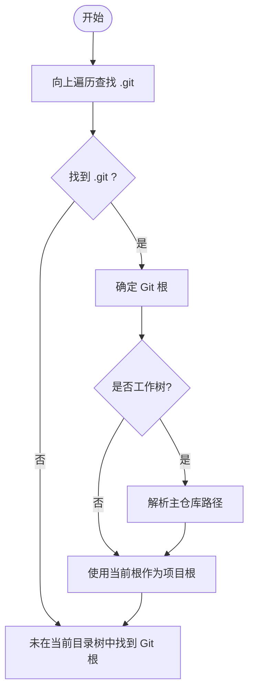
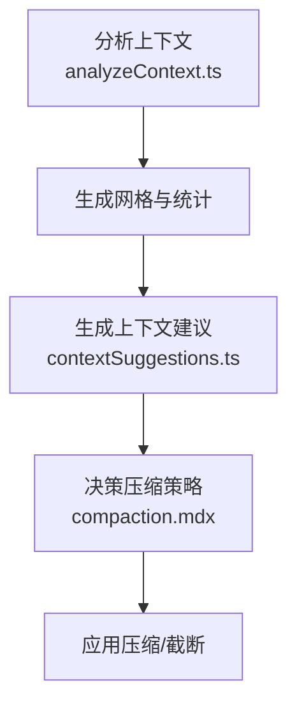
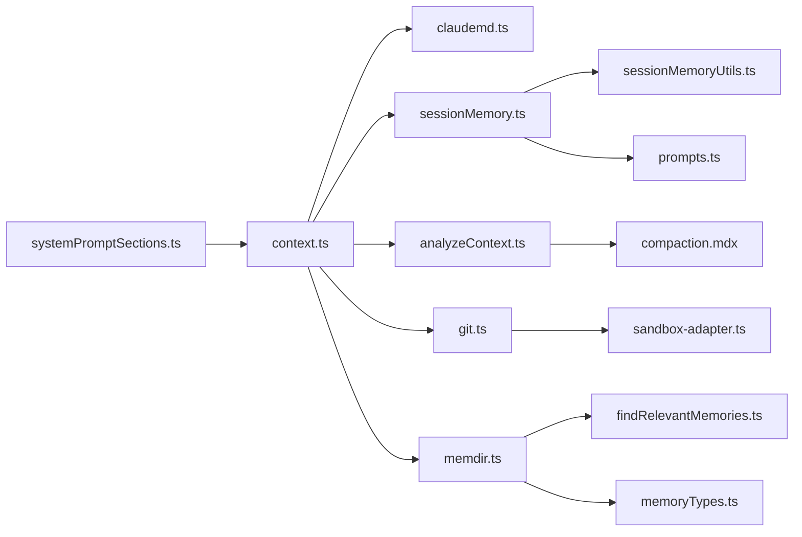

# 上下文管理功能

<cite>
**本文引用的文件**
- [src/context.ts](file://src/context.ts)
- [src/constants/systemPromptSections.ts](file://src/constants/systemPromptSections.ts)
- [docs/context/system-prompt.mdx](file://docs/context/system-prompt.mdx)
- [src/services/SessionMemory/sessionMemory.ts](file://src/services/SessionMemory/sessionMemory.ts)
- [src/services/SessionMemory/sessionMemoryUtils.ts](file://src/services/SessionMemory/sessionMemoryUtils.ts)
- [src/services/SessionMemory/prompts.ts](file://src/services/SessionMemory/prompts.ts)
- [src/memdir/memdir.ts](file://src/memdir/memdir.ts)
- [src/memdir/memoryScan.ts](file://src/memdir/memoryScan.ts)
- [src/memdir/findRelevantMemories.ts](file://src/memdir/findRelevantMemories.ts)
- [src/memdir/memoryTypes.ts](file://src/memdir/memoryTypes.ts)
- [src/utils/claudemd.ts](file://src/utils/claudemd.ts)
- [src/utils/git.ts](file://src/utils/git.ts)
- [src/utils/sandbox/sandbox-adapter.ts](file://src/utils/sandbox/sandbox-adapter.ts)
- [src/utils/analyzeContext.ts](file://src/utils/analyzeContext.ts)
- [docs/context/compaction.mdx](file://docs/context/compaction.mdx)
- [src/utils/contextSuggestions.ts](file://src/utils/contextSuggestions.ts)
- [src/commands/context/context.tsx](file://src/commands/context/context.tsx)
</cite>

## 目录
1. [简介](#简介)
2. [项目结构](#项目结构)
3. [核心组件](#核心组件)
4. [架构总览](#架构总览)
5. [详细组件分析](#详细组件分析)
6. [依赖关系分析](#依赖关系分析)
7. [性能考量](#性能考量)
8. [故障排查指南](#故障排查指南)
9. [结论](#结论)
10. [附录](#附录)

## 简介
本文件系统性阐述 Claude Code 的上下文管理功能，涵盖项目上下文的提取与管理、系统提示的动态构建、会话记忆的存储与抽取、以及上下文窗口的优化策略。重点包括：
- 文件系统扫描与 Git 仓库检测、项目根目录识别
- 系统提示模板加载、分节注册与缓存控制
- 会话记忆的阈值驱动抽取、模板化更新与持久化
- 项目记忆（MEMORY.md）的索引与智能召回
- 上下文压缩与窗口优化策略（含 MicroCompact、会话记忆压缩）

## 项目结构
围绕上下文管理的关键模块分布如下：
- 上下文与提示词
  - 系统提示分节注册与解析：[src/constants/systemPromptSections.ts](file://src/constants/systemPromptSections.ts)
  - 系统提示文档说明：[docs/context/system-prompt.mdx](file://docs/context/system-prompt.mdx)
  - 系统/用户上下文注入：[src/context.ts](file://src/context.ts)
  - CLAUDE.md 多级合并与 @include 解析：[src/utils/claudemd.ts](file://src/utils/claudemd.ts)
- 会话记忆
  - 抽取与更新流程：[src/services/SessionMemory/sessionMemory.ts](file://src/services/SessionMemory/sessionMemory.ts)
  - 配置与阈值工具：[src/services/SessionMemory/sessionMemoryUtils.ts](file://src/services/SessionMemory/sessionMemoryUtils.ts)
  - 模板与变量替换：[src/services/SessionMemory/prompts.ts](file://src/services/SessionMemory/prompts.ts)
- 项目记忆（自动记忆）
  - 目录结构与索引构建：[src/memdir/memdir.ts](file://src/memdir/memdir.ts)
  - 文件扫描与头信息提取：[src/memdir/memoryScan.ts](file://src/memdir/memoryScan.ts)
  - 智能召回与相关性选择：[src/memdir/findRelevantMemories.ts](file://src/memdir/findRelevantMemories.ts)
  - 记忆类型与规范：[src/memdir/memoryTypes.ts](file://src/memdir/memoryTypes.ts)
- 项目根与 Git 检测
  - Git 根与工作树解析：[src/utils/git.ts](file://src/utils/git.ts)
  - 工作树主仓库解析：[src/utils/sandbox/sandbox-adapter.ts](file://src/utils/sandbox/sandbox-adapter.ts)
- 上下文分析与压缩
  - 上下文统计与可视化：[src/utils/analyzeContext.ts](file://src/utils/analyzeContext.ts)
  - 压缩策略文档：[docs/context/compaction.mdx](file://docs/context/compaction.mdx)
  - 上下文建议与阈值：[src/utils/contextSuggestions.ts](file://src/utils/contextSuggestions.ts)
  - 上下文可视化命令：[src/commands/context/context.tsx](file://src/commands/context/context.tsx)

图表来源
- [src/constants/systemPromptSections.ts:43-68](file://src/constants/systemPromptSections.ts#L43-L68)
- [src/context.ts:116-189](file://src/context.ts#L116-L189)
- [src/utils/claudemd.ts:790-800](file://src/utils/claudemd.ts#L790-L800)
- [src/services/SessionMemory/sessionMemory.ts:269-350](file://src/services/SessionMemory/sessionMemory.ts#L269-L350)
- [src/services/SessionMemory/sessionMemoryUtils.ts:18-196](file://src/services/SessionMemory/sessionMemoryUtils.ts#L18-L196)
- [src/services/SessionMemory/prompts.ts:226-247](file://src/services/SessionMemory/prompts.ts#L226-L247)
- [src/memdir/memdir.ts:419-507](file://src/memdir/memdir.ts#L419-L507)
- [src/memdir/memoryScan.ts:35-77](file://src/memdir/memoryScan.ts#L35-L77)
- [src/memdir/findRelevantMemories.ts:39-62](file://src/memdir/findRelevantMemories.ts#L39-L62)
- [src/memdir/memoryTypes.ts:14-31](file://src/memdir/memoryTypes.ts#L14-L31)
- [src/utils/git.ts:32-75](file://src/utils/git.ts#L32-L75)
- [src/utils/sandbox/sandbox-adapter.ts:416-445](file://src/utils/sandbox/sandbox-adapter.ts#L416-L445)
- [src/utils/analyzeContext.ts:190-232](file://src/utils/analyzeContext.ts#L190-L232)
- [docs/context/compaction.mdx:1-23](file://docs/context/compaction.mdx#L1-L23)
- [src/utils/contextSuggestions.ts:31-40](file://src/utils/contextSuggestions.ts#L31-L40)
- [src/commands/context/context.tsx:1-10](file://src/commands/context/context.tsx#L1-L10)

章节来源
- [src/context.ts:116-189](file://src/context.ts#L116-L189)
- [src/constants/systemPromptSections.ts:43-68](file://src/constants/systemPromptSections.ts#L43-L68)
- [src/utils/claudemd.ts:790-800](file://src/utils/claudemd.ts#L790-L800)
- [src/services/SessionMemory/sessionMemory.ts:269-350](file://src/services/SessionMemory/sessionMemory.ts#L269-L350)
- [src/services/SessionMemory/sessionMemoryUtils.ts:18-196](file://src/services/SessionMemory/sessionMemoryUtils.ts#L18-L196)
- [src/services/SessionMemory/prompts.ts:226-247](file://src/services/SessionMemory/prompts.ts#L226-L247)
- [src/memdir/memdir.ts:419-507](file://src/memdir/memdir.ts#L419-L507)
- [src/memdir/memoryScan.ts:35-77](file://src/memdir/memoryScan.ts#L35-L77)
- [src/memdir/findRelevantMemories.ts:39-62](file://src/memdir/findRelevantMemories.ts#L39-L62)
- [src/memdir/memoryTypes.ts:14-31](file://src/memdir/memoryTypes.ts#L14-L31)
- [src/utils/git.ts:32-75](file://src/utils/git.ts#L32-L75)
- [src/utils/sandbox/sandbox-adapter.ts:416-445](file://src/utils/sandbox/sandbox-adapter.ts#L416-L445)
- [src/utils/analyzeContext.ts:190-232](file://src/utils/analyzeContext.ts#L190-L232)
- [docs/context/compaction.mdx:1-23](file://docs/context/compaction.mdx#L1-L23)
- [src/utils/contextSuggestions.ts:31-40](file://src/utils/contextSuggestions.ts#L31-L40)
- [src/commands/context/context.tsx:1-10](file://src/commands/context/context.tsx#L1-L10)

## 核心组件
- 系统提示分节与缓存控制
  - 通过分节工厂函数注册可缓存或易变分节，解析时优先使用缓存值，必要时强制重建以破坏缓存。
  - 结合系统上下文与用户上下文注入，形成稳定的前缀缓存与动态内容的分层结构。

- 系统/用户上下文注入
  - 系统上下文：包含 Git 状态快照、缓存破坏器等，会话级缓存。
  - 用户上下文：合并 CLAUDE.md 多级内容与当前日期，注入为系统提醒消息。

- 会话记忆（Session Memory）
  - 基于阈值驱动的后台抽取：累计上下文增长与工具调用次数，满足条件后通过子代理抽取并更新记忆文件。
  - 模板化更新：支持自定义模板与提示，变量替换与长度提醒，确保内容结构与预算可控。

- 项目记忆（自动记忆）
  - 文件级持久化：MEMORY.md 作为索引，各主题文件承载具体内容；支持 frontmatter 描述与类型约束。
  - 智能召回：扫描头信息，结合查询与近期工具使用情况，通过轻量 API 选择最相关记忆。

- 上下文分析与压缩
  - 统计各部分 token 占比、工具与附件明细、技能与代理占用，生成可视化网格与建议。
  - 压缩策略：三层递进（MicroCompact、会话记忆压缩、传统摘要），结合自动压缩阈值与缓冲区策略。

章节来源
- [src/constants/systemPromptSections.ts:43-68](file://src/constants/systemPromptSections.ts#L43-L68)
- [src/context.ts:116-189](file://src/context.ts#L116-L189)
- [src/services/SessionMemory/sessionMemory.ts:134-181](file://src/services/SessionMemory/sessionMemory.ts#L134-L181)
- [src/services/SessionMemory/prompts.ts:226-247](file://src/services/SessionMemory/prompts.ts#L226-L247)
- [src/memdir/memdir.ts:419-507](file://src/memdir/memdir.ts#L419-L507)
- [src/memdir/findRelevantMemories.ts:39-62](file://src/memdir/findRelevantMemories.ts#L39-L62)
- [src/utils/analyzeContext.ts:190-232](file://src/utils/analyzeContext.ts#L190-L232)
- [docs/context/compaction.mdx:1-23](file://docs/context/compaction.mdx#L1-L23)

## 架构总览
系统提示与上下文的组装链路如下：
- 分节注册与解析：[src/constants/systemPromptSections.ts](file://src/constants/systemPromptSections.ts)
- 系统提示构建：[docs/context/system-prompt.mdx](file://docs/context/system-prompt.mdx)
- 上下文注入：系统上下文与用户上下文分别注入到系统提示与用户消息中：[src/context.ts](file://src/context.ts)
- CLAUDE.md 合并：[src/utils/claudemd.ts](file://src/utils/claudemd.ts)
- 会话记忆抽取：[src/services/SessionMemory/sessionMemory.ts](file://src/services/SessionMemory/sessionMemory.ts)
- 项目记忆索引与召回：[src/memdir/memdir.ts](file://src/memdir/memdir.ts)、[src/memdir/findRelevantMemories.ts](file://src/memdir/findRelevantMemories.ts)
- 上下文分析与压缩：[src/utils/analyzeContext.ts](file://src/utils/analyzeContext.ts)、[docs/context/compaction.mdx](file://docs/context/compaction.mdx)

图表来源
- [src/constants/systemPromptSections.ts:43-68](file://src/constants/systemPromptSections.ts#L43-L68)
- [src/context.ts:116-189](file://src/context.ts#L116-L189)
- [src/utils/claudemd.ts:790-800](file://src/utils/claudemd.ts#L790-L800)
- [src/services/SessionMemory/sessionMemory.ts:269-350](file://src/services/SessionMemory/sessionMemory.ts#L269-L350)
- [src/memdir/memdir.ts:419-507](file://src/memdir/memdir.ts#L419-L507)
- [src/memdir/findRelevantMemories.ts:39-62](file://src/memdir/findRelevantMemories.ts#L39-L62)

## 详细组件分析

### 系统提示与上下文注入
- 分节注册与缓存控制
  - 可缓存分节：计算一次，/clear 或 /compact 后重新计算。
  - 易变分节：每轮重新计算，破坏提示缓存，需给出明确理由。
- 上下文注入
  - 系统上下文：会话级缓存，包含 Git 状态快照与缓存破坏器。
  - 用户上下文：合并 CLAUDE.md 多级内容与当前日期，注入为系统提醒消息。

图表来源
- [src/constants/systemPromptSections.ts:43-68](file://src/constants/systemPromptSections.ts#L43-L68)
- [src/context.ts:116-189](file://src/context.ts#L116-L189)

章节来源
- [src/constants/systemPromptSections.ts:43-68](file://src/constants/systemPromptSections.ts#L43-L68)
- [src/context.ts:116-189](file://src/context.ts#L116-L189)
- [docs/context/system-prompt.mdx:168-214](file://docs/context/system-prompt.mdx#L168-L214)

### 会话记忆（Session Memory）
- 阈值与触发
  - 初始化阈值：上下文窗口总 token 达到阈值后初始化。
  - 更新阈值：自上次抽取以来上下文增长达到阈值；同时记录工具调用次数。
  - 安全条件：若最后助手回合存在工具调用，则需等待自然断点再抽取。
- 抽取流程
  - 创建/读取记忆文件，构建更新提示，使用子代理运行以避免污染父状态。
  - 仅允许对记忆文件进行编辑，其他工具调用将被拒绝。
- 模板与变量
  - 支持自定义模板与提示，变量替换（如 {{currentNotes}}、{{notesPath}}）。
  - 按节长度与总量进行提醒与截断，保证预算可控。

图表来源
- [src/services/SessionMemory/sessionMemory.ts:134-181](file://src/services/SessionMemory/sessionMemory.ts#L134-L181)
- [src/services/SessionMemory/sessionMemoryUtils.ts:18-196](file://src/services/SessionMemory/sessionMemoryUtils.ts#L18-L196)
- [src/services/SessionMemory/prompts.ts:226-247](file://src/services/SessionMemory/prompts.ts#L226-L247)

章节来源
- [src/services/SessionMemory/sessionMemory.ts:134-181](file://src/services/SessionMemory/sessionMemory.ts#L134-L181)
- [src/services/SessionMemory/sessionMemoryUtils.ts:18-196](file://src/services/SessionMemory/sessionMemoryUtils.ts#L18-L196)
- [src/services/SessionMemory/prompts.ts:226-247](file://src/services/SessionMemory/prompts.ts#L226-L247)

### 项目记忆（自动记忆）
- 目录与索引
  - MEMORY.md 作为索引，限制行数与字节数，超限时截断并告警。
  - 目录布局：用户偏好、项目上下文、反馈与参考等主题文件。
- 记忆类型
  - 四类型分类：user、feedback、project、reference，frontmatter 约束与 body 结构指导。
- 智能召回
  - 扫描头信息（frontmatter），通过轻量 API 选择最相关记忆，考虑近期工具使用与已展示去重。

图表来源
- [src/memdir/memoryScan.ts:35-77](file://src/memdir/memoryScan.ts#L35-L77)
- [src/memdir/findRelevantMemories.ts:39-62](file://src/memdir/findRelevantMemories.ts#L39-L62)
- [src/memdir/memdir.ts:419-507](file://src/memdir/memdir.ts#L419-L507)
- [src/memdir/memoryTypes.ts:14-31](file://src/memdir/memoryTypes.ts#L14-L31)

章节来源
- [src/memdir/memdir.ts:419-507](file://src/memdir/memdir.ts#L419-L507)
- [src/memdir/memoryScan.ts:35-77](file://src/memdir/memoryScan.ts#L35-L77)
- [src/memdir/findRelevantMemories.ts:39-62](file://src/memdir/findRelevantMemories.ts#L39-L62)
- [src/memdir/memoryTypes.ts:14-31](file://src/memdir/memoryTypes.ts#L14-L31)

### 项目根与 Git 仓库检测
- Git 根与工作树
  - 向上遍历查找 .git，支持常规仓库与工作树/子模块。
  - 工作树解析：从 .git 文件中的 gitdir 定位主仓库路径。
- 项目根识别
  - 使用 Git 根解析项目目录，确保多 worktree 共享同一项目身份。

图表来源
- [src/utils/git.ts:32-75](file://src/utils/git.ts#L32-L75)
- [src/utils/sandbox/sandbox-adapter.ts:416-445](file://src/utils/sandbox/sandbox-adapter.ts#L416-L445)

章节来源
- [src/utils/git.ts:32-75](file://src/utils/git.ts#L32-L75)
- [src/utils/sandbox/sandbox-adapter.ts:416-445](file://src/utils/sandbox/sandbox-adapter.ts#L416-L445)

### 上下文分析与压缩
- 统计与可视化
  - 分类统计：系统提示、CLAUDE.md、工具定义、MCP 工具、代理与技能等。
  - 网格显示：按类别 token 占比与延迟填充，辅助容量规划。
- 建议与阈值
  - 基于工具结果占比、读取膨胀、接近容量阈值、记忆占比等生成建议。
- 压缩策略
  - 三层策略：MicroCompact（单工具输出）、会话记忆压缩、传统摘要。
  - 与自动压缩阈值协同，预留缓冲区与紧急降级。

图表来源
- [src/utils/analyzeContext.ts:190-232](file://src/utils/analyzeContext.ts#L190-L232)
- [src/utils/contextSuggestions.ts:31-40](file://src/utils/contextSuggestions.ts#L31-L40)
- [docs/context/compaction.mdx:1-23](file://docs/context/compaction.mdx#L1-L23)

章节来源
- [src/utils/analyzeContext.ts:190-232](file://src/utils/analyzeContext.ts#L190-L232)
- [src/utils/contextSuggestions.ts:31-40](file://src/utils/contextSuggestions.ts#L31-L40)
- [docs/context/compaction.mdx:1-23](file://docs/context/compaction.mdx#L1-L23)

## 依赖关系分析
- 组件耦合
  - 系统提示分节与上下文注入紧密耦合，确保静态区可跨组织缓存、动态区按轮重建。
  - 会话记忆与上下文分析强耦合：阈值与 token 统计共同决定抽取时机。
  - 项目记忆与 CLAUDE.md 合并相互补充：前者持久化、后者即时注入。
- 外部依赖
  - Git 命令与文件系统 API 用于项目根识别与文件扫描。
  - 轻量 API 用于记忆相关性选择，避免主模型调用成本。

图表来源
- [src/constants/systemPromptSections.ts:43-68](file://src/constants/systemPromptSections.ts#L43-L68)
- [src/context.ts:116-189](file://src/context.ts#L116-L189)
- [src/utils/claudemd.ts:790-800](file://src/utils/claudemd.ts#L790-L800)
- [src/services/SessionMemory/sessionMemory.ts:269-350](file://src/services/SessionMemory/sessionMemory.ts#L269-L350)
- [src/services/SessionMemory/sessionMemoryUtils.ts:18-196](file://src/services/SessionMemory/sessionMemoryUtils.ts#L18-L196)
- [src/services/SessionMemory/prompts.ts:226-247](file://src/services/SessionMemory/prompts.ts#L226-L247)
- [src/utils/analyzeContext.ts:190-232](file://src/utils/analyzeContext.ts#L190-L232)
- [docs/context/compaction.mdx:1-23](file://docs/context/compaction.mdx#L1-L23)
- [src/utils/git.ts:32-75](file://src/utils/git.ts#L32-L75)
- [src/utils/sandbox/sandbox-adapter.ts:416-445](file://src/utils/sandbox/sandbox-adapter.ts#L416-L445)
- [src/memdir/memdir.ts:419-507](file://src/memdir/memdir.ts#L419-L507)
- [src/memdir/findRelevantMemories.ts:39-62](file://src/memdir/findRelevantMemories.ts#L39-L62)
- [src/memdir/memoryTypes.ts:14-31](file://src/memdir/memoryTypes.ts#L14-L31)

章节来源
- [src/context.ts:116-189](file://src/context.ts#L116-L189)
- [src/services/SessionMemory/sessionMemory.ts:269-350](file://src/services/SessionMemory/sessionMemory.ts#L269-L350)
- [src/memdir/memdir.ts:419-507](file://src/memdir/memdir.ts#L419-L507)

## 性能考量
- 缓存与分块
  - 系统提示分块与缓存控制，静态区可跨组织缓存，动态区按轮重建，降低 token 成本。
- I/O 与扫描
  - CLAUDE.md 与记忆文件扫描采用异步与分批策略，避免阻塞主线程。
- 阈值与节流
  - 会话记忆抽取通过阈值与工具调用计数节流，避免频繁抽取。
- 压缩与预算
  - 三层压缩策略与网格可视化，帮助识别高消耗来源并进行针对性优化。

## 故障排查指南
- 系统提示缓存异常
  - 检查分节是否误用易变分节；确认动态区放置在边界标记之后。
- 上下文过大
  - 使用上下文可视化与建议，关注工具结果占比、读取膨胀与记忆占比，调整阈值或启用压缩。
- 会话记忆未抽取
  - 检查阈值配置与工具调用计数；确认最后助手回合无工具调用或已满足自然断点。
- 项目记忆召回不相关
  - 检查 MEMORY.md 索引与 frontmatter 描述字段；确认近期工具列表与已展示去重参数正确传递。

章节来源
- [src/utils/contextSuggestions.ts:31-40](file://src/utils/contextSuggestions.ts#L31-L40)
- [src/services/SessionMemory/sessionMemory.ts:134-181](file://src/services/SessionMemory/sessionMemory.ts#L134-L181)
- [src/memdir/findRelevantMemories.ts:39-62](file://src/memdir/findRelevantMemories.ts#L39-L62)

## 结论
Claude Code 的上下文管理通过“分节缓存 + 上下文注入 + 阈值驱动抽取 + 智能召回”的组合，实现了高效、稳定且可扩展的上下文维护。系统在保证提示缓存收益的同时，灵活应对动态变化，并通过可视化与压缩策略持续优化 token 使用效率。

## 附录
- 配置与使用示例
  - 系统提示分节注册：使用可缓存与易变分节工厂函数，明确缓存破坏理由。
  - 会话记忆配置：通过远程配置覆盖阈值，或在本地设置中调整最小 token 增长与工具调用间隔。
  - 项目记忆模板：自定义模板与提示，变量替换与长度提醒，确保结构与预算可控。
  - 上下文可视化：使用上下文命令查看网格与建议，识别高消耗来源并进行优化。

章节来源
- [src/constants/systemPromptSections.ts:43-68](file://src/constants/systemPromptSections.ts#L43-L68)
- [src/services/SessionMemory/sessionMemoryUtils.ts:18-196](file://src/services/SessionMemory/sessionMemoryUtils.ts#L18-L196)
- [src/services/SessionMemory/prompts.ts:226-247](file://src/services/SessionMemory/prompts.ts#L226-L247)
- [src/commands/context/context.tsx:1-10](file://src/commands/context/context.tsx#L1-L10)