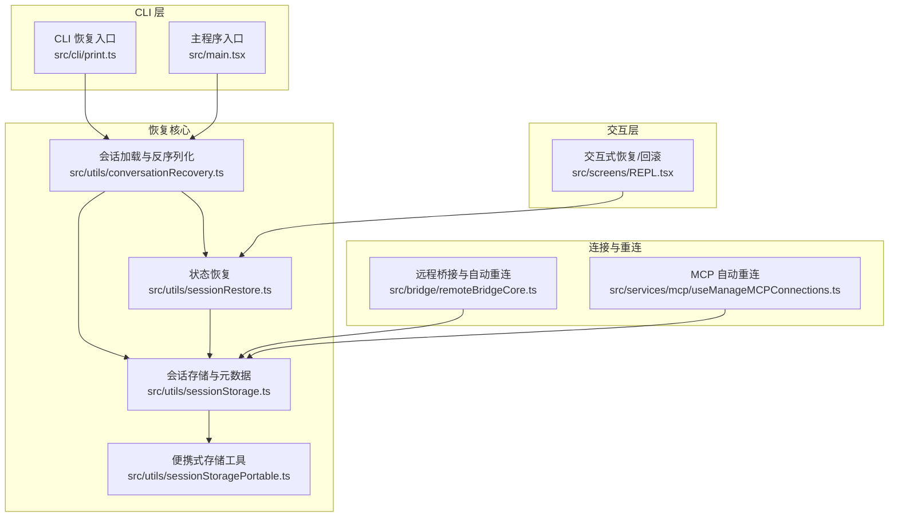
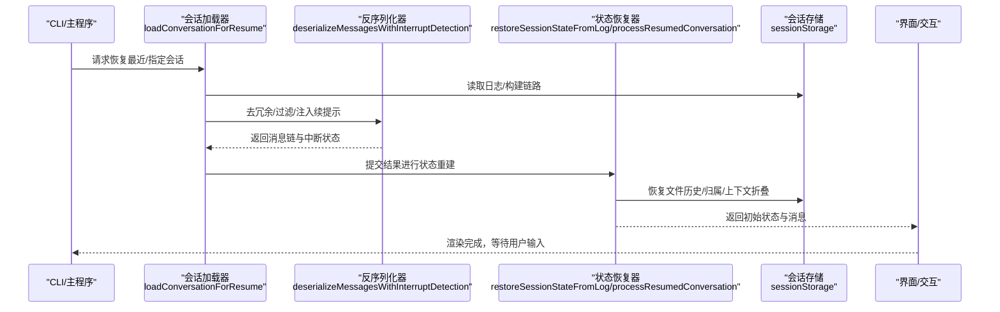
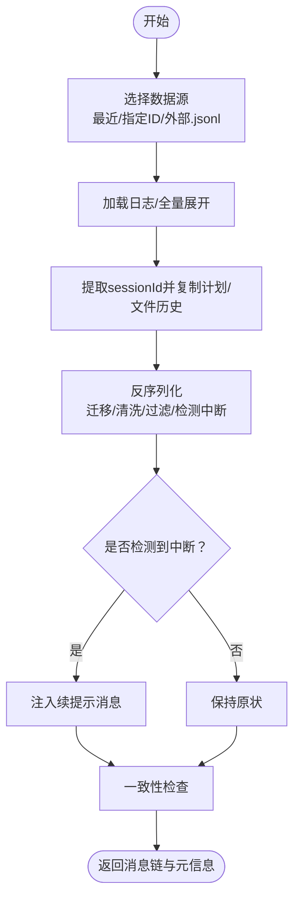
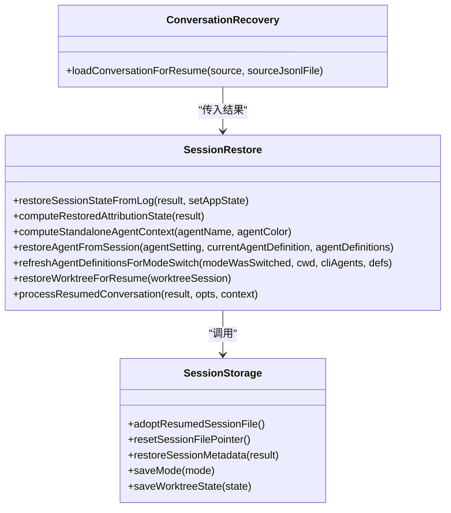
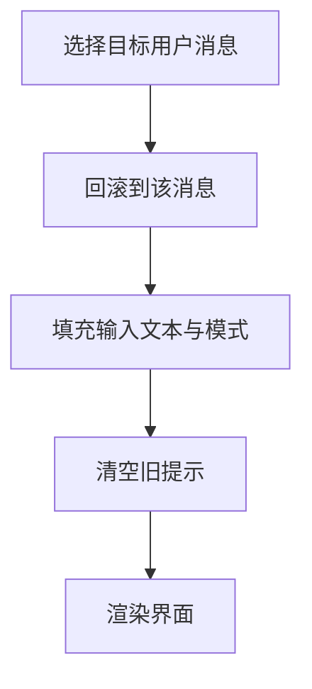
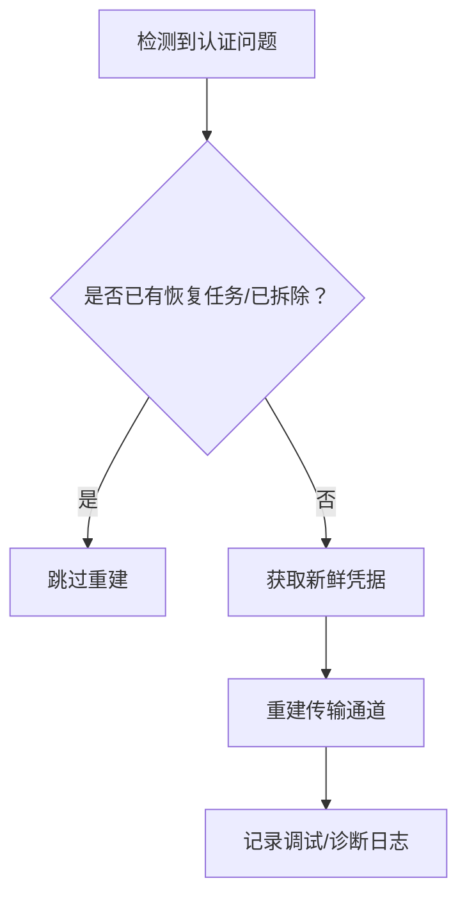
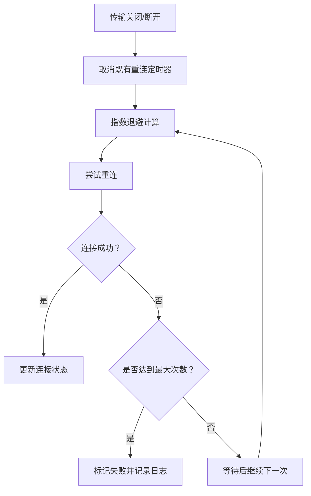
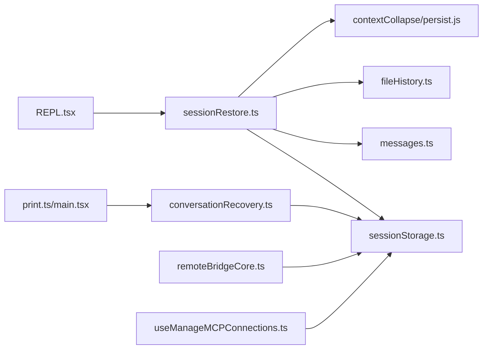

# 会话恢复机制

<cite>
**本文档引用的文件**
- [conversationRecovery.ts](file://src/utils/conversationRecovery.ts)
- [sessionRestore.ts](file://src/utils/sessionRestore.ts)
- [sessionStorage.ts](file://src/utils/sessionStorage.ts)
- [sessionStoragePortable.ts](file://src/utils/sessionStoragePortable.ts)
- [print.ts](file://src/cli/print.ts)
- [main.tsx](file://src/main.tsx)
- [REPL.tsx](file://src/screens/REPL.tsx)
- [remoteBridgeCore.ts](file://src/bridge/remoteBridgeCore.ts)
- [useManageMCPConnections.ts](file://src/services/mcp/useManageMCPConnections.ts)
- [sessionHooks.ts](file://src/utils/hooks/sessionHooks.ts)
- [compact.ts](file://src/services/compact/compact.ts)
</cite>

## 目录
1. [简介](#简介)
2. [项目结构](#项目结构)
3. [核心组件](#核心组件)
4. [架构总览](#架构总览)
5. [详细组件分析](#详细组件分析)
6. [依赖关系分析](#依赖关系分析)
7. [性能考虑](#性能考虑)
8. [故障排除指南](#故障排除指南)
9. [结论](#结论)

## 简介
本文件系统性阐述 Claude Code 的会话恢复机制，覆盖断线重连与会话恢复的技术实现，包括会话状态的保存与加载、消息历史的恢复、工具状态的重建等核心能力。文档详细说明恢复触发条件与执行流程（网络中断检测、自动重连、手动恢复）、数据一致性保障机制（消息顺序验证、状态同步检查、冲突检测与解决）、性能优化策略（增量恢复、并行加载、缓存策略），以及故障排除方法（常见问题诊断、恢复失败处理、数据损坏修复）。

## 项目结构
围绕会话恢复的关键模块与文件如下：
- 会话加载与反序列化：src/utils/conversationRecovery.ts
- 会话状态恢复：src/utils/sessionRestore.ts
- 会话存储与元数据：src/utils/sessionStorage.ts、src/utils/sessionStoragePortable.ts
- CLI 恢复入口：src/cli/print.ts、src/main.tsx
- 交互式恢复与回滚：src/screens/REPL.tsx
- 远程桥接与自动重连：src/bridge/remoteBridgeCore.ts、src/services/mcp/useManageMCPConnections.ts
- 会话钩子与清理：src/utils/hooks/sessionHooks.ts
- 压缩与快照：src/services/compact/compact.ts

**图表来源**
- [conversationRecovery.ts:459-600](file://src/utils/conversationRecovery.ts#L459-L600)
- [sessionRestore.ts:99-150](file://src/utils/sessionRestore.ts#L99-L150)
- [sessionStorage.ts:1-200](file://src/utils/sessionStorage.ts#L1-L200)
- [sessionStoragePortable.ts:1-120](file://src/utils/sessionStoragePortable.ts#L1-L120)
- [print.ts:4911-4985](file://src/cli/print.ts#L4911-L4985)
- [main.tsx:3616-3643](file://src/main.tsx#L3616-L3643)
- [REPL.tsx:3685-3722](file://src/screens/REPL.tsx#L3685-L3722)
- [remoteBridgeCore.ts:332-377](file://src/bridge/remoteBridgeCore.ts#L332-L377)
- [useManageMCPConnections.ts:354-468](file://src/services/mcp/useManageMCPConnections.ts#L354-L468)

**章节来源**
- [conversationRecovery.ts:459-600](file://src/utils/conversationRecovery.ts#L459-L600)
- [sessionRestore.ts:99-150](file://src/utils/sessionRestore.ts#L99-L150)
- [sessionStorage.ts:1-200](file://src/utils/sessionStorage.ts#L1-L200)

## 核心组件
- 会话加载与反序列化：负责从磁盘或远程源加载会话日志，进行去冗余、中断检测、格式规范化，并返回可直接用于渲染的消息链与元信息。
- 会话状态恢复：在加载后重建文件历史、归属信息、上下文折叠、工作树状态、代理设置等，确保恢复后的界面与行为一致。
- 会话存储与元数据：管理会话文件路径、写入队列、尾部元数据重附着、远程桥接、内部事件读写器注册等。
- 交互式恢复与回滚：支持在 REPL 中按消息点回滚、同步恢复到指定用户消息、填充输入内容等。
- 远程桥接与自动重连：在网络中断时主动刷新凭据、重建传输通道，避免重复重建导致的 409 冲突。
- MCP 自动重连：对远程 MCP 服务器进行指数退避重连，支持取消与状态更新。
- 会话钩子与清理：提供会话级钩子的清理与管理，避免残留状态影响后续恢复。

**章节来源**
- [conversationRecovery.ts:154-252](file://src/utils/conversationRecovery.ts#L154-L252)
- [sessionRestore.ts:99-150](file://src/utils/sessionRestore.ts#L99-L150)
- [sessionStorage.ts:530-520](file://src/utils/sessionStorage.ts#L530-L520)
- [REPL.tsx:3685-3722](file://src/screens/REPL.tsx#L3685-L3722)
- [remoteBridgeCore.ts:332-377](file://src/bridge/remoteBridgeCore.ts#L332-L377)
- [useManageMCPConnections.ts:354-468](file://src/services/mcp/useManageMCPConnections.ts#L354-L468)
- [sessionHooks.ts:429-447](file://src/utils/hooks/sessionHooks.ts#L429-L447)

## 架构总览
会话恢复的整体流程分为“加载—反序列化—状态重建—渲染”四个阶段，同时贯穿“一致性校验—增量恢复—并行加载—缓存策略”的性能与可靠性保障。

**图表来源**
- [conversationRecovery.ts:459-600](file://src/utils/conversationRecovery.ts#L459-L600)
- [sessionRestore.ts:99-150](file://src/utils/sessionRestore.ts#L99-L150)
- [sessionStorage.ts:1-200](file://src/utils/sessionStorage.ts#L1-L200)

## 详细组件分析

### 组件A：会话加载与反序列化
- 功能要点
  - 支持从最近会话、指定会话 ID、或外部 .jsonl 路径加载。
  - 对轻量日志进行全量展开，提取 sessionId 并复制计划与文件历史。
  - 反序列化阶段进行遗留附件类型迁移、权限模式清洗、未解析工具使用过滤、孤儿思维消息过滤、空白助手消息过滤，并检测中断状态。
  - 若检测到“中途被打断”，自动注入“继续”型用户消息以统一后续处理。
  - 在加载完成后进行一致性检查，记录写入-加载往返差异指标。
- 关键流程图

**图表来源**
- [conversationRecovery.ts:459-600](file://src/utils/conversationRecovery.ts#L459-L600)
- [conversationRecovery.ts:164-252](file://src/utils/conversationRecovery.ts#L164-L252)
- [conversationRecovery.ts:2225-2244](file://src/utils/conversationRecovery.ts#L2225-L2244)

**章节来源**
- [conversationRecovery.ts:459-600](file://src/utils/conversationRecovery.ts#L459-L600)
- [conversationRecovery.ts:164-252](file://src/utils/conversationRecovery.ts#L164-L252)
- [conversationRecovery.ts:2225-2244](file://src/utils/conversationRecovery.ts#L2225-L2244)

### 组件B：会话状态恢复
- 功能要点
  - 文件历史快照恢复、归属信息快照恢复、上下文折叠提交与快照恢复。
  - TodoWrite 待办列表从转录中提取并注入到应用状态。
  - 代理设置与模型覆盖恢复；协调员/普通模式切换后重新派生代理定义。
  - 工作树状态恢复：若会话最后处于工作树内，则恢复目录与缓存；若为跨项目恢复，优先保留新工作树。
  - 会话元数据重附着：在退出时重新追加标题、标签、代理名/色等元数据，确保 --resume 能正确识别。
- 关键类图

**图表来源**
- [sessionRestore.ts:99-150](file://src/utils/sessionRestore.ts#L99-L150)
- [sessionRestore.ts:409-551](file://src/utils/sessionRestore.ts#L409-L551)
- [sessionStorage.ts:721-800](file://src/utils/sessionStorage.ts#L721-L800)

**章节来源**
- [sessionRestore.ts:99-150](file://src/utils/sessionRestore.ts#L99-L150)
- [sessionRestore.ts:409-551](file://src/utils/sessionRestore.ts#L409-L551)
- [sessionStorage.ts:721-800](file://src/utils/sessionStorage.ts#L721-L800)

### 组件C：交互式恢复与回滚
- 功能要点
  - 支持将界面回滚到任意用户消息，同步填充输入文本与模式，避免闪烁。
  - 在重置上下文折叠状态后，重新构建折叠视图，确保上下文一致性。
- 关键流程图

**图表来源**
- [REPL.tsx:3685-3722](file://src/screens/REPL.tsx#L3685-L3722)

**章节来源**
- [REPL.tsx:3685-3722](file://src/screens/REPL.tsx#L3685-L3722)

### 组件D：远程桥接与自动重连
- 功能要点
  - 在远程桥接层检测到认证恢复进行中或已拆除时，避免重复重建，防止 409。
  - 主动刷新远端凭据并重建传输通道，记录诊断事件与错误日志。
- 关键流程图

**图表来源**
- [remoteBridgeCore.ts:332-377](file://src/bridge/remoteBridgeCore.ts#L332-L377)

**章节来源**
- [remoteBridgeCore.ts:332-377](file://src/bridge/remoteBridgeCore.ts#L332-L377)

### 组件E：MCP 自动重连
- 功能要点
  - 对非本地 stdio 与非内部 SDK 的传输类型进行自动重连。
  - 指数退避重试，支持取消现有重连定时器，最终失败时更新状态。
- 关键流程图

**图表来源**
- [useManageMCPConnections.ts:354-468](file://src/services/mcp/useManageMCPConnections.ts#L354-L468)

**章节来源**
- [useManageMCPConnections.ts:354-468](file://src/services/mcp/useManageMCPConnections.ts#L354-L468)

## 依赖关系分析
- 低耦合高内聚
  - conversationRecovery.ts 仅依赖 session 存储与消息工具，不直接依赖 UI。
  - sessionRestore.ts 通过 sessionStorage 完成元数据与状态恢复，避免 UI 逻辑侵入。
- 外部依赖
  - 远程桥接与 MCP 服务作为外部系统，通过独立模块管理其生命周期与重连策略。
- 潜在循环依赖
  - 未发现直接循环依赖；各模块职责清晰，通过函数调用与事件驱动交互。

**图表来源**
- [conversationRecovery.ts:1-601](file://src/utils/conversationRecovery.ts#L1-L601)
- [sessionRestore.ts:1-552](file://src/utils/sessionRestore.ts#L1-L552)
- [sessionStorage.ts:1-200](file://src/utils/sessionStorage.ts#L1-L200)
- [print.ts:4911-4985](file://src/cli/print.ts#L4911-L4985)
- [main.tsx:3616-3643](file://src/main.tsx#L3616-L3643)
- [REPL.tsx:3685-3722](file://src/screens/REPL.tsx#L3685-L3722)
- [remoteBridgeCore.ts:332-377](file://src/bridge/remoteBridgeCore.ts#L332-L377)
- [useManageMCPConnections.ts:354-468](file://src/services/mcp/useManageMCPConnections.ts#L354-L468)

**章节来源**
- [conversationRecovery.ts:1-601](file://src/utils/conversationRecovery.ts#L1-L601)
- [sessionRestore.ts:1-552](file://src/utils/sessionRestore.ts#L1-L552)
- [sessionStorage.ts:1-200](file://src/utils/sessionStorage.ts#L1-L200)

## 性能考虑
- 增量恢复
  - 使用父 UUID 链路重建消息，仅插入新增消息，避免全量重写。
  - 一致性检查仅在恢复时触发，减少常规运行时开销。
- 并行加载
  - 便携式存储工具提供分块读取与边界扫描，支持大文件高效加载。
  - 会话元数据重附着采用尾窗口读取，避免全文件扫描。
- 缓存策略
  - 项目目录与代理定义等结果进行缓存，减少重复计算。
  - 工作树与计划目录缓存随恢复过程清理或重建，确保一致性。
- I/O 优化
  - 写入队列批量化与限流，避免频繁刷盘。
  - 大文件读取采用固定缓冲区与分块扫描，控制内存峰值。

[本节为通用性能讨论，无需具体文件分析]

## 故障排除指南
- 常见问题与诊断
  - 恢复失败：检查会话文件是否存在、大小是否为 0、权限是否正确。
  - 断线重连失败：查看远程桥接与 MCP 重连日志，确认凭据是否过期或被撤销。
  - 消息顺序异常：启用一致性检查事件，观察 tengu_resume_consistency_delta 指标。
- 恢复失败处理
  - 使用外部 .jsonl 路径进行跨目录恢复，绕过项目目录解析问题。
  - 清理会话钩子与缓存，避免残留状态干扰。
- 数据损坏修复
  - 利用压缩服务的保留段与快照，重建上下文折叠与文件历史。
  - 通过便携式存储工具的边界扫描与属性快照重排，修复截断文件。

**章节来源**
- [sessionStorage.ts:2225-2244](file://src/utils/sessionStorage.ts#L2225-L2244)
- [sessionRestore.ts:121-136](file://src/utils/sessionRestore.ts#L121-L136)
- [sessionHooks.ts:429-447](file://src/utils/hooks/sessionHooks.ts#L429-L447)
- [compact.ts:1422-1435](file://src/services/compact/compact.ts#L1422-L1435)

## 结论
Claude Code 的会话恢复机制通过“加载—反序列化—状态重建—渲染”的流水线，结合“一致性校验—增量恢复—并行加载—缓存策略”，在保证数据正确性的前提下实现了高效的断线重连与会话恢复。远程桥接与 MCP 的自动重连进一步增强了网络中断场景下的可用性。配合完善的故障排除流程，系统能够在复杂场景下稳定恢复并保持用户体验的一致性。