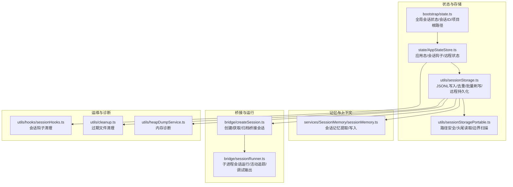
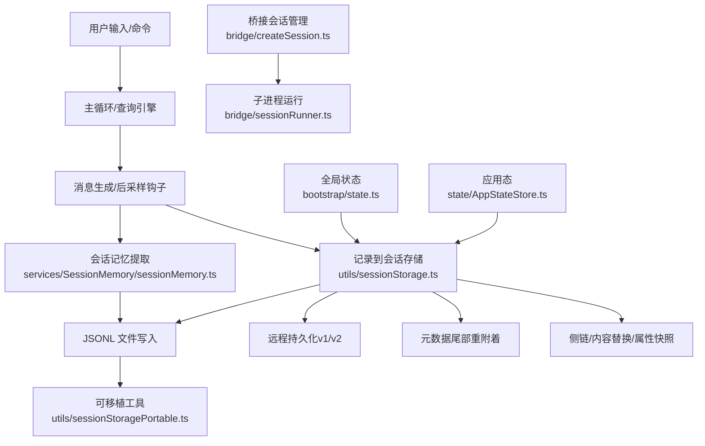
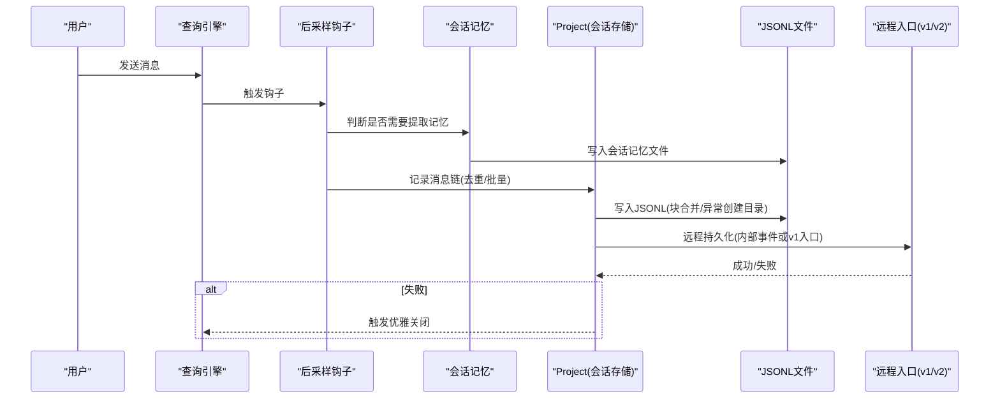
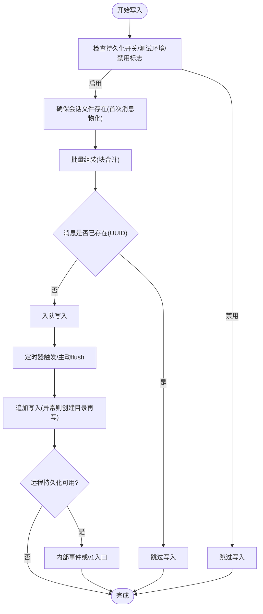
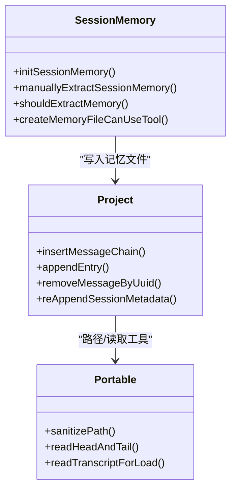
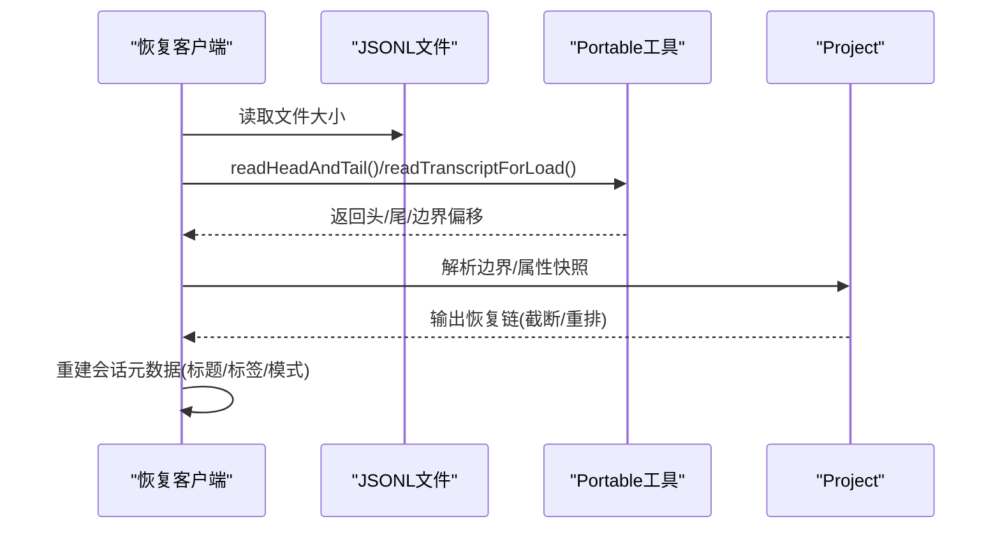
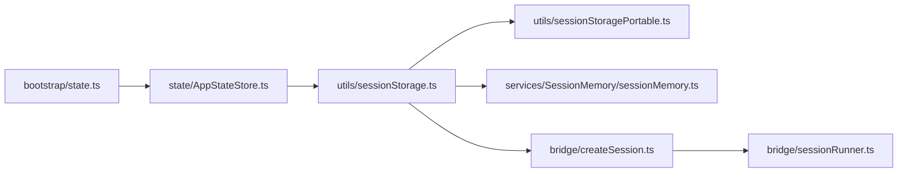

# 会话状态管理

<cite>
**本文档引用的文件**
- [src/bootstrap/state.ts](file://src/bootstrap/state.ts)
- [src/state/AppStateStore.ts](file://src/state/AppStateStore.ts)
- [src/utils/sessionStorage.ts](file://src/utils/sessionStorage.ts)
- [src/utils/sessionStoragePortable.ts](file://src/utils/sessionStoragePortable.ts)
- [src/services/SessionMemory/sessionMemory.ts](file://src/services/SessionMemory/sessionMemory.ts)
- [src/bridge/createSession.ts](file://src/bridge/createSession.ts)
- [src/bridge/sessionRunner.ts](file://src/bridge/sessionRunner.ts)
- [src/utils/heapDumpService.ts](file://src/utils/heapDumpService.ts)
- [src/utils/cleanup.ts](file://src/utils/cleanup.ts)
- [src/utils/hooks/sessionHooks.ts](file://src/utils/hooks/sessionHooks.ts)
</cite>

## 目录
1. [简介](#简介)
2. [项目结构](#项目结构)
3. [核心组件](#核心组件)
4. [架构总览](#架构总览)
5. [详细组件分析](#详细组件分析)
6. [依赖关系分析](#依赖关系分析)
7. [性能考虑](#性能考虑)
8. [故障排除指南](#故障排除指南)
9. [结论](#结论)

## 简介
本文件系统性阐述 Claude Code 的会话状态管理系统，覆盖会话生命周期（创建、初始化、运行、暂停、恢复、销毁）、状态持久化策略（内存与磁盘）、上下文管理（项目上下文、系统提示、记忆管理、上下文窗口优化）、会话恢复机制（断线重连、状态同步、数据一致性、冲突解决），并提供优化技巧与故障排除方法。内容面向不同技术背景读者，既提供高层概览也包含代码级细节与可视化图示。

## 项目结构
围绕会话状态管理的关键模块包括：
- 全局状态与会话标识：bootstrap/state.ts 提供会话级全局状态、会话 ID、项目根路径、成本与时长统计、交互时间等。
- 应用态与会话钩子：state/AppStateStore.ts 定义应用态结构，包含会话钩子映射、权限模式、远程连接状态等。
- 会话存储与写入队列：utils/sessionStorage.ts 实现 JSONL 会话文件的写入、去重、批量刷写、远程持久化、元数据重附着等。
- 可移植存储工具：utils/sessionStoragePortable.ts 提供跨平台的路径安全化、头尾读取、边界扫描等通用能力。
- 会话记忆（自动记忆）：services/SessionMemory/sessionMemory.ts 基于后采样钩子周期性提取会话记忆，写入文件并受阈值控制。
- 桥接会话（远程/本地桥接）：bridge/createSession.ts 与 bridge/sessionRunner.ts 支持在桥接环境创建/运行/归档会话，并处理进程间活动与调试日志。
- 内存诊断与清理：utils/heapDumpService.ts 提供内存诊断；utils/cleanup.ts 提供过期会话文件清理。
- 会话钩子清理：utils/hooks/sessionHooks.ts 提供按会话维度清理钩子的能力。

**图表来源**
- [src/bootstrap/state.ts:431-480](file://src/bootstrap/state.ts#L431-L480)
- [src/state/AppStateStore.ts:89-452](file://src/state/AppStateStore.ts#L89-L452)
- [src/utils/sessionStorage.ts:532-1385](file://src/utils/sessionStorage.ts#L532-L1385)
- [src/utils/sessionStoragePortable.ts:325-466](file://src/utils/sessionStoragePortable.ts#L325-L466)
- [src/services/SessionMemory/sessionMemory.ts:272-375](file://src/services/SessionMemory/sessionMemory.ts#L272-L375)
- [src/bridge/createSession.ts:34-180](file://src/bridge/createSession.ts#L34-L180)
- [src/bridge/sessionRunner.ts:248-547](file://src/bridge/sessionRunner.ts#L248-L547)
- [src/utils/heapDumpService.ts:32-127](file://src/utils/heapDumpService.ts#L32-L127)
- [src/utils/cleanup.ts:155-159](file://src/utils/cleanup.ts#L155-L159)

**章节来源**
- [src/bootstrap/state.ts:431-480](file://src/bootstrap/state.ts#L431-L480)
- [src/state/AppStateStore.ts:89-452](file://src/state/AppStateStore.ts#L89-L452)
- [src/utils/sessionStorage.ts:532-1385](file://src/utils/sessionStorage.ts#L532-L1385)
- [src/utils/sessionStoragePortable.ts:325-466](file://src/utils/sessionStoragePortable.ts#L325-L466)
- [src/services/SessionMemory/sessionMemory.ts:272-375](file://src/services/SessionMemory/sessionMemory.ts#L272-L375)
- [src/bridge/createSession.ts:34-180](file://src/bridge/createSession.ts#L34-L180)
- [src/bridge/sessionRunner.ts:248-547](file://src/bridge/sessionRunner.ts#L248-L547)
- [src/utils/heapDumpService.ts:32-127](file://src/utils/heapDumpService.ts#L32-L127)
- [src/utils/cleanup.ts:155-159](file://src/utils/cleanup.ts#L155-L159)
- [src/utils/hooks/sessionHooks.ts:437-447](file://src/utils/hooks/sessionHooks.ts#L437-L447)

## 核心组件
- 全局会话状态（bootstrap/state.ts）
  - 维护会话 ID、父会话 ID、项目根目录、工作目录、成本与时长统计、交互时间、令牌预算、提示缓存标记、远程模式标志等。
  - 提供会话切换、会话再生、持久化开关、计划模式退出标记等操作。
- 应用态与会话钩子（state/AppStateStore.ts）
  - 定义应用态结构，包含任务、插件、通知、权限、远程连接、REPL 上下文、团队上下文、提示建议、推测态、技能改进等。
  - 提供 sessionHooks 映射，用于按会话维度注册与清理钩子。
- 会话存储（utils/sessionStorage.ts）
  - 使用 Project 单例管理写入队列、批量刷写、去重、远程持久化（v1 会话入口或 CCR v2 内部事件）。
  - 支持侧链（agent sidechain）写入、内容替换记录、属性快照、摘要、标题/标签等元数据的尾部重附着以保证可恢复性。
- 可移植存储工具（utils/sessionStoragePortable.ts）
  - 路径安全化、头尾读取、首提示提取、边界扫描（紧凑边界）、工作树路径解析等。
- 会话记忆（services/SessionMemory/sessionMemory.ts）
  - 基于后采样钩子在合适时机提取会话记忆，写入专用文件，受令牌增长阈值、工具调用次数阈值与最后助手轮无工具调用等条件控制。
- 桥接会话（bridge/createSession.ts、bridge/sessionRunner.ts）
  - 创建/获取/归档桥接会话，支持 v1 与 v2 传输路径；子进程运行会话，追踪活动、stderr、权限请求、调试输出与令牌刷新。
- 运维与诊断（utils/heapDumpService.ts、utils/cleanup.ts、utils/hooks/sessionHooks.ts）
  - 内存诊断（堆使用、原生内存、句柄/请求计数、文件描述符等）；过期会话文件清理；按会话清理钩子。

**章节来源**
- [src/bootstrap/state.ts:431-480](file://src/bootstrap/state.ts#L431-L480)
- [src/state/AppStateStore.ts:89-452](file://src/state/AppStateStore.ts#L89-L452)
- [src/utils/sessionStorage.ts:532-1385](file://src/utils/sessionStorage.ts#L532-L1385)
- [src/utils/sessionStoragePortable.ts:325-466](file://src/utils/sessionStoragePortable.ts#L325-L466)
- [src/services/SessionMemory/sessionMemory.ts:272-375](file://src/services/SessionMemory/sessionMemory.ts#L272-L375)
- [src/bridge/createSession.ts:34-180](file://src/bridge/createSession.ts#L34-L180)
- [src/bridge/sessionRunner.ts:248-547](file://src/bridge/sessionRunner.ts#L248-L547)
- [src/utils/heapDumpService.ts:32-127](file://src/utils/heapDumpService.ts#L32-L127)
- [src/utils/cleanup.ts:155-159](file://src/utils/cleanup.ts#L155-L159)
- [src/utils/hooks/sessionHooks.ts:437-447](file://src/utils/hooks/sessionHooks.ts#L437-L447)

## 架构总览
会话状态管理由“状态层（内存）+ 存储层（磁盘/远程）+ 上下文层（项目/系统提示/记忆）+ 恢复层（断线/重连/一致性）”构成，贯穿 CLI、REPL、桥接与远程模式。

**图表来源**
- [src/services/SessionMemory/sessionMemory.ts:272-375](file://src/services/SessionMemory/sessionMemory.ts#L272-L375)
- [src/utils/sessionStorage.ts:532-1385](file://src/utils/sessionStorage.ts#L532-L1385)
- [src/utils/sessionStoragePortable.ts:215-282](file://src/utils/sessionStoragePortable.ts#L215-L282)
- [src/bridge/createSession.ts:34-180](file://src/bridge/createSession.ts#L34-L180)
- [src/bridge/sessionRunner.ts:248-547](file://src/bridge/sessionRunner.ts#L248-L547)
- [src/bootstrap/state.ts:431-480](file://src/bootstrap/state.ts#L431-L480)
- [src/state/AppStateStore.ts:89-452](file://src/state/AppStateStore.ts#L89-L452)

## 详细组件分析

### 会话生命周期管理
- 创建与初始化
  - 会话 ID 通过随机 UUID 生成，项目根路径稳定不变，工作目录可变；首次用户/助手消息触发会话文件物化与元数据写入。
  - 会话切换与再生：switchSession/regenerateSessionId 更新当前会话 ID 与项目目录，同时清理计划 slug 缓存，确保不会产生键漂移。
- 运行期
  - 记录消息链（含 parentUuid、logicalParentUuid、isSidechain、agentId、teamName/agentName 等），对非进度类消息建立链式关系。
  - 批量刷写与去重：写入队列按块合并，超过阈值时分批写入；对已存在 UUID 的消息跳过写入，避免重复。
  - 远程持久化：优先内部事件写入（CCR v2），否则走 v1 会话入口；失败时触发优雅关闭。
- 暂停与恢复
  - 采用紧凑边界（compact boundary）与属性快照（attribution-snapshot）机制，加载时进行边界扫描与快照重排，确保恢复一致性。
  - 会话元数据（标题、标签、代理名/颜色、模式、PR 链接、工作树状态等）通过尾部重附着保证即使文件增长也能被快速读取。
- 销毁
  - 清理钩子：按会话维度清理钩子映射；过期文件清理：定期扫描并删除过期会话文件；桥接会话归档：在关闭时调用归档接口。

**图表来源**
- [src/services/SessionMemory/sessionMemory.ts:272-375](file://src/services/SessionMemory/sessionMemory.ts#L272-L375)
- [src/utils/sessionStorage.ts:532-1385](file://src/utils/sessionStorage.ts#L532-L1385)

**章节来源**
- [src/bootstrap/state.ts:431-480](file://src/bootstrap/state.ts#L431-L480)
- [src/utils/sessionStorage.ts:532-1385](file://src/utils/sessionStorage.ts#L532-L1385)
- [src/utils/sessionStoragePortable.ts:472-793](file://src/utils/sessionStoragePortable.ts#L472-L793)
- [src/utils/hooks/sessionHooks.ts:437-447](file://src/utils/hooks/sessionHooks.ts#L437-L447)
- [src/utils/cleanup.ts:155-159](file://src/utils/cleanup.ts#L155-L159)

### 状态持久化策略
- 内存状态
  - 全局状态：会话 ID、项目根路径、成本与时长、交互时间、令牌预算、提示缓存标记、远程模式等。
  - 应用态：任务、插件、通知、权限、远程连接、REPL 上下文、团队上下文、提示建议、推测态、技能改进等。
  - 会话钩子：按会话维度注册与清理，避免跨会话污染。
- 磁盘存储
  - JSONL 文件：每条消息一行，带 parentUuid、agentId、teamName 等字段；侧链消息写入独立文件；内容替换记录按 agentId 分发。
  - 元数据：标题、标签、代理名/颜色、模式、PR 链接、工作树状态等通过尾部重附着保持在最近 64KB 窗口内，便于快速读取。
  - 路径安全：对项目路径进行安全化处理，避免跨平台不兼容与长度限制问题。
- 增量更新与远程持久化
  - 写入队列：按块合并，超过阈值（100MB）拆分写入，减少 I/O 次数。
  - 去重：基于消息 UUID，避免重复写入；侧链消息仅写入侧链文件，避免主会话链断裂。
  - 远程持久化：优先 CCR v2 内部事件写入，失败回退至 v1 会话入口；失败触发优雅关闭以保护数据一致性。

**图表来源**
- [src/utils/sessionStorage.ts:532-1385](file://src/utils/sessionStorage.ts#L532-L1385)
- [src/utils/sessionStoragePortable.ts:325-466](file://src/utils/sessionStoragePortable.ts#L325-L466)

**章节来源**
- [src/bootstrap/state.ts:431-480](file://src/bootstrap/state.ts#L431-L480)
- [src/state/AppStateStore.ts:89-452](file://src/state/AppStateStore.ts#L89-L452)
- [src/utils/sessionStorage.ts:532-1385](file://src/utils/sessionStorage.ts#L532-L1385)
- [src/utils/sessionStoragePortable.ts:325-466](file://src/utils/sessionStoragePortable.ts#L325-L466)

### 上下文管理
- 项目上下文提取
  - 项目目录通过路径安全化与 canonicalize 后定位；支持工作树回退查找，确保跨工作树场景正确解析。
- 系统提示构建
  - 从常量与上下文中动态拼装系统提示，结合用户上下文与系统上下文，形成稳定的提示缓存键。
- 记忆管理
  - 会话记忆文件按需创建与模板初始化；提取逻辑仅允许对记忆文件执行编辑工具，其他工具调用一律拒绝，防止污染。
  - 提取频率受令牌增长阈值、工具调用次数阈值与最后助手轮无工具调用三者共同约束。
- 上下文窗口优化
  - 紧凑边界扫描与属性快照重排，避免大文件全量扫描；首提示提取与元数据尾部重附着提升加载性能。

**图表来源**
- [src/services/SessionMemory/sessionMemory.ts:272-375](file://src/services/SessionMemory/sessionMemory.ts#L272-L375)
- [src/utils/sessionStorage.ts:532-1385](file://src/utils/sessionStorage.ts#L532-L1385)
- [src/utils/sessionStoragePortable.ts:215-282](file://src/utils/sessionStoragePortable.ts#L215-L282)

**章节来源**
- [src/utils/sessionStoragePortable.ts:325-466](file://src/utils/sessionStoragePortable.ts#L325-L466)
- [src/services/SessionMemory/sessionMemory.ts:272-375](file://src/services/SessionMemory/sessionMemory.ts#L272-L375)

### 会话恢复机制
- 断线重连
  - 桥接会话支持断线重连与权限请求转发；子进程活动与错误日志通过 stdout/stderr 流式解析，便于诊断。
- 状态同步
  - 采用紧凑边界扫描与属性快照重排，确保恢复时截断点正确；元数据尾部重附着保证标题/标签等关键信息始终可见。
- 数据一致性
  - 写入前对 UUID 去重，侧链消息单独文件，避免主链断裂；远程持久化失败触发优雅关闭，防止半写入。
- 冲突解决
  - 侧链与主链 UUID 不交叉去重；内容替换记录按 agentId 分发，避免主会话遗漏继承上下文。

**图表来源**
- [src/utils/sessionStoragePortable.ts:215-282](file://src/utils/sessionStoragePortable.ts#L215-L282)
- [src/utils/sessionStorage.ts:717-793](file://src/utils/sessionStorage.ts#L717-L793)

**章节来源**
- [src/utils/sessionStoragePortable.ts:472-793](file://src/utils/sessionStoragePortable.ts#L472-L793)
- [src/utils/sessionStorage.ts:717-793](file://src/utils/sessionStorage.ts#L717-L793)

### 会话优化技巧
- 内存管理
  - 使用内存诊断服务捕获堆使用、原生内存、句柄/请求计数、文件描述符等指标，辅助定位泄漏与资源占用。
  - 会话钩子按会话清理，避免长期持有引用导致内存膨胀。
- 性能监控
  - 令牌预算与预算延续计数跟踪，帮助评估单轮消耗与续传行为；成本与时长统计用于会话级性能评估。
- 资源清理
  - 过期会话文件清理：定期扫描并删除过期文件，释放磁盘空间；桥接会话归档：在关闭时调用归档接口，避免悬挂资源。
- 并发控制
  - 写入队列按文件维度维护，块合并与定时器触发，避免频繁小写入；侧链与主链分离写入，降低锁竞争。

**章节来源**
- [src/utils/heapDumpService.ts:32-127](file://src/utils/heapDumpService.ts#L32-L127)
- [src/utils/hooks/sessionHooks.ts:437-447](file://src/utils/hooks/sessionHooks.ts#L437-L447)
- [src/utils/cleanup.ts:155-159](file://src/utils/cleanup.ts#L155-L159)
- [src/utils/sessionStorage.ts:532-1385](file://src/utils/sessionStorage.ts#L532-L1385)

## 依赖关系分析
- 组件耦合
  - bootstrap/state.ts 与 state/AppStateStore.ts 通过会话 ID 与项目根路径耦合，确保会话切换时不产生路径漂移。
  - utils/sessionStorage.ts 依赖 portable 工具进行路径与读取，依赖远程入口进行持久化。
  - services/SessionMemory/sessionMemory.ts 依赖存储层写入记忆文件，受自动紧凑设置影响。
- 外部依赖
  - 桥接会话依赖外部 API（创建/获取/归档），并通过子进程与标准流进行通信。
- 循环依赖规避
  - 通过可移植工具与延迟导入避免循环依赖；会话钩子清理函数独立导出，避免跨模块耦合。

**图表来源**
- [src/bootstrap/state.ts:431-480](file://src/bootstrap/state.ts#L431-L480)
- [src/state/AppStateStore.ts:89-452](file://src/state/AppStateStore.ts#L89-L452)
- [src/utils/sessionStorage.ts:532-1385](file://src/utils/sessionStorage.ts#L532-L1385)
- [src/utils/sessionStoragePortable.ts:325-466](file://src/utils/sessionStoragePortable.ts#L325-L466)
- [src/services/SessionMemory/sessionMemory.ts:272-375](file://src/services/SessionMemory/sessionMemory.ts#L272-L375)
- [src/bridge/createSession.ts:34-180](file://src/bridge/createSession.ts#L34-L180)
- [src/bridge/sessionRunner.ts:248-547](file://src/bridge/sessionRunner.ts#L248-L547)

**章节来源**
- [src/bootstrap/state.ts:431-480](file://src/bootstrap/state.ts#L431-L480)
- [src/state/AppStateStore.ts:89-452](file://src/state/AppStateStore.ts#L89-L452)
- [src/utils/sessionStorage.ts:532-1385](file://src/utils/sessionStorage.ts#L532-L1385)
- [src/utils/sessionStoragePortable.ts:325-466](file://src/utils/sessionStoragePortable.ts#L325-L466)
- [src/services/SessionMemory/sessionMemory.ts:272-375](file://src/services/SessionMemory/sessionMemory.ts#L272-L375)
- [src/bridge/createSession.ts:34-180](file://src/bridge/createSession.ts#L34-L180)
- [src/bridge/sessionRunner.ts:248-547](file://src/bridge/sessionRunner.ts#L248-L547)

## 性能考虑
- I/O 优化
  - 块合并与阈值控制（100MB）减少写入次数；头尾读取与边界扫描避免全量扫描。
- 内存与资源
  - 写入队列与定时器触发，避免高频小写入；内存诊断服务辅助定位泄漏与资源占用。
- 恢复效率
  - 紧凑边界与属性快照重排，减少恢复时的扫描与重组开销；元数据尾部重附着提升加载速度。

[本节为通用指导，无需特定文件引用]

## 故障排除指南
- 会话无法写入/权限问题
  - 检查持久化开关与测试环境变量；确认目录权限与磁盘空间；必要时手动创建目录后重试。
- 恢复不一致/链断裂
  - 确认紧凑边界与属性快照是否正确；检查侧链与主链 UUID 是否交叉；查看尾部元数据是否被覆盖。
- 远程持久化失败
  - 检查远程入口 URL 与网络状态；查看内部事件写入器是否注册；失败时触发优雅关闭，避免半写入。
- 内存泄漏/资源占用过高
  - 使用内存诊断服务捕获堆使用、原生内存、句柄/请求计数、文件描述符等指标；按会话清理钩子与过期文件清理策略排查。
- 桥接会话异常
  - 查看子进程 stderr 日志与活动追踪；确认权限请求是否被正确转发；检查令牌刷新与调试文件路径。

**章节来源**
- [src/utils/sessionStorage.ts:841-951](file://src/utils/sessionStorage.ts#L841-L951)
- [src/utils/sessionStoragePortable.ts:215-282](file://src/utils/sessionStoragePortable.ts#L215-L282)
- [src/bridge/sessionRunner.ts:348-547](file://src/bridge/sessionRunner.ts#L348-L547)
- [src/utils/heapDumpService.ts:32-127](file://src/utils/heapDumpService.ts#L32-L127)
- [src/utils/cleanup.ts:155-159](file://src/utils/cleanup.ts#L155-L159)
- [src/utils/hooks/sessionHooks.ts:437-447](file://src/utils/hooks/sessionHooks.ts#L437-L447)

## 结论
Claude Code 的会话状态管理通过“全局状态 + 会话存储 + 上下文与记忆 + 恢复一致性”的设计，在保证高性能与可扩展性的同时，提供了稳健的会话生命周期管理与恢复能力。借助块合并、去重、紧凑边界与元数据尾部重附着等技术，系统在大规模会话场景下仍能保持良好的性能与可靠性。配合内存诊断、过期清理与桥接会话管理，整体生态具备完善的运维与故障排除能力。