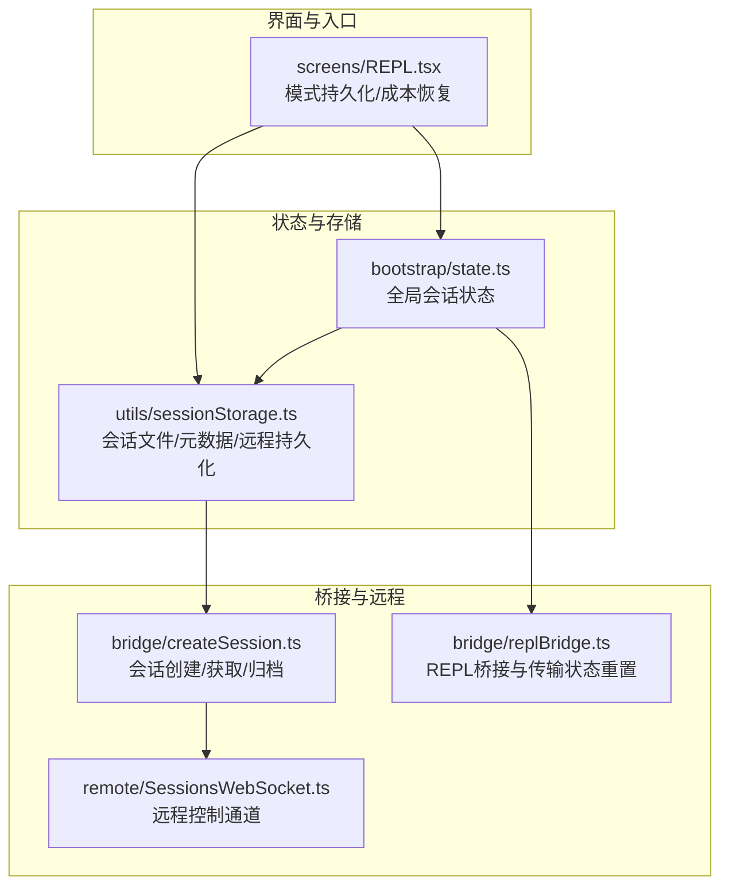
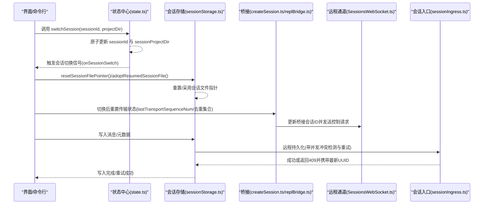
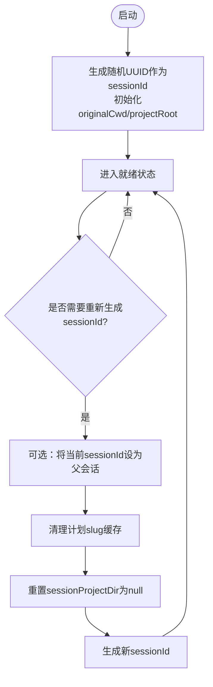
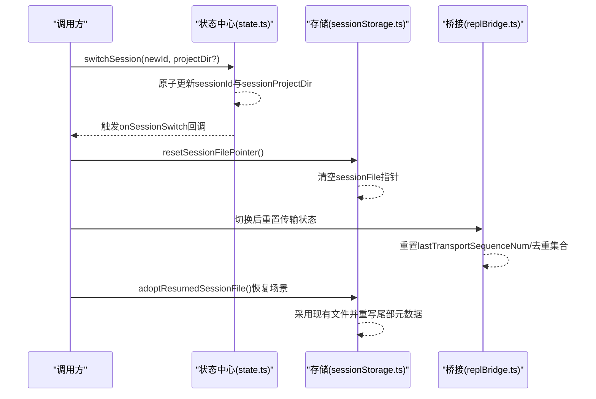
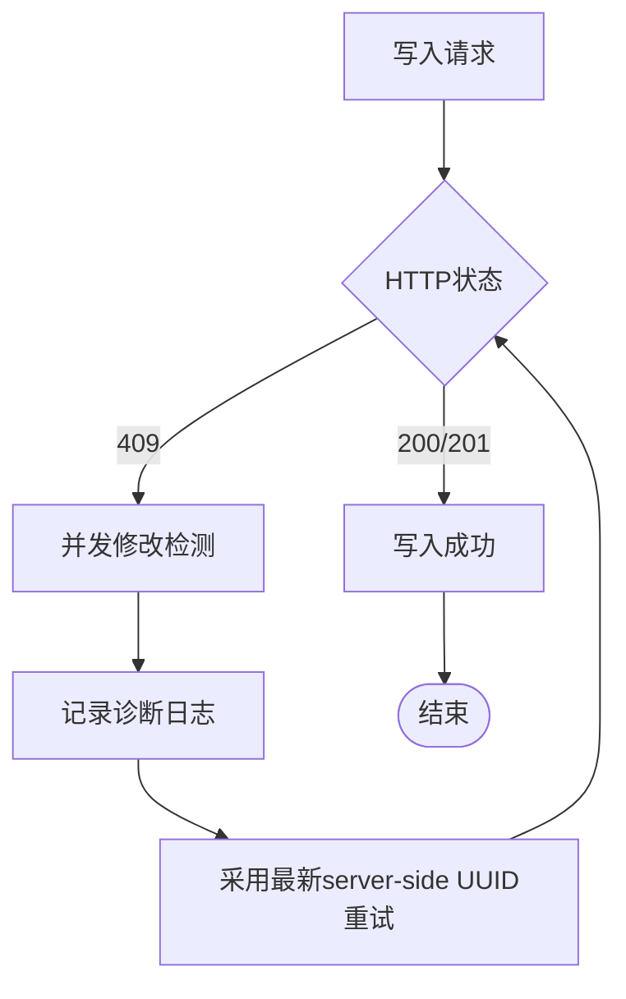
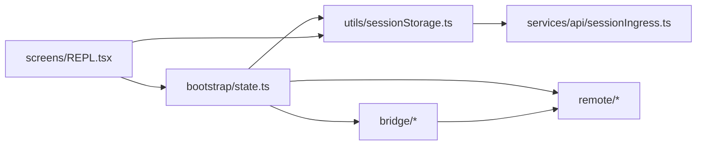

# 会话生命周期管理

<cite>
**本文引用的文件**
- [src/bootstrap/state.ts](file://src/bootstrap/state.ts)
- [src/utils/sessionStorage.ts](file://src/utils/sessionStorage.ts)
- [src/bridge/createSession.ts](file://src/bridge/createSession.ts)
- [src/bridge/replBridge.ts](file://src/bridge/replBridge.ts)
- [src/services/api/sessionIngress.ts](file://src/services/api/sessionIngress.ts)
- [src/remote/SessionsWebSocket.ts](file://src/remote/SessionsWebSocket.ts)
- [src/screens/REPL.tsx](file://src/screens/REPL.tsx)
</cite>

## 目录
1. [简介](#简介)
2. [项目结构](#项目结构)
3. [核心组件](#核心组件)
4. [架构总览](#架构总览)
5. [详细组件分析](#详细组件分析)
6. [依赖关系分析](#依赖关系分析)
7. [性能考量](#性能考量)
8. [故障排查指南](#故障排查指南)
9. [结论](#结论)

## 简介
本文件系统化阐述 Claude Code 的会话生命周期管理，覆盖从会话创建、标识符生成与管理、状态切换、父子会话关联、跨进程/跨模块一致性，到会话元数据持久化与恢复的完整流程。重点解释以下关键机制：
- 原子性会话切换：switchSession 如何保证 sessionId 与 sessionProjectDir 同步更新，以及会话切换信号的触发。
- 会话标识符管理：regenerateSessionId 的实现、UUID 生成策略、父会话继承关系维护。
- 会话状态查询与修改：如何通过统一的状态入口获取原始工作目录、项目根目录、当前工作目录等关键状态。
- 持久化与并发冲突处理：会话元数据写入、尾部重写、并发修改检测与重试策略。

## 项目结构
围绕会话生命周期的关键模块与职责如下：
- bootstrap/state.ts：全局会话状态存储与访问器，包含 sessionId、parentSessionId、originalCwd、projectRoot、sessionProjectDir 等核心字段，以及会话切换与查询函数。
- utils/sessionStorage.ts：会话文件路径解析、消息写入与去重、远程持久化（Session Ingress）、元数据缓存与尾部重写、会话文件指针重置与采用。
- bridge/createSession.ts：桥接环境会话创建、获取与归档，支持标题同步与权限模式。
- bridge/replBridge.ts：REPL 桥接层在会话切换后的传输状态重置与桥接 ID 更新。
- services/api/sessionIngress.ts：会话日志写入的远程入口，包含并发冲突检测与重试逻辑。
- remote/SessionsWebSocket.ts：远程会话控制通道，支持控制请求/响应与心跳保活。
- screens/REPL.tsx：会话模式持久化（协调者/普通）与成本状态恢复。

**图表来源**
- [src/bootstrap/state.ts](file://src/bootstrap/state.ts)
- [src/utils/sessionStorage.ts](file://src/utils/sessionStorage.ts)
- [src/bridge/createSession.ts](file://src/bridge/createSession.ts)
- [src/bridge/replBridge.ts](file://src/bridge/replBridge.ts)
- [src/remote/SessionsWebSocket.ts](file://src/remote/SessionsWebSocket.ts)
- [src/screens/REPL.tsx](file://src/screens/REPL.tsx)

**章节来源**
- [src/bootstrap/state.ts](file://src/bootstrap/state.ts)
- [src/utils/sessionStorage.ts](file://src/utils/sessionStorage.ts)
- [src/bridge/createSession.ts](file://src/bridge/createSession.ts)
- [src/bridge/replBridge.ts](file://src/bridge/replBridge.ts)
- [src/remote/SessionsWebSocket.ts](file://src/remote/SessionsWebSocket.ts)
- [src/screens/REPL.tsx](file://src/screens/REPL.tsx)

## 核心组件
- 全局会话状态（bootstrap/state.ts）
  - 关键字段：sessionId、parentSessionId、originalCwd、projectRoot、sessionProjectDir、cwd 等。
  - 关键函数：getSessionId、getParentSessionId、switchSession、getSessionProjectDir、getOriginalCwd、getProjectRoot、setOriginalCwd、setProjectRoot、regenerateSessionId 等。
- 会话存储与持久化（utils/sessionStorage.ts）
  - 路径解析：getTranscriptPath、getTranscriptPathForSession、getAgentTranscriptPath。
  - 写入与去重：insertMessageChain、appendEntry、recordTranscript、removeTranscriptMessage。
  - 远程持久化：setRemoteIngressUrl、persistToRemote、flushSessionStorage。
  - 元数据缓存与尾部重写：cacheSessionTitle、saveMode、reAppendSessionMetadata。
  - 文件指针管理：resetSessionFilePointer、adoptResumedSessionFile。
- 桥接会话管理（bridge/createSession.ts）
  - createBridgeSession、getBridgeSession、archiveBridgeSession、updateBridgeSessionTitle。
- REPL 桥接与传输状态（bridge/replBridge.ts）
  - 会话切换后立即重置传输序列号与去重集合，确保会话切换窗口内的数据一致性。
- 并发冲突处理（services/api/sessionIngress.ts）
  - 对 409 并发修改进行识别与重试，采用最新 server-side UUID 继续写入。
- 远程控制通道（remote/SessionsWebSocket.ts）
  - 控制请求/响应、心跳保活、断线重连与状态机管理。
- 模式与成本持久化（screens/REPL.tsx）
  - 保存/恢复会话模式与成本状态，便于恢复时保持一致体验。

**章节来源**
- [src/bootstrap/state.ts](file://src/bootstrap/state.ts)
- [src/utils/sessionStorage.ts](file://src/utils/sessionStorage.ts)
- [src/bridge/createSession.ts](file://src/bridge/createSession.ts)
- [src/bridge/replBridge.ts](file://src/bridge/replBridge.ts)
- [src/services/api/sessionIngress.ts](file://src/services/api/sessionIngress.ts)
- [src/remote/SessionsWebSocket.ts](file://src/remote/SessionsWebSocket.ts)
- [src/screens/REPL.tsx](file://src/screens/REPL.tsx)

## 架构总览
会话生命周期由“状态中心 + 存储层 + 桥接层 + 远程通道”协同完成。状态中心负责原子性切换与一致性；存储层负责本地与远程持久化；桥接层负责跨进程/跨模块的数据一致性；远程通道负责远端控制与保活。

**图表来源**
- [src/bootstrap/state.ts](file://src/bootstrap/state.ts)
- [src/utils/sessionStorage.ts](file://src/utils/sessionStorage.ts)
- [src/bridge/createSession.ts](file://src/bridge/createSession.ts)
- [src/bridge/replBridge.ts](file://src/bridge/replBridge.ts)
- [src/services/api/sessionIngress.ts](file://src/services/api/sessionIngress.ts)
- [src/remote/SessionsWebSocket.ts](file://src/remote/SessionsWebSocket.ts)

## 详细组件分析

### 会话初始化与标识符管理
- 初始化
  - 启动时通过 getInitialState 创建包含 sessionId 的初始状态，并使用随机 UUID 作为 sessionId。
  - originalCwd 与 projectRoot 在启动时确定，且 projectRoot 不会在会话中被中间态操作改变。
- 会话标识符生成与管理
  - regenerateSessionId 支持将当前 sessionId 设为父会话（setCurrentAsParent），并清空计划 slug 缓存，重置 sessionProjectDir 为 null，使后续路径派生自 originalCwd。
  - 父会话继承：getParentSessionId 提供父会话 ID 查询，用于会话链路追踪（如计划模式到实现模式）。
- 会话状态查询
  - getOriginalCwd、getProjectRoot、getCwdState、getSessionProjectDir 等提供稳定的工作目录与项目根目录查询能力。

**图表来源**
- [src/bootstrap/state.ts](file://src/bootstrap/state.ts)

**章节来源**
- [src/bootstrap/state.ts](file://src/bootstrap/state.ts)

### 会话状态切换机制（原子性）
- switchSession 的原子性设计
  - 同时更新 sessionId 与 sessionProjectDir，避免两者漂移导致的路径不一致问题。
  - 发出会话切换信号（onSessionSwitch），供其他模块（如 PID 文件）同步 sessionId。
- 与 REPL 桥接的协作
  - 在会话切换后立即重置传输状态（lastTransportSequenceNum、recentInboundUUIDs），防止会话切换窗口内出现序列号错配或重复消息丢失。
- 与存储层的协作
  - 切换后调用 resetSessionFilePointer，使新会话文件在首次写入时按新 sessionId 与 sessionProjectDir 派生路径。
  - 对于已存在的会话文件，可通过 adoptResumedSessionFile 将现有文件采用为当前会话文件，并重写尾部元数据以保持一致性。

**图表来源**
- [src/bootstrap/state.ts](file://src/bootstrap/state.ts)
- [src/utils/sessionStorage.ts](file://src/utils/sessionStorage.ts)
- [src/bridge/replBridge.ts](file://src/bridge/replBridge.ts)

**章节来源**
- [src/bootstrap/state.ts](file://src/bootstrap/state.ts)
- [src/utils/sessionStorage.ts](file://src/utils/sessionStorage.ts)
- [src/bridge/replBridge.ts](file://src/bridge/replBridge.ts)

### 会话标识符生成与 UUID 策略
- UUID 来源
  - sessionId 通过随机 UUID 生成，确保全局唯一性与不可预测性。
- 父子会话关系
  - regenerateSessionId 可选择将当前 sessionId 设为父会话，getParentSessionId 提供查询接口，便于构建会话树或回溯历史。
- 会话路径派生
  - 当 sessionProjectDir 为 null 时，会话文件路径基于 originalCwd 派生；当显式设置时，路径来自指定项目目录，支持跨项目/跨工作树恢复。

**章节来源**
- [src/bootstrap/state.ts](file://src/bootstrap/state.ts)

### 会话状态查询与修改 API
- 查询类
  - 获取原始工作目录：getOriginalCwd
  - 获取项目根目录：getProjectRoot
  - 获取当前工作目录：getCwdState
  - 获取会话项目目录：getSessionProjectDir
  - 获取当前会话 ID：getSessionId
  - 获取父会话 ID：getParentSessionId
- 修改类
  - 设置原始工作目录：setOriginalCwd
  - 设置项目根目录（仅启动参数允许）：setProjectRoot
  - 设置当前工作目录：setCwdState
  - 切换会话：switchSession
  - 重新生成会话 ID：regenerateSessionId
- 会话文件路径
  - getTranscriptPath、getTranscriptPathForSession、getAgentTranscriptPath 用于定位会话与子代理的转录文件。

**章节来源**
- [src/bootstrap/state.ts](file://src/bootstrap/state.ts)
- [src/utils/sessionStorage.ts](file://src/utils/sessionStorage.ts)

### 并发修改检测与重试（会话入口）
- 场景
  - 远程持久化过程中，若服务器返回 409（UUID 不匹配），表示存在并发修改。
- 处理
  - 记录诊断日志，采用最新 server-side UUID 重试写入，直至成功或耗尽重试次数。
- 影响
  - 保障多客户端/多进程同时写入同一会话时的一致性与可靠性。

**图表来源**
- [src/services/api/sessionIngress.ts](file://src/services/api/sessionIngress.ts)

**章节来源**
- [src/services/api/sessionIngress.ts](file://src/services/api/sessionIngress.ts)

### 元数据持久化与尾部重写
- 元数据类型
  - 自定义标题、标签、代理名称/颜色、模式、工作树状态、PR 链接、最后提示词等。
- 写入策略
  - 首次用户/助手消息触发会话文件物化（materializeSessionFile），在此之前的消息会被缓冲。
  - 尾部重写（reAppendSessionMetadata）确保元数据始终位于尾部可读窗口，便于快速加载与恢复。
- 恢复一致性
  - adoptResumedSessionFile 在恢复场景下采用已有文件并重写尾部元数据，避免标题/模式等丢失。

**章节来源**
- [src/utils/sessionStorage.ts](file://src/utils/sessionStorage.ts)
- [src/screens/REPL.tsx](file://src/screens/REPL.tsx)

### 桥接与远程控制
- 会话创建/获取/归档
  - createBridgeSession、getBridgeSession、archiveBridgeSession、updateBridgeSessionTitle 提供桥接环境下的会话全生命周期管理。
- REPL 桥接传输状态重置
  - 会话切换后立即重置传输序列号与去重集合，避免会话切换窗口内的数据错配。
- 远程控制通道
  - SessionsWebSocket 提供控制请求/响应、心跳保活、断线重连与状态机管理，确保远程控制的稳定性。

**章节来源**
- [src/bridge/createSession.ts](file://src/bridge/createSession.ts)
- [src/bridge/replBridge.ts](file://src/bridge/replBridge.ts)
- [src/remote/SessionsWebSocket.ts](file://src/remote/SessionsWebSocket.ts)

## 依赖关系分析
- bootstrap/state.ts 为全局状态中心，被多个模块依赖（会话存储、桥接、远程通道、界面等）。
- utils/sessionStorage.ts 依赖状态中心提供的 sessionId、sessionProjectDir、originalCwd 等，同时向服务层（sessionIngress）与桥接层暴露写入与恢复接口。
- bridge/* 与 remote/* 模块通过状态中心的会话切换信号与文件指针重置，确保跨进程一致性。
- services/api/sessionIngress.ts 与 utils/sessionStorage.ts 协作，处理远程持久化的并发冲突与重试。

**图表来源**
- [src/bootstrap/state.ts](file://src/bootstrap/state.ts)
- [src/utils/sessionStorage.ts](file://src/utils/sessionStorage.ts)
- [src/bridge/createSession.ts](file://src/bridge/createSession.ts)
- [src/bridge/replBridge.ts](file://src/bridge/replBridge.ts)
- [src/remote/SessionsWebSocket.ts](file://src/remote/SessionsWebSocket.ts)
- [src/services/api/sessionIngress.ts](file://src/services/api/sessionIngress.ts)
- [src/screens/REPL.tsx](file://src/screens/REPL.tsx)

**章节来源**
- [src/bootstrap/state.ts](file://src/bootstrap/state.ts)
- [src/utils/sessionStorage.ts](file://src/utils/sessionStorage.ts)
- [src/bridge/createSession.ts](file://src/bridge/createSession.ts)
- [src/bridge/replBridge.ts](file://src/bridge/replBridge.ts)
- [src/remote/SessionsWebSocket.ts](file://src/remote/SessionsWebSocket.ts)
- [src/services/api/sessionIngress.ts](file://src/services/api/sessionIngress.ts)
- [src/screens/REPL.tsx](file://src/screens/REPL.tsx)

## 性能考量
- 写入批量化与队列化
  - 会话存储使用写入队列与批量追加，减少频繁 IO，提升吞吐。
- 尾部读取与元数据重写
  - 通过尾部窗口读取与重写，避免全量扫描，提高恢复与加载效率。
- 传输状态重置
  - 会话切换后立即重置传输状态，避免会话切换窗口内的数据竞争与重复处理。
- 并发冲突重试
  - 采用指数退避与最大重试次数，平衡可靠性与延迟。

## 故障排查指南
- 会话路径不一致
  - 症状：恢复后标题/模式丢失或路径错误。
  - 排查：确认 switchSession 是否正确设置了 sessionProjectDir；检查 adoptResumedSessionFile 是否在恢复后调用；验证 reAppendSessionMetadata 是否执行。
- 并发写入失败
  - 症状：远程持久化返回 409。
  - 排查：查看诊断日志中的“session_persist_fail_concurrent_modification”标记；确认是否采用最新 server-side UUID 重试。
- 传输状态异常
  - 症状：会话切换后事件丢失或序列号错配。
  - 排查：确认 replBridge 是否在会话切换后重置 lastTransportSequenceNum 与去重集合。
- 模式/成本未恢复
  - 症状：恢复后模式或成本状态不正确。
  - 排查：确认 screens/REPL.tsx 中的模式持久化与成本恢复逻辑是否执行。

**章节来源**
- [src/utils/sessionStorage.ts](file://src/utils/sessionStorage.ts)
- [src/services/api/sessionIngress.ts](file://src/services/api/sessionIngress.ts)
- [src/bridge/replBridge.ts](file://src/bridge/replBridge.ts)
- [src/screens/REPL.tsx](file://src/screens/REPL.tsx)

## 结论
Claude Code 的会话生命周期管理通过“状态中心 + 存储层 + 桥接层 + 远程通道”的协同设计，实现了：
- 原子性会话切换与一致性保障；
- 稳健的会话标识符生成与父子关系维护；
- 高效的本地与远程持久化，以及并发冲突处理；
- 完整的元数据持久化与恢复，确保用户体验连续性。

该体系在复杂多进程/多模块场景下仍能保持数据一致性与性能表现，为会话的创建、切换、恢复与销毁提供了可靠支撑。