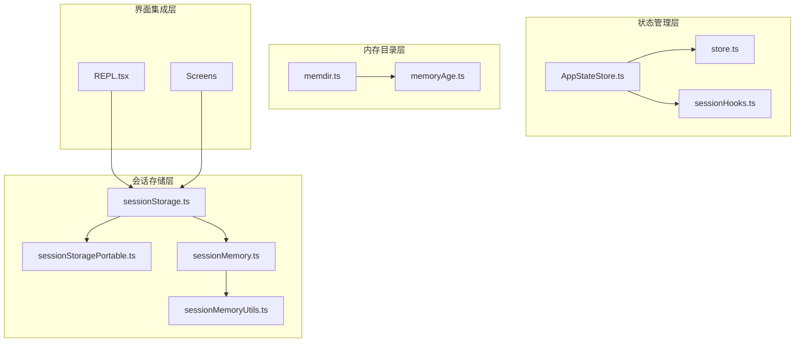
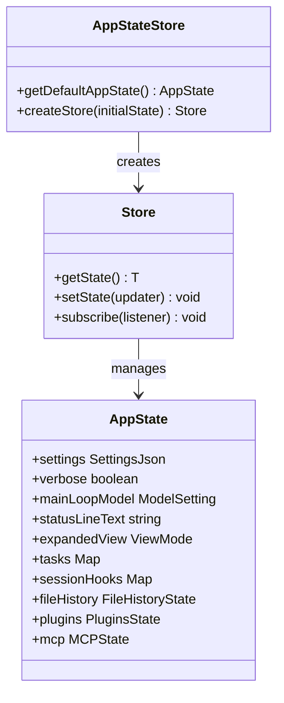
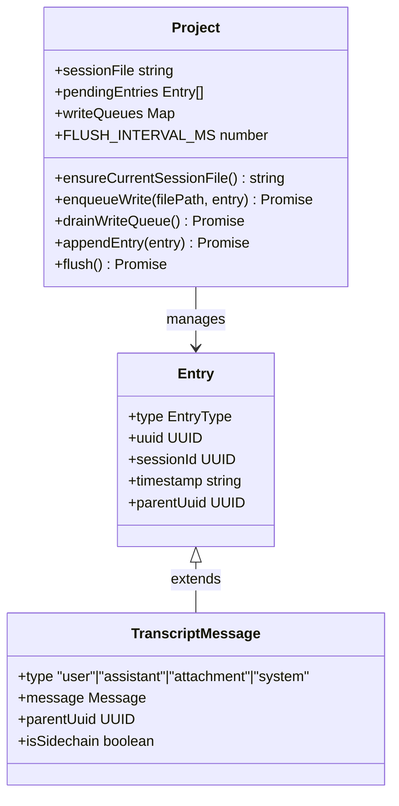
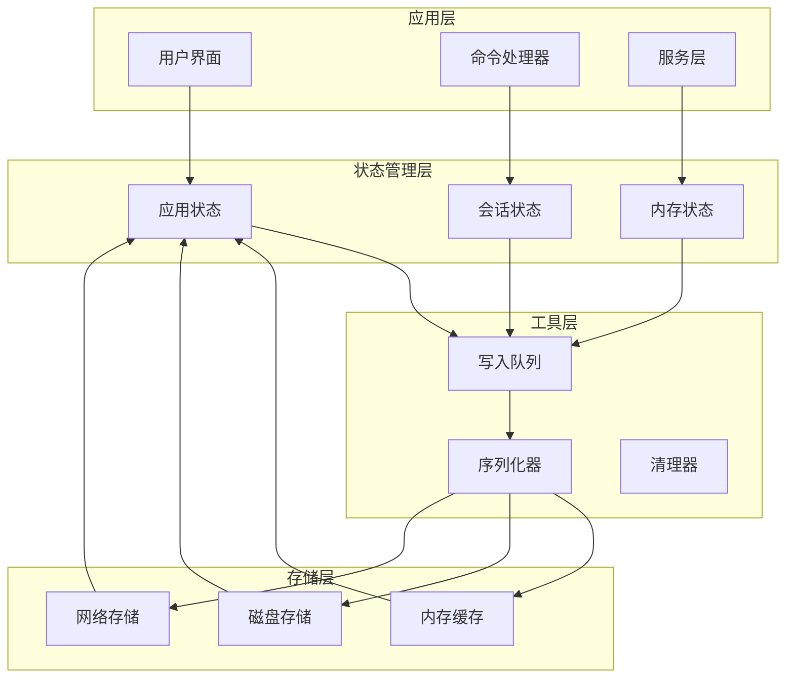
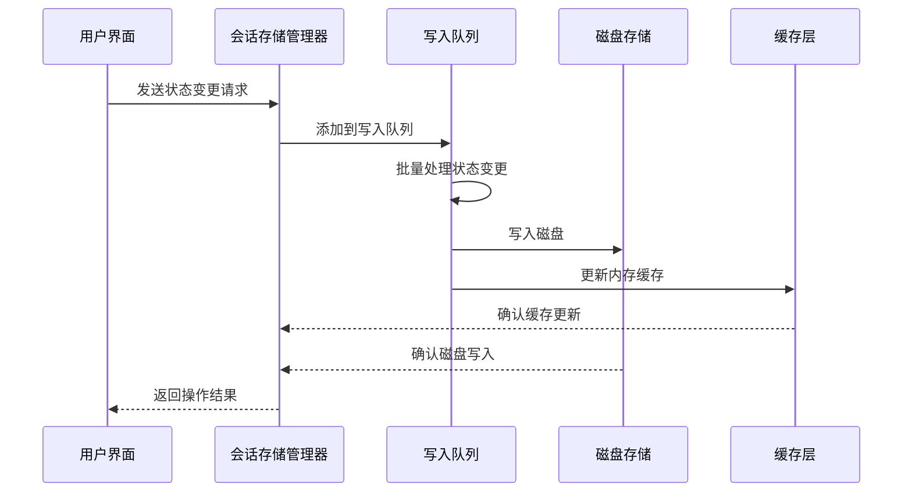
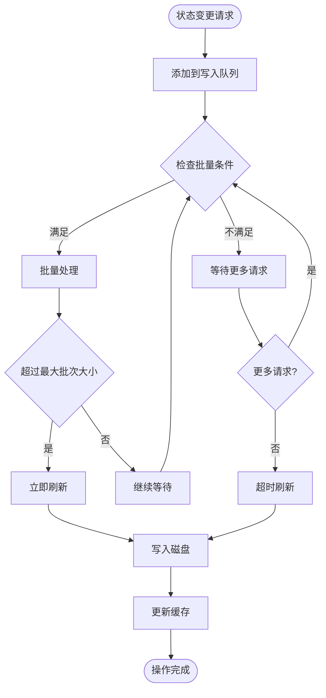
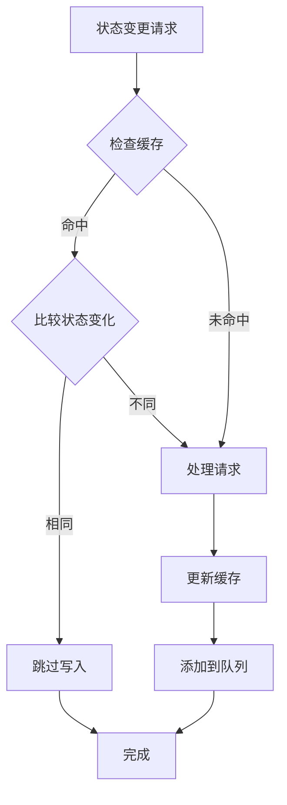
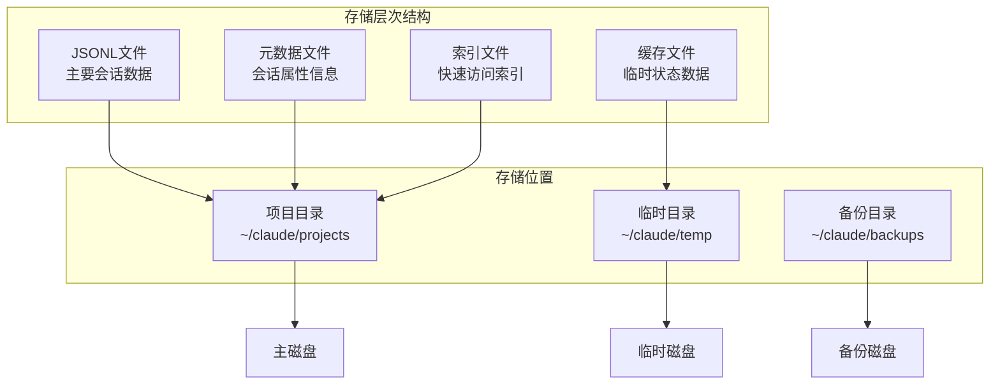
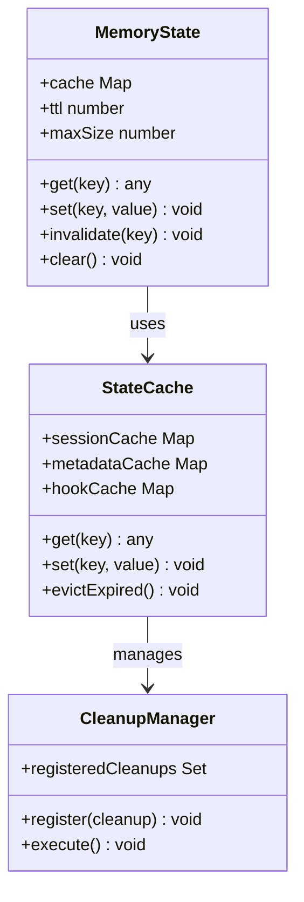
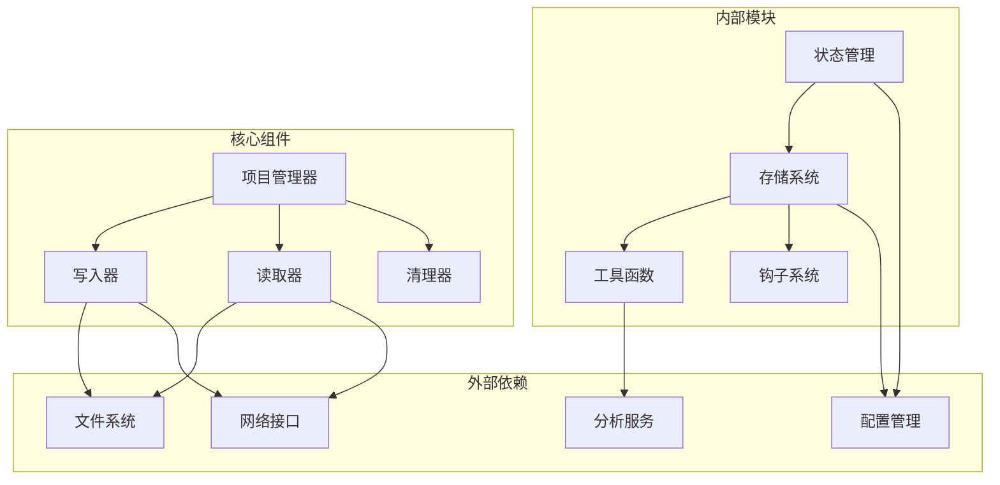

# 状态持久化机制

<cite>
**本文档引用的文件**
- [src/state/AppStateStore.ts](file://src/state/AppStateStore.ts)
- [src/state/store.ts](file://src/state/store.ts)
- [src/utils/sessionStorage.ts](file://src/utils/sessionStorage.ts)
- [src/utils/sessionStoragePortable.ts](file://src/utils/sessionStoragePortable.ts)
- [src/services/SessionMemory/sessionMemory.ts](file://src/services/SessionMemory/sessionMemory.ts)
- [src/services/SessionMemory/sessionMemoryUtils.ts](file://src/services/SessionMemory/sessionMemoryUtils.ts)
- [src/utils/hooks/sessionHooks.ts](file://src/utils/hooks/sessionHooks.ts)
- [src/screens/REPL.tsx](file://src/screens/REPL.tsx)
- [src/memdir/memoryAge.ts](file://src/memdir/memoryAge.ts)
</cite>

## 目录
1. [简介](#简介)
2. [项目结构](#项目结构)
3. [核心组件](#核心组件)
4. [架构概览](#架构概览)
5. [详细组件分析](#详细组件分析)
6. [依赖关系分析](#依赖关系分析)
7. [性能考虑](#性能考虑)
8. [故障排除指南](#故障排除指南)
9. [结论](#结论)

## 简介

Claude Code 的状态持久化机制是一个多层次、分布式的系统，旨在确保会话状态在各种使用场景下的可靠保存和恢复。该系统通过结合内存状态管理、磁盘存储、增量更新和智能缓存策略，实现了高效且容错的状态持久化。

该机制支持多种状态类型，包括用户界面状态、会话对话历史、代理工具状态、以及项目级元数据。系统采用异步写入队列、批量处理和智能去重策略，确保在高并发场景下仍能保持良好的性能表现。

## 项目结构

状态持久化系统主要分布在以下关键模块中：

**图表来源**
- [src/state/AppStateStore.ts:1-570](file://src/state/AppStateStore.ts#L1-L570)
- [src/utils/sessionStorage.ts:1-800](file://src/utils/sessionStorage.ts#L1-L800)

**章节来源**
- [src/state/AppStateStore.ts:1-570](file://src/state/AppStateStore.ts#L1-L570)
- [src/utils/sessionStorage.ts:1-800](file://src/utils/sessionStorage.ts#L1-L800)

## 核心组件

### 内存状态管理器

应用程序状态管理基于一个强大的状态存储系统，提供了完整的状态管理功能：

**图表来源**
- [src/state/store.ts:1-35](file://src/state/store.ts#L1-L35)
- [src/state/AppStateStore.ts:89-452](file://src/state/AppStateStore.ts#L89-L452)

### 会话存储系统

会话存储系统是整个状态持久化的核心，负责处理所有会话相关的数据持久化：

**图表来源**
- [src/utils/sessionStorage.ts:532-1385](file://src/utils/sessionStorage.ts#L532-L1385)
- [src/utils/sessionStorage.ts:101-106](file://src/utils/sessionStorage.ts#L101-L106)

**章节来源**
- [src/state/store.ts:1-35](file://src/state/store.ts#L1-L35)
- [src/state/AppStateStore.ts:89-452](file://src/state/AppStateStore.ts#L89-L452)
- [src/utils/sessionStorage.ts:532-1385](file://src/utils/sessionStorage.ts#L532-L1385)

## 架构概览

状态持久化系统采用分层架构设计，确保了系统的可扩展性和可靠性：

**图表来源**
- [src/utils/sessionStorage.ts:645-686](file://src/utils/sessionStorage.ts#L645-L686)
- [src/state/AppStateStore.ts:456-570](file://src/state/AppStateStore.ts#L456-L570)

系统的核心特性包括：

1. **异步写入队列**：所有状态变更都通过写入队列进行异步处理，避免阻塞主线程
2. **批量处理**：多个状态变更会被合并成批处理，减少磁盘I/O操作
3. **智能去重**：系统自动检测重复的状态变更，避免不必要的写入操作
4. **容错机制**：即使部分写入失败，系统也能保证数据的一致性

## 详细组件分析

### 会话存储管理器

会话存储管理器是整个系统的核心组件，负责管理所有会话相关的数据持久化：

**图表来源**
- [src/utils/sessionStorage.ts:606-686](file://src/utils/sessionStorage.ts#L606-L686)
- [src/utils/sessionStorage.ts:1129-1266](file://src/utils/sessionStorage.ts#L1129-L1266)

#### 写入队列机制

写入队列采用先进先出(FIFO)的队列结构，支持批量处理和异步写入：

**图表来源**
- [src/utils/sessionStorage.ts:618-632](file://src/utils/sessionStorage.ts#L618-L632)
- [src/utils/sessionStorage.ts:645-686](file://src/utils/sessionStorage.ts#L645-L686)

#### 智能去重机制

系统实现了智能去重机制，避免重复的状态变更写入：

**图表来源**
- [src/utils/sessionStorage.ts:1243-1266](file://src/utils/sessionStorage.ts#L1243-L1266)
- [src/utils/sessionStorage.ts:3843-3849](file://src/utils/sessionStorage.ts#L3843-L3849)

### 磁盘存储策略

磁盘存储采用了多层存储策略，确保数据的安全性和访问效率：

**图表来源**
- [src/utils/sessionStorage.ts:202-225](file://src/utils/sessionStorage.ts#L202-L225)
- [src/utils/sessionStorage.ts:436-438](file://src/utils/sessionStorage.ts#L436-L438)

#### 文件组织结构

每个会话都有独立的文件组织结构：

| 文件类型 | 路径模式 | 描述 |
|---------|----------|------|
| 主会话文件 | `{project}/{session}.jsonl` | 存储主要的对话历史数据 |
| 元数据文件 | `{project}/{session}.meta.json` | 存储会话的元数据信息 |
| 子代理文件 | `{project}/{session}/subagents/{agent}.jsonl` | 存储子代理的专用数据 |
| 远程代理文件 | `{project}/{session}/remote-agents/{task}.meta.json` | 存储远程任务的元数据 |

### 内存状态管理

内存状态管理提供了高性能的状态访问能力：

**图表来源**
- [src/utils/sessionStorage.ts:440-467](file://src/utils/sessionStorage.ts#L440-L467)
- [src/utils/sessionStorage.ts:473-484](file://src/utils/sessionStorage.ts#L473-L484)

**章节来源**
- [src/utils/sessionStorage.ts:532-1385](file://src/utils/sessionStorage.ts#L532-L1385)
- [src/state/AppStateStore.ts:89-452](file://src/state/AppStateStore.ts#L89-L452)

## 依赖关系分析

状态持久化系统具有清晰的依赖关系，确保了模块间的松耦合：

**图表来源**
- [src/utils/sessionStorage.ts:1-50](file://src/utils/sessionStorage.ts#L1-L50)
- [src/state/AppStateStore.ts:1-40](file://src/state/AppStateStore.ts#L1-L40)

### 关键依赖关系

1. **文件系统依赖**：所有磁盘操作都通过统一的文件系统抽象层进行
2. **网络依赖**：远程会话同步通过网络接口实现
3. **分析依赖**：状态变更通过分析服务进行监控和统计
4. **配置依赖**：系统行为通过配置管理进行控制

**章节来源**
- [src/utils/sessionStorage.ts:1-50](file://src/utils/sessionStorage.ts#L1-L50)
- [src/state/AppStateStore.ts:1-40](file://src/state/AppStateStore.ts#L1-L40)

## 性能考虑

状态持久化系统在设计时充分考虑了性能优化：

### 写入性能优化

1. **批量写入**：系统将多个小的写入操作合并为批量写入，减少磁盘I/O次数
2. **异步处理**：所有写入操作都是异步执行，避免阻塞主线程
3. **内存映射**：对于频繁访问的数据使用内存映射技术提高访问速度

### 读取性能优化

1. **缓存策略**：实现多级缓存机制，包括内存缓存、文件缓存和网络缓存
2. **预加载机制**：系统会预加载可能需要的数据，减少延迟
3. **索引优化**：为常用查询建立索引，提高查询效率

### 内存管理

1. **垃圾回收**：定期清理不再使用的缓存数据
2. **内存限制**：设置内存使用上限，防止内存泄漏
3. **分代回收**：对不同类型的数据采用不同的回收策略

## 故障排除指南

### 常见问题及解决方案

#### 状态丢失问题

当出现状态丢失的情况时，可以按照以下步骤进行排查：

1. **检查写入队列**：确认是否有未处理的写入请求
2. **验证磁盘权限**：确保应用程序有写入目标目录的权限
3. **检查文件完整性**：验证JSONL文件是否完整且格式正确

#### 性能问题

如果遇到性能问题，可以采取以下措施：

1. **调整批量大小**：根据系统负载调整批量写入的大小
2. **优化缓存策略**：调整缓存大小和过期时间
3. **监控资源使用**：定期检查CPU、内存和磁盘的使用情况

#### 数据一致性问题

当发现数据不一致时：

1. **检查事务日志**：查看是否有未完成的事务
2. **验证校验和**：检查数据的完整性校验和
3. **重建索引**：必要时重建数据库索引

**章节来源**
- [src/utils/sessionStorage.ts:871-951](file://src/utils/sessionStorage.ts#L871-L951)
- [src/utils/sessionStorage.ts:1584-1586](file://src/utils/sessionStorage.ts#L1584-L1586)

## 结论

Claude Code 的状态持久化机制通过精心设计的分层架构和优化策略，实现了高效、可靠的状态管理。系统的主要优势包括：

1. **多层次架构**：内存、磁盘和网络存储的有机结合，确保了数据的安全性和访问效率
2. **智能优化**：批量处理、异步写入和智能去重等技术显著提升了系统性能
3. **容错机制**：完善的错误处理和恢复机制保证了系统的稳定性
4. **可扩展性**：模块化的架构设计便于功能扩展和维护

该系统为 Claude Code 提供了坚实的基础，支持复杂的会话管理和状态持久化需求，为用户提供了流畅的使用体验。