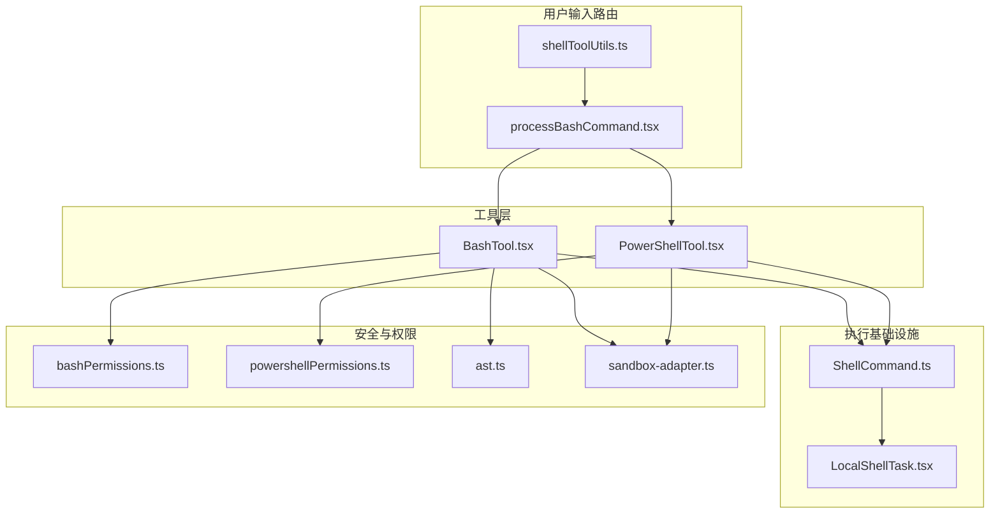
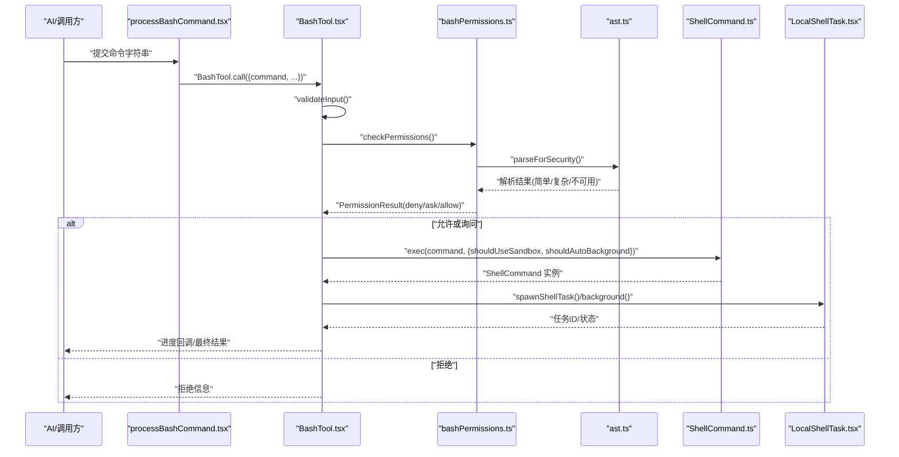
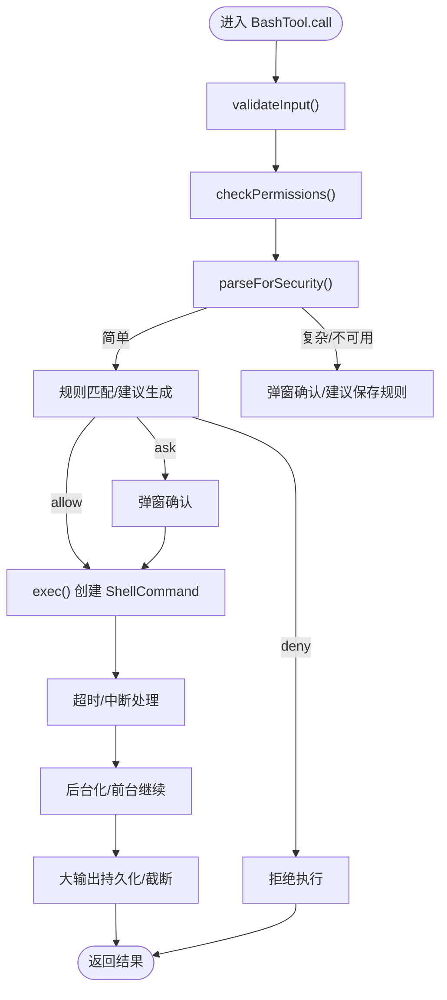
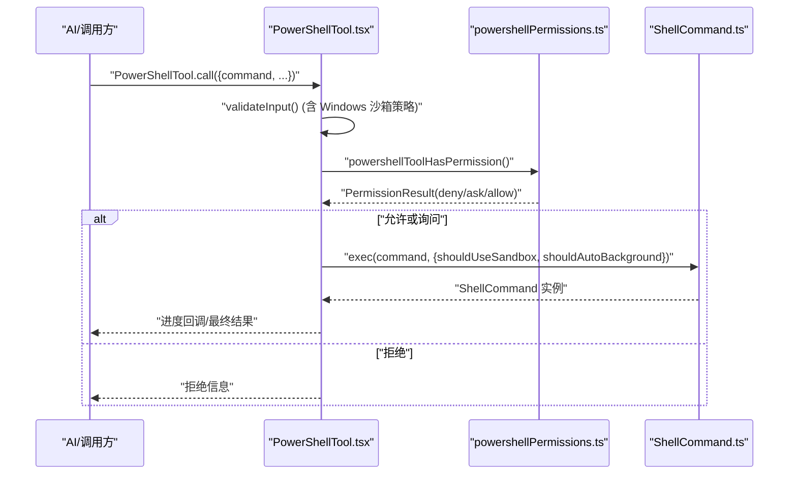
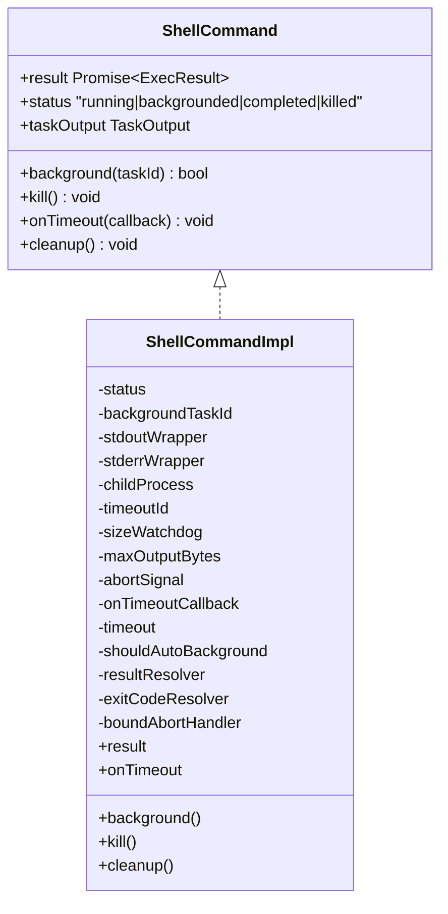
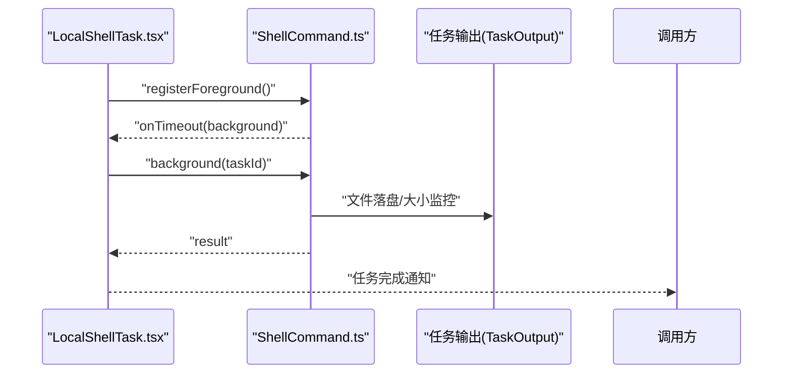
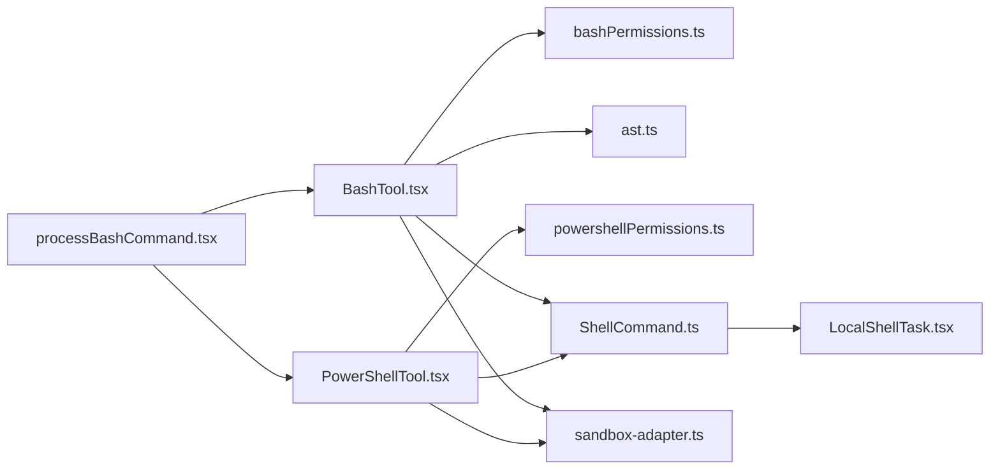

# Shell 执行命令

<cite>
**本文引用的文件**
- [docs/tools/shell-execution.mdx](file://docs/tools/shell-execution.mdx)
- [src/tools/BashTool/BashTool.tsx](file://src/tools/BashTool/BashTool.tsx)
- [src/tools/PowerShellTool/PowerShellTool.tsx](file://src/tools/PowerShellTool/PowerShellTool.tsx)
- [src/utils/ShellCommand.ts](file://src/utils/ShellCommand.ts)
- [src/utils/bash/ast.ts](file://src/utils/bash/ast.ts)
- [src/tools/BashTool/bashPermissions.ts](file://src/tools/BashTool/bashPermissions.ts)
- [src/tools/PowerShellTool/powershellPermissions.ts](file://src/tools/PowerShellTool/powershellPermissions.ts)
- [src/utils/shell/shellToolUtils.ts](file://src/utils/shell/shellToolUtils.ts)
- [src/utils/processUserInput/processBashCommand.tsx](file://src/utils/processUserInput/processBashCommand.tsx)
- [src/tasks/LocalShellTask/LocalShellTask.tsx](file://src/tasks/LocalShellTask/LocalShellTask.tsx)
- [src/tasks/LocalShellTask/killShellTasks.ts](file://src/tasks/LocalShellTask/killShellTasks.ts)
- [src/utils/sandbox/sandbox-adapter.ts](file://src/utils/sandbox/sandbox-adapter.ts)
</cite>

## 目录
1. [简介](#简介)
2. [项目结构](#项目结构)
3. [核心组件](#核心组件)
4. [架构总览](#架构总览)
5. [详细组件分析](#详细组件分析)
6. [依赖关系分析](#依赖关系分析)
7. [性能考量](#性能考量)
8. [故障排查指南](#故障排查指南)
9. [结论](#结论)
10. [附录](#附录)

## 简介
本文件面向“Shell 执行命令”的实现与使用，聚焦以下目标：
- 深入解析 BashTool 与 PowerShellTool 的执行链路、安全策略与权限控制
- 说明命令执行的参数传递、环境变量处理、输出截断与后台化机制
- 提供安全使用指南与最佳实践，覆盖危险命令防护、命令注入防范与沙箱策略

## 项目结构
围绕 Shell 执行的关键模块与职责如下：
- 工具层
  - BashTool：面向 Bash 的命令执行工具，内置只读命令判定、AST 安全解析、权限检查、输出截断与后台化
  - PowerShellTool：面向 PowerShell 的命令执行工具，包含 AST 解析、只读判定、权限检查与后台化
- 执行基础设施
  - ShellCommand：统一的子进程封装，支持超时、后台化、输出文件落盘与大小监控
  - LocalShellTask：本地 Shell 任务的生命周期管理、前台/后台切换与清理
- 安全与权限
  - bashPermissions / powershellPermissions：规则匹配、建议生成、安全检查与拒绝/询问/允许决策
  - ast（Bash）：tree-sitter 解析与静态 argv 提取，fail-closed 设计
  - sandbox-adapter：沙箱启用/配置与平台限制
- 用户输入路由
  - shellToolUtils：Bash/PowerShell 工具名称与运行时开关
  - processBashCommand：用户输入路由，支持 ! 前缀与禁用沙箱的危险命令直通

**图表来源**
- [src/tools/BashTool/BashTool.tsx](file://src/tools/BashTool/BashTool.tsx)
- [src/tools/PowerShellTool/PowerShellTool.tsx](file://src/tools/PowerShellTool/PowerShellTool.tsx)
- [src/utils/ShellCommand.ts](file://src/utils/ShellCommand.ts)
- [src/tasks/LocalShellTask/LocalShellTask.tsx](file://src/tasks/LocalShellTask/LocalShellTask.tsx)
- [src/tools/BashTool/bashPermissions.ts](file://src/tools/BashTool/bashPermissions.ts)
- [src/tools/PowerShellTool/powershellPermissions.ts](file://src/tools/PowerShellTool/powershellPermissions.ts)
- [src/utils/bash/ast.ts](file://src/utils/bash/ast.ts)
- [src/utils/shell/shellToolUtils.ts](file://src/utils/shell/shellToolUtils.ts)
- [src/utils/processUserInput/processBashCommand.tsx](file://src/utils/processUserInput/processBashCommand.tsx)
- [src/utils/sandbox/sandbox-adapter.ts](file://src/utils/sandbox/sandbox-adapter.ts)

**章节来源**
- [docs/tools/shell-execution.mdx](file://docs/tools/shell-execution.mdx)
- [src/utils/shell/shellToolUtils.ts](file://src/utils/shell/shellToolUtils.ts)
- [src/utils/processUserInput/processBashCommand.tsx](file://src/utils/processUserInput/processBashCommand.tsx)

## 核心组件
- BashTool
  - 输入校验、只读命令判定、权限检查、超时控制、自动后台化、输出截断、进度回调、错误映射与结果持久化
- PowerShellTool
  - 输入校验（含 Windows 沙箱策略拒绝）、只读命令判定、权限检查、超时控制、自动后台化、输出截断、进度回调、错误映射与结果持久化
- ShellCommand
  - 子进程封装、超时回调、后台化、输出文件落盘、大小监控、清理与状态管理
- LocalShellTask
  - 任务注册/注销、前台转后台、结果聚合、通知与清理
- 权限与安全
  - Bash：tree-sitter AST 解析、安全检查、规则匹配、建议生成、环境变量剥离、包装器剥离、路径约束
  - PowerShell：AST 解析、只读判定、安全检查、规则匹配、UNC/脚本块/表达式检查、路径约束
- 沙箱
  - 平台支持检测、依赖检查、配置更新、不可用原因提示

**章节来源**
- [src/tools/BashTool/BashTool.tsx](file://src/tools/BashTool/BashTool.tsx)
- [src/tools/PowerShellTool/PowerShellTool.tsx](file://src/tools/PowerShellTool/PowerShellTool.tsx)
- [src/utils/ShellCommand.ts](file://src/utils/ShellCommand.ts)
- [src/tasks/LocalShellTask/LocalShellTask.tsx](file://src/tasks/LocalShellTask/LocalShellTask.tsx)
- [src/tools/BashTool/bashPermissions.ts](file://src/tools/BashTool/bashPermissions.ts)
- [src/tools/PowerShellTool/powershellPermissions.ts](file://src/tools/PowerShellTool/powershellPermissions.ts)
- [src/utils/bash/ast.ts](file://src/utils/bash/ast.ts)
- [src/utils/sandbox/sandbox-adapter.ts](file://src/utils/sandbox/sandbox-adapter.ts)

## 架构总览
下图展示了从 AI 决策到命令执行与结果回传的端到端流程，涵盖权限检查、安全解析、沙箱策略、后台化与输出处理。

**图表来源**
- [src/utils/processUserInput/processBashCommand.tsx](file://src/utils/processUserInput/processBashCommand.tsx)
- [src/tools/BashTool/BashTool.tsx](file://src/tools/BashTool/BashTool.tsx)
- [src/tools/BashTool/bashPermissions.ts](file://src/tools/BashTool/bashPermissions.ts)
- [src/utils/bash/ast.ts](file://src/utils/bash/ast.ts)
- [src/utils/ShellCommand.ts](file://src/utils/ShellCommand.ts)
- [src/tasks/LocalShellTask/LocalShellTask.tsx](file://src/tasks/LocalShellTask/LocalShellTask.tsx)

## 详细组件分析

### BashTool 安全与执行链路
- 只读命令判定
  - 基于命令集合（搜索/读取/列表/语义中性）对复合命令逐段检查，仅当所有非中性段均属于只读集合时整体视为只读
  - 支持 cd 检测与语义中性段跳过
- AST 安全解析
  - 使用 tree-sitter bash 解析，提取每个简单命令的 argv，fail-closed：未知节点类型即判定为“过于复杂”
  - 对重定向、变量展开、命令替换、括号扩展等进行预检查与屏蔽
- 权限检查
  - 规则匹配：精确/前缀/通配；建议生成：针对 heredoc/多行/单行命令生成稳定规则
  - 环境变量剥离：仅剥离安全变量与包装器（timeout/time/nice/nohup/stdbuf），保留安全边界
  - 路径约束：输出重定向目标与写入路径白名单/黑名单检查
- 超时与后台化
  - 默认最大超时与最大上限；超时后通过 onTimeout 回调交由上层决定终止或后台化
  - 主线程阻塞预算（约 15 秒）触发自动后台化，避免阻塞智能体循环
- 输出处理
  - 工具级截断阈值、进度轮询截断、文件落盘与大输出持久化、图像输出压缩与尺寸限制
- 错误与中断
  - 合并 stdout/stderr，区分用户中断与超时/异常中断，构造可读错误消息

**图表来源**
- [src/tools/BashTool/BashTool.tsx](file://src/tools/BashTool/BashTool.tsx)
- [src/tools/BashTool/bashPermissions.ts](file://src/tools/BashTool/bashPermissions.ts)
- [src/utils/bash/ast.ts](file://src/utils/bash/ast.ts)
- [src/utils/ShellCommand.ts](file://src/utils/ShellCommand.ts)

**章节来源**
- [src/tools/BashTool/BashTool.tsx](file://src/tools/BashTool/BashTool.tsx)
- [src/tools/BashTool/bashPermissions.ts](file://src/tools/BashTool/bashPermissions.ts)
- [src/utils/bash/ast.ts](file://src/utils/bash/ast.ts)
- [docs/tools/shell-execution.mdx](file://docs/tools/shell-execution.mdx)

### PowerShellTool 安全与执行链路
- 只读命令判定
  - 同步安全启发式先行（正则检测子表达式、Splats、成员调用、赋值等），随后异步 AST 解析细化
  - 严格大小写不敏感匹配与别名/模块限定名规范化
- 权限检查
  - 规则匹配：精确/前缀/通配；建议生成：多行/通配符命令不自动生成精确规则
  - UNC 路径检查、脚本块/表达式/计划任务/环境变量写入等高危模式检测
  - Git 安全：裸仓库路径、归档解压器与 git 命令组合的协同检查
- 超时与后台化
  - 与 Bash 类似的超时策略与自动后台化；Windows 平台沙箱不可用时的策略拒绝
- 输出处理
  - 大输出持久化、图像输出压缩、进度轮询与截断
- 错误与中断
  - 区分用户中断与超时/异常中断，构造可读错误消息

**图表来源**
- [src/tools/PowerShellTool/PowerShellTool.tsx](file://src/tools/PowerShellTool/PowerShellTool.tsx)
- [src/tools/PowerShellTool/powershellPermissions.ts](file://src/tools/PowerShellTool/powershellPermissions.ts)
- [src/utils/ShellCommand.ts](file://src/utils/ShellCommand.ts)

**章节来源**
- [src/tools/PowerShellTool/PowerShellTool.tsx](file://src/tools/PowerShellTool/PowerShellTool.tsx)
- [src/tools/PowerShellTool/powershellPermissions.ts](file://src/tools/PowerShellTool/powershellPermissions.ts)

### ShellCommand：子进程封装与后台化
- 关键能力
  - 超时回调：可选择直接终止或触发后台化
  - 后台化：切换到文件落盘模式，启动大小监控，防止磁盘填满
  - 清理：移除事件监听、释放资源，避免内存泄漏
  - 结果聚合：合并 stdout/stderr，附加超时/大小限制信息
- 适用场景
  - Bash 命令（文件模式：fd 直写，JS 无参与）
  - Hook 流水线（管道模式：StreamWrapper 包装）

**图表来源**
- [src/utils/ShellCommand.ts](file://src/utils/ShellCommand.ts)

**章节来源**
- [src/utils/ShellCommand.ts](file://src/utils/ShellCommand.ts)

### LocalShellTask：任务生命周期与前台/后台切换
- 功能要点
  - 注册/注销前台任务、前台转后台、任务清理与超时清理
  - 与 ShellCommand 协作，实现任务状态与输出的统一管理
- 关键流程
  - 前台运行：进度轮询，超时触发后台化
  - 后台运行：文件落盘，大小监控，完成通知

**图表来源**
- [src/tasks/LocalShellTask/LocalShellTask.tsx](file://src/tasks/LocalShellTask/LocalShellTask.tsx)
- [src/utils/ShellCommand.ts](file://src/utils/ShellCommand.ts)

**章节来源**
- [src/tasks/LocalShellTask/LocalShellTask.tsx](file://src/tasks/LocalShellTask/LocalShellTask.tsx)
- [src/tasks/LocalShellTask/killShellTasks.ts](file://src/tasks/LocalShellTask/killShellTasks.ts)

### 权限与安全：Bash 与 PowerShell
- Bash
  - tree-sitter AST：fail-closed，未知节点类型即“过于复杂”，触发权限弹窗
  - 规则匹配：精确/前缀/通配；建议生成：heredoc/多行/单行的稳定规则
  - 环境变量剥离：仅剥离安全变量与包装器；禁止二进制劫持变量
  - 路径约束：输出重定向目标与写入路径白名单/黑名单
  - 安全检查：IFS 注入、/proc 环境读取等防御
- PowerShell
  - AST：大小写不敏感匹配与别名/模块限定名规范化
  - 规则匹配：精确/前缀/通配；建议生成：多行/通配符不自动生成精确规则
  - 安全检查：UNC 路径、脚本块/表达式、计划任务、环境变量写入、Git 安全
  - 路径约束：外部归档解压器与 git 命令组合的协同检查

**章节来源**
- [src/tools/BashTool/bashPermissions.ts](file://src/tools/BashTool/bashPermissions.ts)
- [src/utils/bash/ast.ts](file://src/utils/bash/ast.ts)
- [src/tools/PowerShellTool/powershellPermissions.ts](file://src/tools/PowerShellTool/powershellPermissions.ts)

### 沙箱策略与平台限制
- 平台支持
  - Linux/macOS/WSL2：支持沙箱；Windows 原生：沙箱不可用（企业策略要求沙箱时拒绝执行）
- 配置与动态更新
  - 依赖检查、平台限制、配置订阅与动态刷新
  - 不可用原因提示，避免用户误以为策略被忽略

**章节来源**
- [src/utils/sandbox/sandbox-adapter.ts](file://src/utils/sandbox/sandbox-adapter.ts)
- [src/tools/PowerShellTool/PowerShellTool.tsx](file://src/tools/PowerShellTool/PowerShellTool.tsx)

## 依赖关系分析
- 工具到执行
  - BashTool/PowerShellTool 依赖 ShellCommand 进行子进程封装
  - ShellCommand 依赖 TaskOutput 进行输出落盘与进度聚合
- 权限到安全
  - BashTool 依赖 ast 进行安全解析；依赖 bashPermissions 进行规则匹配与建议
  - PowerShellTool 依赖 powershellPermissions 进行规则匹配与安全检查
- 任务到执行
  - LocalShellTask 与 ShellCommand 协作，负责前台/后台切换与清理
- 输入路由
  - processBashCommand 将用户输入路由到 BashTool 或 PowerShellTool，并支持禁用沙箱的危险命令直通

**图表来源**
- [src/utils/processUserInput/processBashCommand.tsx](file://src/utils/processUserInput/processBashCommand.tsx)
- [src/tools/BashTool/BashTool.tsx](file://src/tools/BashTool/BashTool.tsx)
- [src/tools/PowerShellTool/PowerShellTool.tsx](file://src/tools/PowerShellTool/PowerShellTool.tsx)
- [src/tools/BashTool/bashPermissions.ts](file://src/tools/BashTool/bashPermissions.ts)
- [src/tools/PowerShellTool/powershellPermissions.ts](file://src/tools/PowerShellTool/powershellPermissions.ts)
- [src/utils/bash/ast.ts](file://src/utils/bash/ast.ts)
- [src/utils/ShellCommand.ts](file://src/utils/ShellCommand.ts)
- [src/tasks/LocalShellTask/LocalShellTask.tsx](file://src/tasks/LocalShellTask/LocalShellTask.tsx)
- [src/utils/sandbox/sandbox-adapter.ts](file://src/utils/sandbox/sandbox-adapter.ts)

**章节来源**
- [src/utils/processUserInput/processBashCommand.tsx](file://src/utils/processUserInput/processBashCommand.tsx)
- [src/tools/BashTool/BashTool.tsx](file://src/tools/BashTool/BashTool.tsx)
- [src/tools/PowerShellTool/PowerShellTool.tsx](file://src/tools/PowerShellTool/PowerShellTool.tsx)
- [src/utils/ShellCommand.ts](file://src/utils/ShellCommand.ts)
- [src/tasks/LocalShellTask/LocalShellTask.tsx](file://src/tasks/LocalShellTask/LocalShellTask.tsx)

## 性能考量
- 事件循环与解析开销
  - Bash：复合命令拆分与多子命令安全检查可能带来微任务链压力，已设定最大子命令数量与建议规则上限
- 输出与 I/O
  - 文件落盘与大小监控防止磁盘填满；大输出持久化与截断减少内存占用
- 并发与串行
  - 只读命令可并行执行，有副作用命令需串行，避免竞态条件

[本节为通用指导，无需特定文件引用]

## 故障排查指南
- 命令未执行或被拒绝
  - 检查权限规则：是否存在 deny/ask 规则；尝试生成建议规则
  - Bash：确认是否触发“过于复杂”判定（包含未知节点类型或特殊语法）
  - PowerShell：确认是否包含 UNC 路径、脚本块/表达式或计划任务
- 超时与中断
  - 检查超时阈值与自动后台化策略；确认是否被用户中断
  - 查看 ShellCommand 的超时/大小限制附加信息
- 输出异常
  - 检查输出截断与大输出持久化；确认图像输出压缩是否生效
- 沙箱相关
  - Windows 原生平台：若企业策略要求沙箱且不可用，将直接拒绝执行
  - 平台不支持或依赖缺失：查看沙箱不可用原因提示

**章节来源**
- [src/tools/BashTool/bashPermissions.ts](file://src/tools/BashTool/bashPermissions.ts)
- [src/tools/PowerShellTool/powershellPermissions.ts](file://src/tools/PowerShellTool/powershellPermissions.ts)
- [src/utils/ShellCommand.ts](file://src/utils/ShellCommand.ts)
- [src/utils/sandbox/sandbox-adapter.ts](file://src/utils/sandbox/sandbox-adapter.ts)

## 结论
本实现通过“AST 安全解析 + 规则匹配 + 沙箱策略 + 后台化与输出截断”的组合，构建了安全、可控、可观测的 Shell 执行能力。BashTool 与 PowerShellTool 在统一的基础设施之上，分别针对各自平台与语法特性提供了细粒度的安全保障与用户体验优化。

[本节为总结，无需特定文件引用]

## 附录
- 安全使用指南与最佳实践
  - 优先使用专用工具（如 Read/Grep）而非 Bash 命令执行相同功能，以获得更好的权限粒度、结构化输出与并发安全
  - 避免使用高危模式：脚本块/表达式、计划任务、UNC 路径、IFS 注入、/proc 环境读取
  - 合理设置超时与后台化策略，避免长时间阻塞
  - 为常用命令建立稳定的规则（前缀/通配），减少重复弹窗
  - 在 Windows 原生平台谨慎启用 PowerShellTool，关注沙箱策略与平台限制

[本节为通用指导，无需特定文件引用]