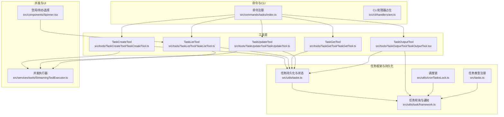
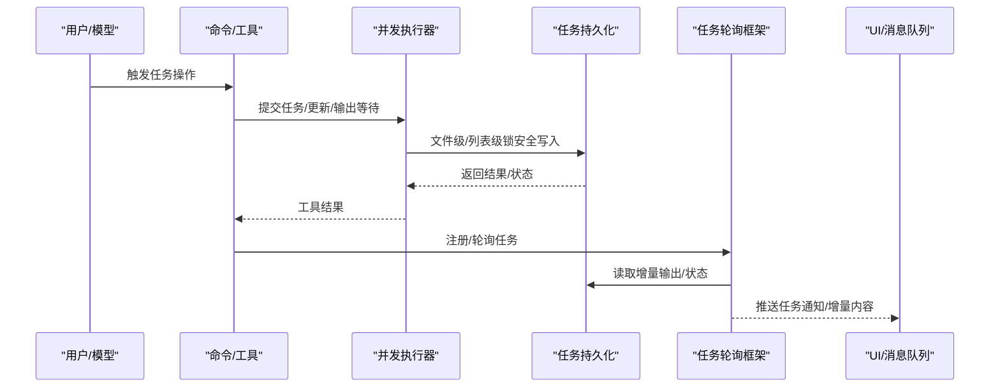
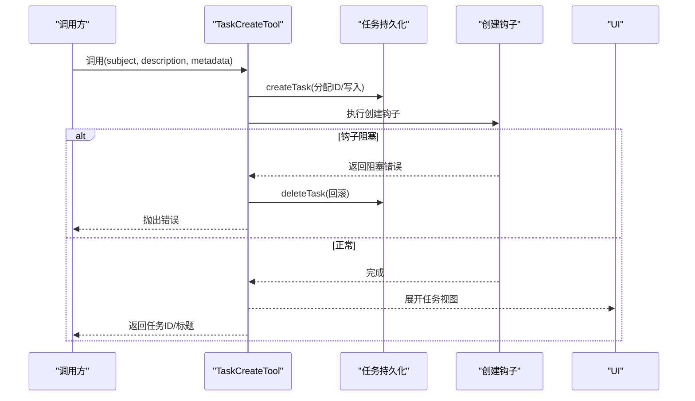
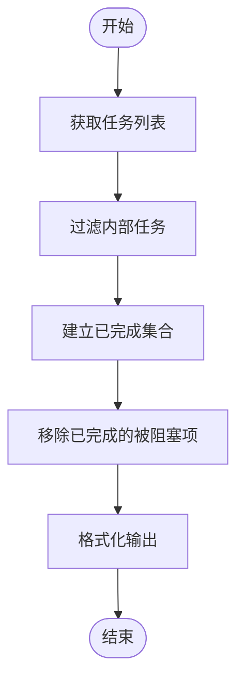
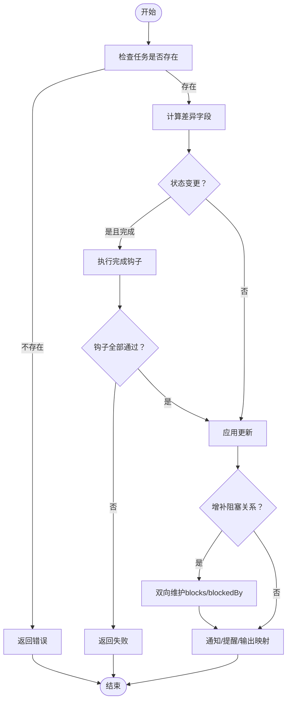
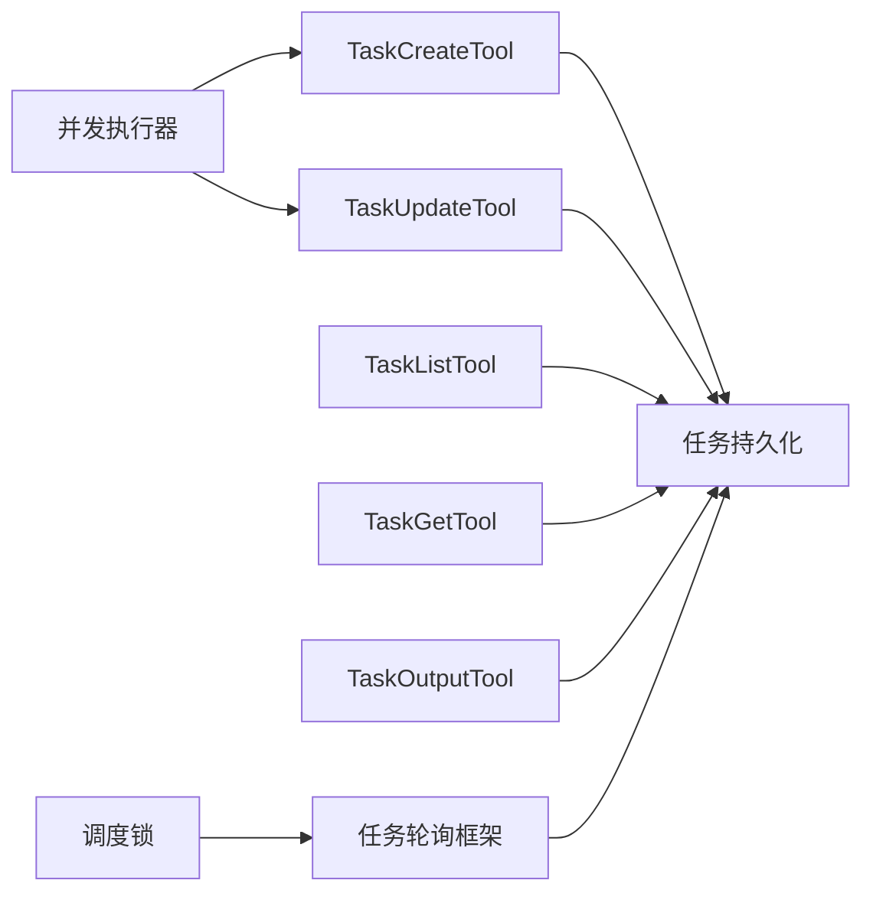

# 任务管理命令

<cite>
**本文引用的文件**
- [src/commands/tasks/index.ts](file://src/commands/tasks/index.ts)
- [src/utils/tasks.ts](file://src/utils/tasks.ts)
- [src/tools/TaskCreateTool/TaskCreateTool.ts](file://src/tools/TaskCreateTool/TaskCreateTool.ts)
- [src/tools/TaskListTool/TaskListTool.ts](file://src/tools/TaskListTool/TaskListTool.ts)
- [src/tools/TaskGetTool/TaskGetTool.ts](file://src/tools/TaskGetTool/TaskGetTool.ts)
- [src/tools/TaskUpdateTool/TaskUpdateTool.ts](file://src/tools/TaskUpdateTool/TaskUpdateTool.ts)
- [src/tools/TaskOutputTool/TaskOutputTool.tsx](file://src/tools/TaskOutputTool/TaskOutputTool.tsx)
- [src/utils/task/framework.ts](file://src/utils/task/framework.ts)
- [src/utils/cronTasksLock.ts](file://src/utils/cronTasksLock.ts)
- [src/tasks.ts](file://src/tasks.ts)
- [src/cli/handlers/ant.ts](file://src/cli/handlers/ant.ts)
- [src/services/tools/StreamingToolExecutor.ts](file://src/services/tools/StreamingToolExecutor.ts)
- [src/components/Spinner.tsx](file://src/components/Spinner.tsx)
</cite>

## 目录
1. [简介](#简介)
2. [项目结构](#项目结构)
3. [核心组件](#核心组件)
4. [架构总览](#架构总览)
5. [详细组件分析](#详细组件分析)
6. [依赖关系分析](#依赖关系分析)
7. [性能考量](#性能考量)
8. [故障排查指南](#故障排查指南)
9. [结论](#结论)
10. [附录：最佳实践与示例](#附录最佳实践与示例)

## 简介
本文件系统性梳理任务管理命令与工具链的实现与使用方法，覆盖任务创建、查询、更新、删除、列表展示、状态流转、依赖阻塞、并发控制、调度锁、输出追踪与结果存储等核心能力。面向不同技术背景的读者，既提供高层概览，也给出可直接定位到源码位置的参考路径，便于深入理解与扩展。

## 项目结构
围绕任务管理的关键模块分布如下：
- 命令入口与CLI：命令注册与处理器占位（待实现）
- 工具层：TaskCreate/TaskList/TaskGet/TaskUpdate/TaskOutput 等工具
- 工具框架：并发执行器、任务轮询与通知、输出增量同步
- 任务持久化与状态：基于文件系统的任务清单、锁与迁移兼容
- 调度与锁：计划任务调度器的会话级互斥锁
- 任务类型与运行时：本地/远程/工作流等任务类型注册与运行框架

**图示来源**
- [src/commands/tasks/index.ts:1-11](file://src/commands/tasks/index.ts#L1-L11)
- [src/tools/TaskCreateTool/TaskCreateTool.ts:1-139](file://src/tools/TaskCreateTool/TaskCreateTool.ts#L1-L139)
- [src/tools/TaskListTool/TaskListTool.ts:1-117](file://src/tools/TaskListTool/TaskListTool.ts#L1-L117)
- [src/tools/TaskGetTool/TaskGetTool.ts:1-129](file://src/tools/TaskGetTool/TaskGetTool.ts#L1-L129)
- [src/tools/TaskUpdateTool/TaskUpdateTool.ts:1-407](file://src/tools/TaskUpdateTool/TaskUpdateTool.ts#L1-L407)
- [src/tools/TaskOutputTool/TaskOutputTool.tsx:117-138](file://src/tools/TaskOutputTool/TaskOutputTool.tsx#L117-L138)
- [src/utils/task/framework.ts:1-309](file://src/utils/task/framework.ts#L1-L309)
- [src/utils/tasks.ts:1-863](file://src/utils/tasks.ts#L1-L863)
- [src/utils/cronTasksLock.ts:1-196](file://src/utils/cronTasksLock.ts#L1-L196)
- [src/tasks.ts:1-40](file://src/tasks.ts#L1-L40)
- [src/services/tools/StreamingToolExecutor.ts:123-151](file://src/services/tools/StreamingToolExecutor.ts#L123-L151)
- [src/components/Spinner.tsx:552-562](file://src/components/Spinner.tsx#L552-L562)

**章节来源**
- [src/commands/tasks/index.ts:1-11](file://src/commands/tasks/index.ts#L1-L11)
- [src/utils/tasks.ts:1-863](file://src/utils/tasks.ts#L1-L863)

## 核心组件
- 任务工具集
  - 创建：TaskCreateTool，支持主题、描述、活动形态、元数据，并触发“任务已创建”钩子
  - 列表：TaskListTool，按上下文列出任务，过滤内部标记与已完成的反向阻塞
  - 查询：TaskGetTool，按ID返回任务详情
  - 更新：TaskUpdateTool，支持状态变更、阻塞关系增补、所有者变更、元数据合并、删除任务
  - 输出：TaskOutputTool，等待任务完成并拉取增量输出
- 任务持久化与状态
  - 基于文件系统：任务目录、高水位线、锁文件、唯一ID分配、迁移兼容
  - 任务状态：pending/in_progress/completed；阻塞关系：blocks/blockedBy
  - 并发安全：文件级/列表级锁，重试退避策略
- 任务轮询与通知
  - 按固定间隔轮询运行中任务，生成增量输出附件，推送消息队列
  - 终止态任务延迟清理，避免UI抖动
- 调度锁
  - 计划任务调度器在同项目多会话间互斥，原子创建锁、存活探测、过期回收
- 任务类型与运行框架
  - 本地/远程/工作流等任务类型注册
  - 通用轮询、通知、输出增量与内存回收

**章节来源**
- [src/tools/TaskCreateTool/TaskCreateTool.ts:1-139](file://src/tools/TaskCreateTool/TaskCreateTool.ts#L1-L139)
- [src/tools/TaskListTool/TaskListTool.ts:1-117](file://src/tools/TaskListTool/TaskListTool.ts#L1-L117)
- [src/tools/TaskGetTool/TaskGetTool.ts:1-129](file://src/tools/TaskGetTool/TaskGetTool.ts#L1-L129)
- [src/tools/TaskUpdateTool/TaskUpdateTool.ts:1-407](file://src/tools/TaskUpdateTool/TaskUpdateTool.ts#L1-L407)
- [src/tools/TaskOutputTool/TaskOutputTool.tsx:117-138](file://src/tools/TaskOutputTool/TaskOutputTool.tsx#L117-L138)
- [src/utils/tasks.ts:1-863](file://src/utils/tasks.ts#L1-L863)
- [src/utils/task/framework.ts:1-309](file://src/utils/task/framework.ts#L1-L309)
- [src/utils/cronTasksLock.ts:1-196](file://src/utils/cronTasksLock.ts#L1-L196)
- [src/tasks.ts:1-40](file://src/tasks.ts#L1-L40)

## 架构总览
任务管理从“命令/工具调用”进入，经“并发执行器”调度，落地到“任务持久化”，由“任务轮询框架”持续产出输出增量与通知，最终通过“UI/消息队列”呈现。

**图示来源**
- [src/services/tools/StreamingToolExecutor.ts:123-151](file://src/services/tools/StreamingToolExecutor.ts#L123-L151)
- [src/utils/tasks.ts:284-308](file://src/utils/tasks.ts#L284-L308)
- [src/utils/task/framework.ts:255-269](file://src/utils/task/framework.ts#L255-L269)

## 详细组件分析

### 任务创建（TaskCreateTool）
- 功能要点
  - 分配唯一ID（高水位线+文件锁保障）
  - 写入初始状态（默认pending），可选元数据
  - 触发“任务已创建”钩子，遇阻塞错误回滚删除
  - 自动展开任务视图
- 关键路径
  - 输入校验与输出结构定义
  - createTask/executeTaskCreatedHooks/deleteTask
  - UI反馈映射

**图示来源**
- [src/tools/TaskCreateTool/TaskCreateTool.ts:80-129](file://src/tools/TaskCreateTool/TaskCreateTool.ts#L80-L129)
- [src/utils/tasks.ts:284-308](file://src/utils/tasks.ts#L284-L308)

**章节来源**
- [src/tools/TaskCreateTool/TaskCreateTool.ts:1-139](file://src/tools/TaskCreateTool/TaskCreateTool.ts#L1-L139)
- [src/utils/tasks.ts:133-139](file://src/utils/tasks.ts#L133-L139)

### 任务列表（TaskListTool）
- 功能要点
  - 过滤内部任务与已完成的反向阻塞
  - 只暴露未完成阻塞关系，便于直观查看
- 关键路径
  - listTasks/getTaskListId
  - 输出格式化与行内信息拼接

**图示来源**
- [src/tools/TaskListTool/TaskListTool.ts:65-90](file://src/tools/TaskListTool/TaskListTool.ts#L65-L90)
- [src/utils/tasks.ts:443-456](file://src/utils/tasks.ts#L443-L456)

**章节来源**
- [src/tools/TaskListTool/TaskListTool.ts:1-117](file://src/tools/TaskListTool/TaskListTool.ts#L1-L117)

### 任务查询（TaskGetTool）
- 功能要点
  - 按ID精确查询，返回任务主体、状态、阻塞关系
- 关键路径
  - getTask/路径解析/错误处理

**章节来源**
- [src/tools/TaskGetTool/TaskGetTool.ts:1-129](file://src/tools/TaskGetTool/TaskGetTool.ts#L1-L129)
- [src/utils/tasks.ts:310-350](file://src/utils/tasks.ts#L310-L350)

### 任务更新（TaskUpdateTool）
- 功能要点
  - 支持字段增量更新（主题、描述、活动形态、所有者、元数据）
  - 状态变更：completed时触发“任务完成”钩子，失败则回滚
  - 阻塞关系增补：blocks/blockedBy双向维护
  - 删除任务：原子更新高水位线后删除文件，并清理其他任务中的引用
  - 所有者变更：通过邮箱盒通知新负责人
- 关键路径
  - updateTask/deleteTask/blockTask
  - 钩子执行与错误收集
  - 输出映射与提醒提示

**图示来源**
- [src/tools/TaskUpdateTool/TaskUpdateTool.ts:123-363](file://src/tools/TaskUpdateTool/TaskUpdateTool.ts#L123-L363)
- [src/utils/tasks.ts:370-441](file://src/utils/tasks.ts#L370-L441)

**章节来源**
- [src/tools/TaskUpdateTool/TaskUpdateTool.ts:1-407](file://src/tools/TaskUpdateTool/TaskUpdateTool.ts#L1-L407)

### 任务输出与等待（TaskOutputTool）
- 功能要点
  - 轮询任务状态直至非running/pending
  - 拉取增量输出，支持超时与中断信号
- 关键路径
  - waitForTaskCompletion/getTaskOutputDelta

**章节来源**
- [src/tools/TaskOutputTool/TaskOutputTool.tsx:117-138](file://src/tools/TaskOutputTool/TaskOutputTool.tsx#L117-L138)
- [src/utils/task/framework.ts:158-206](file://src/utils/task/framework.ts#L158-L206)

### 任务轮询与通知（任务框架）
- 功能要点
  - 固定轮询间隔，生成增量输出附件
  - 终止态任务延迟清理，避免UI闪烁
  - 通过消息队列推送任务状态变化摘要
- 关键路径
  - generateTaskAttachments/applyTaskOffsetsAndEvictions/pollTasks

**章节来源**
- [src/utils/task/framework.ts:1-309](file://src/utils/task/framework.ts#L1-L309)

### 并发控制（并发执行器）
- 功能要点
  - 非并发工具需串行执行，保持顺序一致性
  - 并发安全工具允许并行，但同一时刻仅执行一个非并发任务
- 关键路径
  - canExecuteTool/processQueue

**章节来源**
- [src/services/tools/StreamingToolExecutor.ts:123-151](file://src/services/tools/StreamingToolExecutor.ts#L123-L151)

### 任务依赖与空闲选择（UI辅助）
- 功能要点
  - 选择下一个可执行任务：优先pending且无未完成阻塞
- 关键路径
  - findNextPendingTask

**章节来源**
- [src/components/Spinner.tsx:552-562](file://src/components/Spinner.tsx#L552-L562)

## 依赖关系分析
- 工具对持久化的依赖
  - TaskCreate/TaskUpdate/TaskList/TaskGet/TaskOutput均依赖任务持久化API
- 框架对工具的依赖
  - 轮询框架不直接依赖具体工具，而是通过状态与输出文件进行增量同步
- 并发执行器对工具的依赖
  - 依据工具的并发安全属性决定执行顺序
- 调度锁对项目/会话的依赖
  - 保证同一项目下仅一个会话驱动计划任务

**图示来源**
- [src/tools/TaskCreateTool/TaskCreateTool.ts:1-139](file://src/tools/TaskCreateTool/TaskCreateTool.ts#L1-L139)
- [src/tools/TaskUpdateTool/TaskUpdateTool.ts:1-407](file://src/tools/TaskUpdateTool/TaskUpdateTool.ts#L1-L407)
- [src/tools/TaskListTool/TaskListTool.ts:1-117](file://src/tools/TaskListTool/TaskListTool.ts#L1-L117)
- [src/tools/TaskGetTool/TaskGetTool.ts:1-129](file://src/tools/TaskGetTool/TaskGetTool.ts#L1-L129)
- [src/tools/TaskOutputTool/TaskOutputTool.tsx:117-138](file://src/tools/TaskOutputTool/TaskOutputTool.tsx#L117-L138)
- [src/utils/task/framework.ts:1-309](file://src/utils/task/framework.ts#L1-L309)
- [src/services/tools/StreamingToolExecutor.ts:123-151](file://src/services/tools/StreamingToolExecutor.ts#L123-L151)
- [src/utils/cronTasksLock.ts:1-196](file://src/utils/cronTasksLock.ts#L1-L196)

**章节来源**
- [src/utils/tasks.ts:1-863](file://src/utils/tasks.ts#L1-L863)
- [src/utils/task/framework.ts:1-309](file://src/utils/task/framework.ts#L1-L309)

## 性能考量
- 锁与重试
  - 采用带退避的重试策略，降低并发争用下的失败率
- 轮询与增量
  - 固定轮询间隔与增量输出，平衡实时性与I/O开销
- 终止态任务延迟清理
  - 减少UI频繁重建带来的抖动
- 并发执行
  - 合理划分并发安全工具，避免长尾阻塞

[本节为通用指导，无需特定文件引用]

## 故障排查指南
- 任务创建失败
  - 检查“任务已创建”钩子是否抛出阻塞错误
  - 查看回滚逻辑是否成功删除任务
  - 参考路径：[src/tools/TaskCreateTool/TaskCreateTool.ts:93-113](file://src/tools/TaskCreateTool/TaskCreateTool.ts#L93-L113)
- 任务更新失败
  - 完成钩子阻塞或任务不存在
  - 参考路径：[src/tools/TaskUpdateTool/TaskUpdateTool.ts:232-264](file://src/tools/TaskUpdateTool/TaskUpdateTool.ts#L232-L264)
- 任务阻塞无法推进
  - 使用TaskList确认阻塞关系，必要时通过TaskUpdate解除或补充阻塞
  - 参考路径：[src/tools/TaskListTool/TaskListTool.ts:65-90](file://src/tools/TaskListTool/TaskListTool.ts#L65-L90)
- 输出长时间无进展
  - 确认任务状态是否仍在running/pending，检查轮询与增量输出
  - 参考路径：[src/utils/task/framework.ts:255-269](file://src/utils/task/framework.ts#L255-L269)
- 多会话冲突（计划任务）
  - 调度锁持有者冲突或过期，检查锁文件与进程存活
  - 参考路径：[src/utils/cronTasksLock.ts:111-173](file://src/utils/cronTasksLock.ts#L111-L173)

**章节来源**
- [src/tools/TaskCreateTool/TaskCreateTool.ts:93-113](file://src/tools/TaskCreateTool/TaskCreateTool.ts#L93-L113)
- [src/tools/TaskUpdateTool/TaskUpdateTool.ts:232-264](file://src/tools/TaskUpdateTool/TaskUpdateTool.ts#L232-L264)
- [src/tools/TaskListTool/TaskListTool.ts:65-90](file://src/tools/TaskListTool/TaskListTool.ts#L65-L90)
- [src/utils/task/framework.ts:255-269](file://src/utils/task/framework.ts#L255-L269)
- [src/utils/cronTasksLock.ts:111-173](file://src/utils/cronTasksLock.ts#L111-L173)

## 结论
该任务管理子系统以“文件持久化+锁协调+轮询增量”的方式，实现了跨会话、跨工具的一致性任务编排。通过并发执行器与调度锁，兼顾了易用性与可靠性；通过阻塞关系与空闲选择，提升了团队协作效率。建议在生产环境中结合钩子与监控，完善可观测性与故障恢复。

[本节为总结，无需特定文件引用]

## 附录：最佳实践与示例
- 任务创建
  - 为每个任务提供清晰的主题与描述，必要时附加元数据用于后续筛选
  - 在创建后立即展开任务视图，便于快速跟进
  - 参考路径：[src/tools/TaskCreateTool/TaskCreateTool.ts:80-129](file://src/tools/TaskCreateTool/TaskCreateTool.ts#L80-L129)
- 任务列表与依赖
  - 使用TaskList查看待办任务，优先处理无阻塞的低ID任务
  - 通过TaskUpdate补充blocks/blockedBy，确保依赖关系清晰
  - 参考路径：[src/tools/TaskListTool/TaskListTool.ts:65-90](file://src/tools/TaskListTool/TaskListTool.ts#L65-L90)，[src/tools/TaskUpdateTool/TaskUpdateTool.ts:300-324](file://src/tools/TaskUpdateTool/TaskUpdateTool.ts#L300-L324)
- 状态管理与进度跟踪
  - 将实现类任务归档至in_progress，完成后标记completed
  - 使用TaskOutput等待完成并拉取增量输出
  - 参考路径：[src/utils/tasks.ts:69-74](file://src/utils/tasks.ts#L69-L74)，[src/tools/TaskOutputTool/TaskOutputTool.tsx:117-138](file://src/tools/TaskOutputTool/TaskOutputTool.tsx#L117-L138)
- 并发控制
  - 将可能产生副作用的工具标记为非并发安全，避免竞态
  - 参考路径：[src/services/tools/StreamingToolExecutor.ts:123-151](file://src/services/tools/StreamingToolExecutor.ts#L123-L151)
- 调度与锁
  - 在多会话场景下启用调度锁，避免重复执行
  - 参考路径：[src/utils/cronTasksLock.ts:111-173](file://src/utils/cronTasksLock.ts#L111-L173)
- 故障恢复
  - 任务被阻塞：先解除阻塞或通知上游，再继续
  - 任务丢失：通过TaskGet确认是否存在，必要时重建
  - 参考路径：[src/tools/TaskGetTool/TaskGetTool.ts:73-97](file://src/tools/TaskGetTool/TaskGetTool.ts#L73-L97)

**章节来源**
- [src/tools/TaskCreateTool/TaskCreateTool.ts:80-129](file://src/tools/TaskCreateTool/TaskCreateTool.ts#L80-L129)
- [src/tools/TaskListTool/TaskListTool.ts:65-90](file://src/tools/TaskListTool/TaskListTool.ts#L65-L90)
- [src/tools/TaskUpdateTool/TaskUpdateTool.ts:300-324](file://src/tools/TaskUpdateTool/TaskUpdateTool.ts#L300-L324)
- [src/utils/tasks.ts:69-74](file://src/utils/tasks.ts#L69-L74)
- [src/tools/TaskOutputTool/TaskOutputTool.tsx:117-138](file://src/tools/TaskOutputTool/TaskOutputTool.tsx#L117-L138)
- [src/services/tools/StreamingToolExecutor.ts:123-151](file://src/services/tools/StreamingToolExecutor.ts#L123-L151)
- [src/utils/cronTasksLock.ts:111-173](file://src/utils/cronTasksLock.ts#L111-L173)
- [src/tools/TaskGetTool/TaskGetTool.ts:73-97](file://src/tools/TaskGetTool/TaskGetTool.ts#L73-L97)