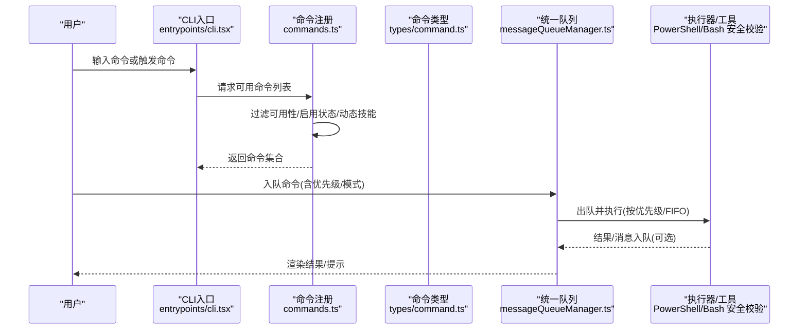
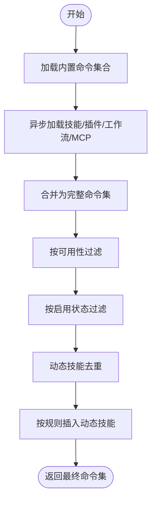
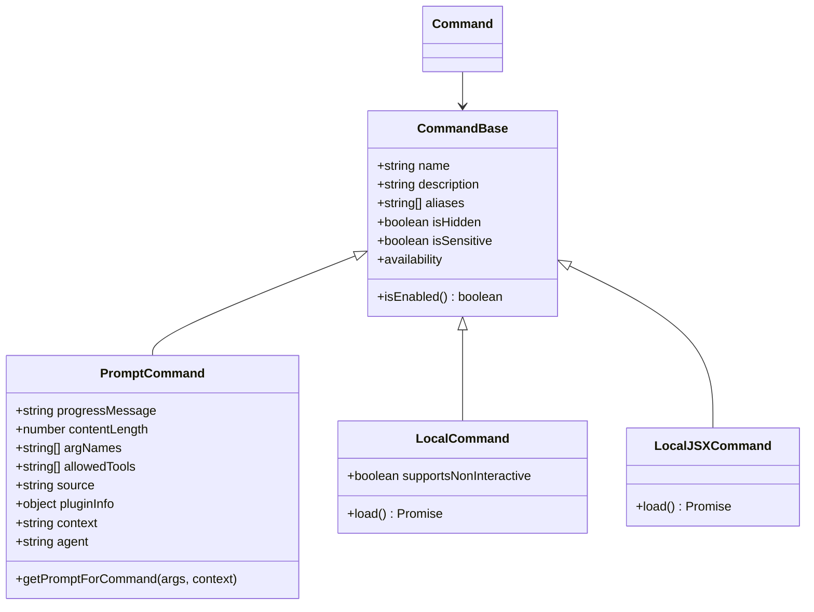
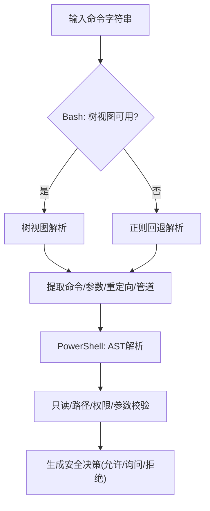
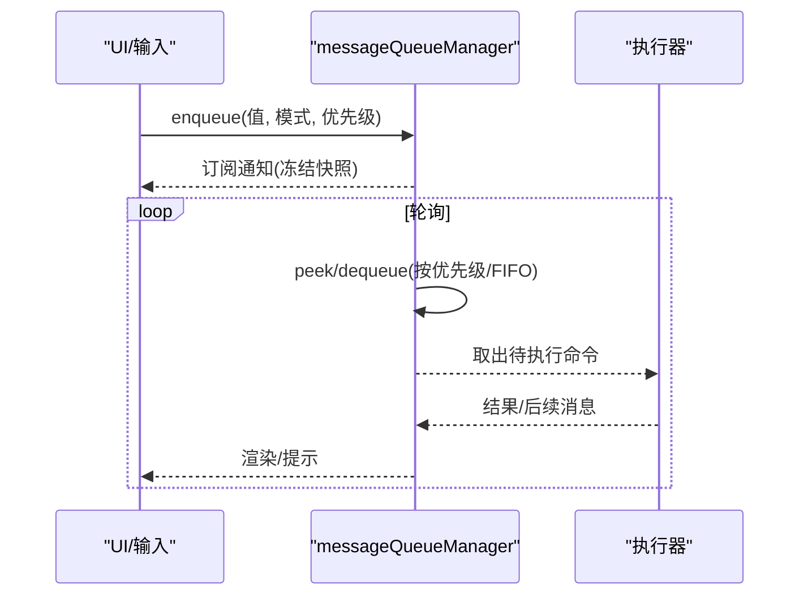
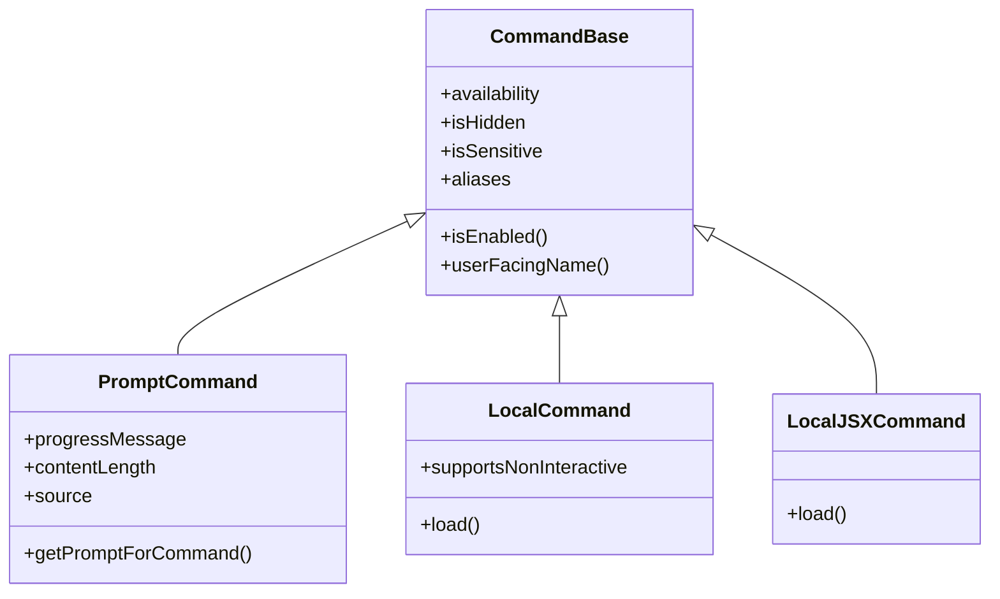
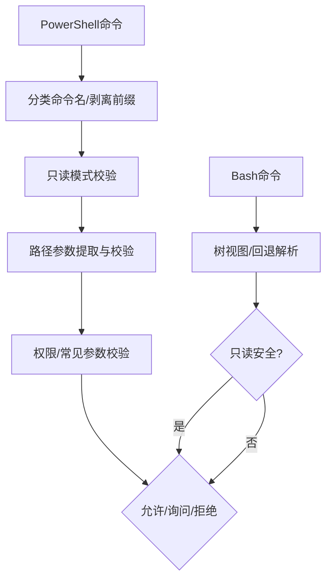
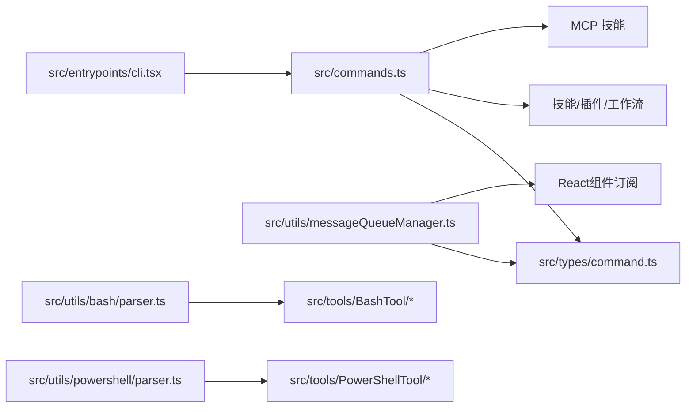

# 命令系统架构

<cite>
**本文引用的文件**
- [src/commands.ts](file://src/commands.ts)
- [src/types/command.ts](file://src/types/command.ts)
- [src/utils/messageQueueManager.ts](file://src/utils/messageQueueManager.ts)
- [src/hooks/useCommandQueue.ts](file://src/hooks/useCommandQueue.ts)
- [src/commands/help/index.ts](file://src/commands/help/index.ts)
- [src/commands/context/index.ts](file://src/commands/context/index.ts)
- [src/commands/exit/index.ts](file://src/commands/exit/index.ts)
- [src/commands/init.ts](file://src/commands/init.ts)
- [src/types/textInputTypes.ts](file://src/types/textInputTypes.ts)
- [src/entrypoints/cli.tsx](file://src/entrypoints/cli.tsx)
- [src/utils/bash/ParsedCommand.ts](file://src/utils/bash/ParsedCommand.ts)
- [src/utils/bash/parser.ts](file://src/utils/bash/parser.ts)
- [src/utils/powershell/parser.ts](file://src/utils/powershell/parser.ts)
- [src/tools/PowerShellTool/modeValidation.ts](file://src/tools/PowerShellTool/modeValidation.ts)
- [src/tools/PowerShellTool/readOnlyValidation.ts](file://src/tools/PowerShellTool/readOnlyValidation.ts)
- [src/tools/PowerShellTool/powershellPermissions.ts](file://src/tools/PowerShellTool/powershellPermissions.ts)
- [src/tools/PowerShellTool/commonParameters.ts](file://src/tools/PowerShellTool/commonParameters.ts)
- [src/tools/PowerShellTool/pathValidation.ts](file://src/tools/PowerShellTool/pathValidation.ts)
- [src/tools/BashTool/readOnlyValidation.ts](file://src/tools/BashTool/readOnlyValidation.ts)
</cite>

## 目录
1. [引言](#引言)
2. [项目结构](#项目结构)
3. [核心组件](#核心组件)
4. [架构总览](#架构总览)
5. [详细组件分析](#详细组件分析)
6. [依赖关系分析](#依赖关系分析)
7. [性能考量](#性能考量)
8. [故障排查指南](#故障排查指南)
9. [结论](#结论)
10. [附录](#附录)

## 引言
本文件系统化阐述命令系统的架构设计与实现，覆盖命令注册机制、命令解析流程、命令执行管道、命令基类继承体系、生命周期管理、参数验证机制、扩展性设计（新增命令类型、优先级处理、冲突解决）以及核心接口与使用示例。目标是帮助开发者快速理解并高效扩展命令系统。

## 项目结构
命令系统由“命令声明与注册”“命令类型与生命周期”“统一队列与执行”“解析与安全校验”四大部分构成，并通过入口点与工具链协同工作。

```mermaid
graph TB
subgraph "命令声明与注册"
A["src/commands.ts<br/>命令聚合与过滤"]
B["src/commands/*/index.ts<br/>各命令声明"]
C["src/types/command.ts<br/>命令类型定义"]
end
subgraph "执行与调度"
D["src/utils/messageQueueManager.ts<br/>统一队列"]
E["src/hooks/useCommandQueue.ts<br/>React订阅"]
F["src/types/textInputTypes.ts<br/>队列项与优先级"]
end
subgraph "解析与安全"
G["src/utils/bash/ParsedCommand.ts<br/>Bash解析器"]
H["src/utils/bash/parser.ts<br/>Bash树视图解析"]
I["src/utils/powershell/parser.ts<br/>PowerShell解析器"]
J["src/tools/PowerShellTool/*<br/>安全校验与路径/权限策略"]
end
subgraph "入口与集成"
K["src/entrypoints/cli.tsx<br/>CLI入口"]
B --> A
C --> A
A --> D
D --> E
F --> D
G --> J
H --> J
I --> J
K --> A
```

**图表来源**
- [src/commands.ts:258-346](file://src/commands.ts#L258-L346)
- [src/types/command.ts:175-206](file://src/types/command.ts#L175-L206)
- [src/utils/messageQueueManager.ts:53-193](file://src/utils/messageQueueManager.ts#L53-L193)
- [src/hooks/useCommandQueue.ts:1-16](file://src/hooks/useCommandQueue.ts#L1-L16)
- [src/types/textInputTypes.ts:299-358](file://src/types/textInputTypes.ts#L299-L358)
- [src/utils/bash/ParsedCommand.ts:305-318](file://src/utils/bash/ParsedCommand.ts#L305-L318)
- [src/utils/bash/parser.ts:56-93](file://src/utils/bash/parser.ts#L56-L93)
- [src/utils/powershell/parser.ts:798-968](file://src/utils/powershell/parser.ts#L798-L968)
- [src/tools/PowerShellTool/modeValidation.ts:163-268](file://src/tools/PowerShellTool/modeValidation.ts#L163-L268)
- [src/entrypoints/cli.tsx:60-317](file://src/entrypoints/cli.tsx#L60-L317)

**章节来源**
- [src/commands.ts:258-346](file://src/commands.ts#L258-L346)
- [src/types/command.ts:175-206](file://src/types/command.ts#L175-L206)
- [src/utils/messageQueueManager.ts:53-193](file://src/utils/messageQueueManager.ts#L53-L193)
- [src/hooks/useCommandQueue.ts:1-16](file://src/hooks/useCommandQueue.ts#L1-L16)
- [src/types/textInputTypes.ts:299-358](file://src/types/textInputTypes.ts#L299-L358)
- [src/utils/bash/ParsedCommand.ts:305-318](file://src/utils/bash/ParsedCommand.ts#L305-L318)
- [src/utils/bash/parser.ts:56-93](file://src/utils/bash/parser.ts#L56-L93)
- [src/utils/powershell/parser.ts:798-968](file://src/utils/powershell/parser.ts#L798-L968)
- [src/tools/PowerShellTool/modeValidation.ts:163-268](file://src/tools/PowerShellTool/modeValidation.ts#L163-L268)
- [src/entrypoints/cli.tsx:60-317](file://src/entrypoints/cli.tsx#L60-L317)

## 核心组件
- 命令聚合与过滤：集中加载内置命令、技能、插件、工作流与动态技能，按可用性与启用状态过滤，支持缓存与去重。
- 命令类型与生命周期：统一的命令基类与三种命令类型（prompt、local、local-jsx），支持延迟加载、非交互执行、桥接安全命令等。
- 统一队列与优先级：模块级队列，支持 now/next/later 优先级、FIFO 同优先级顺序、过滤出队、可见性与可编辑性控制。
- 解析与安全：Bash 使用树视图解析器与回退正则；PowerShell 使用 AST 解析与多层安全校验（只读、路径、权限、常见参数）。

**章节来源**
- [src/commands.ts:476-517](file://src/commands.ts#L476-L517)
- [src/types/command.ts:175-217](file://src/types/command.ts#L175-L217)
- [src/utils/messageQueueManager.ts:151-193](file://src/utils/messageQueueManager.ts#L151-L193)
- [src/types/textInputTypes.ts:299-358](file://src/types/textInputTypes.ts#L299-L358)
- [src/utils/bash/ParsedCommand.ts:305-318](file://src/utils/bash/ParsedCommand.ts#L305-L318)
- [src/utils/powershell/parser.ts:798-968](file://src/utils/powershell/parser.ts#L798-L968)

## 架构总览
命令从声明到执行的关键路径如下：



**图表来源**
- [src/entrypoints/cli.tsx:60-317](file://src/entrypoints/cli.tsx#L60-L317)
- [src/commands.ts:476-517](file://src/commands.ts#L476-L517)
- [src/types/command.ts:175-217](file://src/types/command.ts#L175-L217)
- [src/utils/messageQueueManager.ts:151-193](file://src/utils/messageQueueManager.ts#L151-L193)

## 详细组件分析

### 命令注册机制与命令聚合
- 内置命令：在单一聚合文件中集中导入并 memoize，避免重复构建。
- 动态来源：技能目录、插件、工作流脚本、MCP 技能等异步加载后合并。
- 可用性与启用：按认证/提供商要求过滤；按功能开关与环境变量启用/禁用。
- 去重与插入：动态技能仅在名称未冲突时插入，保证顺序稳定。



**图表来源**
- [src/commands.ts:449-469](file://src/commands.ts#L449-L469)
- [src/commands.ts:483-516](file://src/commands.ts#L483-L516)

**章节来源**
- [src/commands.ts:258-346](file://src/commands.ts#L258-L346)
- [src/commands.ts:417-443](file://src/commands.ts#L417-L443)
- [src/commands.ts:449-469](file://src/commands.ts#L449-L469)
- [src/commands.ts:483-516](file://src/commands.ts#L483-L516)

### 命令类型与生命周期
- 命令基类：统一字段（名称、描述、别名、可用性、是否隐藏、是否敏感等）。
- 三类命令：
  - prompt：模型可调用的技能型命令，支持上下文/代理/努力度等配置。
  - local：本地文本输出命令，支持非交互执行。
  - local-jsx：本地渲染命令，延迟加载以减少启动成本。
- 生命周期：延迟加载模块，执行完成后可选择显示/系统消息/继续对话。



**图表来源**
- [src/types/command.ts:175-217](file://src/types/command.ts#L175-L217)
- [src/types/command.ts:25-57](file://src/types/command.ts#L25-L57)
- [src/types/command.ts:74-78](file://src/types/command.ts#L74-L78)
- [src/types/command.ts:144-152](file://src/types/command.ts#L144-L152)

**章节来源**
- [src/types/command.ts:175-217](file://src/types/command.ts#L175-L217)
- [src/types/command.ts:25-57](file://src/types/command.ts#L25-L57)
- [src/types/command.ts:74-78](file://src/types/command.ts#L74-L78)
- [src/types/command.ts:144-152](file://src/types/command.ts#L144-L152)

### 命令解析流程（Bash 与 PowerShell）
- Bash：
  - 首选树视图解析（feature 开关），失败回退正则解析。
  - 提供管道段、输出重定向提取、树视图分析等能力。
- PowerShell：
  - AST 解析，分类命令名、剥离模块前缀、转换为统一元素。
  - 多层安全校验：只读模式、路径参数、权限与常见参数、表达式/数组/子表达式检测。



**图表来源**
- [src/utils/bash/ParsedCommand.ts:270-290](file://src/utils/bash/ParsedCommand.ts#L270-L290)
- [src/utils/bash/parser.ts:56-93](file://src/utils/bash/parser.ts#L56-L93)
- [src/utils/powershell/parser.ts:828-935](file://src/utils/powershell/parser.ts#L828-L935)
- [src/tools/PowerShellTool/modeValidation.ts:163-268](file://src/tools/PowerShellTool/modeValidation.ts#L163-L268)
- [src/tools/PowerShellTool/pathValidation.ts:1313-1696](file://src/tools/PowerShellTool/pathValidation.ts#L1313-L1696)

**章节来源**
- [src/utils/bash/ParsedCommand.ts:270-290](file://src/utils/bash/ParsedCommand.ts#L270-L290)
- [src/utils/bash/parser.ts:56-93](file://src/utils/bash/parser.ts#L56-L93)
- [src/utils/powershell/parser.ts:828-935](file://src/utils/powershell/parser.ts#L828-L935)
- [src/tools/PowerShellTool/modeValidation.ts:163-268](file://src/tools/PowerShellTool/modeValidation.ts#L163-L268)
- [src/tools/PowerShellTool/pathValidation.ts:1313-1696](file://src/tools/PowerShellTool/pathValidation.ts#L1313-L1696)

### 命令执行管道与优先级
- 队列模型：模块级队列，冻结快照，React 通过订阅感知变化。
- 优先级：now > next > later；同优先级 FIFO；支持过滤出队与批量移除。
- 模式与可见性：区分 bash/prompt/orphaned-permission/task-notification 等模式；可编辑性与可见性控制。
- 即时命令：如 exit 设置 immediate，立即执行。



**图表来源**
- [src/utils/messageQueueManager.ts:53-193](file://src/utils/messageQueueManager.ts#L53-L193)
- [src/hooks/useCommandQueue.ts:1-16](file://src/hooks/useCommandQueue.ts#L1-L16)
- [src/types/textInputTypes.ts:299-358](file://src/types/textInputTypes.ts#L299-L358)
- [src/commands/exit/index.ts:8](file://src/commands/exit/index.ts#L8)

**章节来源**
- [src/utils/messageQueueManager.ts:53-193](file://src/utils/messageQueueManager.ts#L53-L193)
- [src/hooks/useCommandQueue.ts:1-16](file://src/hooks/useCommandQueue.ts#L1-L16)
- [src/types/textInputTypes.ts:299-358](file://src/types/textInputTypes.ts#L299-L358)
- [src/commands/exit/index.ts:8](file://src/commands/exit/index.ts#L8)

### 命令基类继承体系与生命周期
- 命令基类包含通用元数据与行为开关（可用性、启用、隐藏、敏感、别名、用户可见名等）。
- prompt 命令支持 getPromptForCommand，用于动态生成模型提示内容。
- local/local-jsx 支持延迟加载，减少首屏开销；local 支持非交互执行。
- 生命周期钩子：onDone 可控制显示方式、是否继续对话、附加元消息、下一条输入等。



**图表来源**
- [src/types/command.ts:175-217](file://src/types/command.ts#L175-L217)
- [src/types/command.ts:25-57](file://src/types/command.ts#L25-L57)
- [src/types/command.ts:74-78](file://src/types/command.ts#L74-L78)
- [src/types/command.ts:144-152](file://src/types/command.ts#L144-L152)

**章节来源**
- [src/types/command.ts:175-217](file://src/types/command.ts#L175-L217)
- [src/types/command.ts:25-57](file://src/types/command.ts#L25-L57)
- [src/types/command.ts:74-78](file://src/types/command.ts#L74-L78)
- [src/types/command.ts:144-152](file://src/types/command.ts#L144-L152)

### 参数验证机制（PowerShell 与 Bash）
- PowerShell：
  - 命令名分类与模块前缀剥离。
  - 只读模式校验：禁止表达式源、嵌套命令、成员调用、脚本块等。
  - 路径参数校验：提取 -Path/-Name 等参数，拒绝数组字面量、复杂表达式、未知参数。
  - 权限与常见参数：合并 cmdlet 公共参数，结合 deny 规则与白名单。
- Bash：
  - 通过树视图解析器与回退正则解析命令，识别管道与重定向。
  - 通过只读校验函数对组合标志、参数与通配符进行静态判定。



**图表来源**
- [src/utils/powershell/parser.ts:800-826](file://src/utils/powershell/parser.ts#L800-L826)
- [src/tools/PowerShellTool/modeValidation.ts:163-268](file://src/tools/PowerShellTool/modeValidation.ts#L163-L268)
- [src/tools/PowerShellTool/pathValidation.ts:1313-1696](file://src/tools/PowerShellTool/pathValidation.ts#L1313-L1696)
- [src/tools/PowerShellTool/commonParameters.ts:12-30](file://src/tools/PowerShellTool/commonParameters.ts#L12-L30)
- [src/tools/BashTool/readOnlyValidation.ts:1241-1280](file://src/tools/BashTool/readOnlyValidation.ts#L1241-L1280)

**章节来源**
- [src/utils/powershell/parser.ts:800-826](file://src/utils/powershell/parser.ts#L800-L826)
- [src/tools/PowerShellTool/modeValidation.ts:163-268](file://src/tools/PowerShellTool/modeValidation.ts#L163-L268)
- [src/tools/PowerShellTool/pathValidation.ts:1313-1696](file://src/tools/PowerShellTool/pathValidation.ts#L1313-L1696)
- [src/tools/PowerShellTool/commonParameters.ts:12-30](file://src/tools/PowerShellTool/commonParameters.ts#L12-L30)
- [src/tools/BashTool/readOnlyValidation.ts:1241-1280](file://src/tools/BashTool/readOnlyValidation.ts#L1241-L1280)

### 扩展性设计：新增命令类型、优先级与冲突解决
- 新增命令类型：
  - prompt：通过 getPromptForCommand 动态生成提示，适合模型驱动的技能。
  - local：适合纯文本输出或非交互场景。
  - local-jsx：适合需要渲染 UI 的命令，延迟加载以优化性能。
- 优先级处理：
  - now：中断当前流程，立即发送。
  - next：当前轮次结束后、下一次 API 循环前发送。
  - later：当前回合结束后作为新查询发送。
- 冲突解决：
  - 动态技能与内置命令去重，按规则插入，避免覆盖同名命令。
  - 桥接安全命令白名单，确保远程端只执行安全命令。

**章节来源**
- [src/commands.ts:483-516](file://src/commands.ts#L483-L516)
- [src/commands.ts:619-676](file://src/commands.ts#L619-L676)
- [src/utils/messageQueueManager.ts:151-193](file://src/utils/messageQueueManager.ts#L151-L193)

### 核心接口定义与使用示例
- 命令声明示例（本地 JSX 命令）：
  - 文件：[src/commands/help/index.ts](file://src/commands/help/index.ts)
  - 关键点：type 为 local-jsx，name/description，load 延迟加载。
- 命令声明示例（本地命令 + 非交互）：
  - 文件：[src/commands/context/index.ts](file://src/commands/context/index.ts)
  - 关键点：type 为 local-jsx/local，supportsNonInteractive，isEnabled/isHidden 控制。
- 命令声明示例（即时退出）：
  - 文件：[src/commands/exit/index.ts](file://src/commands/exit/index.ts)
  - 关键点：immediate: true。
- 模型驱动命令示例：
  - 文件：[src/commands/init.ts](file://src/commands/init.ts)
  - 关键点：type 为 prompt，getPromptForCommand 返回 ContentBlockParam[]。
- 命令查找与获取：
  - 工具函数：findCommand/getCommand，支持别名匹配与错误提示。
  - 文件：[src/commands.ts](file://src/commands.ts)

**章节来源**
- [src/commands/help/index.ts:1-11](file://src/commands/help/index.ts#L1-L11)
- [src/commands/context/index.ts:1-25](file://src/commands/context/index.ts#L1-L25)
- [src/commands/exit/index.ts:1-13](file://src/commands/exit/index.ts#L1-L13)
- [src/commands/init.ts:226-257](file://src/commands/init.ts#L226-L257)
- [src/commands.ts:688-719](file://src/commands.ts#L688-L719)

## 依赖关系分析



**图表来源**
- [src/commands.ts:258-346](file://src/commands.ts#L258-L346)
- [src/types/command.ts:175-217](file://src/types/command.ts#L175-L217)
- [src/utils/messageQueueManager.ts:53-193](file://src/utils/messageQueueManager.ts#L53-L193)
- [src/utils/bash/parser.ts:56-93](file://src/utils/bash/parser.ts#L56-L93)
- [src/utils/powershell/parser.ts:798-968](file://src/utils/powershell/parser.ts#L798-L968)
- [src/entrypoints/cli.tsx:60-317](file://src/entrypoints/cli.tsx#L60-L317)

**章节来源**
- [src/commands.ts:258-346](file://src/commands.ts#L258-L346)
- [src/types/command.ts:175-217](file://src/types/command.ts#L175-L217)
- [src/utils/messageQueueManager.ts:53-193](file://src/utils/messageQueueManager.ts#L53-L193)
- [src/utils/bash/parser.ts:56-93](file://src/utils/bash/parser.ts#L56-L93)
- [src/utils/powershell/parser.ts:798-968](file://src/utils/powershell/parser.ts#L798-L968)
- [src/entrypoints/cli.tsx:60-317](file://src/entrypoints/cli.tsx#L60-L317)

## 性能考量
- 命令聚合与技能加载采用 memoize 缓存，避免重复 I/O 与动态导入开销。
- Bash 解析器优先使用树视图解析，失败回退正则，兼顾准确性与性能。
- PowerShell 解析与安全校验分层进行，AST 解析后进行快速判定，减少无效计算。
- 队列采用冻结快照与订阅模式，最小化 React 重渲染次数。

[本节为通用指导，无需特定文件来源]

## 故障排查指南
- 命令未出现或被隐藏：
  - 检查 availability 与 isEnabled 是否满足条件。
  - 检查 isHidden 与非交互会话状态。
  - 参考：[src/commands.ts](file://src/commands.ts) 中的过滤逻辑。
- 命令执行异常或被拒绝：
  - Bash：确认命令是否为简单只读命令，避免操作符与复杂通配符。
  - PowerShell：检查只读模式、路径参数、常见参数与 deny 规则。
  - 参考：[src/tools/BashTool/readOnlyValidation.ts](file://src/tools/BashTool/readOnlyValidation.ts)、[src/tools/PowerShellTool/modeValidation.ts](file://src/tools/PowerShellTool/modeValidation.ts)、[src/tools/PowerShellTool/pathValidation.ts](file://src/tools/PowerShellTool/pathValidation.ts)。
- 队列无响应或优先级不生效：
  - 检查优先级设置与过滤条件，确认是否被其他命令抢占。
  - 参考：[src/utils/messageQueueManager.ts](file://src/utils/messageQueueManager.ts)。

**章节来源**
- [src/commands.ts:417-443](file://src/commands.ts#L417-L443)
- [src/tools/BashTool/readOnlyValidation.ts:1241-1280](file://src/tools/BashTool/readOnlyValidation.ts#L1241-L1280)
- [src/tools/PowerShellTool/modeValidation.ts:163-268](file://src/tools/PowerShellTool/modeValidation.ts#L163-L268)
- [src/tools/PowerShellTool/pathValidation.ts:1313-1696](file://src/tools/PowerShellTool/pathValidation.ts#L1313-L1696)
- [src/utils/messageQueueManager.ts:151-193](file://src/utils/messageQueueManager.ts#L151-L193)

## 结论
该命令系统通过“声明-注册-解析-执行-安全校验”的清晰分层，实现了高扩展性与强安全性。命令基类统一抽象、三类命令满足不同场景、统一队列保障执行有序、解析与安全校验覆盖主流 Shell 平台。开发者可基于现有接口快速扩展新命令类型，并通过优先级与冲突策略维持系统稳定性。

[本节为总结，无需特定文件来源]

## 附录
- 常用工具与入口：
  - CLI 入口：[src/entrypoints/cli.tsx](file://src/entrypoints/cli.tsx)
  - 命令聚合：[src/commands.ts](file://src/commands.ts)
  - 类型定义：[src/types/command.ts](file://src/types/command.ts)
  - 队列与优先级：[src/utils/messageQueueManager.ts](file://src/utils/messageQueueManager.ts)、[src/hooks/useCommandQueue.ts](file://src/hooks/useCommandQueue.ts)、[src/types/textInputTypes.ts](file://src/types/textInputTypes.ts)
  - Bash 解析：[src/utils/bash/ParsedCommand.ts](file://src/utils/bash/ParsedCommand.ts)、[src/utils/bash/parser.ts](file://src/utils/bash/parser.ts)
  - PowerShell 解析与安全：[src/utils/powershell/parser.ts](file://src/utils/powershell/parser.ts)、[src/tools/PowerShellTool/modeValidation.ts](file://src/tools/PowerShellTool/modeValidation.ts)、[src/tools/PowerShellTool/pathValidation.ts](file://src/tools/PowerShellTool/pathValidation.ts)、[src/tools/PowerShellTool/commonParameters.ts](file://src/tools/PowerShellTool/commonParameters.ts)

[本节为索引，无需特定文件来源]