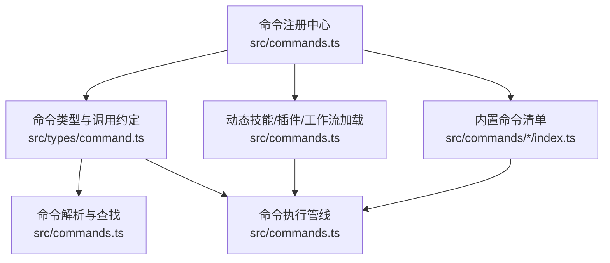
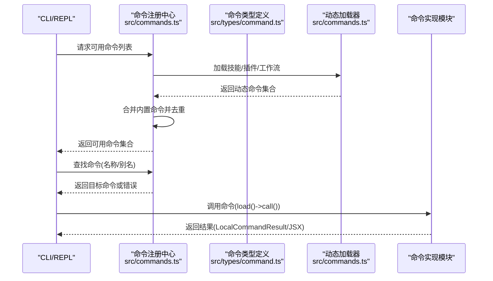
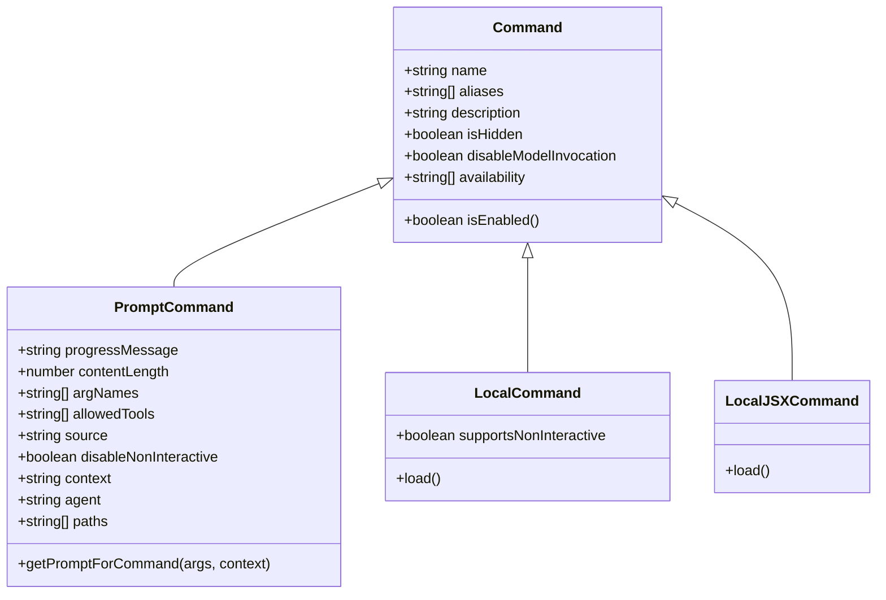

# 命令行工具系统

<cite>
**本文引用的文件**
- [src/commands.ts](file://src/commands.ts)
- [src/types/command.ts](file://src/types/command.ts)
- [src/commands/add-dir/index.ts](file://src/commands/add-dir/index.ts)
- [src/commands/files/index.ts](file://src/commands/files/index.ts)
- [src/commands/diff/index.ts](file://src/commands/diff/index.ts)
- [src/commands/config/index.ts](file://src/commands/config/index.ts)
- [src/commands/tasks/index.ts](file://src/commands/tasks/index.ts)
- [src/commands/mcp/index.ts](file://src/commands/mcp/index.ts)
- [src/cli/src/commands/context/context-noninteractive.ts](file://src/cli/src/commands/context/context-noninteractive.ts)
</cite>

## 目录
1. [简介](#简介)
2. [项目结构](#项目结构)
3. [核心组件](#核心组件)
4. [架构总览](#架构总览)
5. [详细组件分析](#详细组件分析)
6. [依赖关系分析](#依赖关系分析)
7. [性能考量](#性能考量)
8. [故障排查指南](#故障排查指南)
9. [结论](#结论)
10. [附录](#附录)

## 简介
本文件面向 Claude Code 的命令行工具系统，系统化阐述命令注册机制、命令解析与执行管道、命令生命周期管理（可用性检查、权限验证、执行状态跟踪），并按功能维度梳理内置命令类别（文件操作、搜索导航、Shell 执行、任务管理、配置管理等）。同时提供命令开发指南，包括如何创建自定义命令、参数定义、返回值处理与最佳实践。

## 项目结构
命令系统的核心由“命令注册与发现”“命令类型与调用约定”“命令可用性与权限控制”“动态技能与插件集成”四部分组成，并通过统一的命令入口进行聚合与分发。

图表来源
- [src/commands.ts:256-346](file://src/commands.ts#L256-L346)
- [src/types/command.ts:169-206](file://src/types/command.ts#L169-L206)

章节来源
- [src/commands.ts:256-346](file://src/commands.ts#L256-L346)
- [src/types/command.ts:169-206](file://src/types/command.ts#L169-L206)

## 核心组件
- 命令注册与聚合
  - 统一导出内置命令集合，支持条件特性开关与用户类型过滤。
  - 聚合技能目录命令、插件命令、工作流命令与内置命令，形成最终可用命令集。
- 命令类型与调用约定
  - 定义三类命令：prompt（模型可调用）、local（本地文本输出）、local-jsx（渲染 UI）。
  - 明确命令元信息（名称、别名、描述、可用性、是否交互等）与执行回调签名。
- 命令可用性与权限控制
  - 按订阅/控制台身份过滤命令可见性；运行时启用状态与特性开关共同决定命令是否可用。
- 动态能力注入
  - 支持从技能目录、插件、工作流动态加载命令，且在去重后插入到合适位置，保证优先级与一致性。

章节来源
- [src/commands.ts:256-346](file://src/commands.ts#L256-L346)
- [src/commands.ts:417-443](file://src/commands.ts#L417-L443)
- [src/commands.ts:449-469](file://src/commands.ts#L449-L469)
- [src/commands.ts:476-517](file://src/commands.ts#L476-L517)
- [src/types/command.ts:169-206](file://src/types/command.ts#L169-L206)

## 架构总览
命令系统采用“声明式注册 + 运行时聚合 + 类型约束 + 权限过滤”的架构。命令模块仅声明元数据与懒加载入口，实际执行在调用时触发，确保启动与切换成本最小化。

图表来源
- [src/commands.ts:476-517](file://src/commands.ts#L476-L517)
- [src/commands.ts:688-719](file://src/commands.ts#L688-L719)
- [src/types/command.ts:62-72](file://src/types/command.ts#L62-L72)
- [src/types/command.ts:131-142](file://src/types/command.ts#L131-L142)

## 详细组件分析

### 命令注册与聚合（src/commands.ts）
- 内置命令清单
  - 通过集中导出与 memo 缓存，避免重复构建命令数组。
  - 条件命令（如特性开关、用户类型）在构建阶段按需拼接。
- 动态命令加载
  - 技能目录命令、插件命令、工作流命令与内置命令并行加载，合并后去重。
  - 动态技能插入到插件技能之后、内置命令之前，保持语义顺序。
- 可用性与启用控制
  - 可用性过滤（订阅/控制台）先于启用过滤执行，确保界面不展示不可用命令。
  - 运行时启用状态（isEnabled）与特性开关共同决定最终可用集合。
- 远程/桥接安全命令
  - 提供 REMOTE_SAFE_COMMANDS 与 BRIDGE_SAFE_COMMANDS 白名单，保障远程模式下的安全性。

章节来源
- [src/commands.ts:256-346](file://src/commands.ts#L256-L346)
- [src/commands.ts:417-443](file://src/commands.ts#L417-L443)
- [src/commands.ts:449-469](file://src/commands.ts#L449-L469)
- [src/commands.ts:476-517](file://src/commands.ts#L476-L517)
- [src/commands.ts:619-686](file://src/commands.ts#L619-L686)

### 命令类型与调用约定（src/types/command.ts）
- 命令类型
  - prompt：模型可调用，返回内容块参数，支持路径过滤、上下文派生、钩子设置等。
  - local：本地命令，返回文本或压缩结果，支持非交互模式。
  - local-jsx：渲染 UI，返回 React 节点，适合终端内图形界面。
- 执行回调
  - local：LocalCommandCall 接收 args 与上下文，返回 LocalCommandResult。
  - local-jsx：LocalJSXCommandCall 接收 onDone 回调与上下文，返回 React 节点。
- 元信息与可用性
  - availability：静态可用性（订阅/控制台）。
  - isEnabled：运行时启用状态。
  - isHidden、aliases、argumentHint、whenToUse、version、disableModelInvocation 等扩展字段。

章节来源
- [src/types/command.ts:16-24](file://src/types/command.ts#L16-L24)
- [src/types/command.ts:25-57](file://src/types/command.ts#L25-L57)
- [src/types/command.ts:62-72](file://src/types/command.ts#L62-L72)
- [src/types/command.ts:74-78](file://src/types/command.ts#L74-L78)
- [src/types/command.ts:80-98](file://src/types/command.ts#L80-L98)
- [src/types/command.ts:131-142](file://src/types/command.ts#L131-L142)
- [src/types/command.ts:144-152](file://src/types/command.ts#L144-L152)
- [src/types/command.ts:169-206](file://src/types/command.ts#L169-L206)

### 命令解析与查找（src/commands.ts）
- 查找策略
  - 支持按 name、userFacingName、aliases 匹配。
  - 未找到时抛出包含可用命令列表的错误，便于提示。
- 描述格式化
  - 针对用户界面，自动附加来源标注（插件/内置/MCP/打包）与工作流标识。

章节来源
- [src/commands.ts:688-719](file://src/commands.ts#L688-L719)
- [src/commands.ts:728-754](file://src/commands.ts#L728-L754)

### 文件操作命令族
- add-dir
  - 类型：local-jsx
  - 功能：添加新的工作目录
  - 注册方式：声明式注册，懒加载实现模块
  - 参考路径：[src/commands/add-dir/index.ts:1-12](file://src/commands/add-dir/index.ts#L1-L12)
- files
  - 类型：local
  - 功能：列出当前上下文中所有文件
  - 特性：支持非交互模式，按用户类型启用
  - 参考路径：[src/commands/files/index.ts:1-13](file://src/commands/files/index.ts#L1-L13)
- diff
  - 类型：local-jsx
  - 功能：查看未提交变更与按轮次的差异
  - 参考路径：[src/commands/diff/index.ts:1-9](file://src/commands/diff/index.ts#L1-L9)

章节来源
- [src/commands/add-dir/index.ts:1-12](file://src/commands/add-dir/index.ts#L1-L12)
- [src/commands/files/index.ts:1-13](file://src/commands/files/index.ts#L1-L13)
- [src/commands/diff/index.ts:1-9](file://src/commands/diff/index.ts#L1-L9)

### 搜索导航命令
- context（交互式）
  - 类型：local-jsx
  - 功能：交互式上下文收集与可视化
  - 参考路径：[src/commands/context/index.ts](file://src/commands/context/index.ts)
- context-noninteractive（非交互式）
  - 类型：local
  - 功能：非交互式上下文数据采集（占位/桩）
  - 参考路径：[src/cli/src/commands/context/context-noninteractive.ts:1-3](file://src/cli/src/commands/context/context-noninteractive.ts#L1-L3)

章节来源
- [src/commands/context/index.ts](file://src/commands/context/index.ts)
- [src/cli/src/commands/context/context-noninteractive.ts:1-3](file://src/cli/src/commands/context/context-noninteractive.ts#L1-L3)

### Shell 执行命令
- mcp
  - 类型：local-jsx
  - 功能：管理 MCP 服务器（立即执行，argumentHint 提示参数）
  - 参考路径：[src/commands/mcp/index.ts:1-13](file://src/commands/mcp/index.ts#L1-L13)

章节来源
- [src/commands/mcp/index.ts:1-13](file://src/commands/mcp/index.ts#L1-L13)

### 任务管理命令
- tasks（别名：bashes）
  - 类型：local-jsx
  - 功能：列出与管理后台任务
  - 参考路径：[src/commands/tasks/index.ts:1-12](file://src/commands/tasks/index.ts#L1-L12)

章节来源
- [src/commands/tasks/index.ts:1-12](file://src/commands/tasks/index.ts#L1-L12)

### 配置管理命令
- config（别名：settings）
  - 类型：local-jsx
  - 功能：打开配置面板
  - 参考路径：[src/commands/config/index.ts:1-12](file://src/commands/config/index.ts#L1-L12)

章节来源
- [src/commands/config/index.ts:1-12](file://src/commands/config/index.ts#L1-L12)

### 命令生命周期管理
- 命令可用性检查
  - 静态：availability（订阅/控制台）。
  - 运行时：isEnabled（特性开关、环境变量等）。
  - 参考路径：[src/commands.ts:417-443](file://src/commands.ts#L417-L443)，[src/types/command.ts:175-206](file://src/types/command.ts#L175-L206)
- 权限验证
  - 通过 meetsAvailabilityRequirement 在渲染前隐藏不可用命令，避免误操作。
  - 参考路径：[src/commands.ts:417-443](file://src/commands.ts#L417-L443)
- 执行状态跟踪
  - local-jsx 命令通过 onDone 回调传递显示策略（跳过/系统/用户）、是否继续查询、元消息与下一条输入。
  - 参考路径：[src/types/command.ts:117-126](file://src/types/command.ts#L117-L126)，[src/types/command.ts:131-142](file://src/types/command.ts#L131-L142)

章节来源
- [src/commands.ts:417-443](file://src/commands.ts#L417-L443)
- [src/types/command.ts:117-126](file://src/types/command.ts#L117-L126)
- [src/types/command.ts:131-142](file://src/types/command.ts#L131-L142)

### 命令开发指南
- 创建自定义命令
  - 选择命令类型：prompt（模型可调用）、local（文本输出）、local-jsx（UI 渲染）。
  - 定义元信息：name、description、aliases、argumentHint、whenToUse、version、disableModelInvocation、userInvocable、loadedFrom、kind、immediate、isSensitive、userFacingName。
  - 实现懒加载模块：提供 load() 返回 Promise<LocalCommandModule | LocalJSXCommandModule>，并在 call 中完成实际逻辑。
  - 参考路径：[src/types/command.ts:169-206](file://src/types/command.ts#L169-L206)，[src/types/command.ts:62-72](file://src/types/command.ts#L62-L72)，[src/types/command.ts:131-142](file://src/types/command.ts#L131-L142)
- 参数定义与返回值
  - local：args 为字符串，返回 LocalCommandResult（文本/压缩/跳过）。
  - local-jsx：args 为字符串，返回 React 节点，通过 onDone 控制显示与后续行为。
  - 参考路径：[src/types/command.ts:16-24](file://src/types/command.ts#L16-L24)，[src/types/command.ts:62-72](file://src/types/command.ts#L62-L72)，[src/types/command.ts:131-142](file://src/types/command.ts#L131-L142)
- 最佳实践
  - 将重型依赖懒加载，提升启动与切换性能。
  - 对敏感参数设置 isSensitive，避免历史记录泄露。
  - 使用 userFacingName 与 formatDescriptionWithSource 提升可读性与溯源性。
  - 对需要远程/桥接安全的命令加入白名单（REMOTE_SAFE_COMMANDS/BRIDGE_SAFE_COMMANDS）。
  - 参考路径：[src/commands.ts:619-686](file://src/commands.ts#L619-L686)，[src/commands.ts:728-754](file://src/commands.ts#L728-L754)

章节来源
- [src/types/command.ts:16-24](file://src/types/command.ts#L16-L24)
- [src/types/command.ts:62-72](file://src/types/command.ts#L62-L72)
- [src/types/command.ts:131-142](file://src/types/command.ts#L131-L142)
- [src/commands.ts:619-686](file://src/commands.ts#L619-L686)
- [src/commands.ts:728-754](file://src/commands.ts#L728-L754)

## 依赖关系分析
命令系统内部依赖清晰，耦合度低，主要通过类型约束与懒加载解耦实现模块。

图表来源
- [src/types/command.ts:25-57](file://src/types/command.ts#L25-L57)
- [src/types/command.ts:74-78](file://src/types/command.ts#L74-L78)
- [src/types/command.ts:144-152](file://src/types/command.ts#L144-L152)
- [src/types/command.ts:205-206](file://src/types/command.ts#L205-L206)

章节来源
- [src/types/command.ts:25-57](file://src/types/command.ts#L25-L57)
- [src/types/command.ts:74-78](file://src/types/command.ts#L74-L78)
- [src/types/command.ts:144-152](file://src/types/command.ts#L144-L152)
- [src/types/command.ts:205-206](file://src/types/command.ts#L205-L206)

## 性能考量
- 懒加载与缓存
  - 命令实现通过 load() 懒加载，减少初始内存占用。
  - loadAllCommands 与 getSkillToolCommands 等采用 memoize，避免重复磁盘 I/O 与动态导入。
  - 参考路径：[src/commands.ts:449-469](file://src/commands.ts#L449-L469)，[src/commands.ts:563-581](file://src/commands.ts#L563-L581)
- 并行加载
  - 技能目录命令、插件命令、工作流命令与内置命令并行加载，缩短构建时间。
  - 参考路径：[src/commands.ts:450-458](file://src/commands.ts#L450-L458)
- 去重与插入顺序
  - 动态技能去重并插入到插件技能之后、内置命令之前，避免重复与顺序错乱。
  - 参考路径：[src/commands.ts:491-516](file://src/commands.ts#L491-L516)

章节来源
- [src/commands.ts:449-469](file://src/commands.ts#L449-L469)
- [src/commands.ts:450-458](file://src/commands.ts#L450-L458)
- [src/commands.ts:491-516](file://src/commands.ts#L491-L516)

## 故障排查指南
- 命令未显示或不可用
  - 检查 availability 与 isEnabled 是否满足当前环境与特性开关。
  - 参考路径：[src/commands.ts:417-443](file://src/commands.ts#L417-L443)，[src/types/command.ts:175-206](file://src/types/command.ts#L175-L206)
- 命令找不到
  - 使用 getCommand/findCommand 查找，若失败会抛出包含可用命令列表的错误。
  - 参考路径：[src/commands.ts:688-719](file://src/commands.ts#L688-L719)
- 动态命令未生效
  - 清理命令缓存并重新加载：clearCommandMemoizationCaches/clearCommandsCache。
  - 参考路径：[src/commands.ts:523-539](file://src/commands.ts#L523-L539)
- 远程/桥接不可用
  - 确认命令是否在 REMOTE_SAFE_COMMANDS 或 BRIDGE_SAFE_COMMANDS 白名单中。
  - 参考路径：[src/commands.ts:619-686](file://src/commands.ts#L619-L686)，[src/commands.ts:672-676](file://src/commands.ts#L672-L676)

章节来源
- [src/commands.ts:417-443](file://src/commands.ts#L417-L443)
- [src/types/command.ts:175-206](file://src/types/command.ts#L175-L206)
- [src/commands.ts:688-719](file://src/commands.ts#L688-L719)
- [src/commands.ts:523-539](file://src/commands.ts#L523-L539)
- [src/commands.ts:619-686](file://src/commands.ts#L619-L686)
- [src/commands.ts:672-676](file://src/commands.ts#L672-L676)

## 结论
该命令行工具系统以声明式注册为核心，结合类型约束、懒加载与缓存、并行动态加载与去重策略，实现了高扩展性与高性能的命令生态。通过严格的可用性与权限控制，以及远程/桥接安全白名单，保障了在多场景下的稳定性与安全性。开发者可基于现有类型与约定快速扩展命令，同时遵循最佳实践以获得更优的用户体验与维护性。

## 附录
- 使用示例（概念性）
  - 列出可用命令：获取命令列表并过滤可用性与启用状态。
  - 执行命令：根据命令类型调用 load() 并执行 call()，local-jsx 通过 onDone 控制后续行为。
  - 非交互模式：对于支持 supportsNonInteractive 的 local 命令，可在无 UI 场景下调用。
- 最佳实践（概念性）
  - 将重型依赖延迟到 load() 中，减少启动时间。
  - 对敏感参数设置 isSensitive，避免泄露。
  - 为远程/桥接场景提供安全命令白名单，谨慎开放 prompt 命令。
  - 使用 userFacingName 与 formatDescriptionWithSource 提升可读性与溯源性。