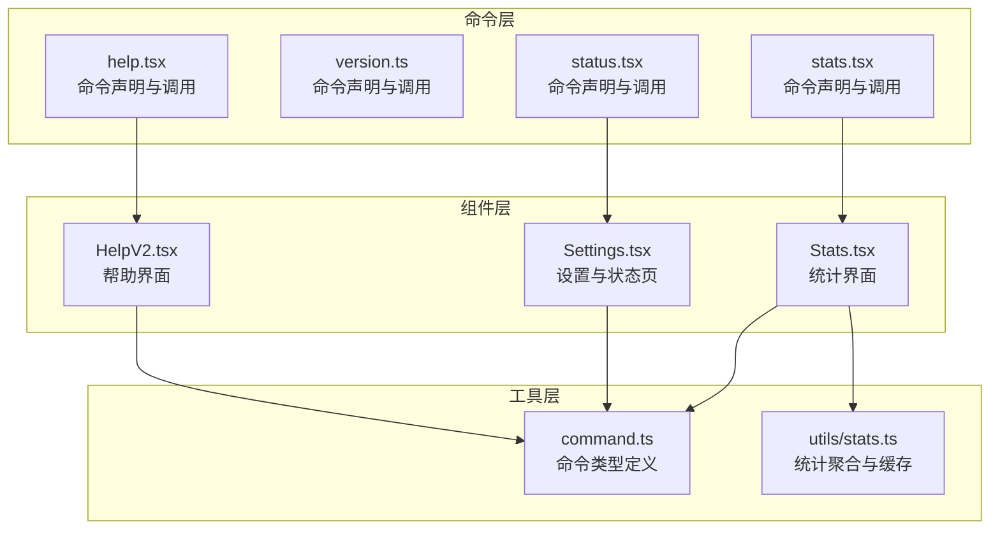
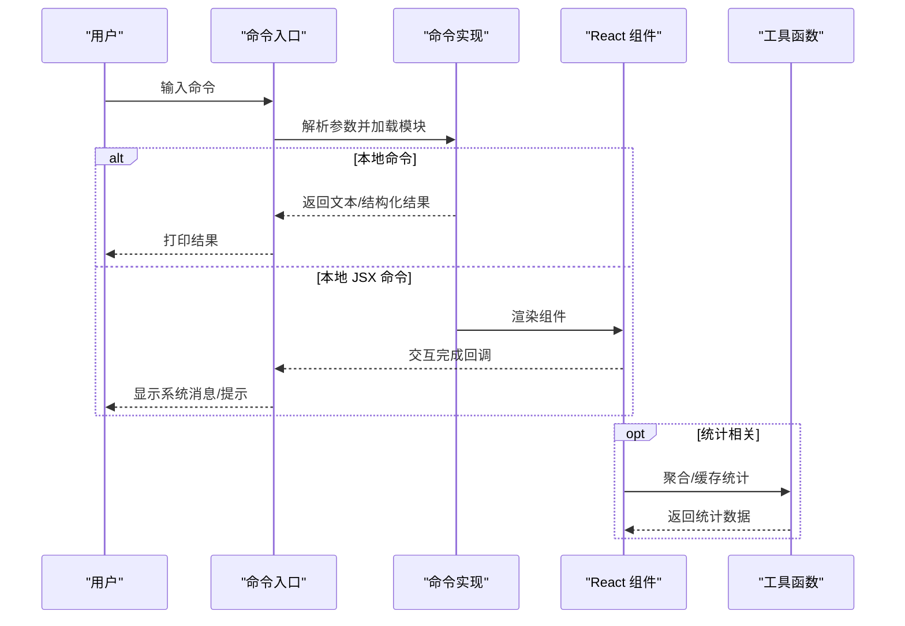
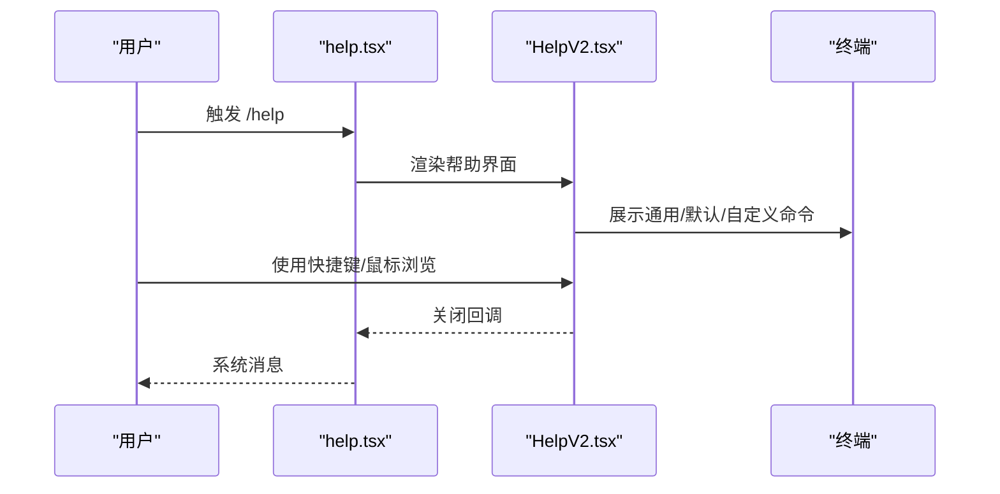
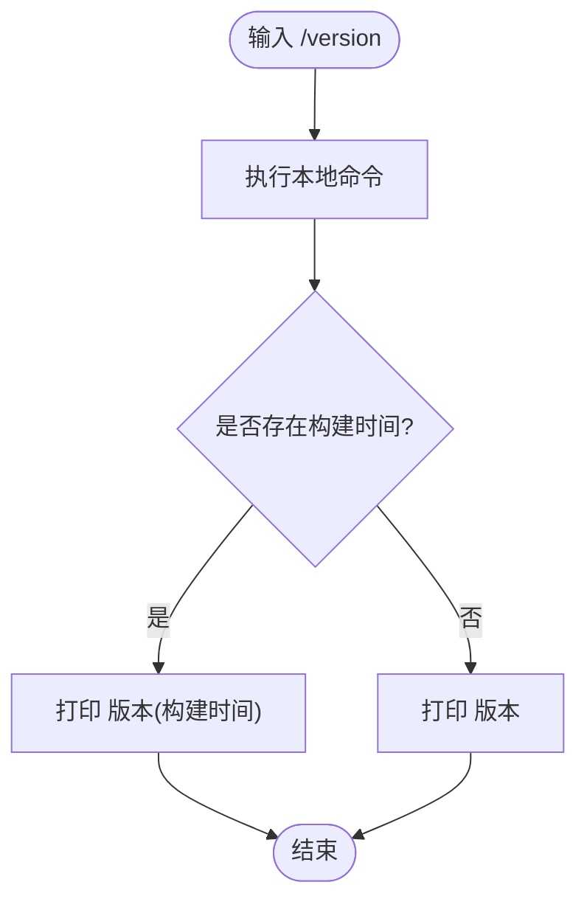
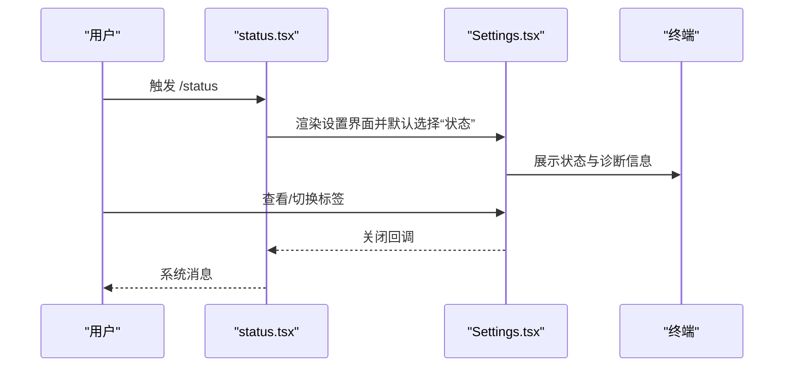
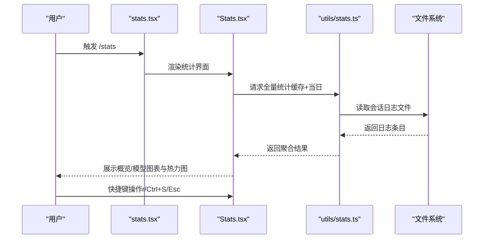
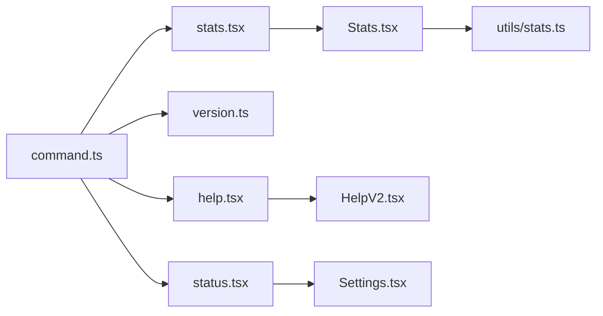

# 实用工具命令

<cite>
**本文档引用的文件**
- [src/commands/help/help.tsx](file://src/commands/help/help.tsx)
- [src/components/HelpV2/HelpV2.tsx](file://src/components/HelpV2/HelpV2.tsx)
- [src/commands/version.ts](file://src/commands/version.ts)
- [src/commands/status/status.tsx](file://src/commands/status/status.tsx)
- [src/components/Settings/Settings.tsx](file://src/components/Settings/Settings.tsx)
- [src/commands/stats/stats.tsx](file://src/commands/stats/stats.tsx)
- [src/components/Stats.tsx](file://src/components/Stats.tsx)
- [src/utils/stats.ts](file://src/utils/stats.ts)
- [src/types/command.ts](file://src/types/command.ts)
</cite>

## 目录
1. [简介](#简介)
2. [项目结构](#项目结构)
3. [核心组件](#核心组件)
4. [架构总览](#架构总览)
5. [详细组件分析](#详细组件分析)
6. [依赖关系分析](#依赖关系分析)
7. [性能考量](#性能考量)
8. [故障排查指南](#故障排查指南)
9. [结论](#结论)
10. [附录](#附录)

## 简介
本文件聚焦于实用工具类命令，涵盖帮助命令（help）、版本信息命令（version）、状态查询命令（status）与统计信息命令（stats）。这些命令主要用于调试、监控与日常维护，帮助用户快速获取系统状态、使用统计与可用命令列表，并支持在终端界面中进行交互式浏览与筛选。

## 项目结构
实用工具命令采用统一的命令注册与调用模型：
- 命令声明：通过模块导出的元数据描述命令名称、类型、描述与加载方式
- 调用实现：本地命令返回纯文本或结构化结果；本地 JSX 命令渲染 React 组件并在 UI 中展示
- 类型约束：通过统一的命令类型定义确保调用签名与返回值规范一致

**图表来源**
- [src/commands/help/help.tsx:1-11](file://src/commands/help/help.tsx#L1-L11)
- [src/components/HelpV2/HelpV2.tsx:1-184](file://src/components/HelpV2/HelpV2.tsx#L1-L184)
- [src/commands/version.ts:1-23](file://src/commands/version.ts#L1-L23)
- [src/commands/status/status.tsx:1-8](file://src/commands/status/status.tsx#L1-L8)
- [src/components/Settings/Settings.tsx:1-137](file://src/components/Settings/Settings.tsx#L1-L137)
- [src/commands/stats/stats.tsx:1-7](file://src/commands/stats/stats.tsx#L1-L7)
- [src/components/Stats.tsx:1-1228](file://src/components/Stats.tsx#L1-L1228)
- [src/utils/stats.ts:1-1062](file://src/utils/stats.ts#L1-L1062)
- [src/types/command.ts:1-217](file://src/types/command.ts#L1-L217)

**章节来源**
- [src/commands/help/help.tsx:1-11](file://src/commands/help/help.tsx#L1-L11)
- [src/commands/version.ts:1-23](file://src/commands/version.ts#L1-L23)
- [src/commands/status/status.tsx:1-8](file://src/commands/status/status.tsx#L1-L8)
- [src/commands/stats/stats.tsx:1-7](file://src/commands/stats/stats.tsx#L1-L7)
- [src/types/command.ts:1-217](file://src/types/command.ts#L1-L217)

## 核心组件
- 帮助命令（help）
  - 功能：展示内置与自定义命令列表，支持分页与快捷键操作
  - 调用：本地 JSX 命令，渲染帮助界面组件
  - 输出：交互式 UI，包含通用、默认命令与自定义命令三个标签页
- 版本命令（version）
  - 功能：打印当前会话运行的版本号，若存在构建时间则一并显示
  - 调用：本地命令，返回纯文本结果
  - 输出：字符串形式的版本信息
- 状态命令（status）
  - 功能：打开设置面板并定位到“状态”标签页，用于查看诊断信息与系统状态
  - 调用：本地 JSX 命令，渲染设置组件并指定默认标签
  - 输出：交互式设置界面
- 统计命令（stats）
  - 功能：展示 Claude Code 使用统计，包括活动热力图、会话时长、模型使用分布等
  - 调用：本地 JSX 命令，渲染统计组件
  - 输出：交互式统计界面，支持日期范围切换与截图复制

**章节来源**
- [src/commands/help/help.tsx:1-11](file://src/commands/help/help.tsx#L1-L11)
- [src/components/HelpV2/HelpV2.tsx:1-184](file://src/components/HelpV2/HelpV2.tsx#L1-L184)
- [src/commands/version.ts:1-23](file://src/commands/version.ts#L1-L23)
- [src/commands/status/status.tsx:1-8](file://src/commands/status/status.tsx#L1-L8)
- [src/components/Settings/Settings.tsx:1-137](file://src/components/Settings/Settings.tsx#L1-L137)
- [src/commands/stats/stats.tsx:1-7](file://src/commands/stats/stats.tsx#L1-L7)
- [src/components/Stats.tsx:1-1228](file://src/components/Stats.tsx#L1-L1228)

## 架构总览
命令执行流程遵循“命令声明 → 加载实现 → 渲染 UI 或返回文本”的模式。命令类型通过统一接口约束，确保在非交互与交互场景下均能稳定工作。

**图表来源**
- [src/types/command.ts:16-152](file://src/types/command.ts#L16-L152)
- [src/commands/help/help.tsx:1-11](file://src/commands/help/help.tsx#L1-L11)
- [src/commands/version.ts:1-23](file://src/commands/version.ts#L1-L23)
- [src/commands/status/status.tsx:1-8](file://src/commands/status/status.tsx#L1-L8)
- [src/commands/stats/stats.tsx:1-7](file://src/commands/stats/stats.tsx#L1-L7)
- [src/components/Stats.tsx:1-1228](file://src/components/Stats.tsx#L1-L1228)
- [src/utils/stats.ts:640-743](file://src/utils/stats.ts#L640-L743)

## 详细组件分析

### 帮助命令（help）
- 命令声明与调用
  - 声明类型：本地 JSX 命令，延迟加载实现
  - 调用逻辑：接收命令选项，传入可选命令列表，渲染帮助界面
- 界面特性
  - 支持通用、默认命令与自定义命令三类标签页
  - 键盘快捷键支持（如 ESC 关闭、Tab 切换）
  - 自适应终端尺寸，限制最大高度
- 适用场景
  - 新手入门：快速浏览可用命令
  - 快速检索：按类别筛选命令
  - 非交互环境：结合其他命令进行自动化脚本

**图表来源**
- [src/commands/help/help.tsx:1-11](file://src/commands/help/help.tsx#L1-L11)
- [src/components/HelpV2/HelpV2.tsx:1-184](file://src/components/HelpV2/HelpV2.tsx#L1-L184)

**章节来源**
- [src/commands/help/help.tsx:1-11](file://src/commands/help/help.tsx#L1-L11)
- [src/components/HelpV2/HelpV2.tsx:1-184](file://src/components/HelpV2/HelpV2.tsx#L1-L184)

### 版本命令（version）
- 命令声明与调用
  - 声明类型：本地命令，支持非交互模式
  - 调用逻辑：返回包含版本号与构建时间的文本
- 适用场景
  - 调试问题：确认当前运行版本
  - 自动化脚本：在 CI/CD 中打印版本信息
  - 兼容性检查：验证更新是否生效

**图表来源**
- [src/commands/version.ts:1-23](file://src/commands/version.ts#L1-L23)

**章节来源**
- [src/commands/version.ts:1-23](file://src/commands/version.ts#L1-L23)

### 状态命令（status）
- 命令声明与调用
  - 声明类型：本地 JSX 命令，延迟加载实现
  - 调用逻辑：渲染设置组件并将默认标签设为“状态”
- 界面特性
  - 包含状态、配置、用量等标签页
  - 支持在模态与终端两种上下文中自适应布局
  - 提供诊断信息构建与错误回退
- 适用场景
  - 日常健康检查：查看连接、权限与资源占用
  - 故障定位：收集诊断信息并导出
  - 维护窗口：调整配置与阈值

**图表来源**
- [src/commands/status/status.tsx:1-8](file://src/commands/status/status.tsx#L1-L8)
- [src/components/Settings/Settings.tsx:1-137](file://src/components/Settings/Settings.tsx#L1-L137)

**章节来源**
- [src/commands/status/status.tsx:1-8](file://src/commands/status/status.tsx#L1-L8)
- [src/components/Settings/Settings.tsx:1-137](file://src/components/Settings/Settings.tsx#L1-L137)

### 统计命令（stats）
- 命令声明与调用
  - 声明类型：本地 JSX 命令，延迟加载实现
  - 调用逻辑：渲染统计界面，支持日期范围切换与截图复制
- 数据来源与处理
  - 从项目目录下的会话日志文件聚合统计
  - 使用缓存避免重复计算历史数据，仅实时处理当日数据
  - 支持按 7 天、30 天与全部时间范围聚合
- 界面特性
  - 活动热力图（始终基于全量缓存）
  - 概览与模型两个标签页
  - 键盘快捷键：Esc 关闭、r 切换日期范围、Ctrl+S 复制截图
- 适用场景
  - 个人使用分析：识别活跃时段、偏好模型与会话时长
  - 团队度量：结合自动化脚本定期导出报告
  - 优化建议：根据模型使用分布调整策略

**图表来源**
- [src/commands/stats/stats.tsx:1-7](file://src/commands/stats/stats.tsx#L1-L7)
- [src/components/Stats.tsx:1-1228](file://src/components/Stats.tsx#L1-L1228)
- [src/utils/stats.ts:640-743](file://src/utils/stats.ts#L640-L743)

**章节来源**
- [src/commands/stats/stats.tsx:1-7](file://src/commands/stats/stats.tsx#L1-L7)
- [src/components/Stats.tsx:1-1228](file://src/components/Stats.tsx#L1-L1228)
- [src/utils/stats.ts:1-1062](file://src/utils/stats.ts#L1-L1062)

## 依赖关系分析
- 命令类型与调用约定
  - 本地命令：返回文本或结构化结果，适合非交互场景
  - 本地 JSX 命令：返回 React 组件，适合交互式 UI
  - 统一的命令类型定义确保调用签名与返回值规范一致
- 组件与工具的耦合
  - 统计界面依赖统计工具函数进行数据聚合与缓存管理
  - 帮助与设置界面依赖终端尺寸与键盘绑定钩子以适配不同环境
- 可能的循环依赖
  - 命令声明与组件之间通过延迟加载避免直接导入，降低耦合风险

**图表来源**
- [src/types/command.ts:1-217](file://src/types/command.ts#L1-L217)
- [src/commands/help/help.tsx:1-11](file://src/commands/help/help.tsx#L1-L11)
- [src/commands/version.ts:1-23](file://src/commands/version.ts#L1-L23)
- [src/commands/status/status.tsx:1-8](file://src/commands/status/status.tsx#L1-L8)
- [src/commands/stats/stats.tsx:1-7](file://src/commands/stats/stats.tsx#L1-L7)
- [src/components/Stats.tsx:1-1228](file://src/components/Stats.tsx#L1-L1228)
- [src/utils/stats.ts:1-1062](file://src/utils/stats.ts#L1-L1062)
- [src/components/HelpV2/HelpV2.tsx:1-184](file://src/components/HelpV2/HelpV2.tsx#L1-L184)
- [src/components/Settings/Settings.tsx:1-137](file://src/components/Settings/Settings.tsx#L1-L137)

**章节来源**
- [src/types/command.ts:1-217](file://src/types/command.ts#L1-L217)

## 性能考量
- 统计聚合的性能优化
  - 使用磁盘缓存避免重复处理历史数据，仅对当日数据进行实时聚合
  - 对会话文件读取采用分批并发处理，提升大体量数据的处理效率
  - 在 UI 中使用 Suspense 与缓存减少重复渲染与等待时间
- 终端渲染优化
  - 根据终端尺寸动态调整界面高度与布局，避免溢出与重排
  - 图表与热力图按终端宽度生成，兼顾可读性与性能

[本节为通用指导，无需特定文件来源]

## 故障排查指南
- 帮助命令无法打开或显示空白
  - 检查命令是否正确加载与渲染
  - 确认终端尺寸与键盘绑定是否正常
- 版本命令无输出或输出异常
  - 确认构建宏变量是否正确注入
  - 在非交互环境中验证命令是否支持非交互模式
- 状态命令显示诊断失败
  - 检查诊断信息构建过程中的异常捕获与回退逻辑
  - 确认设置界面在模态与终端两种上下文中的行为
- 统计命令显示空数据或报错
  - 确认会话日志文件是否存在且可读
  - 检查统计缓存是否损坏，必要时清理缓存后重新生成
  - 关注时间戳异常导致的数据跳过逻辑

**章节来源**
- [src/components/HelpV2/HelpV2.tsx:1-184](file://src/components/HelpV2/HelpV2.tsx#L1-L184)
- [src/components/Settings/Settings.tsx:1-137](file://src/components/Settings/Settings.tsx#L1-L137)
- [src/components/Stats.tsx:1-1228](file://src/components/Stats.tsx#L1-L1228)
- [src/utils/stats.ts:1-1062](file://src/utils/stats.ts#L1-L1062)

## 结论
实用工具命令为调试、监控与维护提供了高效入口：帮助命令便于发现与学习命令；版本命令便于确认运行环境；状态命令用于系统健康检查；统计命令用于深度使用分析。通过统一的命令类型与延迟加载机制，这些命令在交互式与非交互式场景中均能稳定运行，并具备良好的扩展性与可维护性。

[本节为总结，无需特定文件来源]

## 附录

### 命令输出格式与解析要点
- 文本输出（version）
  - 格式：字符串，包含版本号与可选的构建时间
  - 解析：直接作为字符串处理，可用于脚本中的版本判断
- JSX 输出（help、status、stats）
  - 格式：React 组件渲染的 UI，支持键盘与鼠标交互
  - 解析：通过回调与系统消息进行交互；不建议直接解析 UI 内容，应通过命令提供的交互方式获取信息
- 统计数据（stats）
  - 格式：结构化对象，包含会话数、令牌总量、活跃天数、模型使用分布等
  - 解析：可通过自动化脚本定期导出并进行二次加工，例如生成报告或可视化图表

**章节来源**
- [src/commands/version.ts:1-23](file://src/commands/version.ts#L1-L23)
- [src/commands/help/help.tsx:1-11](file://src/commands/help/help.tsx#L1-L11)
- [src/commands/status/status.tsx:1-8](file://src/commands/status/status.tsx#L1-L8)
- [src/commands/stats/stats.tsx:1-7](file://src/commands/stats/stats.tsx#L1-L7)
- [src/components/Stats.tsx:1-1228](file://src/components/Stats.tsx#L1-L1228)
- [src/utils/stats.ts:53-87](file://src/utils/stats.ts#L53-L87)

### 命令组合与自动化脚本建议
- 组合使用
  - 先用 /help 浏览可用命令，再用 /status 检查系统状态，最后用 /stats 导出使用统计
  - 将 /version 与 /status 结合，形成基础的环境与健康检查清单
- 自动化脚本
  - 在 CI/CD 中先执行 /version 获取版本，再执行 /status 收集诊断信息，最后执行 /stats 导出统计
  - 定期脚本：周期性触发 /stats 并将结果写入文件或数据库，用于趋势分析

[本节为通用指导，无需特定文件来源]