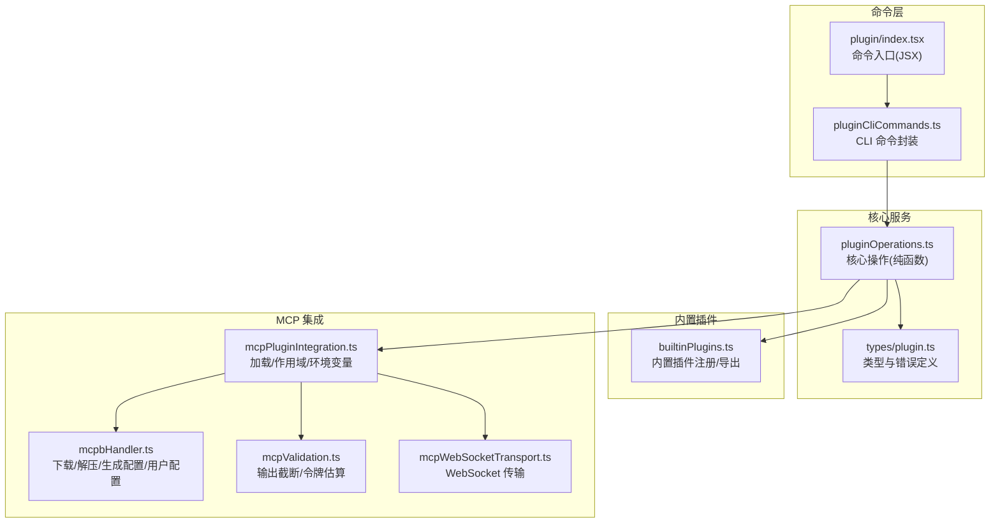
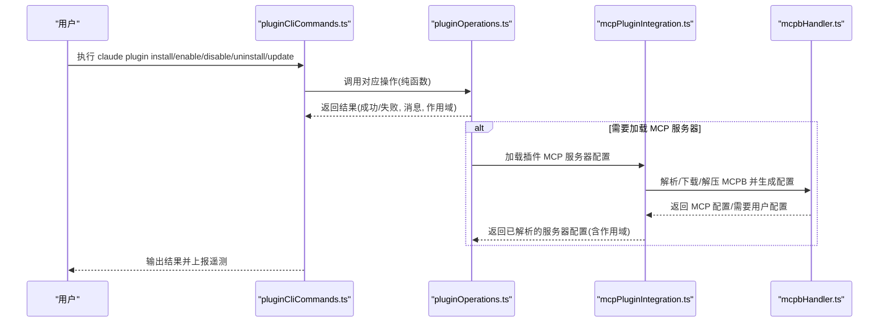
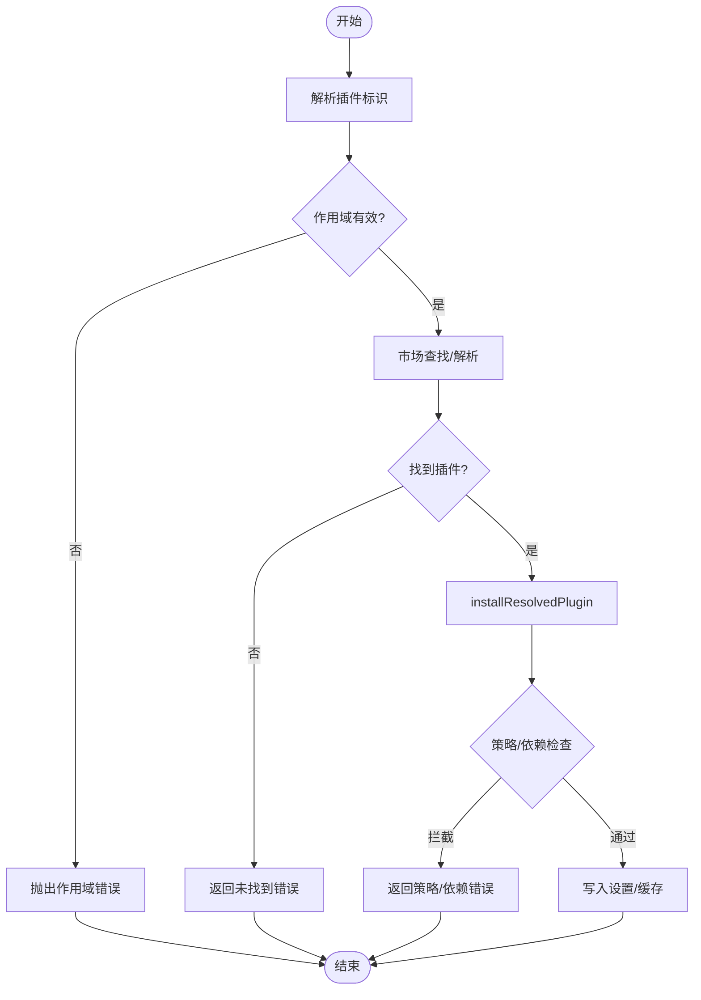
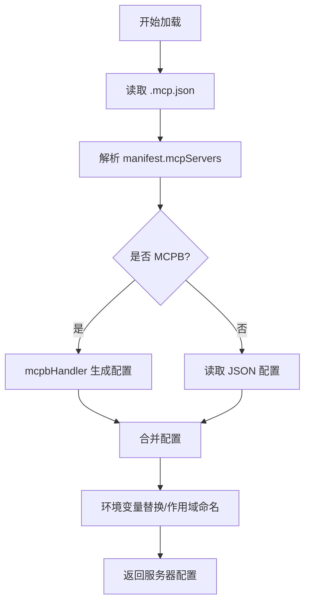
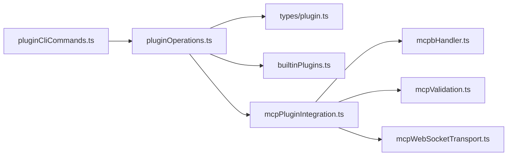

# 插件扩展命令

<cite>
**本文引用的文件**
- [src/commands/plugin/index.tsx](file://src/commands/plugin/index.tsx)
- [src/services/plugins/pluginCliCommands.ts](file://src/services/plugins/pluginCliCommands.ts)
- [src/services/plugins/pluginOperations.ts](file://src/services/plugins/pluginOperations.ts)
- [src/plugins/builtinPlugins.ts](file://src/plugins/builtinPlugins.ts)
- [src/types/plugin.ts](file://src/types/plugin.ts)
- [src/utils/plugins/mcpPluginIntegration.ts](file://src/utils/plugins/mcpPluginIntegration.ts)
- [src/utils/plugins/mcpbHandler.ts](file://src/utils/plugins/mcpbHandler.ts)
- [src/utils/mcpValidation.ts](file://src/utils/mcpValidation.ts)
- [src/utils/mcpWebSocketTransport.ts](file://src/utils/mcpWebSocketTransport.ts)
</cite>

## 目录
1. [简介](#简介)
2. [项目结构](#项目结构)
3. [核心组件](#核心组件)
4. [架构总览](#架构总览)
5. [详细组件分析](#详细组件分析)
6. [依赖关系分析](#依赖关系分析)
7. [性能考量](#性能考量)
8. [故障排查指南](#故障排查指南)
9. [结论](#结论)
10. [附录](#附录)

## 简介
本文件面向“插件扩展命令”的使用与开发，系统化阐述插件安装、技能管理、MCP 服务器配置与生命周期管理等能力。内容覆盖：
- 命令入口与交互：CLI 命令封装、错误处理与遥测上报
- 核心操作：安装、卸载、启用、禁用、批量禁用、更新
- 生命周期与权限：作用域解析、策略拦截、反向依赖提示
- MCP 集成：从插件清单加载服务器、环境变量替换、用户配置存储与校验、下载/解压 MCPB 包
- 技能与内置插件：内置插件注册、技能命令导出、UI 展示
- 最佳实践：架构设计、API 使用规范、安全与兼容性建议

## 项目结构
围绕插件扩展命令的关键模块分布如下：
- 命令入口与 UI：/src/commands/plugin/index.tsx 提供本地 JSX 命令入口，指向插件管理界面
- CLI 命令封装：/src/services/plugins/pluginCliCommands.ts 将核心操作包装为 CLI 可执行命令，并负责输出与退出码
- 核心业务逻辑：/src/services/plugins/pluginOperations.ts 实现纯函数式的核心操作，不直接写入控制台或调用进程退出
- 内置插件注册：/src/plugins/builtinPlugins.ts 管理随 CLI 发行的内置插件，支持启用/禁用与 UI 展示
- 类型定义：/src/types/plugin.ts 定义插件类型、错误类型与加载结果
- MCP 集成：/src/utils/plugins/mcpPluginIntegration.ts 负责从插件加载 MCP 服务器配置并进行环境变量替换与作用域命名
- MCPB 处理：/src/utils/plugins/mcpbHandler.ts 支持从 .mcpb/.dxt 下载、缓存、解压、生成 MCP 配置与用户配置读写
- MCP 工具：/src/utils/mcpValidation.ts 提供 MCP 输出截断与令牌估算；/src/utils/mcpWebSocketTransport.ts 提供 WebSocket 传输层

图表来源
- [src/commands/plugin/index.tsx:1-11](file://src/commands/plugin/index.tsx#L1-L11)
- [src/services/plugins/pluginCliCommands.ts:1-345](file://src/services/plugins/pluginCliCommands.ts#L1-L345)
- [src/services/plugins/pluginOperations.ts:1-800](file://src/services/plugins/pluginOperations.ts#L1-L800)
- [src/plugins/builtinPlugins.ts:1-160](file://src/plugins/builtinPlugins.ts#L1-L160)
- [src/types/plugin.ts:1-364](file://src/types/plugin.ts#L1-L364)
- [src/utils/plugins/mcpPluginIntegration.ts:1-635](file://src/utils/plugins/mcpPluginIntegration.ts#L1-L635)
- [src/utils/plugins/mcpbHandler.ts:1-969](file://src/utils/plugins/mcpbHandler.ts#L1-L969)
- [src/utils/mcpValidation.ts:1-209](file://src/utils/mcpValidation.ts#L1-L209)
- [src/utils/mcpWebSocketTransport.ts:1-201](file://src/utils/mcpWebSocketTransport.ts#L1-L201)

章节来源
- [src/commands/plugin/index.tsx:1-11](file://src/commands/plugin/index.tsx#L1-L11)
- [src/services/plugins/pluginCliCommands.ts:1-345](file://src/services/plugins/pluginCliCommands.ts#L1-L345)
- [src/services/plugins/pluginOperations.ts:1-800](file://src/services/plugins/pluginOperations.ts#L1-L800)
- [src/plugins/builtinPlugins.ts:1-160](file://src/plugins/builtinPlugins.ts#L1-L160)
- [src/types/plugin.ts:1-364](file://src/types/plugin.ts#L1-L364)
- [src/utils/plugins/mcpPluginIntegration.ts:1-635](file://src/utils/plugins/mcpPluginIntegration.ts#L1-L635)
- [src/utils/plugins/mcpbHandler.ts:1-969](file://src/utils/plugins/mcpbHandler.ts#L1-L969)
- [src/utils/mcpValidation.ts:1-209](file://src/utils/mcpValidation.ts#L1-L209)
- [src/utils/mcpWebSocketTransport.ts:1-201](file://src/utils/mcpWebSocketTransport.ts#L1-L201)

## 核心组件
- 命令入口与 UI
  - 通过本地 JSX 命令将插件管理界面作为可交互入口，便于在桌面端或终端内打开插件市场与管理面板
- CLI 命令封装
  - 提供 install、uninstall、enable、disable、disable-all、update 等命令，统一错误处理、日志与遥测上报
  - 对每个命令返回成功/失败状态，避免直接调用进程退出，便于上层复用
- 核心操作（纯函数）
  - installPluginOp、uninstallPluginOp、enablePluginOp、disablePluginOp、disableAllPluginsOp、updatePluginOp
  - 统一作用域校验、设置写入、缓存清理、依赖检查与回退策略
- 内置插件
  - 注册内置插件、按用户设置拆分启用/禁用列表、导出技能命令供 UI 展示
- MCP 集成
  - 从插件清单加载 MCP 服务器配置，支持 .mcp.json、manifest.mcpServers、MCPB 文件
  - 环境变量替换、作用域命名、用户配置合并与敏感信息安全存储
- MCPB 处理
  - 下载/缓存/解压 MCPB 包，生成 MCP 配置，处理首次配置与重新配置流程
- MCP 工具
  - 输出截断与令牌估算，WebSocket 传输抽象

章节来源
- [src/commands/plugin/index.tsx:1-11](file://src/commands/plugin/index.tsx#L1-L11)
- [src/services/plugins/pluginCliCommands.ts:1-345](file://src/services/plugins/pluginCliCommands.ts#L1-L345)
- [src/services/plugins/pluginOperations.ts:1-800](file://src/services/plugins/pluginOperations.ts#L1-L800)
- [src/plugins/builtinPlugins.ts:1-160](file://src/plugins/builtinPlugins.ts#L1-L160)
- [src/types/plugin.ts:1-364](file://src/types/plugin.ts#L1-L364)
- [src/utils/plugins/mcpPluginIntegration.ts:1-635](file://src/utils/plugins/mcpPluginIntegration.ts#L1-L635)
- [src/utils/plugins/mcpbHandler.ts:1-969](file://src/utils/plugins/mcpbHandler.ts#L1-L969)
- [src/utils/mcpValidation.ts:1-209](file://src/utils/mcpValidation.ts#L1-L209)
- [src/utils/mcpWebSocketTransport.ts:1-201](file://src/utils/mcpWebSocketTransport.ts#L1-L201)

## 架构总览
下图展示插件扩展命令从 CLI 到核心操作再到 MCP 集成的整体流程。

图表来源
- [src/services/plugins/pluginCliCommands.ts:103-146](file://src/services/plugins/pluginCliCommands.ts#L103-L146)
- [src/services/plugins/pluginOperations.ts:321-419](file://src/services/plugins/pluginOperations.ts#L321-L419)
- [src/utils/plugins/mcpPluginIntegration.ts:131-212](file://src/utils/plugins/mcpPluginIntegration.ts#L131-L212)
- [src/utils/plugins/mcpbHandler.ts:698-795](file://src/utils/plugins/mcpbHandler.ts#L698-L795)

## 详细组件分析

### 命令入口与交互
- 命令类型与别名：本地 JSX 命令，名称为 plugin，别名为 plugins、marketplace
- 立即加载：通过异步导入加载插件管理界面，确保启动时仅在触发时加载
- 适用场景：桌面端 UI、REPL 或终端内打开插件市场与管理面板

章节来源
- [src/commands/plugin/index.tsx:1-11](file://src/commands/plugin/index.tsx#L1-L11)

### CLI 命令封装（pluginCliCommands）
- 统一错误处理：handlePluginCommandError 记录错误、输出人类可读消息、上报遥测事件
- 成功/失败事件：安装/卸载/启用/禁用/更新均记录对应遥测事件，包含插件名、市场名、作用域、版本等字段
- 进程退出：所有命令在完成或失败后调用进程退出，避免阻塞上层流程
- 典型命令：
  - installPlugin：安装插件（支持 user/project/local 作用域）
  - uninstallPlugin：卸载插件（可选删除数据目录）
  - enablePlugin/disablePlugin：启用/禁用插件（可选指定作用域）
  - disableAllPlugins：批量禁用所有已启用插件
  - updatePluginCli：检查并更新插件（支持 user/project/local/managed）

章节来源
- [src/services/plugins/pluginCliCommands.ts:1-345](file://src/services/plugins/pluginCliCommands.ts#L1-L345)

### 核心操作（pluginOperations）
- 作用域与路径：
  - 有效安装作用域：user、project、local；更新作用域额外包含 managed
  - getProjectPathForScope 根据作用域返回项目路径
- 安装流程：
  - 解析插件标识（支持 name 或 name@marketplace）
  - 在已知市场中查找插件条目，调用 installResolvedPlugin 完成设置写入与缓存
  - 错误分类：本地源缺失、设置写入失败、解析失败、策略拦截、依赖被拦截
- 卸载流程：
  - 从已加载插件集合定位插件，检查 V2 安装记录，写入设置删除键，清理缓存与选项
  - 若为最后作用域，删除数据目录与插件选项
  - 检测反向依赖并给出警告
- 启用/禁用流程：
  - 内置插件走用户作用域设置路径
  - 普通插件根据设置自动推断最具体作用域，或由显式 --scope 指定
  - 策略拦截：组织策略阻止启用时直接拒绝
  - 跨作用域提示：当请求作用域与实际安装位置不一致时给出指引
  - 自动幂等：若当前状态已是目标状态则返回相应消息
- 批量禁用：
  - 遍历已启用插件逐个禁用，收集成功/失败统计

图表来源
- [src/services/plugins/pluginOperations.ts:321-419](file://src/services/plugins/pluginOperations.ts#L321-L419)
- [src/services/plugins/pluginOperations.ts:428-559](file://src/services/plugins/pluginOperations.ts#L428-L559)
- [src/services/plugins/pluginOperations.ts:574-748](file://src/services/plugins/pluginOperations.ts#L574-L748)
- [src/services/plugins/pluginOperations.ts:783-800](file://src/services/plugins/pluginOperations.ts#L783-L800)

章节来源
- [src/services/plugins/pluginOperations.ts:1-800](file://src/services/plugins/pluginOperations.ts#L1-L800)

### 内置插件（builtinPlugins）
- 注册与可用性：registerBuiltinPlugin 注册内置插件；按 isAvailable 过滤不可用插件
- 启用状态：优先读取用户设置，其次默认值，默认启用
- 导出技能命令：将启用的内置插件技能转换为命令对象，供 UI 展示与调用
- UI 展示：内置插件以 @builtin 标识区分于市场插件

章节来源
- [src/plugins/builtinPlugins.ts:1-160](file://src/plugins/builtinPlugins.ts#L1-L160)

### 类型与错误（types/plugin）
- LoadedPlugin：插件加载后的完整描述，包含 manifest、路径、启用状态、MCP/LSP/Hook 等组件
- PluginError：类型安全的错误类型集合，覆盖路径不存在、网络错误、清单解析/校验失败、MCP 配置无效、LSP 启动失败、策略拦截、依赖未满足等
- getPluginErrorMessage：将错误类型映射为人类可读消息，便于日志与 UI 显示

章节来源
- [src/types/plugin.ts:1-364](file://src/types/plugin.ts#L1-L364)

### MCP 服务器配置与加载（mcpPluginIntegration）
- 加载来源：
  - .mcp.json 文件（最低优先级）
  - manifest.mcpServers 字段（字符串/数组/对象）
  - MCPB 文件（.mcpb/.dxt），通过 mcpbHandler 生成配置
- 环境变量替换：
  - 支持 ${CLAUDE_PLUGIN_ROOT}、${CLAUDE_PLUGIN_DATA}、${user_config.X} 与通用环境变量
  - 缺失变量记录并上报错误
- 作用域命名：为避免冲突，将服务器名前缀为 plugin:{name}:{server}
- 用户配置：
  - 顶层 manifest.userConfig 与通道级 channels[].userConfig 合并
  - 保存时区分敏感/非敏感字段，分别写入 settings.json 与 secureStorage

图表来源
- [src/utils/plugins/mcpPluginIntegration.ts:131-212](file://src/utils/plugins/mcpPluginIntegration.ts#L131-L212)
- [src/utils/plugins/mcpPluginIntegration.ts:341-360](file://src/utils/plugins/mcpPluginIntegration.ts#L341-L360)
- [src/utils/plugins/mcpPluginIntegration.ts:465-582](file://src/utils/plugins/mcpPluginIntegration.ts#L465-L582)

章节来源
- [src/utils/plugins/mcpPluginIntegration.ts:1-635](file://src/utils/plugins/mcpPluginIntegration.ts#L1-L635)

### MCPB 处理（mcpbHandler）
- 缓存与变更检测：基于内容哈希与提取路径存在性判断是否需要重新下载/解压
- 下载与进度：支持超时、重定向、进度回调与遥测上报
- 解压与权限：保留可执行位，过滤目录条目，按文本/二进制写入
- 用户配置：
  - 首次配置：当 manifest.user_config 存在时，返回 needs-config 状态，引导用户在 UI 中填写
  - 重新配置：支持强制弹窗与验证错误提示
  - 保存：敏感字段写入 secureStorage，非敏感字段写入 settings.json，保证一致性

章节来源
- [src/utils/plugins/mcpbHandler.ts:1-969](file://src/utils/plugins/mcpbHandler.ts#L1-L969)

### MCP 工具与传输
- 输出截断与令牌估算：根据阈值与令牌估算决定是否截断，支持文本与图片块
- WebSocket 传输：抽象 Transport 接口，适配 Bun 与 Node 的 WebSocket 实现，统一事件处理与关闭清理

章节来源
- [src/utils/mcpValidation.ts:1-209](file://src/utils/mcpValidation.ts#L1-L209)
- [src/utils/mcpWebSocketTransport.ts:1-201](file://src/utils/mcpWebSocketTransport.ts#L1-L201)

## 依赖关系分析
- 命令层依赖核心服务：CLI 命令封装调用核心操作，核心操作不依赖 CLI 输出
- 核心服务依赖类型与工具：核心操作依赖类型定义与错误处理、设置读写、市场与安装管理、缓存与依赖解析
- MCP 集成依赖 MCPB 处理与工具：加载 MCP 服务器配置需解析 MCPB、替换环境变量、作用域命名
- 内置插件与核心服务：内置插件注册与技能导出由内置插件模块提供，核心服务在加载插件时识别内置插件

图表来源
- [src/services/plugins/pluginCliCommands.ts:1-345](file://src/services/plugins/pluginCliCommands.ts#L1-L345)
- [src/services/plugins/pluginOperations.ts:1-800](file://src/services/plugins/pluginOperations.ts#L1-L800)
- [src/types/plugin.ts:1-364](file://src/types/plugin.ts#L1-L364)
- [src/plugins/builtinPlugins.ts:1-160](file://src/plugins/builtinPlugins.ts#L1-L160)
- [src/utils/plugins/mcpPluginIntegration.ts:1-635](file://src/utils/plugins/mcpPluginIntegration.ts#L1-L635)
- [src/utils/plugins/mcpbHandler.ts:1-969](file://src/utils/plugins/mcpbHandler.ts#L1-L969)
- [src/utils/mcpValidation.ts:1-209](file://src/utils/mcpValidation.ts#L1-L209)
- [src/utils/mcpWebSocketTransport.ts:1-201](file://src/utils/mcpWebSocketTransport.ts#L1-L201)

章节来源
- [src/services/plugins/pluginCliCommands.ts:1-345](file://src/services/plugins/pluginCliCommands.ts#L1-L345)
- [src/services/plugins/pluginOperations.ts:1-800](file://src/services/plugins/pluginOperations.ts#L1-L800)
- [src/types/plugin.ts:1-364](file://src/types/plugin.ts#L1-L364)
- [src/plugins/builtinPlugins.ts:1-160](file://src/plugins/builtinPlugins.ts#L1-L160)
- [src/utils/plugins/mcpPluginIntegration.ts:1-635](file://src/utils/plugins/mcpPluginIntegration.ts#L1-L635)
- [src/utils/plugins/mcpbHandler.ts:1-969](file://src/utils/plugins/mcpbHandler.ts#L1-L969)
- [src/utils/mcpValidation.ts:1-209](file://src/utils/mcpValidation.ts#L1-L209)
- [src/utils/mcpWebSocketTransport.ts:1-201](file://src/utils/mcpWebSocketTransport.ts#L1-L201)

## 性能考量
- 并行加载：MCP 服务器配置加载采用 Promise.all 并行处理多个插件，提升启动速度
- 缓存与增量：MCPB 下载与解压使用缓存元数据，避免重复网络与磁盘 I/O；变更检测基于时间戳与内容哈希
- 截断策略：先做字符大小启发式检查，再进行精确令牌计数，减少不必要的 API 调用
- 传输优化：WebSocket 传输层统一事件处理与关闭清理，避免内存泄漏

## 故障排查指南
- 安装失败
  - 症状：返回“未找到插件”或“解析失败”
  - 排查：确认插件名与市场名格式；检查市场配置与网络连通性；查看策略拦截与依赖状态
- 启用失败
  - 症状：返回“被组织策略阻止”或“跨作用域冲突”
  - 排查：确认组织策略；使用 --scope 指定正确作用域；检查其他作用域是否已启用
- 卸载失败
  - 症状：提示“不在该作用域安装”或“存在反向依赖”
  - 排查：使用 --scope 指定实际安装作用域；查看依赖关系并按提示处理
- MCP 配置问题
  - 症状：MCP 服务器无法启动或报“缺少环境变量”
  - 排查：检查环境变量替换与用户配置；确认 .mcp.json 或 MCPB 配置有效性；查看日志中的缺失变量列表
- MCPB 下载/解压失败
  - 症状：下载超时、解压失败、manifest 校验失败
  - 排查：检查网络与权限；清理缓存后重试；确认 MCPB 来源可信

章节来源
- [src/services/plugins/pluginCliCommands.ts:48-96](file://src/services/plugins/pluginCliCommands.ts#L48-L96)
- [src/services/plugins/pluginOperations.ts:383-409](file://src/services/plugins/pluginOperations.ts#L383-L409)
- [src/utils/plugins/mcpPluginIntegration.ts:560-582](file://src/utils/plugins/mcpPluginIntegration.ts#L560-L582)
- [src/utils/plugins/mcpbHandler.ts:525-542](file://src/utils/plugins/mcpbHandler.ts#L525-L542)

## 结论
插件扩展命令体系以“纯函数核心 + CLI 封装 + 类型安全错误 + MCP 集成”为核心设计原则，既保证了 CLI 的易用性，又确保了插件生命周期管理的可控性与可观测性。通过内置插件注册、策略拦截、反向依赖提示与 MCPB 流程，系统在安全性、可维护性与可扩展性之间取得平衡。建议在生产环境中结合遥测与日志，持续监控安装/启用/更新成功率与 MCP 服务器健康度。

## 附录
- 最佳实践
  - 架构设计：将 CLI 与核心操作分离，核心操作保持纯函数，便于测试与复用
  - API 使用：统一错误处理与遥测上报，确保可观测性；对用户输入进行严格校验
  - 安全与兼容：遵循组织策略；对敏感配置进行安全存储；对依赖与版本进行兼容性检查
  - MCP 集成：优先使用 MCPB；提供清晰的用户配置 schema；完善环境变量替换与作用域命名
- 常用命令参考
  - 安装：claude plugin install <插件名或 name@marketplace> [--scope user|project|local]
  - 卸载：claude plugin uninstall <插件名或 name@marketplace> [--scope user|project|local]
  - 启用：claude plugin enable <插件名或 name@marketplace> [--scope user|project|local]
  - 禁用：claude plugin disable <插件名或 name@marketplace> [--scope user|project|local]
  - 批量禁用：claude plugin disable-all
  - 更新：claude plugin update <插件名或 name@marketplace> --scope user|project|local|managed