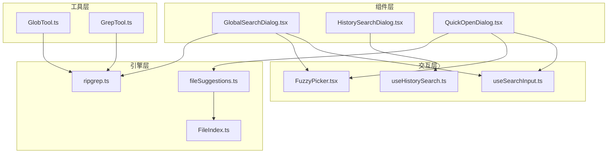
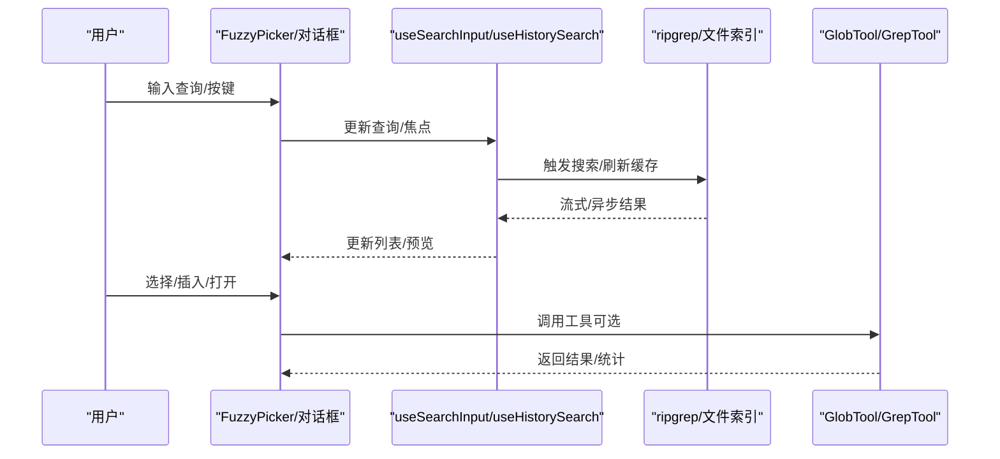
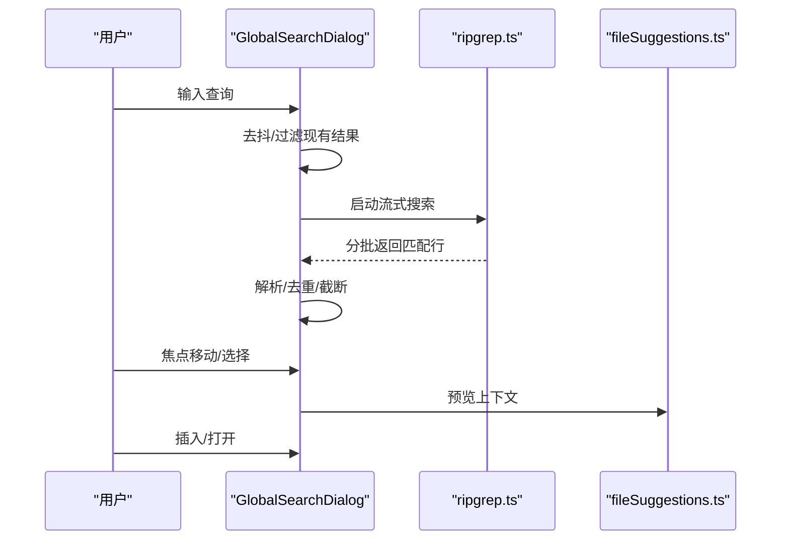
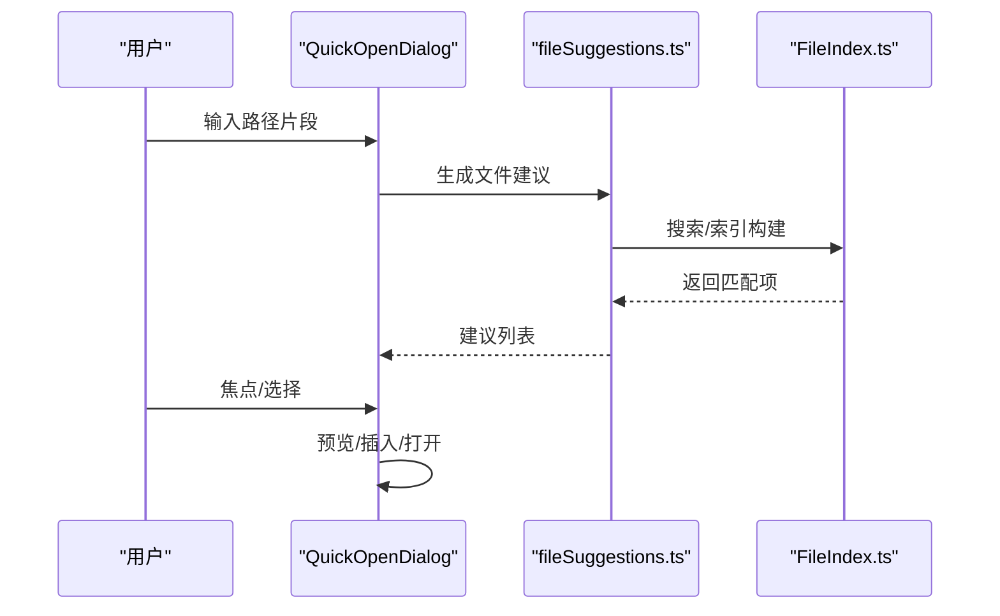
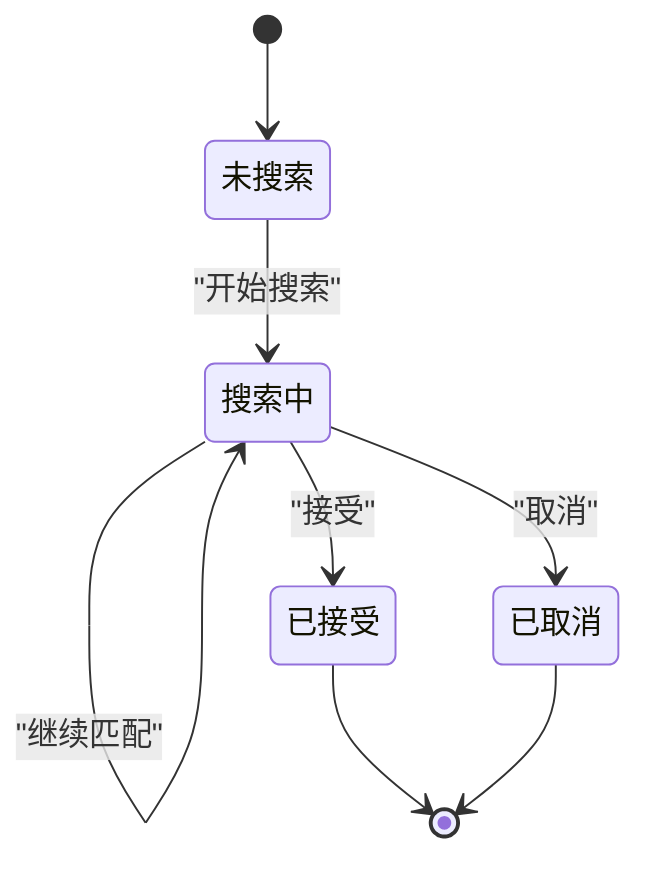
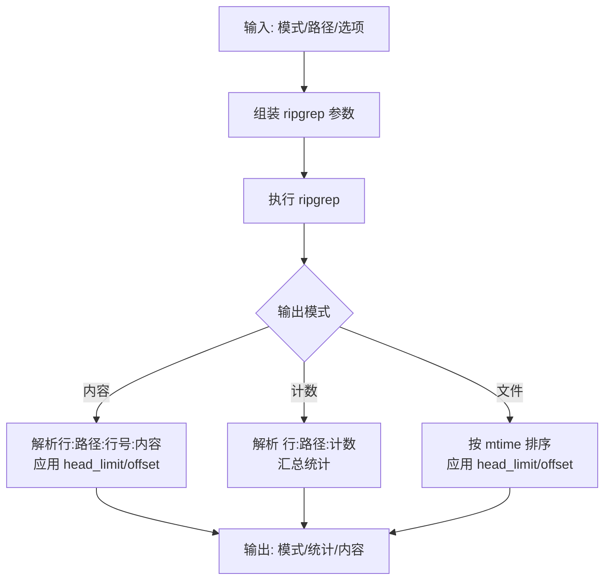
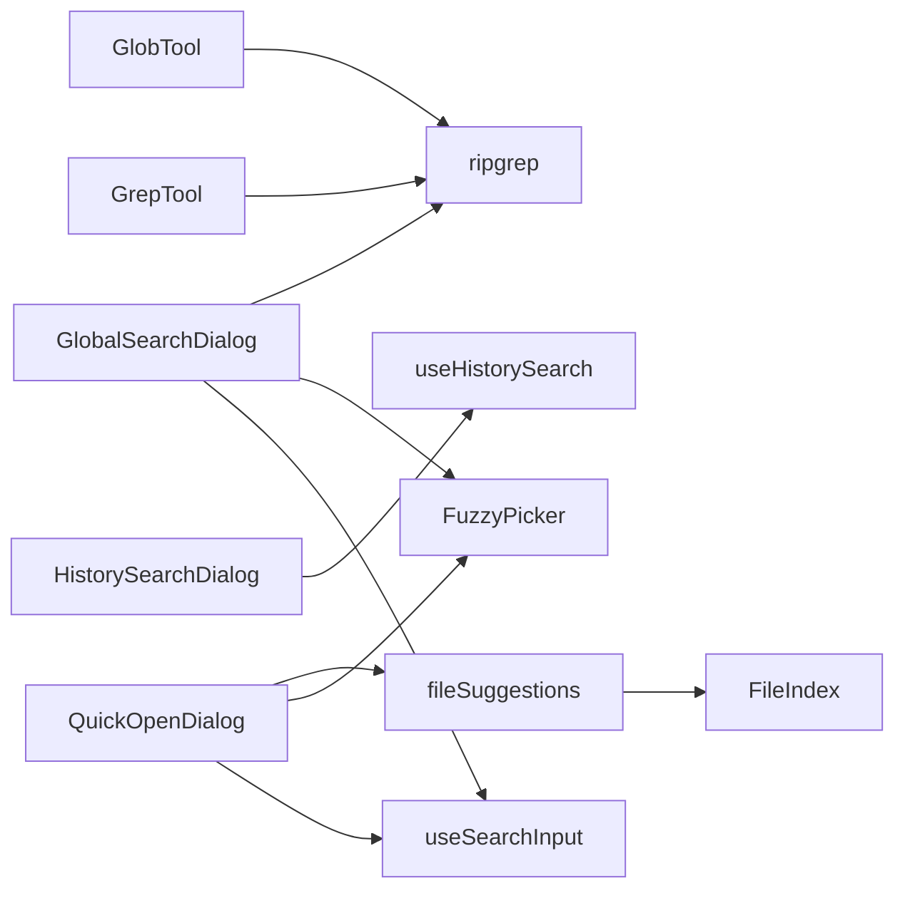

# 搜索导航命令

<cite>
**本文引用的文件**   
- [GlobalSearchDialog.tsx](file://src/components/GlobalSearchDialog.tsx)
- [HistorySearchDialog.tsx](file://src/components/HistorySearchDialog.tsx)
- [QuickOpenDialog.tsx](file://src/components/QuickOpenDialog.tsx)
- [useSearchInput.ts](file://src/hooks/useSearchInput.ts)
- [useHistorySearch.ts](file://src/hooks/useHistorySearch.ts)
- [fileSuggestions.ts](file://src/hooks/fileSuggestions.ts)
- [FuzzyPicker.tsx](file://src/components/design-system/FuzzyPicker.tsx)
- [ripgrep.ts](file://src/utils/ripgrep.ts)
- [GlobTool.ts](file://src/tools/GlobTool/GlobTool.ts)
- [GrepTool.ts](file://src/tools/GrepTool/GrepTool.ts)
- [search-and-navigation.mdx](file://docs/tools/search-and-navigation.mdx)
- [FileIndex.ts](file://src/native-ts/file-index/index.ts)
</cite>

## 目录
1. [简介](#简介)
2. [项目结构](#项目结构)
3. [核心组件](#核心组件)
4. [架构总览](#架构总览)
5. [详细组件分析](#详细组件分析)
6. [依赖关系分析](#依赖关系分析)
7. [性能考量](#性能考量)
8. [故障排查指南](#故障排查指南)
9. [结论](#结论)
10. [附录](#附录)

## 简介
本文件系统性梳理“搜索导航命令”的实现与使用方法，覆盖以下能力：
- 全局搜索：跨工作区文本检索，支持大小写不敏感、正则、上下文行数、行号显示等
- 历史搜索：在对话历史中模糊筛选，支持“继续匹配”“接受并提交”
- 文件路径导航：快速打开文件、插入路径或提及路径，支持预览与模糊匹配
- 工具层搜索：Glob 文件匹配、Grep 内容搜索，基于 ripgrep 的高性能引擎
- 输入与交互：统一的搜索输入钩子、键盘快捷键、终端尺寸自适应、预览渲染

## 项目结构
围绕搜索导航的关键模块如下：
- 组件层：全局搜索对话框、历史搜索对话框、快速打开对话框
- 交互层：通用搜索输入钩子、历史搜索钩子、模糊选择器
- 工具层：Glob 文件匹配、Grep 内容搜索
- 引擎层：ripgrep 封装、文件索引（TS 实现的 nucleo 风格模糊匹配）

图表来源
- [GlobalSearchDialog.tsx:1-343](file://src/components/GlobalSearchDialog.tsx#L1-L343)
- [HistorySearchDialog.tsx:1-118](file://src/components/HistorySearchDialog.tsx#L1-L118)
- [QuickOpenDialog.tsx:1-244](file://src/components/QuickOpenDialog.tsx#L1-L244)
- [useSearchInput.ts:1-365](file://src/hooks/useSearchInput.ts#L1-L365)
- [useHistorySearch.ts:1-304](file://src/hooks/useHistorySearch.ts#L1-L304)
- [FuzzyPicker.tsx:1-312](file://src/components/design-system/FuzzyPicker.tsx#L1-L312)
- [ripgrep.ts:1-680](file://src/utils/ripgrep.ts#L1-L680)
- [GlobTool.ts:1-199](file://src/tools/GlobTool/GlobTool.ts#L1-L199)
- [GrepTool.ts:1-578](file://src/tools/GrepTool/GrepTool.ts#L1-L578)
- [fileSuggestions.ts:1-813](file://src/hooks/fileSuggestions.ts#L1-L813)
- [FileIndex.ts:1-412](file://src/native-ts/file-index/index.ts#L1-L412)

章节来源
- [GlobalSearchDialog.tsx:1-343](file://src/components/GlobalSearchDialog.tsx#L1-L343)
- [QuickOpenDialog.tsx:1-244](file://src/components/QuickOpenDialog.tsx#L1-L244)
- [HistorySearchDialog.tsx:1-118](file://src/components/HistorySearchDialog.tsx#L1-L118)
- [useSearchInput.ts:1-365](file://src/hooks/useSearchInput.ts#L1-L365)
- [useHistorySearch.ts:1-304](file://src/hooks/useHistorySearch.ts#L1-L304)
- [FuzzyPicker.tsx:1-312](file://src/components/design-system/FuzzyPicker.tsx#L1-L312)
- [ripgrep.ts:1-680](file://src/utils/ripgrep.ts#L1-L680)
- [GlobTool.ts:1-199](file://src/tools/GlobTool/GlobTool.ts#L1-L199)
- [GrepTool.ts:1-578](file://src/tools/GrepTool/GrepTool.ts#L1-L578)
- [fileSuggestions.ts:1-813](file://src/hooks/fileSuggestions.ts#L1-L813)
- [FileIndex.ts:1-412](file://src/native-ts/file-index/index.ts#L1-L412)

## 核心组件
- 全局搜索对话框：基于 ripgrep 的流式搜索，支持去抖、截断提示、预览、插入/打开路径
- 历史搜索对话框：从历史记录中模糊筛选，支持“继续匹配”“接受并提交”
- 快速打开对话框：基于文件索引的模糊文件选择，支持预览与插入/打开
- 搜索输入钩子：统一的键盘事件处理、剪贴板环、光标移动、退格取消等
- 历史搜索钩子：在输入框内进行历史搜索，支持“下一个匹配”“接受”“取消”“执行”
- 模糊选择器：通用的列表选择 UI，支持上下导航、Tab/Shift+Tab 动作、预览
- ripgrep 封装：系统/内置/打包三种模式，错误恢复链（EAGAIN 单线程重试、超时截断、SIGKILL 升级）
- 工具层：GlobTool（文件名匹配）、GrepTool（内容搜索，支持大小写、类型、上下文、计数）

章节来源
- [GlobalSearchDialog.tsx:1-343](file://src/components/GlobalSearchDialog.tsx#L1-L343)
- [HistorySearchDialog.tsx:1-118](file://src/components/HistorySearchDialog.tsx#L1-L118)
- [QuickOpenDialog.tsx:1-244](file://src/components/QuickOpenDialog.tsx#L1-L244)
- [useSearchInput.ts:1-365](file://src/hooks/useSearchInput.ts#L1-L365)
- [useHistorySearch.ts:1-304](file://src/hooks/useHistorySearch.ts#L1-L304)
- [FuzzyPicker.tsx:1-312](file://src/components/design-system/FuzzyPicker.tsx#L1-L312)
- [ripgrep.ts:1-680](file://src/utils/ripgrep.ts#L1-L680)
- [GlobTool.ts:1-199](file://src/tools/GlobTool/GlobTool.ts#L1-L199)
- [GrepTool.ts:1-578](file://src/tools/GrepTool/GrepTool.ts#L1-L578)

## 架构总览
搜索导航由“输入/交互层”“UI 层”“工具层/引擎层”三层构成：
- 输入/交互层：统一键盘处理、历史搜索状态机、终端尺寸感知
- UI 层：模糊选择器、搜索框、预览面板
- 工具层/引擎层：ripgrep、文件索引、Glob/Grep 工具

图表来源
- [FuzzyPicker.tsx:1-312](file://src/components/design-system/FuzzyPicker.tsx#L1-L312)
- [useSearchInput.ts:1-365](file://src/hooks/useSearchInput.ts#L1-L365)
- [useHistorySearch.ts:1-304](file://src/hooks/useHistorySearch.ts#L1-L304)
- [ripgrep.ts:1-680](file://src/utils/ripgrep.ts#L1-L680)
- [GlobTool.ts:1-199](file://src/tools/GlobTool/GlobTool.ts#L1-L199)
- [GrepTool.ts:1-578](file://src/tools/GrepTool/GrepTool.ts#L1-L578)

## 详细组件分析

### 全局搜索对话框（GlobalSearchDialog）
- 功能要点
  - 去抖搜索：输入变更触发去抖，避免频繁调用 ripgrep
  - 流式解析：使用 ripgrep 的流式输出，边收集边更新结果
  - 结果上限：按文件限制每文件匹配数，按总数限制总结果，超过则截断
  - 预览：聚焦某条匹配时读取上下文行进行高亮预览
  - 插入/打开：支持插入“路径:行号”或“@路径#L行号”提及格式，或直接打开编辑器
  - 解析：解析 ripgrep 输出行（兼容 Windows 盘符），相对路径展示
- 关键参数
  - 去抖间隔、每文件最大匹配数、总匹配上限、预览上下文行数
- 性能与体验
  - 通过 AbortController 支持提前终止
  - 预览懒加载，聚焦项变更时再读取文件片段

图表来源
- [GlobalSearchDialog.tsx:1-343](file://src/components/GlobalSearchDialog.tsx#L1-L343)
- [ripgrep.ts:295-343](file://src/utils/ripgrep.ts#L295-L343)
- [fileSuggestions.ts:716-785](file://src/hooks/fileSuggestions.ts#L716-L785)

章节来源
- [GlobalSearchDialog.tsx:1-343](file://src/components/GlobalSearchDialog.tsx#L1-L343)
- [ripgrep.ts:1-680](file://src/utils/ripgrep.ts#L1-L680)
- [fileSuggestions.ts:1-813](file://src/hooks/fileSuggestions.ts#L1-L813)

### 历史搜索对话框（HistorySearchDialog）
- 功能要点
  - 从历史记录生成时间戳化条目，去重并按时间排序
  - 模糊匹配：包含匹配优先，子序列匹配次之
  - 预览：对历史内容进行换行包装，支持“更多行”提示
  - 交互：选择后立即解析并回调，支持“使用/接受并提交”
- 关键参数
  - 预览行数、年龄宽度、最大历史条目数
- 交互模型
  - 通过 useSearchInput 的搜索框输入，FuzzyPicker 渲染列表与预览

图表来源
- [HistorySearchDialog.tsx:1-118](file://src/components/HistorySearchDialog.tsx#L1-L118)

章节来源
- [HistorySearchDialog.tsx:1-118](file://src/components/HistorySearchDialog.tsx#L1-L118)

### 快速打开对话框（QuickOpenDialog）
- 功能要点
  - 基于文件索引的模糊匹配，支持目录与文件混合
  - 预览：读取文件前若干行，支持高亮与截断
  - 插入/打开：支持插入路径或提及路径，或直接打开编辑器
- 关键流程
  - 输入变更触发文件建议生成，过滤非目录项，转为斜杠分隔路径
  - 焦点变更时异步读取文件片段用于预览

图表来源
- [QuickOpenDialog.tsx:1-244](file://src/components/QuickOpenDialog.tsx#L1-L244)
- [fileSuggestions.ts:716-785](file://src/hooks/fileSuggestions.ts#L716-L785)
- [FileIndex.ts:1-412](file://src/native-ts/file-index/index.ts#L1-L412)

章节来源
- [QuickOpenDialog.tsx:1-244](file://src/components/QuickOpenDialog.tsx#L1-L244)
- [fileSuggestions.ts:1-813](file://src/hooks/fileSuggestions.ts#L1-L813)
- [FileIndex.ts:1-412](file://src/native-ts/file-index/index.ts#L1-L412)

### 搜索输入与历史搜索钩子
- useSearchInput
  - 统一键盘事件处理：方向键、Home/End、Ctrl+X/Y/W、Meta+Backspace 等
  - 支持“空查询退格即退出”行为开关
  - 提供查询设置、光标偏移、输入回调
- useHistorySearch
  - 在输入框内进行历史搜索的状态机：开始/继续/接受/取消/执行
  - 通过 makeHistoryReader 逆序扫描历史，支持中断与恢复
  - 与 keybindings 集成，支持“下一个匹配”“接受”等动作

图表来源
- [useHistorySearch.ts:1-304](file://src/hooks/useHistorySearch.ts#L1-L304)

章节来源
- [useSearchInput.ts:1-365](file://src/hooks/useSearchInput.ts#L1-L365)
- [useHistorySearch.ts:1-304](file://src/hooks/useHistorySearch.ts#L1-L304)

### 模糊选择器（FuzzyPicker）
- 统一的列表选择 UI，支持：
  - 方向键/快捷键导航
  - Tab/Shift+Tab 动作（插入/提及）
  - 预览面板（右侧/底部）
  - 匹配数量提示、空状态消息
- 与各对话框配合，提供一致的交互体验

章节来源
- [FuzzyPicker.tsx:1-312](file://src/components/design-system/FuzzyPicker.tsx#L1-L312)

### 工具层：Glob 与 Grep
- GlobTool
  - 基于 ripgrep 的文件名匹配，支持 glob 过滤
  - 输出文件名数组、耗时、数量、截断标志
- GrepTool
  - 基于 ripgrep 的内容搜索，支持：
    - 正则/大小写不敏感/类型过滤
    - 上下文行数（-B/-A/-C）
    - 计数模式与文件列表模式
    - head_limit/offset 分页控制
  - 结果按修改时间排序（文件列表模式）

图表来源
- [GlobTool.ts:1-199](file://src/tools/GlobTool/GlobTool.ts#L1-L199)
- [GrepTool.ts:1-578](file://src/tools/GrepTool/GrepTool.ts#L1-L578)
- [ripgrep.ts:1-680](file://src/utils/ripgrep.ts#L1-L680)

章节来源
- [GlobTool.ts:1-199](file://src/tools/GlobTool/GlobTool.ts#L1-L199)
- [GrepTool.ts:1-578](file://src/tools/GrepTool/GrepTool.ts#L1-L578)
- [ripgrep.ts:1-680](file://src/utils/ripgrep.ts#L1-L680)

## 依赖关系分析
- GlobalSearchDialog 依赖 ripgrep 流式接口与解析器
- QuickOpenDialog 依赖文件建议与文件索引
- HistorySearchDialog 依赖历史读取器与模糊匹配
- useSearchInput/useHistorySearch 为各对话框提供统一交互
- FuzzyPicker 为 UI 交互提供基础组件
- GrepTool/GlobTool 作为工具层封装 ripgrep

图表来源
- [GlobalSearchDialog.tsx:1-343](file://src/components/GlobalSearchDialog.tsx#L1-L343)
- [QuickOpenDialog.tsx:1-244](file://src/components/QuickOpenDialog.tsx#L1-L244)
- [HistorySearchDialog.tsx:1-118](file://src/components/HistorySearchDialog.tsx#L1-L118)
- [useSearchInput.ts:1-365](file://src/hooks/useSearchInput.ts#L1-L365)
- [useHistorySearch.ts:1-304](file://src/hooks/useHistorySearch.ts#L1-L304)
- [FuzzyPicker.tsx:1-312](file://src/components/design-system/FuzzyPicker.tsx#L1-L312)
- [ripgrep.ts:1-680](file://src/utils/ripgrep.ts#L1-L680)
- [GlobTool.ts:1-199](file://src/tools/GlobTool/GlobTool.ts#L1-L199)
- [GrepTool.ts:1-578](file://src/tools/GrepTool/GrepTool.ts#L1-L578)
- [fileSuggestions.ts:1-813](file://src/hooks/fileSuggestions.ts#L1-L813)
- [FileIndex.ts:1-412](file://src/native-ts/file-index/index.ts#L1-L412)

章节来源
- [GlobalSearchDialog.tsx:1-343](file://src/components/GlobalSearchDialog.tsx#L1-L343)
- [QuickOpenDialog.tsx:1-244](file://src/components/QuickOpenDialog.tsx#L1-L244)
- [HistorySearchDialog.tsx:1-118](file://src/components/HistorySearchDialog.tsx#L1-L118)
- [useSearchInput.ts:1-365](file://src/hooks/useSearchInput.ts#L1-L365)
- [useHistorySearch.ts:1-304](file://src/hooks/useHistorySearch.ts#L1-L304)
- [FuzzyPicker.tsx:1-312](file://src/components/design-system/FuzzyPicker.tsx#L1-L312)
- [ripgrep.ts:1-680](file://src/utils/ripgrep.ts#L1-L680)
- [GlobTool.ts:1-199](file://src/tools/GlobTool/GlobTool.ts#L1-L199)
- [GrepTool.ts:1-578](file://src/tools/GrepTool/GrepTool.ts#L1-L578)
- [fileSuggestions.ts:1-813](file://src/hooks/fileSuggestions.ts#L1-L813)
- [FileIndex.ts:1-412](file://src/native-ts/file-index/index.ts#L1-L412)

## 性能考量
- ripgrep 降级策略与错误恢复
  - 系统/内置/打包三种模式自动选择
  - EAGAIN 自动单线程重试；超时返回部分结果；缓冲区溢出截断；SIGTERM 5s 后 SIGKILL
- 文件索引与缓存
  - FileIndex 基于 nucleo 风格评分，支持异步增量构建与进度提示
  - 背景刷新与签名缓存，避免频繁重建
- UI 交互
  - 去抖、预览懒加载、可见项裁剪、终端尺寸自适应
- 工具层限制
  - GrepTool 默认 head_limit 控制上下文占用，避免大结果集污染上下文

章节来源
- [ripgrep.ts:1-680](file://src/utils/ripgrep.ts#L1-L680)
- [FileIndex.ts:1-412](file://src/native-ts/file-index/index.ts#L1-L412)
- [GlobalSearchDialog.tsx:1-343](file://src/components/GlobalSearchDialog.tsx#L1-L343)
- [QuickOpenDialog.tsx:1-244](file://src/components/QuickOpenDialog.tsx#L1-L244)
- [GrepTool.ts:1-578](file://src/tools/GrepTool/GrepTool.ts#L1-L578)

## 故障排查指南
- ripgrep 不可用或失败
  - 检查模式与路径：通过状态接口确认当前模式与路径
  - 系统模式：确保 PATH 中存在 rg，避免路径劫持
  - 内置/打包模式：macOS 需要签名与移除隔离属性
  - 错误恢复：EAGAIN 自动单线程重试；超时/溢出返回部分结果；必要时升级信号
- 搜索无结果或过慢
  - 使用更具体的路径/模式；启用类型过滤；限制 head_limit
  - 对大仓库使用 GrepTool 的计数模式先评估规模
- 历史搜索卡顿
  - 确认历史读取器未被阻塞；必要时取消并重新开始
- 预览不可用
  - 文件过大或权限问题；检查读取范围与信号中断

章节来源
- [ripgrep.ts:1-680](file://src/utils/ripgrep.ts#L1-L680)
- [GrepTool.ts:1-578](file://src/tools/GrepTool/GrepTool.ts#L1-L578)
- [HistorySearchDialog.tsx:1-118](file://src/components/HistorySearchDialog.tsx#L1-L118)
- [GlobalSearchDialog.tsx:1-343](file://src/components/GlobalSearchDialog.tsx#L1-L343)

## 结论
搜索导航命令通过统一的交互层、强大的 ripgrep 引擎与高效的文件索引，实现了：
- 快速、可分页、可预览的全局文本搜索
- 高效的历史检索与继续匹配
- 便捷的文件路径导航与插入/打开
- 工具层的 Glob/Grep 能力，满足从文件名到内容的多维搜索需求

## 附录

### 使用指南与最佳实践
- 全局搜索
  - 使用大小写不敏感搜索（-i）提升召回；结合上下文（-C/-B/-A）定位上下文
  - 限定搜索范围（路径/类型）减少噪声；必要时使用 head_limit 控制输出
- 历史搜索
  - 使用“继续匹配”在当前输入基础上推进；“接受并提交”直接完成输入
- 快速打开
  - 使用模糊匹配快速定位文件；利用预览确认路径正确性
- 工具层
  - GlobTool：适合文件名筛选；GrepTool：适合内容检索，支持正则、大小写、类型、上下文、计数

章节来源
- [search-and-navigation.mdx:1-156](file://docs/tools/search-and-navigation.mdx#L1-L156)
- [GlobTool.ts:1-199](file://src/tools/GlobTool/GlobTool.ts#L1-L199)
- [GrepTool.ts:1-578](file://src/tools/GrepTool/GrepTool.ts#L1-L578)