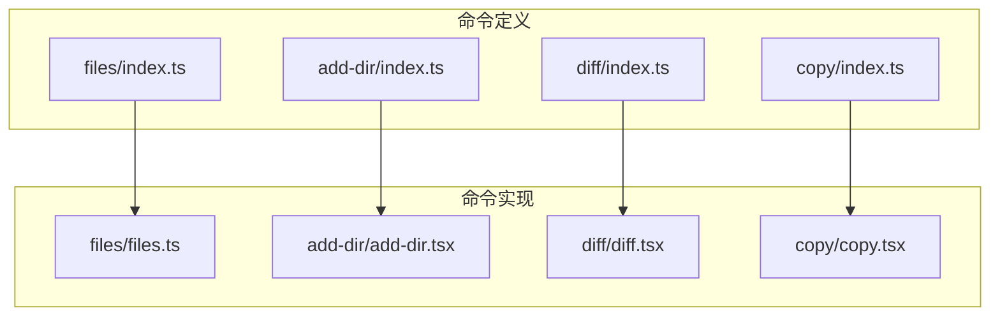
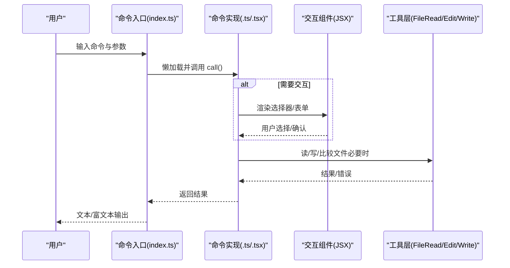
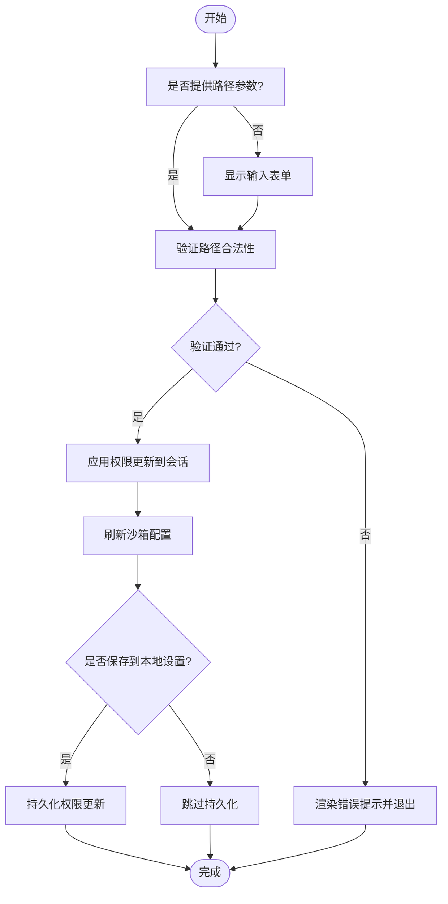
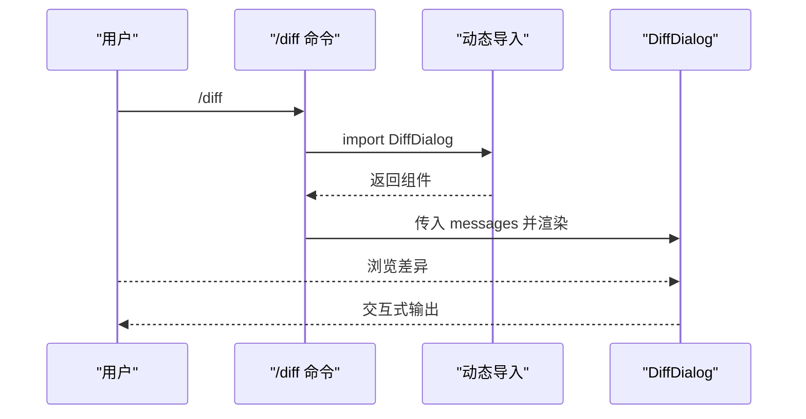
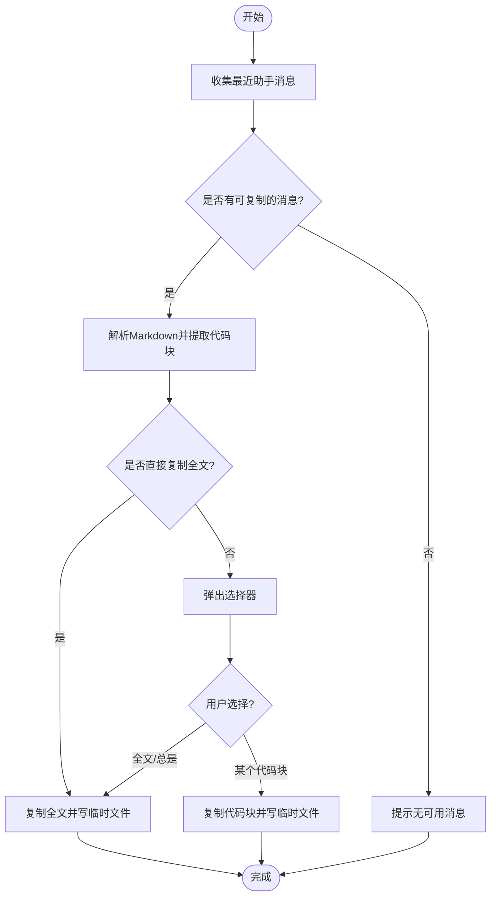
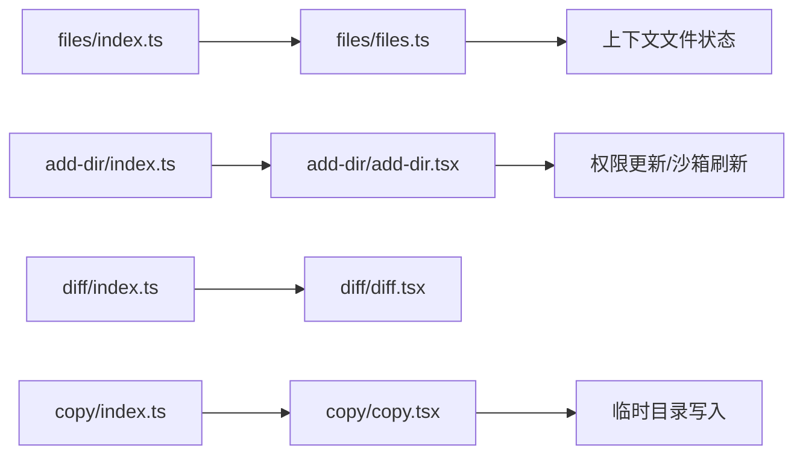

# 文件操作命令

<cite>
**本文引用的文件**
- [src/commands/files/index.ts](file://src/commands/files/index.ts)
- [src/commands/files/files.ts](file://src/commands/files/files.ts)
- [src/commands/add-dir/index.ts](file://src/commands/add-dir/index.ts)
- [src/commands/add-dir/add-dir.tsx](file://src/commands/add-dir/add-dir.tsx)
- [src/commands/diff/index.ts](file://src/commands/diff/index.ts)
- [src/commands/diff/diff.tsx](file://src/commands/diff/diff.tsx)
- [src/commands/copy/index.ts](file://src/commands/copy/index.ts)
- [src/commands/copy/copy.tsx](file://src/commands/copy/copy.tsx)
- [docs/tools/file-operations.mdx](file://docs/tools/file-operations.mdx)
</cite>

## 目录
1. [简介](#简介)
2. [项目结构](#项目结构)
3. [核心组件](#核心组件)
4. [架构总览](#架构总览)
5. [详细组件分析](#详细组件分析)
6. [依赖关系分析](#依赖关系分析)
7. [性能考量](#性能考量)
8. [故障排查指南](#故障排查指南)
9. [结论](#结论)
10. [附录](#附录)

## 简介
本文件面向“文件操作命令”的使用者与维护者，系统梳理以下命令的能力、参数、交互方式、输出格式与最佳实践：文件浏览命令（files）、目录添加命令（add-dir）、文件差异查看命令（diff）、文件复制命令（copy）。文档同时结合现有工具层实现（FileRead/ FileEdit/ FileWrite）的安全机制与错误处理策略，帮助读者在复杂工程中安全、高效地进行文件相关操作。

## 项目结构
这些命令位于 src/commands 下的独立子目录中，并通过 index.ts 暴露元数据与懒加载入口；部分命令以 JSX 组件形式提供交互界面。

图表来源
- [src/commands/files/index.ts:1-13](file://src/commands/files/index.ts#L1-L13)
- [src/commands/add-dir/index.ts:1-12](file://src/commands/add-dir/index.ts#L1-L12)
- [src/commands/diff/index.ts:1-9](file://src/commands/diff/index.ts#L1-L9)
- [src/commands/copy/index.ts:1-16](file://src/commands/copy/index.ts#L1-L16)

章节来源
- [src/commands/files/index.ts:1-13](file://src/commands/files/index.ts#L1-L13)
- [src/commands/add-dir/index.ts:1-12](file://src/commands/add-dir/index.ts#L1-L12)
- [src/commands/diff/index.ts:1-9](file://src/commands/diff/index.ts#L1-L9)
- [src/commands/copy/index.ts:1-16](file://src/commands/copy/index.ts#L1-L16)

## 核心组件
- files：列出当前上下文中已读取的文件清单，用于快速确认 AI 已感知的文件范围。
- add-dir：将指定路径加入工作目录，支持本次会话或持久化保存，并刷新沙箱配置以便后续命令访问。
- diff：打开差异对话框，展示未提交变更与按轮次（turn）的变更对比。
- copy：将 Claude 最近一次回复（或第 N 次回复）的内容复制到剪贴板，并可选落盘到临时目录，支持选择代码块或全文。

章节来源
- [src/commands/files/files.ts:1-20](file://src/commands/files/files.ts#L1-L20)
- [src/commands/add-dir/add-dir.tsx:65-126](file://src/commands/add-dir/add-dir.tsx#L65-L126)
- [src/commands/diff/diff.tsx:1-9](file://src/commands/diff/diff.tsx#L1-L9)
- [src/commands/copy/copy.tsx:334-371](file://src/commands/copy/copy.tsx#L334-L371)

## 架构总览
命令层负责解析用户输入、组织上下文、触发 UI 或工具层逻辑；工具层（FileRead/ FileEdit/ FileWrite）负责文件系统读写、权限校验、历史快照与安全防护。

图表来源
- [src/commands/files/index.ts:1-13](file://src/commands/files/index.ts#L1-L13)
- [src/commands/files/files.ts:7-20](file://src/commands/files/files.ts#L7-L20)
- [src/commands/add-dir/add-dir.tsx:65-126](file://src/commands/add-dir/add-dir.tsx#L65-L126)
- [src/commands/diff/diff.tsx:3-8](file://src/commands/diff/diff.tsx#L3-L8)
- [src/commands/copy/copy.tsx:334-371](file://src/commands/copy/copy.tsx#L334-L371)
- [docs/tools/file-operations.mdx:23-221](file://docs/tools/file-operations.mdx#L23-L221)

## 详细组件分析

### 文件浏览命令（files）
- 功能概述
  - 列出当前上下文中已读取的文件路径（相对工作目录）。
- 参数与行为
  - 无参数。若上下文为空，返回提示信息。
- 输出格式
  - 文本：包含“Files in context:”前缀与换行分隔的文件列表。
- 使用场景
  - 在执行编辑/写入前，确认 AI 已感知哪些文件。
- 实现要点
  - 依赖上下文中的文件读取状态缓存键集合，映射到相对路径后拼接输出。
- 最佳实践
  - 若需要新增文件，请先通过 add-dir 将其所在目录加入工作空间，再进行读取。
  - 对于大仓库，建议配合过滤策略（例如仅读取特定目录或扩展名）减少上下文规模。

章节来源
- [src/commands/files/index.ts:3-10](file://src/commands/files/index.ts#L3-L10)
- [src/commands/files/files.ts:7-20](file://src/commands/files/files.ts#L7-L20)

### 目录添加命令（add-dir）
- 功能概述
  - 将指定路径加入工作目录，支持本次会话或持久化保存，并刷新沙箱配置。
- 参数与行为
  - 参数：<path>（可选）。若省略，弹出交互式输入表单。
  - 交互流程：校验路径合法性 → 展示确认界面 → 应用权限更新 → 刷新沙箱配置 → 可选持久化到本地设置。
- 输出格式
  - 文本提示，包含成功消息与后续管理指令提示。
- 使用场景
  - 新增工作目录以供后续文件读取/编辑使用。
- 安全与权限
  - 通过权限上下文与沙箱适配器控制访问范围，避免越权访问。
- 错误处理
  - 校验失败时渲染错误组件并引导用户修正。
- 最佳实践
  - 优先使用交互式表单，便于确认路径与权限范围。
  - 对于长期使用的目录，建议持久化保存，避免重启后丢失。

图表来源
- [src/commands/add-dir/add-dir.tsx:65-126](file://src/commands/add-dir/add-dir.tsx#L65-L126)

章节来源
- [src/commands/add-dir/index.ts:3-9](file://src/commands/add-dir/index.ts#L3-L9)
- [src/commands/add-dir/add-dir.tsx:65-126](file://src/commands/add-dir/add-dir.tsx#L65-L126)

### 文件差异查看命令（diff）
- 功能概述
  - 打开差异对话框，展示未提交变更与按轮次（turn）的变更对比。
- 参数与行为
  - 无参数。内部动态导入差异组件并传入消息上下文。
- 输出格式
  - 交互式对话框（JSX），支持键盘导航与确认。
- 使用场景
  - 查看当前工作区的改动、回溯某一轮对话引起的变更。
- 最佳实践
  - 在执行写入前先用 diff 确认预期变更范围，避免误改。

图表来源
- [src/commands/diff/index.ts:3-8](file://src/commands/diff/index.ts#L3-L8)
- [src/commands/diff/diff.tsx:3-8](file://src/commands/diff/diff.tsx#L3-L8)

章节来源
- [src/commands/diff/index.ts:3-8](file://src/commands/diff/index.ts#L3-L8)
- [src/commands/diff/diff.tsx:1-9](file://src/commands/diff/diff.tsx#L1-L9)

### 文件复制命令（copy）
- 功能概述
  - 将 Claude 最近一次回复（或第 N 次回复）复制到剪贴板，并可选落盘到临时目录；支持选择代码块或全文。
- 参数与行为
  - 可选参数：[N]（第 N 次回复，1 表示最新）。若省略则根据配置与内容决定是否弹出选择器。
  - 交互流程：收集最近助手消息 → 解析 Markdown → 提取代码块 → 根据配置/选择决定复制或写文件。
- 输出格式
  - 文本提示，包含字符数/行数统计与落盘路径（若写入成功）。
- 使用场景
  - 快速复制代码片段或全文到剪贴板；或将内容保存到临时文件以便进一步处理。
- 安全与错误处理
  - 语言标识清洗，防止路径穿越；写入失败时返回错误信息；剪贴板不可用时仍可写文件作为后备。
- 最佳实践
  - 对包含敏感信息的回复，优先使用写文件模式并在完成后清理临时文件。
  - 使用快捷键 w 可直接将当前选中代码块写入文件，提升批量处理效率。

图表来源
- [src/commands/copy/copy.tsx:334-371](file://src/commands/copy/copy.tsx#L334-L371)
- [src/commands/copy/copy.tsx:50-61](file://src/commands/copy/copy.tsx#L50-L61)
- [src/commands/copy/copy.tsx:30-43](file://src/commands/copy/copy.tsx#L30-L43)
- [src/commands/copy/copy.tsx:73-94](file://src/commands/copy/copy.tsx#L73-L94)

章节来源
- [src/commands/copy/index.ts:7-13](file://src/commands/copy/index.ts#L7-L13)
- [src/commands/copy/copy.tsx:334-371](file://src/commands/copy/copy.tsx#L334-L371)

## 依赖关系分析
- 命令定义与实现分离：index.ts 仅声明元数据与懒加载，具体逻辑在 .ts/.tsx 中实现，降低启动时延。
- 交互式命令依赖 UI 组件：add-dir 与 copy 均通过 JSX 组件提供交互体验。
- 工具层安全机制：文件读写工具具备严格的输入校验、权限检查、历史快照与 LSP 通知链路，可作为命令层的安全基线参考。

图表来源
- [src/commands/files/index.ts:1-13](file://src/commands/files/index.ts#L1-L13)
- [src/commands/files/files.ts:1-20](file://src/commands/files/files.ts#L1-L20)
- [src/commands/add-dir/index.ts:1-12](file://src/commands/add-dir/index.ts#L1-L12)
- [src/commands/add-dir/add-dir.tsx:1-126](file://src/commands/add-dir/add-dir.tsx#L1-L126)
- [src/commands/diff/index.ts:1-9](file://src/commands/diff/index.ts#L1-L9)
- [src/commands/diff/diff.tsx:1-9](file://src/commands/diff/diff.tsx#L1-L9)
- [src/commands/copy/index.ts:1-16](file://src/commands/copy/index.ts#L1-L16)
- [src/commands/copy/copy.tsx:1-371](file://src/commands/copy/copy.tsx#L1-L371)

章节来源
- [src/commands/files/index.ts:1-13](file://src/commands/files/index.ts#L1-L13)
- [src/commands/add-dir/index.ts:1-12](file://src/commands/add-dir/index.ts#L1-L12)
- [src/commands/diff/index.ts:1-9](file://src/commands/diff/index.ts#L1-L9)
- [src/commands/copy/index.ts:1-16](file://src/commands/copy/index.ts#L1-L16)

## 性能考量
- 懒加载与启动时延：命令通过 import 动态加载实现文件，避免一次性初始化所有命令。
- 交互式命令的渲染优化：JSX 组件采用受控渲染与最小化更新策略，减少不必要的重绘。
- 文件读取与写入的 I/O 优化：工具层具备去重与缓存、原子写入与历史快照，降低重复 I/O 与并发冲突风险。
- 建议
  - 在大型仓库中，优先限定工作目录与文件类型，减少上下文规模。
  - 批量复制/写入时，尽量使用“总是复制全文”配置以减少交互成本。

## 故障排查指南
- files 无输出
  - 检查是否已通过读取工具或命令将文件加入上下文；若无文件，返回“上下文为空”的提示。
- add-dir 校验失败
  - 确认路径存在且在允许范围内；若为交互式，检查输入是否符合要求；必要时使用 /permissions 管理权限。
- diff 无法打开
  - 确认消息上下文有效；若组件未加载，尝试重新触发命令。
- copy 无法复制
  - 检查剪贴板支持情况；若失败，内容仍会写入临时目录；核对临时目录权限与磁盘空间。
- 工具层安全限制
  - 参考工具层文档中的安全机制与错误处理策略，确保输入合法、权限正确、路径安全。

章节来源
- [src/commands/files/files.ts:13-15](file://src/commands/files/files.ts#L13-L15)
- [src/commands/add-dir/add-dir.tsx:117-121](file://src/commands/add-dir/add-dir.tsx#L117-L121)
- [src/commands/diff/diff.tsx:3-8](file://src/commands/diff/diff.tsx#L3-L8)
- [src/commands/copy/copy.tsx:81-94](file://src/commands/copy/copy.tsx#L81-L94)
- [docs/tools/file-operations.mdx:72-81](file://docs/tools/file-operations.mdx#L72-L81)

## 结论
文件操作命令围绕“可见性（files）—可访问性（add-dir）—可观测性（diff）—可复用性（copy）”构建，既满足日常开发需求，又通过工具层的安全与一致性机制保障操作的可靠性。建议在团队内统一工作目录与复制策略，配合权限与日志审计，形成规范化的文件操作流程。

## 附录
- 相关工具层文档（安全与一致性）
  - 参见文件操作工具文档，了解 Read/Edit/Write 的去重缓存、AST 安全编辑、原子性读写与文件历史快照等实现细节与安全策略。

章节来源
- [docs/tools/file-operations.mdx:1-221](file://docs/tools/file-operations.mdx#L1-L221)