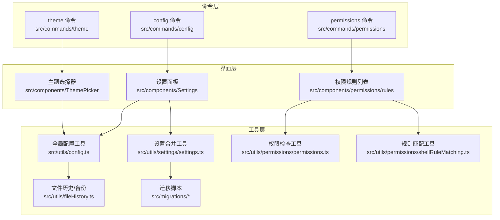
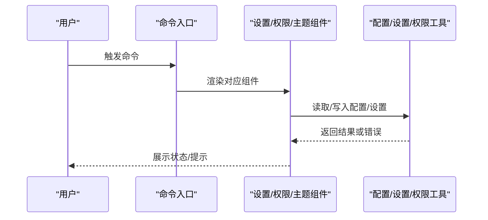
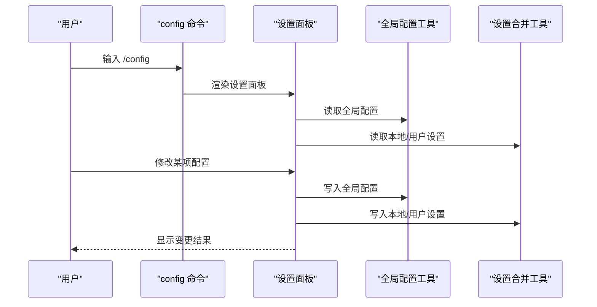
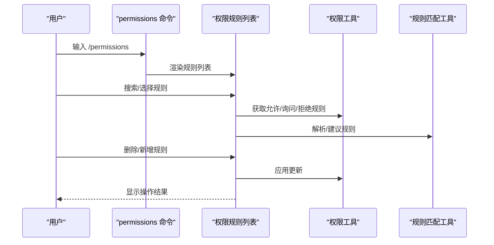
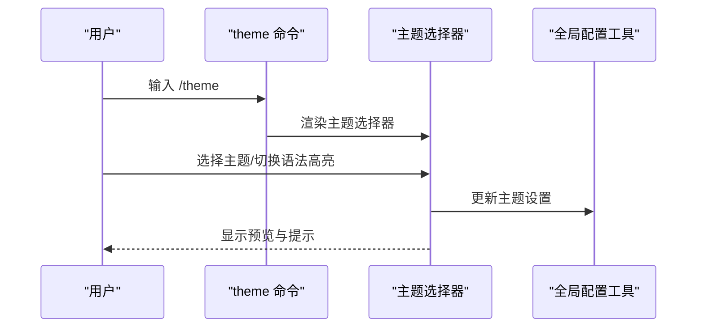
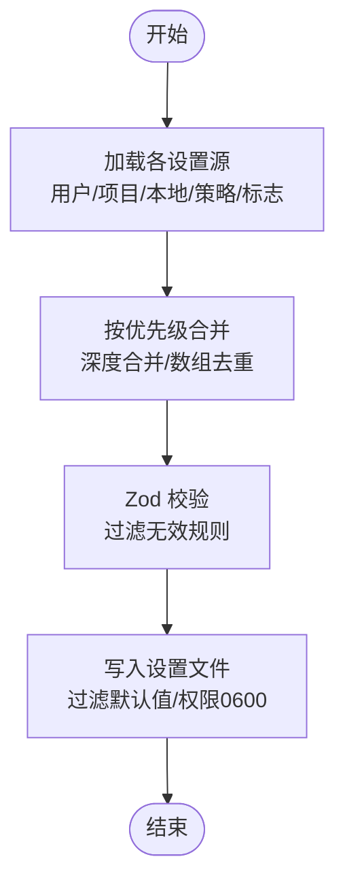
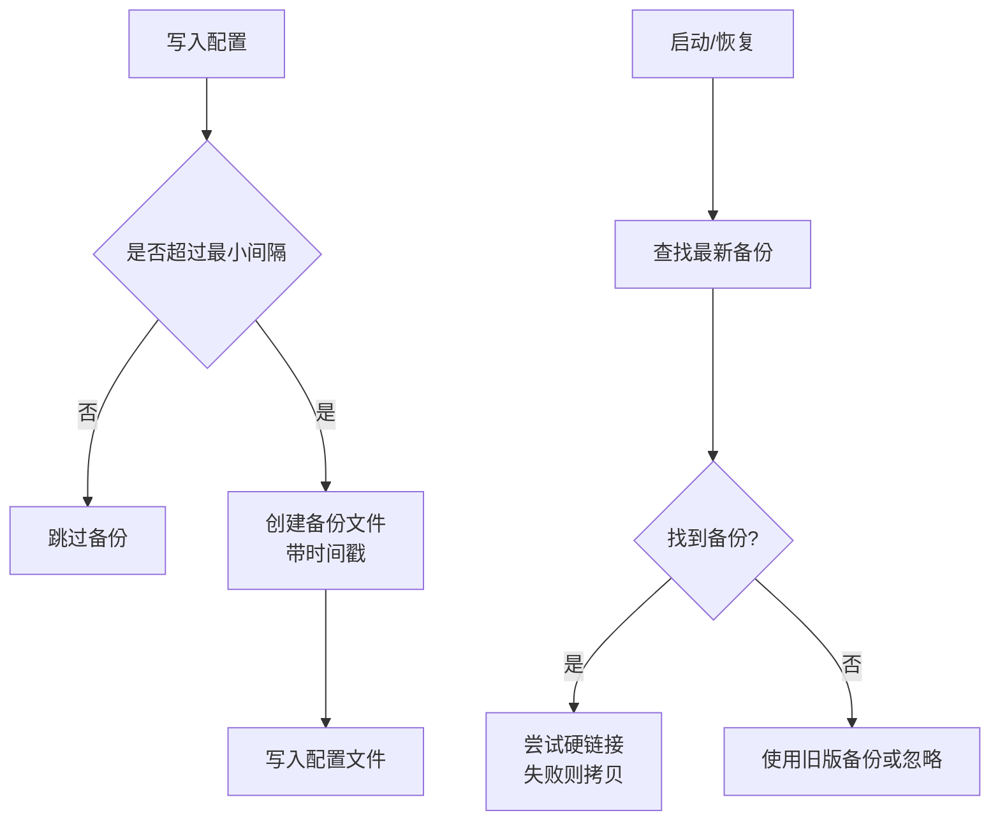
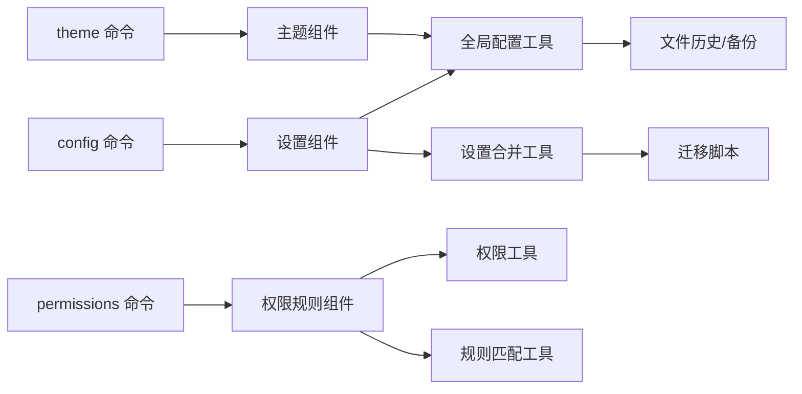

# 配置管理命令

<cite>
**本文档引用的文件**
- [src/commands/config/index.ts](file://src/commands/config/index.ts)
- [src/commands/config/config.tsx](file://src/commands/config/config.tsx)
- [src/components/Settings/Settings.tsx](file://src/components/Settings/Settings.tsx)
- [src/components/Settings/Config.tsx](file://src/components/Settings/Config.tsx)
- [src/commands/permissions/index.ts](file://src/commands/permissions/index.ts)
- [src/commands/permissions/permissions.tsx](file://src/commands/permissions/permissions.tsx)
- [src/components/permissions/rules/PermissionRuleList.tsx](file://src/components/permissions/rules/PermissionRuleList.tsx)
- [src/commands/theme/index.ts](file://src/commands/theme/index.ts)
- [src/commands/theme/theme.tsx](file://src/commands/theme/theme.tsx)
- [src/components/ThemePicker.tsx](file://src/components/ThemePicker.tsx)
- [src/utils/config.ts](file://src/utils/config.ts)
- [src/utils/settings/settings.ts](file://src/utils/settings/settings.ts)
- [src/utils/permissions/permissions.ts](file://src/utils/permissions/permissions.ts)
- [src/utils/permissions/shellRuleMatching.ts](file://src/utils/permissions/shellRuleMatching.ts)
- [src/utils/fileHistory.ts](file://src/utils/fileHistory.ts)
- [src/migrations/migrateEnableAllProjectMcpServersToSettings.ts](file://src/migrations/migrateEnableAllProjectMcpServersToSettings.ts)
</cite>

## 目录
1. [简介](#简介)
2. [项目结构](#项目结构)
3. [核心组件](#核心组件)
4. [架构总览](#架构总览)
5. [详细组件分析](#详细组件分析)
6. [依赖关系分析](#依赖关系分析)
7. [性能考虑](#性能考虑)
8. [故障排除指南](#故障排除指南)
9. [结论](#结论)
10. [附录](#附录)

## 简介
本文件系统性地梳理了配置管理命令体系，涵盖以下方面：
- 配置查看与修改命令（config）
- 权限管理命令（permissions）
- 主题设置命令（theme）
- 配置文件结构与作用域
- 配置继承与合并机制
- 配置备份、恢复与迁移
- 批量配置与安全控制

目标是帮助用户与开发者高效理解并使用配置管理命令，同时掌握底层实现原理与最佳实践。

## 项目结构
配置管理相关代码主要分布在以下模块：
- 命令入口：commands/config、commands/permissions、commands/theme
- 设置面板：components/Settings、components/ThemePicker
- 配置与设置工具：utils/config.ts、utils/settings/settings.ts
- 权限系统：utils/permissions/*、components/permissions/rules/*
- 迁移与备份：migrations/*、utils/fileHistory.ts

**图表来源**
- [src/commands/config/index.ts:1-11](file://src/commands/config/index.ts#L1-L11)
- [src/commands/permissions/index.ts:1-11](file://src/commands/permissions/index.ts#L1-L11)
- [src/commands/theme/index.ts:1-10](file://src/commands/theme/index.ts#L1-L10)
- [src/components/Settings/Settings.tsx:1-137](file://src/components/Settings/Settings.tsx#L1-L137)
- [src/components/ThemePicker.tsx:1-333](file://src/components/ThemePicker.tsx#L1-L333)
- [src/utils/config.ts:1-1818](file://src/utils/config.ts#L1-L1818)
- [src/utils/settings/settings.ts:1-1016](file://src/utils/settings/settings.ts#L1-L1016)
- [src/utils/permissions/permissions.ts:1-1487](file://src/utils/permissions/permissions.ts#L1-L1487)
- [src/utils/permissions/shellRuleMatching.ts:153-228](file://src/utils/permissions/shellRuleMatching.ts#L153-L228)
- [src/utils/fileHistory.ts:970-1010](file://src/utils/fileHistory.ts#L970-L1010)
- [src/migrations/migrateEnableAllProjectMcpServersToSettings.ts:1-118](file://src/migrations/migrateEnableAllProjectMcpServersToSettings.ts#L1-L118)

**章节来源**
- [src/commands/config/index.ts:1-11](file://src/commands/config/index.ts#L1-L11)
- [src/commands/permissions/index.ts:1-11](file://src/commands/permissions/index.ts#L1-L11)
- [src/commands/theme/index.ts:1-10](file://src/commands/theme/index.ts#L1-L10)

## 核心组件
- 配置命令（config）：打开设置面板，默认定位到“配置”标签页，支持全局与本地设置的浏览与编辑。
- 权限命令（permissions）：打开权限规则列表，支持允许/询问/拒绝规则的增删改查与工作区目录管理。
- 主题命令（theme）：打开主题选择器，支持自动/深色/浅色等主题切换，并预览语法高亮效果。

上述命令均通过本地 JSX 命令调用方式实现，界面由对应组件负责渲染与交互。

**章节来源**
- [src/commands/config/config.tsx:1-7](file://src/commands/config/config.tsx#L1-L7)
- [src/commands/permissions/permissions.tsx:1-10](file://src/commands/permissions/permissions.tsx#L1-L10)
- [src/commands/theme/theme.tsx:1-57](file://src/commands/theme/theme.tsx#L1-L57)

## 架构总览
配置管理采用“命令 → 组件 → 工具”的分层架构：
- 命令层负责注册与入口调用
- 组件层负责 UI 渲染与交互
- 工具层负责数据持久化、合并、校验与迁移

**图表来源**
- [src/commands/config/config.tsx:1-7](file://src/commands/config/config.tsx#L1-L7)
- [src/commands/permissions/permissions.tsx:1-10](file://src/commands/permissions/permissions.tsx#L1-L10)
- [src/commands/theme/theme.tsx:1-57](file://src/commands/theme/theme.tsx#L1-L57)
- [src/components/Settings/Settings.tsx:1-137](file://src/components/Settings/Settings.tsx#L1-L137)
- [src/utils/config.ts:1044-1086](file://src/utils/config.ts#L1044-L1086)
- [src/utils/settings/settings.ts:416-524](file://src/utils/settings/settings.ts#L416-L524)

## 详细组件分析

### 配置命令（config）
- 功能：打开设置面板，支持全局配置与本地设置的浏览与编辑；内置搜索与快捷键导航。
- 关键实现：
  - 命令入口注册与加载：[src/commands/config/index.ts:1-11](file://src/commands/config/index.ts#L1-L11)
  - 调用设置组件并默认选中“配置”标签：[src/commands/config/config.tsx:1-7](file://src/commands/config/config.tsx#L1-L7)
  - 设置面板容器与标签页组织：[src/components/Settings/Settings.tsx:1-137](file://src/components/Settings/Settings.tsx#L1-L137)
  - 配置项列表与变更记录：[src/components/Settings/Config.tsx:1-800](file://src/components/Settings/Config.tsx#L1-L800)

**图表来源**
- [src/commands/config/config.tsx:1-7](file://src/commands/config/config.tsx#L1-L7)
- [src/components/Settings/Settings.tsx:1-137](file://src/components/Settings/Settings.tsx#L1-L137)
- [src/components/Settings/Config.tsx:1-800](file://src/components/Settings/Config.tsx#L1-L800)
- [src/utils/config.ts:1044-1086](file://src/utils/config.ts#L1044-L1086)
- [src/utils/settings/settings.ts:416-524](file://src/utils/settings/settings.ts#L416-L524)

**章节来源**
- [src/commands/config/index.ts:1-11](file://src/commands/config/index.ts#L1-L11)
- [src/commands/config/config.tsx:1-7](file://src/commands/config/config.tsx#L1-L7)
- [src/components/Settings/Settings.tsx:1-137](file://src/components/Settings/Settings.tsx#L1-L137)
- [src/components/Settings/Config.tsx:1-800](file://src/components/Settings/Config.tsx#L1-L800)

### 权限管理命令（permissions）
- 功能：集中管理允许/询问/拒绝工具权限规则，支持按来源查看与删除，支持添加新规则与工作区目录管理。
- 关键实现：
  - 命令入口注册与加载：[src/commands/permissions/index.ts:1-11](file://src/commands/permissions/index.ts#L1-L11)
  - 调用权限规则列表组件：[src/commands/permissions/permissions.tsx:1-10](file://src/commands/permissions/permissions.tsx#L1-L10)
  - 权限规则列表与搜索、删除、新增流程：[src/components/permissions/rules/PermissionRuleList.tsx:1-800](file://src/components/permissions/rules/PermissionRuleList.tsx#L1-L800)
  - 权限检查与决策逻辑（含自动模式、分类器等）：[src/utils/permissions/permissions.ts:1-1487](file://src/utils/permissions/permissions.ts#L1-L1487)
  - 规则解析与建议生成（前缀/通配符/精确匹配）：[src/utils/permissions/shellRuleMatching.ts:153-228](file://src/utils/permissions/shellRuleMatching.ts#L153-L228)

**图表来源**
- [src/commands/permissions/index.ts:1-11](file://src/commands/permissions/index.ts#L1-L11)
- [src/commands/permissions/permissions.tsx:1-10](file://src/commands/permissions/permissions.tsx#L1-L10)
- [src/components/permissions/rules/PermissionRuleList.tsx:1-800](file://src/components/permissions/rules/PermissionRuleList.tsx#L1-L800)
- [src/utils/permissions/permissions.ts:1-1487](file://src/utils/permissions/permissions.ts#L1-L1487)
- [src/utils/permissions/shellRuleMatching.ts:153-228](file://src/utils/permissions/shellRuleMatching.ts#L153-L228)

**章节来源**
- [src/commands/permissions/index.ts:1-11](file://src/commands/permissions/index.ts#L1-L11)
- [src/commands/permissions/permissions.tsx:1-10](file://src/commands/permissions/permissions.tsx#L1-L10)
- [src/components/permissions/rules/PermissionRuleList.tsx:1-800](file://src/components/permissions/rules/PermissionRuleList.tsx#L1-L800)
- [src/utils/permissions/permissions.ts:1-1487](file://src/utils/permissions/permissions.ts#L1-L1487)
- [src/utils/permissions/shellRuleMatching.ts:153-228](file://src/utils/permissions/shellRuleMatching.ts#L153-L228)

### 主题设置命令（theme）
- 功能：选择主题（自动/深色/浅色/色盲友好/仅 ANSI），预览语法高亮效果，支持禁用/启用语法高亮。
- 关键实现：
  - 命令入口注册与加载：[src/commands/theme/index.ts:1-10](file://src/commands/theme/index.ts#L1-L10)
  - 调用主题选择器组件并处理确认/取消：[src/commands/theme/theme.tsx:1-57](file://src/commands/theme/theme.tsx#L1-L57)
  - 主题选择器 UI 与语法高亮开关：[src/components/ThemePicker.tsx:1-333](file://src/components/ThemePicker.tsx#L1-L333)
  - 主题提供者与保存逻辑（与全局配置集成）：[src/utils/config.ts:19-59](file://src/utils/config.ts#L19-L59)

**图表来源**
- [src/commands/theme/index.ts:1-10](file://src/commands/theme/index.ts#L1-L10)
- [src/commands/theme/theme.tsx:1-57](file://src/commands/theme/theme.tsx#L1-L57)
- [src/components/ThemePicker.tsx:1-333](file://src/components/ThemePicker.tsx#L1-L333)
- [src/utils/config.ts:19-59](file://src/utils/config.ts#L19-L59)

**章节来源**
- [src/commands/theme/index.ts:1-10](file://src/commands/theme/index.ts#L1-L10)
- [src/commands/theme/theme.tsx:1-57](file://src/commands/theme/theme.tsx#L1-L57)
- [src/components/ThemePicker.tsx:1-333](file://src/components/ThemePicker.tsx#L1-L333)
- [src/utils/config.ts:19-59](file://src/utils/config.ts#L19-L59)

### 配置文件结构与作用域
- 全局配置（GlobalConfig）
  - 存储位置与读写：通过全局配置工具统一读写，具备缓存与锁文件保护，写入时进行默认值过滤与权限设置。
  - 关键字段示例：主题、通知渠道、编辑器模式、自动更新、终端进度条、复制行为、尊重 .gitignore 等。
  - 参考路径：[src/utils/config.ts:183-578](file://src/utils/config.ts#L183-L578)

- 设置（Settings）
  - 多源合并：支持用户设置、项目设置、本地设置、策略设置、标志设置等多源合并，优先级可配置。
  - 文件路径：用户设置位于配置主目录下的 settings.json 或 cowork_settings.json；项目/本地设置位于 .claude 目录。
  - 合并与验证：使用 Zod Schema 校验，数组合并去重，对象深度合并，支持删除键（undefined）。
  - 参考路径：[src/utils/settings/settings.ts:239-307](file://src/utils/settings/settings.ts#L239-L307)、[src/utils/settings/settings.ts:416-524](file://src/utils/settings/settings.ts#L416-L524)

**图表来源**
- [src/utils/settings/settings.ts:645-796](file://src/utils/settings/settings.ts#L645-L796)
- [src/utils/settings/settings.ts:416-524](file://src/utils/settings/settings.ts#L416-L524)

**章节来源**
- [src/utils/config.ts:183-578](file://src/utils/config.ts#L183-L578)
- [src/utils/settings/settings.ts:239-307](file://src/utils/settings/settings.ts#L239-L307)
- [src/utils/settings/settings.ts:416-524](file://src/utils/settings/settings.ts#L416-L524)

### 配置继承机制
- 设置继承顺序（从低到高）：插件基础设置 → 策略设置（远程/HKLM/文件/HKCU，首个有内容的生效）→ 用户设置 → 项目设置 → 本地设置 → 标志设置（内联）。
- 权限规则来源：按来源顺序聚合（用户/项目/本地/策略等），最终形成上下文中的允许/询问/拒绝规则集。
- 参考路径：
  - 设置合并链路：[src/utils/settings/settings.ts:645-796](file://src/utils/settings/settings.ts#L645-L796)
  - 权限规则来源：[src/utils/permissions/permissions.ts:109-121](file://src/utils/permissions/permissions.ts#L109-L121)

**章节来源**
- [src/utils/settings/settings.ts:645-796](file://src/utils/settings/settings.ts#L645-L796)
- [src/utils/permissions/permissions.ts:109-121](file://src/utils/permissions/permissions.ts#L109-L121)

### 配置备份、恢复与迁移
- 备份策略
  - 写入全局配置时，若满足最小间隔（默认 60 秒），在专用备份目录下生成带时间戳的备份文件；兼容旧版备份文件（无时间戳）。
  - 参考路径：[src/utils/config.ts:1249-1281](file://src/utils/config.ts#L1249-L1281)、[src/utils/config.ts:1377-1419](file://src/utils/config.ts#L1377-L1419)

- 恢复策略
  - 从备份目录或旧版位置查找最新备份文件，若硬链接失败则回退到拷贝；对不存在或损坏的备份进行错误日志记录。
  - 参考路径：[src/utils/fileHistory.ts:970-1010](file://src/utils/fileHistory.ts#L970-L1010)

- 迁移策略
  - 将项目配置中的 MCP 服务器审批字段迁移到本地设置，避免重复与不一致；迁移后清理原字段。
  - 参考路径：[src/migrations/migrateEnableAllProjectMcpServersToSettings.ts:1-118](file://src/migrations/migrateEnableAllProjectMcpServersToSettings.ts#L1-L118)

**图表来源**
- [src/utils/config.ts:1249-1281](file://src/utils/config.ts#L1249-L1281)
- [src/utils/config.ts:1377-1419](file://src/utils/config.ts#L1377-L1419)
- [src/utils/fileHistory.ts:970-1010](file://src/utils/fileHistory.ts#L970-L1010)

**章节来源**
- [src/utils/config.ts:1249-1281](file://src/utils/config.ts#L1249-L1281)
- [src/utils/config.ts:1377-1419](file://src/utils/config.ts#L1377-L1419)
- [src/utils/fileHistory.ts:970-1010](file://src/utils/fileHistory.ts#L970-L1010)
- [src/migrations/migrateEnableAllProjectMcpServersToSettings.ts:1-118](file://src/migrations/migrateEnableAllProjectMcpServersToSettings.ts#L1-L118)

### 批量配置与安全控制
- 批量配置
  - 设置合并采用自定义合并函数：数组合并去重，对象深度合并；通过将键设为 undefined 实现删除。
  - 参考路径：[src/utils/settings/settings.ts:529-547](file://src/utils/settings/settings.ts#L529-L547)

- 安全控制
  - 写入配置文件时设置严格权限（0600），防止未授权访问。
  - 敏感字段存储分离：插件配置中敏感键写入安全存储，非敏感键写入 settings.json，并在反向写入时清理另一侧残留。
  - 参考路径：
    - 配置写入权限：[src/utils/config.ts:1133-1141](file://src/utils/config.ts#L1133-L1141)
    - 插件敏感字段处理：[src/utils/plugins/mcpbHandler.ts:211-306](file://src/utils/plugins/mcpbHandler.ts#L211-L306)

**章节来源**
- [src/utils/settings/settings.ts:529-547](file://src/utils/settings/settings.ts#L529-L547)
- [src/utils/config.ts:1133-1141](file://src/utils/config.ts#L1133-L1141)
- [src/utils/plugins/mcpbHandler.ts:211-306](file://src/utils/plugins/mcpbHandler.ts#L211-L306)

## 依赖关系分析

**图表来源**
- [src/commands/config/config.tsx:1-7](file://src/commands/config/config.tsx#L1-L7)
- [src/commands/permissions/permissions.tsx:1-10](file://src/commands/permissions/permissions.tsx#L1-L10)
- [src/commands/theme/theme.tsx:1-57](file://src/commands/theme/theme.tsx#L1-L57)
- [src/components/Settings/Settings.tsx:1-137](file://src/components/Settings/Settings.tsx#L1-L137)
- [src/components/ThemePicker.tsx:1-333](file://src/components/ThemePicker.tsx#L1-L333)
- [src/utils/config.ts:1-1818](file://src/utils/config.ts#L1-L1818)
- [src/utils/settings/settings.ts:1-1016](file://src/utils/settings/settings.ts#L1-L1016)
- [src/utils/permissions/permissions.ts:1-1487](file://src/utils/permissions/permissions.ts#L1-L1487)
- [src/utils/permissions/shellRuleMatching.ts:153-228](file://src/utils/permissions/shellRuleMatching.ts#L153-L228)
- [src/utils/fileHistory.ts:970-1010](file://src/utils/fileHistory.ts#L970-L1010)
- [src/migrations/migrateEnableAllProjectMcpServersToSettings.ts:1-118](file://src/migrations/migrateEnableAllProjectMcpServersToSettings.ts#L1-L118)

**章节来源**
- [src/commands/config/config.tsx:1-7](file://src/commands/config/config.tsx#L1-L7)
- [src/commands/permissions/permissions.tsx:1-10](file://src/commands/permissions/permissions.tsx#L1-L10)
- [src/commands/theme/theme.tsx:1-57](file://src/commands/theme/theme.tsx#L1-L57)
- [src/utils/config.ts:1-1818](file://src/utils/config.ts#L1-L1818)
- [src/utils/settings/settings.ts:1-1016](file://src/utils/settings/settings.ts#L1-L1016)
- [src/utils/permissions/permissions.ts:1-1487](file://src/utils/permissions/permissions.ts#L1-L1487)
- [src/utils/permissions/shellRuleMatching.ts:153-228](file://src/utils/permissions/shellRuleMatching.ts#L153-L228)
- [src/utils/fileHistory.ts:970-1010](file://src/utils/fileHistory.ts#L970-L1010)
- [src/migrations/migrateEnableAllProjectMcpServersToSettings.ts:1-118](file://src/migrations/migrateEnableAllProjectMcpServersToSettings.ts#L1-L118)

## 性能考虑
- 配置缓存：全局配置采用内存缓存与后台新鲜度监视，减少磁盘读取频率，写入时采用写透策略避免竞态。
- 写入优化：写入前过滤默认值，减少文件体积；写入锁文件降低并发冲突风险。
- 设置合并：深度合并与数组去重在大配置场景下需注意性能，建议合理拆分设置与分批写入。
- 权限检查：自动模式下使用分类器快速决策，避免不必要的交互；接受编辑模式可绕过昂贵 API 调用。

[本节为通用指导，无需特定文件引用]

## 故障排除指南
- 配置读取异常
  - 现象：首次读取抛出“配置访问早于允许”错误。
  - 排查：确保在允许阶段之后再访问配置；检查初始化流程。
  - 参考路径：[src/utils/config.ts:1426-1429](file://src/utils/config.ts#L1426-L1429)

- 写入失败或丢失认证状态
  - 现象：写入回退至非锁定版本；写入后丢失认证状态。
  - 排查：检查文件权限与并发写入；确认缓存一致性；避免在测试环境外直接修改默认值。
  - 参考路径：[src/utils/config.ts:834-865](file://src/utils/config.ts#L834-L865)、[src/utils/config.ts:782-795](file://src/utils/config.ts#L782-L795)

- 设置文件格式错误
  - 现象：JSON 语法错误导致设置无法解析。
  - 排查：使用解析后的原始数据作为后备；修复 JSON 语法后再写入。
  - 参考路径：[src/utils/settings/settings.ts:442-471](file://src/utils/settings/settings.ts#L442-L471)

- 权限规则冲突
  - 现象：规则不可达或被遮蔽。
  - 排查：检查规则来源与优先级；根据提示修复冲突。
  - 参考路径：[src/components/permissions/rules/PermissionRuleList.tsx:750-761](file://src/components/permissions/rules/PermissionRuleList.tsx#L750-L761)

**章节来源**
- [src/utils/config.ts:782-795](file://src/utils/config.ts#L782-L795)
- [src/utils/config.ts:834-865](file://src/utils/config.ts#L834-L865)
- [src/utils/config.ts:1426-1429](file://src/utils/config.ts#L1426-L1429)
- [src/utils/settings/settings.ts:442-471](file://src/utils/settings/settings.ts#L442-L471)
- [src/components/permissions/rules/PermissionRuleList.tsx:750-761](file://src/components/permissions/rules/PermissionRuleList.tsx#L750-L761)

## 结论
配置管理命令以清晰的分层架构实现了从命令入口到界面交互再到工具层持久化的完整闭环。通过多源设置合并、严格的权限控制与完善的备份/迁移机制，既保证了易用性，也兼顾了安全性与可靠性。建议在团队环境中优先使用策略设置与本地设置，配合权限规则与主题定制，提升开发体验与一致性。

[本节为总结性内容，无需特定文件引用]

## 附录
- 常用命令速览
  - 查看/修改配置：/config
  - 管理权限规则：/permissions
  - 切换主题：/theme

- 配置文件位置参考
  - 用户设置：配置主目录/settings.json 或 cowork_settings.json
  - 项目设置：工作目录/.claude/settings.json
  - 本地设置：工作目录/.claude/settings.local.json

[本节为概览性内容，无需特定文件引用]