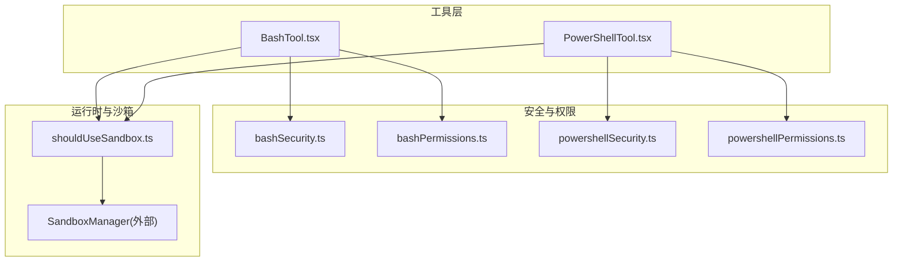
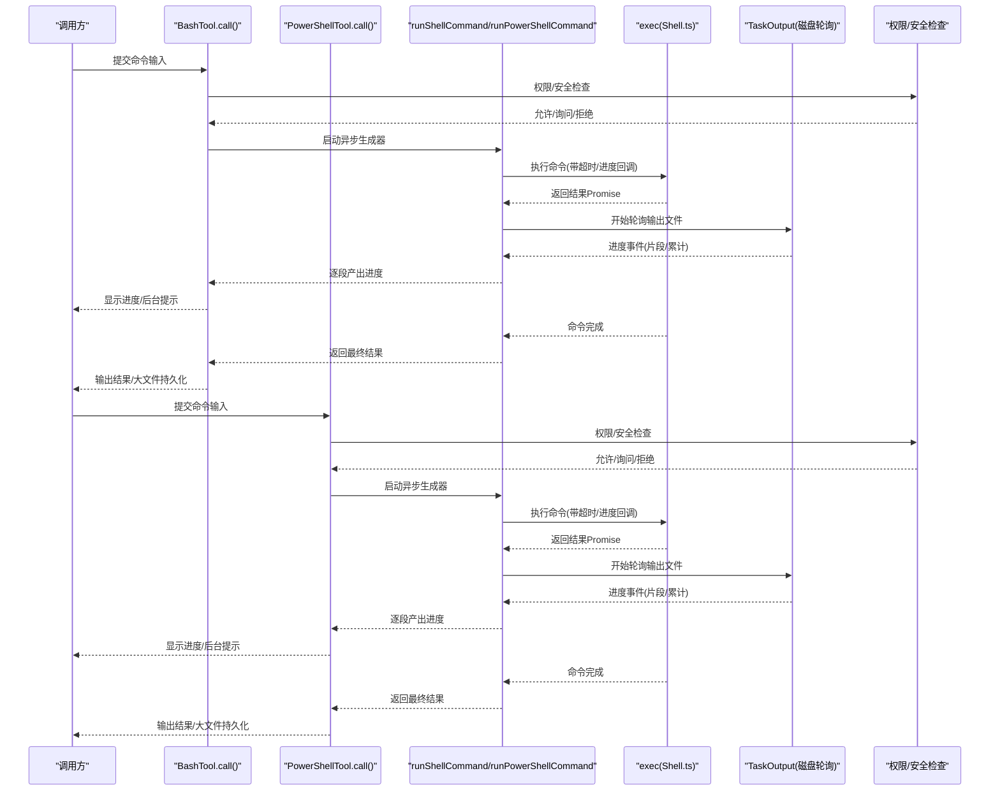
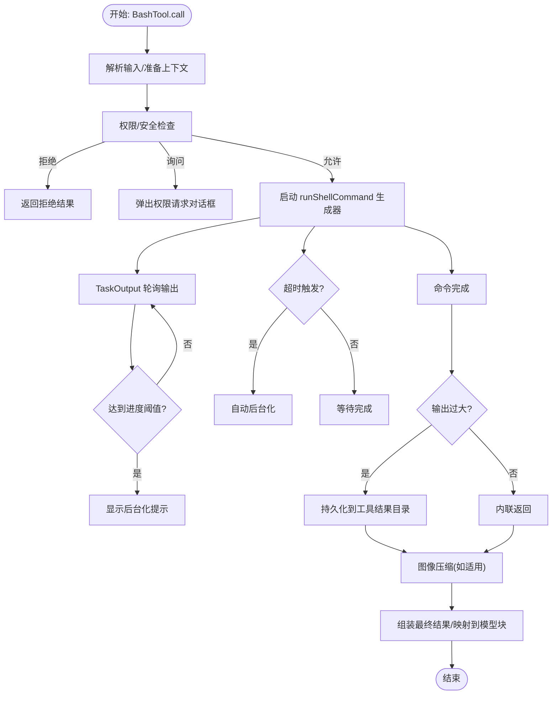
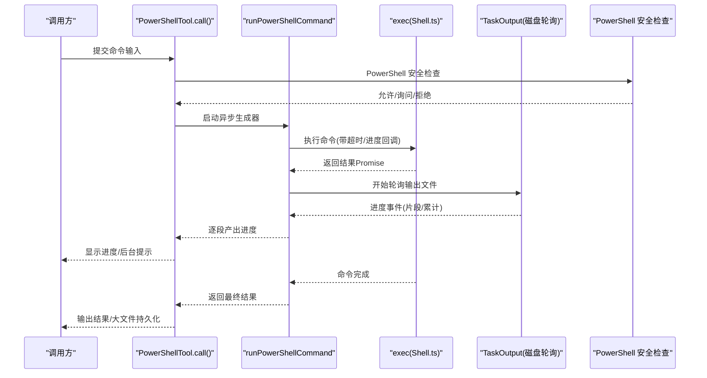
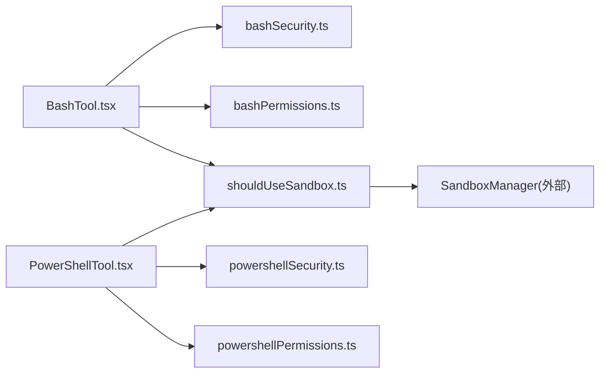

# Shell 工具

<cite>
**本文引用的文件**
- [BashTool.tsx](file://src/tools/BashTool/BashTool.tsx)
- [PowerShellTool.tsx](file://src/tools/PowerShellTool/PowerShellTool.tsx)
- [bashSecurity.ts](file://src/tools/BashTool/bashSecurity.ts)
- [bashPermissions.ts](file://src/tools/BashTool/bashPermissions.ts)
- [powershellSecurity.ts](file://src/tools/PowerShellTool/powershellSecurity.ts)
- [powershellPermissions.ts](file://src/tools/PowerShellTool/powershellPermissions.ts)
- [shouldUseSandbox.ts](file://src/tools/BashTool/shouldUseSandbox.ts)
- [toolName.ts](file://src/tools/PowerShellTool/toolName.ts)
</cite>

## 目录
1. [简介](#简介)
2. [项目结构](#项目结构)
3. [核心组件](#核心组件)
4. [架构总览](#架构总览)
5. [详细组件分析](#详细组件分析)
6. [依赖关系分析](#依赖关系分析)
7. [性能考虑](#性能考虑)
8. [故障排查指南](#故障排查指南)
9. [结论](#结论)
10. [附录](#附录)

## 简介
本文件为 Claude Code 的 Shell 工具技术文档，聚焦 BashTool 与 PowerShellTool 的实现原理与使用方法。内容涵盖命令解析、参数处理、输出捕获、错误处理、安全控制（危险命令检测、路径验证、只读模式限制、沙箱隔离）、跨平台兼容性与平台特定功能、性能优化与最佳实践，并提供可操作的使用示例与排障指引。

## 项目结构
- BashTool 与 PowerShellTool 均通过统一工具框架构建，具备一致的输入/输出模式、权限检查流程、进度回调与结果映射能力。
- 安全控制由各自的安全模块与权限模块协同完成：BashTool 使用 bashSecurity.ts 与 bashPermissions.ts；PowerShellTool 使用 powershellSecurity.ts 与 powershellPermissions.ts。
- 沙箱策略由 shouldUseSandbox.ts 统一判定，结合平台能力与用户策略决定是否启用沙箱。

图表来源
- [BashTool.tsx](file://src/tools/BashTool/BashTool.tsx)
- [PowerShellTool.tsx](file://src/tools/PowerShellTool/PowerShellTool.tsx)
- [bashSecurity.ts](file://src/tools/BashTool/bashSecurity.ts)
- [bashPermissions.ts](file://src/tools/BashTool/bashPermissions.ts)
- [powershellSecurity.ts](file://src/tools/PowerShellTool/powershellSecurity.ts)
- [powershellPermissions.ts](file://src/tools/PowerShellTool/powershellPermissions.ts)
- [shouldUseSandbox.ts](file://src/tools/BashTool/shouldUseSandbox.ts)

章节来源
- [BashTool.tsx](file://src/tools/BashTool/BashTool.tsx)
- [PowerShellTool.tsx](file://src/tools/PowerShellTool/PowerShellTool.tsx)

## 核心组件
- BashTool
  - 输入/输出模式：支持命令字符串、超时、描述、后台运行标记、危险地禁用沙箱等字段；输出包含标准输出、标准错误、中断状态、图像标志、后台任务信息、结构化内容、持久化输出路径与大小等。
  - 进度回调：通过异步生成器在执行过程中持续上报输出片段、累计行数、字节数、耗时等。
  - 并发安全：基于只读判断，允许并发执行只读命令。
  - 自动后台化：对长时间阻塞命令进行自动后台化或响应用户 Ctrl+B 触发的后台化。
  - 大输出处理：超过阈值时将完整输出写入工具结果目录并返回预览与路径。
  - 图像输出压缩：对终端内嵌图像数据进行尺寸与体积压缩。
  - Git 操作追踪：对 git/gh/glab/curl 等命令进行使用计数与成功与否统计。
- PowerShellTool
  - 输入/输出模式：支持命令字符串、超时、描述、后台运行标记、危险地禁用沙箱；输出包含标准输出、标准错误、中断状态、图像标志、后台任务信息、持久化输出路径与大小等。
  - 进度回调：与 BashTool 类似的异步生成器进度上报。
  - 自动后台化：对长时间阻塞命令进行自动后台化或响应用户 Ctrl+B 触发的后台化。
  - 大输出处理：同 BashTool。
  - 图像输出压缩：同 BashTool。
  - Windows 沙箱策略：在企业策略要求沙箱而平台不支持时直接拒绝执行。
  - 只读判断：同步安全启发式 + 异步 AST 解析的综合只读判定。

章节来源
- [BashTool.tsx](file://src/tools/BashTool/BashTool.tsx)
- [PowerShellTool.tsx](file://src/tools/PowerShellTool/PowerShellTool.tsx)

## 架构总览
下图展示了 BashTool 与 PowerShellTool 的调用链路与关键协作点：

图表来源
- [BashTool.tsx](file://src/tools/BashTool/BashTool.tsx)
- [PowerShellTool.tsx](file://src/tools/PowerShellTool/PowerShellTool.tsx)

## 详细组件分析

### BashTool 实现要点
- 命令解析与语义识别
  - 搜索/读取类命令识别：基于分词与运算符跳过，仅当所有部分均为搜索/读取/列表类命令且存在非中性命令时才视为可折叠显示。
  - 静默命令识别：用于 UI 中以“已完成”替代“(无输出)”。
  - 自动后台化豁免：sleep 等命令默认不允许自动后台化，除非用户显式 run_in_background。
- 进度与后台化
  - 异步生成器驱动：通过 onProgress 回调唤醒生成器，周期性产出进度；达到阈值后显示后台化提示。
  - 超时与助手模式：在主助手线程中，超过阻塞预算后自动后台化；用户也可通过 Ctrl+B 将前台任务后台化。
  - 后台任务注册：通过 LocalShellTask 注册/注销前台任务，支持后台任务通知与输出路径查询。
- 输出与结果映射
  - 大输出持久化：超过阈值时复制到工具结果目录，截断至最大容量并返回预览与路径。
  - 结构化内容：若存在结构化内容则直接作为模型内容块返回。
  - 图像输出：对终端内嵌图像数据进行尺寸与体积压缩。
  - Git 操作追踪：对 git/gh/glab/curl 等命令进行使用计数与成功与否统计。
- 错误处理
  - 合并与标注：stderr 合并到 stdout，同时通过 SandboxManager.annotateStderrWithSandboxFailures 标注沙箱违规。
  - ShellError：当解释为错误且非用户中断时抛出，携带退出码与错误文本。
- 安全控制
  - 权限匹配：支持精确/前缀/通配规则，结合 AST 与启发式进行子命令匹配与规则筛选。
  - 危险模式检测：针对 heredoc 替换、git commit 消息注入、jq system 函数、Zsh 扩展等进行早期放行或拦截。
  - 路径约束：重定向与路径访问校验，防止写入敏感路径。
  - 沙箱策略：根据动态配置、用户排除规则与平台能力决定是否启用沙箱。

图表来源
- [BashTool.tsx](file://src/tools/BashTool/BashTool.tsx)

章节来源
- [BashTool.tsx](file://src/tools/BashTool/BashTool.tsx)
- [bashSecurity.ts](file://src/tools/BashTool/bashSecurity.ts)
- [bashPermissions.ts](file://src/tools/BashTool/bashPermissions.ts)
- [shouldUseSandbox.ts](file://src/tools/BashTool/shouldUseSandbox.ts)

### PowerShellTool 实现要点
- 命令解析与语义识别
  - 搜索/读取类命令识别：基于语句分割与命令名规范化，仅当所有部分均为搜索/读取类命令时才视为可折叠显示。
  - 自动后台化豁免：Start-Sleep/sleep 等命令默认不允许自动后台化，除非用户显式 run_in_background。
- 进度与后台化
  - 异步生成器驱动：与 BashTool 类似，周期性产出进度；达到阈值后显示后台化提示。
  - 超时与助手模式：在主助手线程中，超过阻塞预算后自动后台化；用户也可通过 Ctrl+B 将前台任务后台化。
- 输出与结果映射
  - 大输出持久化：同 BashTool。
  - 结构化内容：同 BashTool。
  - 图像输出：同 BashTool。
- 错误处理
  - 合并与标注：stderr 合并到 stdout，必要时通过 SandboxManager.annotateStderrWithSandboxFailures 标注沙箱违规。
  - ShellError：当解释为错误且非用户中断时抛出，携带退出码与错误文本。
- 安全控制
  - 权限匹配：支持精确/前缀/通配规则，结合 AST 与启发式进行命令名规范化与规则筛选。
  - PowerShell 特定安全检查：针对 Invoke-Expression、动态命令名、编码参数、嵌套 PowerShell 进程、下载脚手架、COM 对象、Add-Type、危险脚本块、子表达式、可展开字符串、Splatting、停止解析令牌、成员调用、类型字面量等进行严格检查。
  - Windows 沙箱策略：在企业策略要求沙箱而平台不支持时直接拒绝执行。
  - 只读判断：同步安全启发式 + 异步 AST 解析的综合只读判定。

图表来源
- [PowerShellTool.tsx](file://src/tools/PowerShellTool/PowerShellTool.tsx)
- [powershellSecurity.ts](file://src/tools/PowerShellTool/powershellSecurity.ts)

章节来源
- [PowerShellTool.tsx](file://src/tools/PowerShellTool/PowerShellTool.tsx)
- [powershellSecurity.ts](file://src/tools/PowerShellTool/powershellSecurity.ts)
- [powershellPermissions.ts](file://src/tools/PowerShellTool/powershellPermissions.ts)

### 安全控制机制
- BashTool
  - 早期放行：对安全的 heredoc 替换、git commit 简单消息、jq 安全标志等进行快速放行。
  - 严格校验：对命令替换、重定向、IFS 注入、变量扩展、Zsh 危险命令、等号扩展、反引号等进行严格检查。
  - 路径与重定向：对输出/输入重定向进行剥离与校验，防止写入敏感路径。
  - 权限规则：支持精确/前缀/通配规则，结合 AST 与启发式进行子命令匹配与规则筛选。
- PowerShellTool
  - AST 优先：基于 PowerShell AST 进行命令树分析，覆盖动态命令名、编码参数、嵌套 PowerShell 进程、下载脚手架、COM 对象、Add-Type、危险脚本块、子表达式、可展开字符串、Splatting、停止解析令牌、成员调用、类型字面量等。
  - 规则匹配：支持精确/前缀/通配规则，结合命令名规范化与别名解析。
  - Windows 沙箱策略：在企业策略要求沙箱而平台不支持时直接拒绝执行。

章节来源
- [bashSecurity.ts](file://src/tools/BashTool/bashSecurity.ts)
- [bashPermissions.ts](file://src/tools/BashTool/bashPermissions.ts)
- [powershellSecurity.ts](file://src/tools/PowerShellTool/powershellSecurity.ts)
- [powershellPermissions.ts](file://src/tools/PowerShellTool/powershellPermissions.ts)

### 沙箱与平台兼容性
- 沙箱策略
  - BashTool：根据平台能力、用户策略与动态配置决定是否启用沙箱；支持用户自定义排除规则（前缀/精确/通配）。
  - PowerShellTool：在 Windows 原生环境下，若企业策略要求沙箱但平台不支持，则直接拒绝执行。
- 平台差异
  - BashTool：在 Linux/macOS/WSL2 上，pwsh 作为原生二进制运行，与 bash 一样受沙箱管理；Windows 原生不支持沙箱。
  - PowerShellTool：Windows 原生不支持沙箱；其他平台支持沙箱。

章节来源
- [shouldUseSandbox.ts](file://src/tools/BashTool/shouldUseSandbox.ts)
- [PowerShellTool.tsx](file://src/tools/PowerShellTool/PowerShellTool.tsx)

## 依赖关系分析
- 工具层依赖
  - BashTool/PowerShellTool 依赖统一的工具框架（buildTool）、Shell 执行器（exec）、任务输出轮询（TaskOutput）、沙箱适配器（SandboxManager）。
- 安全与权限
  - BashTool 依赖 bashSecurity.ts 与 bashPermissions.ts；PowerShellTool 依赖 powershellSecurity.ts 与 powershellPermissions.ts。
- 沙箱策略
  - shouldUseSandbox.ts 统一判定是否启用沙箱，结合平台能力与用户策略。

图表来源
- [BashTool.tsx](file://src/tools/BashTool/BashTool.tsx)
- [PowerShellTool.tsx](file://src/tools/PowerShellTool/PowerShellTool.tsx)
- [bashSecurity.ts](file://src/tools/BashTool/bashSecurity.ts)
- [bashPermissions.ts](file://src/tools/BashTool/bashPermissions.ts)
- [powershellSecurity.ts](file://src/tools/PowerShellTool/powershellSecurity.ts)
- [powershellPermissions.ts](file://src/tools/PowerShellTool/powershellPermissions.ts)
- [shouldUseSandbox.ts](file://src/tools/BashTool/shouldUseSandbox.ts)

章节来源
- [BashTool.tsx](file://src/tools/BashTool/BashTool.tsx)
- [PowerShellTool.tsx](file://src/tools/PowerShellTool/PowerShellTool.tsx)

## 性能考虑
- 命令缓存与解析
  - BashTool 在 UI 展示阶段对沙箱指示进行环境变量短路检查，避免昂贵的正则解析。
  - PowerShellTool 在只读判断中采用同步安全启发式，避免等待异步解析。
- 并发与资源管理
  - BashTool/PowerShellTool 基于只读命令的并发安全判定，允许多个只读命令并发执行。
  - 通过 TaskOutput 轮询减少内存占用，避免一次性加载全部输出。
- 大输出处理
  - 超阈值输出直接持久化到工具结果目录，避免内存溢出；必要时截断至最大容量。
- 进度与后台化
  - 达到阈值后显示后台化提示，避免长时间阻塞 UI；超时或助手模式自动后台化，保持交互响应。
- 跨平台差异
  - Windows 原生不支持沙箱，需通过策略与安全检查弥补；Linux/macOS/WSL2 支持沙箱，提升安全性。

章节来源
- [BashTool.tsx](file://src/tools/BashTool/BashTool.tsx)
- [PowerShellTool.tsx](file://src/tools/PowerShellTool/PowerShellTool.tsx)

## 故障排查指南
- 常见问题
  - 命令被拒绝：检查权限规则（精确/前缀/通配），确认是否存在 deny/ask 规则；查看权限请求对话框中的建议规则。
  - 命令被拦截：检查安全检查日志（如 heredoc 替换、git commit 消息注入、jq system 函数、Zsh 扩展等）。
  - 输出过大：确认是否触发了大输出持久化；检查工具结果目录中的预览与完整文件路径。
  - Windows 沙箱拒绝：若企业策略要求沙箱但平台不支持，将直接拒绝执行；请调整策略或使用支持沙箱的平台。
  - 用户中断：若命令被用户中断（新消息提交），将抑制 ShellError 并返回中断状态。
- 排查步骤
  - 查看权限与安全检查日志，确认规则匹配与拦截原因。
  - 检查后台任务状态与输出路径，确认是否已转为后台运行。
  - 验证命令是否包含危险模式（如命令替换、重定向、子表达式等）。
  - 确认平台与沙箱策略设置，确保符合预期。

章节来源
- [BashTool.tsx](file://src/tools/BashTool/BashTool.tsx)
- [PowerShellTool.tsx](file://src/tools/PowerShellTool/PowerShellTool.tsx)
- [bashSecurity.ts](file://src/tools/BashTool/bashSecurity.ts)
- [powershellSecurity.ts](file://src/tools/PowerShellTool/powershellSecurity.ts)

## 结论
BashTool 与 PowerShellTool 在统一的工具框架下实现了跨平台的 Shell 命令执行能力，具备完善的权限与安全控制、进度与后台化机制、大输出持久化与图像压缩、以及针对平台差异的策略适配。通过严格的命令解析、规则匹配与安全检查，两者在保证可用性的同时显著提升了安全性与用户体验。

## 附录
- 使用示例（概念性）
  - 执行系统命令：传入命令字符串与可选超时、描述、后台运行标记；工具将返回标准输出、标准错误、中断状态与后台任务信息。
  - 处理复杂管道：工具会按进度逐步产出输出片段，支持 Ctrl+B 将前台任务后台化。
  - 管理进程生命周期：通过 LocalShellTask 注册/注销前台任务，支持后台任务通知与输出路径查询。
  - 跨平台兼容性：在 Linux/macOS/WSL2 上支持沙箱，在 Windows 原生上遵循企业策略决定是否启用沙箱。
- 最佳实践
  - 优先使用只读命令以提升并发性能。
  - 对长时间阻塞命令使用后台运行，避免阻塞助手模式。
  - 合理设置超时，避免资源占用。
  - 使用权限规则明确授权，减少交互成本。
  - 注意 Windows 原生不支持沙箱的限制，必要时调整策略。