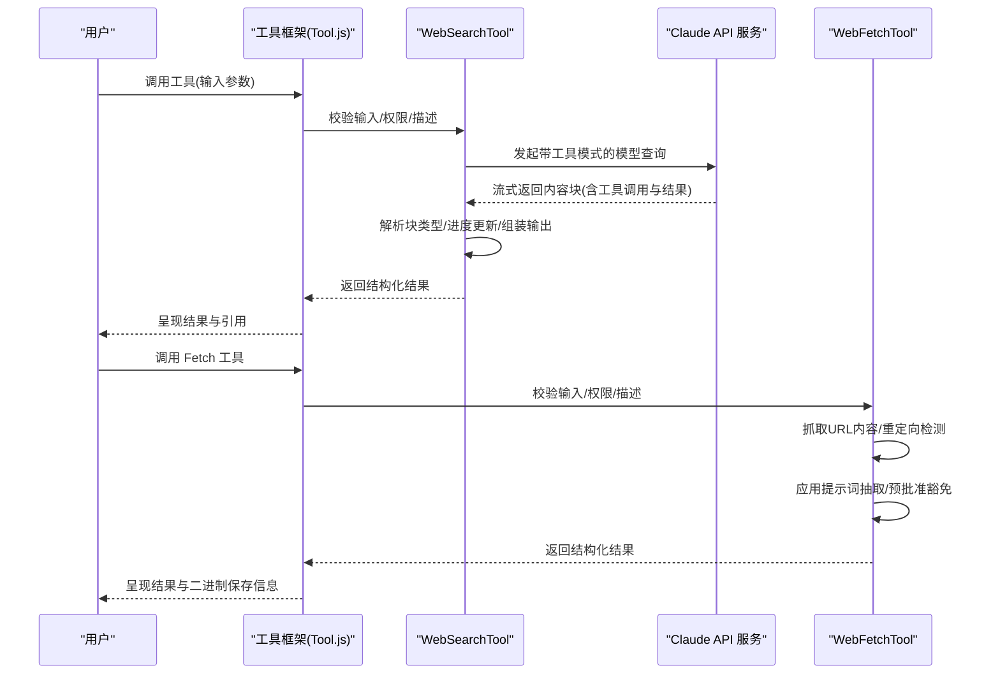
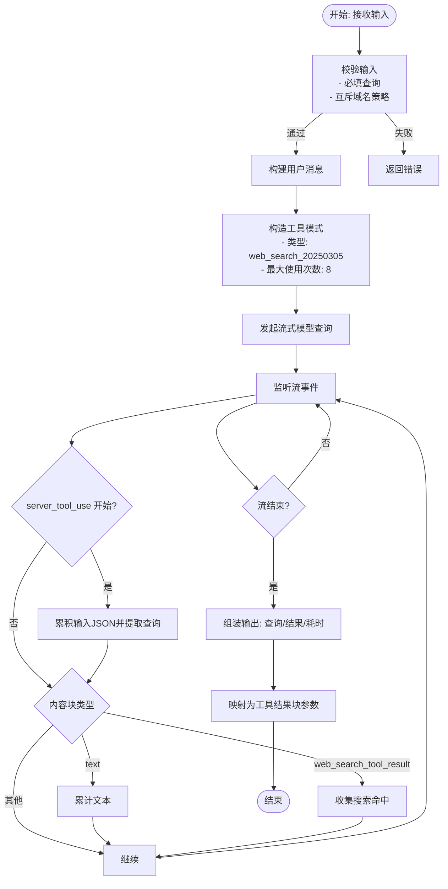
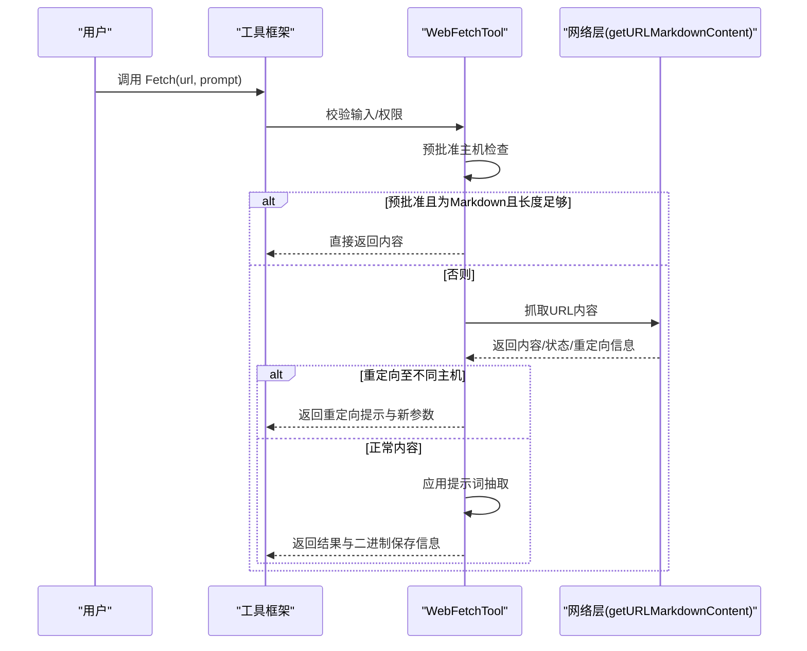
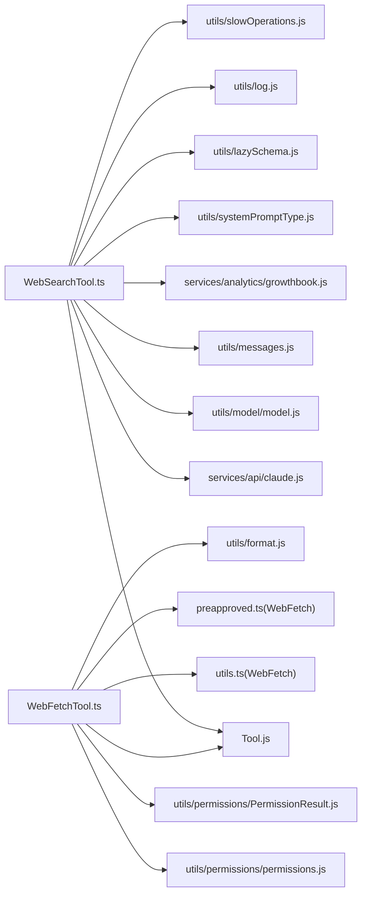

# Web 搜索工具

<cite>
**本文引用的文件**
- [WebSearchTool.ts](file://src/tools/WebSearchTool/WebSearchTool.ts)
- [prompt.ts](file://src/tools/WebSearchTool/prompt.ts)
- [UI.tsx](file://src/tools/WebSearchTool/UI.tsx)
- [WebFetchTool.ts](file://src/tools/WebFetchTool/WebFetchTool.ts)
- [prompt.ts](file://src/tools/WebFetchTool/prompt.ts)
- [UI.tsx](file://src/tools/WebFetchTool/UI.tsx)
- [utils.ts](file://src/tools/WebFetchTool/utils.ts)
- [preapproved.ts](file://src/tools/WebFetchTool/preapproved.ts)
- [Tool.js](file://src/Tool.ts)
- [claude.js](file://src/services/api/claude.js)
- [model.js](file://src/utils/model/model.js)
- [messages.js](file://src/utils/messages.js)
- [growthbook.js](file://src/services/analytics/growthbook.js)
- [permissions.js](file://src/utils/permissions/permissions.js)
- [PermissionResult.js](file://src/utils/permissions/PermissionResult.js)
- [systemPromptType.js](file://src/utils/systemPromptType.js)
- [lazySchema.js](file://src/utils/lazySchema.js)
- [log.js](file://src/utils/log.js)
- [slowOperations.js](file://src/utils/slowOperations.js)
- [format.js](file://src/utils/format.js)
</cite>

## 目录
1. [简介](#简介)
2. [项目结构](#项目结构)
3. [核心组件](#核心组件)
4. [架构总览](#架构总览)
5. [详细组件分析](#详细组件分析)
6. [依赖关系分析](#依赖关系分析)
7. [性能考量](#性能考量)
8. [故障排查指南](#故障排查指南)
9. [结论](#结论)
10. [附录](#附录)

## 简介
本文件面向 Claude Code 的 Web 搜索与抓取工具，系统性阐述 WebSearchTool 与 WebFetchTool 的功能特性、实现机制与使用方式。重点覆盖以下方面：
- WebSearchTool：基于模型工具调用的网络搜索工作流，包括搜索引擎集成、查询处理、结果解析、内容提取与进度反馈。
- WebFetchTool：面向单页内容抓取与处理，涵盖 HTTP 请求、页面解析、数据清洗、格式转换与权限控制。
- 安全与合规：请求头与代理、频率控制、内容过滤与隐私保护策略。
- 实用示例：网络搜索、定向内容获取、动态页面处理等场景。

## 项目结构
Web 搜索与抓取工具位于 src/tools 下，分别提供独立的输入输出模式、权限检查与 UI 渲染逻辑，并通过统一的工具框架进行注册与调度。

```mermaid
graph TB
subgraph "工具定义"
WST["WebSearchTool.ts"]
WFT["WebFetchTool.ts"]
end
subgraph "提示词与UI"
WSTP["prompt.ts (WebSearch)"]
WSTUI["UI.tsx (WebSearch)"]
WFUP["prompt.ts (WebFetch)"]
WFTUI["UI.tsx (WebFetch)"]
end
subgraph "通用能力"
ToolCore["Tool.js"]
CLAUDE["services/api/claude.js"]
MODEL["utils/model/model.js"]
MSG["utils/messages.js"]
GB["services/analytics/growthbook.js"]
PERM["utils/permissions/permissions.js"]
PRESULT["utils/permissions/PermissionResult.js"]
SYSPT["utils/systemPromptType.js"]
LAZY["utils/lazySchema.js"]
LOG["utils/log.js"]
SLOW["utils/slowOperations.js"]
FMT["utils/format.js"]
end
subgraph "WebFetchTool 辅助"
WFUTIL["utils.ts (WebFetch)"]
WFPRE["preapproved.ts (WebFetch)"]
end
WST --> ToolCore
WFT --> ToolCore
WST --> WSTP
WST --> WSTUI
WFT --> WFUP
WFT --> WFTUI
WST --> CLAUDE
WST --> MODEL
WST --> MSG
WST --> GB
WST --> SYSPT
WST --> LAZY
WST --> LOG
WST --> SLOW
WFT --> WFUTIL
WFT --> WFPRE
WFT --> PERM
WFT --> PRESULT
WFT --> FMT
```

图表来源
- [WebSearchTool.ts:1-437](file://src/tools/WebSearchTool/WebSearchTool.ts#L1-L437)
- [WebFetchTool.ts:1-319](file://src/tools/WebFetchTool/WebFetchTool.ts#L1-L319)
- [Tool.js](file://src/Tool.ts)
- [claude.js](file://src/services/api/claude.js)
- [model.js](file://src/utils/model/model.js)
- [messages.js](file://src/utils/messages.js)
- [growthbook.js](file://src/services/analytics/growthbook.js)
- [permissions.js](file://src/utils/permissions/permissions.js)
- [PermissionResult.js](file://src/utils/permissions/PermissionResult.js)
- [systemPromptType.js](file://src/utils/systemPromptType.js)
- [lazySchema.js](file://src/utils/lazySchema.js)
- [log.js](file://src/utils/log.js)
- [slowOperations.js](file://src/utils/slowOperations.js)
- [format.js](file://src/utils/format.js)
- [utils.ts](file://src/tools/WebFetchTool/utils.ts)
- [preapproved.ts](file://src/tools/WebFetchTool/preapproved.ts)

章节来源
- [WebSearchTool.ts:1-437](file://src/tools/WebSearchTool/WebSearchTool.ts#L1-L437)
- [WebFetchTool.ts:1-319](file://src/tools/WebFetchTool/WebFetchTool.ts#L1-L319)

## 核心组件
- WebSearchTool：以“工具调用”形式触发模型执行网络搜索，支持域名白名单/黑名单、并发安全、只读访问、权限提示与进度回调；输出包含文本摘要与链接列表，并在最终结果中注入引用来源提示。
- WebFetchTool：对指定 URL 执行内容抓取，支持预批准主机豁免、重定向检测、二进制内容持久化、权限规则匹配与提示词驱动的内容抽取。

章节来源
- [WebSearchTool.ts:152-437](file://src/tools/WebSearchTool/WebSearchTool.ts#L152-L437)
- [WebFetchTool.ts:66-319](file://src/tools/WebFetchTool/WebFetchTool.ts#L66-L319)

## 架构总览
Web 搜索与抓取工具均通过统一的工具框架注册，遵循输入/输出模式校验、权限检查、调用执行与结果映射的生命周期。

图表来源
- [Tool.js](file://src/Tool.ts)
- [WebSearchTool.ts:254-401](file://src/tools/WebSearchTool/WebSearchTool.ts#L254-L401)
- [WebFetchTool.ts:208-299](file://src/tools/WebFetchTool/WebFetchTool.ts#L208-L299)
- [claude.js](file://src/services/api/claude.js)

## 详细组件分析

### WebSearchTool 组件分析
- 功能定位：通过模型工具调用完成网络搜索，支持域名限制、并发安全、只读访问与进度反馈。
- 输入/输出模式：
  - 输入：查询语句、可选允许/禁止域名列表。
  - 输出：原始查询、结果数组（字符串摘要或搜索命中列表）、耗时。
- 进度与事件：
  - 通过流式事件追踪工具调用 ID、查询更新与搜索结果到达，向 UI 提供分步反馈。
- 权限与可用性：
  - 基于 API 提供商与模型能力启用；内置权限提示建议。
- 结果解析与呈现：
  - 将模型返回的混合内容块解析为文本摘要与链接列表；最终结果注入引用来源提示。

图表来源
- [WebSearchTool.ts:254-401](file://src/tools/WebSearchTool/WebSearchTool.ts#L254-L401)
- [WebSearchTool.ts:86-150](file://src/tools/WebSearchTool/WebSearchTool.ts#L86-L150)
- [WebSearchTool.ts:402-435](file://src/tools/WebSearchTool/WebSearchTool.ts#L402-L435)

章节来源
- [WebSearchTool.ts:25-74](file://src/tools/WebSearchTool/WebSearchTool.ts#L25-L74)
- [WebSearchTool.ts:152-437](file://src/tools/WebSearchTool/WebSearchTool.ts#L152-L437)
- [prompt.ts](file://src/tools/WebSearchTool/prompt.ts)
- [UI.tsx](file://src/tools/WebSearchTool/UI.tsx)

### WebFetchTool 组件分析
- 功能定位：从指定 URL 获取内容并应用提示词抽取，支持预批准主机豁免、重定向检测与二进制内容持久化。
- 输入/输出模式：
  - 输入：目标 URL、提示词。
  - 输出：字节数、HTTP 状态码与文本、处理后结果、耗时、原始 URL。
- 权限与安全：
  - 预批准主机豁免；基于规则的允许/拒绝/询问策略；对认证/私有 URL 的明确提示。
- 内容处理：
  - 预批准且为 Markdown 且长度适配时直接返回原文；否则应用提示词抽取；二进制内容额外保存到磁盘并标注大小与路径。

图表来源
- [WebFetchTool.ts:208-299](file://src/tools/WebFetchTool/WebFetchTool.ts#L208-L299)
- [utils.ts](file://src/tools/WebFetchTool/utils.ts)
- [preapproved.ts](file://src/tools/WebFetchTool/preapproved.ts)

章节来源
- [WebFetchTool.ts:24-48](file://src/tools/WebFetchTool/WebFetchTool.ts#L24-L48)
- [WebFetchTool.ts:66-319](file://src/tools/WebFetchTool/WebFetchTool.ts#L66-L319)
- [prompt.ts](file://src/tools/WebFetchTool/prompt.ts)
- [UI.tsx](file://src/tools/WebFetchTool/UI.tsx)
- [utils.ts](file://src/tools/WebFetchTool/utils.ts)
- [preapproved.ts](file://src/tools/WebFetchTool/preapproved.ts)

## 依赖关系分析
- WebSearchTool 依赖：
  - 工具框架：输入/输出模式、权限、描述与 UI 渲染。
  - 模型服务：流式查询、工具模式选择、思考配置。
  - 系统提示与消息工具：构建系统提示与用户消息。
  - 分析开关：基于实验值选择更小更快模型。
  - 日志与延迟模式：错误记录与惰性模式。
- WebFetchTool 依赖：
  - 工具框架：输入/输出模式、权限、描述与 UI 渲染。
  - 权限系统：规则匹配与建议。
  - 工具函数：URL 内容抓取、Markdown 处理、预批准判断、格式化输出。

图表来源
- [WebSearchTool.ts:1-17](file://src/tools/WebSearchTool/WebSearchTool.ts#L1-L17)
- [WebFetchTool.ts:1-22](file://src/tools/WebFetchTool/WebFetchTool.ts#L1-L22)
- [Tool.js](file://src/Tool.ts)
- [claude.js](file://src/services/api/claude.js)
- [model.js](file://src/utils/model/model.js)
- [messages.js](file://src/utils/messages.js)
- [growthbook.js](file://src/services/analytics/growthbook.js)
- [systemPromptType.js](file://src/utils/systemPromptType.js)
- [lazySchema.js](file://src/utils/lazySchema.js)
- [log.js](file://src/utils/log.js)
- [slowOperations.js](file://src/utils/slowOperations.js)
- [permissions.js](file://src/utils/permissions/permissions.js)
- [PermissionResult.js](file://src/utils/permissions/PermissionResult.js)
- [format.js](file://src/utils/format.js)
- [utils.ts](file://src/tools/WebFetchTool/utils.ts)
- [preapproved.ts](file://src/tools/WebFetchTool/preapproved.ts)

章节来源
- [WebSearchTool.ts:1-17](file://src/tools/WebSearchTool/WebSearchTool.ts#L1-L17)
- [WebFetchTool.ts:1-22](file://src/tools/WebFetchTool/WebFetchTool.ts#L1-L22)

## 性能考量
- 流式处理：WebSearchTool 使用流式事件逐步累积内容块与进度，避免一次性加载大量中间结果。
- 模型选择：根据实验开关选择更小更快模型以降低延迟；在非交互会话中可禁用思考以提升吞吐。
- 并发与只读：工具声明并发安全与只读属性，减少锁竞争与副作用。
- 内容长度阈值：工具结果存在大小阈值，有助于控制传输与存储成本。
- 二进制内容持久化：WebFetchTool 对二进制内容进行额外落盘，避免内存压力并保留原始文件以便进一步分析。

章节来源
- [WebSearchTool.ts:262-290](file://src/tools/WebSearchTool/WebSearchTool.ts#L262-L290)
- [WebFetchTool.ts:261-285](file://src/tools/WebFetchTool/WebFetchTool.ts#L261-L285)

## 故障排查指南
- WebSearchTool 常见问题
  - 输入无效：缺失查询或同时指定允许/禁止域名列表将被拒绝。
  - 搜索错误：当返回的搜索结果块为错误对象时，工具会记录错误并将其作为字符串结果返回。
  - 进度异常：若部分 JSON 片段无法解析，工具会忽略解析错误并继续累积。
- WebFetchTool 常见问题
  - URL 无效：输入 URL 无法解析时返回错误。
  - 认证/私有内容：工具提示该类 URL 可能需要具备认证访问能力的专用工具。
  - 重定向：若发生跨主机重定向，工具会返回重定向提示与新的参数建议。
  - 权限不足：未命中允许规则时，工具会提示需要授权并给出建议规则。

章节来源
- [WebSearchTool.ts:235-253](file://src/tools/WebSearchTool/WebSearchTool.ts#L235-L253)
- [WebSearchTool.ts:115-122](file://src/tools/WebSearchTool/WebSearchTool.ts#L115-L122)
- [WebSearchTool.ts:332-361](file://src/tools/WebSearchTool/WebSearchTool.ts#L332-L361)
- [WebFetchTool.ts:191-204](file://src/tools/WebFetchTool/WebFetchTool.ts#L191-L204)
- [WebFetchTool.ts:181-190](file://src/tools/WebFetchTool/WebFetchTool.ts#L181-L190)
- [WebFetchTool.ts:216-249](file://src/tools/WebFetchTool/WebFetchTool.ts#L216-L249)
- [WebFetchTool.ts:104-180](file://src/tools/WebFetchTool/WebFetchTool.ts#L104-L180)

## 结论
WebSearchTool 与 WebFetchTool 在 Claude Code 中提供了两类互补的网络能力：前者聚焦“搜索”，后者聚焦“抓取”。两者均采用统一的工具框架与权限体系，结合流式处理与模型工具调用，实现了高效、可控且可审计的网络访问能力。通过域名限制、预批准豁免、重定向检测与二进制内容持久化等机制，工具在保证易用性的同时兼顾了安全性与合规性。

## 附录

### 使用示例与最佳实践
- 网络搜索
  - 场景：获取最新技术资讯或政策解读。
  - 建议：优先使用简洁明确的查询语句；必要时配合域名限制缩小范围。
  - 注意：工具最大使用次数为 8 次，避免过度调用。
- 获取特定内容
  - 场景：从公开站点抓取文档片段或代码示例。
  - 建议：先确认 URL 是否为公开可访问；若为认证/私有内容，优先寻找具备认证能力的专用工具。
  - 注意：若出现跨主机重定向，按提示重新调用并使用新的 URL 参数。
- 处理动态页面
  - 场景：目标页面依赖 JavaScript 渲染。
  - 建议：优先使用具备认证与渲染能力的专用工具；若仅需静态内容，可尝试直接抓取。
  - 注意：WebFetchTool 默认不执行前端渲染，对纯 JS 渲染页面效果有限。

章节来源
- [WebSearchTool.ts:76-84](file://src/tools/WebSearchTool/WebSearchTool.ts#L76-L84)
- [WebFetchTool.ts:181-190](file://src/tools/WebFetchTool/WebFetchTool.ts#L181-L190)
- [WebFetchTool.ts:216-249](file://src/tools/WebFetchTool/WebFetchTool.ts#L216-L249)

### 安全与反爬虫策略
- 请求头与代理
  - 工具层未显式设置自定义请求头或代理；如需增强稳定性，可在运行环境层面配置网络代理与请求头。
- 频率控制
  - 工具声明并发安全与只读属性；实际频率控制应由上层调度与平台策略共同保障。
- 内容过滤与隐私保护
  - WebFetchTool 支持预批准主机豁免与规则匹配；对认证/私有内容明确提示，避免无意中访问受限资源。
  - WebSearchTool 通过域名白名单/黑名单对搜索范围进行约束，降低无关内容风险。

章节来源
- [WebFetchTool.ts:108-121](file://src/tools/WebFetchTool/WebFetchTool.ts#L108-L121)
- [WebFetchTool.ts:123-173](file://src/tools/WebFetchTool/WebFetchTool.ts#L123-L173)
- [WebSearchTool.ts:28-35](file://src/tools/WebSearchTool/WebSearchTool.ts#L28-L35)