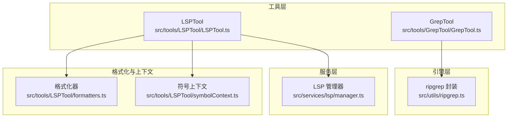
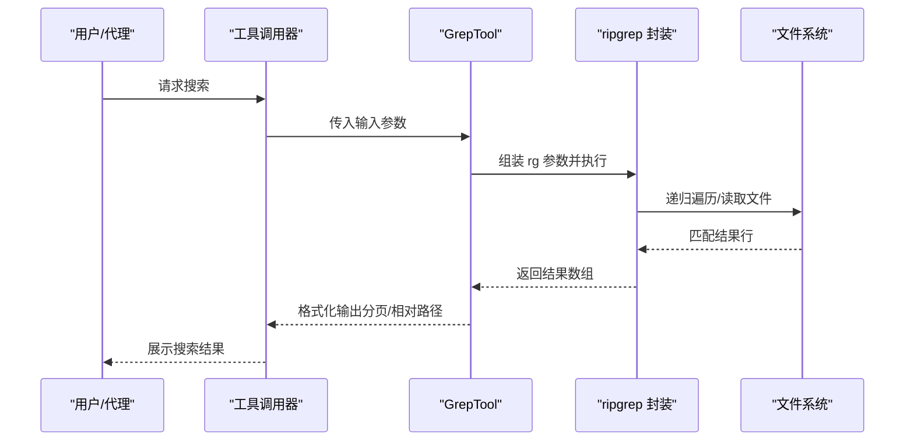
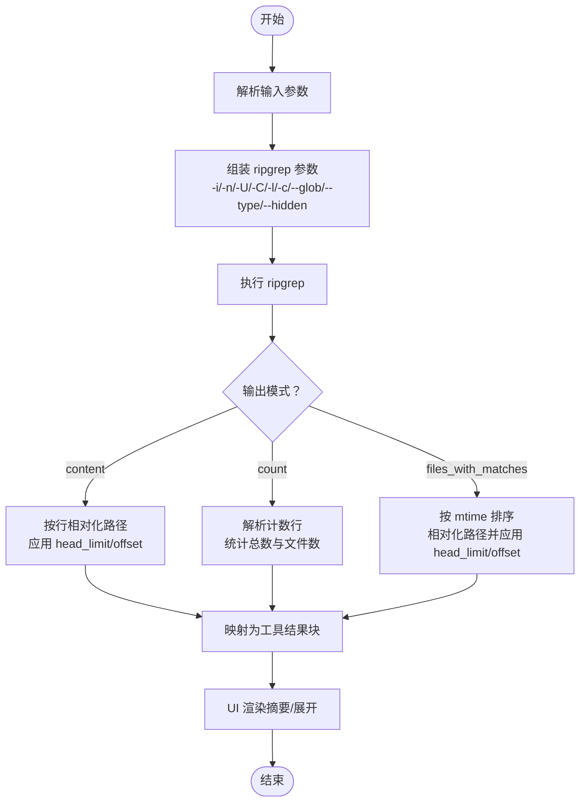
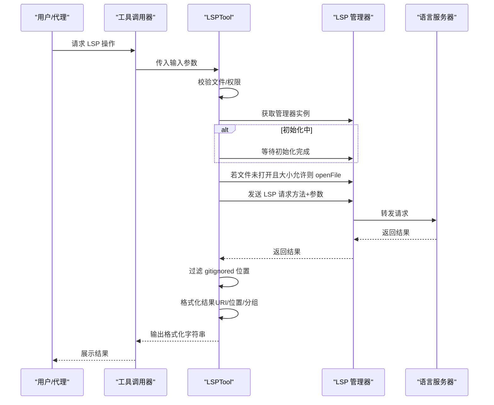
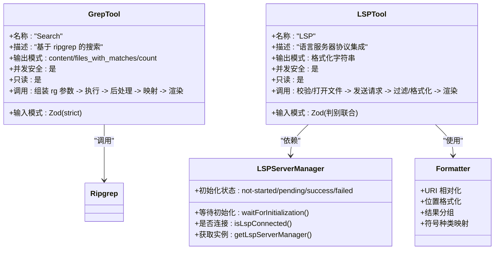
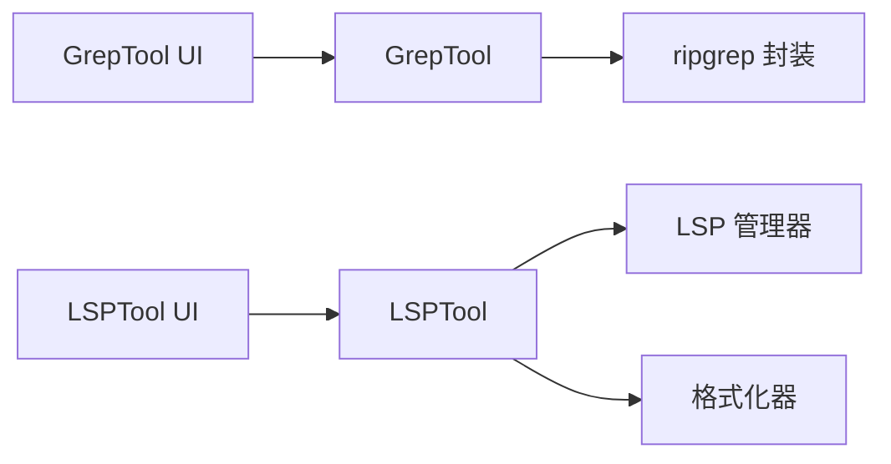

# 代码分析工具

<cite>
**本文档引用的文件**
- [GrepTool.ts](file://src/tools/GrepTool/GrepTool.ts)
- [prompt.ts](file://src/tools/GrepTool/prompt.ts)
- [UI.tsx](file://src/tools/GrepTool/UI.tsx)
- [ripgrep.ts](file://src/utils/ripgrep.ts)
- [LSPTool.ts](file://src/tools/LSPTool/LSPTool.ts)
- [prompt.ts](file://src/tools/LSPTool/prompt.ts)
- [schemas.ts](file://src/tools/LSPTool/schemas.ts)
- [formatters.ts](file://src/tools/LSPTool/formatters.ts)
- [symbolContext.ts](file://src/tools/LSPTool/symbolContext.ts)
- [UI.tsx](file://src/tools/LSPTool/UI.tsx)
- [manager.ts](file://src/services/lsp/manager.ts)
</cite>

## 目录
1. [简介](#简介)
2. [项目结构](#项目结构)
3. [核心组件](#核心组件)
4. [架构总览](#架构总览)
5. [详细组件分析](#详细组件分析)
6. [依赖关系分析](#依赖关系分析)
7. [性能考量](#性能考量)
8. [故障排查指南](#故障排查指南)
9. [结论](#结论)
10. [附录](#附录)

## 简介
本文件面向 Claude Code 的代码分析工具，系统性阐述两个关键工具：GrepTool（基于 ripgrep 的文本搜索工具）与 LSPTool（语言服务器协议集成工具）。内容涵盖功能特性、技术实现、数据流与处理逻辑、错误处理、性能优化与 IDE 集成方式，并提供可操作的使用示例与最佳实践。

## 项目结构
- 工具层位于 src/tools 下，分别提供 GrepTool 与 LSPTool 的完整实现（输入输出模式、权限校验、UI 渲染、调用流程等）。
- 搜索引擎层位于 src/utils，其中 ripgrep.ts 提供跨平台的 ripgrep 调用封装、超时控制、缓冲区管理与重试策略。
- LSP 层位于 src/services/lsp，提供 LSPServerManager 单例、初始化状态管理与连接健康检测。
- LSPTool 的格式化与上下文提取位于 src/tools/LSPTool 下的 formatters.ts 与 symbolContext.ts。

图表来源
- [GrepTool.ts:160-578](file://src/tools/GrepTool/GrepTool.ts#L160-L578)
- [ripgrep.ts:345-463](file://src/utils/ripgrep.ts#L345-L463)
- [LSPTool.ts:127-422](file://src/tools/LSPTool/LSPTool.ts#L127-L422)
- [manager.ts:63-208](file://src/services/lsp/manager.ts#L63-L208)
- [formatters.ts:1-593](file://src/tools/LSPTool/formatters.ts#L1-L593)
- [symbolContext.ts:21-91](file://src/tools/LSPTool/symbolContext.ts#L21-L91)

章节来源
- [GrepTool.ts:1-578](file://src/tools/GrepTool/GrepTool.ts#L1-L578)
- [LSPTool.ts:1-800](file://src/tools/LSPTool/LSPTool.ts#L1-L800)
- [ripgrep.ts:1-680](file://src/utils/ripgrep.ts#L1-L680)
- [manager.ts:1-290](file://src/services/lsp/manager.ts#L1-L290)

## 核心组件
- GrepTool：基于 ripgrep 的高性能文本搜索工具，支持正则表达式、多行匹配、文件类型过滤、glob 过滤、上下文行数、大小写不敏感、head_limit 分页与偏移、以及安全的路径解析与权限校验。
- LSPTool：通过 LSP 协议提供符号跳转、引用查找、悬停信息、文档/工作区符号、实现跳转、调用层次等能力，内置 URI 解析、位置转换、结果分组与格式化、忽略 gitignore 文件过滤、超大文件保护与错误处理。

章节来源
- [GrepTool.ts:160-578](file://src/tools/GrepTool/GrepTool.ts#L160-L578)
- [LSPTool.ts:127-422](file://src/tools/LSPTool/LSPTool.ts#L127-L422)

## 架构总览
GrepTool 与 LSPTool 均遵循统一的工具抽象 buildTool，具备输入/输出模式、权限校验、UI 渲染、只读与并发安全等通用能力；二者分别对接外部引擎（ripgrep）与 LSP 服务（LSPServerManager），并在调用前进行必要的前置准备（如打开文件、等待初始化）。

图表来源
- [GrepTool.ts:310-576](file://src/tools/GrepTool/GrepTool.ts#L310-L576)
- [ripgrep.ts:345-463](file://src/utils/ripgrep.ts#L345-L463)

章节来源
- [GrepTool.ts:310-576](file://src/tools/GrepTool/GrepTool.ts#L310-L576)
- [ripgrep.ts:345-463](file://src/utils/ripgrep.ts#L345-L463)

## 详细组件分析

### GrepTool：文本搜索与文件过滤
- 功能特性
  - 正则表达式搜索：基于 ripgrep，支持多行模式（-U --multiline-dotall）、大小写不敏感（-i）、行号（-n）等。
  - 输出模式：content（显示匹配行及上下文）、files_with_matches（仅文件名）、count（统计每文件匹配数）。
  - 文件过滤：glob 支持（逗号/花括号组合）、type 类型过滤、忽略 VCS 目录与自定义 ignore 规则、插件缓存排除目录。
  - 分页与截断：head_limit 控制输出条目数量，offset 支持分页；默认限制防止结果过大。
  - 安全与权限：UNC 路径跳过文件系统操作以避免凭据泄露；权限规则匹配；路径不存在时给出 CWD 建议。
- 数据流与处理逻辑
  - 输入参数解析与校验（Zod 模式）。
  - 组装 ripgrep 参数（含隐藏文件、VCS 排除、类型过滤、glob、忽略规则、多行标志等）。
  - 执行 ripgrep 并根据输出模式进行后处理：content 模式按行相对化路径并应用 head_limit；count 模式解析计数并统计文件数；files_with_matches 模式按修改时间排序并相对化路径。
  - 结果映射到工具消息块，UI 层渲染摘要与展开视图。
- 性能与优化
  - 使用 ripgrep 的高效文件遍历与正则匹配。
  - 默认限制 head_limit 与行宽（--max-columns 500）降低令牌占用。
  - 在 WSL 环境下延长超时时间，避免误判无匹配。
  - 对于大范围匹配，先应用 head_limit 再做相对化，减少无效处理。
- 错误处理
  - 路径不存在返回友好提示并建议在 CWD 下的替代路径。
  - ripgrep 超时抛出专用异常，区分“未完成”与“无匹配”。

图表来源
- [GrepTool.ts:310-576](file://src/tools/GrepTool/GrepTool.ts#L310-L576)
- [UI.tsx:165-187](file://src/tools/GrepTool/UI.tsx#L165-L187)

章节来源
- [GrepTool.ts:33-91](file://src/tools/GrepTool/GrepTool.ts#L33-L91)
- [GrepTool.ts:110-142](file://src/tools/GrepTool/GrepTool.ts#L110-L142)
- [GrepTool.ts:310-576](file://src/tools/GrepTool/GrepTool.ts#L310-L576)
- [UI.tsx:165-187](file://src/tools/GrepTool/UI.tsx#L165-L187)
- [prompt.ts:6-18](file://src/tools/GrepTool/prompt.ts#L6-L18)

### LSPTool：语言服务器协议集成
- 功能特性
  - 支持操作：goToDefinition、findReferences、hover、documentSymbol、workspaceSymbol、goToImplementation、prepareCallHierarchy、incomingCalls、outgoingCalls。
  - 输入约束：filePath（绝对或相对）、line/character（1 基位置）。
  - 权限与安全：文件存在性与类型校验；UNC 路径跳过文件系统访问；超大文件（>10MB）拒绝分析。
  - 结果格式化：URI 相对化、位置换算（1 基↔0 基）、按文件分组、符号种类映射、调用层次可视化。
  - 忽略过滤：对位置类结果（定义/引用/实现/工作区符号）使用 git check-ignore 过滤被忽略路径。
- 数据流与处理逻辑
  - 初始化状态检查：若处于 pending，等待初始化完成；若未初始化或失败，返回相应提示。
  - 文件打开与内容读取：若目标文件未在 LSP 中打开且小于阈值，则读取内容并 openFile。
  - LSP 请求发送：将操作映射为对应 LSP 方法（如 textDocument/definition），必要时两步获取调用层次。
  - 结果过滤与格式化：位置/URI 校验与过滤；按操作类型格式化输出；统计结果数与文件数。
  - 显示增强：符号上下文提取（在 UI 中展示“符号:xxx”而非纯位置）。
- 错误处理
  - 文件不可访问、非文件、LSP 未初始化、请求失败均记录日志并返回用户可读错误。
  - 对 malformed URI/位置进行防御性处理与告警日志。

图表来源
- [LSPTool.ts:224-414](file://src/tools/LSPTool/LSPTool.ts#L224-L414)
- [manager.ts:76-133](file://src/services/lsp/manager.ts#L76-L133)
- [formatters.ts:127-169](file://src/tools/LSPTool/formatters.ts#L127-L169)
- [symbolContext.ts:21-91](file://src/tools/LSPTool/symbolContext.ts#L21-L91)

章节来源
- [LSPTool.ts:59-126](file://src/tools/LSPTool/LSPTool.ts#L59-L126)
- [LSPTool.ts:224-414](file://src/tools/LSPTool/LSPTool.ts#L224-L414)
- [schemas.ts:8-191](file://src/tools/LSPTool/schemas.ts#L8-L191)
- [formatters.ts:19-72](file://src/tools/LSPTool/formatters.ts#L19-L72)
- [symbolContext.ts:21-91](file://src/tools/LSPTool/symbolContext.ts#L21-L91)
- [prompt.ts:1-21](file://src/tools/LSPTool/prompt.ts#L1-L21)

### 类关系与职责

图表来源
- [GrepTool.ts:160-578](file://src/tools/GrepTool/GrepTool.ts#L160-L578)
- [LSPTool.ts:127-422](file://src/tools/LSPTool/LSPTool.ts#L127-L422)
- [manager.ts:63-208](file://src/services/lsp/manager.ts#L63-L208)
- [formatters.ts:19-72](file://src/tools/LSPTool/formatters.ts#L19-L72)

章节来源
- [GrepTool.ts:160-578](file://src/tools/GrepTool/GrepTool.ts#L160-L578)
- [LSPTool.ts:127-422](file://src/tools/LSPTool/LSPTool.ts#L127-L422)
- [manager.ts:63-208](file://src/services/lsp/manager.ts#L63-L208)
- [formatters.ts:19-72](file://src/tools/LSPTool/formatters.ts#L19-L72)

## 依赖关系分析
- GrepTool 依赖 ripgrep 封装（跨平台二进制选择、超时/缓冲/重试、单线程回退、签名处理等），并通过权限与忽略规则增强安全性与准确性。
- LSPTool 依赖 LSP 管理器（单例、初始化状态、连接健康度），在调用前确保文件已打开且大小受控，随后进行结果过滤与格式化。
- UI 层负责将工具结果以摘要/展开形式呈现，并在错误时提供降级提示。

图表来源
- [GrepTool.ts:1-578](file://src/tools/GrepTool/GrepTool.ts#L1-L578)
- [ripgrep.ts:1-680](file://src/utils/ripgrep.ts#L1-L680)
- [LSPTool.ts:1-800](file://src/tools/LSPTool/LSPTool.ts#L1-L800)
- [manager.ts:1-290](file://src/services/lsp/manager.ts#L1-L290)
- [UI.tsx:1-201](file://src/tools/GrepTool/UI.tsx#L1-L201)
- [UI.tsx:1-228](file://src/tools/LSPTool/UI.tsx#L1-L228)

章节来源
- [GrepTool.ts:1-578](file://src/tools/GrepTool/GrepTool.ts#L1-L578)
- [ripgrep.ts:1-680](file://src/utils/ripgrep.ts#L1-L680)
- [LSPTool.ts:1-800](file://src/tools/LSPTool/LSPTool.ts#L1-L800)
- [manager.ts:1-290](file://src/services/lsp/manager.ts#L1-L290)
- [UI.tsx:1-201](file://src/tools/GrepTool/UI.tsx#L1-L201)
- [UI.tsx:1-228](file://src/tools/LSPTool/UI.tsx#L1-L228)

## 性能考量
- GrepTool
  - 使用 ripgrep 的原生高效遍历与正则匹配，避免 Node.js 文件系统扫描的性能瓶颈。
  - 默认 head_limit 与行宽限制，防止大结果集导致上下文膨胀。
  - 在 WSL 环境延长超时，避免误判无匹配。
  - 多行模式按需启用，避免不必要的跨行匹配开销。
- LSPTool
  - 仅在文件未打开且大小允许时才读取内容，避免不必要的 I/O。
  - 对位置类结果批量过滤 gitignored 文件，减少无关结果。
  - URI/位置格式化采用相对路径策略，降低令牌消耗。
  - 并发安全与只读属性保证多请求下的稳定性与一致性。

章节来源
- [GrepTool.ts:104-108](file://src/tools/GrepTool/GrepTool.ts#L104-L108)
- [ripgrep.ts:129-134](file://src/utils/ripgrep.ts#L129-L134)
- [LSPTool.ts:261-278](file://src/tools/LSPTool/LSPTool.ts#L261-L278)
- [LSPTool.ts:336-374](file://src/tools/LSPTool/LSPTool.ts#L336-L374)

## 故障排查指南
- GrepTool
  - 路径不存在：检查 CWD 下的相对路径或使用绝对路径；UNC 路径会跳过文件系统操作。
  - 无匹配但搜索未完成：ripgrep 超时会抛出专用异常，提示搜索可能匹配了文件但未在时限内完成。
  - 权限问题：确认工具权限与忽略规则配置，必要时调整 ignore patterns。
- LSPTool
  - LSP 未初始化：等待初始化完成或检查 LSP 服务器配置；若失败，查看日志定位原因。
  - 文件过大：超过 10MB 的文件会被拒绝分析，建议缩小范围或拆分文件。
  - 结果为空：确认符号位置是否正确（1 基输入需转换为 0 基），或 LSP 服务器是否支持该语言/操作。
  - gitignored 结果被过滤：确认目标文件是否被 .gitignore 排除，必要时调整忽略规则。

章节来源
- [GrepTool.ts:201-232](file://src/tools/GrepTool/GrepTool.ts#L201-L232)
- [ripgrep.ts:444-456](file://src/utils/ripgrep.ts#L444-L456)
- [LSPTool.ts:230-252](file://src/tools/LSPTool/LSPTool.ts#L230-L252)
- [LSPTool.ts:265-272](file://src/tools/LSPTool/LSPTool.ts#L265-L272)
- [LSPTool.ts:336-374](file://src/tools/LSPTool/LSPTool.ts#L336-L374)

## 结论
GrepTool 与 LSPTool 在 Claude Code 中分别承担“代码内容检索”与“代码智能分析”的核心职责。前者以 ripgrep 为核心，强调正则表达式、文件过滤与分页控制；后者以 LSP 为核心，强调符号语义、位置解析与结果格式化。两者均具备完善的权限与安全策略、错误处理与 UI 呈现，适合在大型项目中进行高效、稳定的代码探索与分析。

## 附录

### 使用示例与最佳实践
- 精确代码搜索
  - 使用 GrepTool 的正则表达式与 glob 过滤，结合 head_limit 与 offset 实现分页浏览。
  - 对跨行模式谨慎使用，仅在必要时开启 multiline。
- 查找特定符号
  - 使用 LSPTool 的 goToDefinition、findReferences、workspaceSymbol 等操作，配合符号上下文展示提升交互体验。
- 分析代码结构
  - 使用 documentSymbol 获取文档符号树，结合 hover 获取类型与注释信息。
- IDE 集成与扩展
  - 通过 LSP 管理器的初始化状态与连接检测，确保工具在 IDE 场景下的可用性。
  - 可扩展新的 LSP 操作或格式化规则，以适配更多语言与场景。

章节来源
- [prompt.ts:6-18](file://src/tools/GrepTool/prompt.ts#L6-L18)
- [prompt.ts:3-21](file://src/tools/LSPTool/prompt.ts#L3-L21)
- [manager.ts:76-133](file://src/services/lsp/manager.ts#L76-L133)