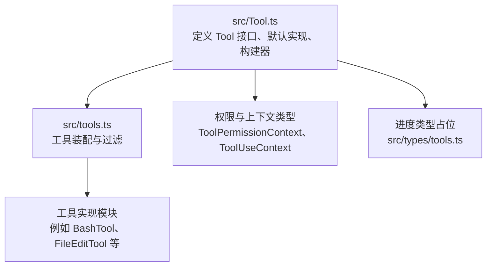
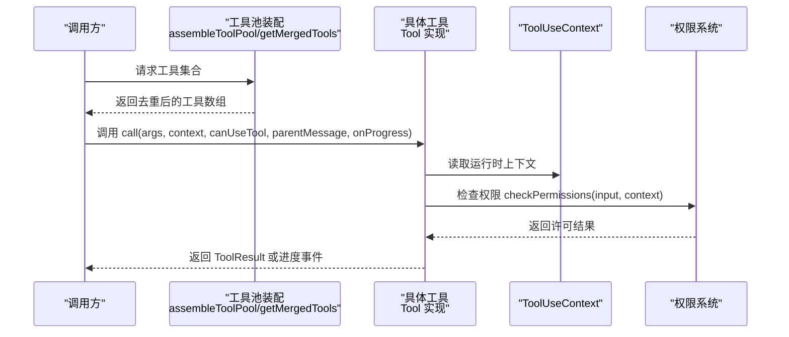
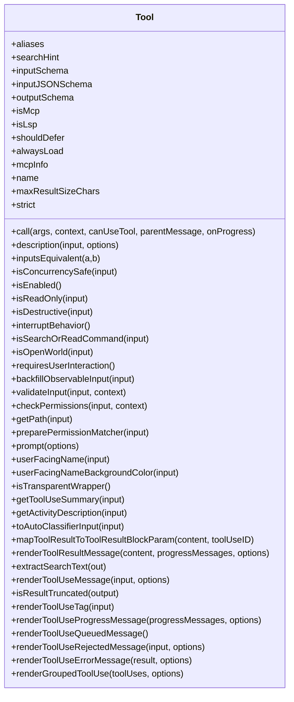
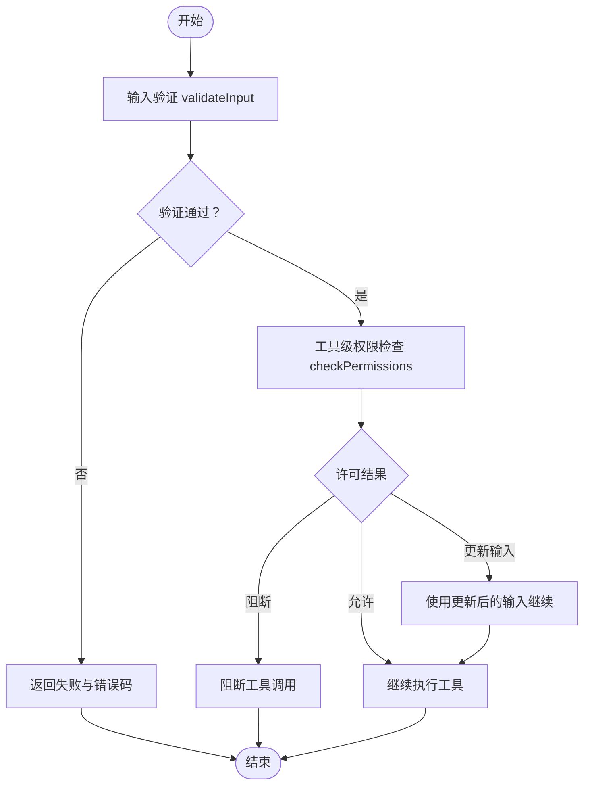
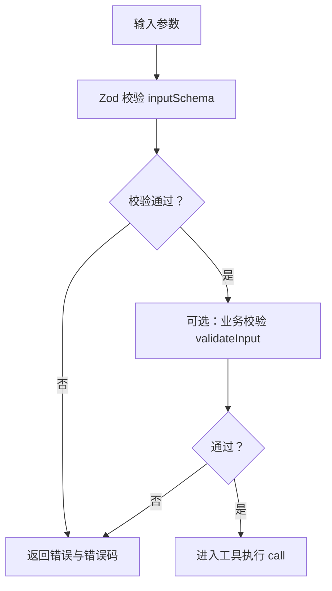
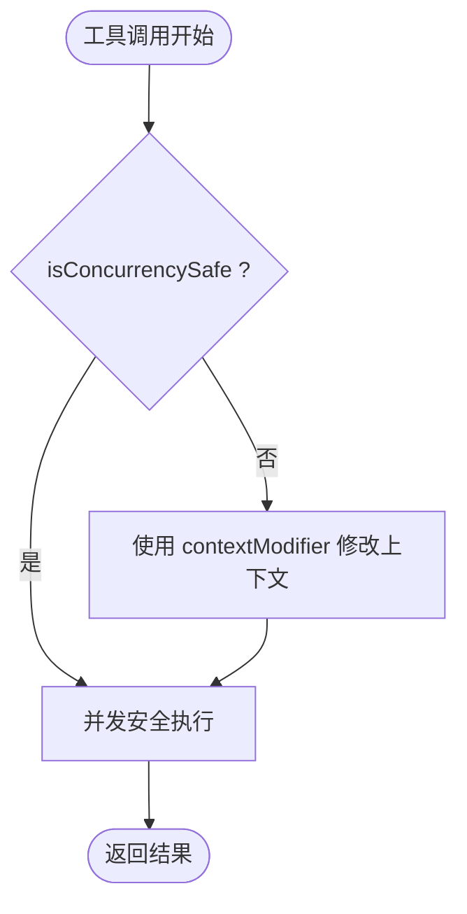
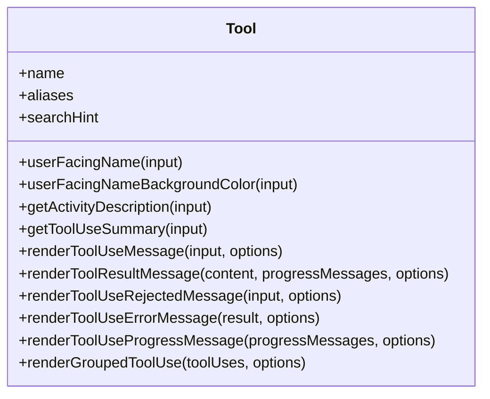
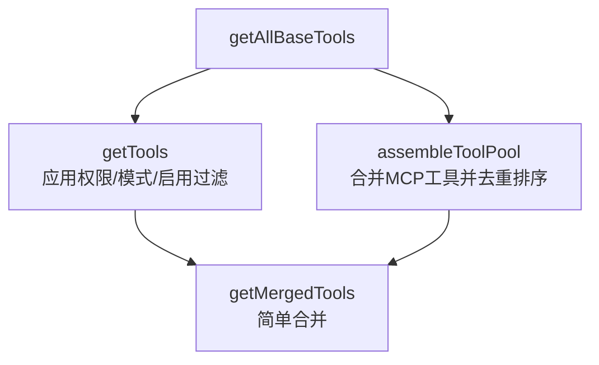
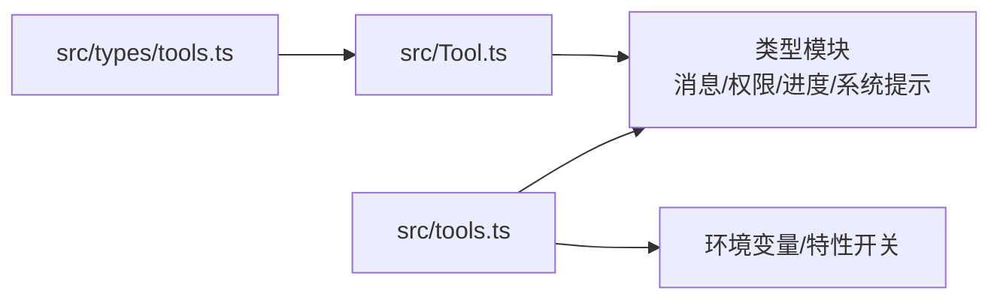

# 工具基类架构

<cite>
**本文引用的文件**
- [src/Tool.ts](file://src/Tool.ts)
- [src/tools.ts](file://src/tools.ts)
- [src/types/tools.ts](file://src/types/tools.ts)
</cite>

## 目录
1. [简介](#简介)
2. [项目结构](#项目结构)
3. [核心组件](#核心组件)
4. [架构总览](#架构总览)
5. [详细组件分析](#详细组件分析)
6. [依赖关系分析](#依赖关系分析)
7. [性能考量](#性能考量)
8. [故障排查指南](#故障排查指南)
9. [结论](#结论)
10. [附录](#附录)

## 简介
本文件系统性阐述 Claude Code 的工具基类架构，聚焦 Tool 接口的设计理念与核心能力，包括工具生命周期管理、权限控制机制、输入输出验证、并发安全策略、元数据与 UI 表达等。文档同时给出工具开发最佳实践、常见陷阱与性能优化建议，并通过图示展示关键流程与依赖关系。

## 项目结构
- 工具基类与类型定义集中在 src/Tool.ts，定义了 Tool 接口、工具上下文 ToolUseContext、权限上下文 ToolPermissionContext、进度类型等。
- 工具集合装配逻辑集中在 src/tools.ts，负责按环境与权限过滤工具、合并内置与 MCP 工具、去重与排序等。
- 进度类型占位在 src/types/tools.ts（自动生成桩），用于统一工具进度类型签名。

图表来源
- [src/Tool.ts:1-793](file://src/Tool.ts#L1-L793)
- [src/tools.ts:191-387](file://src/tools.ts#L191-L387)
- [src/types/tools.ts:1-13](file://src/types/tools.ts#L1-L13)

章节来源
- [src/Tool.ts:1-793](file://src/Tool.ts#L1-L793)
- [src/tools.ts:191-387](file://src/tools.ts#L191-L387)
- [src/types/tools.ts:1-13](file://src/types/tools.ts#L1-L13)

## 核心组件
- Tool 接口：定义工具的调用契约、描述生成、输入输出模式、权限检查、并发安全、只读/破坏性标记、中断行为、是否开放世界、是否搜索或读取命令、是否需要用户交互、是否 MCP/LSP、延迟加载策略、最大结果大小、严格模式、输入回填、输入校验、路径解析、权限匹配器、提示词生成、面向用户的名称与颜色、透明包装器、摘要与活动描述、自动分类器输入、结果映射、渲染管线、分组渲染、排队/拒绝/错误消息渲染等。
- ToolUseContext：工具调用时的运行时上下文，包含命令集、调试开关、模型、工具集合、思考配置、MCP 客户端与资源、非交互会话标记、代理定义、预算、系统提示覆盖、刷新工具回调、中止控制器、文件状态缓存、应用状态访问器、通知与系统消息追加、文件历史与归属更新、对话/会话标识、子代理信息、是否强制 canUseTool、消息列表、读写/全局限制、决策追踪、请求提示回调、工具使用 ID 管理、紧凑进度回调、SDK 状态、打开消息选择器、内容替换状态、冻结系统提示等。
- ToolPermissionContext：权限上下文，包含权限模式、附加工作目录、允许/禁止/询问规则映射、绕过权限模式可用性、自动化模式可用性、危险规则剥离、避免权限提示、在弹窗前等待自动化检测、计划模式前后权限模式保存等。
- buildTool：工具构建器，将部分定义与默认实现合并，确保所有可选的常用方法都有安全默认值，避免调用方重复空值检查。
- 工具集合装配：getAllBaseTools/getTools/assembleToolPool/getMergedTools 等函数，负责按环境与权限过滤工具、合并 MCP 工具、去重与排序，保证提示缓存稳定性与一致性。

章节来源
- [src/Tool.ts:362-695](file://src/Tool.ts#L362-L695)
- [src/Tool.ts:158-300](file://src/Tool.ts#L158-L300)
- [src/Tool.ts:123-148](file://src/Tool.ts#L123-L148)
- [src/Tool.ts:783-792](file://src/Tool.ts#L783-L792)
- [src/tools.ts:191-387](file://src/tools.ts#L191-L387)

## 架构总览
下图展示了工具调用从“装配工具池”到“执行工具”的整体流程，以及权限与上下文在其中的关键作用。

图表来源
- [src/tools.ts:343-365](file://src/tools.ts#L343-L365)
- [src/tools.ts:381-387](file://src/tools.ts#L381-L387)
- [src/Tool.ts:379-385](file://src/Tool.ts#L379-L385)
- [src/Tool.ts:500-503](file://src/Tool.ts#L500-L503)

## 详细组件分析

### Tool 接口与生命周期
- 生命周期阶段
  - 装配阶段：通过 assembleToolPool/getMergedTools 合并内置与 MCP 工具，按名称去重并排序，保证缓存稳定性。
  - 过滤阶段：根据 ToolPermissionContext 的 deny 规则与环境特性过滤工具。
  - 调用阶段：调用 call，期间可触发 onProgress 回调；若工具声明 isConcurrencySafe=false，则需考虑上下文修改与并发隔离。
  - 渲染阶段：根据 renderToolUseMessage/renderToolResultMessage 等方法生成 UI 内容；支持分组渲染与拒绝/错误消息定制。
- 关键方法与职责
  - call：执行工具逻辑，返回 ToolResult，可携带新消息与上下文修改器。
  - description：生成工具描述，供 ToolSearch 等场景使用。
  - inputSchema/outputSchema：定义输入输出模式，支持 Zod 类型与 JSON Schema。
  - checkPermissions：工具级权限判定，结合通用权限系统决定是否允许、更新输入或阻断。
  - isConcurrencySafe/isReadOnly/isDestructive：并发安全、只读与破坏性标记，影响 UI 与安全策略。
  - interruptBehavior：运行中被新消息打断的行为（取消/阻塞）。
  - isSearchOrReadCommand/isOpenWorld：用于 UI 收缩显示与开放世界工具识别。
  - validateInput：对输入进行业务校验，返回验证结果。
  - userFacingName/userFacingNameBackgroundColor：面向用户的名称与主题色。
  - renderToolUseMessage/renderToolResultMessage：消息与结果渲染。
  - renderToolUseProgressMessage/renderToolUseRejectedMessage/renderToolUseErrorMessage：进度、拒绝与错误 UI。
  - renderGroupedToolUse：批量工具使用分组渲染。
  - toAutoClassifierInput：自动分类器输入摘要。
  - mapToolResultToToolResultBlockParam：结果映射到 SDK 块参数。
  - backfillObservableInput：在观察者可见前填充输入字段。
  - preparePermissionMatcher：权限规则匹配器（用于 hook 条件）。
  - prompt/prompt 生成工具提示词。
  - getToolUseSummary/getActivityDescription：摘要与活动描述，用于紧凑视图与转盘提示。
  - isResultTruncated/renderToolUseTag：截断判断与标签渲染。
  - isTransparentWrapper：透明包装器标志。
  - shouldDefer/alwaysLoad：延迟加载与始终加载策略。
  - strict/maxResultSizeChars：严格模式与最大结果大小。
  - mcpInfo/isMcp/isLsp：MCP/LSP 标识与服务器信息。
  - getPath：当工具操作文件路径时提供路径解析。

图表来源
- [src/Tool.ts:362-695](file://src/Tool.ts#L362-L695)

章节来源
- [src/Tool.ts:362-695](file://src/Tool.ts#L362-L695)

### 权限控制机制
- 权限上下文 ToolPermissionContext 提供权限模式、附加工作目录、允许/禁止/询问规则映射、绕过权限模式可用性、避免权限提示、自动化检测前置等待、计划模式前后权限模式保存等。
- 工具级 checkPermissions 在通过输入验证后执行，返回 PermissionResult，决定允许、阻断或更新输入。
- 工具装配阶段通过 filterToolsByDenyRules 按规则剔除工具，确保模型不可见被全局禁止的工具。
- 可选 preparePermissionMatcher 为 hook 条件提供模式匹配闭包，提升权限规则表达力。

图表来源
- [src/Tool.ts:489-503](file://src/Tool.ts#L489-L503)
- [src/tools.ts:260-267](file://src/tools.ts#L260-L267)

章节来源
- [src/Tool.ts:123-148](file://src/Tool.ts#L123-L148)
- [src/Tool.ts:489-503](file://src/Tool.ts#L489-L503)
- [src/tools.ts:260-267](file://src/tools.ts#L260-L267)

### 输入输出验证与模式定义
- inputSchema 使用 Zod 类型定义输入结构，支持复杂嵌套与约束。
- inputJSONSchema 允许 MCP 工具直接提供 JSON Schema 形式的输入模式。
- outputSchema 定义输出模式，用于 SDK 结果映射与 UI 渲染。
- validateInput 可对输入进行业务层面的二次校验，返回 ValidationResult。
- buildTool 将部分定义与默认实现合并，确保常用方法有安全默认值，避免调用方重复空值检查。

图表来源
- [src/Tool.ts:394-403](file://src/Tool.ts#L394-L403)
- [src/Tool.ts:489-492](file://src/Tool.ts#L489-L492)
- [src/Tool.ts:783-792](file://src/Tool.ts#L783-L792)

章节来源
- [src/Tool.ts:394-403](file://src/Tool.ts#L394-L403)
- [src/Tool.ts:489-492](file://src/Tool.ts#L489-L492)
- [src/Tool.ts:783-792](file://src/Tool.ts#L783-L792)

### 并发安全与上下文修改
- isConcurrencySafe 用于声明工具是否可并发执行。若为 false，工具应在并发场景下谨慎共享状态，并可通过 ToolResult.contextModifier 对 ToolUseContext 进行局部修改。
- ToolUseContext 提供 setAppState/setAppStateForTasks/updateFileHistoryState/updateAttributionState 等状态更新入口，确保不同层级代理与任务能正确持久化状态。
- setInProgressToolUseIDs/setHasInterruptibleToolInProgress 等字段用于 UI 与交互状态管理。

图表来源
- [src/Tool.ts:402-402](file://src/Tool.ts#L402-L402)
- [src/Tool.ts:329-330](file://src/Tool.ts#L329-L330)
- [src/Tool.ts:158-300](file://src/Tool.ts#L158-L300)

章节来源
- [src/Tool.ts:402-402](file://src/Tool.ts#L402-L402)
- [src/Tool.ts:329-330](file://src/Tool.ts#L329-L330)
- [src/Tool.ts:158-300](file://src/Tool.ts#L158-L300)

### 工具元数据与 UI 表达
- 名称与别名：name 为主名称，aliases 为兼容性别名；工具查找与匹配基于两者。
- 搜索提示：searchHint 用于 ToolSearch 的关键词匹配。
- 用户界面名称：userFacingName 与 userFacingNameBackgroundColor 控制 UI 展示与主题色。
- 活动描述与摘要：getActivityDescription/getToolUseSummary 用于紧凑视图与转盘提示。
- 分组渲染：renderGroupedToolUse 支持批量工具使用分组展示。
- 消息与结果渲染：renderToolUseMessage/renderToolResultMessage 提供消息与结果的 React 渲染节点。
- 拒绝与错误 UI：renderToolUseRejectedMessage/renderToolUseErrorMessage 提供定制化拒绝与错误展示。
- 进度 UI：renderToolUseProgressMessage 提供进度条/转盘等 UI。

图表来源
- [src/Tool.ts:456-456](file://src/Tool.ts#L456-L456)
- [src/Tool.ts:371-371](file://src/Tool.ts#L371-L371)
- [src/Tool.ts:524-527](file://src/Tool.ts#L524-L527)
- [src/Tool.ts:546-548](file://src/Tool.ts#L546-L548)
- [src/Tool.ts:539-539](file://src/Tool.ts#L539-L539)
- [src/Tool.ts:605-608](file://src/Tool.ts#L605-L608)
- [src/Tool.ts:566-580](file://src/Tool.ts#L566-L580)
- [src/Tool.ts:639-653](file://src/Tool.ts#L639-L653)
- [src/Tool.ts:659-667](file://src/Tool.ts#L659-L667)
- [src/Tool.ts:625-634](file://src/Tool.ts#L625-L634)
- [src/Tool.ts:678-694](file://src/Tool.ts#L678-L694)

章节来源
- [src/Tool.ts:456-456](file://src/Tool.ts#L456-L456)
- [src/Tool.ts:371-371](file://src/Tool.ts#L371-L371)
- [src/Tool.ts:524-527](file://src/Tool.ts#L524-L527)
- [src/Tool.ts:546-548](file://src/Tool.ts#L546-L548)
- [src/Tool.ts:539-539](file://src/Tool.ts#L539-L539)
- [src/Tool.ts:605-608](file://src/Tool.ts#L605-L608)
- [src/Tool.ts:566-580](file://src/Tool.ts#L566-L580)
- [src/Tool.ts:639-653](file://src/Tool.ts#L639-L653)
- [src/Tool.ts:659-667](file://src/Tool.ts#L659-L667)
- [src/Tool.ts:625-634](file://src/Tool.ts#L625-L634)
- [src/Tool.ts:678-694](file://src/Tool.ts#L678-L694)

### 工具装配与合并
- getAllBaseTools：按环境特性组装基础工具集合，包含条件加载与特性开关。
- getTools：在基础工具上应用权限规则过滤、REPL 模式隐藏、isEnabled 过滤与去重。
- assembleToolPool：合并内置与 MCP 工具，按名称排序并去重，内置工具优先。
- getMergedTools：简单合并内置与 MCP 工具，不进行排序与去重。

图表来源
- [src/tools.ts:191-249](file://src/tools.ts#L191-L249)
- [src/tools.ts:269-325](file://src/tools.ts#L269-L325)
- [src/tools.ts:343-365](file://src/tools.ts#L343-L365)
- [src/tools.ts:381-387](file://src/tools.ts#L381-L387)

章节来源
- [src/tools.ts:191-249](file://src/tools.ts#L191-L249)
- [src/tools.ts:269-325](file://src/tools.ts#L269-L325)
- [src/tools.ts:343-365](file://src/tools.ts#L343-L365)
- [src/tools.ts:381-387](file://src/tools.ts#L381-L387)

## 依赖关系分析
- 工具接口依赖多个类型模块：消息类型、权限类型、进度类型、系统提示类型、文件状态缓存、提交归属、主题等。
- 工具装配依赖环境变量与特性开关，动态引入特定工具模块。
- 进度类型在 src/types/tools.ts 中占位，后续由真实实现替换。

图表来源
- [src/Tool.ts:15-88](file://src/Tool.ts#L15-L88)
- [src/tools.ts:14-153](file://src/tools.ts#L14-L153)
- [src/types/tools.ts:1-13](file://src/types/tools.ts#L1-L13)

章节来源
- [src/Tool.ts:15-88](file://src/Tool.ts#L15-L88)
- [src/tools.ts:14-153](file://src/tools.ts#L14-L153)
- [src/types/tools.ts:1-13](file://src/types/tools.ts#L1-L13)

## 性能考量
- 缓存与去重：assembleToolPool 对内置与 MCP 工具分别排序后去重，内置工具保持连续前缀，避免提示缓存键失效。
- 最大结果大小：maxResultSizeChars 控制工具结果持久化阈值，避免循环读取与过度内存占用。
- 并发安全：isConcurrencySafe=false 的工具应避免共享状态，必要时使用 contextModifier 进行上下文隔离。
- 输入验证：尽早进行 validateInput 与 Zod 校验，减少无效调用开销。
- UI 渲染：合理使用 renderToolUseMessage/renderToolResultMessage，避免一次性渲染超大数据量。

## 故障排查指南
- 权限相关
  - 若工具被模型看到但无法调用，检查 ToolPermissionContext 的 deny 规则与工具名称匹配。
  - 工具级 checkPermissions 返回阻断时，确认输入是否被正确更新或是否需要用户交互。
- 输入验证
  - validateInput 报错时，核对输入结构与业务约束，确保与 inputSchema/outputSchema 一致。
- 并发问题
  - 非并发安全工具在多实例场景下出现竞态，应设置 isConcurrencySafe=false 并使用 contextModifier。
- 渲染问题
  - 结果未显示或显示异常，检查 renderToolResultMessage 与 extractSearchText 是否正确实现。
- 工具装配
  - 工具缺失或重复，检查 assembleToolPool 的去重与排序逻辑，确保内置工具优先。

章节来源
- [src/tools.ts:260-267](file://src/tools.ts#L260-L267)
- [src/Tool.ts:489-503](file://src/Tool.ts#L489-L503)
- [src/Tool.ts:329-330](file://src/Tool.ts#L329-L330)
- [src/Tool.ts:566-580](file://src/Tool.ts#L566-L580)
- [src/Tool.ts:599-599](file://src/Tool.ts#L599-L599)
- [src/tools.ts:343-365](file://src/tools.ts#L343-L365)

## 结论
Claude Code 的工具基类通过清晰的接口设计、完善的权限与上下文体系、严格的输入输出模式与并发安全策略，提供了高扩展性与强一致性的工具生态。开发者应遵循默认实现与装配流程，合理使用权限与验证机制，关注性能与 UI 渲染细节，以构建稳定可靠的工具实现。

## 附录
- 工具开发最佳实践
  - 使用 buildTool 合并默认实现，避免重复空值检查。
  - 明确定义 inputSchema 与 outputSchema，必要时提供 inputJSONSchema。
  - 实现 validateInput 与 checkPermissions，确保输入合法与权限合规。
  - 正确设置 isConcurrencySafe/isReadOnly/isDestructive，影响 UI 与安全策略。
  - 提供 userFacingName/getActivityDescription/getToolUseSummary 等 UI 相关方法。
  - 合理使用 contextModifier 与 ToolUseContext，确保并发安全与状态一致性。
- 常见陷阱
  - 忽略权限规则导致工具被阻断或绕过。
  - 不设置 isConcurrencySafe 导致并发竞态。
  - 输出过大未设置 maxResultSizeChars，引发内存与循环读取问题。
  - 渲染方法未实现导致 UI 不显示或显示异常。
  - 工具装配未去重或排序，破坏提示缓存稳定性。