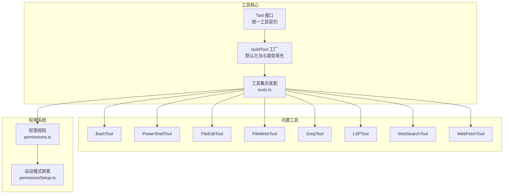
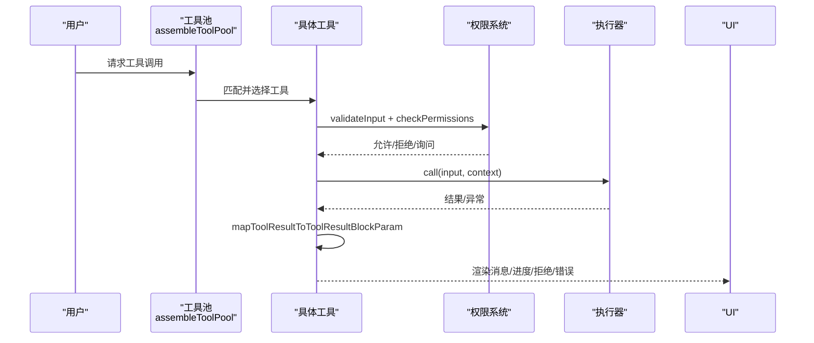
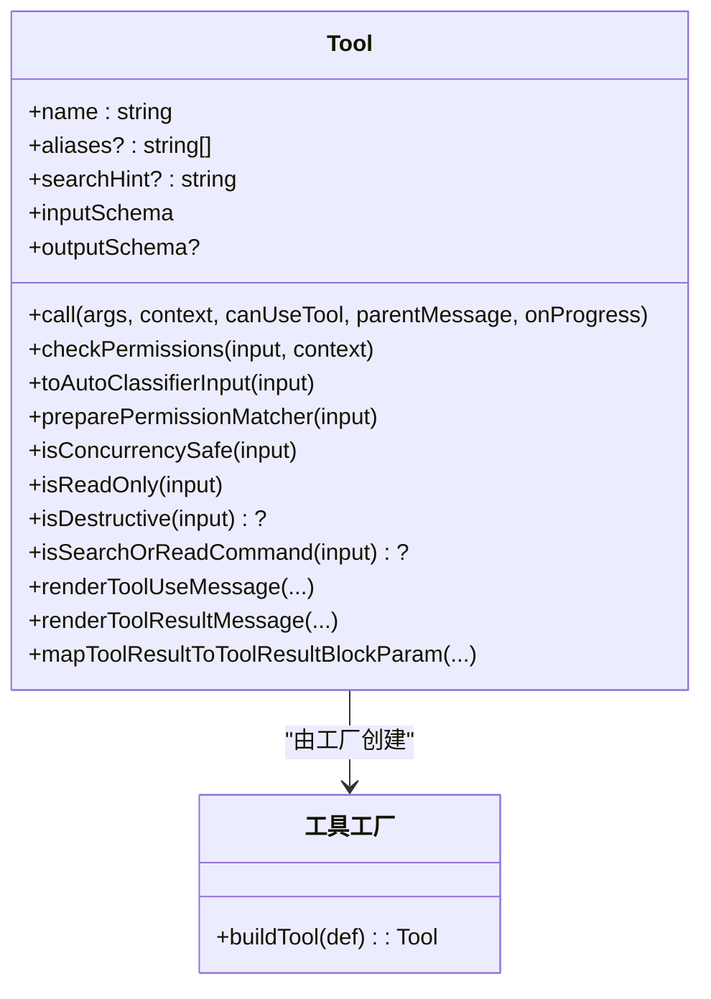
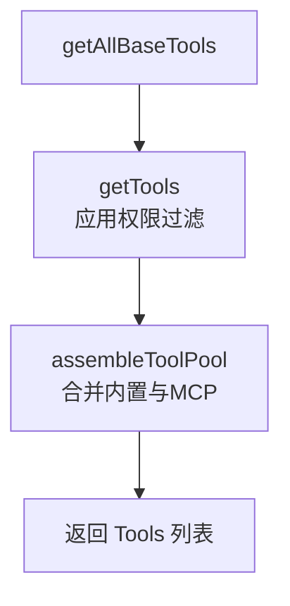
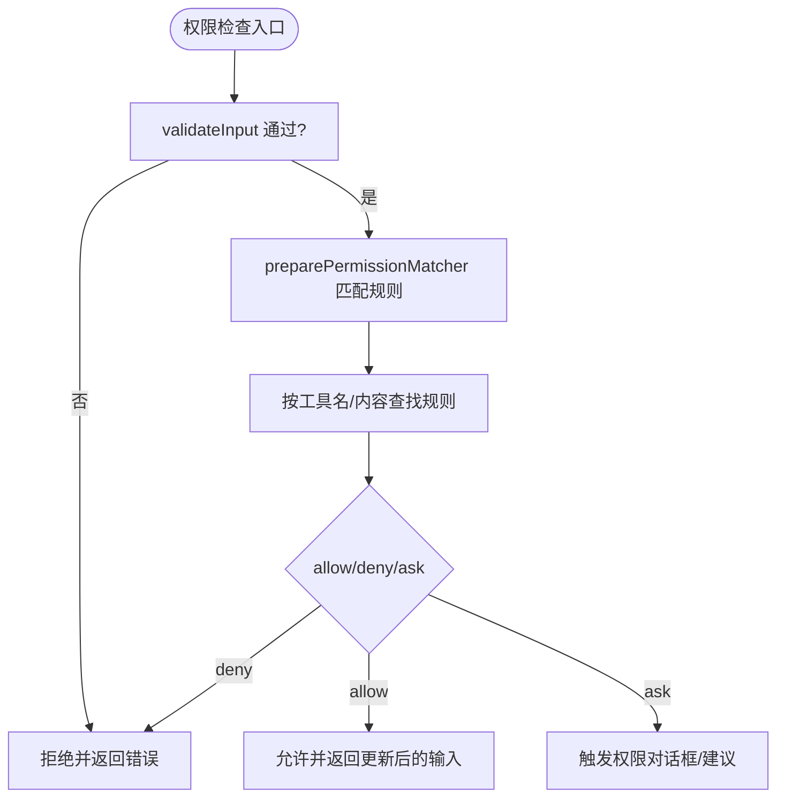
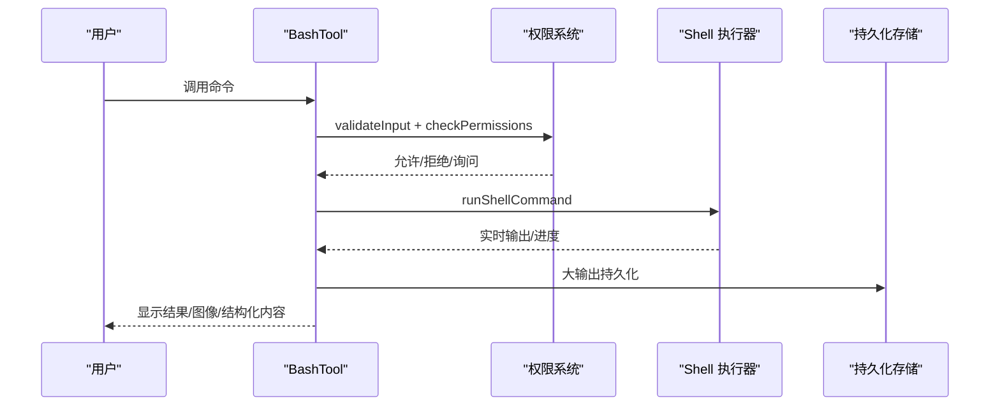
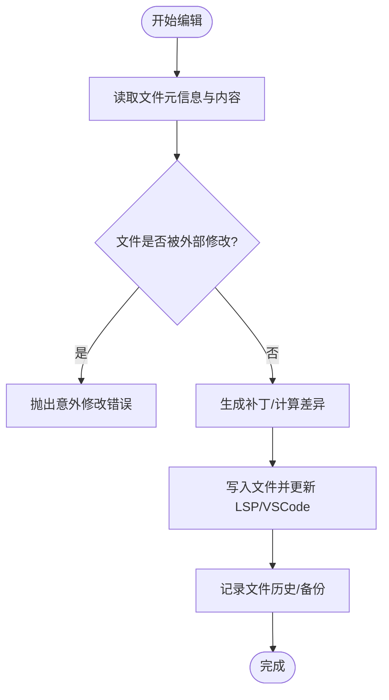
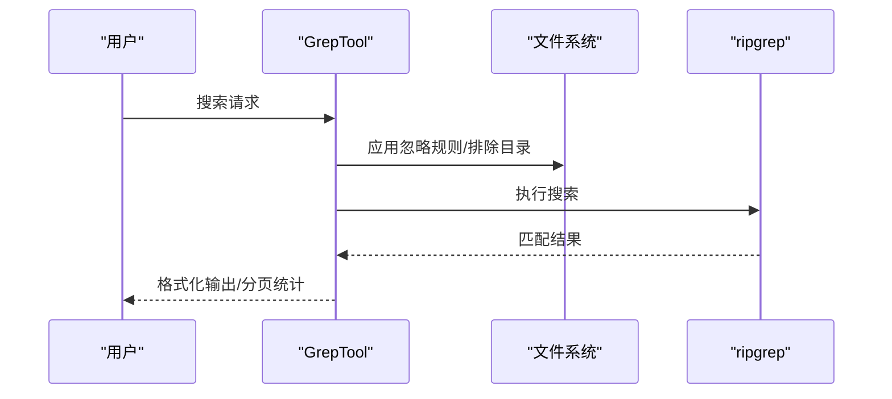
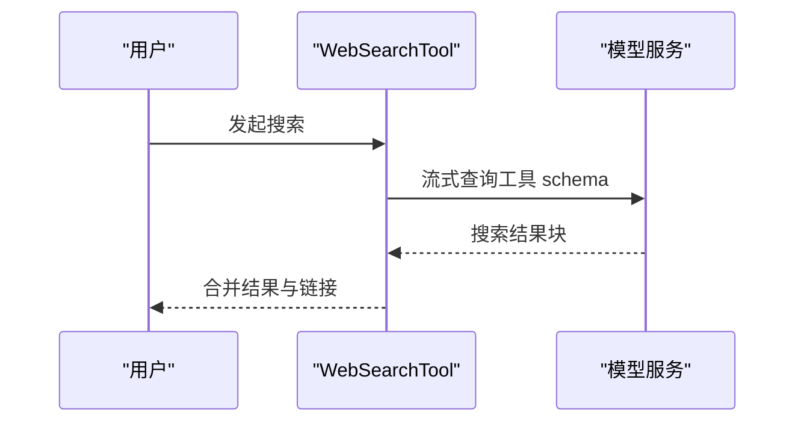
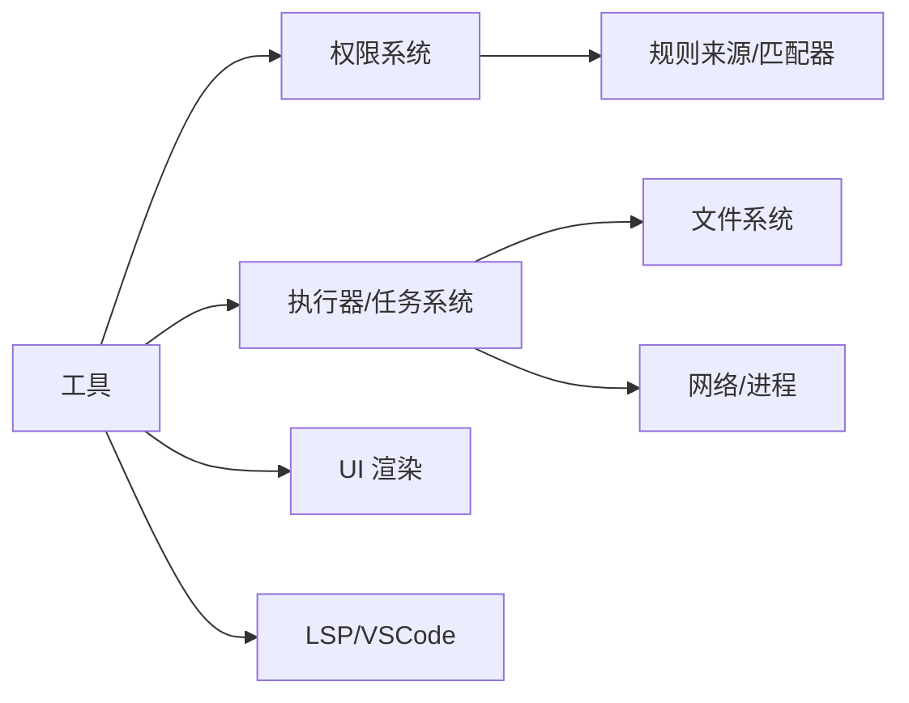

# 工具集成系统

<cite>
**本文档引用的文件**
- [src/Tool.ts](file://src/Tool.ts)
- [src/tools.ts](file://src/tools.ts)
- [src/tools/BashTool/BashTool.tsx](file://src/tools/BashTool/BashTool.tsx)
- [src/tools/PowerShellTool/PowerShellTool.tsx](file://src/tools/PowerShellTool/PowerShellTool.tsx)
- [src/tools/FileEditTool/FileEditTool.ts](file://src/tools/FileEditTool/FileEditTool.ts)
- [src/tools/FileWriteTool/FileWriteTool.ts](file://src/tools/FileWriteTool/FileWriteTool.ts)
- [src/tools/GrepTool/GrepTool.ts](file://src/tools/GrepTool/GrepTool.ts)
- [src/tools/LSPTool/LSPTool.ts](file://src/tools/LSPTool/LSPTool.ts)
- [src/tools/WebSearchTool/WebSearchTool.ts](file://src/tools/WebSearchTool/WebSearchTool.ts)
- [src/tools/WebFetchTool/WebFetchTool.ts](file://src/tools/WebFetchTool/WebFetchTool.ts)
- [src/utils/permissions/permissions.ts](file://src/utils/permissions/permissions.ts)
- [src/utils/permissions/permissionSetup.ts](file://src/utils/permissions/permissionSetup.ts)
</cite>

## 目录
1. [简介](#简介)
2. [项目结构](#项目结构)
3. [核心组件](#核心组件)
4. [架构总览](#架构总览)
5. [详细组件分析](#详细组件分析)
6. [依赖关系分析](#依赖关系分析)
7. [性能考虑](#性能考虑)
8. [故障排除指南](#故障排除指南)
9. [结论](#结论)
10. [附录](#附录)

## 简介
本文件系统性阐述 Claude Code 的工具集成系统，覆盖工具基类设计、工具注册机制、权限控制模型与安全策略，并深入解析内置工具的实现原理与使用场景，包括 Shell 工具（BashTool、PowerShellTool）、文件编辑工具（FileEditTool、FileWriteTool）、代码搜索工具（GrepTool、LSPTool）、Web 搜索工具（WebSearchTool、WebFetchTool）。文档同时提供工具生命周期管理、开发指南与性能优化建议。

## 项目结构
工具系统围绕统一的 Tool 接口构建，通过工具工厂函数 buildTool 提供默认行为与类型安全；工具集合由 tools.ts 统一装配，支持按权限上下文过滤、MCP 工具合并与去重；权限控制贯穿输入校验、权限匹配器、自动模式安全剥离与危险规则恢复。

**图表来源**
- [src/Tool.ts:362-793](file://src/Tool.ts#L362-L793)
- [src/tools.ts:191-387](file://src/tools.ts#L191-L387)
- [src/utils/permissions/permissions.ts:107-390](file://src/utils/permissions/permissions.ts#L107-L390)
- [src/utils/permissions/permissionSetup.ts:505-579](file://src/utils/permissions/permissionSetup.ts#L505-L579)

**章节来源**
- [src/Tool.ts:1-793](file://src/Tool.ts#L1-L793)
- [src/tools.ts:1-388](file://src/tools.ts#L1-L388)

## 核心组件
- Tool 基类与工具定义
  - Tool 定义了工具的输入输出模式、权限检查、UI 渲染、进度回调、并发安全与只读判定等能力边界。
  - buildTool 提供安全默认值（如默认允许、非并发安全、非破坏性、自动分类输入为空字符串等），确保工具实现最小化样板代码。
  - 工具上下文 ToolUseContext 提供运行时环境（命令列表、调试开关、MCP 客户端、文件读取缓存、消息流、预算限制等）。
- 工具注册与装配
  - getAllBaseTools 提供当前环境可用的全部内置工具清单，结合特性开关与环境变量进行裁剪。
  - getTools 进一步根据权限上下文过滤（黑名单规则、REPL 隐藏、简单模式等）。
  - assembleToolPool 将内置工具与 MCP 工具合并，保持内置工具前缀连续以稳定提示缓存键。
- 权限控制模型
  - ToolPermissionContext 描述权限模式、附加工作目录、允许/拒绝/询问规则源、是否可绕过等。
  - 权限规则来源包括设置、CLI 参数、会话等；支持按工具名与内容匹配（如 Bash(git *)）。
  - 自动模式下对危险规则进行剥离并在退出时恢复，避免绕过分类器。

**章节来源**
- [src/Tool.ts:362-793](file://src/Tool.ts#L362-L793)
- [src/tools.ts:191-387](file://src/tools.ts#L191-L387)
- [src/utils/permissions/permissions.ts:107-390](file://src/utils/permissions/permissions.ts#L107-L390)
- [src/utils/permissions/permissionSetup.ts:505-579](file://src/utils/permissions/permissionSetup.ts#L505-L579)

## 架构总览
工具调用从“选择工具—输入校验—权限决策—执行—结果映射—UI 渲染”形成闭环。权限系统在 validateInput 之后、执行之前介入，支持细粒度的路径/命令匹配与自动模式安全控制。

**图表来源**
- [src/tools.ts:343-365](file://src/tools.ts#L343-L365)
- [src/Tool.ts:379-503](file://src/Tool.ts#L379-L503)

## 详细组件分析

### Tool 基类与工厂
- 关键能力
  - 输入/输出模式：inputSchema、outputSchema；严格模式（strict）增强参数约束。
  - 并发与只读：isConcurrencySafe、isReadOnly、isDestructive 控制调度与安全。
  - 权限与分类：checkPermissions、toAutoClassifierInput、preparePermissionMatcher 支持规则匹配。
  - UI 与展示：renderToolUseMessage、renderToolResultMessage、renderToolUseProgressMessage 等。
  - 生命周期钩子：validateInput、getPath、inputsEquivalent、interruptBehavior、isSearchOrReadCommand 等。
- 默认行为
  - 默认允许、非并发安全、非破坏性、自动分类输入为空字符串、用户可见名为工具名。
- 上下文
  - ToolUseContext 提供命令集、MCP 客户端、文件状态缓存、消息流、预算限制、请求提示器等。

**图表来源**
- [src/Tool.ts:362-793](file://src/Tool.ts#L362-L793)

**章节来源**
- [src/Tool.ts:362-793](file://src/Tool.ts#L362-L793)

### 工具注册与装配
- getAllBaseTools：聚合所有内置工具，依据特性开关与环境变量启用/禁用。
- getTools：按权限上下文过滤（黑名单、REPL 隐藏、简单模式、特性开关）。
- assembleToolPool：合并内置与 MCP 工具，按名称排序并去重，内置工具前缀保持稳定以保护系统提示缓存。
- 过滤逻辑：filterToolsByDenyRules 基于规则匹配屏蔽工具；REPL 模式隐藏原始工具。

**图表来源**
- [src/tools.ts:191-387](file://src/tools.ts#L191-L387)

**章节来源**
- [src/tools.ts:191-387](file://src/tools.ts#L191-L387)

### 权限控制模型
- 规则来源与匹配
  - 规则来源：设置、CLI 参数、命令、会话；支持 allow/deny/ask 三态。
  - 匹配器：preparePermissionMatcher 支持通配符与前缀匹配（如 Bash(git *)）。
  - 工具级匹配：getRuleByContentsForToolName 按工具名与规则内容检索。
- 自动模式安全
  - stripDangerousPermissionsForAutoMode：剥离可能绕过分类器的危险规则，并记录到 stippedDangerousRules。
  - restoreDangerousPermissions：退出自动模式时恢复被剥离规则。
- 权限提示与建议
  - checkPermissions 返回行为与建议（添加规则、本地设置等），用于 UI 引导授权。

**图表来源**
- [src/utils/permissions/permissions.ts:107-390](file://src/utils/permissions/permissions.ts#L107-L390)
- [src/utils/permissions/permissionSetup.ts:505-579](file://src/utils/permissions/permissionSetup.ts#L505-L579)

**章节来源**
- [src/utils/permissions/permissions.ts:107-390](file://src/utils/permissions/permissions.ts#L107-L390)
- [src/utils/permissions/permissionSetup.ts:505-579](file://src/utils/permissions/permissionSetup.ts#L505-L579)

### Shell 工具：BashTool 与 PowerShellTool
- 设计要点
  - 并发安全：基于 isReadOnly 与只读约束判断是否并发安全。
  - 只读判定：复杂命令通过 AST/正则检测安全风险，同步阶段仅做启发式，最终在权限流程中完成细粒度判定。
  - 搜索/读取折叠：isSearchOrReadCommand 基于命令集与管道语义判断 UI 折叠。
  - 背景任务：run_in_background 支持后台执行，超时/阻塞预算触发自动后台化。
  - 大输出持久化：超过阈值时写入磁盘并生成预览，避免内存溢出。
  - 图像输出压缩：对图像输出进行尺寸与大小压缩，保证传输效率。
  - 安全沙箱：在支持平台启用沙箱包装，Windows 原生不支持时遵循企业策略拒绝执行。
- 执行流程
  - validateInput：阻断长时间睡眠等阻塞命令；Windows 沙箱策略检查。
  - checkPermissions：AST 解析与规则匹配，支持通配符与前缀匹配。
  - call：异步生成器驱动执行，实时上报进度；失败时抛出 ShellError。
  - 结果映射：mapToolResultToToolResultBlockParam 输出文本/图像/结构化内容或持久化路径。

**图表来源**
- [src/tools/BashTool/BashTool.tsx:624-800](file://src/tools/BashTool/BashTool.tsx#L624-L800)
- [src/tools/PowerShellTool/PowerShellTool.tsx:437-662](file://src/tools/PowerShellTool/PowerShellTool.tsx#L437-L662)

**章节来源**
- [src/tools/BashTool/BashTool.tsx:420-800](file://src/tools/BashTool/BashTool.tsx#L420-L800)
- [src/tools/PowerShellTool/PowerShellTool.tsx:272-662](file://src/tools/PowerShellTool/PowerShellTool.tsx#L272-L662)

### 文件编辑工具：FileEditTool 与 FileWriteTool
- 设计要点
  - 一致性与原子性：读取-校验-写入-通知 LSP 的顺序避免并发写入导致的状态不一致。
  - 内容比较：基于时间戳与内容哈希对比，防止文件在读取后被外部修改。
  - 编码与行尾：读取时检测编码与行尾，写回时保持一致性。
  - Git Diff：可选计算单文件 Git Diff，用于结果摘要与审计。
  - 技能发现：编辑文件时触发技能目录发现与加载，支持动态技能注入。
  - 权限与规则：基于路径匹配规则与文件系统权限检查，支持 UNC 路径安全处理。
- FileEditTool
  - 支持部分替换与全量替换；对引号风格进行保留与规范化。
  - 输入校验：空旧串、不存在文件、笔记本文件、未读取文件、多处匹配等场景的明确提示。
- FileWriteTool
  - 全量覆盖写入；对新文件与更新文件分别统计行变更。
  - 输入校验：路径合法性、权限拒绝、未读取文件、时间戳不一致等。

**图表来源**
- [src/tools/FileEditTool/FileEditTool.ts:387-574](file://src/tools/FileEditTool/FileEditTool.ts#L387-L574)
- [src/tools/FileWriteTool/FileWriteTool.ts:223-417](file://src/tools/FileWriteTool/FileWriteTool.ts#L223-L417)

**章节来源**
- [src/tools/FileEditTool/FileEditTool.ts:86-595](file://src/tools/FileEditTool/FileEditTool.ts#L86-L595)
- [src/tools/FileWriteTool/FileWriteTool.ts:94-434](file://src/tools/FileWriteTool/FileWriteTool.ts#L94-L434)

### 代码搜索工具：GrepTool 与 LSPTool
- GrepTool（ripgrep）
  - 模式：content/files_with_matches/count 三种输出模式，支持上下文行数、大小写忽略、类型过滤、多 glob。
  - 限制：默认 head_limit 与 offset 分页；自动排除版本控制目录与插件孤儿目录。
  - 权限：基于读取权限与忽略规则，支持 UNC 路径安全跳过。
  - 结果：相对路径显示、排序（最近修改时间）、分页与统计。
- LSPTool
  - 操作：定义/引用/悬停/符号/实现/调用层次等。
  - 连接：延迟等待 LSP 初始化；文件过大（>10MB）直接拒绝。
  - 过滤：对 gitignore 的位置结果进行过滤，避免噪声。
  - 结果：格式化输出，统计结果数量与文件数量。

**图表来源**
- [src/tools/GrepTool/GrepTool.ts:310-576](file://src/tools/GrepTool/GrepTool.ts#L310-L576)
- [src/tools/LSPTool/LSPTool.ts:224-421](file://src/tools/LSPTool/LSPTool.ts#L224-L421)

**章节来源**
- [src/tools/GrepTool/GrepTool.ts:160-577](file://src/tools/GrepTool/GrepTool.ts#L160-L577)
- [src/tools/LSPTool/LSPTool.ts:127-800](file://src/tools/LSPTool/LSPTool.ts#L127-L800)

### Web 搜索工具：WebSearchTool 与 WebFetchTool
- WebSearchTool
  - 功能：通过模型流式发起网络搜索，支持域名白名单/黑名单、最大使用次数限制。
  - 权限：需要显式授权（ask 行为），返回建议添加规则。
  - 进度：实时上报查询更新与结果到达事件，支持思考配置切换。
- WebFetchTool
  - 功能：抓取 URL 内容并应用提示词提取摘要；支持预批准主机与内容类型优化。
  - 权限：预批准主机直接放行；否则按主机域匹配规则（deny/ask/allow）决定。
  - 重定向：检测跨主机重定向并提示用户改用新 URL 重新调用。
  - 大对象：二进制内容保存到磁盘并提示路径。

**图表来源**
- [src/tools/WebSearchTool/WebSearchTool.ts:254-400](file://src/tools/WebSearchTool/WebSearchTool.ts#L254-L400)
- [src/tools/WebFetchTool/WebFetchTool.ts:208-298](file://src/tools/WebFetchTool/WebFetchTool.ts#L208-L298)

**章节来源**
- [src/tools/WebSearchTool/WebSearchTool.ts:152-436](file://src/tools/WebSearchTool/WebSearchTool.ts#L152-L436)
- [src/tools/WebFetchTool/WebFetchTool.ts:66-307](file://src/tools/WebFetchTool/WebFetchTool.ts#L66-L307)

## 依赖关系分析
- 工具到权限
  - 工具通过 checkPermissions 与 preparePermissionMatcher 与权限系统交互；权限系统提供规则来源、匹配器与自动模式剥离。
- 工具到执行器
  - Shell 工具通过 exec 与任务系统协作；文件工具通过文件系统与 LSP/VSCode 通信；搜索工具通过 ripgrep 与 LSP 管理器。
- 工具到 UI
  - 工具提供渲染函数与进度回调，UI 层负责展示与交互；大输出通过持久化存储桥接。

**图表来源**
- [src/Tool.ts:379-503](file://src/Tool.ts#L379-L503)
- [src/tools.ts:343-365](file://src/tools.ts#L343-L365)

**章节来源**
- [src/Tool.ts:379-503](file://src/Tool.ts#L379-L503)
- [src/tools.ts:343-365](file://src/tools.ts#L343-L365)

## 性能考虑
- 输出阈值与持久化
  - 工具通过 maxResultSizeChars 与持久化阈值（如 20K/30K/100K 字符）控制内联输出大小，超过阈值写入磁盘并通过预览展示。
- 搜索与读取优化
  - GrepTool 默认 head_limit 与 offset 分页，ripgrep 限制行宽与排除目录，减少噪声与内存占用。
  - LSPTool 对 gitignore 结果进行过滤，避免无效位置干扰。
- Shell 工具
  - 大输出采用硬链接/复制到工具结果目录，限制最大持久化大小（如 64MB）；图像输出进行尺寸与大小压缩。
  - 自动后台化与阻塞预算（如 15 秒）提升交互响应性。
- 权限与安全
  - 自动模式剥离危险规则避免绕过分类器；UNC/Windows 策略拒绝降低安全风险。

[本节为通用指导，无需特定文件引用]

## 故障排除指南
- 文件编辑失败
  - “文件已被修改”：读取时间戳与内容不一致，需重新读取后再写入。
  - “未读取文件”：先使用 FileReadTool 读取再写入。
  - “笔记本文件”：使用 NotebookEditTool 替代。
- Shell 工具
  - “命令被中断”：检查是否被新消息打断；查看 persistedOutputPath 获取完整输出。
  - “图像输出未显示”：确认 isImage 与压缩结果，必要时调整输出大小。
  - “Windows 沙箱策略拒绝”：检查企业策略与平台支持。
- 权限问题
  - “被拒绝/需要授权”：根据 suggestions 添加规则或在本地设置中放行。
  - “自动模式规则被剥离”：退出自动模式后规则恢复。
- Web 工具
  - “跨主机重定向”：按提示使用新 URL 重新调用 WebFetch。
  - “搜索无结果”：检查 allowed_domains/blocked_domains 是否冲突。

**章节来源**
- [src/tools/FileEditTool/FileEditTool.ts:137-361](file://src/tools/FileEditTool/FileEditTool.ts#L137-L361)
- [src/tools/BashTool/BashTool.tsx:624-800](file://src/tools/BashTool/BashTool.tsx#L624-L800)
- [src/utils/permissions/permissionSetup.ts:505-579](file://src/utils/permissions/permissionSetup.ts#L505-L579)
- [src/tools/WebFetchTool/WebFetchTool.ts:208-298](file://src/tools/WebFetchTool/WebFetchTool.ts#L208-L298)

## 结论
工具集成系统以 Tool 为核心抽象，配合 buildTool 的默认安全策略、tools.ts 的装配与权限系统的细粒度控制，实现了高扩展、强安全与良好用户体验的工具生态。Shell、文件、搜索与 Web 工具覆盖开发场景关键路径，权限与自动模式安全策略保障在复杂环境下的可控性与稳定性。

[本节为总结，无需特定文件引用]

## 附录

### 工具开发指南
- 创建自定义工具
  - 使用 buildTool 定义工具，至少提供 name、inputSchema、outputSchema、call 与必要的 UI 渲染函数。
  - 如涉及文件/命令/网络等敏感操作，实现 validateInput、checkPermissions、preparePermissionMatcher。
  - 若为只读/并发安全，实现 isReadOnly 与 isConcurrencySafe。
- 权限配置
  - 在权限上下文中添加 allow/deny/ask 规则；使用工具级规则内容（如 domain:example.com）精确控制。
  - 自动模式下注意危险规则剥离，必要时在退出时恢复。
- 性能与体验
  - 合理设置 maxResultSizeChars 与 head_limit/offset；对大输出进行持久化与预览。
  - 提供清晰的用户可见名与活动描述，便于 UI 展示与日志追踪。

[本节为通用指导，无需特定文件引用]