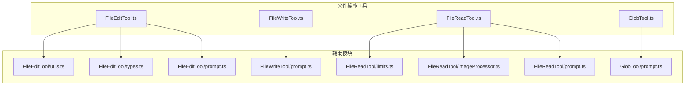
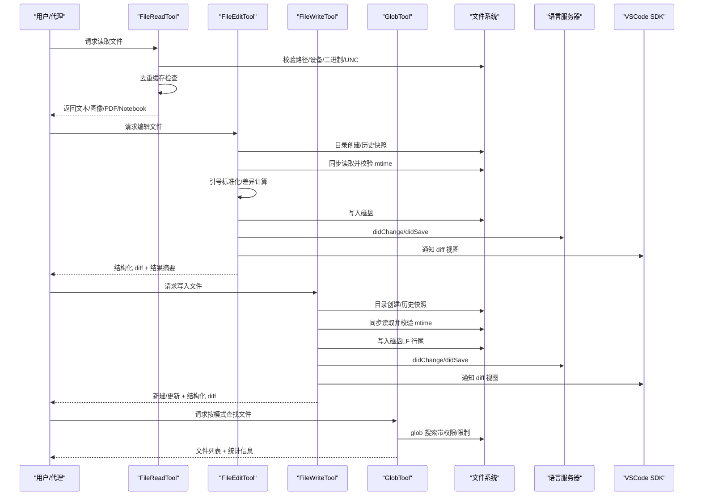
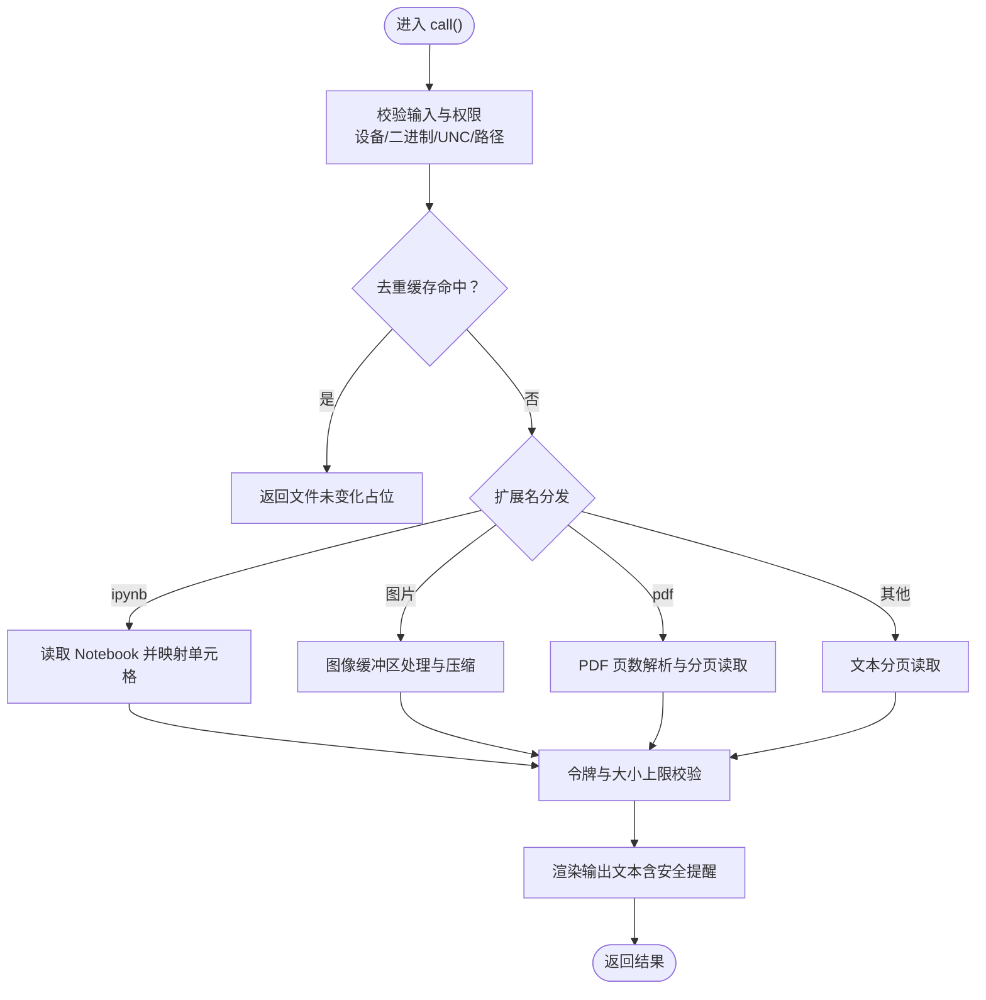
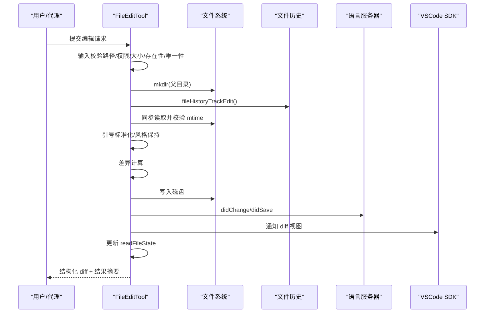
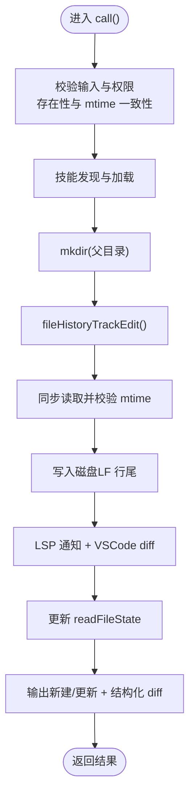
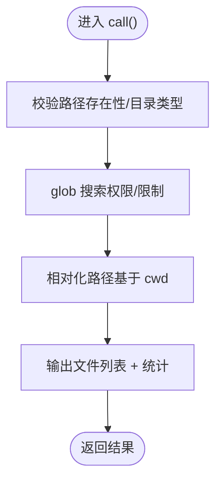
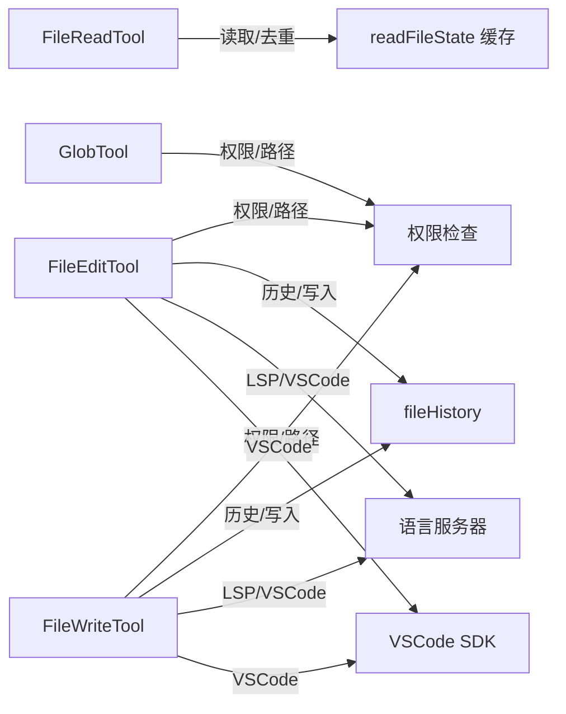

# 文件操作工具

<cite>
**本文引用的文件**
- [FileEditTool.ts](file://src/tools/FileEditTool/FileEditTool.ts)
- [FileEditTool/utils.ts](file://src/tools/FileEditTool/utils.ts)
- [FileEditTool/types.ts](file://src/tools/FileEditTool/types.ts)
- [FileEditTool/prompt.ts](file://src/tools/FileEditTool/prompt.ts)
- [FileWriteTool.ts](file://src/tools/FileWriteTool/FileWriteTool.ts)
- [FileWriteTool/prompt.ts](file://src/tools/FileWriteTool/prompt.ts)
- [FileReadTool.ts](file://src/tools/FileReadTool/FileReadTool.ts)
- [FileReadTool/limits.ts](file://src/tools/FileReadTool/limits.ts)
- [FileReadTool/imageProcessor.ts](file://src/tools/FileReadTool/imageProcessor.ts)
- [FileReadTool/prompt.ts](file://src/tools/FileReadTool/prompt.ts)
- [GlobTool.ts](file://src/tools/GlobTool/GlobTool.ts)
- [GlobTool/prompt.ts](file://src/tools/GlobTool/prompt.ts)
- [文件操作工具.md](file://docs/tools/file-operations.mdx)
</cite>

## 目录
1. [简介](#简介)
2. [项目结构](#项目结构)
3. [核心组件](#核心组件)
4. [架构总览](#架构总览)
5. [详细组件分析](#详细组件分析)
6. [依赖关系分析](#依赖关系分析)
7. [性能考量](#性能考量)
8. [故障排查指南](#故障排查指南)
9. [结论](#结论)
10. [附录](#附录)

## 简介
本文件面向 Claude Code 的文件操作工具集，系统性梳理 FileEditTool、FileWriteTool、FileReadTool 与 GlobTool 的职责、工作流、权限控制、安全规则、差异计算与输出呈现，并结合官方文档对“三大工具的风险分级”“去重缓存”“原子性读改写”“文件历史快照”“Cyber Risk 防御”等关键设计进行深入解读。同时提供使用指南、最佳实践与常见问题排查建议，帮助用户在保证安全的前提下高效完成批量文件操作与大文件处理。

## 项目结构
四大工具均位于 src/tools 下，采用“工具定义 + 输入输出 Schema + 提示词 + 辅助工具”的模块化组织方式；FileReadTool 还包含图像处理与 PDF/Notebook 等多格式读取分支；GlobTool 提供基于通配符的快速文件检索能力。

图表来源
- [FileEditTool.ts:1-626](file://src/tools/FileEditTool/FileEditTool.ts#L1-L626)
- [FileWriteTool.ts:1-435](file://src/tools/FileWriteTool/FileWriteTool.ts#L1-L435)
- [FileReadTool.ts:1-800](file://src/tools/FileReadTool/FileReadTool.ts#L1-L800)
- [GlobTool.ts:1-199](file://src/tools/GlobTool/GlobTool.ts#L1-L199)

章节来源
- [FileEditTool.ts:1-626](file://src/tools/FileEditTool/FileEditTool.ts#L1-L626)
- [FileWriteTool.ts:1-435](file://src/tools/FileWriteTool/FileWriteTool.ts#L1-L435)
- [FileReadTool.ts:1-800](file://src/tools/FileReadTool/FileReadTool.ts#L1-L800)
- [GlobTool.ts:1-199](file://src/tools/GlobTool/GlobTool.ts#L1-L199)

## 核心组件
- FileReadTool：只读工具，负责多格式文件读取（文本、图片、PDF、Notebook），内置去重缓存、设备文件屏蔽、二进制扩展名过滤、UNC 路径安全检查、最大令牌与字节上限校验、macOS 截图兼容路径修正、Cyber Risk 提示注入等。
- FileEditTool：写入工具，执行精确字符串替换，支持引号风格保持、引号标准化、差异计算、原子性读改写、文件历史快照、LSP 通知链路、Windows mtime 兼容性校验、最大文件尺寸限制等。
- FileWriteTool：写入工具，执行全量内容替换，与 Edit 共享权限与历史备份，但行尾处理策略不同（始终使用 LF），输出区分“新建/更新”，并提供结构化 diff。
- GlobTool：只读工具，基于通配符模式快速检索文件，支持路径合法性校验、结果数量限制、相对路径输出、权限规则匹配等。

章节来源
- [文件操作工具.md:9-221](file://docs/tools/file-operations.mdx#L9-L221)
- [FileReadTool.ts:1-800](file://src/tools/FileReadTool/FileReadTool.ts#L1-L800)
- [FileEditTool.ts:1-626](file://src/tools/FileEditTool/FileEditTool.ts#L1-L626)
- [FileWriteTool.ts:1-435](file://src/tools/FileWriteTool/FileWriteTool.ts#L1-L435)
- [GlobTool.ts:1-199](file://src/tools/GlobTool/GlobTool.ts#L1-L199)

## 架构总览
四大工具共享统一的工具基类与权限框架，围绕“输入校验—权限决策—读取状态一致性—原子写入—LSP/VSCode 同步—历史快照—输出渲染”的闭环协作。

图表来源
- [FileReadTool.ts:496-718](file://src/tools/FileReadTool/FileReadTool.ts#L496-L718)
- [FileEditTool.ts:387-595](file://src/tools/FileEditTool/FileEditTool.ts#L387-L595)
- [FileWriteTool.ts:223-434](file://src/tools/FileWriteTool/FileWriteTool.ts#L223-L434)
- [GlobTool.ts:154-198](file://src/tools/GlobTool/GlobTool.ts#L154-L198)

## 详细组件分析

### FileReadTool：多格式读取与去重缓存
- 职责与特性
  - 只读工具，支持文本、图片、PDF、Notebook 四类路径；对图片采用多阶段压缩与降采样策略；对 PDF 支持分页读取与页数阈值控制；对 macOS 截图路径提供薄空格兼容处理。
  - 去重缓存：若同一范围读取且 mtime 未变，直接返回“文件未变化”占位，避免重复传输；killswitch 可禁用。
  - 安全规则：设备文件黑名单、二进制扩展名拒绝、UNC 路径延迟 I/O、权限规则匹配。
  - 输出令牌上限：先按字节上限预检，再按实际 token 数二次校验，超限抛错。
- 关键流程（简化）
  - 输入校验（路径展开、权限、设备/二进制/UNC 检查）
  - 去重缓存命中判定（offset/limit 与 mtime）
  - 多格式分发：.ipynb → Notebook；.png/jpg/gif/webp → 图像；.pdf → PDF；其他 → 文本分页读取
  - 令牌与大小上限校验，必要时抛错
  - 输出渲染（文本含安全提醒，图像/PDF/Notebook 专用块）

图表来源
- [FileReadTool.ts:496-718](file://src/tools/FileReadTool/FileReadTool.ts#L496-L718)
- [FileReadTool/limits.ts:1-93](file://src/tools/FileReadTool/limits.ts#L1-L93)
- [FileReadTool/imageProcessor.ts:1-95](file://src/tools/FileReadTool/imageProcessor.ts#L1-L95)

章节来源
- [FileReadTool.ts:1-800](file://src/tools/FileReadTool/FileReadTool.ts#L1-L800)
- [FileReadTool/limits.ts:1-93](file://src/tools/FileReadTool/limits.ts#L1-L93)
- [FileReadTool/imageProcessor.ts:1-95](file://src/tools/FileReadTool/imageProcessor.ts#L1-L95)
- [文件操作工具.md:23-94](file://docs/tools/file-operations.mdx#L23-L94)

### FileEditTool：精确字符串替换与原子性写入
- 职责与特性
  - 写入工具，执行精确字符串替换；支持 replace_all；引号风格保持与引号标准化；Windows mtime 兼容性校验（全量读取时内容一致性兜底）；最大文件尺寸限制（~1GiB）；输出结构化 diff。
  - 原子性协议：目录创建、历史快照、同步读取、mtime 校验、差异计算、写入磁盘、缓存更新，严格避免临界区内异步操作。
  - 安全规则：团队内存敏感内容检测、权限规则匹配、UNC 路径延迟 I/O、笔记本文件专用工具提示。
- 关键流程（简化）
  - 输入校验（路径展开、权限、大小、存在性、是否为 .ipynb、是否已读取、mtime 一致性、old_string 存在性与唯一性/replace_all 合法性）
  - 技能发现与加载（非简单模式）
  - 目录创建、历史快照
  - 同步读取并校验 mtime（Windows 内容一致性兜底）
  - 引号标准化与风格保持
  - 差异计算与写入磁盘
  - LSP 通知与 VSCode diff 更新
  - 更新读取缓存、日志与 diff 统计

图表来源
- [FileEditTool.ts:387-595](file://src/tools/FileEditTool/FileEditTool.ts#L387-L595)
- [FileEditTool/utils.ts:73-93](file://src/tools/FileEditTool/utils.ts#L73-L93)

章节来源
- [FileEditTool.ts:1-626](file://src/tools/FileEditTool/FileEditTool.ts#L1-L626)
- [FileEditTool/utils.ts:1-776](file://src/tools/FileEditTool/utils.ts#L1-L776)
- [文件操作工具.md:95-157](file://docs/tools/file-operations.mdx#L95-L157)

### FileWriteTool：全量写入与创建
- 职责与特性
  - 写入工具，执行全量内容替换；始终使用 LF 行尾；区分“新建/更新”两类输出；与 Edit 共享权限、mtime 校验、历史快照；输出结构化 diff。
  - 行尾策略：AI 发出的换行即最终换行，不回退到旧文件或仓库采样风格，避免 Linux 脚本被注入 \r。
- 关键流程（简化）
  - 输入校验（路径展开、权限、存在性、mtime 一致性）
  - 技能发现与加载
  - 目录创建、历史快照
  - 同步读取并校验 mtime
  - 写入磁盘（LF 行尾）
  - LSP 通知与 VSCode diff 更新
  - 更新读取缓存、日志与 diff 统计
  - 输出“新建/更新”类型与结构化 diff

图表来源
- [FileWriteTool.ts:223-434](file://src/tools/FileWriteTool/FileWriteTool.ts#L223-L434)

章节来源
- [FileWriteTool.ts:1-435](file://src/tools/FileWriteTool/FileWriteTool.ts#L1-L435)
- [文件操作工具.md:158-180](file://docs/tools/file-operations.mdx#L158-L180)

### GlobTool：通配符文件搜索
- 职责与特性
  - 只读工具，基于通配符模式快速查找文件；支持指定搜索目录（默认当前工作目录）；对路径进行合法性校验（存在性与目录类型）；结果数量限制（默认 100）；输出相对路径以节省 token；支持权限规则匹配。
- 关键流程（简化）
  - 输入校验（路径存在性与目录类型）
  - glob 搜索（应用权限上下文与限制）
  - 结果相对化与统计输出

图表来源
- [GlobTool.ts:154-198](file://src/tools/GlobTool/GlobTool.ts#L154-L198)

章节来源
- [GlobTool.ts:1-199](file://src/tools/GlobTool/GlobTool.ts#L1-L199)
- [GlobTool/prompt.ts:1-8](file://src/tools/GlobTool/prompt.ts#L1-L8)

## 依赖关系分析
- 权限与路径
  - FileRead/Edit/Write/Glob 均通过权限检查函数与通配符匹配器进行路径/模式合法性校验，避免越权访问与路径逃逸。
- 文件系统与 I/O
  - 统一通过 fs 实现封装进行 stat/read/write/mkdir 等操作；Read/Write/编辑工具在关键路径使用同步读取以保证原子性。
- 历史与 LSP
  - 编辑/写入前触发文件历史快照；写入后通过 LSP 与 VSCode SDK 通知变更，确保 IDE 实时反馈。
- 工具间协作
  - Edit/Write 前通常需要先 Read；Read 工具提供去重与多格式读取能力，降低 token 消耗与 I/O 成本。

图表来源
- [FileReadTool.ts:518-573](file://src/tools/FileReadTool/FileReadTool.ts#L518-L573)
- [FileEditTool.ts:431-440](file://src/tools/FileEditTool/FileEditTool.ts#L431-L440)
- [FileWriteTool.ts:255-264](file://src/tools/FileWriteTool/FileWriteTool.ts#L255-L264)

章节来源
- [FileReadTool.ts:1-800](file://src/tools/FileReadTool/FileReadTool.ts#L1-L800)
- [FileEditTool.ts:1-626](file://src/tools/FileEditTool/FileEditTool.ts#L1-L626)
- [FileWriteTool.ts:1-435](file://src/tools/FileWriteTool/FileWriteTool.ts#L1-L435)
- [GlobTool.ts:1-199](file://src/tools/GlobTool/GlobTool.ts#L1-L199)

## 性能考量
- Read 工具
  - 去重缓存显著减少重复读取与 token 消耗；图片压缩与 PDF 分页读取降低大文件传输成本；令牌上限预检与二次校验避免超大内容回传。
- Edit/Write 工具
  - 原子性读改写避免并发干扰；同步读取与严格临界区控制降低失败重试成本；LF 行尾策略避免脚本注入与二次写入。
- Glob 工具
  - 结果数量限制与相对化输出减少传输开销；权限上下文与限制参数降低无效扫描。
- 大文件与批量操作
  - Read 使用分页与令牌上限；Edit/Write 限制单文件最大尺寸；建议优先使用 Read 获取上下文，再用 Edit/Write 精准修改，避免全量写入。

章节来源
- [文件操作工具.md:23-94](file://docs/tools/file-operations.mdx#L23-L94)
- [FileReadTool/limits.ts:1-93](file://src/tools/FileReadTool/limits.ts#L1-L93)
- [FileEditTool.ts:79-84](file://src/tools/FileEditTool/FileEditTool.ts#L79-L84)
- [FileWriteTool.ts:300-305](file://src/tools/FileWriteTool/FileWriteTool.ts#L300-L305)

## 故障排查指南
- “文件未被读取”错误
  - Edit/Write 前必须先 Read；若提示未读取，请先调用 Read 并接受其结果。
- “文件已被修改”错误
  - 自上次读取以来文件被外部修改；请重新 Read 后再尝试写入；Windows 场景下内容未变但 mtime 变更会被视为“可能被修改”。
- “字符串未找到/不唯一”错误
  - old_string 在文件中不存在或出现多次但未设置 replace_all；请提供更大上下文或启用 replace_all。
- “文件过大”错误
  - 单文件超过 Edit/Write 的最大尺寸限制；建议拆分修改或使用 Read/Write 的分页/范围参数。
- “二进制文件不可读”错误
  - Read 工具对非图片/PDF 的二进制扩展名直接拒绝；请使用合适工具或转为文本格式。
- “UNC 路径”相关
  - Windows UNC 路径会延迟文件系统操作以避免凭据泄露；请先通过权限检查后再进行后续操作。
- “Cyber Risk 提示”
  - Read 工具在文本输出后附加安全提醒；模型级别豁免策略按模型名称配置。

章节来源
- [FileEditTool.ts:137-362](file://src/tools/FileEditTool/FileEditTool.ts#L137-L362)
- [FileWriteTool.ts:153-222](file://src/tools/FileWriteTool/FileWriteTool.ts#L153-L222)
- [FileReadTool.ts:418-494](file://src/tools/FileReadTool/FileReadTool.ts#L418-L494)
- [文件操作工具.md:72-94](file://docs/tools/file-operations.mdx#L72-L94)

## 结论
FileEditTool、FileWriteTool、FileReadTool 与 GlobTool 构成了 Claude Code 的文件操作闭环：Read 提供安全高效的多格式读取与去重缓存，Edit/Write 提供精确与全量的写入能力并保障原子性与一致性，Glob 提供快速的文件发现。通过严格的权限控制、安全规则与历史快照机制，系统在提升效率的同时兼顾安全性与可观测性。建议在批量操作中遵循“先读取、后编辑/写入”的流程，合理使用范围参数与通配符搜索，以获得最佳性能与体验。

## 附录
- 使用场景示例（路径指引）
  - 批量查找与筛选：使用 [GlobTool.ts:154-198](file://src/tools/GlobTool/GlobTool.ts#L154-L198) 的 call 流程，结合权限与限制参数。
  - 精确字符串替换：使用 [FileEditTool.ts:387-595](file://src/tools/FileEditTool/FileEditTool.ts#L387-L595) 的 validateInput 与 call 流程，确保已 Read 且唯一匹配。
  - 全量内容替换：使用 [FileWriteTool.ts:223-434](file://src/tools/FileWriteTool/FileWriteTool.ts#L223-L434) 的 validateInput 与 call 流程，注意 LF 行尾策略。
  - 大文件读取：参考 [FileReadTool/limits.ts:1-93](file://src/tools/FileReadTool/limits.ts#L1-L93) 的上限配置与 [FileReadTool.ts:518-573](file://src/tools/FileReadTool/FileReadTool.ts#L518-L573) 的去重逻辑。
  - 图像/PDF/Notebook 读取：参考 [FileReadTool.ts:518-651](file://src/tools/FileReadTool/FileReadTool.ts#L518-L651) 的多格式分发与 [FileReadTool/imageProcessor.ts:1-95](file://src/tools/FileReadTool/imageProcessor.ts#L1-L95) 的图像处理。