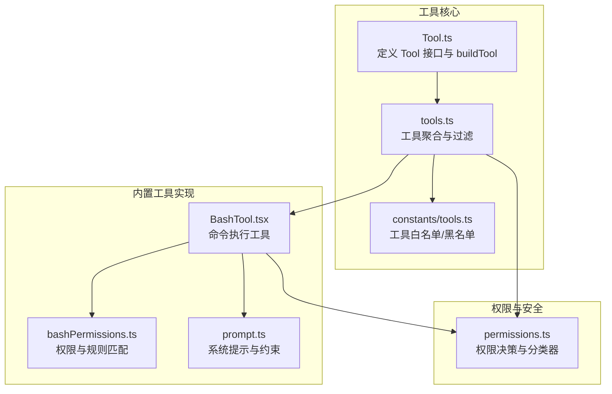
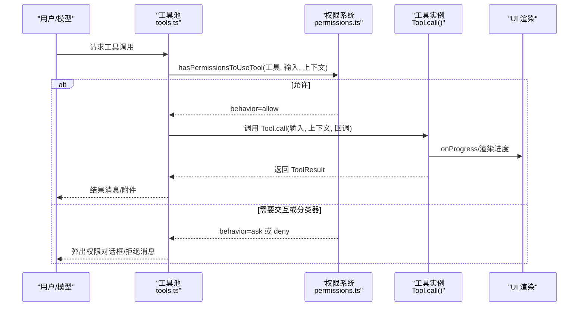
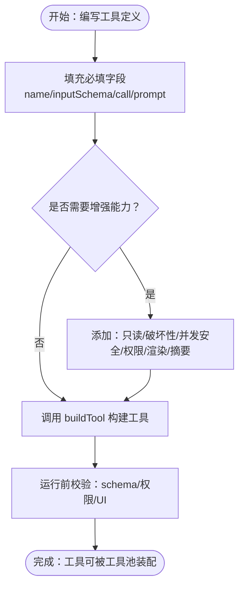
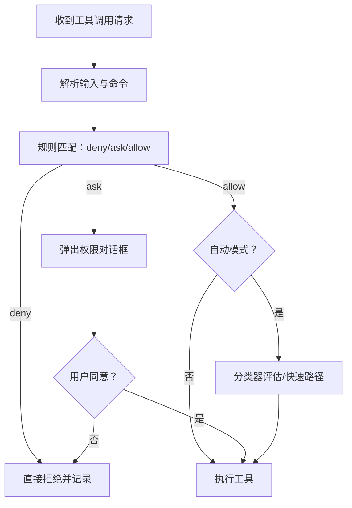
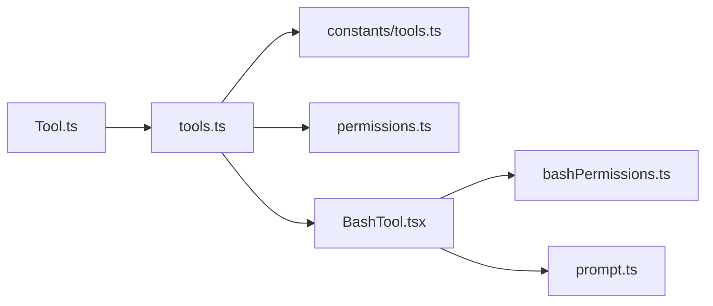

# 自定义工具开发

<cite>
**本文引用的文件**
- [Tool.ts](file://src/Tool.ts)
- [tools.ts](file://src/tools.ts)
- [BashTool.tsx](file://src/tools/BashTool/BashTool.tsx)
- [bashPermissions.ts](file://src/tools/BashTool/bashPermissions.ts)
- [prompt.ts](file://src/tools/BashTool/prompt.ts)
- [permissions.ts](file://src/utils/permissions/permissions.ts)
- [tools.ts（常量）](file://src/constants/tools.ts)
</cite>

## 目录
1. [简介](#简介)
2. [项目结构](#项目结构)
3. [核心组件](#核心组件)
4. [架构总览](#架构总览)
5. [详细组件分析](#详细组件分析)
6. [依赖关系分析](#依赖关系分析)
7. [性能考量](#性能考量)
8. [故障排除指南](#故障排除指南)
9. [结论](#结论)
10. [附录](#附录)

## 简介
本指南面向希望在 Claude Code 中开发自定义工具的工程师，覆盖从需求分析到工具部署的全流程。重点围绕 buildTool 函数的使用方式，讲解工具定义、接口实现、权限配置、错误处理、性能优化、安全考虑与测试策略，并通过简单工具、复杂业务工具、与外部 API 集成工具三类示例，帮助你快速上手并构建高质量、可维护、可扩展的工具。

## 项目结构
Claude Code 的工具体系以统一的 Tool 接口为核心，通过 buildTool 构建标准化工具对象；工具集合由 tools.ts 汇总并按权限规则过滤；具体工具实现位于 src/tools 下的子目录中，如 BashTool、FileReadTool 等；权限系统集中在 utils/permissions 下，提供规则匹配、分类器决策与拒绝追踪等能力。

**图示来源**
- [Tool.ts:362-792](file://src/Tool.ts#L362-L792)
- [tools.ts:191-387](file://src/tools.ts#L191-L387)
- [BashTool.tsx:420-800](file://src/tools/BashTool/BashTool.tsx#L420-L800)
- [bashPermissions.ts:1-200](file://src/tools/BashTool/bashPermissions.ts#L1-L200)
- [prompt.ts:275-370](file://src/tools/BashTool/prompt.ts#L275-L370)
- [permissions.ts:473-800](file://src/utils/permissions/permissions.ts#L473-L800)
- [tools.ts（常量）:36-111](file://src/constants/tools.ts#L36-L111)

**章节来源**
- [Tool.ts:362-792](file://src/Tool.ts#L362-L792)
- [tools.ts:191-387](file://src/tools.ts#L191-L387)
- [tools.ts（常量）:36-111](file://src/constants/tools.ts#L36-L111)

## 核心组件
- Tool 接口：定义工具的调用、描述、输入输出模式、并发安全、只读/破坏性标记、权限检查、UI 渲染、摘要与活动描述等方法与属性。
- buildTool：对工具定义进行默认填充，确保工具具备最小可用能力，同时保留可覆盖项。
- 工具集合与过滤：getAllBaseTools/getTools/assembleToolPool 统一装配内置工具与 MCP 工具，按权限规则过滤并去重。
- 权限系统：hasPermissionsToUseTool 决策流，结合规则匹配、分类器、拒绝追踪与自动模式，支持 ask/allow/deny 三种行为。

**章节来源**
- [Tool.ts:362-792](file://src/Tool.ts#L362-L792)
- [tools.ts:191-387](file://src/tools.ts#L191-L387)
- [permissions.ts:473-800](file://src/utils/permissions/permissions.ts#L473-L800)

## 架构总览
下图展示了工具从“被请求”到“执行完成”的端到端流程，包括权限决策、UI 渲染与结果回传。

**图示来源**
- [tools.ts:269-325](file://src/tools.ts#L269-L325)
- [permissions.ts:473-800](file://src/utils/permissions/permissions.ts#L473-L800)
- [Tool.ts:379-403](file://src/Tool.ts#L379-L403)

## 详细组件分析

### 使用 buildTool 创建自定义工具
- 工具定义要点
  - 必填字段：name、inputSchema、call、prompt、userFacingName 等。
  - 可选增强：isReadOnly/isDestructive/isConcurrencySafe、checkPermissions、renderToolUseMessage/renderToolResultMessage、getToolUseSummary/getActivityDescription 等。
  - 输出模式：可通过 outputSchema 定义结构化输出；必要时使用 mapToolResultToToolResultBlockParam 将输出映射为消息块。
- 默认填充
  - buildTool 会为 isEnabled/isConcurrencySafe/isReadOnly/isDestructive/checkPermissions/toAutoClassifierInput/userFacingName 提供安全默认值，避免遗漏导致的不一致。
- 示例路径
  - 简单工具参考：[BashTool.tsx:420-520](file://src/tools/BashTool/BashTool.tsx#L420-L520)
  - 复杂工具参考：[BashTool.tsx:524-800](file://src/tools/BashTool/BashTool.tsx#L524-L800)

**图示来源**
- [Tool.ts:783-792](file://src/Tool.ts#L783-L792)
- [BashTool.tsx:420-520](file://src/tools/BashTool/BashTool.tsx#L420-L520)

**章节来源**
- [Tool.ts:757-792](file://src/Tool.ts#L757-L792)
- [BashTool.tsx:420-520](file://src/tools/BashTool/BashTool.tsx#L420-L520)

### 权限配置与最佳实践
- 规则匹配
  - 支持精确匹配、前缀匹配与通配符匹配；BashTool 展示了基于 AST 的子命令解析与规则提取。
  - deny/ask/allow 三类规则分别来自设置源、CLI 参数、会话上下文等。
- 分类器与自动模式
  - 在 auto/dontAsk/plan 等模式下，权限请求可能由分类器自动决定，减少交互成本。
  - 拒绝追踪与“不要询问”模式可避免频繁弹窗。
- 安全建议
  - 对于写操作与潜在危险命令，优先采用只读/沙箱策略；必要时允许用户显式覆盖。
  - 严格限制环境变量注入与包装器绕过；对敏感路径与网络主机进行白/黑名单控制。

**图示来源**
- [bashPermissions.ts:1-200](file://src/tools/BashTool/bashPermissions.ts#L1-L200)
- [permissions.ts:473-800](file://src/utils/permissions/permissions.ts#L473-L800)

**章节来源**
- [bashPermissions.ts:1-200](file://src/tools/BashTool/bashPermissions.ts#L1-L200)
- [permissions.ts:473-800](file://src/utils/permissions/permissions.ts#L473-L800)

### 错误处理与 UI 呈现
- 错误类型
  - 进程错误、中断信号、沙箱违规、超时等；BashTool 将 stderr 合并到 stdout 并追加退出码信息。
- UI 呈现
  - 通过 renderToolUseMessage/renderToolResultMessage/renderToolUseProgressMessage 等钩子控制消息与进度渲染。
  - 对大结果采用持久化存储并在消息中提供预览与路径。
- 摘要与活动描述
  - getToolUseSummary/getActivityDescription 用于紧凑视图与转录索引。

**章节来源**
- [BashTool.tsx:542-623](file://src/tools/BashTool/BashTool.tsx#L542-L623)

### 性能优化与资源控制
- 并发与只读
  - isConcurrencySafe 与 isReadOnly 标记有助于 UI 与执行层的并发控制与缓存复用。
- 超时与后台任务
  - BashTool 支持 run_in_background 与超时控制，长任务自动后台化并通知完成。
- 输出截断与预览
  - 大输出落地磁盘并通过预览缩短消息体积，提升传输与渲染效率。

**章节来源**
- [BashTool.tsx:227-294](file://src/tools/BashTool/BashTool.tsx#L227-L294)
- [prompt.ts:27-33](file://src/tools/BashTool/prompt.ts#L27-L33)

### 开发示例

#### 示例一：创建一个简单的只读工具
- 目标：读取文件内容并返回摘要。
- 关键点：
  - 定义只读标记与输入输出 schema。
  - 实现 description/prompt/userFacingName。
  - 使用 renderToolUseMessage/renderToolResultMessage 控制 UI。
- 参考实现路径：
  - [FileReadTool.ts](file://src/tools/FileReadTool/FileReadTool.ts)
  - [FileReadTool UI](file://src/tools/FileReadTool/UI.tsx)

**章节来源**
- [FileReadTool.ts](file://src/tools/FileReadTool/FileReadTool.ts)
- [FileReadTool UI](file://src/tools/FileReadTool/UI.tsx)

#### 示例二：创建一个复杂业务工具（带权限与分类器）
- 目标：执行多步 Bash 命令，支持后台运行、沙箱、权限规则与分类器。
- 关键点：
  - 使用 buildTool 包装，覆盖 checkPermissions/validateInput。
  - 解析命令语义、提取规则、生成建议。
  - 在 auto 模式下利用分类器快速决策。
- 参考实现路径：
  - [BashTool.tsx:420-800](file://src/tools/BashTool/BashTool.tsx#L420-L800)
  - [bashPermissions.ts:1-200](file://src/tools/BashTool/bashPermissions.ts#L1-L200)
  - [permissions.ts:473-800](file://src/utils/permissions/permissions.ts#L473-L800)

**章节来源**
- [BashTool.tsx:420-800](file://src/tools/BashTool/BashTool.tsx#L420-L800)
- [bashPermissions.ts:1-200](file://src/tools/BashTool/bashPermissions.ts#L1-L200)
- [permissions.ts:473-800](file://src/utils/permissions/permissions.ts#L473-L800)

#### 示例三：与外部 API 集成的工具
- 目标：通过 HTTP 访问外部服务，返回结构化结果并渲染为消息块。
- 关键点：
  - 定义 inputSchema/outputSchema，使用 validateInput 校验参数。
  - 在 call 中发起请求，处理错误与超时。
  - 使用 mapToolResultToToolResultBlockParam 将结构化数据映射为消息块。
- 参考实现路径：
  - [WebSearchTool.ts](file://src/tools/WebSearchTool/WebSearchTool.ts)
  - [WebFetchTool.ts](file://src/tools/WebFetchTool/WebFetchTool.ts)

**章节来源**
- [WebSearchTool.ts](file://src/tools/WebSearchTool/WebSearchTool.ts)
- [WebFetchTool.ts](file://src/tools/WebFetchTool/WebFetchTool.ts)

## 依赖关系分析
- 工具核心依赖
  - Tool.ts 定义接口与 buildTool。
  - tools.ts 负责工具聚合、过滤与去重。
  - constants/tools.ts 提供工具白名单/黑名单与模式限制。
- 权限与安全依赖
  - permissions.ts 提供统一的权限决策入口，贯穿工具调用生命周期。
  - bashPermissions.ts 为 Bash 工具提供规则匹配与建议生成。
- UI 与系统提示
  - prompt.ts 为 Bash 工具提供系统提示与约束，影响工具使用体验与安全性。

**图示来源**
- [Tool.ts:362-792](file://src/Tool.ts#L362-L792)
- [tools.ts:191-387](file://src/tools.ts#L191-L387)
- [tools.ts（常量）:36-111](file://src/constants/tools.ts#L36-L111)
- [permissions.ts:473-800](file://src/utils/permissions/permissions.ts#L473-L800)
- [BashTool.tsx:420-800](file://src/tools/BashTool/BashTool.tsx#L420-L800)
- [bashPermissions.ts:1-200](file://src/tools/BashTool/bashPermissions.ts#L1-L200)
- [prompt.ts:275-370](file://src/tools/BashTool/prompt.ts#L275-L370)

**章节来源**
- [tools.ts:191-387](file://src/tools.ts#L191-L387)
- [permissions.ts:473-800](file://src/utils/permissions/permissions.ts#L473-L800)

## 性能考量
- 并发与只读：合理标注 isConcurrencySafe 与 isReadOnly，有助于 UI 与执行层的并发控制与缓存复用。
- 超时与后台：对长任务启用 run_in_background，避免阻塞主线程；为工具设置合理的超时阈值。
- 输出控制：对大结果进行持久化与预览，减少消息体积；必要时使用压缩或分片策略。
- 权限决策：在 auto 模式下利用分类器与快速路径，减少交互成本；对高风险命令保持 ask 行为。

## 故障排除指南
- 权限相关
  - 若工具被拒绝，请检查 deny/ask/allow 规则与分类器决策；确认是否处于 dontAsk/auto/plan 模式。
  - 对于复合命令，确认规则匹配是否正确；必要时调整规则或使用前缀匹配。
- 执行失败
  - 查看 stderr 合并后的输出与退出码；关注沙箱违规与路径/网络限制。
  - 对于超时或中断，检查超时设置与后台任务状态。
- UI 不显示或渲染异常
  - 确认 renderToolUseMessage/renderToolResultMessage 是否实现；检查摘要与活动描述是否为空。
- 大结果未显示
  - 确认持久化路径与预览生成逻辑；检查最大字符阈值与预览大小。

**章节来源**
- [permissions.ts:473-800](file://src/utils/permissions/permissions.ts#L473-L800)
- [BashTool.tsx:542-623](file://src/tools/BashTool/BashTool.tsx#L542-L623)

## 结论
通过统一的 Tool 接口与 buildTool 构建机制，Claude Code 为自定义工具提供了清晰、可扩展的开发框架。配合完善的权限系统、UI 渲染钩子与性能优化策略，你可以快速实现从简单只读工具到复杂业务工具与外部 API 集成工具。建议在开发过程中始终关注安全性、可维护性与用户体验，并遵循本文提供的最佳实践与排障方法。

## 附录
- 工具开发清单
  - 明确工具职责与输入输出，设计 schema。
  - 实现 call/description/prompt/userFacingName。
  - 添加权限检查与 UI 渲染钩子。
  - 编写单元测试与集成测试。
  - 部署前进行安全评审与性能压测。
- 参考实现
  - [BashTool.tsx:420-800](file://src/tools/BashTool/BashTool.tsx#L420-L800)
  - [permissions.ts:473-800](file://src/utils/permissions/permissions.ts#L473-L800)
  - [tools.ts:191-387](file://src/tools.ts#L191-L387)