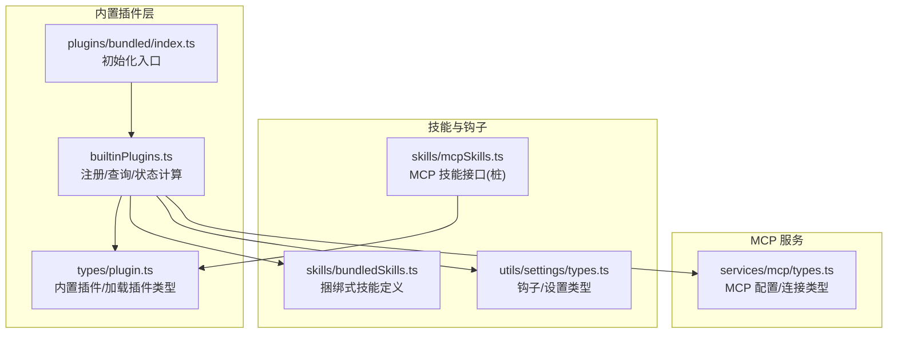
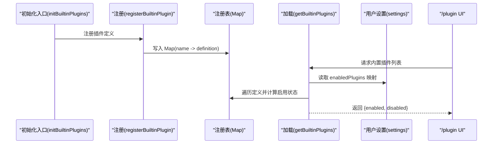
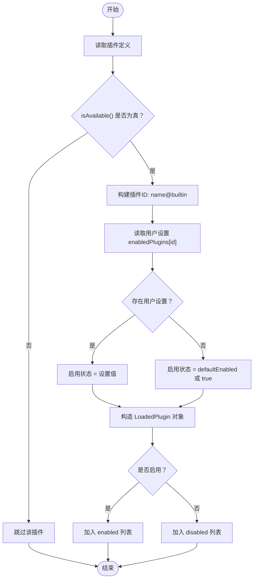
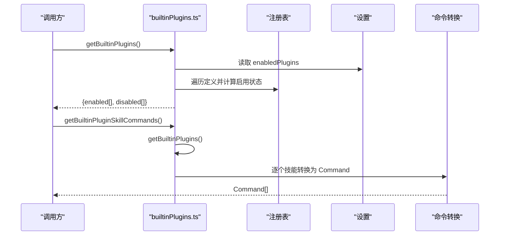
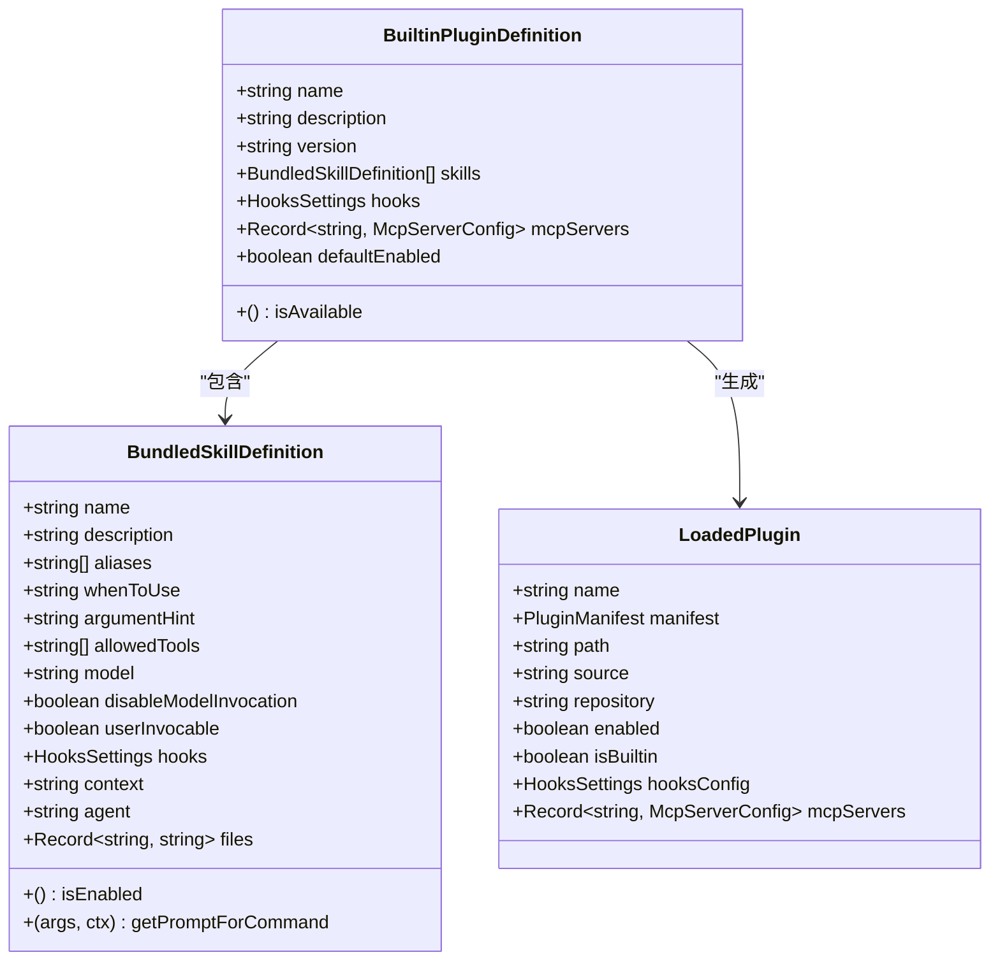
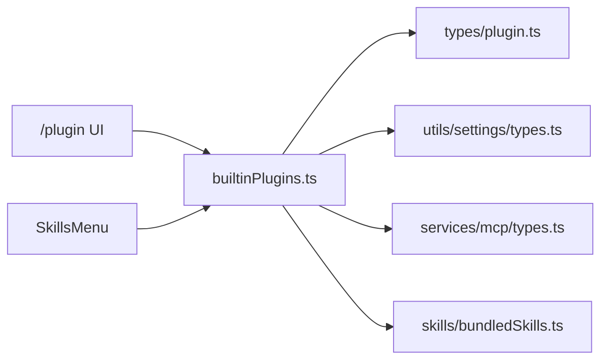

# 内置插件系统

<cite>
**本文档引用的文件**
- [builtinPlugins.ts](file://src/plugins/builtinPlugins.ts)
- [plugin.ts](file://src/types/plugin.ts)
- [bundled/index.ts](file://src/plugins/bundled/index.ts)
- [bundledSkills.ts](file://src/skills/bundledSkills.ts)
- [types.ts](file://src/utils/settings/types.ts)
- [mcp/types.ts](file://src/services/mcp/types.ts)
- [mcpSkills.ts](file://src/skills/mcpSkills.ts)
- [installedPluginsManager.ts](file://src/utils/plugins/installedPluginsManager.ts)
</cite>

## 目录
1. [简介](#简介)
2. [项目结构](#项目结构)
3. [核心组件](#核心组件)
4. [架构总览](#架构总览)
5. [详细组件分析](#详细组件分析)
6. [依赖关系分析](#依赖关系分析)
7. [性能考虑](#性能考虑)
8. [故障排查指南](#故障排查指南)
9. [结论](#结论)
10. [附录](#附录)

## 简介
本文件系统性阐述 Claude Code 的内置插件系统，重点覆盖以下方面：
- 注册机制与管理：registerBuiltinPlugin 的使用、插件定义规范、可用性检查与状态持久化
- 标识符与区别：内置插件与市场插件在标识符格式、功能特性与用户控制方式上的差异
- 加载流程：getBuiltinPlugins、getBuiltinPluginDefinition 等核心函数的实现原理
- 插件分类：技能插件、钩子插件、MCP 服务器插件等不同类型的组织方式
- 开发指南与最佳实践：如何新增内置插件、设计约束与注意事项

## 项目结构
内置插件系统主要由以下模块构成：
- 注册与查询：builtinPlugins.ts 提供注册、查询、启用状态计算与技能命令转换
- 类型定义：plugin.ts 定义内置插件与已加载插件的数据结构
- 初始化入口：plugins/bundled/index.ts 提供内置插件初始化入口（当前为空，预留扩展）
- 技能定义：skills/bundledSkills.ts 定义“捆绑式技能”，与内置插件在可启用性上不同
- 设置与钩子：utils/settings/types.ts 定义钩子与 MCP 配置相关类型
- MCP 类型：services/mcp/types.ts 定义 MCP 服务器配置与连接状态
- MCP 技能：skills/mcpSkills.ts 提供 MCP 技能发现与缓存接口（当前为桩实现）

**图表来源**
- [builtinPlugins.ts:1-160](file://src/plugins/builtinPlugins.ts#L1-L160)
- [plugin.ts:13-70](file://src/types/plugin.ts#L13-L70)
- [bundled/index.ts:19-24](file://src/plugins/bundled/index.ts#L19-L24)
- [bundledSkills.ts:11-41](file://src/skills/bundledSkills.ts#L11-L41)
- [types.ts:1075-1122](file://src/utils/settings/types.ts#L1075-L1122)
- [mcp/types.ts:124-178](file://src/services/mcp/types.ts#L124-L178)
- [mcpSkills.ts:1-7](file://src/skills/mcpSkills.ts#L1-L7)

**章节来源**
- [builtinPlugins.ts:1-160](file://src/plugins/builtinPlugins.ts#L1-L160)
- [plugin.ts:13-70](file://src/types/plugin.ts#L13-L70)
- [bundled/index.ts:19-24](file://src/plugins/bundled/index.ts#L19-L24)
- [bundledSkills.ts:11-41](file://src/skills/bundledSkills.ts#L11-L41)
- [types.ts:1075-1122](file://src/utils/settings/types.ts#L1075-L1122)
- [mcp/types.ts:124-178](file://src/services/mcp/types.ts#L124-L178)
- [mcpSkills.ts:1-7](file://src/skills/mcpSkills.ts#L1-L7)

## 核心组件
- 内置插件注册表与工具函数
  - 注册：registerBuiltinPlugin(definition)
  - 查询：getBuiltinPluginDefinition(name)、getBuiltinPlugins()
  - 辅助：isBuiltinPluginId(pluginId)、clearBuiltinPlugins()
  - 技能命令：getBuiltinPluginSkillCommands()

- 数据结构
  - BuiltinPluginDefinition：内置插件定义，包含名称、描述、版本、技能数组、钩子配置、MCP 服务器配置、可用性判断与默认启用状态
  - LoadedPlugin：已加载插件对象，用于 UI 展示与运行时使用，包含 manifest、路径、来源、仓库、启用状态、是否内置、钩子与 MCP 配置等

- 初始化入口
  - initBuiltinPlugins()：CLI 启动时调用，用于注册内置插件；当前为空，预留迁移“捆绑式技能”为“内置插件”的扩展点

**章节来源**
- [builtinPlugins.ts:25-128](file://src/plugins/builtinPlugins.ts#L25-L128)
- [plugin.ts:13-70](file://src/types/plugin.ts#L13-L70)
- [bundled/index.ts:19-24](file://src/plugins/bundled/index.ts#L19-L24)

## 架构总览
内置插件系统通过“注册—查询—状态计算—命令生成”的流水线工作：
- 启动阶段：initBuiltinPlugins() 调用各内置插件模块的 registerBuiltinPlugin() 将定义写入内存注册表
- 运行阶段：getBuiltinPlugins() 基于用户设置与默认值计算每个插件的启用状态，并输出已启用/禁用列表
- UI 阶段：/plugin 界面展示内置插件，支持用户切换启用状态
- 技能阶段：从已启用插件中提取技能命令，注入到命令系统

**图表来源**
- [builtinPlugins.ts:25-102](file://src/plugins/builtinPlugins.ts#L25-L102)
- [bundled/index.ts:19-24](file://src/plugins/bundled/index.ts#L19-L24)

**章节来源**
- [builtinPlugins.ts:25-102](file://src/plugins/builtinPlugins.ts#L25-L102)
- [bundled/index.ts:19-24](file://src/plugins/bundled/index.ts#L19-L24)

## 详细组件分析

### 组件一：内置插件注册与查询
- 注册机制
  - registerBuiltinPlugin(definition) 将插件定义写入内存 Map，键为插件名
  - 插件定义包含 name、description、version、skills、hooks、mcpServers、isAvailable、defaultEnabled 等字段
- 查询机制
  - getBuiltinPluginDefinition(name) 直接返回定义（用于 UI 展示）
  - getBuiltinPlugins() 计算启用状态并拆分为 enabled/disabled 列表
- 启用状态决策
  - 用户设置优先：settings.enabledPlugins[pluginId] === true
  - 其次默认值：definition.defaultEnabled（未设置则默认 true）
  - 最后兜底：true
- 可用性过滤
  - 若 definition.isAvailable 存在且返回 false，则该插件被完全忽略

**图表来源**
- [builtinPlugins.ts:52-102](file://src/plugins/builtinPlugins.ts#L52-L102)

**章节来源**
- [builtinPlugins.ts:25-102](file://src/plugins/builtinPlugins.ts#L25-L102)

### 组件二：内置插件与市场插件的区别
- 标识符格式
  - 内置插件：pluginId = "{name}@builtin"
  - 市场插件：pluginId = "{name}@{marketplace}"
- 功能特性
  - 内置插件出现在 /plugin UI 的“Built-in”分组，用户可显式启用/禁用，状态持久化到用户设置
  - 市场插件来自外部市场源，通常需要下载/安装，其启用状态由市场系统管理
- 用户控制方式
  - 内置插件：通过 settings.enabledPlugins[pluginId] 控制
  - 市场插件：通过市场系统与安装状态管理

**章节来源**
- [builtinPlugins.ts:12-13](file://src/plugins/builtinPlugins.ts#L12-L13)
- [builtinPlugins.ts:70](file://src/plugins/builtinPlugins.ts#L70)

### 组件三：内置插件的加载过程
- getBuiltinPlugins()
  - 读取用户设置，遍历注册表，按规则计算启用状态
  - 构造 LoadedPlugin，填充 manifest、hooksConfig、mcpServers 等字段
  - 拆分为 enabled/disabled 两组返回
- getBuiltinPluginSkillCommands()
  - 仅从已启用插件提取技能，转换为 Command 对象
  - 使用 skillDefinitionToCommand 将 BundledSkillDefinition 转换为 Command

**图表来源**
- [builtinPlugins.ts:52-121](file://src/plugins/builtinPlugins.ts#L52-L121)

**章节来源**
- [builtinPlugins.ts:52-121](file://src/plugins/builtinPlugins.ts#L52-L121)

### 组件四：内置插件的分类与数据模型
- 技能插件
  - 通过 BuiltinPluginDefinition.skills 提供 BundledSkillDefinition 数组
  - 通过 getBuiltinPluginSkillCommands() 转换为 Command，注入到命令系统
- 钩子插件
  - 通过 BuiltinPluginDefinition.hooks 提供 HooksSettings，用于事件钩子匹配与执行上下文
- MCP 服务器插件
  - 通过 BuiltinPluginDefinition.mcpServers 提供服务器配置映射
  - 配置类型由 McpServerConfig 定义，支持多种传输协议（stdio、sse、http、ws、sdk 等）

**图表来源**
- [plugin.ts:13-70](file://src/types/plugin.ts#L13-L70)
- [bundledSkills.ts:11-41](file://src/skills/bundledSkills.ts#L11-L41)

**章节来源**
- [plugin.ts:13-70](file://src/types/plugin.ts#L13-L70)
- [bundledSkills.ts:11-41](file://src/skills/bundledSkills.ts#L11-L41)

### 组件五：MCP 服务器配置与连接状态
- 配置类型
  - McpServerConfig 支持 stdio、sse、sse-ide、ws-ide、http、ws、sdk、claudeai-proxy 等传输
  - ScopedMcpServerConfig 在配置基础上附加作用域与插件来源信息
- 连接状态
  - ConnectedMCPServer、FailedMCPServer、NeedsAuthMCPServer、PendingMCPServer、DisabledMCPServer
- 已加载插件中的 MCP 字段
  - LoadedPlugin.mcpServers 保存插件提供的 MCP 服务器配置

**章节来源**
- [mcp/types.ts:124-227](file://src/services/mcp/types.ts#L124-L227)
- [plugin.ts:66-69](file://src/types/plugin.ts#L66-L69)

### 组件六：与捆绑式技能的关系
- 区别
  - 内置插件：可通过 /plugin UI 显式启用/禁用，状态持久化
  - 捆绑式技能：编译进 CLI，启动即可用，不参与用户开关
- 关联
  - 内置插件的 skills 字段与 BundledSkillDefinition 结构一致
  - 内置插件的技能命令通过 skillDefinitionToCommand 转换为 Command，source 标记为 'bundled'

**章节来源**
- [builtinPlugins.ts:132-159](file://src/plugins/builtinPlugins.ts#L132-L159)
- [bundledSkills.ts:11-41](file://src/skills/bundledSkills.ts#L11-L41)

## 依赖关系分析
- 模块耦合
  - builtinPlugins.ts 依赖 settings 获取用户偏好，依赖 BundledSkillDefinition 与 LoadedPlugin 类型
  - 类型定义集中在 plugin.ts，MCP 类型集中在 mcp/types.ts，钩子类型集中在 settings/types.ts
- 外部集成点
  - /plugin UI 通过 getBuiltinPlugins() 获取内置插件列表
  - 技能菜单通过 getBuiltinPluginSkillCommands() 获取内置插件技能命令
- 循环依赖规避
  - MCP 技能构建器注册采用“先声明后使用”的方式，避免动态导入导致的循环

**图表来源**
- [builtinPlugins.ts:16-19](file://src/plugins/builtinPlugins.ts#L16-L19)
- [plugin.ts:1-9](file://src/types/plugin.ts#L1-L9)
- [types.ts:1075-1122](file://src/utils/settings/types.ts#L1075-L1122)
- [mcp/types.ts:1-8](file://src/services/mcp/types.ts#L1-L8)

**章节来源**
- [builtinPlugins.ts:16-19](file://src/plugins/builtinPlugins.ts#L16-L19)
- [plugin.ts:1-9](file://src/types/plugin.ts#L1-L9)
- [types.ts:1075-1122](file://src/utils/settings/types.ts#L1075-L1122)
- [mcp/types.ts:1-8](file://src/services/mcp/types.ts#L1-L8)

## 性能考虑
- 注册表访问
  - 注册表为 Map，注册与查询均为 O(1) 平均复杂度
- 启用状态计算
  - 遍历注册表一次，时间复杂度 O(N)，N 为内置插件数量
- 技能命令转换
  - 仅对已启用插件进行转换，避免不必要的开销
- 缓存与懒加载
  - MCP 技能接口提供缓存结构，减少重复请求
  - 捆绑式技能首次调用时才进行文件提取，后续复用

[本节为通用指导，无需特定文件引用]

## 故障排查指南
- 常见问题定位
  - 插件未显示：检查 isAvailable 是否返回 false，或确认插件是否正确注册
  - 插件未生效：检查 settings.enabledPlugins 中的对应项是否为 true
  - 技能不可用：确认插件已启用，且 skills 数组非空
- 错误类型参考
  - 插件错误类型涵盖路径不存在、网络错误、清单解析/校验失败、市场不可用、MCP 配置无效、LSP 启动失败等
  - 可通过 getPluginErrorMessage(error) 获取可读错误消息

**章节来源**
- [plugin.ts:101-283](file://src/types/plugin.ts#L101-L283)
- [plugin.ts:295-363](file://src/types/plugin.ts#L295-L363)

## 结论
内置插件系统以“注册—查询—状态计算—命令生成”为核心流程，通过明确的标识符格式与类型定义，实现了与市场插件的清晰区分。内置插件具备用户可控的启用/禁用能力，并可同时提供技能、钩子与 MCP 服务器等多类组件。未来可通过 initBuiltinPlugins() 扩展更多内置插件，逐步将部分“捆绑式技能”迁移为“内置插件”，提升用户可发现性与可控制性。

[本节为总结，无需特定文件引用]

## 附录

### 内置插件开发指南与最佳实践
- 新增内置插件步骤
  - 在 initBuiltinPlugins() 中调用 registerBuiltinPlugin(definition) 注册插件定义
  - 定义中至少包含 name、description；如需提供技能，补充 skills 数组
  - 如需钩子或 MCP 服务器，分别在 hooks 与 mcpServers 中提供配置
- 设计要点
  - isAvailable 用于基于系统能力的条件启用，避免在不满足环境时暴露
  - defaultEnabled 用于新用户的默认行为，谨慎选择默认值
  - 描述与版本信息完善，便于用户理解与排障
- 与捆绑式技能的选择
  - 若功能应始终可用且无需用户开关，保留为捆绑式技能
  - 若功能应可由用户显式启用/禁用，迁移为内置插件
- MCP 服务器注意事项
  - 使用 McpServerConfig 的标准类型，确保配置合法
  - 注意传输协议与认证方式，必要时提供 OAuth 或 XAA 配置
- UI 与设置
  - /plugin 界面会自动展示内置插件；用户设置变更后即时生效
  - 技能命令通过 getBuiltinPluginSkillCommands() 注入，无需额外处理

**章节来源**
- [bundled/index.ts:19-24](file://src/plugins/bundled/index.ts#L19-L24)
- [builtinPlugins.ts:25-32](file://src/plugins/builtinPlugins.ts#L25-L32)
- [plugin.ts:13-35](file://src/types/plugin.ts#L13-L35)
- [mcp/types.ts:124-178](file://src/services/mcp/types.ts#L124-L178)