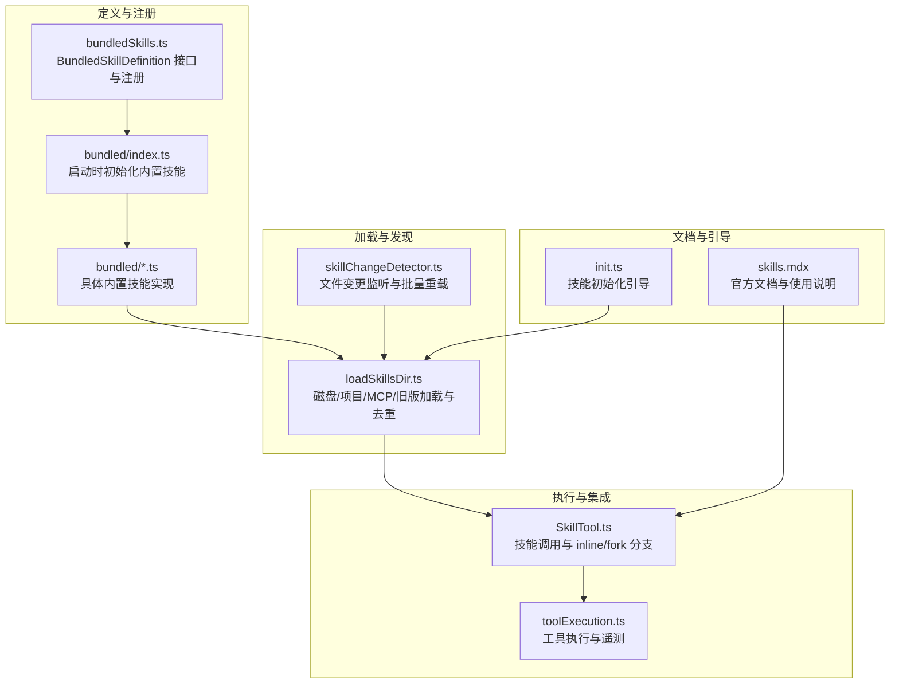
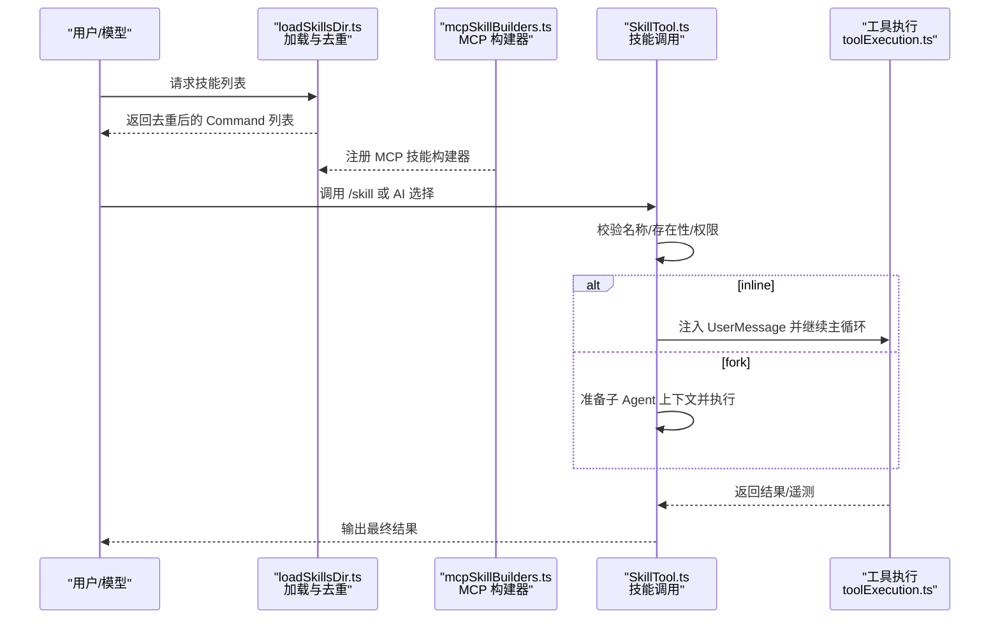
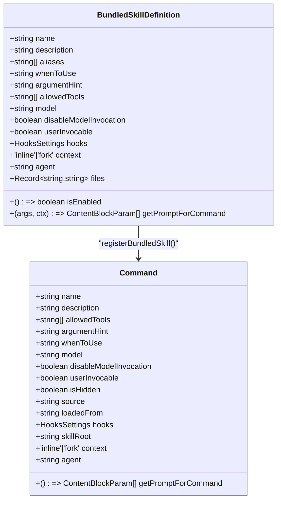
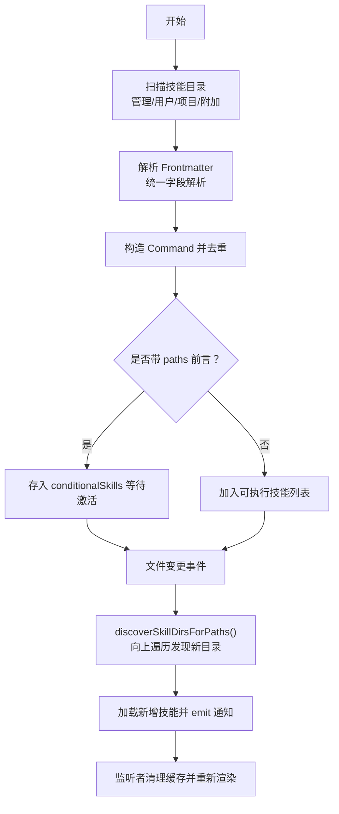
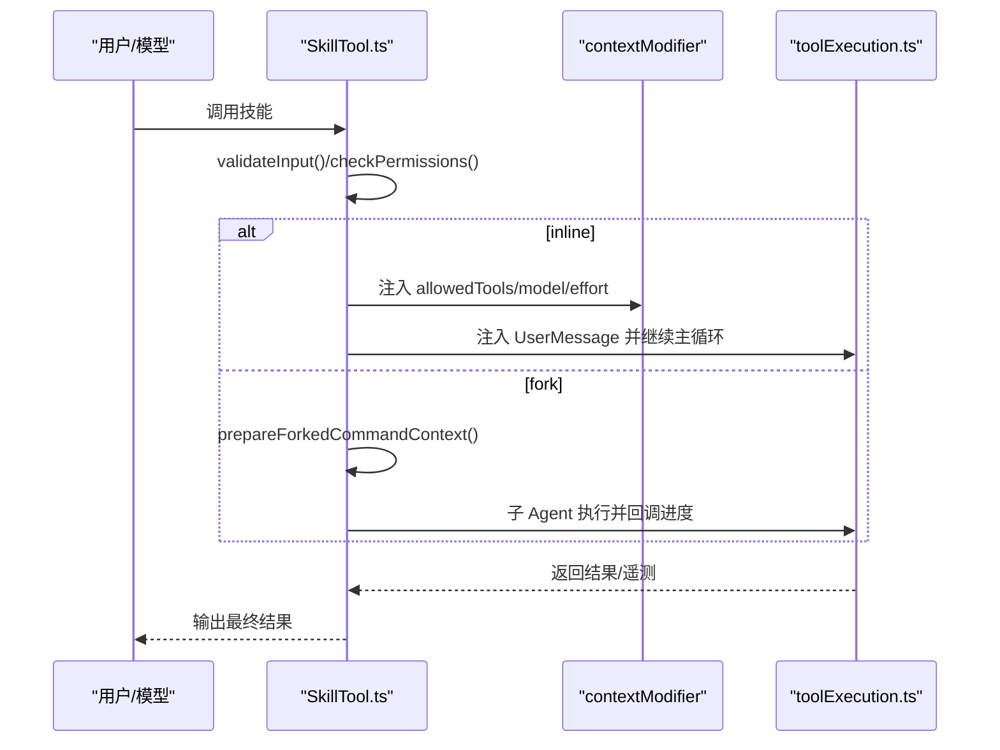
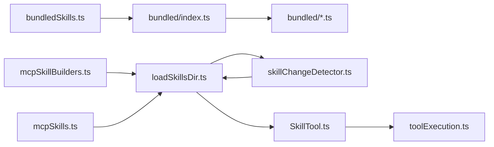

# 技能系统

<cite>
**本文引用的文件**
- [bundledSkills.ts](file://src/skills/bundledSkills.ts)
- [loadSkillsDir.ts](file://src/skills/loadSkillsDir.ts)
- [mcpSkillBuilders.ts](file://src/skills/mcpSkillBuilders.ts)
- [mcpSkills.ts](file://src/skills/mcpSkills.ts)
- [index.ts（内置技能入口）](file://src/skills/bundled/index.ts)
- [batch.ts（内置技能示例）](file://src/skills/bundled/batch.ts)
- [skillChangeDetector.ts](file://src/utils/skills/skillChangeDetector.ts)
- [skills.mdx（官方文档）](file://docs/extensibility/skills.mdx)
- [SkillTool.ts](file://src/tools/SkillTool/SkillTool.ts)
- [toolExecution.ts](file://src/services/tools/toolExecution.ts)
- [init.ts（技能初始化引导）](file://src/commands/init.ts)
</cite>

## 目录
1. [简介](#简介)
2. [项目结构](#项目结构)
3. [核心组件](#核心组件)
4. [架构总览](#架构总览)
5. [详细组件分析](#详细组件分析)
6. [依赖关系分析](#依赖关系分析)
7. [性能考量](#性能考量)
8. [故障排查指南](#故障排查指南)
9. [结论](#结论)
10. [附录](#附录)

## 简介
本文件系统性阐述 Claude Code 的“技能”体系：从定义、加载、动态发现、生命周期管理，到执行机制与权限控制，并提供开发指南、调试技巧与最佳实践。技能以“Prompt 即能力”的理念实现，通过声明式 Frontmatter 与可选的参考文件，将复杂工作流封装为可复用的命令单元。

## 项目结构
技能系统主要分布在以下模块：
- 技能定义与注册：bundledSkills.ts、bundled/index.ts、bundled/*.ts
- 技能加载与去重：loadSkillsDir.ts
- 动态发现与热更新：skillChangeDetector.ts
- MCP 技能桥接：mcpSkillBuilders.ts、mcpSkills.ts
- 执行与工具集成：SkillTool.ts、toolExecution.ts
- 文档与使用说明：skills.mdx
- 初始化与引导：init.ts

**图表来源**
- [bundledSkills.ts](file://src/skills/bundledSkills.ts)
- [loadSkillsDir.ts](file://src/skills/loadSkillsDir.ts)
- [skillChangeDetector.ts](file://src/utils/skills/skillChangeDetector.ts)
- [SkillTool.ts](file://src/tools/SkillTool/SkillTool.ts)
- [toolExecution.ts](file://src/services/tools/toolExecution.ts)
- [skills.mdx](file://docs/extensibility/skills.mdx)
- [init.ts](file://src/commands/init.ts)

**章节来源**
- [bundledSkills.ts](file://src/skills/bundledSkills.ts)
- [loadSkillsDir.ts](file://src/skills/loadSkillsDir.ts)
- [skillChangeDetector.ts](file://src/utils/skills/skillChangeDetector.ts)
- [skills.mdx](file://docs/extensibility/skills.mdx)

## 核心组件
- BundledSkillDefinition 接口：定义内置技能的元数据与 Prompt 生成函数，支持参考文件抽取、禁用模型调用、用户可调用性、Agent/上下文/钩子等扩展点。
- 注册与提取：registerBundledSkill 将定义转为 Command；首次调用时惰性解压 files 并在 Prompt 前添加“基础目录”前缀。
- 加载与去重：loadSkillsDir 统一解析 Frontmatter、构造 Command、去重（realpath + seenFileIds）、条件技能存储与合并。
- 动态发现：discoverSkillDirsForPaths 基于文件路径向上遍历发现新技能目录；skillChangeDetector 基于 chokidar 监听变更并批量重载。
- 执行与权限：SkillTool 根据 context 分支 inline/fork；工具执行阶段记录遥测与输入摘要；权限检查遵循四层策略（Deny/Allow/Safe Properties/用户确认）。

**章节来源**
- [bundledSkills.ts](file://src/skills/bundledSkills.ts)
- [loadSkillsDir.ts](file://src/skills/loadSkillsDir.ts)
- [skillChangeDetector.ts](file://src/utils/skills/skillChangeDetector.ts)
- [SkillTool.ts](file://src/tools/SkillTool/SkillTool.ts)
- [toolExecution.ts](file://src/services/tools/toolExecution.ts)

## 架构总览
技能系统采用“声明式 Prompt + 可插拔加载 + 动态发现 + 双执行模式”的架构，贯穿从磁盘到内存、从解析到执行的完整链路。

**图表来源**
- [loadSkillsDir.ts](file://src/skills/loadSkillsDir.ts)
- [mcpSkillBuilders.ts](file://src/skills/mcpSkillBuilders.ts)
- [SkillTool.ts](file://src/tools/SkillTool/SkillTool.ts)
- [toolExecution.ts](file://src/services/tools/toolExecution.ts)

## 详细组件分析

### BundledSkillDefinition 与内置技能
- 接口要点：name/description/aliases/whenToUse/argumentHint/allowedTools/model/disableModelInvocation/userInvocable/isEnabled/hooks/context/agent/files/getPromptForCommand。
- 注册流程：registerBundledSkill 将定义包装为 Command；若声明 files，则在首次调用时惰性解压到受控目录，并在 Prompt 前添加“基础目录”前缀。
- 内置技能入口：initBundledSkills 在启动时集中注册，按特性开关与运行环境启用特定技能。

**图表来源**
- [bundledSkills.ts](file://src/skills/bundledSkills.ts)

**章节来源**
- [bundledSkills.ts](file://src/skills/bundledSkills.ts)
- [index.ts（内置技能入口）](file://src/skills/bundled/index.ts)
- [batch.ts（内置技能示例）](file://src/skills/bundled/batch.ts)

### 技能加载与动态发现
- 加载路径：管理策略、用户全局、项目级、附加目录、旧版 commands 目录；支持 memoize 缓存与去重（realpath + seenFileIds）。
- 条件激活：paths 前言字段匹配被编辑文件时，从 conditionalSkills 移入 dynamicSkills。
- 动态发现：discoverSkillDirsForPaths 从文件路径向上遍历至 CWD，过滤 gitignored，按深度排序，触发 onDynamicSkillsLoaded 通知监听者清理缓存。

**图表来源**
- [loadSkillsDir.ts](file://src/skills/loadSkillsDir.ts)
- [skillChangeDetector.ts](file://src/utils/skills/skillChangeDetector.ts)

**章节来源**
- [loadSkillsDir.ts](file://src/skills/loadSkillsDir.ts)
- [skillChangeDetector.ts](file://src/utils/skills/skillChangeDetector.ts)

### 执行机制与权限控制
- 执行分支：SkillTool 根据 command.context 决定 inline（主回合同步执行）或 fork（子 Agent 异步执行）。
- 参数与工具：processPromptSlashCommand 处理 $ARGUMENTS 与 shell 命令展开；contextModifier 注入 allowedTools、模型覆盖与 effort。
- 权限模型：四层检查（Deny/Allow/Safe Properties/用户确认），Safe Properties 白名单默认拒绝未知属性，保障正向安全。
- 遥测与日志：工具执行阶段提取输入摘要（可选），记录技能名称与 MCP 详情，便于审计与诊断。

**图表来源**
- [SkillTool.ts](file://src/tools/SkillTool/SkillTool.ts)
- [toolExecution.ts](file://src/services/tools/toolExecution.ts)

**章节来源**
- [SkillTool.ts](file://src/tools/SkillTool/SkillTool.ts)
- [toolExecution.ts](file://src/services/tools/toolExecution.ts)

### MCP 技能与远程技能
- MCP 技能：通过 registerMCPSkillBuilders 注册构建器，MCP Server 的 prompt 被转换为 Command；禁止在 MCP 技能中执行内联 shell 命令。
- 远程技能（实验）：支持从 gs://、https://、s3:// 等加载 canonical 名称的技能，经 Frontmatter 剥离与变量替换后直接注入，不走本地参数替换流程。

**章节来源**
- [mcpSkillBuilders.ts](file://src/skills/mcpSkillBuilders.ts)
- [mcpSkills.ts](file://src/skills/mcpSkills.ts)
- [skills.mdx](file://docs/extensibility/skills.mdx)

## 依赖关系分析
- 组件耦合
  - bundledSkills.ts 与 bundled/index.ts/具体技能文件形成“注册-实现”关系，低耦合高内聚。
  - loadSkillsDir.ts 作为中枢，被多处模块依赖（commands 合并、MCP 构建器、前端展示等）。
  - skillChangeDetector.ts 通过 onDynamicSkillsLoaded 与 loadSkillsDir.ts 解耦通信。
  - SkillTool.ts 依赖工具执行与权限检查，形成“调用-执行-反馈”的闭环。
- 外部依赖
  - chokidar 用于文件变更监听（Bun 下使用 polling 避免死锁）。
  - ignore 用于 paths 匹配与 gitignore 过滤。
  - fs/promises 与安全写入策略（O_NOFOLLOW|O_EXCL）保障 bundled 文件提取安全。

**图表来源**
- [bundledSkills.ts](file://src/skills/bundledSkills.ts)
- [loadSkillsDir.ts](file://src/skills/loadSkillsDir.ts)
- [skillChangeDetector.ts](file://src/utils/skills/skillChangeDetector.ts)
- [SkillTool.ts](file://src/tools/SkillTool/SkillTool.ts)
- [toolExecution.ts](file://src/services/tools/toolExecution.ts)
- [mcpSkillBuilders.ts](file://src/skills/mcpSkillBuilders.ts)
- [mcpSkills.ts](file://src/skills/mcpSkills.ts)

**章节来源**
- [bundledSkills.ts](file://src/skills/bundledSkills.ts)
- [loadSkillsDir.ts](file://src/skills/loadSkillsDir.ts)
- [skillChangeDetector.ts](file://src/utils/skills/skillChangeDetector.ts)
- [SkillTool.ts](file://src/tools/SkillTool/SkillTool.ts)
- [toolExecution.ts](file://src/services/tools/toolExecution.ts)
- [mcpSkillBuilders.ts](file://src/skills/mcpSkillBuilders.ts)
- [mcpSkills.ts](file://src/skills/mcpSkills.ts)

## 性能考量
- 加载与缓存
  - getSkillDirCommands 使用 memoize 缓存，避免重复扫描与解析。
  - 去重使用 realpath 并行计算，减少重复文件带来的 IO 与解析成本。
- 执行效率
  - inline 模式减少进程/线程开销；fork 模式适合长耗时任务，避免污染主回合同步上下文。
  - 允许工具白名单注入与模型/努力级别覆盖，降低不必要的重试与回退。
- 文件监控
  - chokidar 在 Bun 下启用 polling，降低死锁风险；通过 awaitWriteFinish 与 debounce 防止频繁重载。
- Prompt 预算
  - 1% 上下文窗口策略与三级降级（完整描述→均分→仅名称），保证技能列表注入的稳定性。

[本节为通用性能指导，无需特定文件引用]

## 故障排查指南
- 技能未显示或重复
  - 检查 realpath 去重与 seenFileIds 是否命中；确认路径是否被 gitignore 过滤。
  - 使用 getSkillsPath 确认加载目录来源（管理策略/用户/项目/附加）。
- 动态发现无效
  - 确认 discoverSkillDirsForPaths 的 CWD 边界与向上遍历逻辑；检查文件变更事件是否触发 onDynamicSkillsLoaded。
- 执行失败或权限被阻
  - 查看四层权限检查日志；核对 Safe Properties 白名单与用户确认流程。
- fork 执行异常
  - 检查子 Agent 上下文准备与 runAgent 调用；关注 onProgress 回调与结果提取。
- 遥测与日志
  - 开启 OTEL_LOG_TOOL_DETAILS 以获取工具输入摘要（含 bash 命令、MCP 服务器名、技能名等）。

**章节来源**
- [loadSkillsDir.ts](file://src/skills/loadSkillsDir.ts)
- [skillChangeDetector.ts](file://src/utils/skills/skillChangeDetector.ts)
- [SkillTool.ts](file://src/tools/SkillTool/SkillTool.ts)
- [toolExecution.ts](file://src/services/tools/toolExecution.ts)

## 结论
Claude Code 的技能系统以“声明式 Prompt + 可插拔加载 + 动态发现 + 双执行模式”为核心，结合严格的权限模型与 Prompt 预算策略，在保证安全性的同时提供了强大的可扩展性与易用性。通过内置技能、磁盘技能、MCP 技能与远程技能的统一抽象，开发者可以快速构建与迭代复杂工作流。

[本节为总结性内容，无需特定文件引用]

## 附录

### 技能生命周期管理
- 注册：registerBundledSkill（内置）或磁盘 Frontmatter（磁盘/MCP/旧版）。
- 激活：getSkillDirCommands 合并并去重；条件技能等待路径匹配；动态发现触发增量加载。
- 执行：SkillTool.validateInput → 权限检查 → inline/fork 执行 → 记录使用频率 → 输出结果。
- 更新：文件变更监听与批量重载，清理缓存并重新渲染。

**章节来源**
- [bundledSkills.ts](file://src/skills/bundledSkills.ts)
- [loadSkillsDir.ts](file://src/skills/loadSkillsDir.ts)
- [skillChangeDetector.ts](file://src/utils/skills/skillChangeDetector.ts)
- [SkillTool.ts](file://src/tools/SkillTool/SkillTool.ts)

### 技能分类与组织
- 内置技能：编译时打包，具备不可截断的 Prompt 预算特权，支持参考文件惰性提取。
- 用户技能：位于 ~/.claude/skills，用户可随时编辑与增删。
- 项目技能：位于 .claude/skills，按目录层级靠近文件的优先级更高。
- 市场技能（MCP/远程）：通过 MCP 服务器或远程 URL 动态加载，具备安全边界与权限控制。

**章节来源**
- [loadSkillsDir.ts](file://src/skills/loadSkillsDir.ts)
- [mcpSkillBuilders.ts](file://src/skills/mcpSkillBuilders.ts)
- [skills.mdx](file://docs/extensibility/skills.mdx)

### 技能开发指南
- 模板与规范
  - 使用 Frontmatter 定义 name/description/when_to_use/allowed-tools/arguments/model/context/agent/paths/hooks/shell 等字段。
  - 优先使用 $ARGUMENTS 与 ${CLAUDE_SESSION_ID}/${CLAUDE_SKILL_DIR} 变量，避免硬编码。
  - 若需引用参考文件，使用 files 字段并在 getPromptForCommand 中返回带“基础目录”前缀的内容块。
- 测试方法
  - 使用 skillChangeDetector.resetForTesting 覆盖时间阈值进行单元测试。
  - 通过 getSkillsPath 与 getSkillDirCommands 验证加载路径与去重行为。
- 性能优化
  - 合理设置 effort 与 model，避免不必要的窗口截断与重试。
  - 使用 paths 前言实现条件激活，减少无关技能对上下文的影响。
  - inline 模式适合短任务，fork 模式适合长任务与强隔离场景。
- 调试技巧
  - 开启 OTEL_LOG_TOOL_DETAILS 获取工具输入摘要。
  - 使用 getSkillsPath 确认加载目录来源，核对 realpath 去重与 seenFileIds。
  - 通过 onDynamicSkillsLoaded 订阅动态技能变更，验证缓存清理与重新渲染。

**章节来源**
- [skills.mdx](file://docs/extensibility/skills.mdx)
- [bundledSkills.ts](file://src/skills/bundledSkills.ts)
- [loadSkillsDir.ts](file://src/skills/loadSkillsDir.ts)
- [skillChangeDetector.ts](file://src/utils/skills/skillChangeDetector.ts)
- [init.ts](file://src/commands/init.ts)