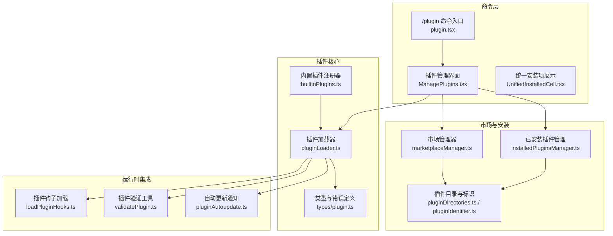
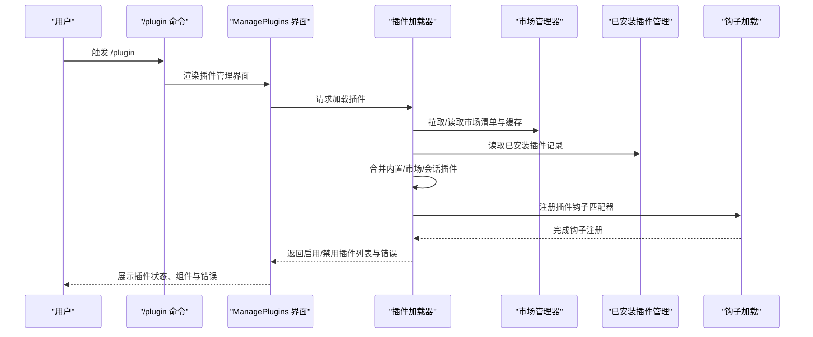
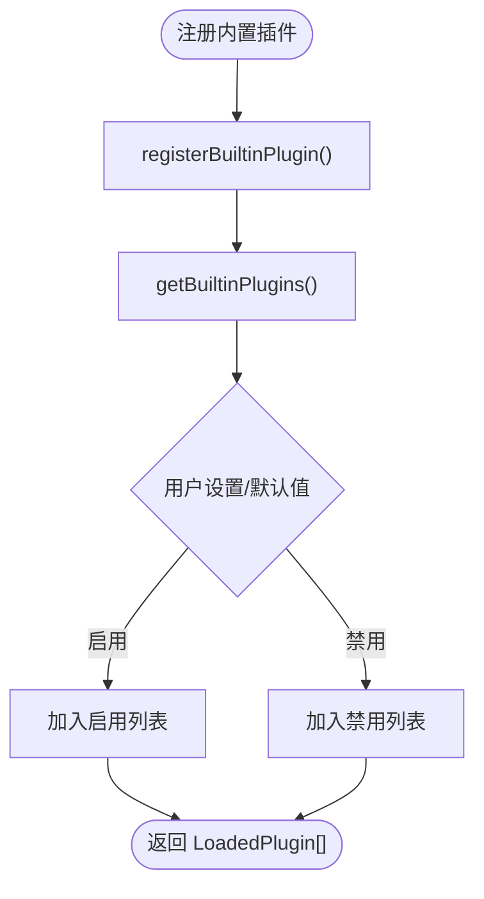
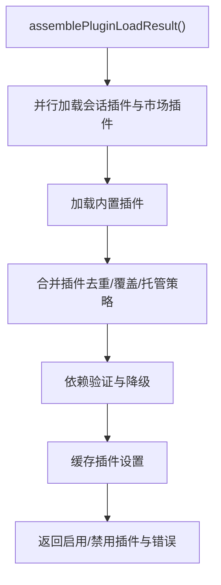
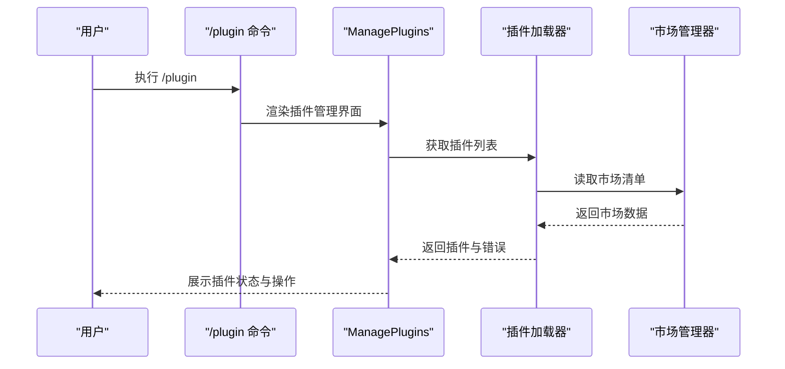
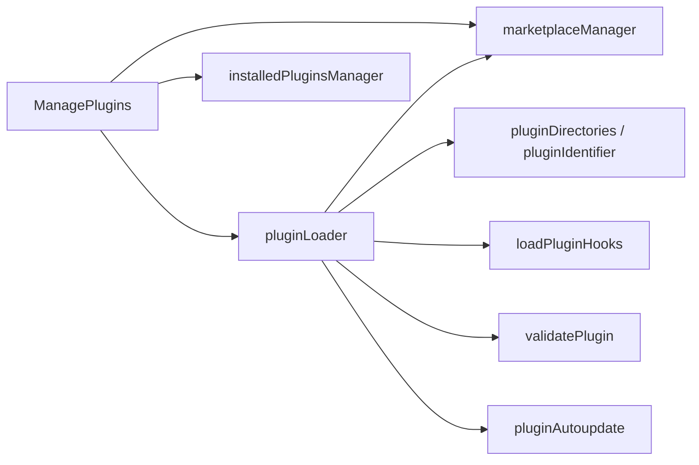

# 插件开发指南

<cite>
**本文档引用的文件**
- [builtinPlugins.ts](file://src/plugins/builtinPlugins.ts)
- [plugin.ts（类型定义）](file://src/types/plugin.ts)
- [plugin.ts（命令入口）](file://src/commands/plugin/plugin.tsx)
- [ManagePlugins.tsx](file://src/commands/plugin/ManagePlugins.tsx)
- [UnifiedInstalledCell.tsx](file://src/commands/plugin/UnifiedInstalledCell.tsx)
- [BrowseMarketplace.tsx](file://src/commands/plugin/BrowseMarketplace.tsx)
- [DiscoverPlugins.tsx](file://src/commands/plugin/DiscoverPlugins.tsx)
- [pluginLoader.ts](file://src/utils/plugins/pluginLoader.ts)
- [loadPluginHooks.ts](file://src/utils/plugins/loadPluginHooks.ts)
- [validatePlugin.ts](file://src/utils/plugins/validatePlugin.ts)
- [marketplaceManager.ts](file://src/utils/plugins/marketplaceManager.ts)
- [installedPluginsManager.ts](file://src/utils/plugins/installedPluginsManager.ts)
- [pluginAutoupdate.ts](file://src/utils/plugins/pluginAutoupdate.ts)
- [pluginDirectories.ts](file://src/utils/plugins/pluginDirectories.ts)
- [pluginIdentifier.ts](file://src/utils/plugins/pluginIdentifier.ts)
- [schemas.ts](file://src/utils/plugins/schemas.ts)
- [plugin.ts（技能定义）](file://src/skills/bundled/index.ts)
</cite>

## 目录
1. [简介](#简介)
2. [项目结构](#项目结构)
3. [核心组件](#核心组件)
4. [架构总览](#架构总览)
5. [详细组件分析](#详细组件分析)
6. [依赖关系分析](#依赖关系分析)
7. [性能考虑](#性能考虑)
8. [故障排除指南](#故障排除指南)
9. [结论](#结论)
10. [附录](#附录)

## 简介
本指南面向希望在 Claude Code 中开发与分发插件的开发者，覆盖从项目初始化、开发环境搭建、插件结构设计、接口规范、开发工具与调试、测试策略到发布与分发的完整流程。文档基于仓库中的实际实现进行提炼，确保内容可操作且与现有系统无缝衔接。

## 项目结构
Claude Code 的插件体系由“内置插件注册器”、“插件加载器”、“市场与安装管理”、“命令与技能加载”、“钩子系统”等多个模块协同组成。下图展示了与插件开发最相关的模块关系：

**图表来源**
- [plugin.tsx:1-7](file://src/commands/plugin/plugin.tsx#L1-L7)
- [ManagePlugins.tsx:1-200](file://src/commands/plugin/ManagePlugins.tsx#L1-L200)
- [builtinPlugins.ts:1-160](file://src/plugins/builtinPlugins.ts#L1-L160)
- [pluginLoader.ts:1-120](file://src/utils/plugins/pluginLoader.ts#L1-L120)
- [marketplaceManager.ts:90-2267](file://src/utils/plugins/marketplaceManager.ts#L90-L2267)
- [installedPluginsManager.ts:468-505](file://src/utils/plugins/installedPluginsManager.ts#L468-L505)
- [loadPluginHooks.ts:1-215](file://src/utils/plugins/loadPluginHooks.ts#L1-L215)
- [validatePlugin.ts:1-120](file://src/utils/plugins/validatePlugin.ts#L1-L120)
- [pluginAutoupdate.ts:37-78](file://src/utils/plugins/pluginAutoupdate.ts#L37-L78)

**章节来源**
- [plugin.tsx:1-7](file://src/commands/plugin/plugin.tsx#L1-L7)
- [ManagePlugins.tsx:1-200](file://src/commands/plugin/ManagePlugins.tsx#L1-L200)
- [builtinPlugins.ts:1-160](file://src/plugins/builtinPlugins.ts#L1-L160)
- [pluginLoader.ts:1-120](file://src/utils/plugins/pluginLoader.ts#L1-L120)
- [marketplaceManager.ts:90-2267](file://src/utils/plugins/marketplaceManager.ts#L90-L2267)
- [installedPluginsManager.ts:468-505](file://src/utils/plugins/installedPluginsManager.ts#L468-L505)
- [loadPluginHooks.ts:1-215](file://src/utils/plugins/loadPluginHooks.ts#L1-L215)
- [validatePlugin.ts:1-120](file://src/utils/plugins/validatePlugin.ts#L1-L120)
- [pluginAutoupdate.ts:37-78](file://src/utils/plugins/pluginAutoupdate.ts#L37-L78)

## 核心组件
- 内置插件注册器：负责注册与枚举内置插件，支持启用/禁用状态持久化与默认可用性检查。
- 插件加载器：统一发现、拉取、缓存、校验与合并多源插件（内置、市场、会话级），并生成 LoadedPlugin 结构。
- 市场与安装管理：维护市场清单、插件缓存、安装路径与版本解析；支持本地/远程/种子缓存优先级。
- 钩子系统：将插件钩子转换为运行时匹配器，支持热重载与变更检测。
- 命令与界面：提供 /plugin 命令入口与交互式插件管理界面，支持浏览、安装、配置、启用/禁用、卸载与错误查看。
- 验证工具：对 plugin.json、marketplace.json 与组件 Markdown 前言块进行严格校验，输出错误与警告。
- 自动更新通知：向 REPL 等消费者推送插件自动更新事件，便于提示重启或刷新。

**章节来源**
- [builtinPlugins.ts:1-160](file://src/plugins/builtinPlugins.ts#L1-L160)
- [pluginLoader.ts:1-120](file://src/utils/plugins/pluginLoader.ts#L1-L120)
- [marketplaceManager.ts:90-2267](file://src/utils/plugins/marketplaceManager.ts#L90-L2267)
- [installedPluginsManager.ts:468-505](file://src/utils/plugins/installedPluginsManager.ts#L468-L505)
- [loadPluginHooks.ts:1-215](file://src/utils/plugins/loadPluginHooks.ts#L1-L215)
- [plugin.tsx:1-7](file://src/commands/plugin/plugin.tsx#L1-L7)
- [ManagePlugins.tsx:1-200](file://src/commands/plugin/ManagePlugins.tsx#L1-L200)
- [validatePlugin.ts:1-120](file://src/utils/plugins/validatePlugin.ts#L1-L120)
- [pluginAutoupdate.ts:37-78](file://src/utils/plugins/pluginAutoupdate.ts#L37-L78)

## 架构总览
下图展示了插件从“被发现”到“被使用”的端到端流程，包括内置、市场与会话级插件的加载顺序与合并规则。

**图表来源**
- [plugin.tsx:1-7](file://src/commands/plugin/plugin.tsx#L1-L7)
- [ManagePlugins.tsx:1-200](file://src/commands/plugin/ManagePlugins.tsx#L1-L200)
- [pluginLoader.ts:3066-3211](file://src/utils/plugins/pluginLoader.ts#L3066-L3211)
- [marketplaceManager.ts:90-2267](file://src/utils/plugins/marketplaceManager.ts#L90-L2267)
- [installedPluginsManager.ts:468-505](file://src/utils/plugins/installedPluginsManager.ts#L468-L505)
- [loadPluginHooks.ts:250-287](file://src/utils/plugins/loadPluginHooks.ts#L250-L287)

**章节来源**
- [plugin.tsx:1-7](file://src/commands/plugin/plugin.tsx#L1-L7)
- [ManagePlugins.tsx:1-200](file://src/commands/plugin/ManagePlugins.tsx#L1-L200)
- [pluginLoader.ts:3066-3211](file://src/utils/plugins/pluginLoader.ts#L3066-L3211)
- [marketplaceManager.ts:90-2267](file://src/utils/plugins/marketplaceManager.ts#L90-L2267)
- [installedPluginsManager.ts:468-505](file://src/utils/plugins/installedPluginsManager.ts#L468-L505)
- [loadPluginHooks.ts:250-287](file://src/utils/plugins/loadPluginHooks.ts#L250-L287)

## 详细组件分析

### 内置插件注册器（builtinPlugins）
- 职责：注册内置插件、判断是否内置、按用户设置返回启用/禁用列表、将内置技能转为命令对象。
- 关键点：
  - 插件 ID 使用 `{name}@builtin` 格式区分于市场插件。
  - 支持默认启用状态与可用性检查（如系统能力限制）。
  - 将内置技能定义映射为命令对象，便于在命令工具中使用。

**图表来源**
- [builtinPlugins.ts:25-128](file://src/plugins/builtinPlugins.ts#L25-L128)

**章节来源**
- [builtinPlugins.ts:1-160](file://src/plugins/builtinPlugins.ts#L1-L160)

### 插件加载器（pluginLoader）
- 职责：统一处理内置、市场与会话级插件的发现、下载/克隆、缓存、校验与合并。
- 加载顺序与合并规则：
  - 会话级插件（--plugin-dir）优先，若与已安装插件同名则覆盖（受托管策略限制）。
  - 已安装市场插件次之。
  - 内置插件最后。
- 缓存策略：支持版本化缓存、ZIP 缓存、种子缓存优先级与回退。
- 错误收集：对缺失路径、网络错误、清单解析失败、MCP/LSP 配置无效等进行分类记录。

**图表来源**
- [pluginLoader.ts:3155-3211](file://src/utils/plugins/pluginLoader.ts#L3155-L3211)

**章节来源**
- [pluginLoader.ts:1-120](file://src/utils/plugins/pluginLoader.ts#L1-L120)
- [pluginLoader.ts:2500-3299](file://src/utils/plugins/pluginLoader.ts#L2500-L3299)

### 市场与安装管理（marketplaceManager / installedPluginsManager）
- 市场管理器：
  - 维护已知市场配置与缓存目录。
  - 提供市场清单读取、插件条目查询、缓存清理等能力。
  - 支持种子市场注册与多种子优先级。
- 已安装插件管理：
  - 读写安装记录（V2 格式）。
  - 支持内存快照与磁盘直读，避免后台操作影响会话视图。
  - 提供数据清理与大小统计。

**章节来源**
- [marketplaceManager.ts:90-2267](file://src/utils/plugins/marketplaceManager.ts#L90-L2267)
- [installedPluginsManager.ts:468-505](file://src/utils/plugins/installedPluginsManager.ts#L468-L505)

### 钩子系统（loadPluginHooks）
- 职责：将插件 hooks 配置转换为运行时匹配器，支持热重载与变更检测。
- 特性：
  - 基于设置变更检测触发热重载。
  - 保留回调钩子，仅重新注册存活匹配器。
  - 提供重置热重载状态的测试入口。

**章节来源**
- [loadPluginHooks.ts:1-215](file://src/utils/plugins/loadPluginHooks.ts#L1-L215)
- [loadPluginHooks.ts:250-287](file://src/utils/plugins/loadPluginHooks.ts#L250-L287)

### 命令与界面（/plugin 命令与管理界面）
- 命令入口：/plugin 命令渲染插件设置界面。
- 管理界面：
  - 支持搜索、分页、详情查看、启用/禁用、卸载、配置与 MCP 服务器管理。
  - 统一展示内置、已安装与失败插件，以及独立 MCP 服务器。
  - 提供错误聚合与指引，支持一键刷新与数据清理。

**图表来源**
- [plugin.tsx:1-7](file://src/commands/plugin/plugin.tsx#L1-L7)
- [ManagePlugins.tsx:1-200](file://src/commands/plugin/ManagePlugins.tsx#L1-L200)
- [marketplaceManager.ts:90-2267](file://src/utils/plugins/marketplaceManager.ts#L90-L2267)
- [pluginLoader.ts:3066-3211](file://src/utils/plugins/pluginLoader.ts#L3066-L3211)

**章节来源**
- [plugin.tsx:1-7](file://src/commands/plugin/plugin.tsx#L1-L7)
- [ManagePlugins.tsx:1-200](file://src/commands/plugin/ManagePlugins.tsx#L1-L200)
- [UnifiedInstalledCell.tsx:1-160](file://src/commands/plugin/UnifiedInstalledCell.tsx#L1-L160)

### 插件验证工具（validatePlugin）
- 功能：对 plugin.json、marketplace.json 与组件 Markdown 前言块进行严格校验。
- 能力：
  - 检测路径穿越风险（安全）。
  - 对比市场条目与插件清单版本差异（避免误导）。
  - 校验 YAML 前言块语法与字段类型，输出错误与警告。
  - 对 hooks.json 进行硬性校验（运行时会直接失败）。

**章节来源**
- [validatePlugin.ts:1-120](file://src/utils/plugins/validatePlugin.ts#L1-L120)
- [validatePlugin.ts:129-305](file://src/utils/plugins/validatePlugin.ts#L129-L305)
- [validatePlugin.ts:309-507](file://src/utils/plugins/validatePlugin.ts#L309-L507)
- [validatePlugin.ts:517-711](file://src/utils/plugins/validatePlugin.ts#L517-L711)

### 自动更新通知（pluginAutoupdate）
- 功能：向 REPL 等消费者推送插件自动更新事件，处理竞态条件与延迟通知。
- 机制：
  - 注册回调以接收更新事件。
  - 在回调注册前发生的更新会立即补发。
  - 提供获取待更新插件名称列表的能力。

**章节来源**
- [pluginAutoupdate.ts:37-78](file://src/utils/plugins/pluginAutoupdate.ts#L37-L78)

## 依赖关系分析
- 组件耦合：
  - ManagePlugins 依赖插件加载器、市场管理器与已安装插件管理器，用于构建统一视图。
  - 插件加载器依赖市场管理器、目录与标识工具、版本与缓存工具，以及钩子加载器。
  - 验证工具独立于运行时加载链，作为开发期 lint 工具存在。
- 外部依赖：
  - Git 与网络访问用于远程插件安装与市场清单拉取。
  - 文件系统用于缓存、ZIP 压缩与目录复制。
- 循环依赖：
  - 未见明显循环依赖；钩子加载器通过状态模块注册回调，避免直接循环。

**图表来源**
- [ManagePlugins.tsx:1-200](file://src/commands/plugin/ManagePlugins.tsx#L1-L200)
- [pluginLoader.ts:1-120](file://src/utils/plugins/pluginLoader.ts#L1-L120)
- [marketplaceManager.ts:90-2267](file://src/utils/plugins/marketplaceManager.ts#L90-L2267)
- [installedPluginsManager.ts:468-505](file://src/utils/plugins/installedPluginsManager.ts#L468-L505)
- [loadPluginHooks.ts:1-215](file://src/utils/plugins/loadPluginHooks.ts#L1-L215)
- [validatePlugin.ts:1-120](file://src/utils/plugins/validatePlugin.ts#L1-L120)
- [pluginAutoupdate.ts:37-78](file://src/utils/plugins/pluginAutoupdate.ts#L37-L78)

**章节来源**
- [ManagePlugins.tsx:1-200](file://src/commands/plugin/ManagePlugins.tsx#L1-L200)
- [pluginLoader.ts:1-120](file://src/utils/plugins/pluginLoader.ts#L1-L120)
- [marketplaceManager.ts:90-2267](file://src/utils/plugins/marketplaceManager.ts#L90-L2267)
- [installedPluginsManager.ts:468-505](file://src/utils/plugins/installedPluginsManager.ts#L468-L505)
- [loadPluginHooks.ts:1-215](file://src/utils/plugins/loadPluginHooks.ts#L1-L215)
- [validatePlugin.ts:1-120](file://src/utils/plugins/validatePlugin.ts#L1-L120)
- [pluginAutoupdate.ts:37-78](file://src/utils/plugins/pluginAutoupdate.ts#L37-L78)

## 性能考虑
- 缓存优先级：版本化缓存优先于种子缓存，ZIP 缓存减少磁盘占用与 IO。
- 并行加载：会话插件与市场插件并行加载，缩短启动时间。
- 选择性扫描：缓存只读模式下不触网，避免阻塞交互启动。
- 热重载优化：仅在设置发生实际变化时触发钩子重载，减少不必要的重建。

[本节为通用指导，无需特定文件引用]

## 故障排除指南
- 常见错误类型（部分）：
  - 路径不存在、网络错误、清单解析失败、清单校验失败、插件未找到、市场未找到、MCP/LSP 配置无效、请求超时/失败、依赖未满足、缓存缺失等。
- 定位与处理：
  - 使用插件管理界面的“错误”标签查看具体错误与指引。
  - 使用验证工具对 plugin.json、marketplace.json 与组件前言块进行诊断。
  - 清理缓存后重试（清空插件缓存、市场缓存、安装记录）。
  - 检查托管策略与企业策略对插件的限制。

**章节来源**
- [plugin.ts（类型定义）:101-283](file://src/types/plugin.ts#L101-L283)
- [ManagePlugins.tsx:1-200](file://src/commands/plugin/ManagePlugins.tsx#L1-L200)
- [validatePlugin.ts:1-120](file://src/utils/plugins/validatePlugin.ts#L1-L120)

## 结论
本指南梳理了 Claude Code 插件开发的全生命周期：从结构设计、接口规范、开发与调试工具，到测试与发布流程。依托内置插件注册器、插件加载器与市场/安装管理器，开发者可以快速构建并分发高质量插件，同时借助钩子系统与验证工具保障运行时稳定性与开发体验。

[本节为总结，无需特定文件引用]

## 附录

### 插件接口规范与必需字段
- 插件清单（plugin.json）：
  - 必需字段：name、description（建议）、version（建议）。
  - 可选字段：author、commands、agents、skills、hooks、outputStyles、mcpServers 等。
  - 注意：commands/agents/skills/hooks/outputStyles 在非严格模式下与 marketplace.json 冲突会被拒绝。
- 市场清单（marketplace.json）：
  - 必需字段：metadata（建议含描述）、plugins 数组。
  - 插件条目：name、source（本地相对路径或远程 URL）、version（可选，但建议与插件清单一致）。
- 插件组件（Markdown 前言块）：
  - 必需字段：description（建议）。
  - 其他常用字段：name、allowed-tools、shell 等。

**章节来源**
- [validatePlugin.ts:129-305](file://src/utils/plugins/validatePlugin.ts#L129-L305)
- [validatePlugin.ts:309-507](file://src/utils/plugins/validatePlugin.ts#L309-L507)
- [validatePlugin.ts:517-711](file://src/utils/plugins/validatePlugin.ts#L517-L711)
- [schemas.ts](file://src/utils/plugins/schemas.ts)

### 开发环境与工具
- 开发服务器与热重载：
  - 通过会话级插件（--plugin-dir）与内置插件注册器实现本地迭代与覆盖。
  - 钩子系统支持热重载，当策略设置变化时自动重新注册匹配器。
- 调试与验证：
  - 使用插件验证工具对清单与组件进行严格校验。
  - 利用插件管理界面查看错误与组件详情。
- 自动更新：
  - 通过自动更新通知机制向 REPL 推送更新事件，便于提示重启或刷新。

**章节来源**
- [pluginLoader.ts:2928-2993](file://src/utils/plugins/pluginLoader.ts#L2928-L2993)
- [loadPluginHooks.ts:250-287](file://src/utils/plugins/loadPluginHooks.ts#L250-L287)
- [validatePlugin.ts:1-120](file://src/utils/plugins/validatePlugin.ts#L1-L120)
- [pluginAutoupdate.ts:37-78](file://src/utils/plugins/pluginAutoupdate.ts#L37-L78)

### 测试策略
- 单元测试：
  - 对插件验证逻辑、路径穿越检测、清单解析与校验进行单元测试。
- 集成测试：
  - 模拟插件加载流程（内置/市场/会话），验证合并与错误收集。
  - 验证钩子热重载与设置变更检测。
- 性能测试：
  - 测量缓存命中率、并行加载耗时、ZIP 缓存与种子缓存的 I/O 影响。

**章节来源**
- [validatePlugin.ts:1-120](file://src/utils/plugins/validatePlugin.ts#L1-L120)
- [pluginLoader.ts:3066-3211](file://src/utils/plugins/pluginLoader.ts#L3066-L3211)
- [loadPluginHooks.ts:250-287](file://src/utils/plugins/loadPluginHooks.ts#L250-L287)

### 发布与分发流程
- 准备清单：
  - 确保 plugin.json 字段完整且符合规范。
  - 若使用市场分发，准备 marketplace.json 并保证 source 与版本一致性。
- 安装与验证：
  - 通过市场安装或本地会话插件方式加载。
  - 使用验证工具与管理界面确认无错误。
- 更新与分发：
  - 使用自动更新通知机制提示用户重启或刷新。
  - 通过市场更新或种子缓存提升分发效率。

**章节来源**
- [marketplaceManager.ts:90-2267](file://src/utils/plugins/marketplaceManager.ts#L90-L2267)
- [pluginAutoupdate.ts:37-78](file://src/utils/plugins/pluginAutoupdate.ts#L37-L78)
- [pluginLoader.ts:1-120](file://src/utils/plugins/pluginLoader.ts#L1-L120)

### 示例参考
- 简单工具插件：参考内置插件注册器中的技能定义与命令映射方式。
- 复杂功能模块：参考插件加载器对多组件（commands/agents/skills/hooks/mcpServers）的处理与错误收集。

**章节来源**
- [builtinPlugins.ts:132-160](file://src/plugins/builtinPlugins.ts#L132-L160)
- [pluginLoader.ts:2500-3299](file://src/utils/plugins/pluginLoader.ts#L2500-L3299)