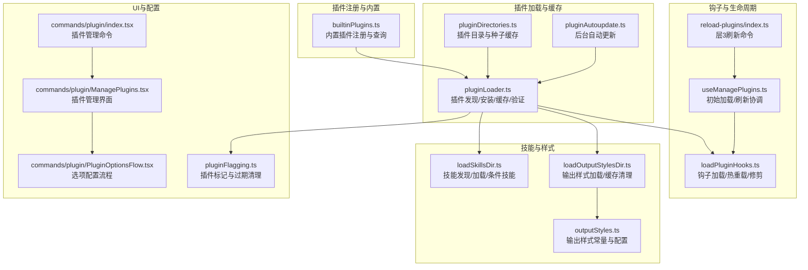
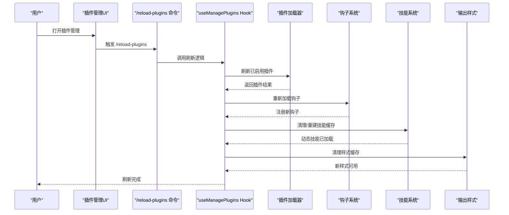
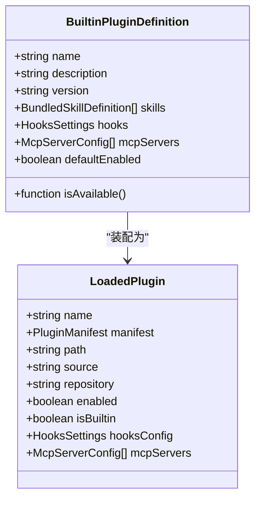
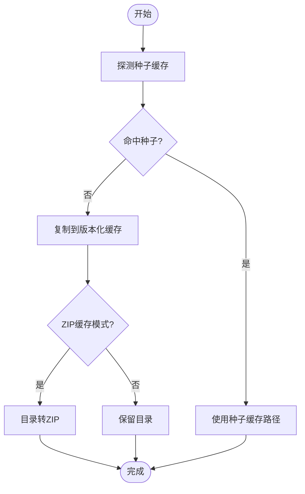
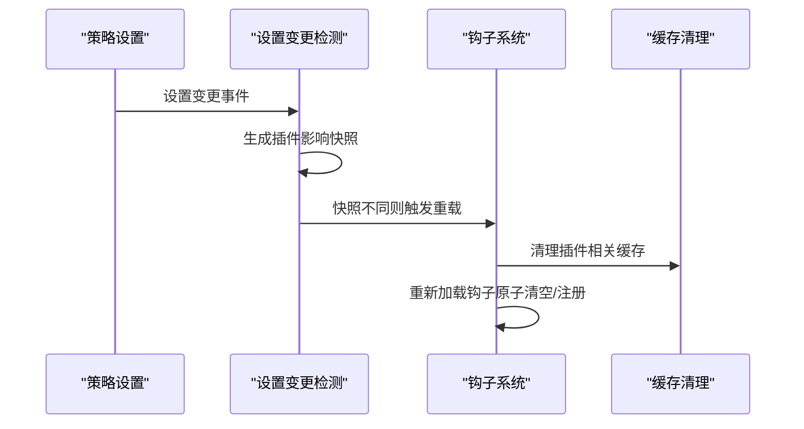
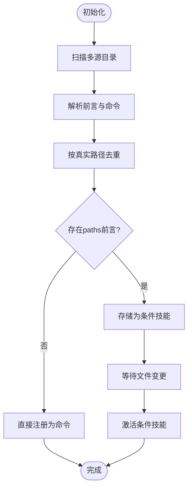
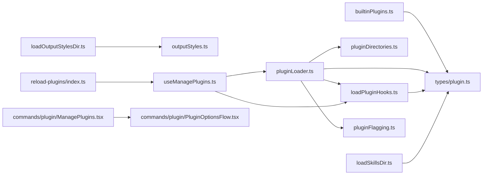

# 插件扩展系统

<cite>
**本文档引用的文件**
- [builtinPlugins.ts](file://src/plugins/builtinPlugins.ts)
- [loadPluginHooks.ts](file://src/utils/plugins/loadPluginHooks.ts)
- [pluginLoader.ts](file://src/utils/plugins/pluginLoader.ts)
- [pluginDirectories.ts](file://src/utils/plugins/pluginDirectories.ts)
- [pluginAutoupdate.ts](file://src/utils/plugins/pluginAutoupdate.ts)
- [loadSkillsDir.ts](file://src/skills/loadSkillsDir.ts)
- [loadOutputStylesDir.ts](file://src/outputStyles/loadOutputStylesDir.ts)
- [outputStyles.ts](file://src/constants/outputStyles.ts)
- [useManagePlugins.ts](file://src/hooks/useManagePlugins.ts)
- [index.tsx](file://src/commands/plugin/index.tsx)
- [index.ts](file://src/commands/reload-plugins/index.ts)
- [plugin.tsx](file://src/commands/plugin/ManagePlugins.tsx)
- [pluginOptionsFlow.tsx](file://src/commands/plugin/PluginOptionsFlow.tsx)
- [pluginFlagging.ts](file://src/utils/plugins/pluginFlagging.ts)
- [plugin.ts](file://src/types/plugin.ts)
</cite>

## 目录
1. [简介](#简介)
2. [项目结构](#项目结构)
3. [核心组件](#核心组件)
4. [架构总览](#架构总览)
5. [详细组件分析](#详细组件分析)
6. [依赖关系分析](#依赖关系分析)
7. [性能考虑](#性能考虑)
8. [故障排除指南](#故障排除指南)
9. [结论](#结论)
10. [附录](#附录)

## 简介
本文件系统性阐述 Claude Code 的插件扩展系统，涵盖插件注册机制、生命周期管理、依赖解析、热重载与自动更新、以及内置插件的分类与功能。重点包括技能系统（Skills）、钩子机制（Hooks）、输出样式（Output Styles）、命令扩展等核心组件，并提供插件开发规范、技能系统实现原理、开发指南与最佳实践。

## 项目结构
插件系统围绕以下关键模块组织：
- 插件注册与内置插件：通过注册表管理内置插件，支持用户启用/禁用与默认状态控制。
- 插件加载器：负责从市场、本地或种子目录发现、安装、缓存与验证插件，支持版本化缓存与 ZIP 缓存。
- 钩子系统：集中加载与注册插件钩子，支持热重载与按需修剪。
- 技能系统：动态发现与加载技能，支持条件技能与缓存信号。
- 输出样式：从项目与用户目录加载自定义输出样式，支持插件样式注入与缓存清理。
- 生命周期与刷新：通过命令与 Hook 协调初始加载、变更检测与层3刷新（/reload-plugins）。
- 自动更新：后台自动更新市场与插件，非就地更新，需要重启生效。

**图表来源**
- [builtinPlugins.ts:1-160](file://src/plugins/builtinPlugins.ts#L1-L160)
- [pluginLoader.ts:1-800](file://src/utils/plugins/pluginLoader.ts#L1-L800)
- [pluginDirectories.ts:1-179](file://src/utils/plugins/pluginDirectories.ts#L1-L179)
- [pluginAutoupdate.ts:1-285](file://src/utils/plugins/pluginAutoupdate.ts#L1-L285)
- [loadPluginHooks.ts:1-288](file://src/utils/plugins/loadPluginHooks.ts#L1-L288)
- [useManagePlugins.ts:26-55](file://src/hooks/useManagePlugins.ts#L26-L55)
- [index.ts:1-19](file://src/commands/reload-plugins/index.ts#L1-L19)
- [loadSkillsDir.ts:1-800](file://src/skills/loadSkillsDir.ts#L1-L800)
- [loadOutputStylesDir.ts:1-99](file://src/outputStyles/loadOutputStylesDir.ts#L1-L99)
- [outputStyles.ts:1-27](file://src/constants/outputStyles.ts#L1-L27)
- [index.tsx:1-11](file://src/commands/plugin/index.tsx#L1-L11)
- [plugin.tsx:1660-1734](file://src/commands/plugin/ManagePlugins.tsx#L1660-L1734)
- [pluginOptionsFlow.tsx:1-33](file://src/commands/plugin/PluginOptionsFlow.tsx#L1-L33)
- [pluginFlagging.ts:86-144](file://src/utils/plugins/pluginFlagging.ts#L86-L144)

**章节来源**
- [builtinPlugins.ts:1-160](file://src/plugins/builtinPlugins.ts#L1-L160)
- [pluginLoader.ts:1-800](file://src/utils/plugins/pluginLoader.ts#L1-L800)
- [pluginDirectories.ts:1-179](file://src/utils/plugins/pluginDirectories.ts#L1-L179)
- [pluginAutoupdate.ts:1-285](file://src/utils/plugins/pluginAutoupdate.ts#L1-L285)
- [loadPluginHooks.ts:1-288](file://src/utils/plugins/loadPluginHooks.ts#L1-L288)
- [useManagePlugins.ts:26-55](file://src/hooks/useManagePlugins.ts#L26-L55)
- [index.ts:1-19](file://src/commands/reload-plugins/index.ts#L1-L19)
- [loadSkillsDir.ts:1-800](file://src/skills/loadSkillsDir.ts#L1-L800)
- [loadOutputStylesDir.ts:1-99](file://src/outputStyles/loadOutputStylesDir.ts#L1-L99)
- [outputStyles.ts:1-27](file://src/constants/outputStyles.ts#L1-L27)
- [index.tsx:1-11](file://src/commands/plugin/index.tsx#L1-L11)
- [plugin.tsx:1660-1734](file://src/commands/plugin/ManagePlugins.tsx#L1660-L1734)
- [pluginOptionsFlow.tsx:1-33](file://src/commands/plugin/PluginOptionsFlow.tsx#L1-L33)
- [pluginFlagging.ts:86-144](file://src/utils/plugins/pluginFlagging.ts#L86-L144)

## 核心组件
- 内置插件注册与查询：提供注册、可用性检查、默认状态与用户设置合并逻辑，生成可直接用于命令与钩子的 LoadedPlugin 对象。
- 插件加载器：统一处理市场、本地与种子缓存，支持版本化缓存、ZIP 缓存、依赖解析、清单校验与错误类型化。
- 钩子系统：集中转换与注册插件钩子，提供热重载订阅、变更快照比较与按需修剪，确保停用插件钩子即时停止。
- 技能系统：多源目录加载（策略、用户、项目、附加目录），去重、条件技能、动态发现与缓存信号。
- 输出样式：从项目与用户目录加载样式，支持插件样式注入与缓存清理。
- 生命周期与刷新：初始加载由 Hook 触发，后续变更通过 /reload-plugins 实现层3一致刷新模型。
- 自动更新：后台更新市场与插件，非就地更新，支持回调通知与待更新列表。

**章节来源**
- [builtinPlugins.ts:1-160](file://src/plugins/builtinPlugins.ts#L1-L160)
- [pluginLoader.ts:1-800](file://src/utils/plugins/pluginLoader.ts#L1-L800)
- [loadPluginHooks.ts:1-288](file://src/utils/plugins/loadPluginHooks.ts#L1-L288)
- [loadSkillsDir.ts:1-800](file://src/skills/loadSkillsDir.ts#L1-L800)
- [loadOutputStylesDir.ts:1-99](file://src/outputStyles/loadOutputStylesDir.ts#L1-L99)
- [useManagePlugins.ts:26-55](file://src/hooks/useManagePlugins.ts#L26-L55)
- [index.ts:1-19](file://src/commands/reload-plugins/index.ts#L1-L19)

## 架构总览
插件系统采用“注册表 + 加载器 + 钩子 + 技能 + 样式 + 生命周期”的分层设计。内置插件通过注册表统一管理；加载器负责发现与缓存；钩子系统提供事件驱动扩展点；技能与样式分别从多源目录加载并支持缓存；生命周期通过 Hook 与命令协调刷新。

**图表来源**
- [index.ts:1-19](file://src/commands/reload-plugins/index.ts#L1-L19)
- [useManagePlugins.ts:26-55](file://src/hooks/useManagePlugins.ts#L26-L55)
- [loadPluginHooks.ts:1-288](file://src/utils/plugins/loadPluginHooks.ts#L1-L288)
- [loadSkillsDir.ts:1-800](file://src/skills/loadSkillsDir.ts#L1-L800)
- [loadOutputStylesDir.ts:1-99](file://src/outputStyles/loadOutputStylesDir.ts#L1-L99)

## 详细组件分析

### 内置插件系统（Skills、Hooks、MCP）
- 注册机制：通过注册表维护内置插件定义，支持可用性检查与默认启用状态。
- 查询与装配：根据用户设置与默认值生成 LoadedPlugin，包含技能、钩子与 MCP 服务器配置。
- 与技能系统集成：内置插件的技能以“bundled”来源注入，保持与用户可切换的内置特性一致。

**图表来源**
- [builtinPlugins.ts:18-35](file://src/plugins/builtinPlugins.ts#L18-L35)
- [builtinPlugins.ts:48-102](file://src/plugins/builtinPlugins.ts#L48-L102)
- [plugin.ts:18-70](file://src/types/plugin.ts#L18-L70)

**章节来源**
- [builtinPlugins.ts:1-160](file://src/plugins/builtinPlugins.ts#L1-L160)
- [plugin.ts:18-70](file://src/types/plugin.ts#L18-L70)

### 插件加载器与缓存
- 发现与来源：优先市场插件，其次会话级插件；支持本地与种子缓存。
- 版本化缓存：按市场/插件/版本生成路径，支持 ZIP 缓存与种子命中。
- 安装与克隆：支持 git 仓库、子目录提取、NPM 包安装与浅克隆优化。
- 错误类型化：提供丰富的错误类型，便于 UI 展示与调试。

**图表来源**
- [pluginLoader.ts:195-238](file://src/utils/plugins/pluginLoader.ts#L195-L238)
- [pluginLoader.ts:365-465](file://src/utils/plugins/pluginLoader.ts#L365-L465)
- [pluginDirectories.ts:85-90](file://src/utils/plugins/pluginDirectories.ts#L85-L90)

**章节来源**
- [pluginLoader.ts:1-800](file://src/utils/plugins/pluginLoader.ts#L1-L800)
- [pluginDirectories.ts:1-179](file://src/utils/plugins/pluginDirectories.ts#L1-L179)

### 钩子机制与热重载
- 钩子加载：从已启用插件收集钩子配置，转换为匹配器并原子性清空/注册。
- 热重载：基于设置快照比较，仅在影响插件的设置变化时触发钩子重载。
- 按需修剪：禁用插件时立即移除其钩子，新增插件等待 /reload-plugins 应用。

**图表来源**
- [loadPluginHooks.ts:255-287](file://src/utils/plugins/loadPluginHooks.ts#L255-L287)
- [loadPluginHooks.ts:159-167](file://src/utils/plugins/loadPluginHooks.ts#L159-L167)
- [loadPluginHooks.ts:179-207](file://src/utils/plugins/loadPluginHooks.ts#L179-L207)

**章节来源**
- [loadPluginHooks.ts:1-288](file://src/utils/plugins/loadPluginHooks.ts#L1-L288)

### 技能系统实现原理
- 多源加载：策略、用户、项目与附加目录，支持裸模式与受限策略。
- 去重与条件技能：基于真实路径去重，支持 paths 前言字段的条件技能延迟激活。
- 动态发现：文件操作触发动态技能加载信号，监听者清理相关缓存。
- 性能：前言令牌估算、并行加载与缓存。

**图表来源**
- [loadSkillsDir.ts:638-800](file://src/skills/loadSkillsDir.ts#L638-L800)
- [loadSkillsDir.ts:831-851](file://src/skills/loadSkillsDir.ts#L831-L851)

**章节来源**
- [loadSkillsDir.ts:1-800](file://src/skills/loadSkillsDir.ts#L1-L800)

### 输出样式系统
- 加载策略：项目与用户目录样式合并，用户样式覆盖项目样式。
- 插件注入：插件可提供强制输出样式，冲突时选择一个并记录调试日志。
- 缓存清理：样式目录与 Markdown 加载缓存统一清理。

**章节来源**
- [loadOutputStylesDir.ts:1-99](file://src/outputStyles/loadOutputStylesDir.ts#L1-L99)
- [outputStyles.ts:1-27](file://src/constants/outputStyles.ts#L1-L27)

### 生命周期管理与刷新
- 初始加载：Hook 在挂载时一次性加载所有插件，执行下架策略与标记插件通知，并填充应用状态。
- 后续刷新：通过 /reload-plugins 统一刷新命令，协调命令、代理、钩子与 MCP 的层3交换。
- 变更检测：对需要刷新的状态显示通知，不自动刷新，保证一致性。

**章节来源**
- [useManagePlugins.ts:26-55](file://src/hooks/useManagePlugins.ts#L26-L55)
- [index.ts:1-19](file://src/commands/reload-plugins/index.ts#L1-L19)

### 自动更新与后台任务
- 市场与插件更新：仅对开启自动更新的市场进行刷新与插件更新，非就地更新，需要重启生效。
- 回调通知：支持注册回调接收更新完成通知，处理竞态场景。
- 待更新列表：提供获取自动更新插件名称的能力。

**章节来源**
- [pluginAutoupdate.ts:1-285](file://src/utils/plugins/pluginAutoupdate.ts#L1-L285)

### 插件开发规范与最佳实践
- 接口与清单：遵循插件清单与组件规范，确保 manifest 与 hooks 配置正确。
- 配置管理：使用用户配置与通道配置，提供安装后配置流程与持久化。
- 错误处理：利用类型化错误信息，提供清晰的 UI 提示与日志。
- 性能优化：使用缓存与并行加载，避免重复计算；合理使用去重与条件技能。
- 发布流程：通过市场管理与自动更新机制，确保插件版本与缓存一致性。

**章节来源**
- [plugin.ts:101-289](file://src/types/plugin.ts#L101-L289)
- [pluginOptionsFlow.tsx:1-33](file://src/commands/plugin/PluginOptionsFlow.tsx#L1-L33)
- [plugin.tsx:1660-1734](file://src/commands/plugin/ManagePlugins.tsx#L1660-L1734)

## 依赖关系分析

**图表来源**
- [builtinPlugins.ts:1-160](file://src/plugins/builtinPlugins.ts#L1-L160)
- [pluginLoader.ts:1-800](file://src/utils/plugins/pluginLoader.ts#L1-L800)
- [pluginDirectories.ts:1-179](file://src/utils/plugins/pluginDirectories.ts#L1-L179)
- [loadPluginHooks.ts:1-288](file://src/utils/plugins/loadPluginHooks.ts#L1-L288)
- [loadSkillsDir.ts:1-800](file://src/skills/loadSkillsDir.ts#L1-L800)
- [loadOutputStylesDir.ts:1-99](file://src/outputStyles/loadOutputStylesDir.ts#L1-L99)
- [outputStyles.ts:1-27](file://src/constants/outputStyles.ts#L1-L27)
- [useManagePlugins.ts:26-55](file://src/hooks/useManagePlugins.ts#L26-L55)
- [index.ts:1-19](file://src/commands/reload-plugins/index.ts#L1-L19)
- [plugin.tsx:1660-1734](file://src/commands/plugin/ManagePlugins.tsx#L1660-L1734)
- [pluginOptionsFlow.tsx:1-33](file://src/commands/plugin/PluginOptionsFlow.tsx#L1-L33)
- [pluginFlagging.ts:86-144](file://src/utils/plugins/pluginFlagging.ts#L86-L144)

**章节来源**
- [pluginLoader.ts:1-800](file://src/utils/plugins/pluginLoader.ts#L1-L800)
- [loadPluginHooks.ts:1-288](file://src/utils/plugins/loadPluginHooks.ts#L1-L288)
- [loadSkillsDir.ts:1-800](file://src/skills/loadSkillsDir.ts#L1-L800)
- [loadOutputStylesDir.ts:1-99](file://src/outputStyles/loadOutputStylesDir.ts#L1-L99)
- [useManagePlugins.ts:26-55](file://src/hooks/useManagePlugins.ts#L26-L55)
- [index.ts:1-19](file://src/commands/reload-plugins/index.ts#L1-L19)
- [plugin.tsx:1660-1734](file://src/commands/plugin/ManagePlugins.tsx#L1660-L1734)
- [pluginOptionsFlow.tsx:1-33](file://src/commands/plugin/PluginOptionsFlow.tsx#L1-L33)
- [pluginFlagging.ts:86-144](file://src/utils/plugins/pluginFlagging.ts#L86-L144)

## 性能考虑
- 缓存策略：版本化缓存与 ZIP 缓存减少网络与磁盘 IO；种子缓存提升首次启动速度。
- 并行加载：技能与钩子加载采用并行策略，降低整体延迟。
- 去重与懒加载：基于真实路径去重，技能内容按需加载，减少内存占用。
- 热重载优化：仅在设置发生实际变化时触发重载，避免不必要的重建。

[本节为通用指导，无需特定文件分析]

## 故障排除指南
- 插件未找到或清单错误：检查市场配置与清单格式，查看类型化错误信息。
- 钩子不生效：确认插件启用状态与热重载是否触发；必要时执行 /reload-plugins。
- 技能未出现：检查技能目录结构与前言配置，确认去重与条件技能逻辑。
- 输出样式异常：确认项目与用户目录样式优先级，清理样式缓存后重试。
- 插件标记与过期：关注标记插件列表与过期清理逻辑，避免使用已移除插件。

**章节来源**
- [plugin.ts:101-289](file://src/types/plugin.ts#L101-L289)
- [loadPluginHooks.ts:255-287](file://src/utils/plugins/loadPluginHooks.ts#L255-L287)
- [loadSkillsDir.ts:1-800](file://src/skills/loadSkillsDir.ts#L1-L800)
- [loadOutputStylesDir.ts:1-99](file://src/outputStyles/loadOutputStylesDir.ts#L1-L99)
- [pluginFlagging.ts:86-144](file://src/utils/plugins/pluginFlagging.ts#L86-L144)

## 结论
Claude Code 的插件扩展系统通过注册表、加载器、钩子、技能与样式五大支柱，实现了高可扩展、可热重载且具备自动更新能力的插件生态。内置插件与市场插件统一管理，生命周期通过 Hook 与命令协调，确保一致性与可观测性。开发者可依据类型化接口与配置流程快速构建高质量插件，并借助缓存与并行策略获得良好性能体验。

[本节为总结，无需特定文件分析]

## 附录
- 开发工具与测试：使用插件标识、安装辅助与错误类型化工具，结合单元测试与端到端测试验证插件行为。
- 发布流程：通过市场管理与自动更新机制，确保插件版本与缓存一致性，必要时提示用户执行 /reload-plugins 或重启。

[本节为补充说明，无需特定文件分析]